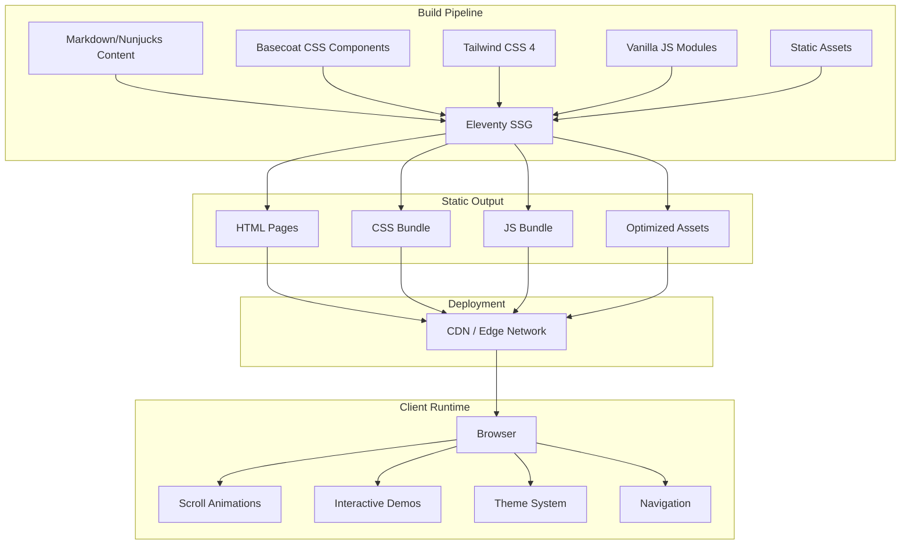
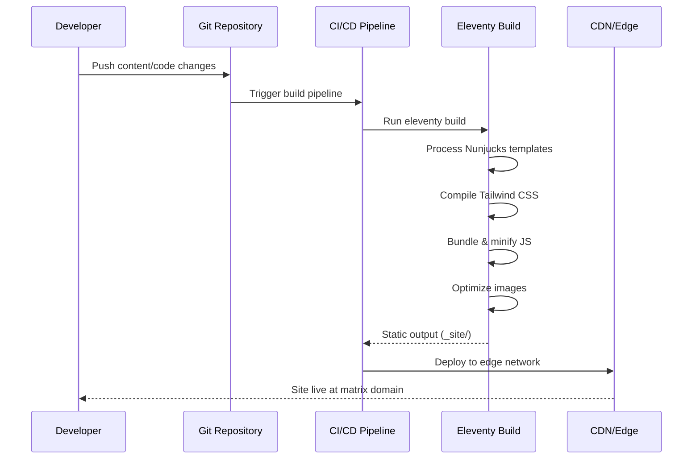
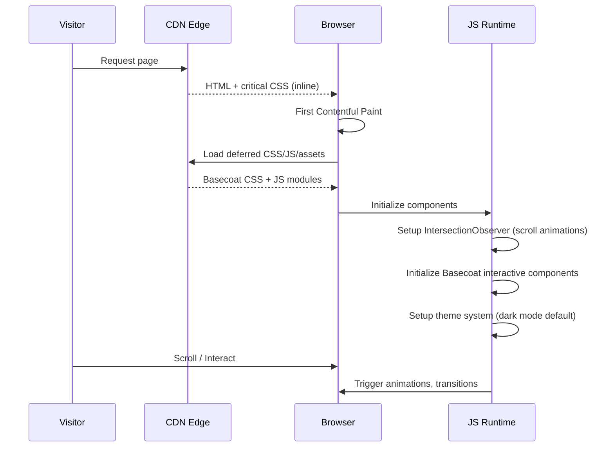

# Design Document: Matrix Marketing Website

## Overview

The Matrix Marketing Website is the primary public-facing information and marketing site for the Matrix project — an Agent Operating Framework built by PaxLabs Inc. on the Paxeer Network. The site serves as the canonical entry point for consumers, enterprises, press, and developers, communicating the product's value proposition, technical architecture, and integration paths.

The site is built as a static website using Eleventy (11ty) as the static site generator — the same toolchain used by Basecoat's documentation site — ensuring seamless integration with Basecoat UI components. It leverages Tailwind CSS 4 for styling, Basecoat's CSS component library for consistent UI, and vanilla JavaScript for scroll-driven animations, interactive demos, and dynamic content. The architecture prioritizes performance (sub-1-second LCP), SEO, accessibility, and a dramatic dark-themed aesthetic consistent with Matrix's brand identity.

The site is content-driven with a clear information architecture that funnels each audience segment (consumer, enterprise, developer, press) to their most relevant content while maintaining a cohesive narrative about Matrix's unique value: solving the four failure modes of human-agent interaction through a rigorously typed intent-to-execution compiler.

## Architecture




## Sequence Diagrams

### Build and Deploy Flow



### Page Load and Interaction Flow




## Components and Interfaces

### Component 1: Site Configuration & Data Layer

**Purpose**: Centralized configuration for site metadata, navigation structure, page content, and build-time data that feeds into all templates.

**Interface**:
```javascript
// docs/src/_data/site.js
export default {
  title: "Matrix",
  tagline: "The Agent Operating Framework",
  description: "Intent-to-execution compiler with replayable memory and deterministic walk semantics.",
  url: process.env.ELEVENTY_ENV === 'development'
    ? "http://localhost:8080"
    : "https://matrixmcl.com",
  author: { name: "PaxLabs Inc.", x: "@paxlabs" },
  brand: {
    primaryColor: "#0565ff",   // Matrix blue accent
    backgroundColor: "#0A0A0A", // Matrix dark
    logoUrl: "/assets/images/matrix-logo.svg"
  },
  nav: [
    { label: "Features", url: "/features/" },
    { label: "Architecture", url: "/architecture/" },
    { label: "Use Cases", url: "/use-cases/" },
    { label: "Developers", url: "/developers/" },
    { label: "Enterprise", url: "/enterprise/" },
    { label: "Blog", url: "/blog/" }
  ],
  footerNav: {
    product: [ /* links */ ],
    developers: [ /* links */ ],
    company: [ /* links */ ],
    legal: [ /* links */ ]
  }
}
```

**Responsibilities**:
- Provide site-wide metadata for SEO and social sharing
- Define navigation structure consumed by header/footer templates
- Expose brand tokens for consistent theming
- Support environment-specific URL configuration

### Component 2: Layout System (Nunjucks Templates)

**Purpose**: Hierarchical template system that provides consistent page structure, global navigation, footer, and meta tags across all pages.

**Interface**:
```javascript
// Template hierarchy
// layouts/base.njk       - HTML shell, meta, CSS/JS includes
// layouts/page.njk       - Standard page with header + footer
// layouts/landing.njk    - Full-width landing sections (no sidebar)
// layouts/blog-post.njk  - Blog article layout with metadata

// Page front matter interface
// ---
// layout: layouts/landing.njk
// title: "Page Title"
// description: "Meta description"
// ogImage: "/assets/social/page-image.png"
// ---
```

**Responsibilities**:
- Render consistent HTML document structure
- Include critical CSS inline for fast FCP
- Load Basecoat CSS and JS components
- Provide header navigation and footer
- Handle SEO meta tags and Open Graph data
- Support dark mode as default with theme toggle


### Component 3: Page Sections (Nunjucks Macros/Partials)

**Purpose**: Reusable section components that compose into full pages. Each section is a self-contained partial that accepts data and renders using Basecoat components.

**Interface**:
```javascript
// macros/hero.njk
// 

// macros/feature-grid.njk
// 

// macros/architecture-diagram.njk
// 

// macros/pricing-table.njk
// 

// macros/testimonial-carousel.njk
// 

// macros/cta-banner.njk
// 

// macros/code-example.njk
// 

// macros/stats-bar.njk
// 
```

**Responsibilities**:
- Render self-contained page sections using Basecoat classes
- Accept structured data from page front matter or _data files
- Support responsive layouts (mobile-first)
- Include section-specific scroll animation triggers
- Maintain consistent spacing and typography scale

### Component 4: Theme & Styling System

**Purpose**: Custom Matrix theme extending Basecoat's CSS variable system with Matrix brand colors, maintaining dark-first design with optional light mode.

**Interface**:
```css
/* src/css/matrix-theme.css */
:root {
  /* Matrix brand overrides (dark-first) */
  --background: oklch(0.04 0 0);          /* #0A0A0A equivalent */
  --foreground: oklch(0.97 0 0);          /* Near white */
  --primary: oklch(0.55 0.2 260);         /* Matrix blue #0565ff */
  --primary-foreground: oklch(1 0 0);     /* White on blue */
  --card: oklch(0.1 0 0);                 /* Elevated surface */
  --card-foreground: oklch(0.95 0 0);
  --muted: oklch(0.15 0 0);              /* Subtle backgrounds */
  --muted-foreground: oklch(0.6 0 0);    /* Dimmed text */
  --accent: oklch(0.55 0.2 260);         /* Blue accent */
  --accent-foreground: oklch(1 0 0);
  --border: oklch(1 0 0 / 8%);           /* Subtle borders */
  --ring: oklch(0.55 0.2 260);           /* Focus ring = blue */
}

/* Optional light mode */
.light {
  --background: oklch(0.99 0 0);
  --foreground: oklch(0.1 0 0);
  --primary: oklch(0.45 0.2 260);
  /* ... */
}
```

**Responsibilities**:
- Override Basecoat CSS variables to apply Matrix brand
- Provide dark mode as the default (matching Matrix's brand)
- Define additional utility classes for marketing-specific patterns
- Support smooth theme transitions
- Define custom animation keyframes for scroll reveals


### Component 5: Animation & Interactivity Engine

**Purpose**: Vanilla JavaScript module system providing scroll-driven animations, interactive demos, and dynamic UI behaviors without framework dependencies.

**Interface**:
```javascript
// src/js/animations.js
export class ScrollAnimator {
  constructor(options = {}) {}
  observe(selector, animationClass, options) {}
  disconnect() {}
}

// src/js/code-typewriter.js
export class CodeTypewriter {
  constructor(element, codeLines, options) {}
  start() {}
  pause() {}
  reset() {}
}

// src/js/architecture-interactive.js
export class ArchitectureExplorer {
  constructor(container, nodesData) {}
  highlightPath(pathId) {}
  showTooltip(nodeId) {}
}

// src/js/stats-counter.js
export class StatsCounter {
  constructor(element, targetValue, options) {}
  animate() {}
}

// src/js/nav.js
export class StickyNav {
  constructor(navElement) {}
  init() {}
}
```

**Responsibilities**:
- Provide IntersectionObserver-based scroll-triggered animations
- Implement typewriter effect for code examples on landing page
- Create interactive architecture diagram exploration
- Animate statistics/numbers on scroll into view
- Handle sticky navigation with scroll-aware styling
- Keep JS payload minimal (< 20KB gzipped total)

### Component 6: Content Collections

**Purpose**: Organized content structure using Eleventy's collections feature for blog posts, use cases, and changelog entries.

**Interface**:
```javascript
// .eleventy.js collection registration
eleventyConfig.addCollection("posts", collection =>
  collection.getFilteredByGlob("docs/src/blog/*.md")
    .sort((a, b) => b.date - a.date)
);

eleventyConfig.addCollection("useCases", collection =>
  collection.getFilteredByGlob("docs/src/use-cases/*.md")
);

// Blog post front matter
// ---
// title: "Post Title"
// date: 2025-01-15
// author: "Author Name"
// tags: ["announcement", "product"]
// excerpt: "Short description for cards"
// image: "/assets/blog/post-image.png"
// ---
```

**Responsibilities**:
- Organize blog posts with date-based sorting and pagination
- Manage use case entries with category filtering
- Support tag-based content grouping
- Generate RSS/Atom feeds for blog content
- Provide collection data to listing pages


## Data Models

### Model 1: Page Configuration

```javascript
/**
 * @typedef {Object} PageConfig
 * @property {string} layout - Template layout path
 * @property {string} title - Page title for <title> and OG
 * @property {string} description - Meta description
 * @property {string} [ogImage] - Open Graph image path
 * @property {string} [permalink] - Custom URL path
 * @property {boolean} [eleventyExcludeFromCollections] - Exclude from collections
 */
```

**Validation Rules**:
- `title` must be 10-70 characters for SEO
- `description` must be 50-160 characters for SEO
- `ogImage` must reference an existing file in assets
- `layout` must reference an existing template file

### Model 2: Navigation Item

```javascript
/**
 * @typedef {Object} NavItem
 * @property {string} label - Display text
 * @property {string} url - Link URL (relative or absolute)
 * @property {NavItem[]} [children] - Dropdown children
 * @property {boolean} [external] - Opens in new tab
 * @property {string} [badge] - Optional badge text (e.g., "New")
 */
```

**Validation Rules**:
- `label` is required, max 30 characters
- `url` must start with `/` for internal links or `https://` for external
- `children` depth limited to 1 level
- `external` links must have `rel="noopener noreferrer"`

### Model 3: Feature Entry

```javascript
/**
 * @typedef {Object} Feature
 * @property {string} title - Feature name
 * @property {string} description - 1-2 sentence description
 * @property {string} icon - Lucide icon name
 * @property {string} [link] - Optional link to details
 * @property {string} category - One of: "core", "developer", "enterprise"
 */
```

**Validation Rules**:
- `title` required, max 50 characters
- `description` required, max 200 characters
- `icon` must be a valid Lucide icon name
- `category` must be one of the defined categories

### Model 4: Blog Post

```javascript
/**
 * @typedef {Object} BlogPost
 * @property {string} title - Post title
 * @property {Date} date - Publication date
 * @property {string} author - Author name
 * @property {string[]} tags - Categorization tags
 * @property {string} excerpt - Card-level summary (max 200 chars)
 * @property {string} image - Hero image path
 * @property {string} content - Markdown body
 */
```

**Validation Rules**:
- `date` must be a valid date, not in the future
- `tags` must contain at least one tag
- `excerpt` max 200 characters
- `image` must be an optimized WebP or PNG file

### Model 5: Pricing Plan

```javascript
/**
 * @typedef {Object} PricingPlan
 * @property {string} name - Plan name
 * @property {string} price - Display price (e.g., "Free", "$99/mo")
 * @property {string} description - Plan summary
 * @property {string[]} features - List of included features
 * @property {string} cta - Call-to-action button text
 * @property {string} ctaUrl - CTA link destination
 * @property {boolean} [highlighted] - Visually emphasized plan
 */
```

**Validation Rules**:
- `name` required, one of: "Open Source", "Pro", "Enterprise"
- `features` must have at least 3 items
- `cta` max 30 characters
- Only one plan may have `highlighted: true`


## Algorithmic Pseudocode

### Page Build Algorithm

```pascal
ALGORITHM buildPage(source)
INPUT: source file (Markdown or Nunjucks with front matter)
OUTPUT: rendered HTML file at computed permalink

BEGIN
  metadata ← parseFrontMatter(source)
  
  ASSERT metadata.layout IS NOT NULL
  ASSERT metadata.title IS NOT NULL
  
  // Step 1: Resolve template chain
  templateChain ← []
  current ← metadata.layout
  WHILE current IS NOT NULL DO
    template ← loadTemplate(current)
    templateChain.prepend(template)
    current ← template.parent
  END WHILE
  
  // Step 2: Render content body
  body ← renderNunjucks(source.content, siteData, metadata)
  
  // Step 3: Apply template chain (innermost to outermost)
  rendered ← body
  FOR each template IN templateChain DO
    ASSERT template.content CONTAINS "{{ content | safe }}"
    rendered ← renderNunjucks(template, { content: rendered, ...siteData, ...metadata })
  END FOR
  
  // Step 4: Post-process HTML
  rendered ← inlineCriticalCSS(rendered)
  rendered ← optimizeImages(rendered)
  rendered ← addPrefetchHints(rendered)
  
  // Step 5: Write output
  permalink ← computePermalink(metadata, source.path)
  writeFile(outputDir + permalink + "index.html", rendered)
  
  RETURN permalink
END
```

**Preconditions:**
- Source file exists and contains valid front matter
- Referenced layout template exists in _includes directory
- Site data files are loaded and validated

**Postconditions:**
- HTML file is written to correct output path
- All template variables are resolved (no unrendered {{ }} blocks)
- Critical CSS is inlined in <head>
- Images have width/height attributes for CLS prevention

### Scroll Animation Initialization Algorithm

```pascal
ALGORITHM initScrollAnimations(config)
INPUT: config = { selector, animationClass, threshold, rootMargin }
OUTPUT: active IntersectionObserver instance

BEGIN
  elements ← document.querySelectorAll(config.selector)
  
  ASSERT elements.length > 0
  
  callback ← FUNCTION(entries, observer)
    FOR each entry IN entries DO
      IF entry.isIntersecting THEN
        entry.target.classList.add(config.animationClass)
        
        // Once animated, stop observing (animate only once)
        observer.unobserve(entry.target)
      END IF
    END FOR
  END FUNCTION
  
  observer ← new IntersectionObserver(callback, {
    threshold: config.threshold OR 0.1,
    rootMargin: config.rootMargin OR "0px 0px -50px 0px"
  })
  
  FOR each element IN elements DO
    // Set initial hidden state
    element.classList.add("opacity-0", "translate-y-4")
    observer.observe(element)
  END FOR
  
  RETURN observer
END
```

**Preconditions:**
- DOM is fully loaded (DOMContentLoaded fired)
- IntersectionObserver API is available in browser
- Elements matching selector exist in DOM

**Postconditions:**
- All matching elements have initial hidden state applied
- Observer is actively watching all elements
- Each element animates exactly once when scrolled into view
- Observer disconnects from element after animation triggers

**Loop Invariants:**
- All previously animated elements retain their animation class
- Observer only tracks un-animated elements


### Navigation State Management Algorithm

```pascal
ALGORITHM manageNavState(navElement)
INPUT: navElement (sticky header DOM element)
OUTPUT: responsive navigation with scroll-aware styling

BEGIN
  lastScrollY ← 0
  isHidden ← false
  scrollThreshold ← 100
  
  handleScroll ← FUNCTION()
    currentScrollY ← window.scrollY
    
    // Add background blur when scrolled
    IF currentScrollY > 0 THEN
      navElement.classList.add("backdrop-blur-lg", "border-b")
    ELSE
      navElement.classList.remove("backdrop-blur-lg", "border-b")
    END IF
    
    // Hide on scroll down, show on scroll up
    IF currentScrollY > lastScrollY AND currentScrollY > scrollThreshold THEN
      IF NOT isHidden THEN
        navElement.style.transform = "translateY(-100%)"
        isHidden ← true
      END IF
    ELSE
      IF isHidden THEN
        navElement.style.transform = "translateY(0)"
        isHidden ← false
      END IF
    END IF
    
    lastScrollY ← currentScrollY
  END FUNCTION
  
  // Throttle to 60fps
  window.addEventListener("scroll", throttle(handleScroll, 16), { passive: true })
  
  // Mobile menu toggle
  mobileToggle ← navElement.querySelector("[data-mobile-toggle]")
  mobileMenu ← navElement.querySelector("[data-mobile-menu]")
  
  IF mobileToggle AND mobileMenu THEN
    mobileToggle.addEventListener("click", FUNCTION()
      isOpen ← mobileMenu.getAttribute("aria-hidden") === "true"
      mobileMenu.setAttribute("aria-hidden", NOT isOpen)
      mobileToggle.setAttribute("aria-expanded", isOpen)
    END FUNCTION)
  END IF
END
```

**Preconditions:**
- navElement is a valid DOM element with position: sticky/fixed
- Page has sufficient content to scroll
- Mobile menu elements exist with correct data attributes

**Postconditions:**
- Navigation hides when scrolling down past threshold
- Navigation reveals when scrolling up
- Background blur applied when not at page top
- Mobile menu toggles correctly with ARIA attributes

### Static Asset Optimization Algorithm

```pascal
ALGORITHM optimizeStaticAssets(inputDir, outputDir)
INPUT: inputDir containing raw assets, outputDir for optimized output
OUTPUT: optimized asset files with content-hashed filenames

BEGIN
  assets ← findAllAssets(inputDir)
  manifest ← {}
  
  FOR each asset IN assets DO
    ASSERT fileExists(asset.path)
    
    optimized ← NULL
    
    IF asset.type = "image" THEN
      optimized ← optimizeImage(asset, {
        formats: ["webp", "avif"],
        widths: [640, 1024, 1440, 1920],
        quality: 80
      })
    ELSE IF asset.type = "css" THEN
      optimized ← minifyCSS(asset)
    ELSE IF asset.type = "js" THEN
      optimized ← minifyJS(asset)
    ELSE
      optimized ← copyFile(asset)
    END IF
    
    hash ← computeContentHash(optimized.content)
    hashedFilename ← asset.name + "." + hash.substring(0,8) + asset.extension
    
    writeFile(outputDir + "/" + hashedFilename, optimized.content)
    manifest[asset.originalPath] ← hashedFilename
    
    ASSERT fileExists(outputDir + "/" + hashedFilename)
  END FOR
  
  writeFile(outputDir + "/manifest.json", JSON.stringify(manifest))
  
  RETURN manifest
END
```

**Preconditions:**
- inputDir exists and contains valid assets
- outputDir exists or can be created
- Image optimization tools (sharp) are available
- CSS/JS minification tools are available

**Postconditions:**
- All assets are optimized and content-hashed
- Manifest maps original paths to hashed filenames
- Images are available in modern formats (WebP, AVIF)
- Total CSS bundle < 50KB gzipped
- Total JS bundle < 20KB gzipped

**Loop Invariants:**
- manifest contains entries for all previously processed assets
- No file conflicts (content hash ensures uniqueness)


## Key Functions with Formal Specifications

### Function 1: renderHeroSection()

```javascript
function renderHeroSection(config) {
  // config: { title, subtitle, ctaPrimary, ctaSecondary, animationType }
  // Returns: HTML string for hero section
}
```

**Preconditions:**
- `config.title` is a non-empty string (max 80 characters)
- `config.subtitle` is a non-empty string (max 200 characters)
- `config.ctaPrimary` contains `{ text, url }` where url starts with `/` or `https://`
- `config.animationType` is one of: `"typewriter"`, `"fadeUp"`, `"particles"`

**Postconditions:**
- Returns valid HTML containing `.hero` section
- Hero contains `<h1>` with title text
- CTA buttons use Basecoat `.btn` and `.btn-outline` classes
- Animation trigger attributes are present for JS initialization
- Section is responsive (stacks vertically on mobile)

**Loop Invariants:** N/A

### Function 2: initializeBasecoatComponents()

```javascript
function initializeBasecoatComponents() {
  // Initializes all Basecoat interactive components on the page
  // Called after DOM ready and after any HTMX swaps
}
```

**Preconditions:**
- DOM is in ready state (DOMContentLoaded fired)
- Basecoat JS files are loaded (basecoat.js, popover.js, etc.)
- Elements with Basecoat component classes exist in DOM

**Postconditions:**
- All `.dropdown-menu` elements are interactive
- All `[data-tooltip]` elements show on hover
- All `.tabs` elements handle tab switching
- Theme switcher responds to click events
- No duplicate event listeners (idempotent initialization)

**Loop Invariants:** N/A

### Function 3: buildSitemap()

```javascript
function buildSitemap(pages, siteUrl) {
  // pages: Array<{ url, lastModified, priority, changeFreq }>
  // siteUrl: string base URL
  // Returns: XML string conforming to sitemap protocol
}
```

**Preconditions:**
- `pages` is a non-empty array
- Each page has a `url` starting with `/`
- `siteUrl` is a valid HTTPS URL without trailing slash
- `priority` is between 0.0 and 1.0

**Postconditions:**
- Returns valid XML sitemap conforming to sitemap.org protocol
- All URLs are absolute (siteUrl + page.url)
- Landing page has priority 1.0
- No duplicate URLs in output
- XML is properly escaped

**Loop Invariants:**
- All previously processed pages have unique absolute URLs

### Function 4: generateRSSFeed()

```javascript
function generateRSSFeed(posts, siteConfig) {
  // posts: BlogPost[] sorted by date descending
  // siteConfig: { title, description, url, author }
  // Returns: Valid RSS 2.0 XML string
}
```

**Preconditions:**
- `posts` is sorted by date descending
- Each post has title, date, excerpt, and permalink
- `siteConfig.url` is a valid HTTPS URL

**Postconditions:**
- Returns valid RSS 2.0 XML
- Contains at most 20 most recent items
- Each item has title, link, description, pubDate, and guid
- Feed metadata includes channel title, link, and description
- Dates are in RFC 822 format

**Loop Invariants:**
- Items maintain descending date order in output


## Example Usage

### Example 1: Landing Page Template

```javascript
// docs/src/index.njk
// ---
// layout: layouts/landing.njk
// title: "Matrix — The Agent Operating Framework"
// description: "Intent-to-execution compiler with replayable memory and deterministic walk semantics. Built by PaxLabs."
// ---

// 
// 
// 
// 
// 

// {{ hero(
//   title="Build the Rails for the Machine Economy",
//   subtitle="Matrix transforms natural-language into typed, inspectable Intent IR...",
//   cta_primary={ text: "Get Started", url: "/developers/" },
//   cta_secondary={ text: "View on GitHub", url: "https://github.com/paxlabs-inc/matrix-core" },
//   animation_type="typewriter"
// ) }}

// {{ statsBar([
//   { value: "400", unit: "ms", label: "Block Finality" },
//   { value: "10", unit: "", label: "Closed Verbs" },
//   { value: "8", unit: "", label: "Object Kinds" },
//   { value: "100%", unit: "", label: "Replay Determinism" }
// ]) }}

// {{ featureGrid(site.features.core, columns=3, style="cards") }}

// {{ codeExample(
//   title="Compile Your First Intent",
//   code=compileExample,
//   language="bash",
//   description="Natural language becomes typed IR in one command."
// ) }}

// {{ ctaBanner(
//   heading="Ready to build?",
//   description="Start with the open-source framework or talk to us about enterprise.",
//   button_text="Get Started Free",
//   button_url="/developers/"
// ) }}
```

### Example 2: Using Basecoat Components in Templates

```html
<!-- Card component using Basecoat classes -->
<article class="card">
  <header>
    <h2>Closed Vocabulary</h2>
    <p>10 verbs, 8 object kinds — intent survives multi-step execution</p>
  </header>
  <section>
    <p>Every intent maps to a typed AST node. No open-ended classification,
       no prompt fragility, no meaning drift.</p>
  </section>
  <footer>
    <a href="/architecture/" class="btn-sm-outline">Learn More</a>
  </footer>
</article>

<!-- Badge components for tech indicators -->
<div class="flex gap-2">
  <span class="badge">Go</span>
  <span class="badge-secondary">Solidity</span>
  <span class="badge-outline">TypeScript</span>
</div>

<!-- Dialog for interactive demo -->
<dialog class="dialog" id="demo-dialog">
  <div>
    <header>
      <h2>Try Matrix</h2>
      <p>Enter a natural-language intent to see the compiled IR</p>
    </header>
    <section>
      <div class="field">
        <label>Your Intent</label>
        <input type="text" placeholder="Build a deployment pipeline for my app"
               class="input" />
      </div>
    </section>
    <footer>
      <button class="btn-outline" onclick="this.closest('dialog').close()">Cancel</button>
      <button class="btn" id="compile-btn">Compile Intent</button>
    </footer>
  </div>
</dialog>
```

### Example 3: Animation Initialization

```javascript
// src/js/main.js
import { ScrollAnimator } from './animations.js';
import { CodeTypewriter } from './code-typewriter.js';
import { StatsCounter } from './stats-counter.js';
import { StickyNav } from './nav.js';

document.addEventListener('DOMContentLoaded', () => {
  // Initialize scroll-reveal animations
  const animator = new ScrollAnimator();
  animator.observe('[data-animate="fade-up"]', 'animate-fade-up', { threshold: 0.1 });
  animator.observe('[data-animate="fade-in"]', 'animate-fade-in', { threshold: 0.2 });
  animator.observe('[data-animate="slide-right"]', 'animate-slide-right');

  // Initialize stats counters
  document.querySelectorAll('[data-counter]').forEach(el => {
    const counter = new StatsCounter(el, parseInt(el.dataset.counter), {
      duration: 2000,
      suffix: el.dataset.suffix || ''
    });
    // Trigger on scroll into view
    const observer = new IntersectionObserver(([entry]) => {
      if (entry.isIntersecting) {
        counter.animate();
        observer.disconnect();
      }
    });
    observer.observe(el);
  });

  // Initialize code typewriter on hero
  const codeEl = document.querySelector('[data-typewriter]');
  if (codeEl) {
    const typewriter = new CodeTypewriter(codeEl, codeEl.dataset.lines.split('|'), {
      speed: 50,
      pauseBetweenLines: 1000
    });
    typewriter.start();
  }

  // Sticky navigation
  const nav = document.querySelector('[data-sticky-nav]');
  if (nav) new StickyNav(nav).init();
});
```


## Correctness Properties

*A property is a characteristic or behavior that should hold true across all valid executions of a system-essentially, a formal statement about what the system should do. Properties serve as the bridge between human-readable specifications and machine-verifiable correctness guarantees.*

### Property 1: Navigation Reachability

*For any* page in the site's build output, there exists a navigation path from the landing page to that page using at most 3 link clicks.

**Validates: Requirement 1.4**

### Property 2: Footer Presence

*For any* generated HTML page, the rendered output contains a footer element with grouped links for Product, Developers, Company, and Legal sections.

**Validates: Requirement 1.5**

### Property 3: Dark Mode Background Consistency

*For any* rendered element on any page in dark mode, its computed background color has a luminance value below the dark-theme threshold (no light backgrounds that create visual jarring).

**Validates: Requirement 2.4**

### Property 4: Body Text Contrast Compliance

*For any* body text element on any page, the contrast ratio between its foreground color and its background color is at least 4.5:1.

**Validates: Requirements 3.4, 20.5**

### Property 5: Large Text Contrast Compliance

*For any* large text element (headings) on any page, the contrast ratio between its foreground color and its background color is at least 3:1.

**Validates: Requirements 3.5, 20.6**

### Property 6: Active Navigation Link Accent

*For any* page in the site, the navigation link corresponding to that page's section is rendered with the brand accent color (orange/amber) to indicate active state.

**Validates: Requirement 4.4**

### Property 7: Apple-Style Section Spacing

*For any* major page section in the generated HTML, the section has at least 80px of vertical padding separating it from adjacent sections, maintaining generous whitespace rhythm.

**Validates: Requirement 8.1**

### Property 8: Content Width Constraint

*For any* content container on any page, the maximum width does not exceed 1440px and content is horizontally centered within the viewport.

**Validates: Requirement 8.2**

### Property 9: Template Layout Rendering

*For any* page with a layout specified in its front matter, the build output HTML conforms to the structure defined by that template (e.g., landing.njk produces full-width sections, page.njk includes header and footer).

**Validates: Requirement 11.5**

### Property 10: Responsive Section Stacking

*For any* section macro rendered at a mobile viewport width (< 768px), the content stacks vertically without horizontal overflow.

**Validates: Requirement 12.7**

### Property 11: Animation Applied Exactly Once

*For any* element registered for scroll-triggered animation, the animation class is applied exactly once when the element enters the viewport, and the observer disconnects from that element afterward.

**Validates: Requirement 14.2**

### Property 12: Initial Hidden State on Animated Elements

*For any* element registered for scroll-triggered animation, before it enters the viewport it has opacity-0 and translate-y-4 classes applied.

**Validates: Requirement 14.3**

### Property 13: Blog Post Collection Sort Order

*For any* collection of blog posts returned by the content system, posts are ordered by date in strictly descending order.

**Validates: Requirement 16.1**

### Property 14: RSS Feed Item Limit

*For any* number of blog posts N in the site, the generated RSS feed contains at most 20 items.

**Validates: Requirement 16.3**

### Property 15: RSS Feed Format Compliance

*For any* set of valid blog posts, the generated RSS feed is valid RSS 2.0 XML containing title, link, description, pubDate (in RFC 822 format), and guid for each item.

**Validates: Requirement 16.4**

### Property 16: Blog Post Validation

*For any* blog post front matter, the validation system correctly rejects entries with future dates, empty tags arrays, or excerpts exceeding 200 characters, and accepts all entries that satisfy these constraints.

**Validates: Requirement 16.6**

### Property 17: Page Metadata Validation

*For any* page front matter, the validation system accepts titles between 10 and 70 characters and descriptions between 50 and 160 characters, and rejects values outside these ranges.

**Validates: Requirements 17.1, 17.2, 26.1, 26.2**

### Property 18: Open Graph Tag Presence

*For any* generated HTML page, the output contains og:title, og:description, and og:image meta tags.

**Validates: Requirement 17.3**

### Property 19: Sitemap Uniqueness and Validity

*For any* set of pages produced by the build, the generated XML sitemap is valid XML conforming to the sitemap.org protocol with no duplicate URL entries.

**Validates: Requirement 17.4**

### Property 20: Sitemap Absolute URLs

*For any* URL entry in the generated sitemap, the URL is absolute and starts with the production site base URL.

**Validates: Requirement 17.6**

### Property 21: Critical CSS Inlining

*For any* generated HTML page, the document head contains an inline style element with critical above-the-fold CSS.

**Validates: Requirement 18.7**

### Property 22: Image Modern Format Generation

*For any* image processed by the asset pipeline, the output includes WebP and/or AVIF variants at responsive widths (640, 1024, 1440, 1920px).

**Validates: Requirement 19.1**

### Property 23: Asset Content Hashing

*For any* static asset processed by the build pipeline, the output filename contains a content-based hash segment.

**Validates: Requirement 19.2**

### Property 24: Below-Fold Image Lazy Loading

*For any* image element positioned below the initial viewport fold, the element has loading="lazy" and decoding="async" attributes.

**Validates: Requirement 19.3**

### Property 25: Asset Manifest Completeness

*For any* asset processed by the pipeline, the generated manifest.json contains a mapping from the original asset path to its hashed output filename.

**Validates: Requirement 19.4**

### Property 26: Image Dimension Attributes

*For any* img element in the generated HTML output, the element has explicit width and height attributes to prevent layout shift.

**Validates: Requirement 19.5**

### Property 27: ARIA Attributes on Interactive Elements

*For any* interactive element (button, menu toggle, dialog, tab) in the generated HTML, the element has appropriate ARIA attributes (aria-expanded, aria-hidden, aria-label, role as applicable).

**Validates: Requirement 20.4**

### Property 28: No Horizontal Overflow

*For any* viewport width between 320px and 2560px, no page produces a horizontal scrollbar.

**Validates: Requirement 21.1**

### Property 29: Minimum Font Size on Mobile

*For any* text element rendered at mobile viewport width (320px), the computed font-size is at least 14px.

**Validates: Requirement 21.4**

### Property 30: Internal Link Integrity

*For any* internal link (href starting with "/") in the generated HTML, the target path resolves to an existing file in the build output.

**Validates: Requirement 23.1**

### Property 31: External Link Attributes

*For any* external link (href starting with "http") in the generated HTML, the element has rel="noopener noreferrer" and target="_blank" attributes.

**Validates: Requirement 23.2**

### Property 32: Build Determinism

*For any* set of input files, two consecutive builds produce byte-identical HTML output (excluding timestamps in sitemaps and RSS feeds).

**Validates: Requirement 24.1**

### Property 33: JavaScript Failure Graceful Degradation

*For any* JavaScript module that throws an error during initialization, the page continues to render with all content visible and the error is logged to the console.

**Validates: Requirement 25.1**

### Property 34: Navigation Item Validation

*For any* navigation item data, the validation system accepts items with label at most 30 characters and URL starting with "/" or "https://", and rejects items violating these constraints.

**Validates: Requirement 26.3**

### Property 35: Feature Entry Validation

*For any* feature entry, the validation system enforces title at most 50 characters, description at most 200 characters, and category is one of "core", "developer", or "enterprise".

**Validates: Requirement 26.4**

### Property 36: Pricing Plan Validation

*For any* set of pricing plans, the validation system enforces that each plan has at least 3 features and at most one plan in the set has highlighted set to true.

**Validates: Requirement 26.5**

## Error Handling

### Error Scenario 1: Missing Template Reference

**Condition**: A page references a layout or macro that doesn't exist in `_includes/`
**Response**: Eleventy build fails with descriptive error pointing to the file and line
**Recovery**: Developer fixes the template path; CI prevents deployment of broken builds

### Error Scenario 2: Invalid Front Matter

**Condition**: A content file has malformed YAML front matter or missing required fields
**Response**: Build-time validation reports the file and missing fields
**Recovery**: Content author corrects front matter; pre-commit hook validates structure

### Error Scenario 3: Asset Not Found

**Condition**: Template references an image or asset that doesn't exist
**Response**: Build logs a warning; broken image tag is rendered with alt text fallback
**Recovery**: Developer adds missing asset or corrects the path reference

### Error Scenario 4: JavaScript Initialization Failure

**Condition**: A JS module fails to initialize (e.g., selector finds no elements)
**Response**: Module catches error, logs to console, and continues — no page breakage
**Recovery**: Page functions without that specific interaction; core content remains accessible

### Error Scenario 5: CDN/Deployment Failure

**Condition**: Deploy pipeline fails to push to CDN edge
**Response**: Previous version remains live; CI reports failure notification
**Recovery**: Developer investigates deploy logs, fixes issue, re-triggers pipeline

### Error Scenario 6: Third-Party Script Failure

**Condition**: External resource (e.g., analytics, fonts CDN) fails to load
**Response**: Page renders fully with system fonts as fallback; no layout shift
**Recovery**: Automatic — external resources are non-blocking and non-critical


## Testing Strategy

### Unit Testing Approach

Unit tests cover isolated JavaScript modules and build-time utilities:

- **Animation modules**: Test that `ScrollAnimator` correctly adds/removes classes, that `StatsCounter` produces expected intermediate values, and that `CodeTypewriter` sequences characters correctly.
- **Build utilities**: Test sitemap generation, RSS feed generation, and content hash computation produce valid output.
- **Data validation**: Test that page configs, nav items, and feature entries pass/fail validation correctly.

**Test Runner**: Vitest (fast, ESM-native, works well with vanilla JS modules)

### Property-Based Testing Approach

Property tests verify invariants across randomly generated inputs:

- **Navigation structure**: For any valid nav configuration, rendered HTML contains correct number of links with proper nesting.
- **Sitemap generation**: For any collection of pages with valid URLs, output is valid XML with no duplicate entries.
- **Theme CSS variables**: For any combination of CSS variable overrides, all required variables resolve to valid oklch values.
- **Responsive breakpoints**: For any viewport width between 320px and 2560px, layout constraints are satisfied.

**Property Test Library**: fast-check (JavaScript property-based testing)

### Integration Testing Approach

Integration tests verify the complete build pipeline and rendered output:

- **Full build test**: Run `npx @11ty/eleventy` and verify exit code 0, all expected output files exist
- **HTML validation**: Run W3C validator on all generated HTML pages
- **Link checking**: Crawl all internal links and verify 200 status codes
- **Lighthouse CI**: Run Lighthouse on key pages, assert performance scores >= 90
- **Visual regression**: Screenshot key pages at multiple viewport widths, compare against baselines
- **Accessibility audit**: Run axe-core on all pages, assert zero violations at "critical" and "serious" levels

## Performance Considerations

### Page Load Performance

- **Critical CSS inlining**: Extract above-the-fold CSS and inline it in `<head>` to eliminate render-blocking request
- **Lazy loading**: Images below the fold use `loading="lazy"` and `decoding="async"`
- **Font strategy**: Use system font stack as fallback; custom fonts loaded with `font-display: swap`
- **Preconnect hints**: Add `<link rel="preconnect">` for known third-party origins (CDN, analytics)
- **Image optimization**: All images served in WebP/AVIF with responsive `srcset` attributes
- **JS budget**: Total JavaScript < 20KB gzipped (no framework overhead)
- **CSS budget**: Total CSS < 50KB gzipped (Basecoat + Tailwind purged + custom)

### Build Performance

- **Incremental builds**: Eleventy's incremental mode for development (rebuild only changed files)
- **Parallel image processing**: Process images in parallel during build using worker threads
- **Template caching**: Nunjucks template compilation is cached between builds
- **Target build time**: Full site build < 30 seconds for up to 200 pages

### Runtime Performance

- **No layout shift**: All images/embeds have explicit dimensions; fonts use size-adjust
- **Passive event listeners**: All scroll handlers use `{ passive: true }` for smooth 60fps
- **Animation performance**: Use `transform` and `opacity` only (GPU-composited properties)
- **Debounced resize**: Window resize handlers debounced at 150ms

## Security Considerations

### Content Security Policy

- Strict CSP headers allowing only same-origin scripts and styles
- Nonce-based script allowlisting for inline critical JS
- No `eval()` or `unsafe-inline` in production

### Dependency Security

- Minimal runtime dependencies (vanilla JS, no npm packages in client bundle)
- Build dependencies audited with `npm audit` in CI
- Lock file (`package-lock.json`) committed and verified

### Content Integrity

- All static assets served with `Cache-Control: immutable` (content-hashed filenames)
- Subresource Integrity (SRI) hashes for any CDN-loaded scripts
- No user-generated content on marketing site (pure static)

### HTTPS & Headers

- Strict HTTPS enforcement with HSTS header
- `X-Content-Type-Options: nosniff`
- `X-Frame-Options: DENY`
- `Referrer-Policy: strict-origin-when-cross-origin`


## Dependencies

### Build-Time Dependencies

| Package | Purpose | Version |
|---------|---------|---------|
| `@11ty/eleventy` | Static site generator | ^3.0 |
| `tailwindcss` | Utility-first CSS framework | ^4.0 |
| `@tailwindcss/cli` | Tailwind CSS CLI build tool | ^4.0 |
| `basecoat` | UI component CSS library (local/npm) | latest |
| `@grimlink/eleventy-plugin-lucide-icons` | SVG icon shortcodes | ^1.0 |
| `nunjucks` | Template engine | ^3.2 |
| `sharp` | Image optimization | ^0.33 |
| `prettier` | HTML formatting for code examples | ^3.0 |
| `markdown-it` | Markdown rendering for blog posts | ^14.0 |
| `@11ty/eleventy-plugin-rss` | RSS/Atom feed generation | ^2.0 |

### Development Dependencies

| Package | Purpose | Version |
|---------|---------|---------|
| `vitest` | Unit test runner | ^2.0 |
| `fast-check` | Property-based testing | ^3.0 |
| `@axe-core/cli` | Accessibility testing | ^4.0 |
| `lighthouse` | Performance auditing | ^12.0 |
| `html-validate` | HTML validation | ^8.0 |

### Runtime Dependencies (Client-Side)

| Resource | Purpose | Loading Strategy |
|----------|---------|-----------------|
| Basecoat CSS | Component styles | Bundled at build time |
| Basecoat JS | Interactive components (select, tabs, popover, etc.) | Deferred script |
| Custom animations JS | Scroll effects, typewriter, counters | Deferred, < 10KB |

### External Services

| Service | Purpose | Criticality |
|---------|---------|-------------|
| CDN (Cloudflare/Vercel) | Edge hosting and caching | Critical — site delivery |
| GitHub Actions | CI/CD pipeline | Critical — build/deploy |
| Google Analytics / Plausible | Privacy-respecting analytics | Non-critical |
| GitHub API | Star count badge (cached at build) | Non-critical |

## File Structure

```
matrix-marketing-website/
├── .eleventy.js                    # Eleventy configuration
├── package.json                    # Dependencies and scripts
├── tailwind.config.js              # Tailwind CSS configuration
├── src/
│   ├── css/
│   │   ├── matrix-theme.css        # Matrix brand theme overrides
│   │   └── animations.css          # Custom animation keyframes
│   ├── js/
│   │   ├── main.js                 # Entry point, initializes all modules
│   │   ├── animations.js           # ScrollAnimator class
│   │   ├── code-typewriter.js      # Code typewriter effect
│   │   ├── stats-counter.js        # Animated number counters
│   │   ├── architecture-interactive.js  # Interactive arch diagram
│   │   └── nav.js                  # Sticky navigation behavior
│   └── assets/
│       ├── images/                 # Optimized images
│       ├── fonts/                  # Custom fonts (if any)
│       └── social/                 # OG images per page
├── docs/
│   └── src/
│       ├── _data/
│       │   ├── site.js             # Global site configuration
│       │   ├── features.js         # Feature list data
│       │   ├── pricing.js          # Pricing plans data
│       │   └── navigation.js       # Nav structure data
│       ├── _includes/
│       │   ├── layouts/
│       │   │   ├── base.njk        # HTML shell
│       │   │   ├── page.njk        # Standard page
│       │   │   ├── landing.njk     # Full-width landing
│       │   │   └── blog-post.njk   # Blog article
│       │   ├── macros/
│       │   │   ├── hero.njk        # Hero section macro
│       │   │   ├── feature-grid.njk
│       │   │   ├── stats-bar.njk
│       │   │   ├── code-example.njk
│       │   │   ├── pricing-table.njk
│       │   │   ├── testimonial-carousel.njk
│       │   │   ├── cta-banner.njk
│       │   │   └── architecture-diagram.njk
│       │   └── partials/
│       │       ├── header.njk      # Global header/nav
│       │       ├── footer.njk      # Global footer
│       │       └── seo-meta.njk    # SEO meta tags
│       ├── index.njk               # Landing/home page
│       ├── features.njk            # Features page
│       ├── architecture.njk        # Architecture overview
│       ├── use-cases/
│       │   ├── index.njk           # Use cases listing
│       │   ├── defi-automation.md
│       │   ├── enterprise-workflows.md
│       │   └── developer-tools.md
│       ├── developers/
│       │   ├── index.njk           # Developer landing
│       │   └── quickstart.njk      # Getting started guide
│       ├── enterprise/
│       │   └── index.njk           # Enterprise page
│       ├── pricing.njk             # Pricing page
│       ├── blog/
│       │   ├── index.njk           # Blog listing with pagination
│       │   └── *.md                # Individual blog posts
│       ├── about.njk               # About/team page
│       ├── press.njk               # Press kit page
│       ├── contact.njk             # Contact page
│       ├── sitemap.njk             # XML sitemap
│       └── feed.njk                # RSS feed
└── tests/
    ├── unit/
    │   ├── animations.test.js
    │   ├── stats-counter.test.js
    │   └── sitemap.test.js
    └── integration/
        ├── build.test.js
        ├── links.test.js
        └── accessibility.test.js
```
