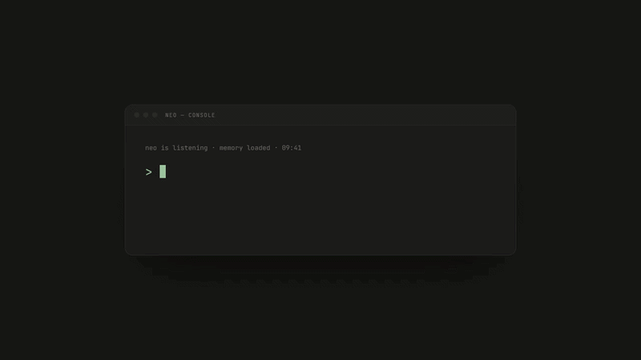

<!--
parent:
  order: false
-->
<p align="center">

</p>

<p align="center">
  <a href="https://labs.paxeer.app"></a>
  <a href="https://labs.paxeer.app"></a>
  <a href="LICENSE.md"></a>
  <a href="CHANGELOG.md"></a>
  <a href="#"></a>
  <a href="https://paxeer.app"></a>
</p>

<p align="center">
  <a href="https://github.com/paxlabs-inc/matrix-core/stargazers"></a>
  <a href="https://github.com/paxlabs-inc/matrix-core/network/members"></a>
  <a href="https://docs.matrixmcl.com"></a>
</p>

<p align="center">
  <a href="https://github.com/paxlabs-inc/matrix-core/search?l=go"></a>
  <a href="https://github.com/paxlabs-inc/matrix-core/search?l=typescript"></a>
  <a href="https://github.com/paxlabs-inc/matrix-core/search?l=html"></a>
  <a href="https://github.com/paxlabs-inc/matrix-core/search?l=c%2B%2B"></a>
  <a href="https://github.com/paxlabs-inc/matrix-core/search?l=javascript"></a>
  <a href="https://github.com/paxlabs-inc/matrix-core/search?l=python"></a>
</p>

---

<h2 align="center">面向 LLM 的智能体框架与认知层。</h2>

<p align="center">
  Matrix 让 LLM 超越聊天，进入整个数字领域的实际执行 <br/>
  并让人类与机器能够协同完成那些必须精确无误的工作。
</p>

---

## 什么是 Matrix？

Matrix 是为 Paxeer Network 的机器经济愿景而构建的认知层。它将语言模型从对话扩展到真正的执行：智能体之间的链上金融协作、高风险任务执行，以及对关键机密工作的安全处理。

大多数智能体技术栈之所以在这类工作上失效，是因为它们将自然语言一路传递到底层。人类语言是一条存在信息泄漏的通道——我们以生物学方式进行推理、感知和近似判断，而这些特性会渗入我们生成的每一句话。用于聊天没有问题。但当智能体正在转移资金、执行不可逆写入，或保管机密信息时，这就不可接受。Matrix 为人类与机器提供了一种协同完成这类工作的方式，*同时避免*让人类推理和人类语言中的歧义进入那些绝不能存在歧义的环节。

它通过三个层级实现这一点。

## 三个层级

### 1 — The Matrix Compiler (MCL)

**整个技术栈的最高决策层。** MCL 由三个严谨的智能体组成，它们通过封闭动词协议彼此通信、规划并执行行动，不受人类语言和人类输入中的限制与歧义影响。它们以机器级的精确性进行协调，并将这种能力应用于现实世界中的高风险、敏感任务：资金、不可逆操作和机密处理。

当一项任务跨入具有重大后果的范围时，就会进入这里。三个智能体计算可能的结果空间，确认自己已经掌握完成工作所需的全部输入；如果没有，就请求进一步澄清；一旦条件满足，便严格按照规范执行一次。任何操作都不会基于猜测运行。

### 2 — The Cortex

**完整的记忆、上下文与不可变状态引擎。** Cortex 为每个智能体提供持久且耐久的记忆：按参与者划分的事件时间线、当前注意力以及类型化状态；系统仅追加写入，并可按字节确定性重放。连续性不再是模型每次会话都必须伪装出来的幻觉——它对用户而言是真实的，对智能体而言则不可破坏。运行在 Matrix 上的智能体不会每次醒来都一片空白。

### 3 — The Loop Manager

**每个智能体独立运行的循环引擎。** 对于每个智能体，Loop Manager 协调用户、LLM 与 Cortex 之间持续不断的信息流入和交换，并在工作变得具有重大后果的瞬间将其升级至 MCL 流水线。它是让智能体在多轮交互、工具调用和时间跨度中保持一致性的运行时，并且准确知道何时应将决策上交，而不是继续即兴处理。

## 它们如何协同工作

```
                        +-----------------------------+
                        |            User             |
                        +--------------+--------------+
                                       |
                                       v
                    +------------------+------------------+
                    |           Loop Manager              |
                    |     per-agent coordination loop     |
                    |     user  <->  LLM  <->  Cortex     |
                    +----+---------------+-----------+----+
                         |               |           |
                 reversible work         |       escalation
                         |               |           |
                         v               v           v
                    +---------+    +-----------+  +------------------+
                    |   LLM   |    |  Cortex   |  |  Matrix Compiler |
                    | (chat,  |    |  memory   |  |  (MCL)           |
                    |  tools) |    |  context  |  |  3 rigorous      |
                    +---------+    |  immutable|  |  closed-verb     |
                                   +-----------+  |  agents          |
                                                  +------------------+
                                                    money / on-chain /
                                                    irreversible /
                                                    confidential
```

默认对话智能体（**Neo**）运行在 Loop Manager 内部，在可逆工作中可使用 shell、代码、fetch 和 web 工具。一旦风险等级上升，Loop Manager 会将任务升级至 MCL；当不再需要这种严谨性后，控制权会返回 Neo。

## 模块

根目录的 Makefile 驱动多个同级 Go 模块——每个模块都有自己的 `go.mod`，并且都可以独立执行 `go build` / `go test`。上述三个层级映射到这些模块：**MCL** 是编译器智能体组，**cortex** 是记忆引擎，而 **executor** 实现了 Loop Manager。


  


| 模块 | 作用 |
|--------|------|
| **MCL** | Matrix Compiler 智能体组。三个使用封闭动词的严谨智能体，以机器级精确性规划并执行高风险、敏感任务。 |
| **cortex** | 基于 Pebble 的按参与者类型化记忆引擎。仅追加日志、由 Merkle 锚定的快照、字节级确定性重放。持久、不可变、耐久。 |
| **bridge** | MCL 到 cortex 的适配器。独立 Go 模块，用于保持清晰的接口边界。 |
| **executor** | Loop Manager。每智能体循环引擎、生命周期状态机、MCP 调度、每用户 daemon、Liaison 叙述器以及端到端测试框架。 |
| **neo** | 运行在循环内部的默认对话智能体，对具有重大后果的操作自动升级至 MCL。 |
| **gateway** | 按量计费的 LLM 代理，包含 PAX 信用账本、免费层白名单和费率表执行。 |
| **router** | 为每个用户提供 Fly Machine，并通过先唤醒再反向代理的前门进行流量接入。 |
| **deus** | 智能体服务市场：注册、发现、按量调用、EIP-712 回执和托管执行。 |
| **tachyon** | 面向智能体原生设计的 Solidity/EVM 引擎——编译、测试、模拟、部署。（git 子模块） |
| **uwac** | Universal Web Agent Connector——OAuth 保管库，为每个用户提供 MCP 工具。 |
| **layerx** | 智能体余额的结算结构与托管主干。 |
| **chronos** | 集中式智能体调度器与唤醒系统。 |
| **atlas** | 附加基础设施编排层。 |
| **context** | 上下文管理子系统。 |
| **journal** | 用于确定性状态重放的仅追加日志子系统。 |
| **knowledge** | 规范参考：matrix.kvx 项目状态、模型和 schema 定义。 |
| **skills** | SKILL.mtx 能力清单，以及 SKILL.md 的自然语言能力说明。 |
| **tools** | MCP 服务器：paxeer、browser、tachyon、deus、uwac、web-search、media、cortex。 |
| **agents** | 与 DID 绑定的智能体清单（default.json、neo.json）以及 MCP 服务器模板。 |
| **protocol** | 协议定义与线格式。 |
| **marketplace** | Deus 市场与开发者仪表板（运行于 Cloudflare Workers 上的 React Router）。 |
| **client** | Matrix 消费者应用（Next.js / React）。 |
| **deploy** | Daemon 容器镜像、Fly Machine 部署、共享服务镜像及 box 安装脚本。 |

## 关键设计决策

- **封闭动词协作（D7）**：MCL 智能体使用 10 个封闭动词进行协调——`find`、`acquire`、`build`、`modify`、`deliver`、`analyze`、`negotiate`、`schedule`、`monitor`、`delegate`——因此智能体之间的意图是精确的，不会在运行时从自然语言描述中进行推断。

- **8 种封闭对象类型**：`service`、`model`、`agent`、`knowledge`、`intent`、`asset`、`plan`、`capability`。每个操作数都属于其中一种。任何非结构化数据块都不能跨入具有重大后果的执行环节。

- **重放不变量（第 13.4 节）**：派生状态始终可以从日志中按字节完全一致地重建。每个 pull request 都通过 `make ci` 强制执行这一约束。智能体做过的任何事情都有记录，而它没有做过的事情也不会被隐藏。

- **不可变记忆**：Cortex 仅追加写入并采用内容寻址，因此智能体的连续性无法被静默改写——对智能体而言持久，对用户而言可信。

- **签名回执**：每一次具有重大后果的运行都以一份 EIP-712 回执结束——输入、输出、成本、哈希——任何人都可以在事后验证。

## 快速开始

### 前置要求

- Go 1.22+
- GNU Make 4.x
- Node.js 20+
- Python 3.11+
- 支持 Buildx 的 Docker

### 构建

```bash
# Clone the repository
git clone https://github.com/paxlabs-inc/matrix-core.git
cd matrix-core

# Build all nine Go modules
make build

# Install runnable CLIs into ./bin
make install

# Run tests (go test -count=1 -race ./... per module)
make test

# Full CI check (gofmt + vet + tests; mirrors GitHub Actions)
make ci
```

### 配置

```bash
# Copy the example environment file
cp .env.example .env

# Required for consequential (non-dry-run) execution:
#   FIREWORKS_API_KEY
#   TOGETHER_API_KEY
#
# Required for authenticated daemon mode:
#   MATRIX_DAEMON_TOKEN
```

### 运行智能体循环

```bash
./bin/mcl-execute walk \
  -prose "Summarise the README and write it to /tmp/summary.md" \
  -manifest    agents/default.json \
  -cortex-root ./runs/dev-cortex \
  -skills-root ./skills
```

### 启动 Daemon

```bash
./bin/mcl-execute daemon \
  -addr        :8080 \
  -cortex-root ./runs/dev-cortex \
  -manifest    agents/default.json \
  -skills-root ./skills
```

## API 参考

Daemon 暴露一个轻量级 HTTP API，用于与智能体交互。

| 方法 | 路径 | 用途 |
|--------|------|---------|
| `GET` | `/healthz` | 存活探针 + SSE broker 统计信息 |
| `POST` | `/chat` | 与智能体对话（通过 Neo 的对话循环） |
| `GET` | `/events` | 用于实时跟踪对话记录尾部的 Server-Sent Events 流 |
| `POST` | `/messages` | 提交具有重大后果的消息（升级至 MCL 智能体组） |
| `GET` | `/intents/{id}` | 按 intent ID 读取 intent envelope 链 |
| `GET` | `/me` | 每用户设置与身份信息 |
| `POST` | `/shutdown` | 优雅排空并关闭 |

## 文档

| 资源 | 说明 |
|----------|-------------|
| [架构指南](ARCHITECTURE.md) | 系统地图、模块边界、关键不变量与设计依据 |
| [贡献指南](CONTRIBUTING.md) | 开发环境设置、测试规范、提交风格与 PR 流程 |
| [安全策略](SECURITY.md) | 漏洞披露与负责任报告 |
| [变更日志](CHANGELOG.md) | 采用 Keep-a-Changelog 格式的发布说明 |
| [MCL 文档](docs/MCL-docs/index.md) | MCL 语言参考、封闭动词语法与智能体内部机制 |
| [Daemon 部署指南](deploy/daemon/README.md) | 生产部署、Fly Machine 配置与运维 |
| [完整文档](https://docs.matrixmcl.com) | 位于 docs.matrixmcl.com 的完整文档站点 |

## 贡献

Matrix Core 是开源项目，你可以自由地**进行 fork 和修改**。不过，`main` 分支严格由核心团队开发：未经邀请的 pull request 通常不会被合并，外部修改只有在我们与贡献者直接合作后才会被接受。

在提交任何内容之前，请阅读 [贡献指南](CONTRIBUTING.md) 顶部的贡献政策。Issue、错误报告和安全漏洞披露始终受到欢迎。

贡献者：
- dev-paxeer
- Andrew
- paxlabs-inc
- cursoragent
- Sidiora-Technologies

## 许可证

Matrix Core 根据 [Matrix-Protocol License](LICENSE.md) 以源码可用方式发布。

你可以自由阅读、使用、部署和集成 Matrix Core。如果你修改并重新分发该软件，则必须在相同许可证下发布你的修改。一旦超过以下商业触发阈值，即需要获得 PaxLabs Inc. 的商业许可证：

- 任意连续 12 个月内收取的费用超过 **100,000 美元**；或
- 控制的流动性超过 **10,000,000 美元**。

完整条款请参阅 [LICENSE.md](LICENSE.md)。

## 国际化 README

- [西班牙语](README.es.md)
- [日语](README.ja.md)
- [葡萄牙语](README.pt-BR.md)
- [俄语](README.ru.md)
- [简体中文](README.zh-CN.md)

## 相关项目

- [Paxeer Network](https://paxeer.app) — Matrix Core 构建于其上的 L1 区块链。400ms 出块、400ms 最终确定性，专为智能体工作负载构建。
- [PaxLabs](https://labs.paxeer.app) — 构建人类与智能体协作的未来。

---

<p align="center">
  由 <a href="https://labs.paxeer.app"><strong>PaxLabs Inc.</strong></a> 构建
</p>

<p align="center">
  <sub>SPDX-License-Identifier: Matrix-Protocol</sub>
</p>