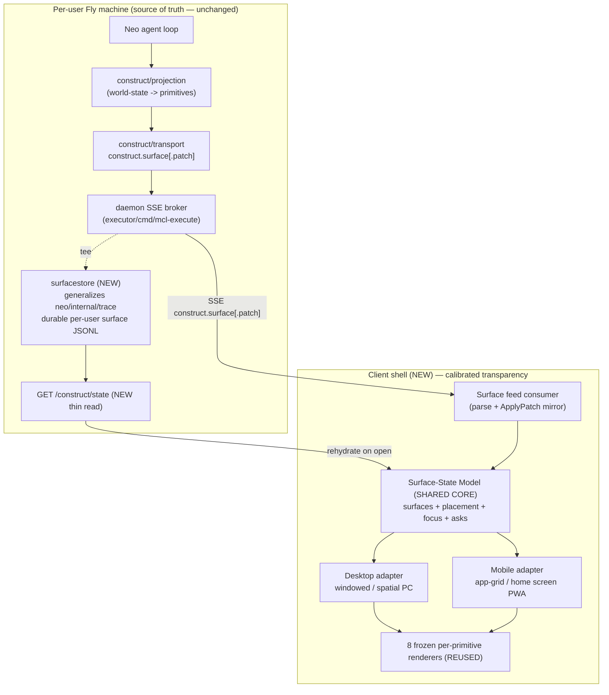
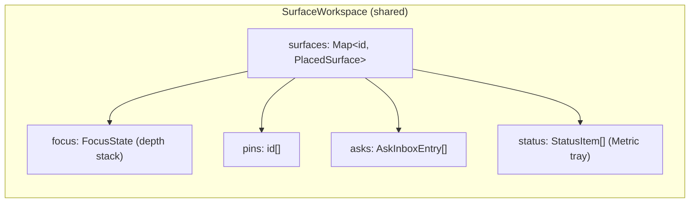
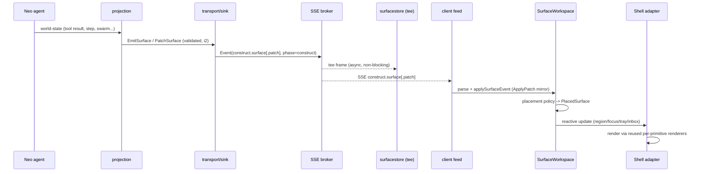
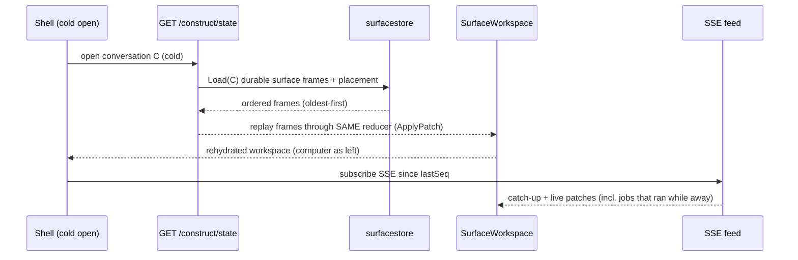

# Spec Document: Construct OS Shell

## Overview

The Construct OS Shell turns Matrix's client from "an assistant that happens to have a
computer" into "a cloud computer that Neo is a resident in." Today Neo's projected work
streams into the client as a flat, ephemeral, animated list of surfaces rendered *beside*
a chat thread (`ConstructSurfaces` + the `NeoComputer` two-pane "screen" panel). That shape
is a sideshow: it vanishes when the live SSE replay buffer drops, it is anchored to a single
in-flight run, and chat is the page while the work is a guest.

This feature makes the Construct the **centerpiece** by adding three things on top of the
existing, frozen 8-primitive renderer stack — without rebuilding a single per-primitive
renderer:

1. A **spatial, persistent shell** (the "OS") that arranges surfaces as durable, addressable,
   re-enterable "apps/windows/panels" instead of a stream-ordered column.
2. A **surface-state store** that durably persists projected surface state per user (a
   generalization of the existing F3 `neo/internal/trace` per-run JSONL trace) so the
   "computer" rehydrates exactly as the user left it across reload, suspend, redeploy, and
   device switch — with long-running jobs still visible.
3. **Frame inversion + depth navigation + async Ask**: the environment becomes primary and
   chat becomes one panel within it; the user can descend glance → summary → raw; and `Ask`
   is elevated from an inline column prompt to an environment-level, asynchronous trust
   back-channel that works even when the user is "in another app" or returns later.

The organizing principle is **calibrated transparency**: give the user just enough visibility
to feel aware and in control (like a developer in an IDE who can see files, running commands,
and intervene) without overwhelming a consumer. The *capability to intervene* — not constant
intervention — is what builds trust, and the shell is the structure that makes that capability
always present.

The work is **mostly additive and is a shell + persistence concern, not a renderer rebuild.**
The shared transparency/surface-state model is the core; the two client shells (Mobile PWA =
home-screen/app-grid; Desktop Web PC = windowed/spatial) are **adapters** over that core.

### Hard constraints (non-negotiable, govern the whole design)

- **Side-channel invariant (load-bearing):** the Construct projection + the shell's persistence
  layer are a pure observability/VIEW layer and MUST NOT perturb the D11 replay byte-identity
  invariant — exactly like the Liaison and the F3 trace sidecar. The agent's execution stays the
  single source of truth; persistence never signs, writes cortex, or mutates plan/walk. The one
  bidirectional path (`Ask` response) enters the agent as an INPUT equivalent to a user message
  (already in the replayable input set), never as a mutation.
- **Show the result, not the tech:** hide protocol jargon (MCL / cortex / Merkle / replay / SSE)
  from the UI. The shell renders a computer, not a debugger.
- **UI rules:** NO border strokes for depth/separation — separation comes purely from
  background-color contrast between surface layers. NO emojis, NO purple gradients, NO glow
  effects. Minimal, dark, high-signal. Paxeer Blue `#004CED` single accent; Inter + JetBrains Mono.
- **Transport invariant (i7):** surfaces ride the existing chat SSE/WS transport. The shell adds
  no new agent→client wire path; it adds a client-side state model and a server-side persistence
  sidecar plus a rehydration read path.
- **Types are codegen'd** from the Go `construct/schema` — never hand-edited (`types.gen.ts`).
- **Frozen ontology:** the 8 primitives + 5 attributes are FROZEN. This feature maps them onto OS
  concepts; it does NOT add primitives.
- **Dev box:** never `git commit`/`git push`; uncommitted state is expected.

### Goals

- A persistent, spatial environment that survives reload and device switch ("never vanishing").
- Frame inversion: environment primary, chat a panel.
- Depth navigation: glance → summary → raw, at the shell level.
- Async, environment-level `Ask`.
- One shared model; two shell adapters (mobile + desktop).
- Reuse the 8 frozen per-primitive renderers untouched.

### Non-Goals

- Rebuilding or re-styling the per-primitive renderers (Narration/Metric/Entity/Structure/
  Stream/Timeline/Canvas/Ask) — they are reused as-is.
- Re-deriving the frozen Construct ontology or adding a 9th primitive.
- Changing the agent execution / replay path. The shell is a view + persistence concern only.
- Building a generative-UI layer. The agent fills trusted primitives; the shell only *arranges*
  them.
- Production redeploy (Andrew-gated, out of this spec's authorship scope).

## Reuse vs New (grounded in the current repo)

| Concern | Status | Artifact |
| --- | --- | --- |
| 8 primitive wire schema + attributes + envelope | REUSE (built) | `construct/schema/{surface,kind,attributes,builders}.go`, `schema/primitives/*` |
| Surface transport over SSE (`construct.surface[.patch]`) | REUSE (built) | `construct/transport/{transport,patch}.go` |
| Progressive patch merge semantics | REUSE (built) | `construct/transport/patch.go` `ApplyPatch` |
| Projection engine (world-state → primitives) | REUSE (built), assess coverage | `construct/projection/{project,render}.go` |
| Ask back-channel response contract | REUSE (built) | `construct/backchannel/backchannel.go` |
| Per-primitive renderers (web) | REUSE untouched | `apps/client/components/matrix/construct/*` |
| Per-primitive renderers (mobile) | REUSE untouched | `apps/mobile/src/components/neo/construct/*` |
| Durable per-run JSONL trace sidecar | GENERALIZE | `neo/internal/trace/trace.go` |
| `ConstructSurfaces` flat animated list | REPLACE/AUGMENT | `apps/client/.../construct/surface-renderer.tsx` |
| `NeoComputer` two-pane "screen" panel beside chat | INVERT/SUBSUME | `apps/client/.../neo/neo-computer.tsx` |
| Surface-state store (durable, per-user, addressable) | NEW | `construct/surfacestore` (Go) + client store |
| Spatial composition model (shell layout) | NEW | client shell packages |
| Shell rehydration read endpoint | NEW (thin) | daemon route reusing trace `/data` |
| Async/environment-level Ask inbox | NEW (shell-level), reuses backchannel | client + daemon park/resume (Phase 5 built) |

## Architecture

The shell is a **shared core (the surface-state model + projection feed + persistence) with two
presentation adapters**. The agent and transport are unchanged; the shell is downstream of the
existing surface stream.



Key architectural decisions:

- **The shared core is the Surface-State Model.** Both shells read the same model; they differ only
  in *placement strategy* and *chrome*. This is what makes "the transparency model is shared, the
  shell shape differs" concrete.
- **Persistence is a server-side tee, not a client cache.** The durable record lives on the per-user
  machine (the same `/data` volume as the F3 trace, cortex, conversation, and task stores), so it
  survives the PWA being closed and reopened on a different device. The client rehydrates from the
  server; it does not own the durable truth. This is required for "close on desktop, reopen on phone,
  the computer is as you left it."
- **The persistence record is the exact surface event stream** (`construct.surface[.patch]` frames),
  so rehydration replays through the *same* reducer (`ApplyPatch`) the live feed uses — guaranteeing
  the rehydrated computer is byte-identical to the live one. This mirrors the F3 trace design exactly.
- **Long-running task visibility is a property of the server record, not the client connection.** A
  task that continues while the user is disconnected keeps emitting surfaces that the store tees;
  on reconnect the shell shows current state plus the catch-up.

## The Surface-State Model (shared core)

This is the biggest new piece. The current model is implicitly "an ordered array of surfaces"
(`task.surfaces: Surface[]`). The OS shell generalizes that into a **spatial, addressable,
persistent workspace state** while keeping the surfaces themselves exactly as the schema defines.

The model is *additive over* the existing `Surface` envelope: it never changes a `Surface`; it wraps
each one with shell-level placement/lifecycle metadata and indexes them for addressing.

### Surface → OS concept mapping

The frozen primitives map onto OS concepts (the shell chooses chrome by `kind`; renderers are reused):

| Primitive | OS concept | Shell treatment |
| --- | --- | --- |
| `Entity` | file / object / app | An openable, re-enterable item with affordances |
| `Structure` | finder / app-grid / file tree | Navigable collection; the home arrangement |
| `Canvas` | window (web page / image / doc) | A focusable window; fullscreen on descend |
| `Stream` | terminal / logs | A power drawer (collapsed by default, expandable) |
| `Timeline` | activity / task center | Glanceable awareness of what Neo is doing |
| `Metric` | system tray / status | Cost / PAX spend / progress in persistent status area |
| `Ask` | dialog / permission / notification | Environment-level, async; surfaces in an Ask inbox |
| `Narration` | "Neo talking" | One panel (chat), not the page |

### Placement model

Each surface gets a `Placement` describing *where it lives* in the environment and its lifecycle.
Placement is shell metadata, derived by a deterministic **placement policy** from the surface's
`kind` + `attributes` + `ref`/`parent` (composition), with a per-shell layout projection. Placement
is persisted alongside surfaces so the arrangement is itself durable (a pinned window stays pinned).



- **`region`** — which OS zone the surface occupies: `home` (Structure/Entity grid), `window`
  (Canvas/Entity focus), `drawer` (Stream), `activity` (Timeline), `tray` (Metric), `inbox` (Ask),
  `narration` (Narration/chat).
- **`pinned`** — surfaces the user has pinned ("apps you return to"); pinned surfaces persist across
  runs and survive cleanup.
- **`lifecycle`** — `live | settled | archived`. Live = currently patching; settled = run done but
  retained; archived = aged out of the hot set but re-enterable from history.
- **`zOrder` / `gridSlot`** — desktop window stacking vs mobile grid slot; the *only* fields the two
  adapters interpret differently.

### Addressing ("never vanishing")

Every surface is addressable by a stable URI so it is re-enterable later — the core of "never
vanishing." The address is derived from the persisted identity, not the live connection:

```
construct://{conversationId}/{surfaceId}            a single surface (re-enter)
construct://{conversationId}/{surfaceId}/raw        its deepest level (e.g. Timeline step -> Stream)
construct://{conversationId}#home                   the home arrangement
```

Opening an address rehydrates the surface (and its `ref`-linked children) from the store if it is not
in the hot set. This makes "tap a surface you saw yesterday and re-enter it" a read against durable
state.

### Depth navigation (calibrated transparency made concrete)

Depth is a **shell-level focus stack**, not a per-renderer concern. Three levels:

1. **Glance** — the surface in its home/region chrome (a Timeline as an activity row, a Canvas as a
   thumbnail window, a Stream as a collapsed drawer).
2. **Summary** — focused/expanded (Timeline expanded to its steps, Entity to its fields + affordances,
   Canvas enlarged).
3. **Raw** — the deepest truth (tap a Timeline step → its linked `Stream` via `ref`; Canvas →
   fullscreen; Entity → underlying records). This is where "see the raw command/log" lives.

Descending follows `ref`/`parent` links already present in the envelope; the shell pushes a
`FocusState` frame and the same reused renderer renders at the deeper level. Ascending pops the stack.

### Frame inversion

Today the workspace mounts surfaces *beside* chat (`NeoComputer` is a right-side panel; chat is the
page). The shell inverts this: the **environment is the page**, and `Narration` (chat) is one panel
within it (`region: narration`). Concretely, the top-level client route renders the `Shell`
(desktop or mobile adapter) as the root; the chat thread is a `NarrationPanel` the shell lays out
like any other region. No renderer changes — only what mounts at the root and where Narration sits.

### Async, environment-level Ask

`Ask` is the trust spine. Today an `Ask` renders inline in the surface column and the web
`surface-renderer.tsx` notes `onRespond` is "wired in Phase 5." The back-channel contract itself is
built (`construct/backchannel`), and the implementation plan logs Phase 5 as the parking/resume path.
The shell elevates `Ask` so it works when the user is elsewhere or returns later:

- An emitted `Ask` enters the model's **Ask inbox** (`region: inbox`) AND raises an environment-level
  notification (a tray badge + a non-blocking surface), rather than blocking a single column.
- Because the Ask surface is persisted like any other, a returning user (even on another device) sees
  the still-pending Ask and can answer it. The run stays parked server-side until answered or expired
  (timeout/cancellation already defined in the plan's Phase 5).
- Answering posts the typed response back through the existing back-channel; the response is validated
  by `backchannel.ValidateResponse` and delivered to the parked agent as an INPUT (replay-safe).
- **Liveness verification is a required design check:** the shell MUST confirm `onRespond` is wired
  end-to-end (client → daemon POST → parked agent resume). If Phase 5 wiring is incomplete in a target
  client, that gap is the first integration task — it is non-negotiable for an OS feel.

### Projection coverage (server-side, so the environment is never hollow)

For the environment to feel like a computer, everything Neo does must project into a surface — an
empty environment reads as broken. The design requires an explicit coverage audit of
`construct/projection` against the frozen `[coverage]` map (tool result → Entity/Structure/Metric;
chain tx → Entity(irreversible)+Ask(sign); browser → Canvas+Stream+Timeline; memory →
Structure+Entity; plan/swarm → Timeline+Structure; async → Timeline+Metric; cost → Metric). Any
agent action with no projector is a coverage gap to close so no activity is invisible in the shell.
This is a server-side projection concern; the shell consumes whatever the projector emits.

## Data Flow

### Live run (connected)



### Reopen / device switch (rehydration)



The two paths converge on the *same* reducer, so the rehydrated state equals the live state — the
core correctness property of "never vanishing."

## Components and Interfaces

The shell decomposes into a shared client core, two client adapters, and a server-side
persistence + rehydration pair. Types below reflect the real codegen'd `Surface` envelope
(`apps/client/lib/construct/types.gen.ts`) and the Go `construct/schema` it mirrors.

### Component 1: `surfacestore` (Go, NEW — generalizes `neo/internal/trace`)

**Purpose:** durable, per-user, append-only persistence of the Construct surface event stream, so the
environment rehydrates across reload/suspend/redeploy/device-switch. It is a generalization of the F3
trace `Store`: same async-writer + JSONL + atomic-rollup + `/data`-rooted discipline, keyed by
conversation instead of run, and recording the typed `construct.surface[.patch]` frames specifically.

**Responsibilities:**
- Tee every `construct.surface[.patch]` SSE frame for a conversation to durable JSONL (non-blocking,
  drop-rather-than-block, exactly like the trace sidecar).
- Load a conversation's ordered surface frames for rehydration.
- Enforce a retained-frame cap with amortized atomic rollup (reuse the trace rollup design).
- Remain a pure sidecar: never sign, never write cortex, never touch plan/walk (D11-safe).

**Interface (Go):**

```go
package surfacestore

// Frame is one persisted surface event. Its shape mirrors the daemon SSE
// Event ({seq,ts,phase,type,fields}) so a reopen replays through the same
// reducer the live stream uses — identical to neo/internal/trace.Event.
type Frame struct {
    Seq    int                    `json:"seq"`
    Ts     string                 `json:"ts"`
    Phase  string                 `json:"phase"` // always "construct"
    Type   string                 `json:"type"`  // construct.surface | construct.surface.patch
    Fields map[string]interface{} `json:"fields,omitempty"`
}

type Store struct { /* dir, retain, async writer — mirrors trace.Store */ }

// Open builds a store rooted at dir (shares /data with cortex/trace/task
// stores) and starts its background writer. Empty dir => disabled no-op store.
func Open(dir string) *Store

// Record enqueues one surface frame for async persistence. NEVER blocks the
// broker publish path; drops on saturation (best-effort sidecar).
func (s *Store) Record(conversationID string, f Frame)

// Load returns a conversation's persisted surface frames, oldest-first, capped
// to the newest `retain`. Safe concurrent with the writer (atomic writes).
func (s *Store) Load(conversationID string) []Frame

func (s *Store) Enabled() bool
func (s *Store) Flush()
func (s *Store) Close()

// Dir resolves the surface-store directory from an override or the cortex
// root's parent (so it shares /data and survives suspend/redeploy).
func Dir(override, cortexRoot string) string
```

### Component 2: Rehydration read path (Go, NEW — thin daemon route)

**Purpose:** serve a conversation's durable surface frames to a cold-opening shell.

**Interface:**

```go
// GET /construct/state?conversation_id=&since_seq=
// Returns ordered surface frames for rehydration. since_seq enables catch-up
// (return only frames after a seq the client already has). Read-only.
type StateResponse struct {
    ConversationID string  `json:"conversation_id"`
    Frames         []Frame `json:"frames"`   // oldest-first, schema-validated on emit
    LastSeq        int     `json:"last_seq"` // newest seq, for the SSE since cursor
}
```

### Component 3: Surface feed consumer (TypeScript, EXTENDS existing)

**Purpose:** consume `construct.surface[.patch]` SSE frames AND rehydration frames through one
reducer, mirroring the Go `transport.ApplyPatch` (already mirrored client-side in
`apps/client/lib/construct/store.ts` `applySurfaceEvent`). The shell reuses that reducer; it adds the
rehydration entry point and a `lastSeq` cursor.

```typescript
// Reuses the existing client reducer (store.ts applySurfaceEvent), adding a
// cold-start hydrate from the rehydration endpoint.
interface SurfaceFeed {
  /** Replay durable frames (rehydration), then subscribe live since lastSeq. */
  hydrate(conversationId: string): Promise<void>
  /** Apply one live SSE frame (construct.surface | construct.surface.patch). */
  applyEvent(event: SSEEvent): void
  /** The reactive shared model the shells read. */
  readonly workspace: SurfaceWorkspace
}
```

### Component 4: `SurfaceWorkspace` — the shared core model (TypeScript, NEW)

**Purpose:** the single source of client-side shell state both adapters read. Wraps each `Surface`
with placement/lifecycle and indexes for addressing, focus (depth), pins, the Ask inbox, and the
Metric tray.

```typescript
import type { Surface, AskResponse } from '@/lib/construct/types.gen'

type Region =
  | 'home' | 'window' | 'drawer' | 'activity' | 'tray' | 'inbox' | 'narration'
type Lifecycle = 'live' | 'settled' | 'archived'

interface Placement {
  region: Region
  pinned: boolean
  lifecycle: Lifecycle
  zOrder?: number    // desktop window stacking
  gridSlot?: number  // mobile home-grid slot
}

interface PlacedSurface {
  surface: Surface          // the frozen envelope, UNCHANGED
  placement: Placement
  address: string           // construct://{conversationId}/{surfaceId}
  updatedSeq: number
}

interface FocusFrame { surfaceId: string; level: 'glance' | 'summary' | 'raw' }
interface FocusState { stack: FocusFrame[] }            // depth navigation
interface AskInboxEntry { surfaceId: string; pending: boolean; expiresAt?: string }

interface SurfaceWorkspace {
  conversationId: string
  surfaces: Map<string, PlacedSurface>
  focus: FocusState
  pins: string[]
  asks: AskInboxEntry[]
  tray: string[]            // Metric surface ids in the status area
  lastSeq: number
}
```

### Component 5: Placement policy (TypeScript, NEW — deterministic)

**Purpose:** derive a `Placement` from a `Surface` deterministically, so the arrangement is
reproducible (and rehydration yields the same layout). Pure function; no I/O.

```typescript
// Deterministic: same surface (+ prior placement) always yields the same region.
function placeSurface(surface: Surface, prior?: Placement): Placement
```

### Component 6: Shell adapters (TypeScript, NEW — desktop + mobile)

**Purpose:** present the shared `SurfaceWorkspace`. They consume the SAME model and the SAME reused
per-primitive renderers; they differ only in layout projection and chrome.

```typescript
interface ShellAdapter {
  // Lay out placed surfaces into the adapter's geometry.
  layout(workspace: SurfaceWorkspace): LayoutPlan
  // Both call the existing SurfaceRenderer per surface (renderers untouched).
}
// DesktopShell: windows by zOrder, spatial canvas, dock of pinned apps, tray.
// MobileShell:  home app-grid by gridSlot, full-screen focus, bottom tray.
```

## Data Models

### Reused (frozen, unchanged) — `Surface` envelope

The shell never alters this. Shown for grounding (from `construct/schema/surface.go` ↔
`types.gen.ts`):

```typescript
interface Surface {
  kind: 'narration' | 'metric' | 'entity' | 'structure'
      | 'stream' | 'timeline' | 'canvas' | 'ask'
  id: string
  ref?: string        // links to another surface (depth/descend uses this)
  seq?: number
  parent?: string     // composition (descend uses this)
  attributes?: Attributes  // stakes/confidence/cost/temporality
  // exactly one payload pointer set, selected by kind
  narration?: Narration; metric?: Metric; entity?: Entity; structure?: Structure
  stream?: Stream; timeline?: Timeline; canvas?: Canvas; ask?: Ask
}
```

### New — persisted workspace layout record

Placement is persisted so the *arrangement* is durable, not just the surfaces. It rides as its own
frame type in the same JSONL so the one-reducer property holds.

```go
// A placement frame is persisted alongside surface frames (Type =
// "construct.placement"); the rehydration reducer applies it after the surface
// it targets. Pins/zOrder/gridSlot survive reopen.
type PlacementFrame struct {
    SurfaceID string `json:"surface_id"`
    Region    string `json:"region"`
    Pinned    bool   `json:"pinned"`
    Lifecycle string `json:"lifecycle"`
    ZOrder    int    `json:"z_order,omitempty"`
    GridSlot  int    `json:"grid_slot,omitempty"`
}
```

**Validation rules:**
- `Region ∈ {home, window, drawer, activity, tray, inbox, narration}`.
- `Lifecycle ∈ {live, settled, archived}`.
- A placement frame for an unknown `SurfaceID` is buffered until its surface arrives, then applied
  (rehydration ordering tolerance).

## Key Functions with Formal Specifications

### `Store.Record(conversationID, frame)` (Go)

```go
func (s *Store) Record(conversationID string, f Frame)
```

**Preconditions:**
- `s` may be disabled (empty dir) — then this is a safe no-op.
- `f.Type ∈ {construct.surface, construct.surface.patch}` and `f.Phase == "construct"`.
- Called on the broker publish hot path.

**Postconditions:**
- Non-blocking: returns without disk I/O on the caller goroutine.
- On success, `f` is eventually appended to `{dir}/{conversationID}.surfaces.jsonl`.
- On queue saturation, `f` is DROPPED (best-effort), never blocks the agent loop.
- No cortex write, no signing, no plan/walk mutation (side-channel invariant).

**Loop invariants:** N/A (enqueue only; the writer goroutine owns the loop, per trace design).

### `Store.Load(conversationID) -> []Frame` (Go)

```go
func (s *Store) Load(conversationID string) []Frame
```

**Preconditions:** `conversationID` contains no path separators (rejected → empty).

**Postconditions:**
- Returns frames oldest-first, capped to newest `retain`.
- A crash-truncated final JSONL line is skipped (crash-atomic).
- Pure read; safe concurrent with the writer (atomic writes).

### `applySurfaceEvent(workspace, event) -> SurfaceWorkspace` (TS, reducer)

```typescript
function applySurfaceEvent(ws: SurfaceWorkspace, event: SSEEvent): SurfaceWorkspace
```

**Preconditions:**
- `event.type ∈ {construct.surface, construct.surface.patch}`.
- For a patch, `event.fields.id` targets a surface id; if absent from `ws`, the patch is buffered
  (out-of-order tolerance) — never silently dropped.

**Postconditions:**
- `construct.surface` → upsert a `PlacedSurface` (placement via `placeSurface`).
- `construct.surface.patch` → fold via the patch semantics mirroring Go `ApplyPatch`
  (Stream append+dedup-by-seq; Timeline upsert-by-step-id; others replace payload).
- Idempotent on replay: applying the same frame twice yields the same workspace (dedup by seq).
- The base `Surface` envelope is never mutated in place (clone-on-write), mirroring `ApplyPatch`.

**Loop invariants (over a frame batch during rehydration):**
- After applying frames `0..k`, `ws` equals the live workspace that had processed the same
  `0..k` frames (one-reducer convergence).
- `ws.lastSeq` is monotonically non-decreasing.

### `placeSurface(surface, prior?) -> Placement` (TS, deterministic policy)

```typescript
function placeSurface(surface: Surface, prior?: Placement): Placement
```

**Preconditions:** `surface` is a valid envelope (exactly one payload matching `kind`).

**Postconditions:**
- Deterministic: equal `(surface, prior)` always yields an equal `Placement`.
- `region` is a pure function of `surface.kind` (+ `attributes` for tray/inbox routing).
- A `prior.pinned` is preserved (user pins survive re-projection).
- `Ask` with `attributes.stakes ∈ {decision, irreversible}` routes to `region: inbox`.

### `respondToAsk(workspace, surfaceId, response)` (TS → daemon → agent)

```typescript
async function respondToAsk(
  ws: SurfaceWorkspace, surfaceId: string, response: AskResponse,
): Promise<void>
```

**Preconditions:**
- `ws.surfaces.get(surfaceId).surface.kind === 'ask'` and the Ask is pending (not expired).
- `response` satisfies the Ask kind contract (validated server-side by
  `backchannel.ValidateResponse`).

**Postconditions:**
- POSTs `{conversation_id, intent_id, ask_id, response}` to the back-channel endpoint.
- On accept, the agent receives the answer as an INPUT (replay-safe; never a plan/walk mutation).
- The Ask surface is patched to its answered/settled state (via `backchannel.Answered` →
  `construct.surface.patch`) and removed from the inbox.
- A bad/duplicate/expired `ask_id` is rejected; the run stays parked; the inbox entry is unchanged.

## Algorithmic Pseudocode

### Rehydrate-then-subscribe (the "never vanishing" core)

```pascal
ALGORITHM hydrateWorkspace(conversationId)
INPUT:  conversationId
OUTPUT: a SurfaceWorkspace equal to the live workspace at reconnect time

BEGIN
  ws ← emptyWorkspace(conversationId)

  // 1. Durable replay through the SAME reducer the live stream uses.
  resp ← GET /construct/state?conversation_id=conversationId
  FOR each frame IN resp.frames DO          // oldest-first, ordered by seq
    ASSERT ws.lastSeq ≤ frame.seq           // loop invariant: monotonic seq
    ws ← applySurfaceEvent(ws, frame)        // surface | patch | placement
  END FOR
  ASSERT ws.lastSeq = resp.last_seq

  // 2. Subscribe live, catching up anything emitted while cold (long-running
  //    jobs that continued without the user connected).
  subscribe SSE construct.surface[.patch] WHERE since_seq = ws.lastSeq
  ON each liveFrame DO
    ws ← applySurfaceEvent(ws, liveFrame)
  END ON

  RETURN ws
END
```

**Preconditions:** the store recorded frames for `conversationId` (or returns empty for a fresh
conversation).

**Postconditions:** `ws` is byte-equivalent to a workspace that processed the same frame sequence
live; no surface the agent ever emitted is missing (durability), including jobs that ran while
disconnected.

### Depth descend (glance → summary → raw)

```pascal
ALGORITHM descend(ws, surfaceId)
INPUT:  ws, surfaceId currently focused
OUTPUT: ws with a deeper focus frame pushed

BEGIN
  current ← topLevel(ws.focus) OR 'glance'
  next ← deeper(current)                    // glance -> summary -> raw

  IF next = 'raw' THEN
    s ← ws.surfaces[surfaceId].surface
    // Raw = the deepest linked truth, via the envelope's existing ref/parent.
    target ← resolveRef(ws, s.ref) OR surfaceId   // e.g. Timeline step -> Stream
    IF target ∉ ws.surfaces THEN
      hydrateAddress(ws, addressOf(conversationId, target))  // re-enter if cold
    END IF
    push(ws.focus, FocusFrame(target, 'raw'))
  ELSE
    push(ws.focus, FocusFrame(surfaceId, next))
  END IF

  RETURN ws
END
```

### Placement policy (deterministic region routing)

```pascal
ALGORITHM placeSurface(surface, prior)
INPUT:  surface, optional prior placement
OUTPUT: placement

BEGIN
  pinned ← prior.pinned IF prior ELSE false
  lifecycle ← 'live'

  region ← CASE surface.kind OF
    'narration': 'narration'
    'metric':    'tray'
    'stream':    'drawer'
    'timeline':  'activity'
    'canvas':    'window'
    'structure': 'home'
    'entity':    IF prior.region = 'window' THEN 'window' ELSE 'home'
    'ask':       IF surface.attributes.stakes IN {'decision','irreversible'}
                   THEN 'inbox' ELSE 'inbox'   // Ask is always environment-level
  END CASE

  RETURN Placement(region, pinned, lifecycle,
                   zOrder = prior.zOrder, gridSlot = prior.gridSlot)
END
```

## Example Usage

```typescript
// Cold open on any device: the computer rehydrates as the user left it.
const feed = createSurfaceFeed(conversationId)
await feed.hydrate(conversationId)        // durable replay + live subscribe

// The shell adapter (chosen by platform) renders the shared model.
const shell = isMobile ? new MobileShell() : new DesktopShell()
render(shell.layout(feed.workspace))      // reuses the 8 frozen renderers

// Frame inversion: the environment is the root; chat is one region.
//   <Shell workspace={feed.workspace}>
//     <NarrationPanel region="narration" />   // chat, not the page
//     <HomeRegion /> <WindowRegion /> <Drawer /> <Activity /> <Tray /> <Inbox />
//   </Shell>

// Depth navigation: descend a Timeline step to its raw Stream.
descend(feed.workspace, timelineSurfaceId)   // glance -> summary
descend(feed.workspace, timelineStepRef)     // summary -> raw (the log)

// Async Ask: answered later, possibly from another device.
await respondToAsk(feed.workspace, askSurfaceId, { choice: 'approve' })
```

```go
// Server-side: tee surface frames to the durable store (broker sibling of the
// liaison narrator / the F3 trace sidecar). Pure side-channel.
store := surfacestore.Open(surfacestore.Dir(envOverride, cortexRoot))
broker.Subscribe(func(ev sseEvent) {
    if ev.Phase == transport.Phase { // "construct"
        store.Record(ev.ConversationID(), surfacestore.Frame{
            Seq: ev.Seq, Ts: ev.TS, Phase: ev.Phase, Type: ev.Type, Fields: ev.Fields,
        })
    }
})
```

## Correctness Properties

These are the universally-quantified invariants the implementation must preserve. They drive the
property-based tests in the Testing Strategy.

### Property 1: Rehydration fidelity (the "never vanishing" property)
For every conversation `C` and every sequence of surface frames `F`, the workspace produced by
`hydrateWorkspace(C)` (durable replay) equals the workspace produced by applying `F` live, frame for
frame. `∀ C, F: hydrate(replay(F)) ≡ liveApply(F)`.

### Property 2: Reducer idempotence on replay
For every workspace `ws` and frame `f`,
`applySurfaceEvent(applySurfaceEvent(ws, f), f) ≡ applySurfaceEvent(ws, f)` (dedup by seq for
Stream/Timeline; replace is naturally idempotent).

### Property 3: Placement determinism
For every surface `s` and prior placement `p`, `placeSurface(s, p)` always returns the same
`Placement` (region is a pure function of `kind` + `attributes`; pins are preserved).

### Property 4: Renderer reuse / envelope immutability
For every frame applied, the stored `Surface` envelope is structurally unchanged from what the schema
validated — the shell wraps, never mutates. `∀ f: surfaceOf(apply(ws, f)) ≡ schemaSurface(f)`.

### Property 5: Side-channel non-perturbation (D11)
For every run, the set of replayable inputs is identical with and without the surface store and the
shell. Persisting/rehydrating surfaces and raising/answering an environment-level Ask add no
plan/walk/cortex mutation; an `Ask` answer is the only feedback and enters as a recorded INPUT (same
footing as a user message).

### Property 6: Ask liveness + safety
Every pending `Ask` is answerable until it expires; an answer that passes
`backchannel.ValidateResponse` resumes the parked run exactly once; a duplicate/expired/malformed
`ask_id` is rejected and leaves the run parked.

### Property 7: Addressing re-enterability
For every surface the agent ever emitted in `C`, its `construct://C/{id}` address resolves (from the
hot set or by rehydration) — no emitted surface is unreachable.

### Property 8: Shared-core / two-shell equivalence
For every `SurfaceWorkspace`, the desktop and mobile adapters render the same set of surfaces through
the same renderers; they differ only in placement geometry (`zOrder`/`gridSlot`/chrome), never in
*which* surface state is shown.

### Property 9: Trusted-render safety (i2)
An unknown/malformed surface kind degrades to nothing (never executed markup), in the shell exactly as
in the existing `SurfaceRenderer` default case.

## Error Handling

### Store queue saturation
**Condition:** the async writer queue is full on a burst.
**Response:** drop the frame (best-effort sidecar), log to stderr — never block the broker publish
path. Identical to the F3 trace policy.
**Recovery:** the live workspace remains correct in-memory; only the durable record loses a frame.
A subsequent full `construct.surface` (not a patch) re-establishes truth on next emit.

### Out-of-order / orphan patch
**Condition:** a `construct.surface.patch` arrives before its base surface (or before its placement
frame on rehydration).
**Response:** buffer the patch keyed by target id; apply when the base arrives. Never drop silently.
**Recovery:** bounded buffer; on overflow, request a fresh full surface via re-subscribe `since_seq`.

### Rehydration endpoint unavailable
**Condition:** `GET /construct/state` fails on cold open.
**Response:** open an empty shell and subscribe live (degraded but functional); surface a quiet,
non-jargon status ("reconnecting").
**Recovery:** retry with backoff; on success, replay then reconcile by seq (idempotent reducer makes
double-apply safe).

### Ask expiry / cancellation
**Condition:** an `Ask` is unanswered past its expiry.
**Response:** the run unparks per the Phase 5 timeout policy; the inbox entry flips to expired with an
honest, non-jargon message (no silent hang).
**Recovery:** the agent proceeds on the defined default/timeout path; a late answer to an expired
`ask_id` is rejected.

### Device-switch race (two clients on one conversation)
**Condition:** two shells answer the same `Ask` or both subscribe.
**Response:** the back-channel accepts exactly one answer per `ask_id` (duplicate rejected); both
shells receive the answered patch and settle identically.
**Recovery:** the losing client's optimistic state is reconciled by the authoritative answered patch.

## Testing Strategy

### Unit testing
- `surfacestore`: port the `neo/internal/trace` test suite (async record/flush, atomic rollup at
  2×retain, crash-truncated-line skip, disabled no-op, path-separator rejection), re-keyed by
  conversation and asserting `construct.surface[.patch]` round-trip.
- `placeSurface`: table-driven region routing for all 8 kinds + attribute-driven inbox routing +
  pin preservation.
- `applySurfaceEvent`: parity with Go `transport.ApplyPatch` (Stream append/dedup, Timeline upsert,
  replace kinds), orphan-patch buffering, seq monotonicity.
- Adapters: `layout` produces the same surface set for desktop and mobile from one workspace.

### Property-based testing
**Library:** `fast-check` (TypeScript client) and Go's `testing/quick` (server), matching the
existing repo conventions.

- **Rehydration fidelity (Property 1):** generate arbitrary valid frame sequences; assert
  `hydrate(replay(F)) ≡ liveApply(F)`.
- **Idempotence (Property 2):** generate frame + workspace; assert double-apply equals single-apply.
- **Placement determinism (Property 3):** generate surfaces; assert repeated `placeSurface` calls are
  equal.
- **Envelope immutability (Property 4):** assert the stored envelope deep-equals the validated input.
- **Addressing re-enterability (Property 7):** for a generated emitted-surface set, every address
  resolves after rehydration.

### Integration testing
- E2e rehydration: drive a run, persist frames, cold-open a second client, assert identical workspace
  including a job that continued while the first client was disconnected.
- Ask round-trip across devices: park on client A, answer on client B, assert single resume + settled
  patch on both.
- Side-channel (Property 5): a run with shell persistence + an Ask answer replays byte-identically
  (D11) vs the same run without the shell.
- Phase 5 liveness check: assert `onRespond` is wired client → daemon → parked agent on both clients;
  if not, that is the first integration defect to fix.

## Performance Considerations

- The store is off the hot path (async writer, drop-on-saturation), identical to F3 trace — no added
  latency to the agent loop or broker publish.
- Rehydration is bounded by the retained-frame cap (amortized rollup), so cold-open cost is O(retain),
  not O(run history).
- The client reducer is the existing one; the shell adds placement indexing (O(1) per frame) and a
  focus stack (O(depth)). Reactive updates are keyed by surface id so a patch updates one window in
  place rather than re-laying-out the environment.
- Mobile PWA: the home-grid virtualizes archived/settled surfaces; only `live` + `pinned` + visible
  surfaces mount.

## Security Considerations

- **Side-channel boundary (load-bearing):** persistence and the shell are a pure VIEW layer; the only
  agent feedback is a validated `Ask` answer entering as a recorded input. No path lets the shell sign,
  write cortex, or mutate plan/walk — preserving D11.
- **Trusted renderers (i2):** the shell arranges but never synthesizes UI; unknown kinds render
  nothing. No generative-UI surface is introduced.
- **Ask validation:** every posted response is gated by `backchannel.ValidateResponse` before reaching
  the parked agent; wallet `sign` still crosses the rigorous money rail (`core_execute`).
- **Per-user isolation:** the store is rooted in the per-user machine's `/data`; addresses are scoped
  by `conversationId`; no cross-user surface access.
- **No jargon leakage:** the UI must not surface MCL/cortex/Merkle/replay/SSE internals (consumer
  product shows the result, not the tech).

## Dependencies

- **Existing, reused:** `construct/schema`, `construct/transport`, `construct/projection`,
  `construct/backchannel` (Go); `apps/client/lib/construct/{types.gen,store,adapter}.ts` and the 8
  web renderers; `apps/mobile/.../construct/*` (the 8 mobile renderers); the daemon SSE broker
  (`executor/cmd/mcl-execute`); `neo/internal/trace` (the persistence pattern to generalize).
- **New (Go):** `construct/surfacestore` (or `neo`-hosted, mirroring trace placement) + a thin
  `GET /construct/state` daemon route; broker subscription wiring (sibling of the liaison narrator).
- **New (TypeScript):** `SurfaceWorkspace` shared model + `placeSurface` policy + `SurfaceFeed`
  hydrate path + `DesktopShell`/`MobileShell` adapters + a root-level frame-inversion mount.
- **Codegen:** any Go-side type that must reach the client extends `construct/internal/codegen` and is
  regenerated (never hand-edited).
- **Tooling:** `fast-check` (client PBT), Go `testing/quick` (server PBT) — match existing conventions.

## Phasing / MVP

The full architecture above is the target. The smallest version that proves the *feeling* — agreed as
the first slice — is deliberately narrow:

**MVP (proof-of-concept slice): "one persistent home that breathes."**
1. **One persistent home surface that survives reload.** Generalize the F3 trace into
   `surfacestore` for ONE conversation; add `GET /construct/state`; wire `hydrate()` so the client
   cold-opens to the rehydrated workspace. (Properties 1, 2, 7.)
2. **A live Timeline of what Neo is doing**, placed in the `activity` region (glanceable awareness).
   Reuses the existing `TimelineView`.
3. **Descend one level of depth** — tap a Timeline step → its linked `Stream` (raw). (`descend`, raw
   level only.)
4. **Chat hosted as a panel, not the page** — minimal frame inversion: root mounts the shell with a
   `NarrationPanel` region.

The MVP uses ONE shell adapter first (desktop OR mobile, whichever proves the feel fastest), the
shared model from day one (so the second adapter is purely additive), and verifies the Ask back-channel
is live end-to-end even though async Ask elevation lands in expansion.

**Expansion (post-MVP), in dependency order:**
- E1 — Full placement model + spatial/windowed desktop adapter + app-grid mobile adapter (both over
  the shared core).
- E2 — Pinned "apps you return to" + lifecycle (live/settled/archived) + addressing for re-entry of
  older surfaces.
- E3 — Async, environment-level Ask inbox + cross-device answer + expiry surfacing.
- E4 — Full depth navigation (glance → summary → raw for all kinds) + Metric system-tray.
- E5 — Projection coverage audit + close gaps so the environment is never hollow.
- E6 — Second shell adapter parity + device-switch reconciliation.

This phasing centers the proof-of-concept first, then grows the shell outward while the shared
surface-state model — the actual core — is in place from the very first slice.
