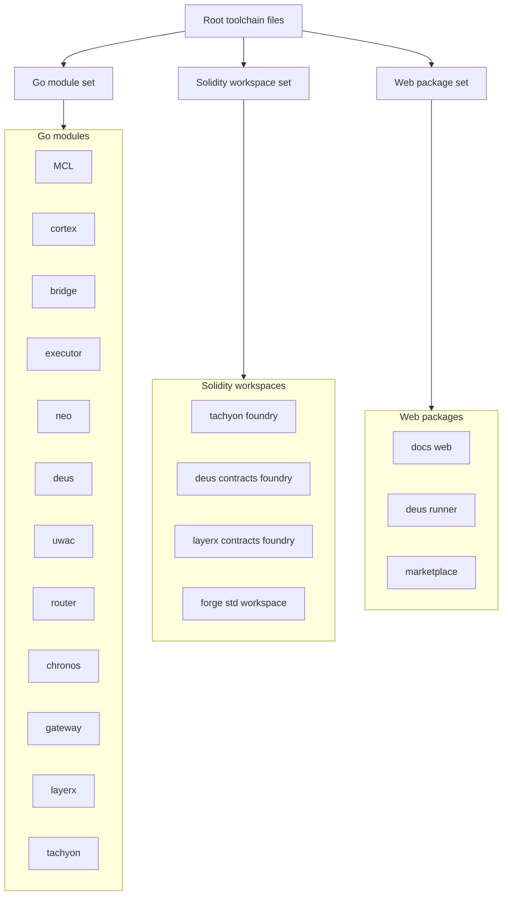

# Getting Started - Module Manifests

## Overview

This repository is split into a set of small, purpose-built manifests instead of one shared workspace. The Go services are separated into independent modules, the Solidity areas are grouped into Foundry workspaces, and the React and Node tooling lives in package-level manifests so each surface can be bootstrapped with the right toolchain.

That partitioning is reinforced by the root `Makefile` and the lint configuration. The `Makefile` fans out build, test, vet, tidy, format, and lint operations across the Go module set, while `.golangci.yml` defines the lint policy that those module-level checks inherit.

## Monorepo Partitioning



## Go Module Partitioning

The Go layer is split by runtime boundary rather than by a single top-level module. Several modules import each other through local `replace` directives, while others stay intentionally lean and depend only on infrastructure packages like PostgreSQL, cron, or HTTP clients.

| Path | Declared module | Go version | Visible direct dependencies and wiring |
| --- | --- | --- | --- |
| `MCL/go.mod` | `matrix/mcl` | 1.21 | `github.com/fxamacker/cbor/v2`; indirect `github.com/x448/float16` |
| `cortex/go.mod` | `matrix/cortex` | 1.21 | `github.com/cockroachdb/pebble`, `github.com/fxamacker/cbor/v2`, `github.com/oklog/ulid/v2`, `golang.org/x/time` |
| `bridge/go.mod` | `matrix/bridge` | 1.21 | Depends on `matrix/cortex` and `matrix/mcl`; local `replace` directives point those imports to `../cortex` and `../MCL` |
| `executor/go.mod` | `matrix/executor` | 1.21 | Depends on `matrix/mcl`, `matrix/bridge`, and `matrix/cortex`; local `replace` directives point to `../MCL`, `../bridge`, and `../cortex`; also uses `github.com/gorilla/websocket` and `github.com/creack/pty` |
| `neo/go.mod` | `matrix/neo` | 1.21 | Depends on `matrix/cortex`, `matrix/executor`, and `matrix/mcl`; local `replace` directives point to `../cortex`, `../executor`, `../bridge`, and `../MCL` |
| `router/go.mod` | `matrix/router` | 1.21 | `github.com/jackc/pgx/v5` |
| `chronos/go.mod` | `github.com/Sidiora-Labs/centra-llm-agents/chronos` | 1.22 | `github.com/jackc/pgx/v5`, `github.com/robfig/cron/v3` |
| `gateway/go.mod` | `matrix/gateway` | 1.21 | Commented as a leaf module with no `replace` directives; visible requirement on `github.com/lib/pq v1.12.3` |
| `router/go.mod` | `matrix/router` | 1.21 | `github.com/jackc/pgx/v5` |


## Go Module Tooling Rules

### `Makefile`

gateway/go.mod says the gateway is “stdlib-only by deliberate choice,” but the same file requires github.com/lib/pq v1.12.3. The manifest is therefore not pure standard library code; the gateway still needs an external PostgreSQL driver at bootstrap.

- `Makefile` treats `MCL`, `bridge`, `executor`, `gateway`, `router`, `cortex`, `tachyon`, `deus`, `neo`, `chronos`, and `layerx` as the module set for build, test, vet, tidy, and lint fan-out.
- `build`, `test`, `vet`, and `tidy` run once per module using `go -C <module>`.
- `fmt` and `fmt-check` operate across the module list with `gofmt`.
- `lint` runs `golangci-lint` per module using `.golangci.yml`.
- `ci` chains `fmt-check`, `vet`, and `test`.
- `install` emits the runnable binaries from the individual module trees into `bin/`.

### `.golangci.yml`

- Targets Go `1.21` with a `5m` timeout.
- Runs with `tests: true` and `modules-download-mode: readonly`.
- Enables parallel runners.
- Disables all linters by default and turns on a focused set: `errcheck`, `gosimple`, `govet`, `ineffassign`, `staticcheck`, `typecheck`, `unused`, `misspell`, `bodyclose`, and `rowserrcheck`.
- Excludes the `runs`, `deploy`, `skills`, `knowledge`, and `research` directories from issue collection.
- Applies looser rules to test files and generated CLI mains, and makes special exceptions for `cortex/cmd/two-model-smoke` and `executor/cmd/mcl-e2e`.

## Solidity Workspace Partitioning

The Solidity manifests split the contract workspaces by product area and by vendored dependency tree. The Foundry configuration files define compiler version, optimizer settings, source roots, test roots, and workspace-specific filesystem permissions.

| Path | What it declares | Getting started impact |
| --- | --- | --- |
| `tachyon/foundry.toml` | `src = "contracts"`, `test = "test"`, `out = "out"`, `libs = ["lib"]`, `solc_version = "0.8.27"`, `optimizer = true`, `optimizer_runs = 200`, `evm_version = "cancun"` | Tachyon contract builds use the `contracts` tree as source and `test` as the Forge test root |
| `deus/contracts/foundry.toml` | `src = "src"`, `out = "out"`, `libs = ["lib"]`, `solc = "0.8.27"`, `evm_version = "shanghai"`, `optimizer = true`, `optimizer_runs = 200`, RPC endpoint `paxeer` from `PAXEER_RPC_URL` | Deus contract builds point at the `src` tree and use the `paxeer` RPC environment variable |
| `layerx/contracts/foundry.toml` | `src = "src"`, `out = "out"`, `libs = ["lib"]`, `test = "test"`, `script = "script"`, `solc = "0.8.27"`, `evm_version = "shanghai"`, `optimizer = true`, `optimizer_runs = 200`, `fs_permissions = [{ access = "read", path = "./out" }]`, `profile.ci.verbosity = 4` | LayerX exposes separate test and script roots and allows read access to `./out` |
| `layerx/contracts/lib/forge-std/foundry.toml` | `fs_permissions = [{ access = "read-write", path = "./" }]`, `optimizer = true`, `optimizer_runs = 200`, ignored Solidity error code `3860`, RPC aliases for `mainnet`, `optimism_sepolia`, `arbitrum_one_sepolia`, and `needs_undefined_env_var` | The vendored Forge Standard Library carries its own test-time and RPC configuration |
| `tachyon/contracts/package.json` | Package metadata for `@openzeppelin/contracts`, `version = 5.6.1`, `files = ["**/*.sol", "/build/contracts/*.json", "!/mocks/**/*"]`, scripts `prepack` and `prepare-docs` | OpenZeppelin contract sources are packaged with a prepack step and a docs preparation step |
| `layerx/contracts/lib/forge-std/package.json` | Package metadata for `forge-std`, `version = 1.16.1`, description, homepage, bugs URL, author, license, repository, and `files = ["src/**/*"]` | The Forge Standard Library package is published from its `src` tree with package metadata already wired |


### Git Submodule Layout

The contract workspaces are backed by explicit submodule declarations.

| Path | Declared submodules |
| --- | --- |
| `.gitmodules` | `deus/contracts/lib/forge-std` |
| `tachyon/.gitmodules` | `lib/forge-std`, `lib/erc4626-tests`, `lib/halmos-cheatcodes` |


`tachyon/.gitmodules` shows Tachyon’s contract workspace pulling in test and cheatcode libraries alongside Forge Standard Library, while the root `.gitmodules` only declares the Forge Standard Library path for the Deus contracts tree.

## Web Package Partitioning

The current web package manifest belongs to the marketplace frontend.

| Path | Package metadata | Scripts | Notes |
| --- | --- | --- | --- |
| `marketplace/package.json` | `name = "marketplace"`, `private = true`, `type = "module"` | `build`, `dev`, `preview`, `deploy`, `cf-typegen`, `typecheck`, `test`, `test:watch` | Uses React Router, Cloudflare tooling, Vitest, TypeScript, and Wrangler |


### `marketplace/Dockerfile`

marketplace/Dockerfile ends with CMD ["npm", "run", "start"], but the visible marketplace/package.json script list does not include start. The image build and runtime command shown in the Dockerfile therefore do not match the package script surface that is visible here.

This Dockerfile uses a four-stage Node 20 Alpine build:

1. `development-dependencies-env` copies the repository and runs `npm ci`.
2. `production-dependencies-env` installs production dependencies with `npm ci --omit=dev`.
3. `build-env` reuses the development `node_modules` tree and runs `npm run build`.
4. The final image copies the production `node_modules` tree and the built output, then starts with `npm run start`.

That layout makes the image reproducible from `package-lock.json` and keeps the production image separate from the build-time dependency set.

## Tachyon Getting Started Surface

`tachyon/.env.example` is the bootstrap surface for the Tachyon runtime. It defines the config file, API bind address, project root, artifacts directory, registry path, Forge path, Solc path, RPC URL, auth token, and wallet overrides.

| Variable | Meaning from the example file |
| --- | --- |
| `TACHYON_CONFIG` | Config file override, defaulting to `tachyon.config.kvx` |
| `TACHYON_API_ADDR` | API bind address, defaulting to `:8645` |
| `TACHYON_PROJECT_ROOT` | Project root override |
| `TACHYON_ARTIFACTS_DIR` | Artifacts directory, defaulting to `artifacts` |
| `TACHYON_REGISTRY_PATH` | Registry JSON path, defaulting to `registry.json` |
| `TACHYON_FORGE_PATH` | Forge executable path |
| `TACHYON_SOLC_PATH` | Solc executable path |
| `PAXEER_RPC_URL` | RPC URL placeholder for the Paxeer network |
| `TACHYON_AUTH_TOKEN` | [REDACTED] |
| `TACHYON_WALLET_MODE` | Wallet mode, `self_hosted` or `embedded` |
| `TACHYON_WALLET_SIGNER` | Signer mode for self-hosted wallets |
| `TACHYON_DEV_PRIVATE_KEY` | [REDACTED] |
| `TACHYON_KEYSTORE_PATH` | Keystore file path |
| `TACHYON_KEYSTORE_PASSWORD` | Keystore password |
| `MATRIX_EXECUTOR_KEY` | Embedded executor key |
| `PAXEER_WALLET_API` | Wallet API endpoint |


The file also warns not to commit real private keys and to prefer `${ENV}` references in `tachyon.config.kvx`.

### `tachyon/AGENTS.md`

```steps
1. Install Foundry | Run `curl -L https://foundry.paradigm.xyz | bash && foundryup` once, then make sure `~/.foundry/bin` is on `PATH`.
2. Build the Tachyon binaries | Use `make deps && make build` to fetch Forge Standard Library content and build the daemon binaries.
3. Run local verification | Use `make ci`, then `./bin/tachyond`, and confirm the health check with `curl http://127.0.0.1:8645/healthz`.
4. Run the optional Forge suite | Use `make forge-test-deps` and then `forge test` for the full contract tree.
```

The same file also documents the runtime interface surface for the Tachyon v1 engine: compile, test, simulate, deploy, call, chain, artifact, and registry verbs are exposed over REST, JSON-RPC, and MCP, and MCP stdio writes logs to stderr while stdout stays NDJSON-RPC only.

## Root-Level Tooling and Quality Gates

### `.golangci.yml`

This file is the repository’s lint policy, not a module manifest itself, but it directly shapes module-level onboarding because `Makefile lint` points at it. The configuration keeps the lint set focused on correctness and avoids broad style churn.

Visible effects:

- Go version is pinned to `1.21`.
- Linting uses a 5 minute timeout.
- Tests are included in lint runs.
- The module download mode is readonly.
- Lint output is sorted and includes issue lines and linter names.
- Commented exclusions explain why test files, generated CLI mains, and two harness paths get more relaxed treatment.

### `Makefile`

The root make targets are the main entry point for module-oriented onboarding:

- `help` prints the target catalog.
- `version` prints Go, golangci-lint, and Docker toolchain information.
- `build`, `test`, `vet`, and `tidy` fan out across the module list.
- `fmt` and `fmt-check` control formatting.
- `lint` runs golangci-lint with the repository config.
- `ci` combines format, vet, and tests.

### `tachyon/.gitmodules`

Tachyon’s contract tree is its own submodule boundary. It keeps Forge Standard Library, ERC4626 tests, and Halmos cheatcodes separate from the workspace source so the contract workspace can be bootstrapped with the correct local libraries.

## Key Files Reference

| Path | Responsibility |
| --- | --- |
| `Makefile` | Orchestrates the module set for build, test, vet, tidy, format, lint, CI, and binary installation |
| `.golangci.yml` | Defines the repository lint policy and the module-level constraints used by `make lint` |
| `.gitmodules` | Declares the root-level Forge Standard Library submodule for the Deus contracts tree |
| `MCL/go.mod` | Declares the `matrix/mcl` Go module and its CBOR dependency |
| `cortex/go.mod` | Declares the `matrix/cortex` Go module and its storage, encoding, and ULID dependencies |
| `bridge/go.mod` | Declares the `matrix/bridge` module and binds it to local `cortex` and `MCL` replacements |
| `executor/go.mod` | Declares the `matrix/executor` module and binds it to local `MCL`, `bridge`, and `cortex` replacements |
| `neo/go.mod` | Declares the `matrix/neo` module and binds it to local `cortex`, `executor`, `bridge`, and `MCL` replacements |
| `router/go.mod` | Declares the `matrix/router` module and its PostgreSQL client dependency |
| `chronos/go.mod` | Declares the `github.com/Sidiora-Labs/centra-llm-agents/chronos` module and its PostgreSQL and cron dependencies |
| `gateway/go.mod` | Declares the `matrix/gateway` leaf module and its PostgreSQL driver dependency |
| `marketplace/package.json` | Defines the marketplace frontend scripts and Cloudflare build/deploy flow |
| `marketplace/Dockerfile` | Builds the marketplace image in dev, production, and runtime stages |
| `tachyon/.env.example` | Documents the Tachyon runtime environment variables and auth token behavior |
| `tachyon/.gitmodules` | Declares Tachyon’s contract submodules |
| `tachyon/AGENTS.md` | Documents Tachyon build, test, smoke, and runtime commands |
| `tachyon/foundry.toml` | Configures the Tachyon Foundry workspace |
| `deus/contracts/foundry.toml` | Configures the Deus contracts Foundry workspace |
| `layerx/contracts/foundry.toml` | Configures the LayerX Foundry workspace |
| `layerx/contracts/lib/forge-std/foundry.toml` | Configures the vendored Forge Standard Library workspace |
| `tachyon/contracts/package.json` | Packages the Tachyon contract library metadata |
| `layerx/contracts/lib/forge-std/package.json` | Packages the vendored Forge Standard Library metadata |
