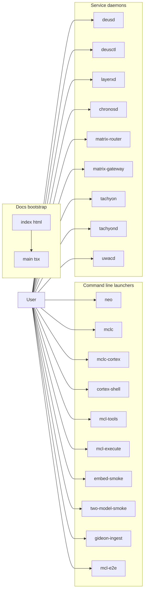

# Getting Started - Primary Binaries

## Overview

This section covers the repository’s main launch points: interactive CLIs, compiler and smoke-test tools, long-running daemons, and the browser bootstrap for the docs web app. These entrypoints are the fastest way to move from a checkout to a working Centra AI environment, whether the goal is to explore Cortex state, compile CentraScript, run service processes, or bring up the documentation UI.

The binaries fall into three practical groups. Some are local command-line tools that complete a task and exit, some are daemons that load config, start background workers, and keep HTTP or MCP listeners alive, and two files bootstrap the docs web app in the browser. A few tools are explicitly wired for smoke testing, so their startup path is as important as their output.

## Runtime Map

## Interactive and Compiler Binaries

These are the quickest binaries to try first when you want to understand the system from the shell. They either run a conversation loop, compile CentraScript, inspect Cortex state, or smoke-test manifest and execution tooling.

| File | Startup surface | What it does |
| --- | --- | --- |
| `neo/cmd/neo/main.go` | `main` dispatches to `runServe` when the first argument is `serve`; otherwise it runs `runInteractive` | Loads runtime config, starts the main and cheap LLM clients, opens Cortex-backed memory when available, spawns tools unless `-no-tools` is set, wires `delegate.New` for core execution delegation, and runs either a single `-prompt` turn or a REPL. It also starts write-back consolidation through `wc.Start()` when memory is available. |
| `MCL/cmd/mclc/main.go` | CLI dispatcher with `compile`, `validate`, `hash`, `parse`, `help` | Reads a `SKILL.mtx`, parses it with `parser.New(src)`, validates it, hashes it with `canonical.Hash(file)`, and can run the interpreter against user prose. `compile` emits structured JSON with `mtx_digest`, `matched_condition`, `executed`, `frame_json`, `prompt_messages`, `slots`, `unknowns`, and `clarify_questions`. |
| `bridge/cmd/mclc-cortex/main.go` | `run` with the same compiler flags plus Cortex-specific flags | Mirrors the `mclc compile` flow, but opens a live Cortex store with `store.Open`, creates `cortex.New(s)`, optionally starts an embedder, and bridges the interpreter to real Cortex-backed resolution. Its JSON output adds `cortex_overall_root` to the compiler envelope. |
| `cortex/cmd/cortex-shell/main.go` | Flag-gated shell with many subcommands | Acts as a local smoke shell for Cortex journal, memory, edge, snapshot, attest, salience, compaction, rebuild, and scope inspection. It is the deepest source-backed launcher for validating state transitions and reading back canonical data. |
| `executor/cmd/mcl-tools/main.go` | Subcommands `list-servers`, `list-tools`, `describe-tool`, `verify`, `call` | Loads an agent manifest, builds a registry, and can spawn just the server needed for a single tool call. `call` prints the result as JSON and exits with status 3 when the tool result reports `IsError`. |
| `executor/cmd/mcl-execute/main.go` | Subcommands `walk`, `classify`, `loader`, `daemon` | Acts as the executor front door. The usage text defines `walk` as compile → synthesize plan → walk → attest, `classify` as the materiality classifier, `loader` as the SkillLoader smoke path, and `daemon` as a long-running HTTP plus SSE server. |

### `neo/cmd/neo/main.go`

`neo` is the most user-facing launcher in this section. It reads a runtime config, can override it with `-manifest`, `-cortex-root`, `-actor`, and `-prompt`, and falls back to a REPL when no prompt is supplied. The `stdoutReporter` prints answers on stdout and status or approval prompts on stderr, so a single-prompt run stays clean for piping.

The startup path is intentionally layered:

- `newClient` builds the main and cheap model clients with `mcllm.Config`.
- `memory.Open(cfg)` tries to enable persistent recall and is treated as best effort.
- `tools.Spawn` starts the MCP tool manager unless `-no-tools` is set.
- `delegate.New` wires `core_execute` delegation using `cfg.DaemonURL`, `NEO_DAEMON_TOKEN`, `cfg.ActorDID`, and `NEO_CALLER_WALLET`.
- `writeback.New` starts background consolidation when memory is available.

Approval prompts are handled by `newApprover`, which reads from the shared stdin reader and recognizes `y`, `yes`, `approve`, and `ok` as approval. The banner printed by `printBanner` reflects whether memory recall is salience-only or semantic plus salience, and whether tools are present.

### `MCL/cmd/mclc/main.go` and `bridge/cmd/mclc-cortex/main.go`

These two launchers share the same compiler shape, but the bridge version adds a live Cortex store and optional embedder wiring.

`mclc` does the pure compiler path:

- `compile` reads the skill file from `-skill` and user prose from `-prose`.
- It parses with `parser.New(src).Parse()`.
- It validates with `validator.ValidateSkill(file)`.
- It computes the canonical digest with `canonical.Hash(file)`.
- It creates an LLM client unless `-dry-run` is set, falling back to dry-run if the model cannot be created.
- It runs `interpreter.New(file, llmClient, nil)` and serializes the result.

`mclc-cortex` repeats those steps, then opens a Cortex store and routes the interpreter through `bridge.New(c)`. It also supports Cortex-specific flags such as `-cortex-root`, `-actor`, `-with-embedder`, and `-with-fireworks-embedder`. If the Fireworks embedder cannot be created, `startEmbedder` falls back to `embed.NewHashEmbedder()` and continues.

The compiler output shape is source-backed and stable:

- `mclc` emits `mtx_digest`, `matched_condition`, `executed`, optional `frame_json`, optional `prompt_messages`, `slots`, `unknowns`, and `clarify_questions`.
- `mclc-cortex` emits the same envelope plus `cortex_overall_root`.

### `cortex/cmd/cortex-shell/main.go`

`cortex-shell` is the broadest smoke launcher in the repository. It covers the full local Cortex surface: journal inspection, typed memory writes and reads, edge operations, snapshots, proof generation, context bundling, compaction, rebuild, salience reads, attestation, and scope decoding.

The command families visible in the source are:

- journal: `head`, `append`, `dump`
- memory: `write`, `resolve`, `update`, `tombstone`, `list`
- graph and query: `find`, `context`, `compact`, `write-frame`, `update-head`
- snapshots and proofs: `snapshot`, `dump-snapshot`, `overall-root`, `prove`, `rebuild`, `dump-scope`
- salience and attestation: `attest`, `dump-attest`, `dump-salience`, `dump-weights`

A few source-backed behaviors are especially important when getting started:

- `ensureEmbedder` starts a deterministic hash embedder and persists the vector index at `indexes/vector/index.hnsw`.
- `runFind` can combine tag filters, equality filters, a limit, late binding, near-text recall, near-URI recall, and graph-follow expressions.
- `runDumpAttest` decodes `KindAttest` journal entries into a JSON view with `seq`, `kind`, `created_at`, `created_by`, `schema_version`, `intent_id`, `outcome`, `reason`, and `cited_ids_hex`.
- `runDumpWeights` returns a JSON object with `cold_start` and `weights`, so callers can tell the difference between a true cold start and a learned-but-equal weight set.
- `runRebuild` prints pre and post overall roots and can enforce equality with `-verify-only`.

## Service Binaries

These are the always-on processes and their control-plane companions. They are the binaries to start when you want the repository running as a system rather than as a local tool.

| File | Startup surface | What it does |
| --- | --- | --- |
| `deus/cmd/deusd/main.go` | Service daemon with graceful shutdown | Loads config, migrates the database, optionally connects to chain, object storage, registry, discovery, hosting, gateway, and settlement subsystems, then starts the HTTP server and a reserve-reaper goroutine. It uses `moduleRoot()` with `DEUS_ROOT` to resolve relative migration paths. |
| `deus/cmd/deusctl/main.go` | `deusctl` operator CLI | Builds a Cobra root command named `deusctl` and registers the `migrate` and `manifest` subcommands. |
| `uwac/cmd/uwacd/main.go` | HTTP server or `-dump-tools` mode | Loads the connector registry, can print the MCP tool advertisement and exit, or starts the OAuth connector hub with an in-memory vault fallback. The source wires Google provider creds from `UWAC_GOOGLE_CLIENT_ID` and `UWAC_GOOGLE_CLIENT_SECRET`. |
| `layerx/cmd/layerxd/main.go` | Settlement fabric daemon | Loads config, migrates the database, creates a sequencer signer with `sig.New`, starts challenge and token managers, runs the settlement worker, and serves the HTTP API. It falls back to `chain.NewDevSettler()` when chain wiring is unavailable. |
| `chronos/cmd/chronosd/main.go` | Scheduler and wake control plane | Loads config, opens the store, applies migrations, creates auth challenges and tokens, starts challenge garbage collection, runs the dispatch worker with a wake client, and serves HTTP. It resolves relative migrations through `moduleRoot()` and `CHRONOS_ROOT`. |
| `router/cmd/matrix-router/main.go` | Dual-listener front door for Fly Machines | Builds a JWT verifier, opens the DB pool, creates the Fly client, then runs a public JWT-protected proxy listener and a private internal listener for admin and wake traffic. It also wires daemon provisioning when `DaemonImage` is set. |
| `gateway/cmd/matrix-gateway/main.go` | LLM proxy and budget gate | Loads config, opens Postgres when present, builds the budget-enforcing proxy, and runs a public listener plus an internal admin listener. The source comments show it mediates upstream Fireworks and Together calls, debits the credit ledger, and enforces the daily PAX hard-stop. |
| `tachyon/cmd/tachyon/main.go` | HTTP client for tachyond | Reads a daemon base URL from `-addr` or `TACHYON_HTTP_ADDR`, supports `health` and `chains` via GET, and posts JSON from stdin for `compile`, `test`, `simulate`, `deploy`, and `call`. It always sets `Content-Type: application/json` on POST requests. |
| `tachyon/cmd/tachyond/main.go` | HTTP daemon or MCP stdio server | Loads config, creates the engine, and either runs the JSON-RPC MCP stdio server with `-mcp`, performs a selftest with `-selftest`, or starts the HTTP API. It uses stderr logging in MCP modes so stdout stays reserved for protocol output. |

### `deus/cmd/deusd/main.go`

`deusd` is the widest service bootstrap in the repository. It wires together chain, object storage, registry, discovery, hosting, settlement, streams, pricing, and gateway components in one process. The startup order is visible in the source:

- config load
- database open and migration
- optional chain client
- optional object store or in-memory object store in dev mode
- optional chain registry and indexer
- optional chain payer
- discovery service with embedder and ranking weights
- registry service with manifest indexer
- optional hosting orchestrator
- optional gateway and streams services
- optional settlement worker
- HTTP server startup
- reserve reaper loop that calls `db.ReleaseExpiredChannelReserves(ctx)`

The service uses `moduleRoot()` with `DEUS_ROOT` when migrations are referenced by a relative path, and the shutdown path drains the HTTP server with a 15-second timeout. The source also shows the environment passed into provisioned machines, including `MATRIX_GATEWAY_URL`, `MATRIX_GATEWAY_TOKEN`, `MATRIX_CHRONOS_URL`, and several model pins.

### `chronos/cmd/chronosd/main.go`

`chronosd` is the central wake scheduler. It opens the store, migrates from a relative or absolute migration directory, and then starts two background loops:

- a challenge garbage-collection goroutine that purges old challenges every five minutes
- a dispatch worker created with `dispatch.New(st, waker, log, dispatch.Config{})`

The wake client is built with `wake.New(cfg.RouterWakeURL, cfg.WakeToken)`, so the scheduler can ask the router to wake a machine and deliver the resume turn. The HTTP server is a normal `http.Server` with a 10-second `ReadHeaderTimeout`, and the process drains on SIGINT or SIGTERM.

### `router/cmd/matrix-router/main.go` and `gateway/cmd/matrix-gateway/main.go`

These two binaries sit at different edges of the system and should not be confused:

- `matrix-router` fronts Fly Machines. The public listener is JWT-protected, the internal listener is admin and health, and the proxy side resolves and wakes machines before reverse proxying traffic to the daemon.
- `matrix-gateway` fronts model calls. The source comments describe it as the loopback HTTP proxy that mediates upstream Fireworks and Together requests, debits Postgres credits, and stops requests once the daily budget is exhausted.

Both use explicit listener separation and graceful shutdown. `matrix-router` also injects a broad environment into provisioned daemons, including gateway URLs and tokens, model pins, browser and tachyon endpoints, and UWAC, Chronos, Deus, and media integration settings.

### `tachyon/cmd/tachyon/main.go` and `tachyon/cmd/tachyond/main.go`

These two files form a client and server pair.

- `tachyon` is the operator-facing HTTP client. It reads JSON from stdin for write-style commands and prints JSON responses prettily when the body parses as JSON.
- `tachyond` is the daemon. It can run as a normal HTTP service, as an MCP stdio server, or as a one-shot selftest. The `-selftest` path runs `mcp.Selftest()` and exits without starting the daemon.

## Smoke and Ingest Utilities

These binaries are for proving that the system still behaves the way the source expects. They are the right choice when you want a fast verification path rather than a user-facing feature.

| File | Startup surface | What it does |
| --- | --- | --- |
| `executor/cmd/mcl-e2e/main.go` | Live end-to-end harness | Runs the Centra AI stack across Cortex, MCL, bridge, envelope, lifecycle, MCP, and tool registry surfaces. It performs runs A, B, and C, writes a transcript, and compares intent hashes and replay roots. |
| `executor/cmd/gideon-ingest/main.go` | Knowledge graph ingestion tool | Reads the ops corpus and the HyperPax-OS source tree, builds Cortex memory nodes and edges, and skips writes in `-dry-run` mode. Re-runs are idempotent because each node carries a stable `gideon:key:` tag. |
| `cortex/cmd/embed-smoke/main.go` | Fireworks embedder smoke test | Calls the real Fireworks embedding API, checks vector dimension and L2 norm, compares related and unrelated cosine similarity, and repeats the same embedding three times to inspect determinism. |
| `cortex/cmd/two-model-smoke/main.go` | Dual-model conversational smoke test | Alternates two agents across a shared Cortex store, records a JSONL transcript, and asserts that `Cortex.Rebuild` preserves `OverallRoot` byte-for-byte unless `-no-rebuild-assert` is set. |

### `executor/cmd/mcl-e2e/main.go`

`mcl-e2e` is the broadest live test harness in the repository. The source comments say it exercises the real Cortex store, Fireworks embedder, snapshot and attest flows, MCL parsing and canonical hashing, bridge wiring, envelope signing and verification, lifecycle transitions, and MCP tool invocation.

The visible startup behavior is also important:

- it requires `FIREWORKS_API_KEY`
- it requires `TOGETHER_API_KEY` unless `-skip-together` is set
- it writes a top-level transcript file
- it runs A and B as deterministic repeats and C as the cross-model comparison
- it records whether the legacy router mode was selected with `-legacy-router`
- it asserts replay invariants through `replay.VerifyPreservesRoot(res)`

The harness prints run summaries and a final artifact path, so the output is meant to be inspected after the process exits.

### `executor/cmd/gideon-ingest/main.go`

`gideon-ingest` is the corpus-to-Cortex ingestion path. It accepts `-cortex-root`, `-cortex-actor`, `-knowledge`, and `-dry-run`, then processes:

- `knowledge/core_chats/RUNBOOK.md`
- the chat logs under `knowledge/core_chats`
- modules under `knowledge/HyperPax-OS`

The source comments make two guarantees explicit: parsing is deterministic and dependency-free, and reruns are idempotent because the ingest logic updates changed nodes instead of duplicating them. In non-dry-run mode it opens the Cortex store and writes through `cortex.New(s)`.

### `cortex/cmd/embed-smoke/main.go`

`embed-smoke` is a real network smoke test, not a unit test. It reads `EMBED_MODEL`, defaults to `embed.DefaultModelFireworks`, and then calls the API embedder with a 30-second timeout. The run checks three things:

- embedding dimension matches the model
- vector norm is approximately 1
- related phrases score above unrelated ones in cosine similarity

It then repeats the same text three times and prints the cosine value against the first embedding so deterministic behavior is visible.

### `cortex/cmd/two-model-smoke/main.go`

This binary drives two real models through a shared Cortex store, alternating between agents `alice` and `bob`. It creates a transcript, opens a shared store, builds a Cortex instance, and records each assistant turn and each tool call with timestamps and JSON payloads. The final step snapshots the store and calls `Cortex.Rebuild`, then asserts that the post-rebuild root matches the pre-rebuild root unless `-no-rebuild-assert` was passed.

The source shows the important parameters directly on the CLI:

- `-root`
- `-actor`
- `-turns`
- `-tools-per-turn`
- `-transcript`
- `-scenario`
- `-temperature`
- `-model-a`
- `-model-b`

## Docs Web Bootstrap

These two files are the browser entrypoint for the docs site. They are not business logic, but they are the first things a browser sees when the docs app starts.

| File | Startup surface | What it does |
| --- | --- | --- |
| `docs/.web/index.html` | Static HTML shell | Declares the document, sets the page title, includes the root `

`, and loads the module script at `/src/main.tsx`. It also preconnects to Google Fonts and links the Vite favicon. |
| `docs/.web/src/main.tsx` | React application bootstrap | Creates the root with `createRoot(document.getElementById('root')!)` and renders `App` inside `HashRouter`. It also imports the app stylesheet. |

### `docs/.web/index.html`

The HTML file is a standard Vite entry shell with a dark theme class on the `<html>` element. Its startup responsibility is limited to creating the DOM mount point and loading the TypeScript entry module. The visible extras are the favicon link and the font preconnects.

### `docs/.web/src/main.tsx`

`main.tsx` is the browser bootstrap layer. It creates the React root and wraps `App` in `HashRouter`, which makes the docs app route state available through the hash fragment. The file is intentionally small: it only wires the mount point, router, and app component together.

## Getting Started by Workflow

If you are trying to orient yourself quickly, the binaries line up with a few direct workflows:

- interactive assistant work: `neo/cmd/neo/main.go`
- CentraScript compilation and validation: `MCL/cmd/mclc/main.go`
- live Cortex-backed compilation: `bridge/cmd/mclc-cortex/main.go`
- local Cortex inspection and mutation: `cortex/cmd/cortex-shell/main.go`
- manifest and tool execution smoke tests: `executor/cmd/mcl-tools/main.go`
- full live-stack verification: `executor/cmd/mcl-e2e/main.go`
- corpora ingestion into Cortex: `executor/cmd/gideon-ingest/main.go`
- service startup for transport, scheduling, settlement, and routing: `deus/cmd/deusd/main.go`, `layerx/cmd/layerxd/main.go`, `chronos/cmd/chronosd/main.go`, `router/cmd/matrix-router/main.go`, `gateway/cmd/matrix-gateway/main.go`, `uwac/cmd/uwacd/main.go`, `tachyon/cmd/tachyond/main.go`
- browser docs bootstrap: `docs/.web/index.html` and `docs/.web/src/main.tsx`

The source is especially explicit about which binaries are long-running daemons and which ones are one-shot tools. Use the command-line tools for inspection and verification, and use the daemon binaries when you need the service layer to stay alive and accept traffic.
