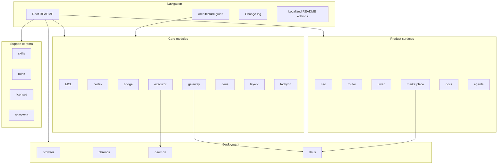

# Getting Started - Repository map

## Overview

`centra-llm-agents` is organized as a monorepo of product areas, operational assets, and documentation hubs rather than a single application tree. The root-level README files explain the product story, while the module-specific READMEs map each subsystem to its own implementation surface, deployment shape, and contributor entry point.

For new contributors, the shortest path is: start at `README.md`, use `ARCHITECTURE.md` as the navigation index, then jump into the relevant module README or deployment asset. The sibling pages for module manifests and primary binaries cover buildable code; this page focuses on how the repository is partitioned and what each top-level area is for.

## Repository map at a glance

The root README is the broadest map of the repository. `ARCHITECTURE.md` compresses the same landscape into a contributor index, while the module READMEs and deployment assets fill in the implementation and operations layers.

## Top-level directory map

| Directory prefix | What it represents in the repository |
| --- | --- |
| `MCL/` | MCL, the typed intent and compiler-focused core. |
| `cortex/` | The per-actor memory system, query engine, snapshots, and replay surfaces. |
| `bridge/` | The adapter layer that connects MCL to a live cortex instance. |
| `executor/` | Plan walking, lifecycle handling, tool dispatch, and the live e2e harness. |
| `neo/` | The default conversational agent rail used for reversible work. |
| `gateway/` | The metered LLM proxy and credit ledger for daemon calls. |
| `router/` | Per-user provisioning and wake-then-reverse-proxy entrypoint logic. |
| `deus/` | The agent-services marketplace and registry control plane. |
| `uwac/` | OAuth-vault-to-tool connector for per-user MCP access. |
| `tachyon/` | Agent-native Solidity and EVM tooling. |
| `layerx/` | Settlement fabric and custody spine for agent balances. |
| `chronos/` | Centralized scheduler and wake control plane. |
| `marketplace/` | The React Router-based marketplace frontend. |
| `docs/` | Documentation surfaces, including the docs web app. |
| `skills/` | The skill corpus, including recursive self-optimization content. |
| `rules/` | Coding and agent rules organized by language and locale. |
| `deploy/` | Dockerfiles, installers, templates, service units, and runtime launch scripts. |
| `agents/` | Agent manifests and tool access definitions. |
| `licenses/` | Third-party license inventory for bundled dependencies. |

## Core navigation files

| Path | What it does |
| --- | --- |
| `README.md` | The root repository overview. It introduces Centra AI as a layered product, explains the two agent rails, and maps the major directories so newcomers can jump straight to the right subsystem. |
| `ARCHITECTURE.md` | The high-level navigation index. It explains that the detailed source of truth is split across the research chapters and the project-state record, then summarizes the load-bearing surfaces for the core modules. |
| `CHANGELOG.md` | The repository release log. It records notable changes by version, ties them to session references, and shows how product areas such as the gateway, daemon, executor, bridge, cortex, and deployment surface evolved over time. |
| `README.es.md` | Spanish translation of the root overview and repository layout. It preserves the same product map while localizing the narrative and the directory guide. |
| `README.ja.md` | Japanese translation of the root overview and repository layout. It mirrors the same repository map and onboarding story. |
| `README.pt-BR.md` | Brazilian Portuguese translation of the root overview and repository layout. It keeps the same structure and product framing as the English root README. |
| `README.ru.md` | Russian translation of the root overview and repository layout. It presents the same layered map of Centra AI and its top-level areas. |
| `README.zh-CN.md` | Simplified Chinese translation of the root overview and repository layout. It preserves the same repository story and directory map. |

## Core module map

| Path | What it documents |
| --- | --- |
| `MCL/README.md` | The MCL coordination layer. It describes MCL as the heart of the system, explains the compiler-oriented structure, and records the typed and signed intent pipeline that feeds execution. |
| `cortex/README.md` | The phased cortex implementation. It lays out the memory store, journal, typed memory taxonomy, query engine, salience cache, forms, embeddings, vector index, and replay surfaces. |
| `bridge/README.md` | The glue layer between the MCL interpreter and cortex. It shows how the adapter maps skill arguments into cortex queries and context reads. |
| `executor/README.md` | The plan walker and lifecycle surface. It describes the tool registry, MCP client and manager, runtime walker, materiality classifier, and the live execution CLI. |
| `gateway/README.md` | The metered LLM gateway. It explains how calls are priced, gated, debited, and forwarded, and how the module is laid out internally. |
| `deus/README.md` | The Deus marketplace and registry. It frames the product as a control plane, execution layer, on-chain layer, database layer, and console, with the marketplace and registry treated as one system. |
| `layerx/README.md` | The LayerX settlement fabric. It describes the always-on sequencer, reserved balance model, signed receipts, and the settlement flow around the agent account model. |
| `layerx/contracts/README.md` | The on-chain custody and settlement spine for LayerX. It documents the vault and settlement anchor contracts and the in-house safeguards used to keep the trusted surface auditable. |
| `tachyon/README.md` | The agent-native Solidity and EVM toolbox. It positions the daemon and CLI as API, RPC, and MCP surfaces rather than a human-first terminal workflow. |
| `agents/README.md` | The JSON-on-disk agent manifest format. It explains how tools are loaded at boot, how package digests are pinned, and how credential references are represented. |
| `docs/.web/README.md` | The docs web app scaffold. It is the React, TypeScript, and Vite template that anchors the documentation frontend. |
| `licenses/README.md` | The third-party license inventory. It maps bundled dependencies back to the modules that use them and lists the license texts shipped in the repository. |
| `skills/self-improve/README.md` | The recursive self-optimization skill suite. It defines the read-write loop, the tool-call discipline, and the validation path for self-improvement passes. |
| `executor/cmd/mcl-e2e/README.md` | The live end-to-end harness. It documents the real LLM, real MCP server, and real cortex replay flow that exercises the critical path. |
| `rules/zh/README.md` | The Chinese rules tree. It explains the common-plus-language-specific structure and the installation workflow for the rule corpus. |
| `marketplace/README.md` | The marketplace frontend scaffold. It shows the React Router application template used as the base for the marketplace experience. |

## Deployment and runtime assets

| Path | What it contributes |
| --- | --- |
| `deploy/browser/Dockerfile` | Builds the private shared browser runtime. It pins the Playwright MCP version, installs the browser stack, sets the runtime environment, and defines the health probe and entrypoint behavior. |
| `deploy/browser/README.md` | Explains how the shared browser service is deployed and wired over the private network. It covers the single shared instance model, session isolation, version pinning, and optional bearer protection. |
| `deploy/chronos/chronosd.service` | The systemd unit for the Chronos scheduler daemon. It defines the service environment, restart behavior, hardening settings, and service wiring. |
| `deploy/chronos/install.sh` | An idempotent installer for `chronosd`. It creates the system user and group, installs the binary and migrations, writes the environment file, installs the service unit, and enables the service. |
| `deploy/chronos/nginx-snippet.conf` | An optional nginx drop-in for exposing Chronos through a public path while keeping the normal private topology intact. |
| `deploy/daemon/Dockerfile` | Builds the per-user Centra AI daemon image. It compiles the Go binaries, installs Node, Python, and uv, pre-caches MCP servers, bakes the skill corpus and agent manifests, and defines the container runtime layout. |
| `deploy/daemon/README.md` | Documents the daemon deployment surface. It covers local image smoke testing, Fly app bootstrap, and the per-user machine creation model. |
| `deploy/daemon/entrypoint.sh` | The daemon launch script. It prepares the data layout, sets up workspace linking, initializes the workspace repository, and starts either the dual-process Neo mode or the standalone daemon mode. |
| `deploy/daemon/fly.toml.tmpl` | The per-user Fly Machine template rendered by the router. It defines the machine shape, volume mount, health checks, and environment wiring for daemon provisioning. |
| `deploy/deus/Dockerfile` | Builds the Deus control-plane container. It compiles the Deus binaries, copies the migrations and configs into the runtime image, and exposes the service entrypoint. |
| `deploy/deus/README.md` | Documents the box deployment for Deus. It covers co-location with the storage box, database and object-store setup, on-chain contract deployment, and operational checks. |
| `deploy/deus/deus.env.example` | The Deus environment template. It shows the core, chain, object store, signing, authentication, and wallet settings that operators fill in before deployment. |

## How the repository is meant to be explored

1. Start with `README.md` to understand the product story and the top-level modules.
2. Use `ARCHITECTURE.md` when you need the shortest path to the canonical repo map.
3. Use `deploy/*` when the task is about runtime packaging, service startup, or box installation.
4. Use `skills/`, `rules/`, and `licenses/` when the task is about agent behavior, coding policy, or dependency provenance.
5. Use the locale-specific README files when you want the same repository story in another language.

## Repository signals worth noting

- The root README presents Centra AI as a layered system with MCL, cortex, bridge, executor, neo, gateway, router, Deus, uwac, and tachyon as the major product areas.
- The documentation tree is not just prose; it also contains runtime-facing assets such as the docs web app scaffold and deployment templates.
- The skill and rules corpora are first-class repository areas, not afterthoughts. They exist alongside the product modules because agent behavior and coding policy are part of the system design.
- The deployment directory is split by runtime target, which makes the browser service, daemon image, Chronos service, and Deus control plane independently inspectable.

## Quick orientation by task

| If you are trying to understand | Start here |
| --- | --- |
| The overall product and repository story | `README.md` |
| The canonical map of modules and invariants | `ARCHITECTURE.md` |
| What changed in a release | `CHANGELOG.md` |
| The MCL compiler and typed intent layer | `MCL/README.md` |
| The cortex memory graph and replay model | `cortex/README.md` |
| The executor and runtime walker | `executor/README.md` |
| The marketplace and service registry | `deus/README.md` |
| The settlement spine | `layerx/README.md` and `layerx/contracts/README.md` |
| The deployment story | `deploy/daemon/README.md`, `deploy/deus/README.md`, `deploy/browser/README.md`, and `deploy/chronos/install.sh` |
| The agent corpus and rules corpus | `skills/self-improve/README.md` and `rules/zh/README.md` |
