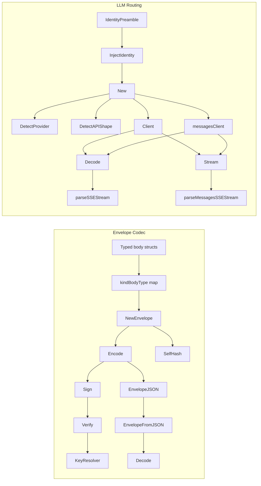
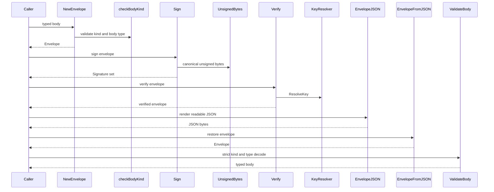
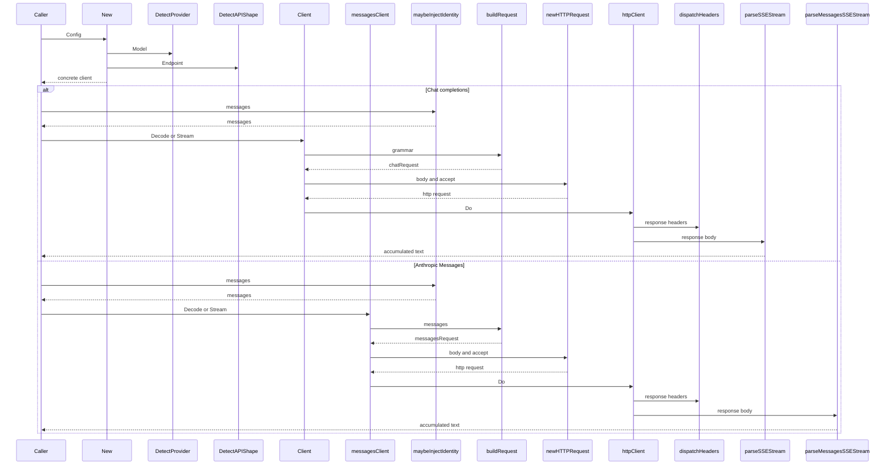

# MCL - Determinism Premise

## Overview

MCL treats message packaging and model calls as deterministic artifacts instead of ad hoc text blobs. The envelope package turns every MCL message into a typed body, a canonical CBOR envelope, and a signature over signature-cleared bytes; the LLM package turns every frontier-model call into a repeatable request shape, a stable provider route, and a predictable response parser.

This section is about the rules that keep those artifacts replayable. It covers the closed 15-kind envelope map, typed body validation, canonical wire encoding, self-hashing, identity preamble injection, provider and API-shape detection, and the request builders used by the chat-completions and Anthropic Messages clients.

## Deterministic Flow

> **Note:** `MCL/llm/messages_api.go` accepts a `grammar string` in `Decode` and `Stream`, but the request builder shown in source never consumes it. On this path, grammar constraints are not applied to the upstream request.

The source keeps determinism visible in the code rather than in hidden runtime conventions:

- `MCL/envelope/envelope.go` pins `SchemaVersion` and `ProtocolVersion`, signs canonical CBOR, and verifies against a resolved public key.
- `MCL/envelope/body.go` binds each `Kind*` constant to one Go body type through `kindBodyType`.
- `MCL/envelope/json.go` round-trips the envelope as readable JSON without changing the canonical wire form.
- `MCL/llm/identity.go` gates a fixed system preamble through `Config.InjectIdentity` and appends `IdentityVersion` to cache-sensitive model digests.
- `MCL/llm/llm.go` derives provider and wire shape from `Model` and `Endpoint`, while preserving `Seed`, `Temperature`, and grammar settings in the request body.
- `MCL/llm/messages_api.go` preserves ordering in system-message flattening and SSE parsing, while ignoring malformed frames instead of inventing output.

## Envelope Wire Codec

*`MCL/envelope/body.go`, `MCL/envelope/envelope.go`, `MCL/envelope/json.go`, `MCL/envelope/keyresolver.go`*

The envelope package is the canonical wire contract for all 15 MCL message kinds. Its main responsibility is to keep a typed payload stable across encode, sign, verify, and journal round-trips without losing byte identity.

### Public functions and methods

| Function or method | Role |
| --- | --- |
| `DecodeBody` | Decodes the raw `Body` into a caller-provided typed value. |
| `BodyTypeOf` | Returns the `reflect.Type` associated with a valid kind. |
| `NewTypedBody` | Allocates a pointer to the zero-valued body for a kind. |
| `ValidateBody` | Allocates the matching typed body and decodes `env.Body` into it. |
| `NewEnvelope` | Validates kind and body type, then CBOR-encodes the body into a new envelope. |
| `Encode` | Marshals the full envelope, including `Signature`, into canonical CBOR. |
| `Decode` | Unmarshals canonical CBOR wire bytes into an `Envelope`. |
| `UnsignedBytes` | Marshals a copy of the envelope with `Signature` cleared. |
| `Sign` | Signs the unsigned canonical bytes with an ed25519 private key. |
| `Verify` | Validates schema version, required headers, kind, resolver lookup, and signature. |
| `SelfHash` | Returns the SHA-256 hex digest of the unsigned canonical bytes. |
| `EnvelopeJSON` | Produces the readable JSON form for on-disk storage. |
| `EnvelopeFromJSON` | Restores an `Envelope` from readable JSON and cross-checks `SelfHash`. |
| `ResolveKey` | Resolves a principal to an ed25519 public key through `KeyResolver`. |

### Envelope structure

#### `Envelope`

*`MCL/envelope/envelope.go`*

| Property | Type | Description |
| --- | --- | --- |
| `SchemaVersion` | `uint8` | Wire schema version mixed into unsigned bytes. |
| `ProtocolVersion` | `string` | Protocol marker carried in the header. |
| `Kind` | `string` | Message kind from the closed MCL kind set. |
| `ID` | `string` | Message identifier. |
| `At` | `string` | Envelope creation timestamp. |
| `From` | `string` | Sender principal. |
| `To` | `string` | Optional recipient principal. |
| `CorrelationID` | `string` | Optional request-response correlation identifier. |
| `CausationID` | `string` | Optional causation trace identifier. |
| `Body` | `cbor.RawMessage` | Canonical CBOR for the typed payload. |
| `Signature` | `[]byte` | ed25519 signature over the unsigned bytes. |

`SchemaVersion` is set to `1`, and `ProtocolVersion` is pinned to `mcl/0.1`. `NewEnvelope` fills both values automatically before the caller populates the remaining header fields and signs the envelope.

#### `JSONEnvelope`

*`MCL/envelope/json.go`*

| Property | Type | Description |
| --- | --- | --- |
| `SchemaVersion` | `uint8` | JSON mirror of the schema version. |
| `ProtocolVersion` | `string` | Human-readable protocol marker. |
| `Kind` | `string` | Message kind. |
| `ID` | `string` | Message identifier. |
| `At` | `string` | Creation timestamp. |
| `From` | `string` | Sender principal. |
| `To` | `string` | Optional recipient principal. |
| `Intent` | `string` | Intent reference. |
| `CorrelationID` | `string` | Optional correlation identifier. |
| `CausationID` | `string` | Optional causation trace identifier. |
| `Body` | `json.RawMessage` | Typed JSON body when the kind is known. |
| `BodyHex` | `string` | Hex fallback for raw CBOR when typed decoding is unavailable. |
| `Signature` | `string` | Base64-encoded signature. |
| `SelfHash` | `string` | SHA-256 hex digest of the unsigned bytes. |

`EnvelopeJSON` prefers a typed JSON body when the kind is known. If the body cannot be decoded into the typed struct, or if the kind is unknown, it falls back to `BodyHex` so the raw CBOR bytes survive the round-trip.

### Key resolution

#### `KeyResolver`

*`MCL/envelope/keyresolver.go`*

| Method | Description |
| --- | --- |
| `ResolveKey` | Maps a principal to its ed25519 public key. |

`Verify` depends on this interface to avoid hard-coding DID lookup mechanics. The package also provides `StaticKeyResolver`, a map-backed implementation used by tests and the CLI.

### Kind to body binding

The `kindBodyType` map in `MCL/envelope/body.go` is the closed binding between the 15 kinds and their Go body types. `checkBodyKind`, `BodyTypeOf`, `NewTypedBody`, and `ValidateBody` all use this map.

| Kind | Body type | Purpose |
| --- | --- | --- |
| `KindIntentDraft` | `IntentDraftBody` | Initial natural-language goal. |
| `KindIntentCompiled` | `IntentCompiledBody` | Canonical JSON form of the compiled intent. |
| `KindIntentClarify` | `IntentClarifyBody` | Structured unknowns and questions. |
| `KindIntentAnswer` | `IntentAnswerBody` | JSON Patch answer payload. |
| `KindIntentAccept` | `IntentAcceptBody` | Acceptance hash and audit timestamp. |
| `KindPlanProposed` | `PlanProposedBody` | Canonical JSON plan tree. |
| `KindPlanStep` | `PlanStepBody` | Executor-internal step state. |
| `KindPlanOutput` | `PlanOutputBody` | Streaming step output. |
| `KindIntentCorrect` | `IntentCorrectBody` | Mid-flight patch and retry pointer. |
| `KindIntentDispatch` | `IntentDispatchBody` | Delegated sub-intent. |
| `KindIntentAttest` | `IntentAttestBody` | Signed completion receipt. |
| `KindIntentFail` | `IntentFailBody` | Typed failure receipt. |
| `KindIntentCancel` | `IntentCancelBody` | User cancellation. |
| `KindPolicyGate` | `PolicyGateBody` | Human-in-loop checkpoint. |
| `KindPolicyGateResolve` | `PolicyGateResolveBody` | Gate approval or denial. |

`checkBodyKind` accepts both a value and a pointer to the expected body type. It rejects `nil` bodies and mismatched kinds with `ErrBodyTypeMismatch`.

### Typed body payloads

#### `Intent Draft Body`

*`MCL/envelope/body.go`*

| Property | Type | Description |
| --- | --- | --- |
| `Prose` | `string` | Original natural-language goal. |
| `SlotValues` | `map[string]string` | Pre-filled slot bindings from the UI. |
| `PreferredSkill` | `string` | Optional skill hint. |

#### `Intent Compiled Body`

*`MCL/envelope/body.go`*

| Property | Type | Description |
| --- | --- | --- |
| `IntentJSON` | `[]byte` | Canonical JSON encoding of the intent IR. |
| `CompileLatencyMs` | `int64` | Wall-clock compilation latency. |

`IntentJSON` is intentionally stored as canonical JSON bytes instead of being re-encoded in CBOR.

#### `Intent Clarify Body`

*`MCL/envelope/body.go`*

| Property | Type | Description |
| --- | --- | --- |
| `Questions` | `[]ClarifyQuestion` | One question per unmet unknown. |

##### `Clarify Question`

*`MCL/envelope/body.go`*

| Property | Type | Description |
| --- | --- | --- |
| `UnknownID` | `string` | Unknown identifier being clarified. |
| `Field` | `string` | Slot path to patch. |
| `Prompt` | `string` | User-facing question text. |
| `Type` | `string` | Expected answer type. |
| `Required` | `bool` | Whether the question must be answered. |
| `Options` | `[]string` | Suggested enum-like options. |
| `Default` | `string` | Suggested default value. |

#### `Intent Answer Body`

*`MCL/envelope/body.go`*

| Property | Type | Description |
| --- | --- | --- |
| `Patches` | `[]byte` | RFC 6902 JSON Patch bytes. |
| `AnswerOf` | `string` | Correlation identifier of the clarify message being answered. |

#### `Intent Accept Body`

*`MCL/envelope/body.go`*

| Property | Type | Description |
| --- | --- | --- |
| `IntentHash` | `string` | SHA-256 hash of the canonical JSON intent. |
| `AcceptedAt` | `string` | Audit timestamp for acceptance. |
| `AnchorRequested` | `bool` | Whether chain anchoring was requested. |

#### `Plan Proposed Body`

*`MCL/envelope/body.go`*

| Property | Type | Description |
| --- | --- | --- |
| `PlanJSON` | `[]byte` | Canonical JSON encoding of the plan tree. |

#### `Plan Step Body`

*`MCL/envelope/body.go`*

| Property | Type | Description |
| --- | --- | --- |
| `PlanID` | `string` | Parent plan identifier. |
| `NodeID` | `string` | Plan node identifier. |
| `Status` | `string` | Step lifecycle value. |
| `Result` | `[]byte` | Opaque JSON result payload. |
| `Error` | `string` | Failure text when `Status` is `failed`. |
| `LatencyMs` | `int64` | Wall-clock step duration. |

#### `Plan Output Body`

*`MCL/envelope/body.go`*

| Property | Type | Description |
| --- | --- | --- |
| `PlanID` | `string` | Parent plan identifier. |
| `NodeID` | `string` | Emitting plan node identifier. |
| `Sequence` | `uint64` | Monotonic sequence within the stream. |
| `Chunk` | `[]byte` | Opaque output bytes. |
| `Channel` | `string` | Stream channel label. |
| `Final` | `bool` | Marks the last chunk in the stream. |

#### `Intent Correct Body`

*`MCL/envelope/body.go`*

| Property | Type | Description |
| --- | --- | --- |
| `Target` | `string` | Either `intent` or `plan`. |
| `Patches` | `[]byte` | RFC 6902 JSON Patch bytes. |
| `Reason` | `string` | Structured correction reason. |

#### `Intent Dispatch Body`

*`MCL/envelope/body.go`*

| Property | Type | Description |
| --- | --- | --- |
| `SubIntentJSON` | `[]byte` | Canonical JSON of the child intent. |
| `ScopeURI` | `string` | Granted Cortex scope URI. |
| `PaymentChannel` | `string` | External payment channel reference. |

#### `Intent Attest Body`

*`MCL/envelope/body.go`*

| Property | Type | Description |
| --- | --- | --- |
| `Outcome` | `string` | Completion outcome. |
| `CitedURIs` | `[]string` | Load-bearing Cortex URIs. |
| `EvidenceJSON` | `[]byte` | Structured evidence payload. |
| `CompletedAt` | `string` | Completion timestamp. |
| `AnchorTx` | `string` | Chain transaction hash when anchored. |

#### `Intent Fail Body`

*`MCL/envelope/body.go`*

| Property | Type | Description |
| --- | --- | --- |
| `Reason` | `string` | Structured failure reason. |
| `Message` | `string` | Human-readable elaboration. |
| `EvidenceJSON` | `[]byte` | Structured evidence payload. |
| `FailedAt` | `string` | Failure timestamp. |
| `PartialURIs` | `[]string` | Work products that landed before failure. |

#### `Intent Cancel Body`

*`MCL/envelope/body.go`*

| Property | Type | Description |
| --- | --- | --- |
| `Reason` | `string` | Human-readable cancellation reason. |
| `CancelledAt` | `string` | Cancellation timestamp. |

#### `Policy Gate Body`

*`MCL/envelope/body.go`*

| Property | Type | Description |
| --- | --- | --- |
| `RuleRef` | `string` | Rule URI that triggered the gate. |
| `PlanID` | `string` | Optional plan identifier. |
| `NodeID` | `string` | Optional plan node identifier. |
| `Question` | `string` | User-facing gate question. |
| `Options` | `[]string` | Optional answer choices. |
| `ExpiresAt` | `string` | Auto-deny timestamp. |

#### `Policy Gate Resolve Body`

*`MCL/envelope/body.go`*

| Property | Type | Description |
| --- | --- | --- |
| `GateOf` | `string` | Correlation identifier of the gate being resolved. |
| `Decision` | `string` | Either `approve` or `deny`. |
| `Answer` | `string` | Chosen option or free-text answer. |
| `ResolvedAt` | `string` | Resolution timestamp. |

### JSON and signature handling

`NewEnvelope`, `Encode`, `Decode`, `UnsignedBytes`, `Sign`, and `Verify` all use canonical CBOR. The package initializes `canonicalEnc` with `cbor.CoreDetEncOptions()` and `canonicalDec` with `cbor.DecOptions{}` so the same logical value produces the same encoded bytes every time.

`Sign` refuses a bad private key length and requires the core header fields through `requireRequiredHeaderFields`. `Verify` checks `SchemaVersion`, required headers, closed kind membership, key resolution, and signature validity in that order. `Verify` does not validate the body shape; `ValidateBody` is the strict kind-and-type gate for that job.

### Envelope lifecycle

### Error handling

- `ErrUnknownKind` is returned for unknown kinds.
- `ErrBodyTypeMismatch` is returned for body-kind mismatches and `nil` bodies.
- `ErrBodyEmpty` is returned when decoding a missing body.
- `ErrSchemaVersion`, `ErrSignatureMissing`, `ErrSignatureInvalid`, `ErrUnknownPrincipal`, `ErrIDMissing`, `ErrAtMissing`, `ErrFromMissing`, `ErrIntentMissing`, and `ErrSelfHashMismatch` capture the main verification failures.

The tests in `MCL/envelope/envelope_test.go` prove those branches with unknown kinds, tampered bytes, schema mismatch, missing required headers, missing signatures, and self-hash drift.

## LLM Identity Injection

*`MCL/llm/identity.go`, `MCL/llm/identity_test.go`*

### Public functions

| Function | Role |
| --- | --- |
| `InjectIdentity` | Prepends the identity preamble as the first system message. |
| `maybeInjectIdentity` | Applies `InjectIdentity` only when `Config.InjectIdentity` is true. |
| `IdentityModelDigestSuffix` | Returns the cache-key suffix used when identity injection is enabled. |

### Identity constants

| Constant | Meaning |
| --- | --- |
| `IdentityVersion` | Version marker for the identity preamble. |
| `IdentityPreamble` | Locked system message text injected into model calls. |

`IdentityVersion` is `centra-ai-identity-v2`. `IdentityPreamble` is the exact system message locked by the tests, and those tests also check that it starts with `You are Centra AI`, contains `/root/matrix`, and ends with `improving Centra AI itself.`

### Behavior

- `InjectIdentity` always returns a new slice and does not mutate the input slice.
- The injected preamble becomes the first system message, even when the caller already supplied a system message.
- `maybeInjectIdentity` returns the input unchanged when `Config.InjectIdentity` is false.

### Determinism notes

`IdentityModelDigestSuffix` is the cache-sensitive part of the design. Callers compose it into the model digest used for cache keys, so changing the preamble text or version invalidates cached compiled prompts without changing legacy behavior when the flag is off.

### Identity tests

`MCL/llm/identity_test.go` locks the contract in place:

- `TestIdentityPreamble_Locked` checks the preamble boundaries and `/root/matrix`.
- `TestIdentityVersion_Format` checks the `matrix-identity-v` prefix.
- `TestInjectIdentity_PrependsFirst` checks the injected order.
- `TestInjectIdentity_DoesNotMutateInput` checks slice purity.
- `TestInjectIdentity_PreservesExistingSystemMessages` checks system-message retention.
- `TestMaybeInjectIdentity_GatedByConfig` checks the boolean gate.
- `TestIdentityModelDigestSuffix_Gated` checks the cache suffix.

## OpenAI Compatible Chat Client

*`MCL/llm/llm.go`*

This file is the transport and routing core for the chat-completions path. It resolves provider, endpoint, shape, and API key, then builds deterministic request bodies and parses OpenAI-compatible SSE streams.

### Enum helpers

| Type | Method | Result |
| --- | --- | --- |
| `Provider` | `String` | `together`, `fireworks`, `opencode`, `unknown` |
| `APIShape` | `String` | `chat_completions`, `messages`, `responses`, `unknown` |

### Routing and construction

| Function | Role |
| --- | --- |
| `DetectAPIShape` | Reads an endpoint suffix and maps it to a wire shape. |
| `DetectProvider` | Maps a model string to a provider. |
| `New` | Resolves provider, endpoint, API key, defaults, and client shape. |
| `NewChatClient` | Returns the concrete chat-completions client when the shape is chat completions. |

`New` copies the supplied `Config`, resolves the provider from `Model` unless `ProviderSet` is true, resolves the endpoint from `Endpoint` or a provider default, resolves the API key from `APIKey` or the corresponding environment variable, applies `MaxTokens = 4096` and `Timeout = 90s` when unset, and then chooses the concrete client by `Shape`. Unknown endpoint suffixes fall back to chat completions.

### `Config`

*`MCL/llm/llm.go`*

| Property | Type | Description |
| --- | --- | --- |
| `Model` | `string` | Provider-specific model identifier. |
| `Provider` | `Provider` | Explicit provider override. |
| `ProviderSet` | `bool` | Whether `Provider` was explicitly supplied. |
| `APIKey` | `string` | Explicit API key override. |
| `Endpoint` | `string` | Explicit endpoint override. |
| `Temperature` | `float64` | Generation temperature. |
| `Seed` | `int64` | Reproducible generation seed. |
| `MaxTokens` | `int` | Output token cap. |
| `Timeout` | `time.Duration` | HTTP timeout. |
| `GrammarMode` | `GrammarMode` | Grammar constraint transport mode. |
| `Grammars` | `map[string]*GrammarDef` | Grammar ID to constraint payload map. |
| `GatewayURL` | `string` | Gateway host used to rewrite chat-completions requests. |
| `GatewayTokenEnv` | `string` | Environment variable name for the gateway bearer token. |
| `ActorDID` | `string` | Metadata header value for `X-Matrix-Actor-DID`. |
| `IntentID` | `string` | Metadata header value for `X-Matrix-Intent-ID`. |
| `GoalID` | `string` | Metadata header value for `X-Matrix-Goal-ID`. |
| `SlotLabel` | `string` | Metadata header value for `X-Matrix-Slot`. |
| `KindRoute` | `string` | Metadata header value for `X-Matrix-Kind-Route`. |
| `OnResponseHeaders` | `func(http.Header)` | Callback for response-header capture. |
| `InjectIdentity` | `bool` | Enables identity preamble injection. |
| `Shape` | `APIShape` | Explicit API-shape override. |

`Config` is where the deterministic request behavior is anchored. `Temperature` defaults to zero in the compiler posture, `Seed` is omitted when zero, and `Timeout` falls back to 90 seconds. `InjectIdentity` controls whether the identity preamble is prepended, and `Shape` can override endpoint-derived shape detection.

### Grammar and request controls

| Enum | Values |
| --- | --- |
| `GrammarMode` | `GrammarNone`, `GrammarJSONSchema`, `GrammarEBNF` |

- `GrammarNone` sends no grammar constraint.
- `GrammarJSONSchema` uses a JSON schema in `response_format`.
- `GrammarEBNF` uses a Fireworks grammar payload.

`GrammarDef` carries the payload for a grammar ID.

#### `GrammarDef`

*`MCL/llm/llm.go`*

| Property | Type | Description |
| --- | --- | --- |
| `JSONSchema` | `map[string]interface{}` | JSON schema payload used by `GrammarJSONSchema`. |
| `EBNF` | `string` | EBNF grammar used by `GrammarEBNF`. |
| `Name` | `string` | Optional display name for the schema. |

### Client service

#### `Client`

*`MCL/llm/llm.go`*

| Property | Type | Description |
| --- | --- | --- |
| `cfg` | `Config` | Copied client configuration. |
| `httpClient` | `*http.Client` | HTTP transport used for requests. |
| `provider` | `Provider` | Provider label used in errors and routing. |
| `endpoint` | `string` | Resolved endpoint URL. |
| `apiKey` | `string` | Resolved provider API key. |

#### Public methods

| Method | Description |
| --- | --- |
| `Decode` | Sends a one-shot request and returns the generated text. |
| `DecodeWithReasoning` | Returns the generated text and the provider-supplied reasoning channel. |
| `Stream` | Sends a streaming request and forwards deltas to `onDelta`. |

`DecodeWithReasoning` keeps the reasoning channel separate from the main answer. The source treats the reasoning text as a side channel, while `Decode` remains the replay-critical path.

### Chat request and response shapes

#### `chatMessage`

*`MCL/llm/llm.go`*

| Property | Type | Description |
| --- | --- | --- |
| `Role` | `string` | Message role. |
| `Content` | `string` | Message content. |
| `ReasoningContent` | `string` | Optional reasoning channel content. |

#### `chatRequest`

*`MCL/llm/llm.go`*

| Property | Type | Description |
| --- | --- | --- |
| `Model` | `string` | Model identifier. |
| `Messages` | `[]chatMessage` | Ordered conversation turns. |
| `Temperature` | `float64` | Generation temperature. |
| `MaxTokens` | `int` | Maximum output length. |
| `Seed` | `*int64` | Optional reproducibility seed. |
| `ResponseFormat` | `*responseFormat` | Optional grammar or schema constraint. |
| `Stream` | `bool` | Enables SSE streaming. |

#### `responseFormat`

*`MCL/llm/llm.go`*

| Property | Type | Description |
| --- | --- | --- |
| `Type` | `string` | Response format discriminator. |
| `JSONSchema` | `*jsonSchemaRef` | JSON schema wrapper. |
| `Grammar` | `string` | Fireworks grammar payload. |

#### `jsonSchemaRef`

*`MCL/llm/llm.go`*

| Property | Type | Description |
| --- | --- | --- |
| `Name` | `string` | Schema name. |
| `Schema` | `map[string]interface{}` | Schema object. |
| `Strict` | `bool` | Strict validation flag. |

#### `chatResponse`

*`MCL/llm/llm.go`*

| Property | Type | Description |
| --- | --- | --- |
| `ID` | `string` | Response identifier. |
| `Choices` | `[]chatChoice` | Returned choices. |
| `Usage` | `*chatUsage` | Optional token usage. |
| `Error` | `*chatErrorBody` | Optional provider error. |

#### `chatChoice`

*`MCL/llm/llm.go`*

| Property | Type | Description |
| --- | --- | --- |
| `Index` | `int` | Choice index. |
| `Message` | `chatMessage` | Full message payload. |
| `FinishReason` | `string` | Finish reason. |

#### `chatUsage`

*`MCL/llm/llm.go`*

| Property | Type | Description |
| --- | --- | --- |
| `PromptTokens` | `int` | Input token count. |
| `CompletionTokens` | `int` | Output token count. |
| `TotalTokens` | `int` | Total token count. |

#### `chatErrorBody`

*`MCL/llm/llm.go`*

| Property | Type | Description |
| --- | --- | --- |
| `Message` | `string` | Provider error message. |
| `Type` | `string` | Provider error type. |
| `Code` | `string` | Provider error code. |

#### `streamFrame`

*`MCL/llm/llm.go`*

| Property | Type | Description |
| --- | --- | --- |
| `ID` | `string` | Stream frame identifier. |
| `Choices` | `[]streamChoice` | Delta choices in the frame. |
| `Error` | `*chatErrorBody` | Optional stream error. |

#### `streamChoice`

*`MCL/llm/llm.go`*

| Property | Type | Description |
| --- | --- | --- |
| `Index` | `int` | Choice index. |
| `Delta` | `streamDelta` | Incremental delta payload. |
| `FinishReason` | `string` | Finish reason. |

#### `streamDelta`

*`MCL/llm/llm.go`*

| Property | Type | Description |
| --- | --- | --- |
| `Role` | `string` | Delta role, when present. |
| `Content` | `string` | Delta content. |

### Request building and parsing behavior

`buildRequest` copies the caller messages into `chatMessage` values, applies `Seed` only when it is non-zero, and adds grammar constraints only when `grammar` is non-empty and `GrammarMode` is not `GrammarNone`. `newHTTPRequest` sets `Content-Type` and `Accept` on every request, uses the provider API key on the direct path, and rewrites to `GatewayURL` when configured.

`dispatchHeaders` invokes the configured callback with the raw response headers and recovers from callback panics so header capture cannot break the request contract. `parseSSEStream` reads OpenAI-compatible SSE, ignores malformed or non-data lines, accepts `data: [DONE]`, and appends text deltas in order.

### Deterministic LLM lifecycle

### Error handling

- Non-2xx responses are surfaced with the provider name and a body preview.
- Empty choice arrays cause `empty choices in response`.
- Provider error payloads are propagated from `chatErrorBody`.
- `parseSSEStream` and `parseMessagesSSEStream` skip malformed frames instead of failing on every bad line.
- Context cancellation returns the accumulated text and `ctx.Err()` so the caller can distinguish abort from provider failure.
- `dispatchHeaders` intentionally swallows panics from `OnResponseHeaders`.

## Anthropic Messages Client

*`MCL/llm/messages_api.go`*

This file implements the Messages-shaped transport used for Anthropic-style routes. It flattens system messages, sets Messages-specific headers, and parses Anthropic SSE events rather than OpenAI data-only frames.

### Constructor and service methods

| Function or method | Role |
| --- | --- |
| `newMessagesClient` | Creates the Messages client from copied config and injected dependencies. |
| `Decode` | Sends a one-shot Messages request and returns concatenated text content. |
| `Stream` | Sends a streaming Messages request and forwards text deltas to `onDelta`. |

#### `messagesClient`

*`MCL/llm/messages_api.go`*

| Property | Type | Description |
| --- | --- | --- |
| `cfg` | `Config` | Copied client configuration. |
| `httpClient` | `*http.Client` | HTTP transport used for requests. |
| `provider` | `Provider` | Provider label used in errors. |
| `endpoint` | `string` | Resolved endpoint URL. |
| `apiKey` | `string` | Resolved API key. |

### Request and response shapes

#### `messagesRequest`

*`MCL/llm/messages_api.go`*

| Property | Type | Description |
| --- | --- | --- |
| `Model` | `string` | Model identifier. |
| `MaxTokens` | `int` | Maximum output length. |
| `System` | `string` | Concatenated system prompt text. |
| `Messages` | `[]messagesTurn` | Non-system conversation turns. |
| `Temperature` | `float64` | Generation temperature. |
| `Stream` | `bool` | Enables SSE streaming. |

#### `messagesTurn`

*`MCL/llm/messages_api.go`*

| Property | Type | Description |
| --- | --- | --- |
| `Role` | `string` | Turn role. |
| `Content` | `string` | Turn content. |

#### `messagesResponse`

*`MCL/llm/messages_api.go`*

| Property | Type | Description |
| --- | --- | --- |
| `ID` | `string` | Response identifier. |
| `Type` | `string` | Response type. |
| `Role` | `string` | Assistant role marker. |
| `Content` | `[]messagesContentBlock` | Returned content blocks. |
| `Model` | `string` | Model identifier. |
| `StopReason` | `string` | Completion stop reason. |
| `Usage` | `*messagesUsage` | Optional token usage. |
| `Error` | `*messagesErrorBody` | Optional error payload. |

#### `messagesContentBlock`

*`MCL/llm/messages_api.go`*

| Property | Type | Description |
| --- | --- | --- |
| `Type` | `string` | Block type. |
| `Text` | `string` | Text content for `text` blocks. |

#### `messagesUsage`

*`MCL/llm/messages_api.go`*

| Property | Type | Description |
| --- | --- | --- |
| `InputTokens` | `int` | Input token count. |
| `OutputTokens` | `int` | Output token count. |

#### `messagesErrorBody`

*`MCL/llm/messages_api.go`*

| Property | Type | Description |
| --- | --- | --- |
| `Type` | `string` | Error type. |
| `Message` | `string` | Error message. |

#### `messagesErrorEnvelope`

*`MCL/llm/messages_api.go`*

| Property | Type | Description |
| --- | --- | --- |
| `Type` | `string` | Envelope type. |
| `Error` | `*messagesErrorBody` | Nested error payload. |

#### `messagesStreamFrame`

*`MCL/llm/messages_api.go`*

| Property | Type | Description |
| --- | --- | --- |
| `Type` | `string` | SSE payload type. |
| `Index` | `int` | Content block index. |
| `Delta` | `*messagesDelta` | Incremental delta payload. |
| `Error` | `*messagesErrorBody` | Optional error payload. |

#### `messagesDelta`

*`MCL/llm/messages_api.go`*

| Property | Type | Description |
| --- | --- | --- |
| `Type` | `string` | Delta type. |
| `Text` | `string` | Text fragment. |
| `StopReason` | `string` | Stop reason carried in a delta. |

### Request construction and headers

`buildRequest` separates system messages into the top-level `system` field and joins multiple system messages with double newlines in declaration order. Non-system messages are copied into `messages`, and an empty role defaults to `user`. `MaxTokens` defaults to `4096` when the config leaves it unset.

`newHTTPRequest` always sets `Content-Type`, `Accept`, `anthropic-version`, and `x-api-key`. It adds `Authorization: Bearer` only when the endpoint host is not `api.anthropic.com`.

### Streaming behavior

`parseMessagesSSEStream` consumes Anthropic-shaped SSE events, appends only `text_delta` fragments, and returns on `message_stop` or EOF. It accepts and skips `message_start`, `content_block_start`, `content_block_stop`, `message_delta`, and `ping` events. The parser also preserves context cancellation and ignores malformed frames instead of turning every bad line into a hard failure.

### Test coverage

`MCL/llm/messages_api_test.go` verifies the contract end to end:

- `TestMessagesAPIShape_Detection` checks suffix-to-shape routing.
- `TestNew_DispatchesByEndpoint` checks `New` dispatch.
- `TestMessagesDecode_HappyPath` checks request flattening and text concatenation.
- `TestMessagesDecode_InjectsIdentity` checks identity preamble injection.
- `TestMessagesDecode_MergesMultipleSystemMessages` checks double-newline joining.
- `TestMessagesDecode_HTTPError` checks error propagation.
- `TestMessagesStream_DeltaConcat` checks streaming concatenation and `onDelta`.
- `TestMessagesStream_AnthropicVersionHeader` checks the required header.
- `TestMessagesNewHTTPRequest_AuthHeaders` checks direct Anthropic versus proxy auth behavior.
- `TestMessagesStream_ContextCancelled` checks cancellation handling.
- `TestMessagesStream_TextDeltaTypeFilter` checks that non-text deltas do not leak into output.
- `TestMessagesClient_ImplementsStreamingLLM` checks the interface contract.

## Registry Stability

*`MCL/llm/registry_test.go`*

| Test | Verified behavior |
| --- | --- |
| `TestModelSlotString` | `ModelSlot.String()` returns the expected names. |
| `TestModelSlotEnumStability` | `SlotCompiler`, `SlotPlanner`, `SlotExecutor`, and `SlotLiaison` keep their locked integer values. |
| `TestStepKindRoundtrip` | `ParseStepKind` and `StepKind.String()` round-trip cleanly. |
| `TestStepKindParseUnknown` | Unknown step kinds stay unknown. |
| `TestStepKindStringUnspecifiedReturnsReason` | `KindUnspecified.String()` resolves to `reason`. |
| `TestValidStepKindName` | Closed-name validation stays fixed. |
| `TestAllStepKindsLengthMatchesNames` | The step-kind lists stay aligned. |
| `TestNewModelRegistryHonorsFallback` | Registry fallback model is used when no route is registered. |
| `TestRegistryRegisterAndResolve` | Explicit route registration and resolution remain stable. |

## Documentation Mirrors

*`docs/MCL-docs/envelope.md`, `docs/.web/src/content/MCL-docs/envelope.md`, `docs/MCL-docs/llm-client.md`, `docs/.web/src/content/MCL-docs/llm-client.md`*

These markdown files mirror the source contracts for reader-facing documentation. They restate the same deterministic rules for people reading the docs site or repository docs, without introducing new runtime behavior.

| Path | Coverage |
| --- | --- |
| `docs/MCL-docs/envelope.md` | Envelope shape, canonical CBOR, 15 kinds, typed bodies, signature verification, self-hash, and JSON round-tripping. |
| `docs/.web/src/content/MCL-docs/envelope.md` | Same envelope reference content for the docs web app. |
| `docs/MCL-docs/llm-client.md` | Provider detection, API-shape routing, config, grammar modes, identity injection, and deterministic client usage. |
| `docs/.web/src/content/MCL-docs/llm-client.md` | Same LLM client reference content for the docs web app. |
