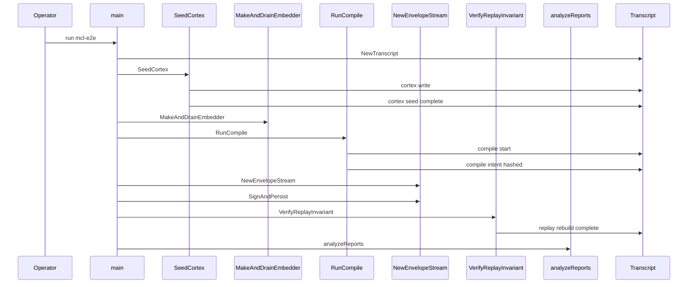
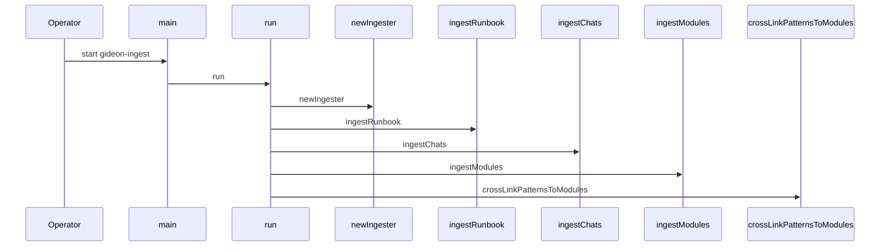

# MCL - End-to-end flow

## Overview

This section covers the executable harnesses that drive MCL behavior end to end. It does not re-explain the MCL language itself; instead, it focuses on the command-line entrypoints that compile MCL into typed intent data, seed and replay a live cortex, journal signed envelopes, ingest operational corpora into cortex memory, and smoke-test agent tool manifests.

The result is a practical validation layer around MCL: one command exercises a full live run against real models and a real cortex, another turns ops knowledge and source-tree modules into typed memory graphs, and a third inspects and invokes tool manifests without booting the full executor. The files below are the concrete surfaces for that workflow.

## Harness Files

| File | Role in this section | Concrete behavior |
| --- | --- | --- |
| `executor/cmd/mcl-e2e/README.md` | Harness specification | Documents the three-run live test, required environment, exit codes, and recorded empirical findings. |
| `executor/cmd/mcl-e2e/main.go` | E2E entrypoint | Orchestrates runs A, B, and C, validates environment, creates the run directory, and performs cross-run analysis. |
| `executor/cmd/mcl-e2e/assert.go` | Assertion accounting | Tracks pass/fail counts, prints colored results, and emits assertion events to the transcript. |
| `executor/cmd/mcl-e2e/compile.go` | MCL compile stage | Parses and validates `SKILL.mtx`, runs the interpreter through `bridge`, builds `ir.Intent`, and records deterministic hashes. |
| `executor/cmd/mcl-e2e/cortex_seed.go` | Deterministic cortex seed | Seeds the baseline memory graph, fixes clock and ID generation, and drains the embedder. |
| `executor/cmd/mcl-e2e/envelopes.go` | Envelope journaling | Signs envelopes, persists per-intent JSON journal entries, and maintains an in-memory chain. |
| `executor/cmd/mcl-e2e/replay.go` | Replay invariant check | Stops the embedder, snapshots, rebuilds, and verifies the byte-identical overall root invariant. |
| `executor/cmd/gideon-ingest/main.go` | Corpus ingest entrypoint | Loads the corpus, opens cortex storage, and runs runbook, chat, and module ingestion passes. |
| `executor/cmd/gideon-ingest/corpus.go` | Ops corpus parsing | Splits markdown sections, parses tables, and maps runbook and chat logs into memory nodes and edges. |
| `executor/cmd/gideon-ingest/ingest.go` | Idempotent write engine | Resolves stable IDs, upserts nodes, builds tags, and links edges with deterministic bookkeeping. |
| `executor/cmd/gideon-ingest/modules.go` | Source graph ingest | Discovers HyperPax-OS modules, derives summaries, extracts dependencies, and emits facts and capabilities. |
| `executor/cmd/mcl-tools/main.go` | Manifest smoke tester | Lists servers and tools, describes a tool, verifies a manifest, and runs a single tool call against a spawned MCP server. |

## End to End Live Test Harness

### End to End Harness README

*`executor/cmd/mcl-e2e/README.md`*

The README positions `mcl-e2e` as the live equivalent of `go test ./...` for the MCL critical path. It describes three runs in sequence: A and B use Fireworks DeepSeek-V4-Flash for the determinism repeat, and C uses Together `openai/gpt-oss-120b` for cross-model robustness.

It also records the concrete scope of the run: cortex storage and replay, MCL parsing and validation, interpreter execution through a live bridge, typed intent and plan hashing, envelope signing and persistence, lifecycle transitions, and real MCP subprocess execution.

### E2E Entry Point

*`executor/cmd/mcl-e2e/main.go`*

`main` is the orchestration point for the entire live test. It creates the run directory under `runs/<timestamp>`, writes a top-level transcript to `TOPLEVEL.jsonl`, validates `FIREWORKS_API_KEY`, optionally validates `TOGETHER_API_KEY`, and then launches the run set:

- Run A: Fireworks DeepSeek-V4-Flash
- Run B: the same Fireworks model for repeat comparison
- Run C: Together `openai/gpt-oss-120b` unless skipped

It also records banner metadata such as router mode and skip state, then runs cross-run analysis after the individual runs finish.

#### Runtime Flags

| Flag | Default | Purpose |
| --- | --- | --- |
| `-root` | `${PWD}/runs` | Base directory for artifacts. |
| `-skill` | `/root/matrix/skills/writing-plans/SKILL.mtx` | Input skill file for compilation. |
| `-prose` | `Build a concise launch checklist for Centra AI covering compiler, cortex, executor, and bridge readiness.` | Natural-language task prompt. |
| `-verb` | `build` | Pre-classified verb passed to the compiler. |
| `-seed` | `42` | LLM seed used for the repeat run. |
| `-fireworks-model` | `accounts/fireworks/models/deepseek-v4-flash` | Compiler model for runs A and B. |
| `-together-model` | `openai/gpt-oss-120b` | Compiler model for run C. |
| `-skip-together` | `false` | Skips the cross-model run. |
| `-skip-determinism` | `false` | Skips the repeated Fireworks run. |
| `-legacy-router` | `false` | Observational A/B toggle recorded in the transcript. |

#### Execution Flow

1. `main` creates a timestamped artifact root.
2. It initializes the transcript with `NewTranscript`.
3. It precomputes a shared intent ID with `synthIntentID`.
4. It executes the run set through `RunOnce` with the configured provider and seed.
5. It compares run outputs in `analyzeReports`.
6. It prints the final assertion summary and exits with the assertion-derived code.

#### E2E Sequence

### Assertion Accounting

buildIntentFromRun stamps CreatedAt with the current UTC time before hashing the intent. That means the A/B Intent.Hash comparison in analyzeReports is not only a model-determinism check; it also carries a wall-clock field that changes across runs. The harness records the comparison as informational, but the hash is not a pure upstream LLM signal.

*`executor/cmd/mcl-e2e/assert.go`*

`AssertCtx` is the run-local pass/fail accumulator. It prints colored PASS and FAIL lines to stderr, emits `assert` events into the transcript, and preserves later checks even after a failure.

#### Properties

| Property | Type | Purpose |
| --- | --- | --- |
| `Passed` | `int` | Count of successful assertions. |
| `Failed` | `int` | Count of failed assertions. |
| `t` | `*Transcript` | Event sink for assertion logs. |

#### Constructor Dependencies

| Type | Description |
| --- | --- |
| `*Transcript` | Receives assertion events and run annotations. |

#### Methods

| Method | Description |
| --- | --- |
| `NewAssertCtx` | Creates a new assertion context bound to a transcript. |
| `True` | Records a boolean assertion with an optional detail string. |
| `Equal` | Compares two values and delegates to `True`. |
| `NoError` | Asserts that an error is nil. |
| `Summary` | Prints the final pass/fail tally. |
| `ExitCode` | Returns `1` when any assertion failed, otherwise `0`. |

`Section`, `Subsection`, `short`, and `fmtDetail` support the formatted console output. The `True` method also writes `assert` transcript events with `label`, `ok`, and `detail`.

### Compile Stage

*`executor/cmd/mcl-e2e/compile.go`*

`RunCompile` is the harness’s source-to-intent compilation stage. It uses the real parser and validator, computes the canonical `SKILL.mtx` digest, creates a live `bridge.Adapter`, and runs the interpreter against a live LLM client. The result is captured in `CompileResult` so later steps can reuse the output without re-running the compiler.

#### Compile Options

| Property | Type | Purpose |
| --- | --- | --- |
| `SkillPath` | `string` | Path to the skill file. |
| `Prose` | `string` | User-facing task prompt. |
| `Verb` | `string` | Pre-classified verb used by the compiler. |
| `Grammar` | `string` | Grammar identifier. |
| `IntentID` | `string` | Pre-allocated intent ID for cross-run comparisons. |
| `Actor` | `string` | Actor URI for the intent. |
| `Agent` | `string` | Agent URI for the intent. |
| `Model` | `string` | Compiler model override. |
| `Provider` | `llm.Provider` | Provider selection when `ProviderSet` is true. |
| `ProviderSet` | `bool` | Signals that `Provider` should override defaults. |
| `Seed` | `int64` | Deterministic seed passed to the LLM config. |

#### Compile Result

| Property | Type | Purpose |
| --- | --- | --- |
| `IntentID` | `string` | The emitted intent identifier. |
| `Intent` | `*ir.Intent` | The built typed intent. |
| `IntentJSON` | `[]byte` | Final canonical JSON for the intent. |
| `IntentHash` | `string` | SHA-256 hash of the canonical intent JSON. |
| `MtxDigest` | `string` | Canonical AST hash of the skill file. |
| `ModelDigest` | `string` | SHA-256 digest of the selected model ID. |
| `CortexSnapshotHash` | `string` | Overall root at compile entry. |
| `FrameJSON` | `string` | Raw LLM frame output. |
| `PromptMessages` | `[]interpreter.Message` | Prompt messages captured from the interpreter. |
| `Slots` | `map[string]*interpreter.Slot` | Resolved interpreter slots. |
| `Unknowns` | `[]*interpreter.Unknown` | Blocking or optional gaps reported by the interpreter. |
| `ClarifyQuestions` | `[]*interpreter.ClarifyQuestion` | Clarification prompts generated during compile. |
| `MatchedCondition` | `string` | The matched interpreter condition. |
| `CompileLatencyMs` | `int64` | Wall-clock latency of the compile stage. |

#### Functions

| Function | Description |
| --- | --- |
| `RunCompile` | Executes the compile stage and returns a structured result. |
| `buildIntentFromRun` | Converts interpreter output into a typed `ir.Intent`. |
| `compilerSeed` | Derives the replay seed from intent ID, actor, snapshot hash, MCL digest, and model digest. |
| `sha256Hex` | Returns a hex-encoded SHA-256 digest. |
| `synthIntentID` | Derives a deterministic 26-character ULID-shaped ID from prose and verb. |

#### Compile Flow

- The skill file is parsed with `parser.New(src).Parse()`.
- The parsed file is validated with `validator.ValidateSkill(file)`.
- `canonical.Hash(file)` computes the MCL digest.
- `llm.DefaultCompilerModel()` is configured with the requested model, provider, and seed.
- The live `bridge.New(c)` adapter connects the interpreter to the cortex.
- `c.OverallRoot()` is captured before interpretation as the compile-time snapshot hash.
- `interpreter.New(file, llmClient, adapter)` runs the compiler.
- `buildIntentFromRun` constructs the final `ir.Intent`, including `CompileMetadata`.
- `ir.Hash(intent)` produces the intent hash, and `ir.CanonicalJSON(intent)` is recomputed afterward for the final byte form.

`RunCompile` emits these transcript events:

- `compile.start`
- `compile.skill.parsed`
- `compile.llm.complete`
- `compile.intent.hashed`

### Cortex Seed and Embedder Warmup

*`executor/cmd/mcl-e2e/cortex_seed.go`*

This file fixes the initial cortex state used by the harness. `FixedClock` returns a closure that always yields the same UTC time, and `SeededIDGen` returns a deterministic `memory.ID` generator built from a fixed timestamp and a counter.

#### Functions

| Function | Description |
| --- | --- |
| `FixedClock` | Produces a stable clock closure for `cortex.WithClock`. |
| `SeededIDGen` | Produces a deterministic ID generator for stable memory IDs. |
| `SeedCortex` | Writes the baseline memory graph used at the start of each run. |
| `MakeAndDrainEmbedder` | Creates the real embedder, starts it on cortex, and drains it with a timeout. |

#### Seeded Baseline Content

`SeedCortex` writes a fixed set of memory nodes and then logs the resulting overall root:

- `Identity:Andrew`
- `Fact:Centra-AI-project`
- `Fact:Paxeer-chain`
- `Goal:v1-launch`
- `Constraint:no-chain-v1`
- `Pattern:executor-walks-plan`

Each write uses `c.Write` with `Confidence: 1.0` and `memory.Provenance{Source: memory.SourceUserInput}`. After the writes, `SeedCortex` records `cortex.seed.complete` with the count, overall root, and wall-clock time string.

`MakeAndDrainEmbedder` creates `embed.NewAPIEmbedder(embed.APIEmbedderConfig{})`, attaches it via `c.StartEmbedder`, and waits up to 60 seconds for `c.DrainEmbedder` to catch up.

### Envelope Journaling

*`executor/cmd/mcl-e2e/envelopes.go`*

`EnvelopeStream` is the per-intent journal writer. It creates a directory for the intent, signs each envelope, verifies it with a local key resolver, writes a pretty-printed JSON file, and keeps an in-memory chain so later envelopes can reference the previous ID.

#### Properties

| Property | Type | Purpose |
| --- | --- | --- |
| `dir` | `string` | Journal directory for the current intent. |
| `intentID` | `string` | Intent identifier used in the journal path and envelope target. |
| `actor` | `*ActorIdentity` | Actor identity used for signing and addressing. |
| `resolver` | `*staticKeyResolver` | Local public-key resolver used for self-verification. |
| `t` | `*Transcript` | Event sink for envelope lifecycle logs. |
| `seq` | `uint64` | Monotonic per-intent sequence number. |
| `chain` | `[]*envelope.Envelope` | Ordered set of signed envelopes. |

#### Constructor Dependencies

| Type | Description |
| --- | --- |
| `parent` | Base journal directory. |
| `intentID` | Per-intent subdirectory name. |
| `*ActorIdentity` | Supplies the signing key pair and user URI. |
| `*Transcript` | Receives `envelope.signed` events. |

#### Methods

| Method | Description |
| --- | --- |
| `NewEnvelopeStream` | Prepares the per-intent journal directory and resolver. |
| `SignAndPersist` | Builds, signs, verifies, and writes one envelope JSON file. |
| `Resolver` | Returns the internal resolver. |
| `Chain` | Returns the current signed envelope chain. |
| `Last` | Returns the most recent envelope or `nil`. |
| `LastID` | Returns the most recent envelope ID or an empty string. |

`SignAndPersist` sets the following envelope fields before signing:

- `ID`
- `At`
- `From`
- `Intent`
- `CorrelationID`
- `CausationID`

It then signs with `envelope.Sign`, verifies with `envelope.Verify`, computes `envelope.SelfHash`, and writes the pretty-printed result to `<seq>-<kind>.json`. The helper `sanitiseKind` replaces `.` with `-` so kinds such as `intent.draft` become filesystem-safe names.

### Replay Invariant

*`executor/cmd/mcl-e2e/replay.go`*

`VerifyReplayInvariant` is the byte-identical replay check. It stops the embedder, snapshots the cortex, captures the pre-rebuild overall root, rebuilds with `cortex.Rebuild(cortex.RebuildOptions{})`, captures the post-rebuild root, and then calls `replay.VerifyPreservesRoot`.

#### Steps

1. `c.StopEmbedder()`
2. `c.Snapshot("e2e-final")`
3. `c.OverallRoot()`
4. `c.Rebuild(cortex.RebuildOptions{})`
5. `c.OverallRoot()` again
6. `replay.VerifyPreservesRoot(res)`

The function logs these transcript events:

- `replay.embedder.stopped`
- `replay.snapshot.taken`
- `replay.rebuild.complete`

The assertion layer records both the `VerifyPreservesRoot` result and the final byte comparison between the pre and post roots.

### Transcript Logging and Event Capture

The transcript is the shared logging and telemetry surface for the live harness. It is injected into `AssertCtx`, `EnvelopeStream`, `RunCompile`, `SeedCortex`, `VerifyReplayInvariant`, and the top-level `main` orchestration.

| Emitter | Event names |
| --- | --- |
| `AssertCtx.True` | `assert` |
| `RunCompile` | `compile.start`, `compile.skill.parsed`, `compile.llm.complete`, `compile.intent.hashed` |
| `SeedCortex` | `cortex.write`, `cortex.seed.complete` |
| `EnvelopeStream.SignAndPersist` | `envelope.signed` |
| `VerifyReplayInvariant` | `replay.embedder.stopped`, `replay.snapshot.taken`, `replay.rebuild.complete` |
| `main` | `ab.router_mode`, `cross-run.AB`, `cross-run.AC` |

The transcript is also used for post-run analysis records, including the informational A/B determinism finding.

## Gideon Ingest Corpus Builder

### Ingest Entry Point

*`executor/cmd/gideon-ingest/main.go`*

`main` wires the corpus ingest command. It accepts the cortex root, actor name, knowledge directory, and dry-run toggle; verifies that the core chats corpus exists; opens the cortex store when not running in dry-run mode; and then executes the three ingest passes in order:

1. `ingestRunbook`
2. `ingestChats`
3. `ingestModules`
4. `crossLinkPatternsToModules`

After the passes complete, it prints a summary report showing node and edge counts.

#### Runtime Flags

| Flag | Default | Purpose |
| --- | --- | --- |
| `-cortex-root` | none | Required cortex store root. |
| `-cortex-actor` | `gideon` | Actor name used when opening the store. |
| `-knowledge` | `knowledge` | Path to the corpus directory. |
| `-dry-run` | `false` | Parses and counts without writing. |

#### Ingest Sequence

### Text and Corpus Parsing

*`executor/cmd/gideon-ingest/corpus.go`*

This file provides the deterministic markdown helpers and the runbook/chat ingest passes.

#### Helpers

| Function | Description |
| --- | --- |
| `slugify` | Lowercases text and reduces it to a stable `[a-z0-9-]` token. |
| `condense` | Collapses whitespace runs into single spaces. |
| `truncate` | Clamps text on rune boundaries and appends `` when it cuts. |
| `utf8RuneStart` | Tests whether a byte is the start of a UTF-8 rune. |
| `splitSections` | Splits markdown into exact-level heading sections. |
| `headings` | Returns level-2 and level-3 headings in document order. |
| `tokenSet` | [REDACTED] |
| `significantKeywords` | Keeps distinct tokens of length four or more for failure matching. |
| `parseTableRows` | Extracts the data rows of the first markdown pipe table. |
| `splitTableRow` | Splits a pipe table row into trimmed cells. |
| `isSeparatorRow` | Detects markdown separator rows. |

#### Runbook Ingest

`ingestRunbook` reads the runbook markdown, groups sections by title, and emits typed memory nodes for the main operational artifacts:

- `Standard Recovery Procedure` becomes a verified `memory.CapabilityData`
- `Hard Rules (NEVER Violate)` becomes a `memory.PatternData`
- `Known Failure Modes` becomes one `memory.PatternData` per level-3 subsection
- `Incident History` becomes one `memory.EventData` per table row

The code links recovery-related failure modes to the standard recovery capability with `resolved-by`, and it links incidents to matching failure-mode patterns with `caused-by`.

#### Chat Log Ingest

`ingestChats` walks the `core_chats` directory, skips non-markdown files and `RUNBOOK.md`, and forwards each transcript to `ingestChat`.

`ingestChat`:

- loads the chat markdown
- builds a deterministic outline from headings
- creates an observation event for the session
- creates a fix-pattern memory node from the transcript summary
- links the fix pattern back to the incident with `derived-from`
- links the incident to matching failure modes with `caused-by`

This pass keeps the reasoning deterministic: it uses markdown headings and token matching only.

### Idempotent Memory Upserts

*`executor/cmd/gideon-ingest/ingest.go`*

`ingest.go` is the write engine shared by all corpus passes. It makes repeated ingest runs stable by deriving a deterministic memory ID from the ingest key, comparing encoded data before writing, and updating only when content changed.

#### Properties

| Property | Type | Purpose |
| --- | --- | --- |
| `cx` | `*cortex.Cortex` | Open cortex handle, attached by `main` when not dry-run. |
| `actor` | `string` | Cortex actor name. |
| `dryRun` | `bool` | Skip writes and only count actions. |
| `moduleFacts` | `map[string]memory.ID` | Base module name to fact ID mapping. |
| `failurePatterns` | `[]keywordRef` | RUNBOOK failure patterns keyed by distinctive keywords. |
| `fixPatterns` | `[]patternRef` | Fix and diagnosis patterns used for cross-linking. |
| `wrote` | `int` | Count of first-time writes. |
| `updated` | `int` | Count of updated nodes. |
| `skipped` | `int` | Count of unchanged nodes that were skipped. |
| `edges` | `int` | Count of ensured edges. |

#### Constructor Dependencies

| Type | Description |
| --- | --- |
| `actor string` | Store actor name passed from the command line. |
| `dryRun bool` | Controls whether the write path touches cortex. |

#### Methods

| Method | Description |
| --- | --- |
| `newIngester` | Constructs an ingester with empty module fact state. |
| `keyID` | Derives a stable 16-byte memory ID from an ingest key. |
| `upsertNode` | Writes, updates, or skips a node based on deterministic content comparison. |
| `buildTags` | Builds the tag set with the ingest marker and stable key tag. |
| `linkEdge` | Ensures a typed edge exists unless the source or destination is zero or identical. |
| `crossLinkPatternsToModules` | Links fix patterns to module facts by token match. |
| `matchFailures` | Finds RUNBOOK failure patterns whose keywords appear in text. |
| `report` | Prints the ingest counts and summary totals. |

`upsertNode` is the core idempotency primitive. It uses `ResolveLatest`, compares `mem.Version.Data` against the newly encoded bytes, and only calls `Update` when the data changed. If the ID is missing, it writes a new head with `buildTags(key, extraTags)` and `cortex.WriteMeta`.

`buildTags` always prepends `gideon-ingest` and `gideon:key:<key>`, deduplicates the slice, trims each tag to `memory.MaxTagLen`, and stops at `memory.MaxTagsPerMemory`.

### Source Graph Ingest

*`executor/cmd/gideon-ingest/modules.go`*

This file turns the HyperPax-OS tree into facts and capabilities. The pass is deterministic and does not rely on parser packages; it reads files directly and scans import lines.

#### Module Info

| Property | Type | Purpose |
| --- | --- | --- |
| `relpath` | `string` | Module path relative to the HyperPax-OS root. |
| `base` | `string` | Last path element, used as the module name key. |
| `abs` | `string` | Absolute directory path. |
| `pkg` | `string` | Discovered Go package name. |
| `summary` | `string` | Heuristic module summary. |
| `hasKeeper` | `bool` | Marks modules that own a keeper. |
| `factID` | `memory.ID` | Resulting fact node ID. |
| `deps` | `map[string]struct{}` | Sibling module dependencies discovered from imports. |

#### Functions

| Function | Description |
| --- | --- |
| `discoverModules` | Returns sorted module relpaths from `x/`, `precompiles/`, `app`, `rpc`, and `indexer`. |
| `gatherModule` | Reads one module directory and gathers its summary and dependencies. |
| `ig_deriveSummary` | Applies the deterministic summary cascade. |
| `readGoFiles` | Reads top-level Go files without using `go/parser`. |
| `hasAnyGo` | Detects whether a directory tree contains any Go file. |
| `orderedNames` | Sorts file names with an optional preferred file first. |
| `scanGoFile` | Extracts package names and imports by line scanning. |
| `extractImport` | Pulls the import path out of one source line. |
| `resolveModuleRel` | Maps an import path to a known module relpath. |
| `docAbovePackage` | Reads the doc comment directly above the package clause. |
| `docAboveType` | Reads the doc comment for a named exported type. |
| `firstParagraph` | Extracts the first non-heading paragraph from markdown. |
| `firstSentence` | Returns the first sentence in a string. |
| `looksLikeLicense` | Filters boilerplate or license text from summaries. |

#### Two-Pass Module Ingest

`ingestModules` uses a two-pass strategy:

1. Discover module directories.
2. Gather all modules, write facts, and write keeper capabilities first.
3. Emit `keeper-of` edges from keeper capabilities to their module facts.
4. Emit `depends-on` edges after all fact IDs are known.

The source graph is built from top-level Go files and, when present, keeper files and README content. The summary cascade prefers package doc comments, then the README first paragraph, then keeper or module type doc comments, and finally a fallback string that names the module and package.

## MCL Tools Manifest Smoke Testing

### Manifest Command

*`executor/cmd/mcl-tools/main.go`*

`mcl-tools` is an operator-side manifest utility. It inspects agent manifests, lists tools, describes a tool, verifies manifest structure, and can spawn the specific MCP server needed for one tool call.

#### Subcommands

| Subcommand | Function | Behavior |
| --- | --- | --- |
| `list-servers` | `runListServers` | Prints each server alias, transport, package digest, version, and tool count. |
| `list-tools` | `runListTools` | Lists all tool URIs and can emit JSON. |
| `describe-tool` | `runDescribeTool` | Prints the URI, description, side-effect class, and provider metadata for one tool. |
| `verify` | `runVerify` | Loads the manifest and prints a compact validity summary. |
| `call` | `runCall` | Spawns the relevant server, resolves the tool, invokes it, and prints the result. |

#### Call Flow

`runCall` parses `-manifest`, `-uri`, `-args`, and `-timeout`, then:

1. Parses the tool URI with `tool.ParseToolURI`.
2. Loads the manifest with `mustLoad`.
3. Creates an MCP manager with `mcp.NewManager`.
4. If the URI targets an MCP tool, resolves the server spec with `findServerSpec` and calls `mgr.Spawn`.
5. Builds a registry with `tool.NewRegistry`.
6. Resolves the tool with `r.Get`.
7. Calls the tool with `t.Call`.
8. Prints pretty JSON and exits with code `3` if `res.IsError` is true.

`findServerSpec` resolves `$env:` references in manifest environment values and headers, inherits the process environment, and returns an `mcp.ServerSpec` populated with `Alias`, `Transport`, `Command`, `Args`, `Env`, `Endpoint`, `Headers`, `PackageDigest`, and `ExpectedTools`.

#### Helper Functions

| Function | Description |
| --- | --- |
| `usage` | Prints CLI usage text. |
| `mustLoad` | Loads a manifest or exits on error. |
| `mustParse` | Parses flags or exits with code `2`. |
| `must` | Prints a message and exits when a condition is false. |
| `findServerSpec` | Resolves a manifest server entry into an MCP server spec. |

## Behavioral Notes

- `mcl-e2e` is deliberately live: it uses real cortex storage, a real embedder, real model calls, and real MCP subprocesses.
- The replay check is the only hard postcondition that must hold across the full run: `VerifyReplayInvariant` asserts that pre and post overall roots match byte for byte.
- `gideon-ingest` is deterministic by design: the same corpus and source tree produce stable keys, stable tags, and stable edge order.
- `mcl-tools` is intentionally narrow: it is a single-tool operator path for inspecting and exercising manifest-backed tools without booting the full executor.

## Key Files Reference

| File | Responsibility |
| --- | --- |
| `executor/cmd/mcl-e2e/README.md` | Documents the live three-run harness, required environment, and recorded findings. |
| `executor/cmd/mcl-e2e/main.go` | Coordinates the full end-to-end run and cross-run analysis. |
| `executor/cmd/mcl-e2e/assert.go` | Aggregates assertions and emits assertion telemetry. |
| `executor/cmd/mcl-e2e/compile.go` | Compiles MCL into typed intent output with deterministic hashes. |
| `executor/cmd/mcl-e2e/cortex_seed.go` | Seeds deterministic cortex state and starts the embedder. |
| `executor/cmd/mcl-e2e/envelopes.go` | Signs and persists envelope journal entries. |
| `executor/cmd/mcl-e2e/replay.go` | Verifies the byte-identical replay invariant. |
| `executor/cmd/gideon-ingest/main.go` | Runs the corpus ingest workflow. |
| `executor/cmd/gideon-ingest/corpus.go` | Parses runbook and chat markdown into memory data. |
| `executor/cmd/gideon-ingest/ingest.go` | Provides the stable upsert and edge-linking engine. |
| `executor/cmd/gideon-ingest/modules.go` | Builds the HyperPax-OS source graph into facts and capabilities. |
| `executor/cmd/mcl-tools/main.go` | Inspects manifests and smoke-tests manifest-backed tools. |
