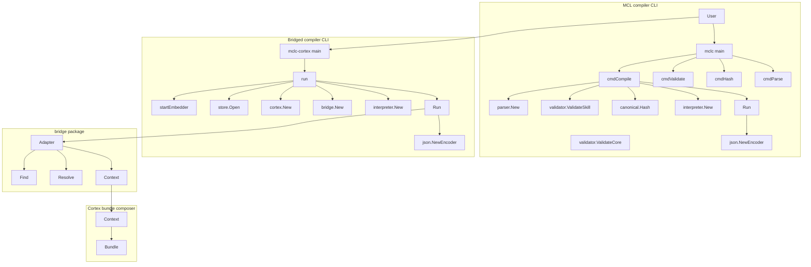
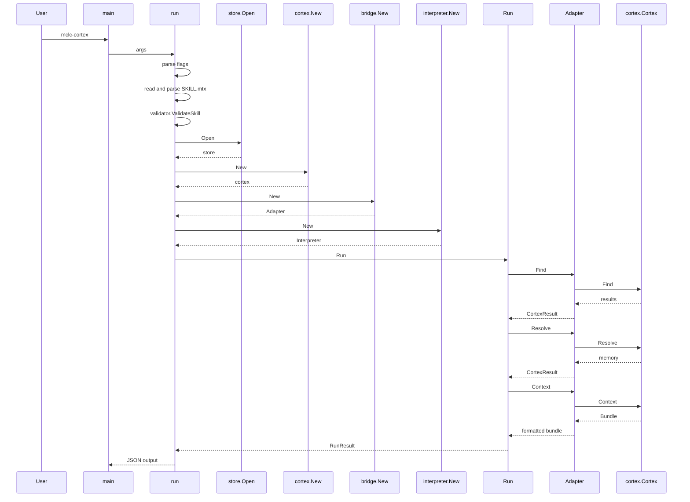

# MCL - Pipeline

## Overview

This section documents the command wiring that turns CentraScript into a compiler-style workflow. The `mclc` CLI parses command arguments, validates and hashes `.mtx` inputs, and runs the interpreter over a parsed `SKILL.mtx`; the `mclc-cortex` CLI follows the same compiler path but also opens a live cortex, starts an embedder when requested, and passes a `bridge.Adapter` into the interpreter.

The bridge module sits between `matrix/mcl` and `matrix/cortex`. Its role is narrow and explicit: translate SKILL argument dictionaries into `query.Query` and `cortex.ContextOpts`, resolve `cortex.find` / `cortex.resolve` / `cortex.context` calls, and return cortex errors without inventing new semantics.

## Pipeline Shape

## `MCL/cmd/mclc/main.go`

MCL/cmd/mclc/main.go advertises a fmt command in usage(), but main() only dispatches compile, validate, hash, parse, help, -h, and --help. A fmt invocation therefore reaches the unknown-command branch.

*`MCL/cmd/mclc/main.go`*

This file implements the standalone compiler CLI. It reads `os.Args`, selects a command, and then routes to one of four active handlers: `cmdCompile`, `cmdValidate`, `cmdHash`, or `cmdParse`. The file also keeps `matrix/mcl/ir` linked with `var _ = ir.VerbBuild`, which preserves the package dependency needed by the output types.

### Command dispatch

| Function | Role |
| --- | --- |
| `main` | Reads the command from `os.Args[1]` and dispatches to the matching handler. |
| `usage` | Prints the command and flag help text to stderr. |
| `cmdCompile` | Compiles a SKILL file against user prose and writes JSON to stdout. |
| `cmdValidate` | Validates each input path and prints `path: ok` on success. |
| `cmdHash` | Prints the canonical AST digest followed by the path. |
| `cmdParse` | Prints the number of sections and entries found in each parsed file. |

`main()` recognizes `compile`, `validate`, `hash`, `parse`, `help`, `-h`, and `--help`. Any other command prints an error and exits with status 1.

### Compile command wiring

`cmdCompile` performs the compiler path in the order visible in source:

1. Parse `-skill`, `-prose`, `-verb`, `-grammar`, `-confidence`, `-model`, `-seed`, `-dry-run`, and `key=value` slot overrides from the argument slice.
2. Read the `SKILL.mtx` file with `os.ReadFile`.
3. Parse it with `parser.New(src)` and `Parse()`.
4. Validate it with `validator.ValidateSkill(file)`.
5. Compute the digest with `canonical.Hash(file)`.
6. Build an LLM client with `llm.DefaultCompilerModel()` unless `-dry-run` is set or the client cannot be created.
7. Create `interpreter.New(file, llmClient, nil)`.
8. Run `interp.Run(context.Background(), &interpreter.RunInput{})`.
9. Encode the compile result as JSON.

The command stops on the first parse or validation error and prints each error line to stderr before exiting. If `llm.New` fails, the code prints a dry-run fallback message and continues with a nil LLM.

### Compile JSON payload

#### Compile Output

*`MCL/cmd/mclc/main.go`*

| Field | Type | Description |
| --- | --- | --- |
| `MtxDigest` | `string` | Canonical AST digest from `canonical.Hash(file)`. |
| `MatchedCondition` | `string` | Description of the first matching on-block condition. |
| `Executed` | `bool` | Whether an on-block matched and executed. |
| `FrameJSON` | `string` | Raw LLM output when a prompt block executed. |
| `PromptMessages` | `[]promptMsg` | Prompt messages sent to the LLM. |
| `Slots` | `[]slotOut` | Final slot states collected from the interpreter. |
| `Unknowns` | `[]unknownOut` | Unknown-gap records emitted by the interpreter. |
| `ClarifyQuestions` | `[]clarifyOut` | Clarify questions emitted by the interpreter. |

#### Prompt Message

*`MCL/cmd/mclc/main.go`*

| Field | Type | Description |
| --- | --- | --- |
| `Role` | `string` | Message role sent to the LLM. |
| `Content` | `string` | Interpolated message text. |

#### Slot Output

*`MCL/cmd/mclc/main.go`*

| Field | Type | Description |
| --- | --- | --- |
| `Name` | `string` | Slot name. |
| `Value` | `string` | Final slot value. |
| `Status` | `string` | Interpreter slot status mapped by `statusName`. |
| `Type` | `string` | Slot type name. |

#### Unknown Output

*`MCL/cmd/mclc/main.go`*

| Field | Type | Description |
| --- | --- | --- |
| `SlotName` | `string` | Slot name attached to the unknown. |
| `Severity` | `string` | Unknown severity. |
| `Reason` | `string` | Explanation attached to the unknown. |

#### Clarify Output

*`MCL/cmd/mclc/main.go`*

| Field | Type | Description |
| --- | --- | --- |
| `SlotName` | `string` | Slot name attached to the question. |
| `Prompt` | `string` | Clarification prompt. |
| `Type` | `string` | Expected answer type. |
| `Required` | `bool` | Required flag emitted by the interpreter. |

### Validation, hashing, and parsing

`cmdValidate` reads every input path independently, parses each file, and then chooses the validator from the file contents:

- if any section name is `SKILL`, it calls `validator.ValidateSkill(file)`
- otherwise it calls `validator.ValidateCore(file)`

That means validation is driven by parsed section content rather than the file extension. `cmdHash` and `cmdParse` both accept multiple paths and process them one by one, exiting on the first error.

`cmdHash` emits `digest  path`, matching the conventional digest format. `cmdParse` emits the path, the section count, and then each section name with its entry count.

### `statusName`

`statusName(s interpreter.SlotStatus)` maps slot states to the strings used in the JSON output:

- `interpreter.SlotEmpty` → `empty`
- `interpreter.SlotRaw` → `raw`
- `interpreter.SlotResolved` → `resolved`
- `interpreter.SlotDefault` → `default`
- any other value → `unknown`

## `bridge/README.md`

*`bridge/README.md`*

The README defines the bridge module as the glue layer that links `matrix/mcl/mtx/interpreter` to `matrix/cortex` in a third top-level Go module. It explains why the two main modules stay isolated from each other and documents the bridge call mapping from SKILL syntax to live cortex calls.

| Topic | What the README states |
| --- | --- |
| Module boundary | `matrix/mcl` exposes a narrow `interpreter.Cortex` interface, `matrix/cortex` exposes the typed memory graph, and the bridge module keeps both dependency graphs closed. |
| `cortex.find` mapping | Maps SKILL `resolve slot.X <- cortex.find` calls to `Adapter.Find(ctx, args)`. |
| `cortex.resolve` mapping | Maps SKILL `resolve slot.X <- cortex.resolve` calls to `Adapter.Resolve(ctx, expr)`. |
| `cortex.context` mapping | Maps SKILL `resolve slot.X <- cortex.context` calls to `Adapter.Context(ctx, args)`. |
| Supported `cortex.find` keys | `type`, `tag`, `near`, `limit`, `form`, `late`, `include_tombstoned`. |
| Supported `cortex.context` keys | `verb`, `objects`, `budget_tokens`, `outcome_limit`, `form`. |
| Invariants | Compile-time discipline, context purity, no silent typos, and embedder gating. |
| CLI surface | Notes the `mclc-cortex` command as the end-to-end bridged compiler. |

## `bridge/args.go`

*`bridge/args.go`*

This file contains the parser helpers that convert SKILL argument dictionaries into the bridge’s runtime query types.

### Helper functions

| Function | Role |
| --- | --- |
| `buildQuery` | Converts a `map[string]string` into `query.Query`. |
| `buildContextOpts` | Converts a `map[string]string` into `cortex.ContextOpts`. |
| `parseTypeName` | Converts the canonical type string into `memory.Type`. |
| `parseForm` | Converts `short`, `medium`, or `full` into `query.FormKind`. |
| `parseObjects` | Converts a `objects=` string into the `ContextOpts` object map. |

### Query translation

`buildQuery` starts with the adapter defaults:

- `Limit: a.defaultLimit`
- `Form: a.defaultForm`
- `LateBinding: a.lateBinding`

It then accepts these `cortex.find` keys:

- `type` → one or more `memory.Type` values through `parseTypeName`
- `tag` → a `query.HasTag` predicate
- `near` → free-form near text
- `limit` → positive integer
- `form` → `short`, `medium`, or `full`
- `late` → boolean
- `include_tombstoned` → boolean

Any unknown key fails the build immediately. Unknown type names, malformed integers, and malformed booleans also return errors instead of being ignored.

When more than one `tag`-style predicate is present, the helper combines them with `query.And{Children: conjuncts}`.

### Context option translation

`buildContextOpts` accepts the `cortex.context` argument surface:

- `verb` → `memory.Verb` via `memory.ParseVerb`
- `objects` → parsed by `parseObjects`
- `budget_tokens` → non-negative integer
- `outcome_limit` → non-negative integer
- `form` → `query.FormKind`

Unknown verbs, malformed numeric values, and unknown keys return errors.

### Object parsing rules

`parseObjects` accepts:

- comma-separated pairs
- semicolon-separated pairs
- a single `kind:ref` pair

It rejects mixed `,` and `;` separators in the same string. It trims whitespace around the separator and around the `kind` and `ref` parts, but it preserves the reference text itself. The key is validated with `memory.ParseObjKind`, so unknown object kinds fail at compile time instead of being dropped.

### Type and form mapping

`parseTypeName` accepts the closed set used in the bridge README: `Identity`, `Fact`, `Preference`, `Belief`, `Event`, `Goal`, `Constraint`, `Capability`, and `Pattern`.

`parseForm` accepts `short`, `medium`, and `full`. Any other value returns an error.

## `bridge/bridge.go`

*`bridge/bridge.go`*

This file is the actual adapter boundary between the interpreter and the cortex. It implements `interpreter.Cortex` over a live `*cortex.Cortex`, and it is the only place where the two core packages are linked together.

### Adapter state

#### Adapter

*`bridge/bridge.go`*

| Field | Type | Description |
| --- | --- | --- |
| `c` | `*cortex.Cortex` | Bound cortex instance. |
| `defaultLimit` | `int` | Default `Find` limit. |
| `defaultForm` | `query.FormKind` | Default render form for summaries. |
| `lateBinding` | `bool` | Default late-binding mode for `Find` and `Resolve`. |

The constructor panics on a nil cortex:

- `New(c, opts...)` requires a non-nil `*cortex.Cortex`
- the default limit is `10`
- the default form is `query.FormMedium`

### Construction options

| Function | Role |
| --- | --- |
| `WithDefaultLimit` | Overrides the default `Find` limit when a SKILL call omits `limit=`. |
| `WithDefaultForm` | Overrides the default `Find` form when a SKILL call omits `form=`. |
| `WithLateBinding` | Controls the adapter’s `Query.LateBinding` behavior. |
| `New` | Creates an `Adapter` around a live cortex and applies the options. |

### Bridge methods

| Method | Description |
| --- | --- |
| `Find` | Translates a SKILL argument dictionary into `query.Query`, calls `a.c.Find`, and returns `interpreter.CortexResult` values. |
| `Resolve` | Resolves exact `matrix://cortex/` URIs directly or falls back to a one-item near search. |
| `Context` | Builds `cortex.ContextOpts`, calls `a.c.Context`, and returns the formatted bundle text. |

### `Find`

`Find` first checks `ctx.Err()`. It then converts the argument map with `a.buildQuery(args)` and calls `a.c.Find(q)`.

The method contains one compile-time-specific special case: if the cortex returns `vector.ErrEmptyIndex`, `Find` returns `nil, nil` so the interpreter can treat the call as “no candidates” instead of failing the compile. Any other cortex error is wrapped with `bridge.Find: %w`.

Returned results are built from the cortex memories:

- `URI` comes from `cortex.BuildURI(m.Head.Type, m.Head.ID, m.Head.CurrentVersion)`
- `Type` comes from `m.Head.Type.String()`
- `Summary` comes from `selectSummary`

### `Resolve`

`Resolve` trims the expression and handles two paths:

1. If the expression begins with `matrix://cortex/`, it calls `a.c.Resolve(memory.URI(expr))`.
2. Otherwise it builds a one-item `query.Query` with `Near: expr`, `Limit: 1`, `Form: a.defaultForm`, and `LateBinding: a.lateBinding`.

If an exact URI lookup returns `memory.ErrNotFound`, the method returns `nil, nil`. If the near-search path sees `vector.ErrEmptyIndex`, the method returns `ErrNotResolvable`. That is the adapter’s “no match” signal.

### `Context`

`Context` calls `a.buildContextOpts(args)`, then `a.c.Context(opts)`, and finally formats the returned bundle through `FormatBundle(bundle)`. The method is read-only from the bridge side and wraps any cortex errors as `bridge.Context: %w`.

### Error sentinels

The bridge exports three explicit sentinel errors:

- `ErrUnknownType`
- `ErrEmptyExpr`
- `ErrNotResolvable`

These let callers detect invalid type names, empty resolve expressions, and non-resolvable expressions without inspecting wrapped strings.

### Summary selection helpers

`memoryToResult` converts a `*memory.Memory` into a `CortexResult` and falls back from `Forms.Medium` to `Forms.Short` if the medium summary is empty.

`selectSummary` chooses the rendered string from `query.Result.Rendered` when available. If no rendered summary exists, it falls back to the memory’s `Forms.Medium`, then `Forms.Short`.

## `bridge/cmd/mclc-cortex/main.go`

*`bridge/cmd/mclc-cortex/main.go`*

This command wires the full bridge path: it parses the SKILL file, opens a cortex store, starts an embedder when requested, constructs the bridge adapter, and then runs the interpreter with a live cortex.

### Runtime flags

#### Flags

*`bridge/cmd/mclc-cortex/main.go`*

| Field | Type | Default | Role |
| --- | --- | --- | --- |
| `skillPath` | `string` | empty | Path to the SKILL file. |
| `prose` | `string` | empty | User natural-language goal. |
| `verb` | `string` | empty | Pre-classified verb. |
| `grammar` | `string` | `intent_frame@1` | Grammar constraint ID. |
| `confidence` | `float64` | `1.0` | Current confidence passed into the interpreter. |
| `model` | `string` | empty | LLM model override. |
| `seed` | `int64` | `42` | Deterministic seed. |
| `dryRun` | `bool` | `false` | Skips LLM construction. |
| `cortexRoot` | `string` | `.matrix-cortex` | Cortex data directory. |
| `actor` | `string` | `andrew` | Cortex actor name. |
| `withEmbedder` | `bool` | `false` | Starts the hash-stub embedder. |
| `withFireworksEmbedder` | `bool` | `false` | Tries the Fireworks embedder first. |
| `slotValues` | `map[string]string` | empty map | Pre-filled slot values. |

The command also recognizes `-h`, `--help`, and `help`.

### Command flow

| Function | Role |
| --- | --- |
| `main` | Calls `run(os.Args[1:])` and prints the returned error. |
| `run` | Parses flags, validates the skill file, opens cortex storage, wires the bridge, runs the interpreter, and emits JSON. |
| `startEmbedder` | Chooses the embedder implementation and starts it on the cortex. |
| `usage` | Prints the command usage text. |
| `statusName` | Converts `interpreter.SlotStatus` into JSON output strings. |

`run` follows this wiring sequence:

1. Parse command flags and `key=value` slot overrides.
2. Read and parse the skill file with `parser.New(src).Parse()`.
3. Validate with `validator.ValidateSkill(file)`.
4. Create the cortex data directory with `os.MkdirAll`.
5. Open the store with `store.Open(f.cortexRoot, f.actor, nil)`.
6. Build the cortex with `cortex.New(s)`.
7. Optionally start an embedder.
8. Build the bridge with `bridge.New(c)`.
9. Hash the parsed skill with `canonical.Hash(file)`.
10. Run `interpreter.New(file, llmClient, cortexAdapter)`.
11. Emit the compile JSON payload.

The command uses the same `compileOutput` shape as `MCL/cmd/mclc/main.go`, but adds the cortex root hash.

### Embedder lifecycle

`startEmbedder` picks one of two implementations:

- `embed.NewAPIEmbedder(embed.APIEmbedderConfig{})` when `-with-fireworks-embedder` is set
- `embed.NewHashEmbedder()` otherwise, or as a fallback when the API embedder cannot be created

It then starts the embedder with `c.StartEmbedder(cortex.EmbedderOptions{Embedder: emb})`. After startup, `run` drains the embedder with a 30-second timeout and defers `c.StopEmbedder()` when startup succeeds.

### Bridged compile JSON payload

#### Compile Output

*`bridge/cmd/mclc-cortex/main.go`*

| Field | Type | Description |
| --- | --- | --- |
| `MtxDigest` | `string` | Canonical AST digest from `canonical.Hash(file)`. |
| `MatchedCondition` | `string` | Matching on-block condition. |
| `Executed` | `bool` | Whether execution occurred. |
| `OverallRoot` | `string` | Hex-encoded cortex overall root from `c.OverallRoot()`. |
| `FrameJSON` | `string` | Raw LLM output. |
| `PromptMessages` | `[]promptMsg` | Prompt transcript. |
| `Slots` | `[]slotOut` | Final slot states. |
| `Unknowns` | `[]unknownOut` | Unknown-gap records. |
| `ClarifyQuestions` | `[]clarifyOut` | Clarify questions. |

The nested `promptMsg`, `slotOut`, `unknownOut`, and `clarifyOut` shapes match the compiler CLI in `MCL/cmd/mclc/main.go`.

### Sequence of the bridged command

## `MCL/mtx/interpreter/interpreter.go`

*`MCL/mtx/interpreter/interpreter.go`*

### Runtime interfaces

- `LLM` exposes `Decode`
- `StreamingLLM` extends `LLM` with `Stream`
- `Cortex` exposes `Find`, `Resolve`, and `Context`

The `StreamingLLM` comments state that streaming must return the same final text as `Decode`, which keeps canonicalization stable regardless of whether streaming is enabled.

### Interpreter wiring

#### Interpreter

*`MCL/mtx/interpreter/interpreter.go`*

| Field | Type | Description |
| --- | --- | --- |
| `file` | `*ast.File` | Parsed skill AST. |
| `llm` | `LLM` | Optional grammar-constrained LLM client. |
| `cortex` | `Cortex` | Optional cortex adapter. |

`New(file, llm, cortex)` simply stores those three values. Both command entrypoints use the same constructor:

- `MCL/cmd/mclc/main.go` passes the parsed file, a possibly nil LLM, and `nil` for cortex
- `bridge/cmd/mclc-cortex/main.go` passes the parsed file, a possibly nil LLM, and a real `bridge.Adapter`

### Interpreter input and output

#### Run Input

*`MCL/mtx/interpreter/interpreter.go`*

| Field | Type | Description |
| --- | --- | --- |
| `Prose` | `string` | User natural-language goal. |
| `Verb` | `string` | Pre-classified verb. |
| `Bundle` | `string` | Formatted `cortex.context` bundle. |
| `Grammar` | `string` | Grammar constraint identifier. |
| `Confidence` | `float64` | Current confidence value. |
| `SlotValues` | `map[string]string` | Pre-filled slot values. |

#### Run Result

*`MCL/mtx/interpreter/interpreter.go`*

| Field | Type | Description |
| --- | --- | --- |
| `FrameJSON` | `string` | Raw LLM output. |
| `PromptMessages` | `[]Message` | Messages sent to the LLM. |
| `Slots` | `map[string]*Slot` | Final slot state by name. |
| `Unknowns` | `[]*Unknown` | Declared unknown gaps. |
| `ClarifyQuestions` | `[]*ClarifyQuestion` | Generated clarify questions. |
| `MatchedCondition` | `string` | Matching on-block condition. |
| `Executed` | `bool` | Whether an on-block ran. |
| `StepKindHint` | `string` | Parsed `kind` hint from a matched on-block. |
| `OutputCardinalityHint` | `int` | Parsed `output_cardinality` hint. |

### Metadata extraction helpers

`ExtractKindValue` is the helper that reads the wire-form text from a `kind = ` value node in an on-block KV pair. It accepts quoted strings and bare identifiers, and returns an empty string for unsupported node kinds.

`ExtractPositiveIntValue` reads an `*ast.IntValue` and returns the integer only when it is strictly positive. This supports `output_cardinality = <N>` metadata.

These two helpers are what let the interpreter capture on-block metadata without changing the command output shape.

## `cortex/context.go`

*`cortex/context.go`*

This file defines the cold-start bundle composer that the bridge eventually calls through `Adapter.Context`. The bridge does not invent the bundle shape; it asks the cortex to compose it and then formats the result.

### Context options

#### ContextOpts

*`cortex/context.go`*

| Field | Type | Description |
| --- | --- | --- |
| `Verb` | `memory.Verb` | Closed D7 verb for frame and outcomes scanning. |
| `Objects` | `map[string]string` | Object kind to reference mapping. |
| `BudgetTokens` | `int` | Token budget for the bundle. |
| `IncludeTiers` | `[]Tier` | Tier selection override. |
| `OutcomeLimit` | `int` | Top-N limit for outcomes. |
| `Form` | `query.FormKind` | Rendering granularity. |
| `Scope` | `*scope.Scope` | Optional authenticated scope filter. |
| `Now` | `time.Time` | Scope time source override. |

### Bundle shape

#### Bundle

*`cortex/context.go`*

| Field | Type | Description |
| --- | --- | --- |
| `Pinned` | `[]*memory.Memory` | Pinned-tier memories. |
| `FrameRelevant` | `[]*memory.Memory` | Frame-relevant memories. |
| `Outcomes` | `[]*memory.Memory` | Outcomes-tier memories. |
| `Rendered` | `map[memory.ID]string` | Rendered text by memory ID. |
| `Tokens` | `map[memory.ID]int` | Token counts by memory ID. |
| `Scores` | `map[memory.ID]float32` | Cold salience scores by memory ID. |
| `ReachableURIs` | `[]memory.URI` | Trimmed-but-reachable URIs. |
| `TotalTokens` | `int` | Final token total after trimming. |
| `Trimmed` | `int` | Number of memories trimmed by budget enforcement. |
| `LatencyMS` | `int64` | Context composition latency in milliseconds. |
| `Form` | `query.FormKind` | Render form used for the bundle. |

### Tier ordering and defaults

`ParseTier` maps the lower-case tier names used by the CLI surface:

- `pinned`
- `frame_relevant`
- `outcomes`

The bundle composer applies the following defaults when options are omitted:

- `DefaultBudgetTokens` = `3000`
- `DefaultOutcomeLimit` = `3`
- `MaxBudgetTokens` = `4000`
- `MaxReachableURIs` = `64`

If `IncludeTiers` is empty, the composer uses all three tiers. If `Form` is empty, it defaults to `query.FormMedium`.

### Bundle composition behavior

`Context` is read-only. It performs scope verification when `Scope` is set, normalizes the option values, and then scans the selected tiers.

The tier sequence is:

1. `TierPinned`
2. `TierOutcomes`
3. `TierFrameRelevant`

That ordering matters because the deduplication priority is `Pinned > Outcomes > FrameRelevant`. The code intentionally scans outcomes before frame-relevant so a memory that appears in both places lands in outcomes rather than in the frame-relevant slice.

The helper functions that make this work are:

| Function | Role |
| --- | --- |
| `normalizeIncludeTiers` | Converts the caller slice into an include set and applies the default all-tiers selection. |
| `parseObjectTuples` | Converts the `Objects` map into deterministic typed tuples and validates object kinds and references. |
| `renderForBundle` | Selects `Forms.Short`, `Forms.Medium`, or a live full render from typed data. |

### Tier scanners

`cortex.Context` uses three internal scanners:

- `tierPinned` reads all `Identity` memories, then filters `Constraint` and `Goal` memories down to `StrengthHard` and `GoalActive`
- `tierFrameRelevant` scans `idx/frame` using the `(verb, kind, ref)` tuples from `Objects`
- `tierOutcomes` scans `idx/actor_obj` using the `(verb, ref)` tuples, dedupes by memory ID, and keeps the newest results up to `OutcomeLimit`

After loading the chosen memories, the composer computes salience, applies the pinned salience floor, renders the chosen form, trims by budget, and records the trimmed IDs in `ReachableURIs`.

## `MCL/mtx/interpreter/interpreter_test.go`

*`MCL/mtx/interpreter/interpreter_test.go`*

The file also verifies the metadata helpers used by the compile pipeline:

- `ExtractKindValue`
- `ExtractPositiveIntValue`

Those tests matter here because they confirm the command entrypoints can rely on the interpreter to surface `kind` and `output_cardinality` hints without changing the CLI contract.

## Key Files Reference

| File | Responsibility |
| --- | --- |
| `MCL/cmd/mclc/main.go` | Standalone compiler CLI with `compile`, `validate`, `hash`, and `parse` command handlers. |
| `bridge/README.md` | Module-level bridge contract, call mapping, and bridge invariants. |
| `bridge/args.go` | SKILL argument parsing into `query.Query` and `cortex.ContextOpts`. |
| `bridge/bridge.go` | Adapter implementation that links `interpreter.Cortex` to `*cortex.Cortex`. |
| `bridge/cmd/mclc-cortex/main.go` | Bridged compiler CLI that opens a live cortex, optional embedder, and runs the interpreter end to end. |
| `MCL/mtx/interpreter/interpreter.go` | Interpreter runtime contracts, run input and output payloads, and metadata helpers. |
| `cortex/context.go` | Cold-start bundle composer used by the bridge `Context` path. |
| `MCL/mtx/interpreter/interpreter_test.go` | Interpreter wiring and helper tests that verify the command-adjacent runtime behavior. |
