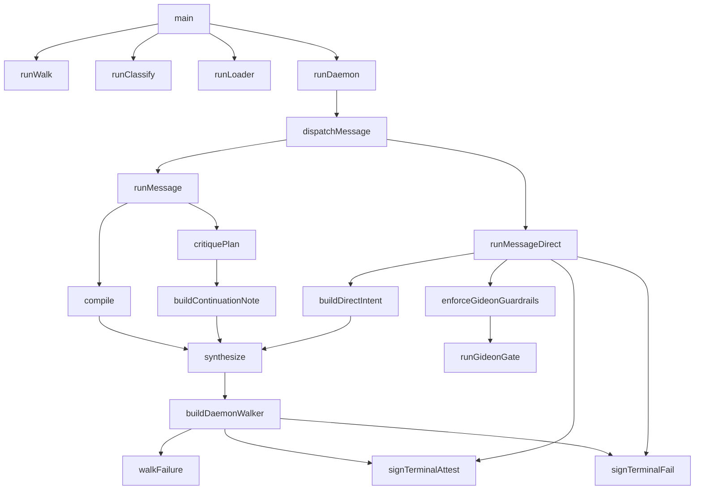
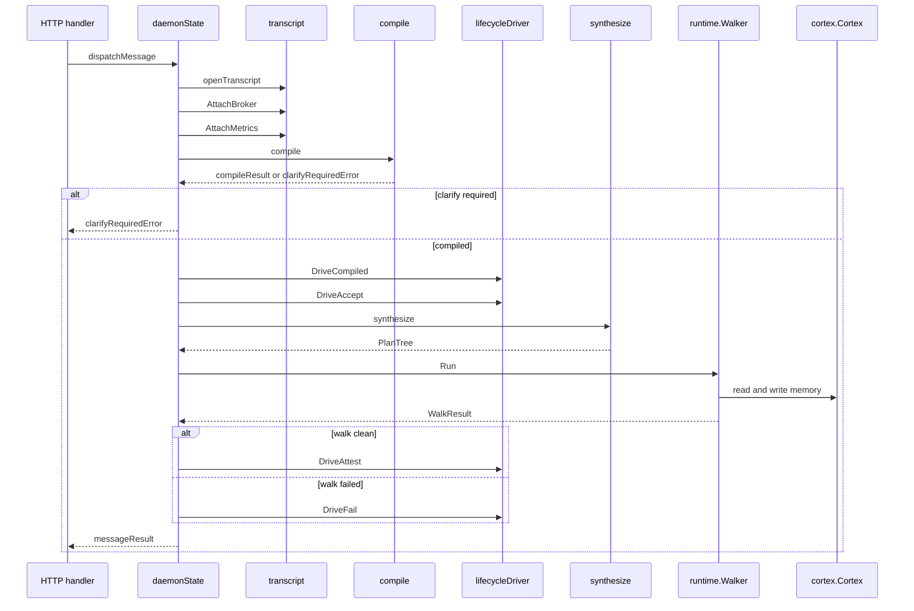

# Matrix Communication Layer - Execution Pipeline

## Overview

`mcl-execute` is the execution-side command surface for Matrix Communication Layer work. It routes CLI invocations into either the standard compile-to-walk pipeline or the Gideon direct-intent pipeline, then finishes each run with a terminal envelope, replayable transcript events, and optional cost telemetry.

The pipeline is designed around one long-lived daemon path and one standalone classification path. The daemon reuses shared Cortex, registry, and transport state across messages, while the direct Gideon path bypasses NL-to-IR compilation and builds a signed `Intent` directly from typed request data before synthesis and execution.

## Execution Flow

## Command Entry Point

*`executor/cmd/mcl-execute/main.go`*

`main.go` is the binary router. It dispatches `walk`, `classify`, `loader`, and `daemon`, falls back to `usage()` for help aliases, and exits through `fatalf()` on unknown subcommands.

### Command Routing

| Function | Behavior |
| --- | --- |
| `main` | Parses `os.Args[1]` and dispatches to the matching subcommand handler. |
| `usage` | Prints the subcommand summary, including the daemon description. |
| `fatalf` | Writes a formatted error to stderr and exits with status 1. |

### Subcommand Behavior

- `walk` runs the full compile, synthesis, walk, and attestation pipeline.
- `classify` runs the materiality classifier over two intent and plan pairs.
- `loader` smoke-checks the skill loader.
- `daemon` starts the long-running HTTP and SSE server described in the usage text.

## Standard Daemon Pipeline

*`executor/cmd/mcl-execute/daemon_pipeline.go`*

The standard daemon path accepts a `messageRequest`, compiles it into an `Intent`, synthesizes a `PlanTree`, executes the plan, and signs either `intent.attest` or `intent.fail`. It also preserves a deterministic `Answer` body from executed node output, so the user sees the real run result instead of a reconstructed summary.

### Message Request and Result Shapes

#### `messageRequest`

| Property | Type | Description |
| --- | --- | --- |
| `Prose` | `string` | Natural-language request text. |
| `Verb` | `string` | Optional verb override. |
| `SkillURI` | `string` | Skill URI; the daemon fills a default when empty. |
| `IntentID` | `string` | Optional caller-supplied intent identifier. |
| `SlotValues` | `map[string]string` | Pre-filled clarify answers. |
| `Anchor` | `bool` | Requests chain anchoring. |
| `GoalIDField` | `string` | Optional goal identifier used for telemetry rollup. |
| `ConversationID` | `string` | Conversation thread identifier for chat narration. |
| `UserName` | `string` | Human-friendly display name forwarded by the client. |

**Method**

| Method | Description |
| --- | --- |
| `GoalID` | Returns `GoalIDField`. |

#### `messageResult`

| Property | Type | Description |
| --- | --- | --- |
| `IntentID` | `string` | Final intent identifier. |
| `IntentHash` | `string` | Content hash of the compiled intent. |
| `Status` | `string` | `completed` or `failed`. |
| `LifecyclePath` | `string` | Lifecycle summary returned by the driver. |
| `PreReplayRoot` | `string` | Cortex root before the walk. |
| `PostReplayRoot` | `string` | Cortex root after the walk. |
| `WalkErrors` | `int` | Count of walk-time errors. |
| `NodeCount` | `int` | Executed plan node count. |
| `EventCount` | `int` | Executed plan event count. |
| `DurationMS` | `int64` | End-to-end runtime in milliseconds. |
| `Error` | `string` | Failure detail for terminal failures. |
| `Answer` | `string` | Deterministic output assembled from executed node results. |

#### `clarifyRequiredError`

| Property | Type | Description |
| --- | --- | --- |
| `IntentID` | `string` | Intent that still needs clarification. |
| `Questions` | `[]clarifyQuestionDTO` | Structured clarify prompts returned to the caller. |
| `Round` | `int` | Clarify round that produced the blocking questions. |

**Method**

| Method | Description |
| --- | --- |
| `Error` | Formats the clarify-required message for the caller. |

#### `clarifyQuestionDTO`

| Property | Type | Description |
| --- | --- | --- |
| `SlotName` | `string` | Slot that needs an answer. |
| `TypeName` | `string` | Expected type name. |
| `Required` | `bool` | Indicates whether the slot blocks execution. |
| `Prompt` | `string` | Human-readable question text. |

### Pipeline Phases

| Phase | Behavior |
| --- | --- |
| Message initialization | Validates `Prose`, assigns a default `SkillURI` when needed, and derives a deterministic `IntentID` when one is missing. |
| Transcript setup | Opens the per-intent transcript, binds the `IntentID`, and attaches the broker and metrics sinks before the first event. |
| Skill loading | Loads the selected skill from `runtime.NewSkillLoader(d.skillsRoot)`. |
| Envelope and lifecycle setup | Creates the intent-scoped envelope stream and lifecycle driver. |
| Compile | Calls `compile` with non-interactive clarify handling and optional gateway routing. |
| Lifecycle transitions | Drives `DriveCompiled` and `DriveAccept` after a successful compile. |
| Synthesis | Calls `synthesize` to produce a `PlanTree`. |
| Plan gating | Runs `enforcePaxeerSpend` before execution. |
| Walker build | Calls `buildDaemonWalker`, which wires the step handler, gate handler, and optional sub-dispatch. |
| Walk | Executes the plan with `walker.Run`. |
| Terminal decision | Uses `walkFailure`, completeness critique, and `signTerminalAttest` or `signTerminalFail` to close the lifecycle. |

### Major Flow

### Core Functions

| Function | Behavior |
| --- | --- |
| `collectPlanAnswer` | Joins non-empty `ResultText` values from the executed plan into the deterministic answer body. |
| `walkFailure` | Classifies hard walk errors, in-band tool failures, and step decode failures. |
| `runMessage` | Executes the full standard pipeline and always signs a terminal envelope on completion. |
| `buildDaemonWalker` | Builds the runtime walker with the correct step handler, gate handler, registry, Cortex, and optional sub-dispatch. |
| `makeFailedResult` | Builds a terminal `messageResult` for non-fatal failures. |
| `friendlyFailLine` | Maps terminal reason codes to user-facing failure text. |
| `countWalkErrors` | Counts error-bearing walk results, including fallback counting from `Errors`. |
| `dtoFromQuestions` | Converts interpreter clarify questions into wire DTOs. |

### Shared Infrastructure Behavior

#### Transcript Journal

The transcript is the authoritative per-intent event log. `runMessage` stamps the `IntentID` before broker attachment so downstream event filters keep the full stream visible for the active intent. `openTranscript`, `AttachBroker`, `AttachMetrics`, and `Event` create the event spine used by the daemon, the SSE mirror, and the replay trail.

#### Shared SSE Broker

The broker is attached to the transcript so live clients receive every event emitted during the run. The code path is explicitly built around a shared broker tap rather than one-off per-call logging, which keeps the run observable while the daemon stays alive across many requests.

#### Metrics and Cost Telemetry

The daemon threads a per-intent cost accumulator through gateway-routed LLM calls and flushes metrics at the end of the run. `newIntentCostAccumulator`, `EmitTerminal`, and `Flush` turn per-call spend and per-route timing into transcript-visible summaries without re-walking the transcript.

#### Gate Broker

When a gate broker is wired, `buildDaemonWalker` and the Gideon guardrail path use `newHTTPGateHandler` so human approvals are handled through the broker-backed gate flow. When no broker is present, the daemon falls back to an approve-only stdin gate handler in the standard path and fail-closed behavior in the Gideon chain-state-loss path.

## Compile Stage

*`executor/cmd/mcl-execute/compile.go`*

`compile.go` is the NL-to-IR stage used by the standard daemon path. It turns prose into `ir.Intent`, grounded through Cortex, and supports clarify loops, low-confidence escalation, and compile caching.

### Compile Options and Result

#### `compileOpts`

| Property | Type | Description |
| --- | --- | --- |
| `Skill` | `*runtime.LoadedSkill` | Loaded skill used for interpretation. |
| `Prose` | `string` | User request text. |
| `Verb` | `string` | Requested verb. |
| `Grammar` | `string` | Grammar name used by the interpreter. |
| `Actor` | `string` | `matrix://user/<did>` identity for the compiled intent. |
| `Agent` | `string` | `matrix://agent/<did>` identity for the executing agent. |
| `IntentID` | `string` | Intent identifier used for deterministic replay. |
| `Model` | `string` | Compiler model identifier. |
| `BaseURL` | `string` | Optional override for the LLM endpoint host. |
| `Seed` | `int64` | Random seed used for the compile call. |
| `SlotValues` | `map[string]string` | Clarify answers and prefilled slot values. |
| `Interactive` | `bool` | Enables the stdin clarification loop. |
| `Reader` | `io.Reader` | Input source for clarify prompts. |
| `Writer` | `io.Writer` | Output sink for clarify prompts. |
| `MaxClarify` | `int` | Maximum clarify rounds. |
| `DisableCache` | `bool` | Skips compile cache lookup and write. |
| `GatewayURL` | `string` | Gateway routing URL for compiler calls. |
| `ActorDID` | `string` | Actor DID stamped on gateway-routed calls. |
| `GoalID` | `string` | Goal identifier stamped on gateway-routed calls. |
| `CostHook` | `func(http.Header)` | Response-header hook for cost telemetry. |
| `EscalationModel` | `string` | Stronger model used for one-step escalation. |
| `ConfidenceThreshold` | `float64` | Floor below which escalation can fire. |
| `ForgeMode` | `bool` | Switches the compiler registry to Forge posture. |

#### `compileResult`

| Property | Type | Description |
| --- | --- | --- |
| `Intent` | `*ir.Intent` | Typed intent built by the compiler. |
| `IntentJSON` | `[]byte` | Canonical JSON form of the intent. |
| `IntentHash` | `string` | Content hash of the intent. |
| `FrameJSON` | `string` | Raw frame JSON returned by the interpreter. |
| `Slots` | `map[string]*interpreter.Slot` | Resolved slots from the interpreter. |
| `Unknowns` | `[]*interpreter.Unknown` | Remaining unknowns. |
| `ClarifyQuestions` | `[]*interpreter.ClarifyQuestion` | Clarify prompts for the caller. |
| `MatchedCondition` | `string` | Interpreter match condition. |
| `LatencyMs` | `int64` | Total compile latency across rounds. |
| `Rounds` | `int` | Number of compile rounds, including clarify re-runs. |

#### `errClarifyRequired`

| Property | Type | Description |
| --- | --- | --- |
| `Questions` | `[]*interpreter.ClarifyQuestion` | Blocking clarify questions that must be answered. |

**Method**

| Method | Description |
| --- | --- |
| `Error` | Returns the blocking clarify count in the error string. |

### Compile Behavior

| Stage | Behavior |
| --- | --- |
| Validation | Rejects nil skills and empty prose before invoking the LLM. |
| Defaults | Sets `Grammar` to `intent_frame@1`, `Seed` to `42`, clarify rounds to `3`, and the confidence threshold to `0.75` when they are unset. |
| Deterministic intent ID | Calls `synthIntentID` when `IntentID` is empty. |
| LLM configuration | Chooses `llm.ForgeCompilerModel()` or `llm.DefaultCompilerModel()`, applies `Model` and `BaseURL`, and appends `/v1/chat/completions` to the endpoint. |
| Gateway routing | Fills `GatewayURL`, `ActorDID`, `IntentID`, `GoalID`, `SlotLabel`, and `OnResponseHeaders` when gateway routing is enabled. |
| Cortex bridge | Uses `bridge.New` with a default limit of `10` so interpreter resolve statements ground against live Cortex. |
| Snapshot hash | Calls `computeCortexSnapHash` to anchor the compile to the current Cortex root. |
| Cache key | Computes the compile-cache key from the skill canonical hash, prose, Cortex snapshot hash, verb, and model digest. |
| Cache bypass | Skips cache lookup when caching is disabled, Cortex is nil, slot values are already present, or the verb is empty. |
| Clarify loop | Re-runs the interpreter until no blocking unknowns remain or the clarify budget is exhausted. |
| Escalation | Re-invokes the compiler once with `EscalationModel` when the frame confidence is below threshold or the verb is invalid. |
| Intent assembly | Builds `ir.Intent`, populates `CompileMetadata`, and converts resolved `matrix://` slots into `Reference` entries. |
| Cache write | Stores only clean, fully resolved compiles. Partial results are not cached. |

### Helper Functions

| Function | Behavior |
| --- | --- |
| `compile` | Runs the full compile workflow and returns a typed result. |
| `blockingUnknowns` | Filters unknowns to `ir.SeverityBlocking`. |
| `promptClarifyAnswers` | Prompts for clarify answers and stores them by slot name. |
| `ternary` | Chooses the required or optional label for prompt output. |
| `buildIntent` | Converts an interpreter run result into a typed `ir.Intent`. |
| `compilerSeed` | Derives the deterministic compile seed from intent, actor, snapshot, skill, and model state. |
| `computeCortexSnapHash` | Returns the Cortex root as hex or 64 zeroes when Cortex is nil. |
| `synthIntentID` | Derives a deterministic 26-character ULID-shaped intent ID. |
| `stringField` | Extracts a string field from a generic JSON object. |
| `frameConfidence` | Reads the self-reported confidence from an `intent_frame@1` JSON blob. |
| `frameVerb` | Extracts the verb from the frame JSON or falls back to the caller verb. |
| `escalateReason` | Returns `invalid_verb` or `low_confidence` for the escalation audit trail. |

### Cache Strategy

The compile cache is keyed by the tuple built from `skill canonical hash`, `prose`, `cortex snapshot hash`, `verb`, and `model digest`. The code only looks up the cache when the run is cacheable, and it only writes after a clean compile with no remaining clarify questions.

- Lookup bypasses:- `DisableCache` is true
- Cortex is nil
- `SlotValues` is already populated
- `Verb` is empty
- Cache hit behavior:- Returns a freshly unmarshaled `*ir.Intent`
- Skips the LLM call
- Records cache-hit metrics
- Cache miss behavior:- Records cache-miss metrics
- Continues with a fresh compile
- Cache write behavior:- Stores canonical JSON, intent hash, model digest, verb, skill digest, and snapshot hash
- Does not write partial or unresolved results

### Confidence Policy

The compile floor is `0.75`, matching the `threshold.clarify=0.75` value in `MCL/core/confidence.mtx`. The parser defaults missing or malformed frame confidence to `1.0`, which prevents spurious escalation when a provider omits the field.

## Terminal Attestation

compile.go and daemon_gideon_pipeline.go both populate ir.Intent and ir.CompileMetadata from MCL/ir/intent.go. The compile and direct-build paths also depend on ir.ValidVerb, ir.StateProposed, and the closed D7 verb vocabulary, while the confidence floor aligns with MCL/core/confidence.mtx.

*`executor/cmd/mcl-execute/attest.go`*

`attest.go` builds the terminal envelope payload, collects cited Cortex URIs, and closes the lifecycle with either success or failure attestation. It also ships structured evidence bytes for replay and downstream consumers.

### Attestation Evidence

#### `attestEvidence`

| Property | Type | Description |
| --- | --- | --- |
| `IntentID` | `string` | Intent identifier. |
| `IntentHash` | `string` | Intent hash. |
| `PlanID` | `string` | Plan identifier. |
| `PlanHash` | `string` | Plan hash. |
| `NodeIDs` | `[]string` | Executed node identifiers. |
| `EventURIs` | `[]string` | Cortex event URIs written by the walk. |
| `ToolDurations` | `map[string]int64` | Per-tool durations. |
| `IsErrors` | `map[string]bool` | Per-tool error flags. |
| `StepCount` | `int` | Number of executed steps. |
| `GateCount` | `int` | Number of gate decisions. |
| `SubCount` | `int` | Number of sub-results. |
| `CorrectionLog` | `[]runtime.CorrectionOutcome` | Correction outcomes from the walk. |
| `OverallRoot` | `string` | Cortex overall root in hex form. |
| `LifecyclePath` | `string` | Lifecycle summary captured from the driver. |

### Terminal Functions

| Function | Behavior |
| --- | --- |
| `citedURIs` | Merges walk event URIs with compile-time references and deduplicates them. |
| `buildAttestEvidence` | Serializes the terminal walk state into `EvidenceJSON`. |
| `signTerminalAttest` | Signs `intent.attest`, drives the lifecycle to completed, and runs `cortex.Attest` with success outcome. |
| `signTerminalFail` | Signs `intent.fail`, drives the lifecycle to failed, and runs `cortex.Attest` with failure outcome. |
| `safeIntentID` | Returns the intent ID or an empty string for nil inputs. |
| `safeIntentHash` | Returns the intent hash or an empty string for nil inputs. |
| `safePlanID` | Returns the plan ID or an empty string for nil inputs. |
| `safePlanHash` | Returns the plan hash or an empty string for nil inputs. |
| `toMemoryURIs` | Converts string URIs into `[]memory.URI` while dropping empty entries. |
| `hexFromRoot` | Encodes the Cortex root bytes as lowercase hex. |

### Attestation Behavior

- `citedURIs` preserves first-seen order while deduplicating URIs.
- `buildAttestEvidence` reads counts directly from the walk result and lifecyle summary.
- `signTerminalAttest` and `signTerminalFail` both call the lifecycle driver first, then `cortex.Attest` when there are cited URIs.
- `cortex.Attest` failures are surfaced in the transcript as non-fatal telemetry events after the terminal envelope has already been signed.

## Completeness Critic

*`executor/cmd/mcl-execute/critique.go`*

`critique.go` is the post-walk auditor used by the daemon to detect partial but clean runs. It compares the executed transcript against the user request, then produces a bounded replan loop when deliverables are still missing.

### Critic Verdict

#### `criticVerdict`

| Property | Type | Description |
| --- | --- | --- |
| `Complete` | `bool` | Indicates whether every requested deliverable was produced. |
| `Missing` | `[]string` | Remaining deliverables phrased as concrete work items. |
| `Rationale` | `string` | Short audit explanation recorded in the transcript. |

### Critic Functions

| Function | Behavior |
| --- | --- |
| `buildExecutionDigest` | Renders the executed plan into a compact dispatch-ordered digest. |
| `compactArgs` | Sorts tool-call arguments and renders them as a stable compact string. |
| `oneLine` | Collapses multi-line output into a single readable line. |
| `critiquePlan` | Calls the auditor model, parses the JSON verdict, and normalizes contradictions. |
| `buildContinuationNote` | Writes the replan directive that excludes already-completed work. |

### Critic Behavior

| Stage | Behavior |
| --- | --- |
| Digest building | Includes `NodeToolCall`, `NodeStep`, and `NodeGate` entries with truncated output. |
| Model setup | Uses `llm.DefaultPlannerModel()` and disables grammar mode for free-form JSON. |
| Gateway routing | Routes through the planner slot so cost telemetry remains consistent with synthesis. |
| Parsing | Extracts the first JSON object from the model output and unmarshals it into `criticVerdict`. |
| Normalization | Drops blank missing entries and forces incomplete when `Complete` and `Missing` conflict. |
| Error policy | Fails open on critic decode errors so a critic hiccup never converts a clean walk into a failure. |
| Replan note | Tells the synthesizer to continue only the missing work and reuse earlier results by node output. |

### Replan Loop

When the critic reports missing deliverables, the daemon:

1. Rewinds the lifecycle with `DriveCorrectMaterial`.
2. Calls `synthesize` again with a continuation note.
3. Re-runs the plan-time spend gate.
4. Builds a fresh walker and executes the continuation plan.
5. Appends the new plan output to the final answer body.

If the replan budget is exhausted, the daemon signs a terminal failure using `x:incomplete_plan`.

## Gideon Direct Pipeline

*`executor/cmd/mcl-execute/daemon_gideon_pipeline.go`*

The Gideon path bypasses NL-to-IR compilation entirely. It converts typed request fields into a signed `Intent`, then runs the same synthesis, lifecycle, walk, and attestation machinery used by the standard daemon path.

### Direct Pipeline Functions

| Function | Behavior |
| --- | --- |
| `dispatchMessage` | Routes to `runMessageDirect` when Gideon mode is active and to `runMessage` otherwise. |
| `runMessageDirect` | Runs the compiler-bypass pipeline end to end. |
| `buildDirectIntent` | Builds a deterministic `Intent` directly from the request payload. |
| `skillDigestOrEmpty` | Resolves the skill hash used by direct-intent compile metadata. |
| `enforceGideonGuardrails` | Evaluates every tool call against the Gideon policy before execution. |
| `runGideonGate` | Opens a mandatory approval gate for chain-state-loss risks. |
| `collectToolCalls` | Collects every `NodeToolCall` in depth-first order. |
| `toolNameFromRef` | Extracts the bare tool name from a version-pinned tool URI. |

### Direct Intent Assembly

`buildDirectIntent` uses request data as follows:

- `Prose` comes from the request body.
- `Verb` is validated with `ir.ValidVerb`; invalid verbs fall back to `ir.VerbMonitor`.
- `SlotValues` become `ir.SlotEntry` objects in the frame.
- Values that already start with `matrix://` are copied into the slot URI field.
- `CompileMetadata` is still populated so the intent stays replay-verifiable.
- `Grammar` is set to `intent_direct@1`.
- `SignedBy` uses the executor user URI.
- `GoalID` is carried through unchanged from the request.

### Guardrail Behavior

| Stage | Behavior |
| --- | --- |
| Tool scan | Collects all tool-call nodes before execution. |
| Policy evaluation | Calls `d.gideonPolicy.Evaluate` with tool name, host, command, service, and prose. |
| Allow | Continues when the policy says `OpsAllow`. |
| Deny | Returns the first blocking evaluation when the policy says `OpsDeny`. |
| Gate | Forces a human gate when the policy says `OpsGate`. |
| Fail closed | Denies when no gate broker is wired, because a chain-state-loss action must not auto-approve. |

### Direct Pipeline Behavior

- `runMessageDirect` validates that prose and skill URI are present.
- It opens the transcript and attaches broker and metrics sinks before recording `message.start`.
- It loads the skill locally, creates the envelope stream, and instantiates the lifecycle driver.
- It computes the Cortex snapshot hash before building the direct intent.
- It drives `DriveCompiled`, `DriveAccept`, and then the planner synthesis path.
- It runs guardrail evaluation after synthesis and before execution.
- It signs a terminal failure on guardrail denial or walk failure, and signs a terminal attest on success.

## Classification Command

*`executor/cmd/mcl-execute/classify_cmd.go`*

`classify_cmd.go` is the standalone materiality classifier. It reads original and candidate intent and plan files, runs `materiality.Classify`, prints JSON to stdout, and uses exit code `2` to signal that the change is material and the caller should rewind.

### Command Inputs

| Flag | Behavior |
| --- | --- |
| `orig-intent` | Path to the original intent JSON. |
| `orig-plan` | Path to the original plan JSON. |
| `new-intent` | Path to the candidate intent JSON. |
| `new-plan` | Path to the candidate plan JSON. |
| `orig-anchor` | Anchor flag for the original intent accept state. |
| `new-anchor` | Anchor flag for the candidate intent accept state. |
| `pretty` | Pretty-prints the classification JSON; enabled by default. |

### Classification Functions

| Function | Behavior |
| --- | --- |
| `runClassify` | Parses flags, loads inputs, classifies the change, prints JSON, and exits with code `2` when material. |
| `loadIntent` | Reads and unmarshals an `ir.Intent` from disk. |
| `loadPlan` | Reads and unmarshals an `ir.PlanTree` from disk. |

### Classification Output

- The output object contains `material` and `reasons`.
- When the classification is material, the process exits non-zero so automation can trigger a re-accept flow.
- The command keeps the output structure stable enough for CI and operator tooling to consume directly.

## Identity and Envelope Persistence

*`executor/cmd/mcl-execute/identity.go`*

`identity.go` owns the executor identity, envelope signing, and per-intent journal persistence. It is the source of the stable DID, the signing keypair, and the signed envelope chain used by the execution pipeline.

### Identity and Envelope Types

#### `actorIdentity`

| Property | Type | Description |
| --- | --- | --- |
| `DID` | `string` | Matrix DID for the executor. |
| `Public` | `ed25519.PublicKey` | Public key used for verification. |
| `Private` | `ed25519.PrivateKey` | Private key used for signing. |
| `UserURI` | `string` | `matrix://user/<did>` URI. |
| `AgentURI` | `string` | `matrix://agent/<did>` URI. |

#### `staticKeyResolver`

| Property | Type | Description |
| --- | --- | --- |
| `principals` | `map[string]ed25519.PublicKey` | In-memory principal map used for signature verification. |

#### `envelopeStream`

| Property | Type | Description |
| --- | --- | --- |
| `dir` | `string` | Intent-scoped journal directory. |
| `intentID` | `string` | Intent identifier used to build the journal path. |
| `actor` | `*actorIdentity` | Signing actor for the stream. |
| `resolver` | `*staticKeyResolver` | Verification key resolver. |
| `t` | `*transcript` | Transcript sink used for envelope events. |
| `seq` | `uint64` | Per-intent envelope sequence counter. |
| `chain` | `[]*envelope.Envelope` | In-memory chain of emitted envelopes. |

### Identity Functions

| Function | Behavior |
| --- | --- |
| `loadOrCreateIdentity` | Loads an ed25519 seed from disk or creates and persists one when the file is missing. |
| `trimNL` | Trims trailing newline and whitespace from stored key material. |
| `newEnvelopeStream` | Creates the per-intent signing and persistence stream. |
| `newULIDLike` | Generates a ULID-shaped envelope identifier. |
| `sanitiseKind` | Replaces dots in envelope kinds with dashes for the journal filename. |
| `prettyJSON` | Pretty-prints envelope JSON when possible. |
| `sha256Hex` | Returns the lowercase hex SHA-256 digest of a string. |

### Envelope Stream Behavior

| Stage | Behavior |
| --- | --- |
| Identity load | Reads a persistent seed when present or creates a new one when the key file is absent. |
| DID construction | Derives the DID from the label and the public key prefix. |
| Stream setup | Creates the intent-scoped journal directory and seeds the resolver with the executor user URI. |
| Verification | Signs with the actor private key and verifies with the fixed resolver before persistence. |
| Persistence | Writes pretty JSON to the journal directory and appends the envelope to the in-memory chain. |
| Transcript event | Emits `envelope.signed` with the envelope kind, ID, hash, and path. |

### Envelope Stream Methods

| Method | Behavior |
| --- | --- |
| `SignAndPersist` | Signs, verifies, persists, and transcript-emits one envelope. |
| `LastID` | Returns the most recent envelope ID in the chain. |
| `Chain` | Returns the in-memory envelope chain. |
| `IntentURI` | Returns the `matrix://intent/<id>` URI for the current stream. |
| `Resolver` | Exposes the verifier key set. |
| `AcceptCorrespondent` | Adds another principal to the verification set. |

## Confidence Escalation Tests

*`executor/cmd/mcl-execute/compile_escalate_test.go`*

The escalation tests pin the behavior that protects the compile path from noisy low-confidence triggers.

| Test | Behavior Locked |
| --- | --- |
| `TestFrameConfidence` | Empty, absent, and unparseable confidence values default to `1.0`; explicit values are returned verbatim. |
| `TestFrameVerb` | Parsed verbs win when present; invalid or missing verbs fall back to the caller verb. |
| `TestEscalateReason` | Valid verbs map to `low_confidence`; invalid and empty verbs map to `invalid_verb`. |
| `TestSynthModFallback` | `plannerModel` wins over `executorModel`, and both can fall back to empty. |

The tests also prove that the escalation parser treats malformed input as safe by default, which keeps the compiler from escalating on missing confidence fields alone.

## Key Files Reference

| File | Role |
| --- | --- |
| `executor/cmd/mcl-execute/main.go` | CLI entrypoint and subcommand router. |
| `executor/cmd/mcl-execute/daemon_pipeline.go` | Standard compile, synthesize, walk, critic, and terminal-signing pipeline. |
| `executor/cmd/mcl-execute/daemon_gideon_pipeline.go` | Compiler-bypass Gideon pipeline and guardrails. |
| `executor/cmd/mcl-execute/compile.go` | NL-to-IR compiler, clarify loop, cache, and escalation logic. |
| `executor/cmd/mcl-execute/attest.go` | Terminal envelope evidence and attestation helpers. |
| `executor/cmd/mcl-execute/critique.go` | Completeness critic and bounded replan support. |
| `executor/cmd/mcl-execute/classify_cmd.go` | Materiality classification command. |
| `executor/cmd/mcl-execute/identity.go` | Executor identity, envelope signing, and journal persistence. |
| `executor/cmd/mcl-execute/compile_escalate_test.go` | Regression tests for escalation parsing and model fallback. |
| `MCL/core/confidence.mtx` | Shared confidence thresholds used by the compile floor. |
| `MCL/ir/intent.go` | Shared intent IR and verb vocabulary used by compile and direct intent construction. |
