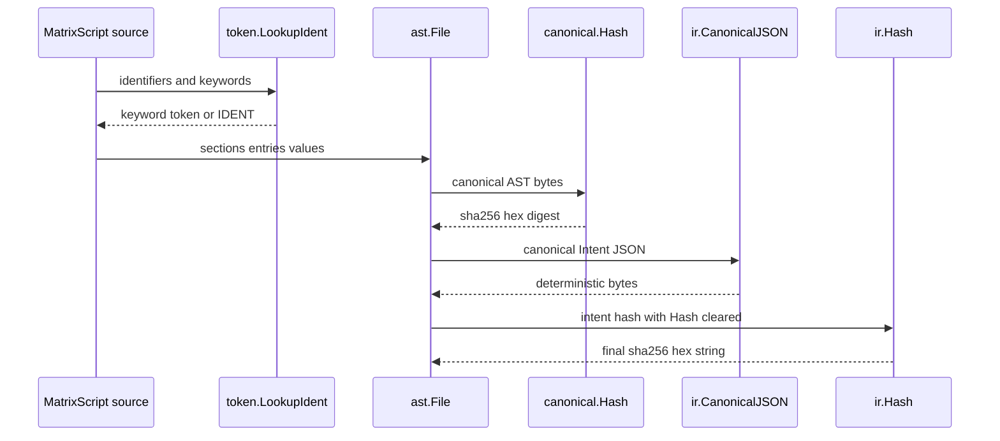

# Matrix Communication Layer - MCL syntax

## Overview

Matrix Communication Layer, or MCL, is the typed heart of the Matrix compiler path. The repository README frames it as the place where natural language becomes an `intent.draft`, the compiler turns that draft into typed `Intent IR`, the user reviews and signs the result, and execution ends in `intent.attest`. The key constraint is that the protocol never leaves the typed surface: prose is display-only, while the structured artifacts carry the meaning that gets signed and executed.

This section documents the language core that makes that flow possible: the MatrixScript grammar, the lexer token model, the AST shape, the canonical hashing rules, and the Go IR types that represent the compiled intent. It also covers the core `.mtx` modules that define the frame schema, confidence scoring, and compiler pipeline declarations loaded by `mclc` at startup.

## Source Files in Scope

| Path | Responsibility |
| --- | --- |
| `MCL/README.md` | Introduces MCL as the protocol heart of Matrix, describes the `intent.draft` to `intent.attest` lifecycle, and states that every input produces a typed artifact. |
| `MCL/core/confidence.mtx` | Declares confidence weights and thresholds used when the compiler aggregates slot confidence into an overall score. |
| `MCL/core/frame.mtx` | Declares the typed `Frame` schema, its slot validation rules, and the grammar identifier used for compiler output. |
| `MCL/core/pipeline.mtx` | Declares the fixed compiler stage sequence, stage metadata, and pipeline-level error and timeout policy. |
| `MCL/mtx/ast/ast.go` | Defines the typed AST for MatrixScript files, including sections, entries, values, conditions, and type references. |
| `MCL/mtx/canonical/canonical.go` | Computes deterministic AST bytes and sha256 digests for MatrixScript files, excluding comments and `§HASH`. |
| `MCL/mtx/canonical/canonical_test.go` | Verifies canonical hashing behavior, including determinism, comment handling, block serialization, and hash stability. |
| `MCL/mtx/token/token.go` | [REDACTED] |
| `MCL/mtx/grammar.bnf` | Defines the formal MatrixScript grammar and the syntax rules mirrored by the lexer and AST. |
| `MCL/ir/intent.go` | Defines the compiled Intent IR, including `Intent`, `Frame`, slots, constraints, predicates, unknowns, references, budget, and compile metadata. |
| `MCL/ir/intent_test.go` | Verifies verb validation, JSON round-trip behavior, canonical JSON determinism, hash behavior, and compile metadata serialization. |
| `MCL/ir/encode.go` | Implements canonical JSON encoding and sha256 hashing for `Intent` and `PlanTree` values. |
| `docs/MCL-docs/index.md` | Developer documentation landing page for MCL, describing the language, compiler pipeline, IR, and related references. |
| `docs/MCL-docs/compiler-pipeline.md` | Documentation for the compiler stages, confidence thresholds, entity resolution, clarification, and error handling. |
| `docs/MCL-docs/intent-ir.md` | Documentation for the Go IR types and their canonical JSON representation. |
| `docs/.web/src/content/MCL-docs/index.md` | Web content copy of the MCL documentation landing page. |
| `docs/.web/src/content/MCL-docs/compiler-pipeline.md` | Web content copy of the compiler pipeline documentation. |

## Syntax and Compiler Surface

MCL syntax is line-oriented, section-based, and strongly typed. A MatrixScript file is made from `§SECTION` headers, key-value pairs, typed slot declarations, blocks such as `on`, `prompt`, `unknown`, and `clarify`, and a small set of value forms such as strings, booleans, numbers, URIs, space-separated identifiers, slot expressions, and option lists.

The core grammar and token model agree on a few important rules:

- Section headers are uppercase names prefixed by `§`.
- Indentation is significant and uses exactly two spaces for nested modifiers.
- `slot` declarations carry a base type plus modifiers such as `required`, `optional`, `default`, `hint`, and `max`.
- `on` blocks encode conditional branches over verb, confidence, slot values, or `unknown`.
- `resolve` statements point to `cortex.find`, `cortex.resolve`, or `cortex.context`.
- Comments are preserved in the AST for display and diff purposes, but removed from canonical hashing.
- The `§HASH` section is accepted for round-trip parsing, but excluded from canonical digests.

### Syntax Flow From Source to Signed Intent

## MatrixScript Grammar

*`MCL/mtx/grammar.bnf`*

The grammar is the canonical reference for the syntax accepted by the MCL lexer and parser. It defines the top-level file shape, section headers, line-based entries, typed declarations, condition trees, prompt blocks, entity-resolution statements, and failure-mode declarations.

### Core productions

| Production | Meaning |
| --- | --- |
| `file` | A sequence of comments, blank lines, and sections. |
| `section_header` | A `§NAME` line that starts a section. |
| `section_entry` | A comment, blank line, slot declaration, `on` block, failure entry, key-value pair, reference entry, or `none`. |
| `slot_decl` | A typed slot declaration with indented modifiers. |
| `on_block` | A conditional block with a condition and nested entries. |
| `prompt_block` | A block that captures role-tagged prompt text. |
| `resolve_stmt` | A typed resolution instruction that calls a cortex function. |
| `unknown_block` | A block that describes a blocking or preferred gap. |
| `clarify_block` | A block that requests a structured clarification. |
| `fail_entry` | A named failure mode with action, suggest, and reason modifiers. |
| `uri_lit` | A versioned `matrix://` URI literal. |
| `slot_expr` | A slot reference such as `slot.target.prose`. |

### Syntax rules that matter most

- `comment` starts with `#`.
- `blank_line` is a newline.
- `INDENT` is exactly two spaces.
- `kv_pair` uses `key=value` with dotted keys supported.
- `space_list` is one or more identifiers separated by spaces.
- `enum` types are written as a closed variant set.
- `on` conditions support verb, confidence comparison, slot-value comparison, and `unknown`.
- `prompt` blocks contain `system`, `user`, and `assistant` role lines.
- `resolve` statements require a slot target and a cortex function call.
- `unknown` and `clarify` blocks support structured modifiers such as severity, reason, type, required, options, and default.
- `fail_entry` uses named actions and reasons rather than free text.

## Token System

The grammar treats the §HASH section as read-only at publish time. The parser can round-trip it, but canonical hashing excludes it and the tests verify that a manually written digest does not control the computed AST hash.

*`MCL/mtx/token/token.go`*

The token package defines the lexer output and the string forms used for debugging and parser-facing diagnostics. It also contains the keyword map that converts scanned identifiers into reserved tokens.

### Exported types and behavior

| Type or function | Responsibility |
| --- | --- |
| `Type` | Enumerates token kinds for literals, punctuation, blocks, keywords, determinism flags, and D7 verbs. |
| `Pos` | Records byte offset, line, and column as 1-based source coordinates, with `Offset` retained as 0-based. |
| `Token` | [REDACTED] |
| `LookupIdent` | Converts an identifier into a keyword token when the identifier matches the keyword map; otherwise it returns `IDENT`. |
| `IsKeyword` | Reports whether a token type falls inside the keyword range. |

### Position and token formatting

| Type | Properties | Methods |
| --- | --- | --- |
| `Pos` | `Offset int`, `Line int`, `Col int` | `String` |
| `Token` | [REDACTED] | `String` |

`Pos.String` formats source coordinates as `Line:Col`. `Token.String` formats a token as `Type("literal")@Line:Col`. `Type.String` returns readable names for literals and punctuation, and renders keyword tokens as `KW(name)`.

### Keyword groups

The keyword map includes the block and modifier words used by the grammar: `on`, `end`, `prompt`, `resolve`, `unknown`, `clarify`, `slot`, `none`, `enum`, `required`, `optional`, the boolean literals, the condition prefixes, the prompt roles, severity words, failure actions and reasons, cortex function names, the D7 verb set, and the determinism-related words `seedable`, `best_effort`, `per_intent`, `per_session`, and `per_actor`.

`LBRACE` and `RBRACE` are defined in the token list for interpolation handling, but the token comment states that they are emitted by the parser, not the lexer.

## AST Model

*`MCL/mtx/ast/ast.go`*

The AST package gives MatrixScript a typed tree structure that mirrors the grammar. Every node carries a `token.Pos` so parser and validator errors can point back to the source line and column.

### Tree root and section structure

| Type | Properties | Methods | Notes |
| --- | --- | --- | --- |
| `File` | `Sections []*Section`, `Comments []*Comment` | `Pos` | Root node for a MatrixScript file. Top-level comments are preserved before the first section. |
| `Section` | `Name string`, `NamePos token.Pos`, `Entries []Entry` | `Pos` | Represents a `§NAME` section and its entries. |
| `Comment` | `Text string`, `TextPos token.Pos` | `Pos`, `entryNode` | Preserved for display and diff purposes, but excluded from canonical hashing. |
| `KVPair` | `Key []string`, `Value Value`, `KeyPos token.Pos` | `Pos`, `entryNode` | Dotted keys are split into path parts. |
| `SlotDecl` | `Name string`, `TypeRef TypeRef`, `Modifiers []*SlotModifier`, `SlotPos token.Pos` | `Pos`, `entryNode` | Represents `slot name: Type` and its indented modifiers. |
| `SlotModifier` | `Kind SlotModKind`, `Value Value`, `ModPos token.Pos` | `Pos` | Supports `required`, `optional`, `default`, `hint`, and `max`. |
| `OnBlock` | `Condition Condition`, `Entries []Entry`, `OnPos token.Pos` | `Pos`, `entryNode` | Encodes conditional execution branches. |

### Conditions and control blocks

| Type | Properties | Methods | Notes |
| --- | --- | --- | --- |
| `VerbCondition` | `Verb string`, `VerbPos token.Pos` | `Pos`, `conditionNode` | Encodes `verb=<name>`. |
| `ConfidenceCondition` | `Op string`, `Threshold string`, `CondPos token.Pos` | `Pos`, `conditionNode` | Encodes confidence comparisons such as `<` and `>=`. |
| `SlotValCondition` | `SlotName string`, `Value Value`, `CondPos token.Pos` | `Pos`, `conditionNode` | Encodes `slot.<name>=<value>`. |
| `UnknownCondition` | `CondPos token.Pos` | `Pos`, `conditionNode` | Encodes the `unknown` condition keyword. |
| `PromptBlock` | `Roles []*PromptRole`, `PromptPos token.Pos` | `Pos`, `entryNode` | Captures role-tagged prompt text. |
| `PromptRole` | `Role string`, `Text string`, `RolePos token.Pos` | `Pos` | Role values are `system`, `user`, and `assistant`. |
| `ResolveStmt` | `SlotName string`, `CortexFn string`, `Args []*CortexArg`, `ResolvePos token.Pos` | `Pos`, `entryNode` | Encodes a resolution instruction that calls a cortex function. |
| `CortexArg` | `Name string`, `Value Value`, `ArgPos token.Pos` | `Pos` | Represents a named argument inside a cortex call. |
| `UnknownBlock` | `SlotName string`, `Modifiers []*UnknownModifier`, `UnknownPos token.Pos` | `Pos`, `entryNode` | Encodes a structured gap description. |
| `UnknownModifier` | `Key string`, `Value Value`, `ModPos token.Pos` | `Pos` | Supports `severity`, `reason`, `default`, and `options`. |
| `ClarifyBlock` | `SlotName string`, `Modifiers []*ClarifyModifier`, `ClarifyPos token.Pos` | `Pos`, `entryNode` | Encodes a clarification request. |
| `ClarifyModifier` | `Key string`, `Value Value`, `ModPos token.Pos` | `Pos` | Supports `prompt`, `type`, `required`, `options`, and `default`. |
| `FailEntry` | `Name string`, `Modifiers []*FailModifier`, `NamePos token.Pos` | `Pos`, `entryNode` | Names a failure mode. |
| `FailModifier` | `Key string`, `Value string`, `ModPos token.Pos` | `Pos` | Supports `action`, `suggest`, and `reason`. |
| `RefEntry` | `URI string`, `URIPos token.Pos` | `Pos`, `entryNode` | Used for bare URI references in tool and sub-skill sections. |
| `NoneEntry` | `NonePos token.Pos` | `Pos`, `entryNode` | Encodes the `none` keyword line. |

### Values and type references

| Type | Properties | Methods | Notes |
| --- | --- | --- | --- |
| `StringValue` | `Text string`, `TextPos token.Pos` | `Pos`, `valueNode` | Quoted string literal with escapes processed. |
| `IntValue` | `Raw string`, `IntPos token.Pos` | `Pos`, `valueNode` | Integer literal stored as source text. |
| `FloatValue` | `Raw string`, `FloatPos token.Pos` | `Pos`, `valueNode` | Floating-point literal stored as source text. |
| `BoolValue` | `Val bool`, `BoolPos token.Pos` | `Pos`, `valueNode` | Boolean literal. |
| `IdentValue` | `Name string`, `IdentPos token.Pos` | `Pos`, `valueNode` | Bare identifier used as a value. |
| `URIValue` | `URI string`, `URIPos token.Pos` | `Pos`, `valueNode` | Matrix URI literal. |
| `SpaceListValue` | `Items []string`, `ListPos token.Pos` | `Pos`, `valueNode` | Space-separated list of identifiers. |
| `SlotExprValue` | `Parts []string`, `ExprPos token.Pos` | `Pos`, `valueNode` | Slot reference such as `slot.target.prose`. |
| `OptionListValue` | `Items []Value`, `ListPos token.Pos` | `Pos`, `valueNode` | Bracketed list of values. |
| `TypeRef` | `Name string`, `IsList bool`, `EnumSet []string`, `TypePos token.Pos` | `Pos` | Represents a type annotation on a slot. |

### AST interfaces and node families

The AST uses four marker interfaces: `Node`, `Entry`, `Condition`, and `Value`. `Entry` nodes can appear in section bodies, `Condition` nodes can appear in `on` headers, and `Value` nodes represent literal and expression payloads inside key-value pairs and modifiers.

`SlotModKind` enumerates the slot modifiers as `ModRequired`, `ModOptional`, `ModDefault`, `ModHint`, and `ModMax`.

## Canonical Encoding

*`MCL/mtx/canonical/canonical.go`*

This package produces the deterministic byte representation used for the MatrixScript AST hash. The hash is sha256 over those canonical bytes, and the comments in the package state that the result is the `mtx_digest` used in compiler seeding.

### Exported functions and their behavior

| Function | Responsibility |
| --- | --- |
| `Hash` | Computes the sha256 digest of the canonical AST bytes and returns the hex string. |
| `Bytes` | Returns the canonical byte representation before hashing. |

### Internal encoding chain

| Function | Responsibility |
| --- | --- |
| `appendFile` | Walks sections in file order and skips the `HASH` section. |
| `appendSection` | Writes the section header and all section entries. |
| `appendEntry` | Serializes each entry type in declaration order. |

The entry encoder preserves block structure and condition text, but excludes comments and blank lines from the canonical result. Quoted strings are re-escaped in a stable way, and map-like key order is normalized by construction in the higher-level IR encoder.

### Canonical rules captured in code

- `KVPair` keys are joined with `.`.
- `SlotDecl` writes `slot`, the name, a colon, the type reference, and any modifiers.
- `OnBlock` writes `on`, the condition, nested entries, and `end`.
- `PromptBlock` writes each role line as `role="text"`.
- `ResolveStmt` writes `resolve slot.<name> <- <cortex call>(args)`.
- `UnknownBlock` and `ClarifyBlock` write their block header, modifiers, and `end`.
- `FailEntry` writes the failure name and its indented modifiers.
- `RefEntry` writes the URI line directly.
- `NoneEntry` writes `none`.
- `appendQuotedString` escapes quotes, backslashes, newline, and tab.

### Validation coverage

`MCL/mtx/canonical/canonical_test.go` proves the following behaviors:

- identical source parses to identical hashes
- comments do not affect the digest
- blank lines do not affect the digest
- the `HASH` section does not affect the digest
- different content changes the digest
- prompt blocks serialize with role text preserved
- resolve statements serialize with the expected cortex call form

## Intent IR

*`MCL/ir/intent.go`*

The IR package defines the typed artifact that the compiler produces and the executor consumes. The package comment is explicit: the user signs the `Intent`, downstream systems operate on the typed IR, and raw prose is display-only.

### Intent and supporting structures

| Type | Properties | Notes |
| --- | --- | --- |
| `Intent` | `ID string`, `Version string`, `Parent string`, `Actor string`, `Agent string`, `Prose string`, `Frame Frame`, `Unknowns []Unknown`, `References []Reference`, `State string`, `Confidence float64`, `Budget *Budget`, `Deadline string`, `CreatedAt string`, `ExpiresAt string`, `GoalID string`, `SignedBy string`, `Hash string`, `CompileMetadata *CompileMetadata` | Central typed artifact for Matrix. |
| `Frame` | `Verb string`, `Objects []SlotEntry`, `Constraints []Constraint`, `SuccessCriteria []Predicate`, `Preferences []Preference` | Typed source-of-truth surface of the intent. |
| `SlotEntry` | `Name string`, `Value string`, `URI string`, `Type string` | Named referent inside `Frame.Objects`. |
| `Constraint` | `Type string`, `Hard bool`, `Max *AssetAmount`, `By string`, `Allow []string`, `Deny []string`, `Metric string`, `Min float64`, `Rule string`, `Policy string`, `Schema string`, `Data string` | Typed predicate that must hold during execution. |
| `Predicate` | `Type string`, `Artifact string`, `By string`, `URL string`, `Check string`, `Source string`, `Topic string`, `Schema string`, `Data string` | Checkable completion criterion. |
| `Preference` | `Rank string`, `Prefer []string` | Soft tie-breaker that does not fail the intent if violated. |
| `Unknown` | `ID string`, `Field string`, `Type string`, `Severity string`, `Rationale string`, `Default string`, `Options []string`, `SourceHint string` | Typed gap that blocks or delays execution. |
| `Reference` | `URI string`, `Type string`, `Role string`, `Summary string` | Grounding reference that the agent must respect. |
| `Budget` | `MaxCost *AssetAmount`, `MaxTime string`, `MaxCalls int`, `MaxAgents int` | Optional resource cap. |
| `AssetAmount` | `Asset string`, `Amount float64` | Typed amount of an asset. |
| `CompileMetadata` | `Seed string`, `MtxDigest string`, `ModelDigest string`, `ModelVersion string`, `Temperature float64`, `Grammar string`, `SkillID string`, `SkillVersion string`, `CortexSnapshotHash string` | Records the compilation trace used for replay verification. |

### Enumerations and constants

- Intent states: `StateDraft`, `StateProposed`, `StateClarifying`, `StateAccepted`, `StateExecuting`, `StateCompleted`, `StateFailed`, `StateCancelled`
- Severity values: `SeverityBlocking`, `SeverityPreferred`, `SeverityOptional`
- Closed verb constants: `VerbFind`, `VerbAcquire`, `VerbBuild`, `VerbModify`, `VerbDeliver`, `VerbAnalyze`, `VerbNegotiate`, `VerbSchedule`, `VerbMonitor`, `VerbDelegate`
- `D7ClosedVerbs` contains those ten closed verbs
- `ValidVerb` returns true for a closed D7 verb or any extension that starts with `x:`

### Source-level notes

### IR encoding helpers

The core schema and the Go IR intentionally use different shapes for the object surface. MCL/core/frame.mtx models objects as string[], while the Go Frame type stores Objects as []SlotEntry so the compiler can keep the resolved Name, Value, URI, and Type together before signing. [!NOTE] Intent.Hash is self-referential, so Hash clears it before hashing and restores it with defer. TestIntent_GoalIDBackwardCompat also proves that an empty GoalID stays out of canonical bytes and does not change the hash, while a populated GoalID does.

*`MCL/ir/encode.go`*

| Function | Responsibility |
| --- | --- |
| `CanonicalJSON` | Encodes an `Intent` into canonical JSON with deterministic key ordering. |
| `Hash` | Computes the sha256 hex digest of the canonical JSON for an `Intent`. |
| `CanonicalJSONPlan` | Encodes a `PlanTree` into canonical JSON using the same deterministic rules. |
| `HashPlan` | Computes the sha256 hex digest for a `PlanTree`. |
| `canonicalAny` | Shared marshal and canonicalization entry point. |

The implementation first marshals with `encoding/json` so struct tags are applied, then unmarshals into `interface{}` and walks the result with canonical key ordering. Zero values are dropped in the canonical walk to mirror `omitempty` behavior, and arrays keep their original order. `Hash` and `HashPlan` temporarily clear the `Hash` field so the hash does not depend on itself.

### Intent IR validation coverage

`MCL/ir/intent_test.go` verifies that:

- all D7 closed verbs pass `ValidVerb`
- `x:` verbs pass `ValidVerb`
- plain free-form verbs such as `brainstorm` do not pass
- empty verb strings do not pass
- JSON round-tripping preserves the expected intent fields
- canonical JSON is byte-stable across repeated calls
- canonical JSON omits empty `parent`, `unknowns`, `budget`, `deadline`, and `goal_id`
- populated `GoalID` is serialized and changes the hash
- `Hash` returns a 64-character sha256 hex string
- the original `Hash` field is restored after hashing
- different prose values produce different hashes
- `D7ClosedVerbs` contains all ten closed verbs
- the intent state constants are all non-empty
- `Constraint` and `CompileMetadata` serialize as expected

## Core Module Declarations

*`MCL/core/confidence.mtx`*, *`MCL/core/frame.mtx`*, *`MCL/core/pipeline.mtx`*

These files define the typed compiler inputs that `mclc` loads at startup. The comments in the files state that they contribute to `mtx_digest`, which means changes here affect compiler replay and seed material.

### Confidence scoring

`MCL/core/confidence.mtx` defines slot weights and frame weights used when the compiler aggregates confidence across fields.

| Key | Meaning |
| --- | --- |
| `slot.weight.fully_resolved` | Weight for a slot that is fully resolved. |
| `slot.weight.inferred` | Weight for an inferred slot. |
| `slot.weight.default_used` | Weight for a defaulted slot. |
| `slot.weight.unknown_preferred` | Weight for a preferred unknown. |
| `slot.weight.unknown_blocking` | Weight for a blocking unknown. |
| `frame.weight.verb` | Weight for the verb field. |
| `frame.weight.objects` | Weight for the objects field. |
| `frame.weight.constraints` | Weight for the constraints field. |
| `frame.weight.success_criteria` | Weight for the success criteria field. |
| `frame.weight.preferences` | Weight for the preferences field. |
| `formula` | The aggregate formula name, `weighted_field_avg`. |
| `threshold.clarify` | Threshold below which the compiler emits `intent.clarify`. |
| `threshold.auto_accept` | Threshold above which the compiler can skip the clarify round when there are no blocking unknowns. |

The file comments say the frame weights must sum to 1.0 and that the thresholds are mirrored in `pipeline.mtx` for fast access.

### Frame schema

`MCL/core/frame.mtx` defines the typed `Frame` surface that the compiler fills.

| Slot | Type | Required | Meaning |
| --- | --- | --- | --- |
| `verb` | `enum` of `find`, `acquire`, `build`, `modify`, `deliver`, `analyze`, `negotiate`, `schedule`, `monitor`, `delegate` | required | The action the user wants performed. |
| `constraints` | `Constraint[]` | optional | Typed predicates that must hold throughout execution. |
| `success_criteria` | `Predicate[]` | optional | Checkable predicates that determine completion. |
| `preferences` | `string[]` | optional | Soft tie-breakers that do not fail the intent if violated. |

Validation keys in the file enforce these rules:

- `validate.verb_in_vocab=true`
- `validate.objects_nonempty=true`
- `validate.uri_resolved=true`
- `validate.constraints_typed=true`
- `validate.success_criteria_typed=true`

The file also fixes `grammar_id=intent_frame@1`, which is the grammar identifier referenced by the compiler output and the compile metadata.

### Compiler pipeline declaration

`MCL/core/pipeline.mtx` declares the six-stage compiler pipeline.

| Key | Meaning |
| --- | --- |
| `stage_count` | Total number of stages, fixed at 6. |
| `stage.1.id` | `normalise` |
| `stage.2.id` | `classify_verb` |
| `stage.3.id` | `cortex_prefetch` |
| `stage.4.id` | `extract_frame` |
| `stage.5.id` | `resolve_entities` |
| `stage.6.id` | `score_and_sign` |
| `pipeline.on_stage_error` | `fail_fast` |
| `pipeline.max_clarify_rounds` | `3` |
| `pipeline.timeout_ms` | `5000` |

The stage comments show the compiler responsibilities at a high level: normalize prose, classify the verb, prefetch cortex data, extract the frame, resolve entities, then score and sign. The file states that stage 4 is the only nondeterministic stage and that stage 6 decides between `intent.clarify` and `intent.compiled`.

## Documentation Mirrors

*`docs/MCL-docs/index.md`*, *`docs/MCL-docs/compiler-pipeline.md`*, *`docs/MCL-docs/intent-ir.md`*, *`docs/.web/src/content/MCL-docs/index.md`*, *`docs/.web/src/content/MCL-docs/compiler-pipeline.md`*

These documentation files mirror the code-facing surface for developers and the web docs site.

| Path | Coverage |
| --- | --- |
| `docs/MCL-docs/index.md` | Introduces MCL as the compiler and protocol backbone of Matrix and links the language, pipeline, IR, envelope, LLM client, skill authoring, and CLI docs. |
| `docs/MCL-docs/compiler-pipeline.md` | Explains the six-stage compiler, D13 entity resolution, confidence thresholds, clarification loop, fail-fast handling, timeout behavior, and dry-run interpreter behavior. |
| `docs/MCL-docs/intent-ir.md` | Describes the Go IR types, canonical JSON, CBOR layering, `Intent`, `Frame`, `Constraint`, `Predicate`, `Budget`, state constants, and verb constants. |
| `docs/.web/src/content/MCL-docs/index.md` | Web content copy of the MCL docs index. |
| `docs/.web/src/content/MCL-docs/compiler-pipeline.md` | Web content copy of the compiler pipeline page. |

## Key Types Reference

| Type | Location | Responsibility |
| --- | --- | --- |
| `Intent` | `MCL/ir/intent.go` | Central typed artifact that carries prose, frame, unknowns, references, lifecycle state, confidence, signing data, and compile metadata. |
| `Frame` | `MCL/ir/intent.go` | Typed source-of-truth surface of the intent. |
| `SlotEntry` | `MCL/ir/intent.go` | Named referent inside the `Frame.Objects` list. |
| `Constraint` | `MCL/ir/intent.go` | Typed execution predicate. |
| `Predicate` | `MCL/ir/intent.go` | Completion criterion. |
| `Preference` | `MCL/ir/intent.go` | Soft tie-breaker for execution. |
| `Unknown` | `MCL/ir/intent.go` | Typed gap that blocks or delays execution. |
| `Reference` | `MCL/ir/intent.go` | Grounding reference that must be respected. |
| `Budget` | `MCL/ir/intent.go` | Optional resource cap. |
| `AssetAmount` | `MCL/ir/intent.go` | Amount-bearing asset value. |
| `CompileMetadata` | `MCL/ir/intent.go` | Replay and provenance record for compiler output. |
| `File` | `MCL/mtx/ast/ast.go` | Root AST node for a MatrixScript file. |
| `Section` | `MCL/mtx/ast/ast.go` | AST section node. |
| `TypeRef` | `MCL/mtx/ast/ast.go` | AST type annotation node. |
| `Pos` | `MCL/mtx/token/token.go` | Source position record. |
| `Token` | [REDACTED] | Lexer token record. |
