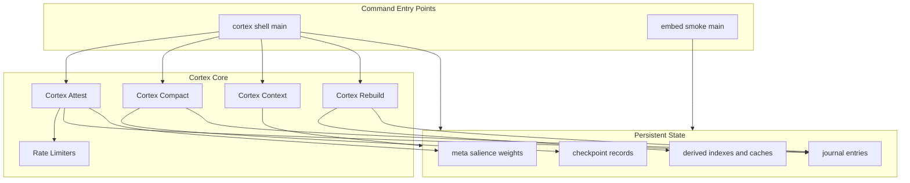
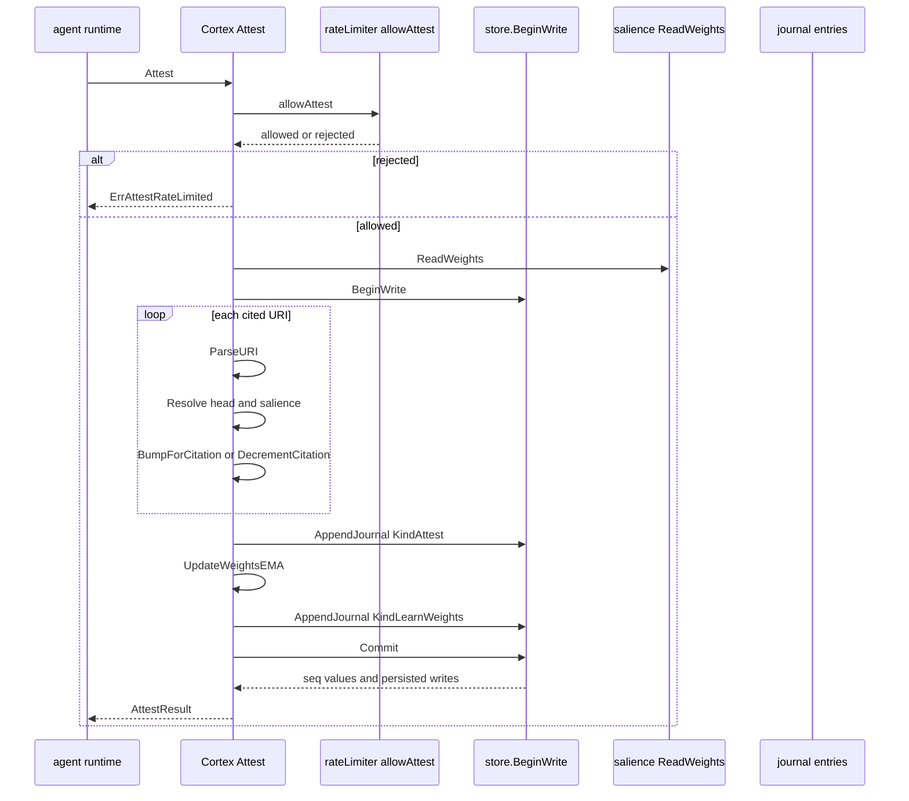
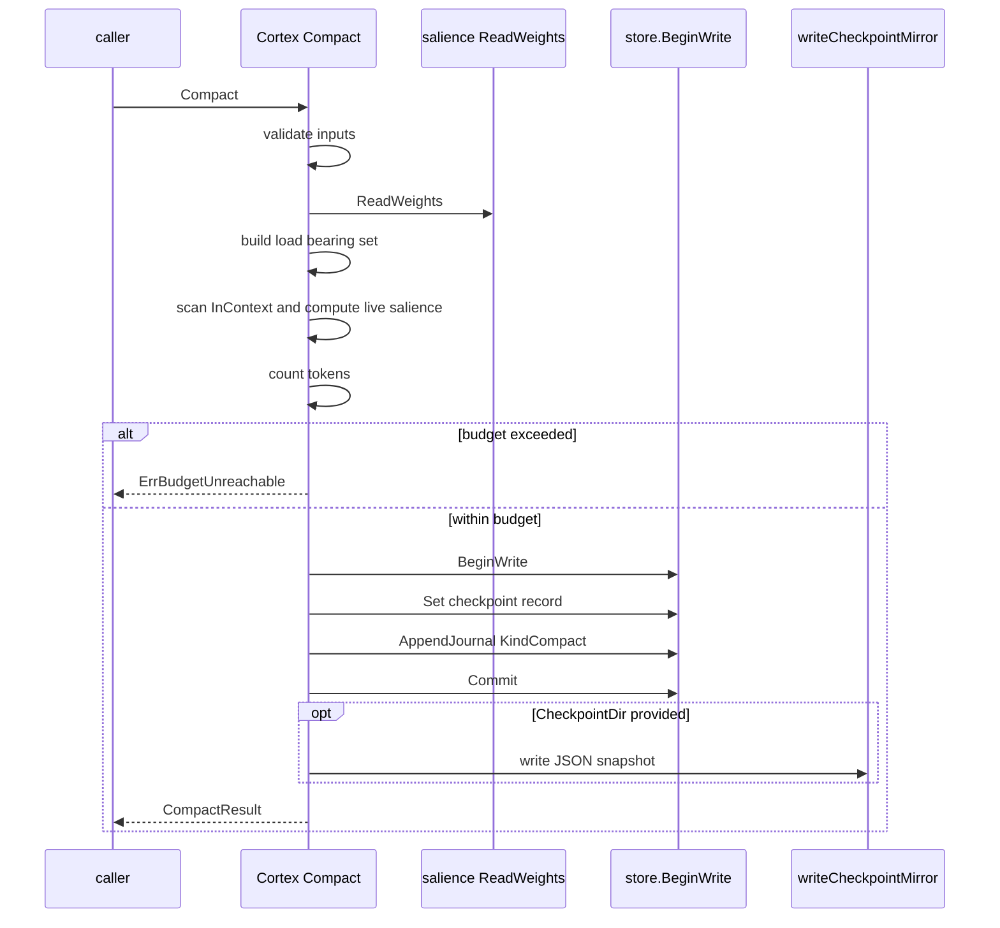
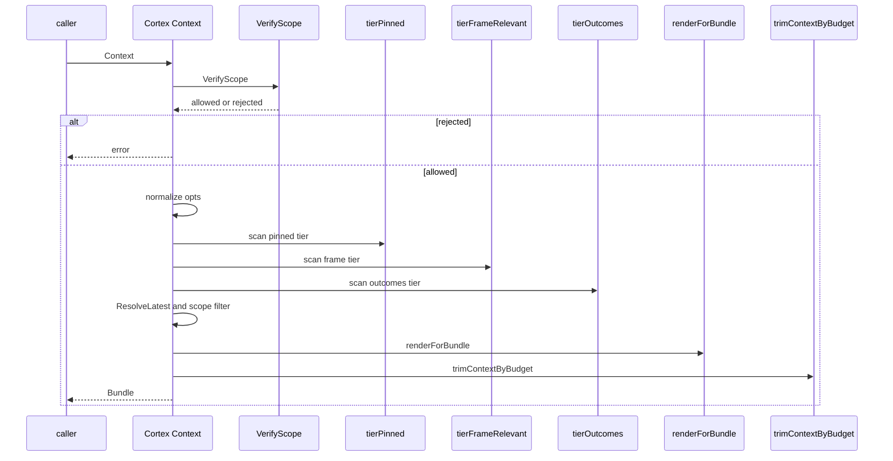

# Cortex Core

## Overview

`cortex/README.md` describes `matrix/cortex` as the core per-actor memory package for the Matrix system. In this section, the package is used for four main runtime surfaces: attestation, compaction, cold-start context composition, and rebuild of derived state. The README also records the phase-by-phase invariants that keep these operations deterministic across journal replay, snapshotting, and root computation.

The package code in `cortex/attest.go`, `cortex/compact.go`, `cortex/context.go`, `cortex/ratelimit.go`, and `cortex/rebuild.go` implements those surfaces directly. The two command entrypoints, `cortex/cmd/cortex-shell/main.go` and `cortex/cmd/embed-smoke/main.go`, expose the core package for smoke testing and live embedding verification.

## Source Files and Responsibilities

| File | Responsibility |
| --- | --- |
| `cortex/README.md` | Documents the phased Cortex core contract, invariants, supported behaviors, and the CLI surfaces that exercise core features. |
| `cortex/attest.go` | Implements `Cortex.Attest`, the intent-attestation primitive that updates salience, journals attestation records, and persists learned salience weights. |
| `cortex/attest_test.go` | Verifies citation bumping, failure decrements, tombstone skipping, deduplication, late-binding access accounting, and learned-weights behavior. |
| `cortex/compact.go` | Implements `Cortex.Compact`, checkpoint encoding, checkpoint URI and path helpers, and the best-effort JSON mirror writer. |
| `cortex/context.go` | Implements `Cortex.Context`, the cold-start bundle composer that merges pinned, frame-relevant, and outcome memories under a token budget. |
| `cortex/ratelimit.go` | Implements the in-memory token buckets that gate attestation and scope-violation journaling. |
| `cortex/ratelimit_test.go` | Verifies default limits, burst consumption, token replenishment, independent buckets, unlimited mode, limit resets, and bucket cardinality. |
| `cortex/rebuild.go` | Implements `Cortex.Rebuild`, which drops and re-derives derived state while refusing to run with an active embedder. |
| `cortex/rebuild_test.go` | Verifies root preservation, snapshot verification, idempotence, embedder guarding, salience replay, attestation replay, learned-weights replay, and edge mutations. |
| `cortex/cmd/cortex-shell/main.go` | Exposes the smoke-test CLI for the Cortex store, typed memory operations, snapshotting, attestation, rebuild, compaction, and scope inspection. |
| `cortex/cmd/embed-smoke/main.go` | Exposes a live embedding smoke test that calls the configured API embedder and checks semantic geometry plus repeatability. |

## Core Package Surface

### `cortex/README.md`

*`cortex/README.md`*

The README frames Cortex as a phased core with deterministic journaling, typed memories, salience ranking, compaction, graph traversal, snapshot roots, cold-start context composition, attestation-driven learned weights, and rebuild support. For this page, the most important part is the contract it records for the core package and the CLIs that exercise it.

It also records the invariants that the code enforces: atomic write batches, deterministic CBOR, one journal leaf per journal entry, salience and weight replay, scope-filtered reads, and derived-state rebuilds that preserve the overall root. The README is the highest-level source-backed map for how the individual files fit together.

### Architecture Snapshot

## Attestation

*`cortex/attest.go`*

`Cortex.Attest` records the outcome of an intent, updates per-memory salience, and appends two journal entries in one atomic batch when weight learning runs: `KindAttest` and `KindLearnWeights`. It is the package’s main audit-oriented write path, and its comments make the MCL boundary explicit: Cortex receives already-validated cited URIs and does not parse MCL envelopes itself.

The function also applies the per-actor rate limiter before any store work begins. If the `(actor, intent_id)` bucket is empty, `Cortex.Attest` returns `ErrAttestRateLimited` and does not mutate salience or journal state.

#### Data Structures

| Type | Property | Type | Description |
| --- | --- | --- | --- |
| `AttestOpts` | `IntentID` | `string` | Intent identifier recorded in the attestation journal entry. |
| `AttestOpts` | `Outcome` | `AttestOutcome` | Closed outcome enum for success or failure. |
| `AttestOpts` | `Reason` | `string` | Free-form failure reason; only `AttestReasonFactualError` and `AttestReasonWrongAssumption` drive citation decrements. |
| `AttestOpts` | `Cited` | `[]memory.URI` | URIs cited by the plan and used to resolve affected memories. |
| `AttestOpts` | `CreatedBy` | `string` | Agent ref written into the journal entry. |
| `AttestResult` | `Seq` | `uint64` | Sequence number of the `KindAttest` journal entry. |
| `AttestResult` | `LearnSeq` | `uint64` | Sequence number of the paired `KindLearnWeights` journal entry. |
| `AttestResult` | `AffectedIDs` | `[]memory.ID` | IDs whose salience was mutated. |
| `AttestResult` | `SkippedURIs` | `[]memory.URI` | URIs that were malformed, missing, or tombstoned and were skipped. |
| `AttestResult` | `CitationsDelta` | `int` | `+1`, `-1`, or `0` depending on outcome and reason. |
| `AttestResult` | `PrevWeights` | `salience.Weights` | Learned weights before the EMA step. |
| `AttestResult` | `NewWeights` | `salience.Weights` | Learned weights written to `meta/salience_weights`. |
| `AttestResult` | `WeightsUpdated` | `bool` | Indicates whether the EMA update changed the weights. |

#### Public Methods

| Method | Description |
| --- | --- |
| `Attest` | Records an attestation outcome, updates salience, writes the attestation journal entry, and persists learned weights when the EMA update is non-degenerate. |

#### Attestation Flow

#### Source-Backed Behavior

- `MaxCitedURIsPerAttest` caps one call at 256 cited URIs.
- Empty `IntentID` returns `ErrAttestEmptyIntentID`.
- Empty `Cited` returns `ErrEmptyCitations`.
- Invalid `Outcome` returns `ErrInvalidOutcome`.
- Cited URIs are pre-resolved before `BeginWrite`.
- Duplicate cited IDs in one attestation are deduplicated.
- Tombstoned or missing heads are placed in `SkippedURIs`.
- Success increments both `Citations` and `AccessCount` per affected ID.
- Failure with `AttestReasonFactualError` or `AttestReasonWrongAssumption` decrements `Citations`, floored at zero.
- Failure with any other reason leaves salience unchanged apart from the write-through touch.
- The learned-weight update is written to `meta/salience_weights` only when the EMA step changes the weights.
- `LearnSeq` is always `Seq + 1` when a result is returned.

#### Verified Test Coverage

`cortex/attest_test.go` proves the attestation contract with these test cases:

- `TestAttestSuccessBumpsCitations`
- `TestAttestFailureDecrementsCitationsOnReasonMatch`
- `TestAttestFloorsAtZero`
- `TestAttestSkipsTombstoned`
- `TestAttestRejectsEmptyCited`
- `TestAttestRejectsEmptyIntentID`
- `TestAttestDeduplicatesCitedURIs`
- `TestLateBindingFindBumpsAccessCount`
- `TestCompileTimeFindDoesNotBump`
- `TestAttestEmitsKindLearnWeightsSuccess`
- `TestAttestEmitsKindLearnWeightsSkippedOnDegenerate`
- `TestAttestColdStartLearnsFirstWeights`

## Compaction

Cortex.Attest writes the salience updates and journal entries atomically, but it does not parse the signed MCL envelope. The agent runtime owns that validation boundary.

*`cortex/compact.go`*

`Cortex.Compact` turns a loaded working set into a checkpoint record and an audit journal entry. It never mutates source memories or salience; instead, it summarizes non-load-bearing memories into `CompactedItem` stubs and keeps a preserved set of load-bearing and pinned items.

The function is budget-aware. It first summarizes all eligible items, then computes the full token total. If the total still exceeds the requested budget, it fails with `ErrBudgetUnreachable` rather than performing a second-stage truncation.

#### Data Structures

| Type | Property | Type | Description |
| --- | --- | --- | --- |
| `CompactedItem` | `Ref` | `memory.URI` | Canonical URI for the compacted memory. |
| `CompactedItem` | `ShortForm` | `string` | Persisted short form taken from `Version.Forms.Short`. |
| `CompactedItem` | `Salience` | `float32` | Live salience score used when the checkpoint was produced. |
| `CompactOpts` | `InContext` | `[]*memory.Memory` | Loaded working set to be compacted. |
| `CompactOpts` | `LoadBearing` | `[]memory.URI` | URIs the caller says must remain full. |
| `CompactOpts` | `BudgetTokens` | `int` | Target token budget after compaction. |
| `CompactOpts` | `IntentID` | `string` | Checkpoint intent identifier. |
| `CompactOpts` | `StepID` | `string` | Checkpoint step identifier. |
| `CompactOpts` | `CheckpointDir` | `string` | Filesystem mirror directory for the JSON snapshot. |
| `CompactResult` | `Kept` | `[]*memory.Memory` | Memories retained in full. |
| `CompactResult` | `Compacted` | `[]CompactedItem` | Summarized memories. |
| `CompactResult` | `SnapshotURI` | `memory.URI` | Canonical checkpoint URI. |
| `CompactResult` | `SnapshotPath` | `string` | Filesystem mirror path, or empty when no mirror was written. |
| `CheckpointRecord` | `SchemaVersion` | `uint8` | Canonical schema version for the checkpoint record. |
| `CheckpointRecord` | `IntentID` | `string` | Checkpoint intent identifier. |
| `CheckpointRecord` | `StepID` | `string` | Checkpoint step identifier. |
| `CheckpointRecord` | `CreatedAt` | `int64` | Creation time in Unix nanoseconds. |
| `CheckpointRecord` | `BudgetTokens` | `uint32` | Budget used for compaction. |
| `CheckpointRecord` | `KeptURIs` | `[]memory.URI` | Full memories preserved in the checkpoint. |
| `CheckpointRecord` | `Compacted` | `[]CompactedItem` | Summary stubs persisted in the checkpoint. |

#### Public Methods

| Method | Description |
| --- | --- |
| `EncodeCheckpointRecord` | Encodes a checkpoint record using canonical deterministic CBOR. |
| `DecodeCheckpointRecord` | Decodes canonical CBOR into a checkpoint record. |
| `BuildCheckpointURI` | Produces the canonical `matrix://journal/logs/<intent>/<step>` URI. |
| `BuildCheckpointFilePath` | Produces the mirror path `<dir>/<intent>/<step>.snapshot`. |
| `Compact` | Produces the checkpoint, writes the journal entry, and optionally mirrors the record as JSON. |
| `LoadCheckpoint` | Loads the persisted checkpoint record for an intent and step. |

#### Compaction Flow

#### Source-Backed Behavior

- `DefaultCompactBudgetTokens` is 4000.
- Zero `BudgetTokens` defaults to `DefaultCompactBudgetTokens`.
- `keys.CheckpointKey` validates the intent and step identifiers before any write.
- `Compact` reads the actor’s learned weights once and applies them to live salience recomputation.
- Pinned protection includes `Identity`, `Constraint` with `StrengthHard`, and `Goal` with `GoalActive`.
- Tombstoned entries are filtered out before checkpoint construction.
- `ShortForm` is copied from `Version.Forms.Short`; `Kept` items remain in full.
- The checkpoint record and the `KindCompact` journal entry are committed atomically.
- The JSON mirror is best effort only; mirror write failure is logged and does not roll back the Pebble commit.
- `BuildCheckpointURI` returns `matrix://journal/logs/<intent>/<step>`.
- `LoadCheckpoint` returns `memory.ErrNotFound` when no checkpoint exists.

#### Verified Test Coverage

The rebuild tests also exercise compaction through `TestRebuildPreservesRootAfterCompact`, which confirms that a `KindCompact` journal entry and checkpoint state still rebuild to the same overall root.

## Cold Start Context

writeCheckpointMirror logs mirror failures and continues. The canonical checkpoint remains the Pebble record and its journal entry, not the JSON mirror.

*`cortex/context.go`*

`Cortex.Context` composes a cold-start bundle from three sources: pinned memories, frame-relevant memories, and outcome memories. It is a read-only operation and never writes journal entries, salience updates, or index changes.

The API intentionally refuses vector recall at compile time. `ContextOpts` does not expose a `Near` or `NearURI` field, and the code enforces that by shape rather than by runtime validation.

#### Data Structures

| Type | Property | Type | Description |
| --- | --- | --- | --- |
| `ContextOpts` | `Verb` | `memory.Verb` | Verb used to key frame and outcome tiers. |
| `ContextOpts` | `Objects` | `map[string]string` | Map from object kind name to free-form object reference. |
| `ContextOpts` | `BudgetTokens` | `int` | Total token cap across the returned bundle. |
| `ContextOpts` | `IncludeTiers` | `[]Tier` | Tier selection set. |
| `ContextOpts` | `OutcomeLimit` | `int` | Top-N limit for the outcomes tier. |
| `ContextOpts` | `Form` | `query.FormKind` | Rendered form selection. |
| `ContextOpts` | `Scope` | `*scope.Scope` | Optional scope filter applied after verification. |
| `ContextOpts` | `Now` | `time.Time` | Wall clock used for scope expiry comparison. |
| `Bundle` | `Pinned` | `[]*memory.Memory` | Pinned tier memories. |
| `Bundle` | `FrameRelevant` | `[]*memory.Memory` | Frame-relevant tier memories. |
| `Bundle` | `Outcomes` | `[]*memory.Memory` | Outcome tier memories. |
| `Bundle` | `Rendered` | `map[memory.ID]string` | Rendered text for each surviving memory. |
| `Bundle` | `Tokens` | `map[memory.ID]int` | Token count for each rendered memory. |
| `Bundle` | `Scores` | `map[memory.ID]float32` | Salience score used during budget trimming. |
| `Bundle` | `ReachableURIs` | `[]memory.URI` | Trimmed memories that can still be lazily resolved. |
| `Bundle` | `TotalTokens` | `int` | Final token total after trimming. |
| `Bundle` | `Trimmed` | `int` | Number of memories removed by budget enforcement. |
| `Bundle` | `LatencyMS` | `int64` | End-to-end latency in milliseconds. |
| `Bundle` | `Form` | `query.FormKind` | Rendered form used for the bundle. |

#### Public Methods

| Method | Description |
| --- | --- |
| `ParseTier` | Parses the lower-case tier name into a `Tier` value. |
| `Context` | Builds a read-only cold-start bundle. |
| `String` | Returns the lower-case tier name for a `Tier` value. |

#### Tier Values

- `TierPinned`
- `TierFrameRelevant`
- `TierOutcomes`

#### Context Flow

#### Source-Backed Behavior

- `DefaultBudgetTokens` is 3000.
- `MaxBudgetTokens` is 4000.
- `MaxReachableURIs` is 64.
- `OutcomeLimit` defaults to 3.
- `Form` defaults to `query.FormMedium`.
- `IncludeTiers` defaults to all three tiers when empty.
- Unknown object kinds return `memory.ErrInvalidObjKind`.
- Empty object refs return `memory.ErrEmptyObjRef`.
- `Scope` is verified once at call entry, then applied as a per-candidate filter.
- `Scope.BudgetTokens` caps the caller’s budget.
- Pinned tier membership comes from `Identity`, hard `Constraint`, and active `Goal`.
- Frame-relevant tier scanning uses `idx/frame`.
- Outcomes tier scanning uses `idx/actor_obj`.
- Deduplication priority is `Pinned` first, then `Outcomes`, then `FrameRelevant`.
- The bundle is trimmed globally by salience after all candidates are loaded and rendered.
- Pinned tier memories receive `salience.PinnedFloor` before trimming.
- `FormShort` and `FormMedium` come from persisted forms; `FormFull` is rendered live from typed data.
- The composer is read-only and does not mutate the store.

#### Verified Test Coverage

`cortex/README.md` records the relevant invariants for this surface, including compile-time refusal of vector recall, pinned tier floor behavior, outcome ordering, deduplication, and read-only execution.

## Rate Limiting

*`cortex/ratelimit.go`*

The rate limiter is an in-memory token-bucket layer for two specific surfaces: attestation and scope-violation journaling. It is not journaled, not anchored in roots, and is treated as runtime policy state only.

The limiter is configured through `RateLimits` and installed with `WithRateLimits`. The default production configuration allows `10` scope-violation events per second with burst `20`, and `1` attestation per second with burst `5`.

#### Data Structures

| Type | Property | Type | Description |
| --- | --- | --- | --- |
| `RateLimits` | `ScopeViolation` | `rate.Limit` | Rate for scope-violation journaling. |
| `RateLimits` | `ScopeViolationBurst` | `int` | Burst for scope-violation journaling. |
| `RateLimits` | `Attest` | `rate.Limit` | Rate for `Cortex.Attest`. |
| `RateLimits` | `AttestBurst` | `int` | Burst for `Cortex.Attest`. |
| `scopeBucketKey` | `grantedTo` | `string` | Target of the scope grant. |
| `scopeBucketKey` | `grantedBy` | `string` | Source of the scope grant. |
| `attestBucketKey` | `actor` | `string` | Local actor name. |
| `attestBucketKey` | `intentID` | `string` | Intent identifier being attested. |
| `rateLimiter` | `mu` | `sync.Mutex` | Guards limiter state and bucket maps. |
| `rateLimiter` | `limits` | `RateLimits` | Current token-bucket configuration. |
| `rateLimiter` | `scopeViolations` | `map[scopeBucketKey]*rate.Limiter` | Live buckets for scope-violation journaling. |
| `rateLimiter` | `attests` | `map[attestBucketKey]*rate.Limiter` | Live buckets for attestation. |

#### Public Methods

| Method | Description |
| --- | --- |
| `DefaultRateLimits` | Returns the production default rate limits. |
| `UnlimitedRateLimits` | Returns a limiter configuration that disables both gates. |
| `WithRateLimits` | Applies a `RateLimits` override to a `Cortex` instance. |

#### Internal Methods

| Method | Description |
| --- | --- |
| `newRateLimiter` | Creates a limiter with default production settings. |
| `setLimits` | Replaces the limiter configuration and clears live buckets. |
| `allowScopeViolation` | Checks whether a `(GrantedTo, GrantedBy)` bucket can spend a token. |
| `allowAttest` | Checks whether an `(actor, intentID)` bucket can spend a token. |
| `snapshotForTests` | Reports the number of live buckets on both surfaces. |

#### Rate-Limiting Behavior

- Scope violations are bucketed by `(GrantedTo, GrantedBy)`.
- Attests are bucketed by `(actor, intent_id)`.
- The first call for a key lazily creates a bucket.
- `setLimits` clears the existing bucket maps so new limits take effect immediately.
- `UnlimitedRateLimits` uses `rate.Inf` for both rates.
- `allowAttest` returning false causes `Cortex.Attest` to return `ErrAttestRateLimited`.
- The limiter is designed as runtime policy, not as persisted state.

#### Verified Test Coverage

`cortex/ratelimit_test.go` proves the limiter contract with these test cases:

- `TestRateLimiterDefaultsAreProductionValues`
- `TestRateLimiterScopeViolationConsumesBurst`
- `TestRateLimiterScopeViolationReplenishes`
- `TestRateLimiterScopeViolationKeysIndependent`
- `TestRateLimiterAttestConsumesBurst`
- `TestRateLimiterAttestReplenishes`
- `TestRateLimiterAttestKeysIndependent`
- `TestRateLimiterUnlimitedDisablesBothGates`
- `TestRateLimiterSetLimitsClearsBuckets`
- `TestRateLimiterBucketsLeakOnHighKeyCardinality`

## Rebuild

The limiter’s buckets are runtime policy only. They are intentionally not part of the canonical store or the overall root, which is why Cortex.Attest can return ErrAttestRateLimited without leaving a journal trail.

*`cortex/rebuild.go`*

`Cortex.Rebuild` is the facade for dropping and re-deriving derived state from canonical store data. It delegates to `replay.Rebuild`, but it first enforces one important guard: if the async embedder is active, rebuild aborts with `ErrEmbedderRunning`.

The function also normalizes the clock source used by rebuild by defaulting `opts.Now` to `c.now` when no clock is provided.

#### Public Methods and Aliases

| Name | Description |
| --- | --- |
| `Rebuild` | Drops and rebuilds derived state in place. |
| `RebuildResult` | Alias of `replay.Result`. |
| `RebuildOptions` | Alias of `replay.Options`. |

#### Rebuild Behavior

- Requires the embedder to be stopped first.
- Refuses to run if `c.embed` is non-nil.
- Delegates to `replay.Rebuild(c.s, c.snap, opts)`.
- Preserves `OverallRoot` when the derived state is reconstructed correctly.
- Is not atomic across the whole drop-plus-rebuild cycle; the comments explicitly describe it as idempotent and resumable.
- Rebuild does not itself re-embed vectors; vector rebuild is handled by the embedder boundary.

#### Verified Test Coverage

`cortex/rebuild_test.go` proves the rebuild contract with these test cases:

- `TestRebuildPreservesOverallRoot`
- `TestRebuildVerifyAgainstLatestSnap`
- `TestRebuildIdempotent`
- `TestRebuildEmpty`
- `TestRebuildDropsAllDerived`
- `TestRebuildErrEmbedderRunning`
- `TestRebuildAfterEmbedder`
- `TestRebuildSalienceCacheRecomputed`
- `TestRebuildPreservesRootAfterUpdateHead`
- `TestRebuildPreservesRootAfterTombstone`
- `TestRebuildPreservesRootAfterCompact`
- `TestRebuildPreservesRootAfterEdgeMutations`
- `TestRebuildVerifyAgainstStaleSnapshotMismatches`
- `TestRebuildReappliesAttestSalienceBumps`
- `TestRebuildReappliesFindAccessBumps`
- `TestRebuildReappliesAttestFailureDecrement`
- `TestRebuildReappliesLearnedWeights`
- `TestFindHonoursLearnedWeights`
- `TestRebuildLearnedWeightsColdStartIdempotent`

## Cortex Shell CLI

Rebuild is explicitly guarded against a running embedder. The code treats an active embedder as a correctness hazard because it could journal new embed entries while derived state is being re-derived.

*`cortex/cmd/cortex-shell/main.go`*

`cortex-shell` is the package’s smoke-test command-line binary. It opens one actor store, constructs a `cortex.Cortex`, and dispatches a set of runtime commands that exercise the package surface. The binary requires both `-root` and `-actor`; if either is missing, it prints usage and exits with code `2`.

#### CLI Flags

| Flag | Description |
| --- | --- |
| `-root` | Cortex data root directory. |
| `-actor` | Actor name for the store. |

#### Command Surface

| Command | Behavior |
| --- | --- |
| `head` | Prints the next sequence number and journal count. |
| `append` | Appends a raw journal entry with the requested kind and payload. |
| `dump` | Iterates the journal and prints each entry. |
| `write` | Parses typed JSON and calls `c.Write`. |
| `resolve` | Resolves a memory URI and prints the memory. |
| `update` | Parses typed JSON from a URI’s type and calls `c.Update`. |
| `tombstone` | Calls `c.Tombstone`. |
| `list` | Lists IDs by type through `c.ListByType`. |
| `find` | Dispatches to `runFind`. |
| `context` | Dispatches to `runContext`. |
| `write-frame` | Like `write`, but stamps `Head.Frames` to seed frame indexes. |
| `add-edge` | Calls `c.AddEdge`. |
| `remove-edge` | Calls `c.RemoveEdge`. |
| `list-edges` | Iterates outgoing, incoming, or both edge directions. |
| `snapshot` | Captures a snapshot and prints roots and counters. |
| `dump-snapshot` | Loads a persisted snapshot and prints it as structured output. |
| `overall-root` | Prints the current overall root without persisting a snapshot. |
| `prove` | Produces and self-verifies a membership or non-membership proof for a memory URI. |
| `compact` | Dispatches to `runCompact`. |
| `dump-checkpoint` | Loads a checkpoint and prints it as formatted JSON. |
| `update-head` | Dispatches to `runUpdateHead`. |
| `dump-scope` | Loads canonical CBOR scope bytes from disk and prints a JSON view. |
| `rebuild` | Dispatches to `runRebuild`. |
| `attest` | Dispatches to `runAttest`. |
| `dump-attest` | Prints the decoded attestation payload for a journal sequence. |
| `dump-salience` | Prints the cached salience score for a URI. |
| `dump-weights` | Prints the learned salience weights. |

#### CLI Flow

The CLI is not a UI wrapper; it is a direct smoke harness over the core package. It intentionally exposes the low-level paths that core code uses for journaling, snapshots, proofs, attestation, and rebuild so that the package can be verified from the command line without adding another service layer.

## Embedding Smoke CLI

The shell binary is the easiest way to exercise Cortex.Attest, Cortex.Compact, Cortex.Rebuild, snapshots, and the salience-weight sidecar in one actor store.

*`cortex/cmd/embed-smoke/main.go`*

`embed-smoke` is a live network smoke test for the embedding backend. It reads `EMBED_MODEL`, defaults to `embed.DefaultModelFireworks`, constructs an API embedder with a `30 * time.Second` timeout, embeds a small set of related and unrelated texts, and checks that related texts score higher than unrelated ones.

The command also verifies three runtime properties:

- embedding dimension consistency,
- approximate unit norm,
- deterministic repeated calls for the same text.

#### Helpers

| Function | Description |
| --- | --- |
| `main` | Runs the live embedding smoke test. |
| `die` | Prints an error to stderr and exits non-zero. |
| `truncate` | Shortens long text for console output. |

#### Runtime Behavior

- Uses `EMBED_MODEL` when present.
- Falls back to `embed.DefaultModelFireworks` otherwise.
- Calls `embed.NewAPIEmbedder` with `embed.APIEmbedderConfig`.
- Embeds related samples and unrelated samples in the same run.
- Computes cosine similarity for comparison.
- Exits with a warning if related similarity is not greater than cross similarity.
- Re-embeds one sample three times to check deterministic output.

## Behavioral Notes and Test-Backed Invariants

- `Cortex.Attest` rejects empty intent IDs and empty citation sets.
- `Cortex.Attest` deduplicates repeated cited URIs within one call.
- `Cortex.Attest` skips tombstoned memories instead of failing the whole batch.
- `Cortex.Attest` can cold-start learned weights from `DefaultWeights`.
- `Cortex.Compact` is summarize-and-link only; it does not perform a second-stage truncation.
- `Cortex.Context` is read-only and budget-trims globally by salience after rendering.
- `Cortex.Rebuild` preserves the overall root across rebuilds when derived state is reconstructed correctly.
- `cortex-shell` includes direct inspection commands for checkpoints, salience, weights, and scope CBOR.
- `embed-smoke` is a live API smoke and not a unit test.

## Key Files Reference

| File | Role |
| --- | --- |
| `cortex/README.md` | Source-backed contract map for Cortex phases, invariants, and CLI surfaces. |
| `cortex/attest.go` | Attestation, salience mutation, and learned-weight persistence. |
| `cortex/compact.go` | Compaction checkpoint creation and mirror writing. |
| `cortex/context.go` | Cold-start bundle composition and token-based trimming. |
| `cortex/ratelimit.go` | Runtime rate-limiting policy for attestation and scope violations. |
| `cortex/rebuild.go` | Derived-state rebuild facade with embedder guard. |
| `cortex/cmd/cortex-shell/main.go` | Smoke-test command line entrypoint for the core package. |
| `cortex/cmd/embed-smoke/main.go` | Live embedding smoke entrypoint. |
