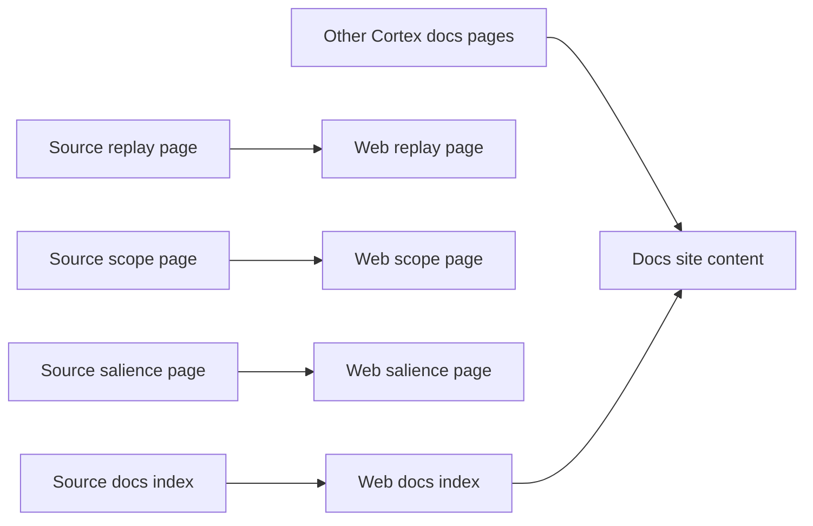

# Cortex Documentation Set and Mirrored Web Content

## Overview

This documentation set is the Cortex-facing map for Matrix’s per-actor memory system. The canonical markdown under `docs/cortex-docs/` introduces the main Cortex topics, while the mirrored pages under `docs/.web/src/content/cortex-docs/` publish selected topic pages and the top-level index into the docs web app.

The set is organized as a reader-facing guide to the memory composer, edge graph, embedding/vector path, salience model, scope gating, attestation and compaction, and replay invariant. The mirrored web content preserves the same Cortex documentation structure so the site can present the same topic map and selected topic text from the repository docs tree.

## Source Documentation Map

The canonical docs pages in `docs/cortex-docs/` define the documentation surface for Cortex itself.

| File | Role in the docs set | What the page covers |
| --- | --- | --- |
| `docs/cortex-docs/INDEX.md` | Documentation entry point | Introduces Cortex as the per-actor persistent memory store and lists the major topic pages: memory taxonomy, store and journal, write API, find query, context bundle, embedder and vector, edges and graph, snapshot and proofs, salience, attest and compact, scope, and replay. It also includes a repository layout excerpt that points readers at the main Cortex source areas. |
| `docs/cortex-docs/attest-and-compact.md` | Operational topic page | Describes `cortex.Attest` and `cortex.Compact`. The attest flow pre-resolves cited URIs to live memories, applies salience bumps, recomputes learned weights with EMA, and commits `KindAttest` and `KindLearnWeights` in one Pebble batch. The compact flow partitions `InContext` into kept and compacted memories, replaces compacted items with lightweight stubs, and emits a checkpoint for re-entry. |
| `docs/cortex-docs/context-bundle.md` | Context composition topic page | Describes `cortex.Context` as the cold-start composer that returns a `Bundle` built from three tiers: pinned, frame-relevant, and outcomes. The page explains the budgeted rendering flow, dedup priority, pinned salience floor, and the bundle fields visible in the docs: `TotalTokens`, `Trimmed`, and `Form`. |
| `docs/cortex-docs/edges-and-graph.md` | Graph and edge topic page | Documents `cortex.AddEdge`, `cortex.RemoveEdge`, and `cortex.GetEdge`, plus adjacency scans and bounded BFS traversal. It explains the forward and reverse edge records, soft-delete semantics, idempotent edge mutation behavior, and the visible edge metadata fields `CreatedBy` and `Weight`. |
| `docs/cortex-docs/embedder-and-vector.md` | Embedding and vector topic page | Documents the async embedding pipeline and the pure-Go HNSW vector index. The page explains that writes do not block on embedding, the embedder runs in a separate goroutine, and `Find Near` and `Find NearURI` depend on the embedding path. It also describes model-change rewind behavior and the vector metadata keyed by `VectorMeta` and `ID`. |
| `docs/cortex-docs/replay.md` | Replay invariant topic page | Describes the replay invariant: drop derived indexes, walk the canonical journal, and rebuild deterministically so roots match. The page covers `cortex.Rebuild`, `DropDerived`, replay post-conditions, the rebuild sequence, and the derived key prefixes that are re-emitted from canonical state. |
| `docs/cortex-docs/scope.md` | Scope and privacy topic page | Documents `CortexScope` as the cryptographic privacy boundary for sub-agent reads and writes. The page explains verification of signature, expiry, snapshot resolvability, and multi-proof validity, then shows how `Scope.Allows` is used per candidate and how `BudgetTokens` constrains `cortex.Context`. |
| `docs/cortex-docs/salience.md` | Salience topic page | Documents the salience ranking signal and the persisted `Score` record stored at `salience/<id>`. The page explains the five-factor model, the `Cached` snapshot versus the live ranking from `ColdScoreWith`, and the per-actor weight learning notes that influence replay and ranking behavior. |

## Mirrored Web Content

The docs web app mirrors selected Cortex pages under `docs/.web/src/content/cortex-docs/`. The mirrored pages preserve the same documentation intent and topic structure as the repository docs.

| File | Mirror role | What the web page preserves |
| --- | --- | --- |
| `docs/.web/src/content/cortex-docs/INDEX.md` | Web entry point | Mirrors the Cortex documentation index for the site. It repeats the contents table and the repository layout excerpt so readers can navigate the same Cortex topics from the web app. |
| `docs/.web/src/content/cortex-docs/replay.md` | Mirrored replay page | Preserves the replay invariant narrative, the “drop indexes → walk journal → roots match” framing, the post-conditions, and the ordered rebuild steps. |
| `docs/.web/src/content/cortex-docs/scope.md` | Mirrored scope page | Preserves the `CortexScope` description, the visible struct fields, the `UnsignedBytes` signing concept, the `BudgetTokens` limit, and the “Using a scope” guidance. |
| `docs/.web/src/content/cortex-docs/salience.md` | Mirrored salience page | Preserves the salience overview, the stored `Score` record, the weighted-factor model, and the explanation of `ColdScoreWith` as the live ranking path. |

## Mirror Relationship

The source docs and the web content are aligned around the same Cortex topic map.

The index pages are the bridge between the repository docs tree and the rendered site. The replay, scope, and salience pages are explicitly mirrored into the web content tree, while the remaining Cortex docs pages in this section stay documented in the repository docs set itself.

## Key Files Reference

| File | Responsibility |
| --- | --- |
| `docs/cortex-docs/INDEX.md` | Canonical Cortex docs index and topic map. |
| `docs/cortex-docs/attest-and-compact.md` | Attest and compaction documentation. |
| `docs/cortex-docs/context-bundle.md` | Cold-start context bundle documentation. |
| `docs/cortex-docs/edges-and-graph.md` | Edge mutation and graph traversal documentation. |
| `docs/cortex-docs/embedder-and-vector.md` | Async embedder and vector index documentation. |
| `docs/cortex-docs/replay.md` | Replay invariant documentation. |
| `docs/cortex-docs/scope.md` | Scope and privacy boundary documentation. |
| `docs/cortex-docs/salience.md` | Salience ranking documentation. |
| `docs/.web/src/content/cortex-docs/INDEX.md` | Web mirror of the Cortex docs index. |
| `docs/.web/src/content/cortex-docs/replay.md` | Web mirror of the replay page. |
| `docs/.web/src/content/cortex-docs/scope.md` | Web mirror of the scope page. |
| `docs/.web/src/content/cortex-docs/salience.md` | Web mirror of the salience page. |
