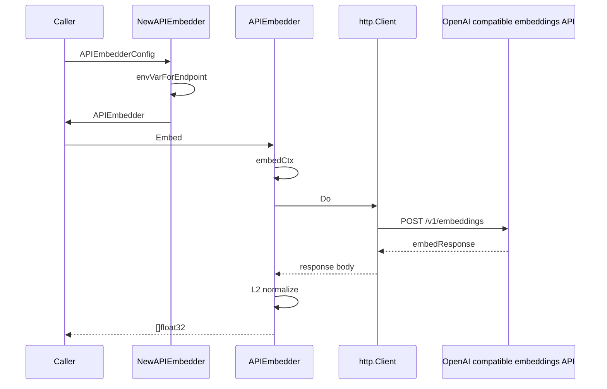
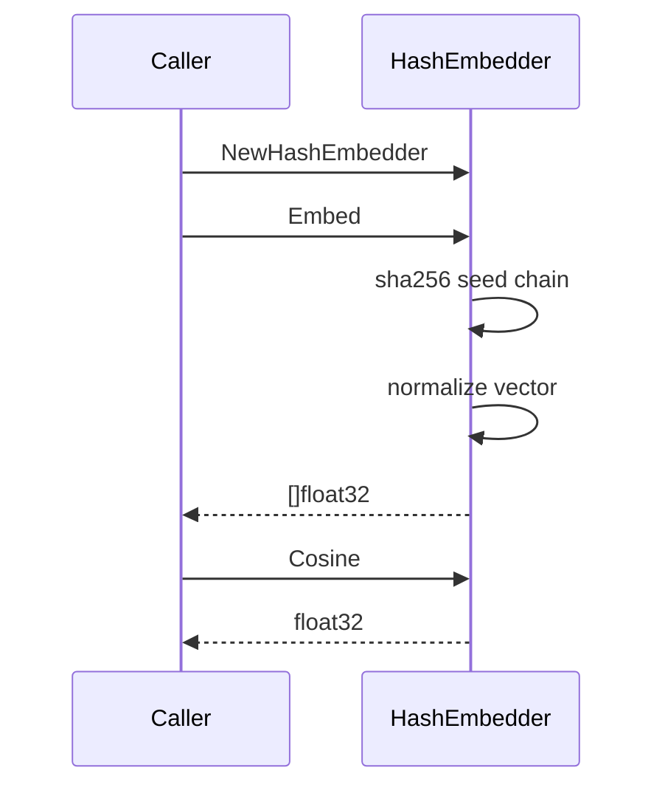
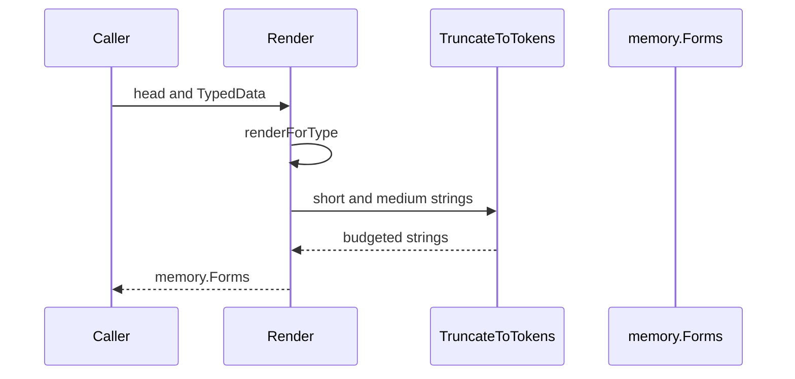
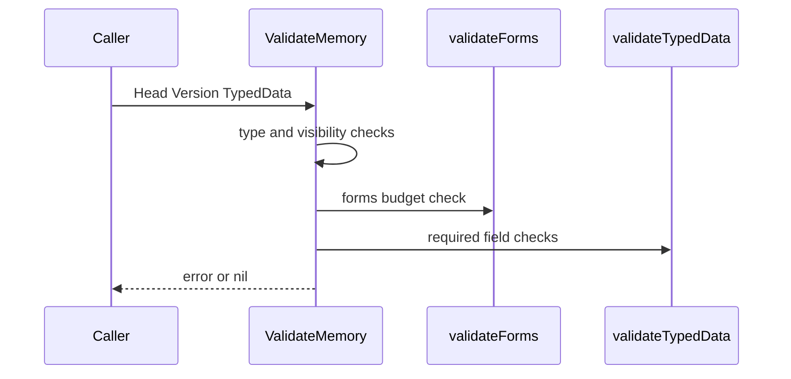
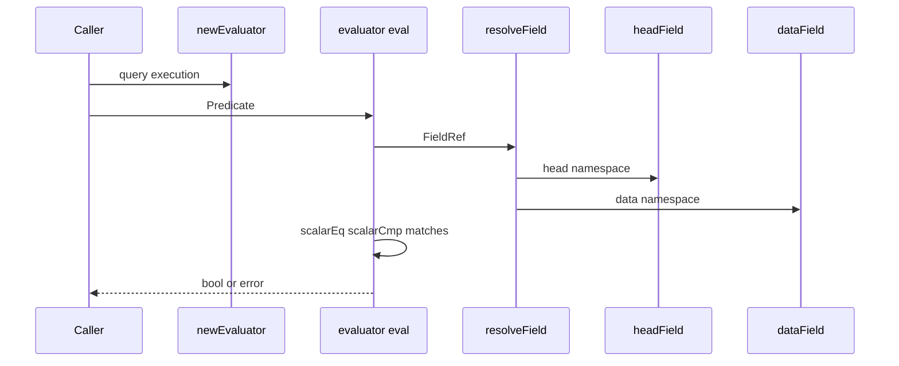

# Cortex - Embedding

## Overview

The Cortex embedding surface turns typed memory records into stable vector, form, and query inputs. It combines three linked concerns: deterministic embedding for hermetic tests, API-backed embedding for production vectors, and the memory schema and query logic that decide how those vectors, forms, and typed fields are validated and searched.

From a user or worker perspective, the flow is straightforward: typed memory data is validated, rendered into short and medium forms, encoded into canonical CBOR, and then compared or embedded through either the hash-based stub or the HTTP-backed provider. The query layer reads the same typed memory shapes back through field resolution rules so filters, ordering, and token budgets stay consistent with write-time validation.

## Source-Backed File Map

| File | Responsibility |
| --- | --- |
| `cortex/embed/embed.go` | Defines the `Embedder` contract, the deterministic `HashEmbedder`, the default embedding dimension, and cosine similarity helpers. |
| `cortex/embed/embed_test.go` | Verifies deterministic output, dimension agreement, model digest stability, unit normalization, distinct outputs for distinct inputs, and cosine semantics for the hash embedder. |
| `cortex/embed/api_embedder.go` | Implements `APIEmbedder`, which calls an OpenAI-compatible `/v1/embeddings` endpoint with retries, auth headers, and response validation. |
| `cortex/embed/api_embedder_test.go` | Verifies default config resolution, API key lookup, provider tagging, success behavior, empty-input rejection, dimension mismatch handling, retry behavior, and interface satisfaction. |
| `cortex/forms/forms.go` | Renders short, medium, and full forms for typed memories using deterministic per-type templates. |
| `cortex/forms/forms_test.go` | Verifies deterministic rendering, token budgets, type coverage, UTF-8-safe truncation, nil safety, and token counting behavior. |
| `cortex/forms/truncate.go` | Provides UTF-8-safe truncation to a token budget and defines the truncation suffix used by the forms package. |
| `cortex/memory/types.go` | Defines the core memory identity, visibility, provenance, version, vector, tombstone, and form container types. |
| `cortex/memory/data.go` | Defines the typed memory payload schemas for identity, facts, preferences, beliefs, events, goals, constraints, capabilities, and patterns. |
| `cortex/memory/edge.go` | Defines edge taxonomy, edge parsing, and canonical edge records for graph adjacency and tombstoning. |
| `cortex/memory/codec.go` | Implements canonical CBOR encoding and decoding for memory records, edge records, and vector metadata, plus hashing helpers. |
| `cortex/memory/codec_test.go` | Verifies canonical round-trips, hash stability, edge encoding, edge type parsing, and goal forward-compatibility behavior. |
| `cortex/memory/validate.go` | Enforces write-time validation for types, visibility, provenance, tags, forms, and typed payload content. |
| `cortex/memory/validate_test.go` | Verifies successful validation and rejection paths for type mismatches, bad visibility, bad confidence, tag limits, form budgets, missing typed fields, and type/data mismatches. |
| `cortex/query/eval.go` | Resolves typed memory fields and evaluates query predicates using comparison, matching, and logical operators. |
| `cortex/query/eval_test.go` | Verifies field resolution, comparisons, `In`, tag matching, regex matching, boolean composition, type mismatch reporting, and predicate string behavior. |
| `cortex/query/find.go` | Defines query shaping, ordering, traversal limits, and form rendering controls for the find layer. |

## API-Backed Embedding Service

*`cortex/embed/api_embedder.go`*

`APIEmbedder` is the production embedding path. It constructs an HTTP client, resolves a provider API key, pins a model identity string, and sends one text per request to a provider-specific embeddings endpoint. The implementation is built for OpenAI-compatible `/v1/embeddings` responses and normalizes the returned vector before handing it back to callers.

### Configuration and Lifecycle

#### `APIEmbedderConfig`

| Property | Type | Description |
| --- | --- | --- |
| `Model` | `string` | Provider-specific embedding model identifier. Defaults to `DefaultModelFireworks`. |
| `Endpoint` | `string` | Override for the embeddings URL. Defaults to `FireworksEmbedEndpoint`. |
| `APIKey` | `string` | Explicit API key override. If empty, the embedder reads from an environment variable chosen from the endpoint. |
| `Dim` | `int` | Advertised vector dimensionality. Defaults to `DefaultDim`. |
| `Timeout` | `time.Duration` | Request timeout. Defaults to `30s`. |
| `MaxRetries` | `int` | Retry count for transient failures. Negative values become `0`; zero becomes the default `3`. |
| `RetryBaseDelay` | `time.Duration` | Exponential backoff base delay. Defaults to `1s`. |
| `ProviderTag` | `string` | Suffix used in `Model()` to distinguish the provider. Defaults to a tag inferred from the endpoint. |
| `HTTPClient` | `*http.Client` | Optional HTTP client override, primarily for tests. |

#### `APIEmbedder`

| Property | Type | Description |
| --- | --- | --- |
| `cfg` | `APIEmbedderConfig` | Captures the resolved configuration used for requests. |
| `endpoint` | `string` | Resolved embeddings URL. |
| `apiKey` | `string` | Resolved provider API key. |
| `httpClient` | `*http.Client` | Client used for outbound POST calls. |
| `model` | `string` | Pinned `"<model>@<provider>"` identity returned by `Model()`. |

### Public Methods

| Method | Description |
| --- | --- |
| `NewAPIEmbedder` | Builds an `APIEmbedder`, resolves defaults, and looks up the API key from config or environment. |
| `Dim` | Returns the configured embedding dimension. |
| `Model` | Returns the pinned model identity string. |
| `Embed` | Embeds a single text string with timeout handling, retries, validation, and vector normalization. |

### Request and Response Shapes

#### `embedRequest`

| Property | Type | Description |
| --- | --- | --- |
| `Model` | `string` | Model identifier sent to the provider. |
| `Input` | `string` | Raw text sent verbatim to the provider. |

#### `embedResponse`

| Property | Type | Description |
| --- | --- | --- |
| `Object` | `string` | Response object kind, expected to be `list`. |
| `Data` | `[]embedDatum` | Returned embeddings. |
| `Model` | `string` | Echoed model identifier. |
| `Usage` | `*embedUsage` | Optional token usage block. |
| `Error` | `*embedErrorBody` | Optional provider error block. |

#### `embedDatum`

| Property | Type | Description |
| --- | --- | --- |
| `Object` | `string` | Datum kind, expected to be `embedding`. |
| `Embedding` | `[]float64` | Raw embedding vector from the provider. |
| `Index` | `int` | Position of the datum in the response list. |

#### `embedUsage`

| Property | Type | Description |
| --- | --- | --- |
| `PromptTokens` | `int` | Prompt token count reported by the provider. |
| `TotalTokens` | `int` | Total token count reported by the provider. |

#### `embedErrorBody`

| Property | Type | Description |
| --- | --- | --- |
| `Message` | `string` | Provider error message. |
| `Type` | `string` | Provider error type. |
| `Code` | `string` | Provider error code. |

### Runtime Behavior

- `NewAPIEmbedder` fills defaults before constructing the instance:- `Model` defaults to `DefaultModelFireworks`.
- `Endpoint` defaults to `FireworksEmbedEndpoint`.
- `Dim` defaults to `DefaultDim`.
- `Timeout` defaults to `30s`.
- `MaxRetries` defaults to `3`.
- `RetryBaseDelay` defaults to `1s`.
- `ProviderTag` is inferred from the endpoint when omitted.
- API keys are resolved from environment variables when `APIKey` is empty:- Fireworks-style endpoints use `FIREWORKS_API_KEY`.
- Together-style endpoints use `TOGETHER_API_KEY`.
- Other endpoints use `EMBEDDING_API_KEY`.
- `Embed` rejects empty input with `ErrEmptyInput` before making a network call.- `Content-Type: application/json`
- `Accept: application/json`
- `Authorization: Bearer <key>`
- Retry behavior:- Network failures are retryable.
- HTTP `429` and all `5xx` responses are retryable.
- Other non-2xx responses are treated as non-retryable provider errors.
- Backoff doubles each attempt and caps at `8s`.
- Successful responses are parsed, validated for non-empty `data`, checked against the configured dimension, converted to `[]float32`, and L2-normalized before return.

### Embedding Call Sequence

## Deterministic Hash Embedding Stub

APIEmbedder is deterministic per provider call, but the implementation comments explicitly note that production provider output is not guaranteed to be bit-identical across separate runs.

*`cortex/embed/embed.go`*

The hash embedder is the hermetic embedding implementation used in tests and offline paths. It maps text to a fixed-length vector using SHA-256-derived seed material and then normalizes the result so cosine similarity and dot product line up for search.

### Constants and Errors

| Name | Type | Description |
| --- | --- | --- |
| `DefaultDim` | `int` | Default embedding dimension. |
| `ErrEmptyInput` | `error` | Returned when an embedder rejects zero-length input. |
| `ErrDimMismatch` | `error` | Returned when a produced vector length does not match the advertised dimension. |

### `HashEmbedder`

| Property | Type | Description |
| --- | --- | --- |
| `dim` | `int` | Vector dimensionality. |
| `salt` | `string` | Seed salt used to distinguish stub variants. |
| `model` | `string` | Audit identity string returned by `Model()`. |

### Public Methods and Functions

| Method or Function | Description |
| --- | --- |
| `NewHashEmbedder` | Returns a default `HashEmbedder` with `DefaultDim` and no salt. |
| `NewHashEmbedderWith` | Returns a `HashEmbedder` configured for a specific dimension and salt. |
| `Dim` | Returns the configured vector length. |
| `Model` | Returns the audit identity string for the stub. |
| `Embed` | Produces a unit-normalized pseudo-vector derived from the text and salt. |
| `Cosine` | Computes cosine similarity, returning `0` on length mismatch or zero norms. |

### Behavior

- `NewHashEmbedder` returns a stub whose model string is `hash-stub@v1`.
- `NewHashEmbedderWith` falls back to `DefaultDim` when the requested dimension is not positive.
- The model string includes a digest derived from the dimension and salt, which keeps differently configured stubs distinguishable in logs and tests.
- `Embed`:- seeds a SHA-256 chain with `hash-stub.v1`, salt, and text,
- streams blocks into `float32` values in `[-1, 1)`,
- normalizes the vector to unit length,
- returns a canonical unit vector when the generated magnitude would otherwise be zero.
- Empty text is accepted by the hash embedder and still yields a deterministic vector.
- `Cosine` compares unit vectors as a dot product equivalent but also handles non-normalized inputs correctly.

### Hash-Based Embedding Flow

## Forms and Token Budgets

*`cortex/forms/forms.go`*

*`cortex/forms/truncate.go`*

The forms package turns typed memory into short and medium renderings used by list and find paths. The renderer is deterministic, type-aware, and budgeted so rendered output stays aligned with the validation rules in `memory`.

### Public Functions

| Function | Description |
| --- | --- |
| `Render` | Produces auto-generated short and medium forms for a typed memory payload. |
| `RenderFull` | Returns the canonical full rendering for a typed memory payload. |
| `TruncateToTokens` | [REDACTED] |

### Render Behavior

- `Render` returns an empty `memory.Forms` value when the head or typed data is nil.
- `RenderFull` returns an empty string when the head or typed data is nil.
- `renderForType` dispatches to type-specific renderers:- `renderIdentity`
- `renderFact`
- `renderPreference`
- `renderBelief`
- `renderEvent`
- `renderGoal`
- `renderConstraint`
- `renderCapability`
- `renderPattern`
- Unknown typed payloads fall back to `"<unknown>"` instead of panicking.
- `Render` truncates the short and medium outputs to `memory.MaxShortTokens` and `memory.MaxMediumTokens`.
- `RenderFull` returns the untruncated medium-shape rendering and is intended as the canonical long form.

### Per-Type Rendering Shapes

| Renderer | Short form shape | Medium additions |
| --- | --- | --- |
| `renderIdentity` | Name, optionally with DID in parentheses | Wallet count, roles list, key count |
| `renderFact` | `predicate(subject)=statement` | `as_of` timestamp, source |
| `renderPreference` | `prefers topic (polarity, strength=)` | Rationale |
| `renderBelief` | `stance statement` | Evidence counts |
| `renderEvent` | Outcome and kind, optionally counterparty and cost | Duration, artifact count, intent ref, summary |
| `renderGoal` | Status and statement | Horizon end, success criteria count, subgoal count |
| `renderConstraint` | Strength, polarity, statement | Source, trigger |
| `renderCapability` | Subject, capability, verified status | Last observed timestamp |
| `renderPattern` | Statement, strength, coverage | Derived-from count |

### Truncation Behavior

#### `Ellipsis`

| Name | Type | Description |
| --- | --- | --- |
| `Ellipsis` | `string` | Suffix appended when truncation occurs. |

- `TruncateToTokens` returns the empty string for non-positive budgets.
- If a string already fits, it is returned unchanged.
- When truncation is needed, the function reserves space for the suffix and then trims at a UTF-8 rune boundary.
- `safePrefix` is the internal helper that walks runes from the start to avoid splitting multi-byte characters.

### Form Rendering Flow

## Memory Records, Canonical Encoding, and Validation

*`cortex/memory/types.go`*

*`cortex/memory/data.go`*

*`cortex/memory/edge.go`*

*`cortex/memory/codec.go`*

*`cortex/memory/validate.go`*

These files define the durable memory shape, the typed payload schemas, the graph edge record, the canonical encoding rules, and the write-time validation that keeps the Cortex store internally consistent.

### Core Constants and Enumerations

| Name | Values |
| --- | --- |
| `Type` | `TypeIdentity`, `TypeFact`, `TypePreference`, `TypeBelief`, `TypeEvent`, `TypeGoal`, `TypeConstraint`, `TypeCapability`, `TypePattern` |
| `Visibility` | `VisPrivate`, `VisScoped`, `VisActorPublic` |
| `SourceKind` | `user_input`, `derived`, `observed`, `imported` |
| `Stance` | `believe`, `doubt`, `suspect` |
| `Polarity` | `prefer`, `avoid`, `neutral`, `do`, `dont` |
| `Strength` | `soft`, `firm`, `hard` |
| `ConstraintSource` | `user_declared`, `learned`, `inferred` |
| `GoalStatus` | `active`, `paused`, `completed`, `abandoned` |
| `EventKind` | `intent_completed`, `intent_failed`, `payment`, `dispatch`, `observation`, `interaction` |
| `Outcome` | `success`, `failure`, `partial` |
| `MaxTagLen` | `64` |
| `MaxTagsPerMemory` | `16` |
| `MaxShortTokens` | `50` |
| `MaxMediumTokens` | `200` |
| `BytesPerToken` | `4` |
| `HashDomain` | `matrix.cortex.memory.v1` |
| `VectorHashDomain` | `matrix.cortex.vector.v1` |

### Utility Functions and Methods

| Function or Method | Description |
| --- | --- |
| `NewID` | Creates a new random ULID-backed memory ID. |
| `ParseID` | Parses a textual ULID into an `ID`. |
| `TypeOf` | Returns the canonical `Type` for a typed payload, or `0` for nil. |
| `EncodeData` | Canonical-CBOR encodes a typed payload for storage in `Version.Data`. |
| `DecodeData` | Decodes canonical-CBOR bytes into the typed payload for a given `Type`. |
| `EncodeHead` | Canonical-CBOR encodes a `Head`. |
| `DecodeHead` | Decodes canonical-CBOR bytes into a `Head`. |
| `EncodeVersion` | Canonical-CBOR encodes a `Version`. |
| `DecodeVersion` | Decodes canonical-CBOR bytes into a `Version`. |
| `EncodeVectorMeta` | Canonical-CBOR encodes a `VectorMeta`. |
| `DecodeVectorMeta` | Decodes canonical-CBOR bytes into a `VectorMeta`. |
| `HashVector` | Computes a SHA-256 hash over the vector domain and big-endian float32 components. |
| `HashVersion` | Computes the content hash for a version while excluding the `Hash` field from the digest input. |
| `EncodeEdge` | Canonical-CBOR encodes an `EdgeRecord`. |
| `DecodeEdge` | Decodes canonical-CBOR bytes into an `EdgeRecord`. |
| `ValidateMemory` | Validates a head, version, and typed payload together. |
| `validateForms` | Enforces the short and medium token budgets. |
| `CountTokens` | [REDACTED] |
| `validateTypedData` | Enforces required fields and type-specific numeric constraints. |
| `missingField` | Builds the typed missing-field error message. |
| `ParseEdgeType` | Parses a textual edge name into an `EdgeType`. |

### `Forms`, `Tombstone`, and `Provenance`

#### `Forms`

| Property | Type | Description |
| --- | --- | --- |
| `Short` | `string` | Short rendered form. |
| `Medium` | `string` | Medium rendered form. |

#### `Tombstone`

| Property | Type | Description |
| --- | --- | --- |
| `Reason` | `string` | Tombstone reason text. |
| `At` | `time.Time` | Tombstone timestamp. |
| `By` | `string` | Actor or system that applied the tombstone. |

#### `Provenance`

| Property | Type | Description |
| --- | --- | --- |
| `Source` | `SourceKind` | Entry path into the cortex. |
| `DerivedFrom` | `[]string` | URIs used as derivation inputs. |
| `Attestations` | `[]string` | Attestation references. |
| `SignedBy` | `[]byte` | Optional signer bytes. |
| `SignedAt` | `*time.Time` | Optional signing timestamp. |
| `Sig` | `[]byte` | Optional signature bytes. |

### `Head`, `VectorRef`, `VectorMeta`, `Version`, and `Memory`

#### `Head`

| Property | Type | Description |
| --- | --- | --- |
| `ID` | `ID` | Memory ID. |
| `Type` | `Type` | Canonical memory type. |
| `CurrentVersion` | `uint64` | Current version number. |
| `ActorScope` | `string` | Actor name associated with the memory. |
| `Visibility` | `Visibility` | Visibility level. |
| `DeclaredImportance` | `uint8` | Importance score. |
| `Tags` | `[]Tag` | Tag set. |
| `Tombstoned` | `*Tombstone` | Tombstone metadata when soft-deleted. |
| `LastUpdatedAt` | `time.Time` | Last update timestamp. |
| `EmbeddingRef` | `*VectorRef` | Async embedding reference. |
| `Forms` | `Forms` | Latest rendered short and medium forms. |
| `Frames` | `[]FrameRef` | Frame annotations used by later phases. |

#### `VectorRef`

| Property | Type | Description |
| --- | --- | --- |
| `VertexID` | `uint64` | Vector-graph vertex identifier. |
| `Model` | `string` | Embedding model identifier. |
| `Dim` | `uint16` | Vector dimension. |
| `Stale` | `bool` | Marks the reference as stale. |

#### `VectorMeta`

| Property | Type | Description |
| --- | --- | --- |
| `VertexID` | `uint64` | Vector-graph vertex identifier. |
| `Model` | `string` | Embedding model identifier. |
| `Dim` | `uint16` | Vector dimension. |
| `Vector` | `[]float32` | Stored embedding vector. |
| `SourceVersion` | `uint64` | Source version number for the vector. |
| `EmbeddedAt` | `time.Time` | Time the vector was embedded. |
| `VectorHash` | `[32]byte` | Hash of the vector payload. |

#### `Version`

| Property | Type | Description |
| --- | --- | --- |
| `ID` | `ID` | Memory ID. |
| `Version` | `uint64` | Version number. |
| `Type` | `Type` | Memory type. |
| `Data` | `[]byte` | Canonical CBOR of the typed payload. |
| `CreatedAt` | `time.Time` | Creation time. |
| `CreatedBy` | `string` | Creator identity. |
| `ExpiresAt` | `*time.Time` | Optional expiry time. |
| `Confidence` | `float32` | Confidence score in the stored version. |
| `Provenance` | `Provenance` | Provenance metadata. |
| `Forms` | `Forms` | Rendered short and medium forms. |
| `FormsOverride` | `bool` | Indicates whether the forms were skill-supplied. |
| `Hash` | `[32]byte` | SHA-256 content hash for the version body. |

#### `Memory`

| Property | Type | Description |
| --- | --- | --- |
| `Head` | `Head` | Stored head record. |
| `Version` | `Version` | Stored version record. |

### Typed Payload Schemas

#### `AssetAmount`

| Property | Type | Description |
| --- | --- | --- |
| `Asset` | `string` | Asset symbol. |
| `Amount` | `string` | Decimal-string amount. |

#### `IdentityData`

| Property | Type | Description |
| --- | --- | --- |
| `SchemaVersion` | `int` | Schema version for migrations. |
| `Name` | `string` | Human-readable name. |
| `DID` | `string` | Optional DID. |
| `Wallets` | `[]string` | Wallet addresses. |
| `Roles` | `[]string` | Role labels. |
| `PublicKeys` | `[]PublicKey` | Opaque public keys. |

#### `FactData`

| Property | Type | Description |
| --- | --- | --- |
| `SchemaVersion` | `int` | Schema version. |
| `Statement` | `string` | Fact statement. |
| `Subject` | `string` | Subject URI. |
| `Predicate` | `string` | Bounded predicate vocabulary. |
| `Object` | `[]byte` | Canonical CBOR object value. |
| `Source` | `string` | Optional source URI. |
| `AsOf` | `*time.Time` | Optional as-of timestamp. |

#### `PreferenceData`

| Property | Type | Description |
| --- | --- | --- |
| `SchemaVersion` | `int` | Schema version. |
| `Topic` | `string` | Preference topic. |
| `Value` | `[]byte` | Canonical CBOR value. |
| `Polarity` | `Polarity` | Preference direction. |
| `StrengthVal` | `float32` | Preference strength in the range `0` to `1`. |
| `Rationale` | `string` | Optional rationale. |

#### `BeliefData`

| Property | Type | Description |
| --- | --- | --- |
| `SchemaVersion` | `int` | Schema version. |
| `Statement` | `string` | Belief statement. |
| `Subject` | `string` | Belief subject. |
| `Stance` | `Stance` | Belief stance. |
| `EvidenceFor` | `[]string` | Supporting evidence. |
| `EvidenceAgainst` | `[]string` | Opposing evidence. |

#### `EventData`

| Property | Type | Description |
| --- | --- | --- |
| `SchemaVersion` | `int` | Schema version. |
| `Kind` | `EventKind` | Event subtype. |
| `IntentRef` | `string` | Optional intent reference. |
| `Counterparty` | `string` | Optional counterparty. |
| `OutcomeVal` | `Outcome` | Event outcome. |
| `Cost` | `*AssetAmount` | Optional cost. |
| `Duration` | `*time.Duration` | Optional duration. |
| `Artifacts` | `[]string` | Optional artifact URIs. |
| `Summary` | `string` | Optional one-line summary. |

#### `GoalData`

| Property | Type | Description |
| --- | --- | --- |
| `SchemaVersion` | `int` | Schema version. |
| `Statement` | `string` | Goal statement. |
| `HorizonEnd` | `*time.Time` | Optional horizon end. |
| `SuccessCriteria` | `[]string` | Predicate expressions for success. |
| `Status` | `GoalStatus` | Goal status. |
| `Subgoals` | `[]string` | Subgoal identifiers. |
| `VerbHint` | `string` | Optional verb hint. |
| `Objects` | `[]GoalObjRef` | Typed referents. |
| `Constraints` | `[]GoalConstraint` | Embedded goal constraints. |
| `Budget` | `*GoalBudget` | Optional per-goal budget. |
| `Persistent` | `bool` | Marks the goal as standing rather than one-shot. |
| `CreatedBy` | `string` | Architect or wallet identity. |

#### `GoalObjRef`

| Property | Type | Description |
| --- | --- | --- |
| `Kind` | `string` | Object kind. |
| `Ref` | `string` | Object reference. |
| `Value` | `[]byte` | Optional inline canonical CBOR value. |

#### `GoalConstraint`

| Property | Type | Description |
| --- | --- | --- |
| `Type` | `string` | Constraint type. |
| `Hard` | `bool` | Hard or soft constraint. |
| `Statement` | `string` | Human-readable statement. |
| `Data` | `[]byte` | Optional canonical CBOR payload. |

#### `GoalBudget`

| Property | Type | Description |
| --- | --- | --- |
| `DailyPaxMax` | `string` | Daily PAX cap. |
| `TotalPaxMax` | `string` | Total PAX cap. |
| `MaxIntentsPerDay` | `int` | Daily intent cap. |
| `MaxConcurrent` | `int` | Concurrent intent cap. |

#### `ConstraintData`

| Property | Type | Description |
| --- | --- | --- |
| `SchemaVersion` | `int` | Schema version. |
| `Statement` | `string` | Constraint statement. |
| `Polarity` | `Polarity` | Constraint polarity. |
| `Trigger` | `string` | Optional predicate expression trigger. |
| `StrengthVal` | `Strength` | Constraint strength. |
| `Source` | `ConstraintSource` | Constraint source. |

#### `CapabilityData`

| Property | Type | Description |
| --- | --- | --- |
| `SchemaVersion` | `int` | Schema version. |
| `Subject` | `string` | Capability subject. |
| `Capability` | `string` | Capability name. |
| `Parameters` | `[]byte` | Optional parameter payload. |
| `Verified` | `bool` | Verification flag. |
| `LastObserved` | `time.Time` | Last observed timestamp. |

#### `PatternData`

| Property | Type | Description |
| --- | --- | --- |
| `SchemaVersion` | `int` | Schema version. |
| `Statement` | `string` | Pattern statement. |
| `DerivedFrom` | `[]string` | Source identifiers. |
| `Strength` | `float32` | Pattern strength. |
| `Coverage` | `int` | Coverage count. |

#### `TypedData`

| Property | Type | Description |
| --- | --- | --- |
| `memoryType()` | `Type` | Marker method used for compile-time dispatch in encoding and validation. |

### Edge Taxonomy and Records

#### Edge Types

`derived_from`, `supersedes`, `references`, `contradicts`, `corroborates`, `consents_to`, `dispatched_to`, `attested_by`, `cited_in`, `tombstones`, `part_of`, `instance_of`, `caused_by`, `observed_by`

#### `EdgeRecord`

| Property | Type | Description |
| --- | --- | --- |
| `Type` | `EdgeType` | Edge discriminator. |
| `Src` | `ID` | Source memory ID. |
| `Dst` | `ID` | Destination memory ID. |
| `CreatedAt` | `time.Time` | Edge creation time. |
| `CreatedBy` | `string` | Creator identity. |
| `Weight` | `float32` | Optional edge weight. |
| `Tombstoned` | `bool` | Soft-delete marker. |
| `TombstonedAt` | `*time.Time` | Optional tombstone timestamp. |
| `TombstonedReason` | `string` | Optional tombstone reason. |
| `TombstonedBy` | `string` | Optional tombstone actor. |
| `Data` | `[]byte` | Opaque edge-specific payload. |

### Canonical Encoding and Hashing

- `init` builds deterministic CBOR encode and decode modes up front and panics if the modes cannot be constructed.
- `EncodeData` and `DecodeData` round-trip the nine canonical typed payloads.
- `EncodeHead`, `DecodeHead`, `EncodeVersion`, `DecodeVersion`, `EncodeVectorMeta`, and `DecodeVectorMeta` are direct canonical-CBOR wrappers around the corresponding structs.
- `HashVersion` temporarily clears `Version.Hash` before encoding, which prevents the hash from self-referencing its own digest.
- `HashVector` writes the vector hash domain followed by big-endian float32 bit patterns so the hash stays stable across architectures.
- `DecodeData` returns `ErrUnknownDataKind` when the requested type is not one of the canonical nine.

### Validation Rules

`ValidateMemory` checks the head, version, and typed payload together. It accepts the typed payload directly, but if `data` is nil it decodes `v.Data` and validates that instead.

Validation covers:

- `Head.Type` validity and `Head.Type` versus `Version.Type` consistency.
- `Head.Visibility` validity.
- `Head.DeclaredImportance` staying within `0` to `10`.
- Tag count and tag length limits.
- Frame count limits and per-frame validation.
- `Version.Provenance.Source` validity.
- `Version.Confidence` staying within `0` to `1`.
- Form budgets via `validateForms`.
- Typed payload type matching via `TypeOf` and `memoryType()`.
- Required-field checks for every concrete payload type.

The typed payload checks are explicit:

- `IdentityData` requires `Name`.
- `FactData` requires `Statement`, `Subject`, and `Predicate`.
- `PreferenceData` requires `Topic`, `Polarity`, and a strength in range.
- `BeliefData` requires `Statement` and a valid `Stance`.
- `EventData` requires `Kind` and `OutcomeVal`.
- `GoalData` requires `Statement` and `Status`.
- `ConstraintData` requires `Statement`, `StrengthVal`, and `Source`.
- `CapabilityData` requires `Subject` and `Capability`.
- `PatternData` requires `Statement` and a strength in range.

### Memory Validation Flow

## Query Evaluation and Find Constraints

ValidateMemory also enforces the frame budget and runs each frame's own validation before it accepts the memory.

*`cortex/query/eval.go`*

*`cortex/query/find.go`*

The query layer reads the same memory shapes that the embedding and validation code produces. It resolves fields from `Head`, `Version`, and typed `Data`, compares values with typed coercion, and applies find-time limits, ordering, and traversal controls.

### Evaluation Errors

| Name | Description |
| --- | --- |
| `ErrFieldUnknown` | Returned when a field reference does not exist for the current memory type. |
| `ErrFieldNotComparable` | Returned when a comparison requires an ordered field and the field is not orderable. |
| `ErrTypeMismatch` | Returned when a predicate literal cannot be compared with the resolved field value. |

### Evaluator Cache

#### `evaluator`

| Property | Type | Description |
| --- | --- | --- |
| `regex` | `map[string]*regexp.Regexp` | Cache of compiled regular expressions used by `Matches`. |

### Field Resolution Rules

`resolveField` accepts namespace-qualified field references and dispatches to the correct resolver:

- `head.<field>` uses `headField`
- `version.<field>` uses `versionField`
- `data.<field>` uses `dataField`

#### `headField` values

- `id`
- `type`
- `current_version`
- `actor_scope`
- `visibility`
- `declared_importance`
- `tombstoned`
- `last_updated_at`

#### `versionField` values

- `version`
- `created_at`
- `created_by`
- `expires_at`
- `confidence`
- `provenance.source`
- `provenance.signed_by_present`

#### `dataField` values

The `data` namespace exposes typed fields for each concrete memory payload, including:

- Identity fields: `name`, `did`, `schema_version`
- Fact fields: `statement`, `subject`, `predicate`, `source`, `schema_version`, `as_of`
- Preference fields: `topic`, `polarity`, `strength_val`, `rationale`, `schema_version`
- Belief fields: `statement`, `subject`, `stance`, `schema_version`
- Event fields: `kind`, `intent_ref`, `counterparty`, `outcome`, `summary`, `schema_version`
- Goal fields: `statement`, `status`, `schema_version`, `horizon_end`
- Constraint fields: `statement`, `polarity`, `trigger`, `strength`, `source`, `schema_version`
- Capability fields: `subject`, `capability`, `verified`, `last_observed`, `schema_version`
- Pattern fields: `statement`, `strength`, `coverage`, `schema_version`

### Comparison Semantics

- `scalarEq` compares:- `time.Time` values with `Equal`
- numeric values by coercing through `float64`
- strings by direct equality
- booleans by direct equality
- `scalarCmp` applies the same coercion rules but only for ordered types.
- `numericTo64` accepts signed and unsigned integers plus `float32` and `float64`.
- `Matches` compiles regex patterns once and reuses them from the evaluator cache.
- `HasTag` checks the memory head tag set.
- `And`, `Or`, and `Not` compose predicates recursively.

### Query Evaluation Behavior

- Unknown fields are treated as false for equality and membership checks.
- Ordered comparisons on unknown fields return `ErrFieldUnknown`.
- Regex matches require string fields and return `ErrFieldNotComparable` otherwise.
- Type mismatches are surfaced instead of being silently coerced when a comparison is impossible.

### Query Shape and Limits

#### `FormKind`

`short`, `medium`, `full`

#### `OrderField`

`salience`, `version.created_at`, `head.last_updated_at`, `head.declared_importance`, `near.distance`, `hop`

#### `Direction`

`out`, `in`, `both`

#### `OrderDirection`

`asc`, `desc`

#### `MaxHopsCap`

`6`

#### `EdgeExpr`

| Property | Type | Description |
| --- | --- | --- |
| `Types` | `[]memory.EdgeType` | Edge types to traverse. |
| `MinHops` | `int` | Minimum hop count to include in results. |
| `MaxHops` | `int` | Maximum hop count to traverse. |
| `Direction` | `Direction` | Traversal direction. |
| `IncludeTombstoned` | `bool` | Includes tombstoned edges when true. |

#### `OrderClause`

| Property | Type | Description |
| --- | --- | --- |
| `Field` | `OrderField` | Sort field. |
| `Direction` | `OrderDirection` | Sort direction. |

#### `Query`

| Property | Type | Description |
| --- | --- | --- |
| `Type` | `[]memory.Type` | Type filter. |
| `Where` | `Predicate` | Predicate tree used to filter results. |
| `OrderBy` | `[]OrderClause` | Sort clauses. |
| `Limit` | `int` | Result cap. |
| `Offset` | `int` | Skip count. |
| `BudgetTokens` | `int` | Total token budget across rendered forms. |
| `Form` | `FormKind` | Render granularity. |
| `IncludeTombstoned` | `bool` | Includes tombstoned memories when true. |
| `LateBinding` | `bool` | Marks late-bound queries for audit entry creation. |
| `Near` | `string` | Natural-language semantic-search phrase. |
| `NearURI` | `*memory.URI` | Reuses the embedding of an existing memory. |

### Find-Layer Semantics

- `BudgetTokens` uses `memory.CountTokens` across rendered forms and trims lower-salience results until the total fits.
- If `Form` is unset while `BudgetTokens` is enabled, the medium form is used for budgeting.
- `OrderSalience` is the default ordering unless semantic-near querying is in play.
- `OrderDistance` and `OrderHop` are reserved default order fields for semantic and graph traversals respectively.
- `MaxHopsCap` hard-limits graph traversal depth to `6`.
- The comments in `find.go` reserve additional traversal-oriented fields for later phases, while the current query shape centers on filters, ordering, limits, forms, tombstones, and semantic inputs.

### Predicate Evaluation Flow

## Test Coverage

### `cortex/embed/embed_test.go`

| Test | Verified behavior |
| --- | --- |
| `TestHashEmbedderDeterminism` | Same input produces identical vectors across constructions. |
| `TestHashEmbedderDim` | Advertised dimension matches vector length. |
| `TestHashEmbedderModelDigest` | Different stub configurations surface distinct model strings. |
| `TestHashEmbedderUnitNorm` | Produced vectors are unit-normalized. |
| `TestHashEmbedderDistinguishesText` | Distinct inputs do not collapse to identical vectors. |
| `TestCosineSemantics` | Cosine returns expected values for identical, orthogonal, and mismatched inputs. |
| `TestHashEmbedderSelfRecall` | Same text recalls itself with cosine near `1.0`. |

### `cortex/embed/api_embedder_test.go`

| Test | Verified behavior |
| --- | --- |
| `TestAPIEmbedder_NewDefaults` | Default configuration and endpoint selection are applied. |
| `TestAPIEmbedder_MissingAPIKey` | [REDACTED] |
| `TestAPIEmbedder_TogetherEndpointSelectsTogetherKey` | Together endpoint selection switches the expected API key source and provider tag. |
| `TestAPIEmbedder_EmbedSuccess` | Happy-path embedding returns a unit-normalized vector and sends one request. |
| `TestAPIEmbedder_EmbedEmptyText` | Empty text is rejected without sending HTTP traffic. |
| `TestAPIEmbedder_EmbedDimMismatch` | A dimension mismatch is reported as an error. |
| `TestAPIEmbedder_EmbedRetriesOn5xx` | `5xx` responses are retried until success. |
| `TestAPIEmbedder_EmbedNoRetryOn4xx` | `4xx` responses are not retried. |
| `TestAPIEmbedder_ImplementsEmbedderInterface` | `APIEmbedder` satisfies `Embedder`. |

### `cortex/forms/forms_test.go`

| Test | Verified behavior |
| --- | --- |
| `TestRender_Determinism` | Same input yields the same output. |
| `TestRender_BudgetEnforced` | Short and medium forms stay within their token caps. |
| `TestRender_AllTypesProduceContent` | Every typed memory renderer emits non-empty short and medium forms. |
| `TestTruncateToTokens_UTF8Safe` | [REDACTED] |
| `TestTruncateToTokens_BoundaryEqualToBudget` | [REDACTED] |
| `TestRender_NilInputsSafe` | Nil inputs return empty outputs. |
| `TestCountTokens_BytesPer4Heuristic` | [REDACTED] |

### `cortex/memory/codec_test.go`

| Test | Verified behavior |
| --- | --- |
| `TestEncodeDecodeRoundTripAllTypes` | Every typed payload round-trips canonically. |
| `TestHashVersionStableAndDoesNotIncludeHashField` | Version hashes are stable and exclude the `Hash` field from the digest input. |
| `TestDecodeDataRejectsUnknownType` | Unknown data kinds are rejected. |
| `TestEncodeEdgeRoundTrip` | Edge records round-trip canonically, including tombstone metadata. |
| `TestEdgeTypeNames` | Edge type string parsing and validation are consistent. |
| `TestGoalData_BackwardCompatDecode` | Older `GoalData` encodings still decode with zero-default new fields. |
| `TestGoalData_NewFieldsRoundTrip` | Extended `GoalData` fields encode and decode canonically. |
| `TestEncodeHeadVersionRoundTrip` | `Head` values round-trip canonically. |

### `cortex/memory/validate_test.go`

| Test | Verified behavior |
| --- | --- |
| `TestValidateMemoryHappyPath` | A valid preference memory passes validation. |
| `TestValidateRejectsHeadVersionTypeMismatch` | Mismatched head and version types are rejected. |
| `TestValidateRejectsBadVisibility` | Invalid visibility values are rejected. |
| `TestValidateRejectsBadConfidence` | Confidence outside `0` to `1` is rejected. |
| `TestValidateRejectsTooManyTags` | Tag count limits are enforced. |
| `TestValidateRejectsLongTag` | Individual tag length limits are enforced. |
| `TestValidateRejectsLongShortForm` | Form budgets are enforced. |
| `TestValidateRejectsMissingTypedField` | Required typed fields are enforced. |
| `TestValidateRejectsTypeDataMismatch` | The typed payload must match the version type. |

### `cortex/query/eval_test.go`

| Test | Verified behavior |
| --- | --- |
| `TestEvalEqOnDataField` | Equality predicates resolve typed data fields correctly. |
| `TestEvalEqUnknownFieldIsFalsy` | Unknown fields are false for equality and true for inequality. |
| `TestEvalGtErrorsOnUnknownField` | Ordered comparisons on unknown fields surface `ErrFieldUnknown`. |
| `TestEvalGtNumeric` | Numeric comparison works on numeric head fields. |
| `TestEvalInString` | Membership checks work on string fields. |
| `TestEvalHasTag` | Tag predicates read `Head.Tags`. |
| `TestEvalMatches` | Regex predicates work on string fields. |
| `TestEvalAndOrNot` | Nested boolean combinations evaluate correctly. |
| `TestEvalTypeMismatchSurfaces` | Type mismatches are returned as errors. |
| `TestFieldRefValidate` | Field reference shape validation rejects malformed references. |
| `TestPredicateStringStable` | Predicate string rendering stays stable. |
| `TestCollectHasTags` | Tag collection walks only the intended predicate branches. |
