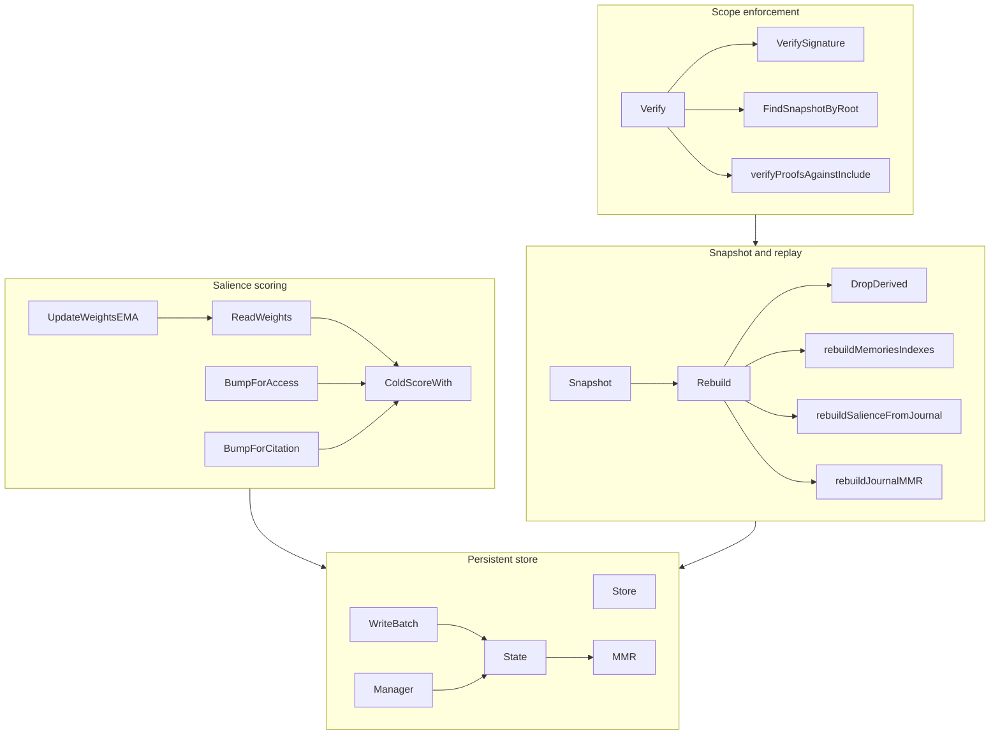
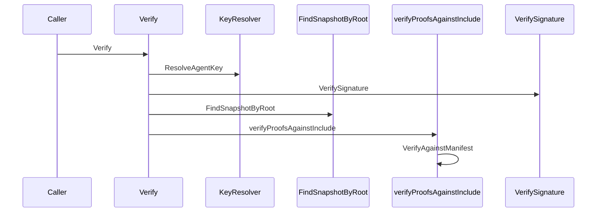
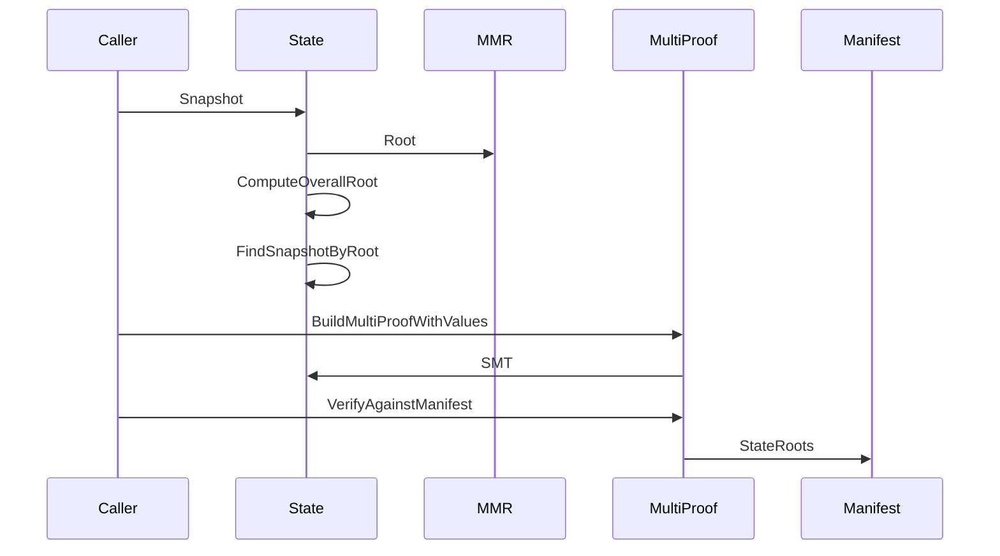
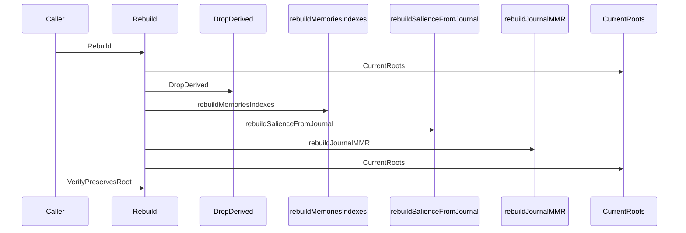

# Cortex Salience Feature Documentation

## Overview

Cortex salience is the ranking and historical reconstruction layer for memories. It maintains a cached per-memory score, updates that score when memories are read, cited, updated, or tombstoned, and learns per-actor weight sets from journaled attest history.

The same section also contains the scope gate used by sub-agents, the snapshot and Merkle machinery that anchors replay, the replay primitives that drop and rebuild derived keys, and the Pebble-backed store layer that makes those mutations atomic. Together, these pieces preserve the canonical `store/` state while allowing derived salience and history views to be recomputed deterministically.

## Architecture Overview

## Salience Scoring and Learned Weights

*`cortex/salience/salience.go`, `cortex/salience/salience_test.go`*

This package computes the cached salience record stored at `salience/<id>`, and it also owns the per-actor learned weight set stored at `meta/salience_weights`. The cache is intentionally separate from live ranking: the cached score is updated by write and replay helpers, while live ranking uses `ColdScoreWith` together with the current learned `Weights`.

### Data Structures

#### `Weights`

| Property | Type | Description |
| --- | --- | --- |
| `SchemaVersion` | `uint8` | Wire-format version for the learned weight record. |
| `UpdatedAt` | `int64` | Replay and audit timestamp in Unix nanoseconds. |
| `Updates` | `uint64` | Number of successful EMA updates applied. |
| `WR` | `float32` | Recency weight. |
| `WA` | `float32` | Access weight. |
| `WC` | `float32` | Citation weight. |
| `WD` | `float32` | Declared importance weight. |
| `WV` | `float32` | Vector similarity weight. |

#### `Score`

| Property | Type | Description |
| --- | --- | --- |
| `SchemaVersion` | `uint8` | Wire-format version for the salience cache record. |
| `LastUsed` | `int64` | Unix nanoseconds for the most recent touch used by recency scoring. |
| `AccessCount` | `uint64` | Access counter used by the `A(m)` factor. |
| `Citations` | `uint64` | Citation counter used by the `C(m)` factor. |
| `Importance` | `uint8` | Mirrors the memory’s declared importance. |
| `Pinned` | `bool` | Applies the pinned floor in `ColdScoreWith`. |
| `Cached` | `float32` | Cached cold-formula score. |
| `ComputedAt` | `int64` | Unix nanoseconds when `Cached` was last recomputed. |

### Constants and scoring contract

- `SchemaVersion` for `Score` is `1`.
- `WeightsSchemaVersion` is `1`.
- `EMARate` is `0.05`.
- `HalfLifeNanos` is `90 days` expressed in nanoseconds.
- `PinnedFloor` is `0.7`.
- `AccessSaturation` is `1000.0`.
- Cold weights are `WR = 0.25`, `WA = 0.15`, `WC = 0.30`, `WD = 0.20`, `WV = 0.10`.

The cold score uses:

- recency decay from `LastUsed`
- logarithmic saturation for access and citations
- declared importance scaled into `[0,1]`
- pinned floor enforcement
- renormalization of the non-vector weights when vector gating is off

### Public functions

| Function | Description |
| --- | --- |
| `DefaultWeights` | Returns the cold-start `Weights` value. |
| `EncodeWeights` | Encodes `Weights` to canonical CBOR. |
| `DecodeWeights` | Decodes canonical CBOR into `Weights`. |
| `ReadWeights` | Reads the learned weight set from `meta/salience_weights`, falling back to `DefaultWeights` when absent. |
| `Encode` | Encodes a `Score` to canonical CBOR. |
| `Decode` | Decodes canonical CBOR into a `Score`. |
| `ColdScore` | Computes the cold salience score using the default weights. |
| `ColdScoreWith` | Computes the cold salience score using supplied weights. |
| `UpdateWeightsEMA` | Applies a single EMA step to a `Weights` value. |
| `NewForWrite` | Builds an initial `Score` for a freshly written memory. |
| `BumpForUpdate` | Refreshes a `Score` after memory content changes. |
| `BumpForAccess` | Increments `AccessCount`, advances `LastUsed`, and recomputes `Cached`. |
| `BumpForCitation` | Increments `Citations` and `AccessCount`, advances `LastUsed`, and recomputes `Cached`. |
| `DecrementCitation` | Decrements `Citations` with floor-at-zero semantics and recomputes `Cached`. |
| `ZeroForTombstone` | Collapses the cached value to zero for tombstoned memories. |
| `Read` | Reads a cached salience record from the store. |

### Salience update flow

- `NewForWrite` seeds `LastUsed`, `Importance`, `ComputedAt`, and `Cached`.
- `BumpForAccess` is the late-binding find path signal.
- `BumpForCitation` is the successful attest signal and also increments access.
- `DecrementCitation` is the failed-attest decrement path for factual error and wrong assumption reasons.
- `ZeroForTombstone` preserves the factor inputs while clearing the cached value, which keeps replay reconstruction faithful.

`UpdateWeightsEMA` is the learned-weight path:

1. It averages the factor profile across cited memories.
2. It normalizes the averaged profile.
3. It nudges `WR`, `WA`, `WC`, and `WD` toward or away from that profile.
4. It preserves `WV` during the factor update.
5. It renormalizes the full five-weight sum and stamps `UpdatedAt` and `Updates`.

### Test coverage

| Test | Verifies |
| --- | --- |
| `TestColdScoreFreshHighImportance` | Fresh high-importance memory scores above a low threshold and stays within `[0,1]`. |
| `TestRecencyDecays` | Recency uses the documented exponential decay curve. |
| `TestPinnedFloor` | Pinned memories do not fall below the pinned floor. |
| `TestCitationsDominate` | Citation growth increases score when other factors are equal. |
| `TestImportanceMonotone` | Higher declared importance does not lower the score. |
| `TestEncodeDeterministic` | CBOR encoding is byte-stable and round-trips correctly. |
| `TestZeroForTombstone` | Tombstone zeroing preserves factor inputs. |
| `TestBumpForUpdate` | Update bumps advance time and refresh importance. |
| `TestColdScoreClamps` | Pathological inputs still clamp into `[0,1]`. |
| `TestBumpForAccess` | Access bump increments access and recomputes the cache. |
| `TestBumpForAccessSaturates` | Access count does not wrap at `math.MaxUint64`. |
| `TestBumpForCitation` | Citation bump increments both citation and access counts. |
| `TestDecrementCitation` | Citation decrement floors at zero and leaves access unchanged. |
| `TestCitationsBumpDominatesCachedScore` | Repeated citation bumps increase the cached score. |
| `TestDefaultWeightsSum` | Cold weights sum to `1.0`. |
| `TestEncodeWeightsDeterministic` | Learned weights encode deterministically and round-trip. |
| `TestColdScoreWithDefaultEqualsColdScore` | The default-weight helper matches the delegated cold-score path exactly. |
| `TestColdScoreWithLearnedWeightsRanks` | Learned weights can change ranking order. |
| `TestUpdateWeightsEMA_Success` | Successful EMA updates move weights toward the cited profile. |
| `TestUpdateWeightsEMA_Failure` | Failure-mode EMA updates move weights away from the cited profile. |
| `TestUpdateWeightsEMA_Degenerate` | All-zero factor profiles are treated as a no-op. |
| `TestUpdateWeightsEMA_EmptyCited` | Empty cited lists are a no-op. |
| `TestUpdateWeightsEMA_Renormalize` | Repeated updates preserve the sum-to-one invariant. |

## Scope Matching and Verification

*`cortex/scope/scope.go`, `cortex/scope/match.go`, `cortex/scope/verify.go`, `cortex/scope/errors.go`, `cortex/scope/scope_test.go`*

The scope package is the cryptographic read and write boundary for sub-agent access. It binds an actor, a pinned snapshot root, inclusion and exclusion selectors, an optional multi-proof, expiry, a writable flag, and an ed25519 signature.

### Data Structures

#### `Scope`

| Property | Type | Description |
| --- | --- | --- |
| `SchemaVersion` | `uint8` | Wire-format version mixed into the signed bytes. |
| `Actor` | `string` | Actor whose cortex the scope authorizes. |
| `SnapshotHash` | `[32]byte` | Pinned `OverallRoot` used for snapshot resolvability. |
| `Include` | `Selector` | Allow list selector. |
| `Exclude` | `Selector` | Deny list selector applied after `Include`. |
| `Proofs` | `*snapshot.MultiProof` | Optional key bundle for `Include.IDs`. |
| `ExpiresAt` | `time.Time` | Expiry wall-clock. |
| `BudgetTokens` | `int` | Optional context budget cap. |
| `GrantedBy` | `string` | Parent agent reference used for signature verification. |
| `GrantedTo` | `string` | Child agent reference carried for audit. |
| `Writable` | `bool` | Enables write-path enforcement. |
| `Signature` | `[]byte` | ed25519 signature over the unsigned CBOR bytes. |

#### `Selector`

| Property | Type | Description |
| --- | --- | --- |
| `Types` | `[]memory.Type` | Type allow list. |
| `Tags` | `[]memory.Tag` | Tag allow list. |
| `IDs` | `[]memory.ID` | Memory ID allow list. |
| `Frame` | `*FrameFilter` | Optional frame-based allow list. |

#### `FrameFilter`

| Property | Type | Description |
| --- | --- | --- |
| `Verb` | `memory.Verb` | Required verb. |
| `ObjHashes` | `[][memory.ObjHashSize]byte` | Allowed object hashes. |

#### `VerifyOpts`

| Property | Type | Description |
| --- | --- | --- |
| `Now` | `time.Time` | Wall clock used for expiry checks. |
| `SkipSnapshotResolution` | `bool` | Skips the snapshot root lookup when set. |

#### `KeyResolver`

| Method | Description |
| --- | --- |
| `ResolveAgentKey` | Resolves a `GrantedBy` ref to an ed25519 public key. |

### Public functions and methods

| Function or method | Description |
| --- | --- |
| `EncodeScope` | Encodes a signed `Scope` to canonical CBOR. |
| `DecodeScope` | Decodes canonical CBOR into `Scope`. |
| `UnsignedBytes` | Encodes the scope with `Signature` cleared for signing and verification. |
| `Sign` | Writes the ed25519 signature into `Signature`. |
| `VerifySignature` | Verifies `Signature` against the resolved public key. |
| `Verify` | Runs the full scope verification chain. |
| `Matches` | Checks whether a `Selector` matches a `memory.Head`. |
| `IsEmpty` | Reports whether a `Selector` has any populated criteria. |
| `Allows` | Checks include minus exclude permission for a memory head. |

### Verification chain

`Verify` performs these checks in order:

1. `SchemaVersion` must match the package constant.
2. `Include` must not be empty.
3. `Now` must not be after `ExpiresAt`, unless `ExpiresAt` is zero.
4. `GrantedBy` must resolve through `KeyResolver`.
5. `VerifySignature` must succeed.
6. `SnapshotHash` must resolve to a persisted snapshot manifest unless `SkipSnapshotResolution` is set.
7. If `Proofs` is present, it must match `Include.IDs` exactly and verify against the resolved manifest.

`Selector.Matches` uses set-union semantics across populated criteria:

- `Types`
- `Tags`
- `IDs`
- `Frame`

`Scope.Allows` applies `Include` first and then `Exclude`. Tombstoned memories are not handled here; the read path filters them before this check.

### Sentinel errors

*`cortex/scope/errors.go`*

| Error | Meaning |
| --- | --- |
| `ErrSchemaVersion` | Scope schema version does not match the current package version. |
| `ErrSignatureInvalid` | Signature verification failed. |
| `ErrScopeExpired` | Scope expired before verification time. |
| `ErrSnapshotUnresolved` | Snapshot hash did not resolve to any persisted manifest. |
| `ErrProofMismatch` | Multi-proof shape or key-hash validation failed. |
| `ErrActorMismatch` | Actor identity does not match the store actor. |
| `ErrEmptyInclude` | The include selector is empty. |
| `ErrViolation` | A memory was outside scope or hit the deny selector. |
| `ErrNotWritable` | The scope is not writable for write-path enforcement. |
| `ErrUnknownAgent` | The granter reference could not be resolved to a public key. |
| `ErrBudgetExceeded` | Requested budget exceeds the scope cap. |

### Scope verification flow

### Test coverage

| Test | Verifies |
| --- | --- |
| `TestSelectorEmpty` | Empty selectors do not match. |
| `TestSelectorTypeMatch` | Type matching uses the type set. |
| `TestSelectorTagMatch` | Tag matching uses exact tag equality. |
| `TestSelectorIDMatch` | ID matching uses direct ID equality. |
| `TestSelectorFrameMatch` | Frame matching uses verb plus object hash. |
| `TestScopeAllowsIncludeMinusExclude` | Allow and deny selectors combine as include minus exclude. |
| `TestEncodeDecodeRoundTrip` | Signed scopes encode and decode correctly. |
| `TestUnsignedBytesIgnoresSignatureField` | The signature field is excluded from the signed byte stream. |
| `TestSignAndVerifyRoundTrip` | Signing and verification succeed for matching keys. |
| `TestVerifySignatureRejectsTamperedField` | Tampering breaks signature verification. |
| `TestVerifySignatureRejectsWrongPubkey` | Wrong public keys are rejected. |
| `TestVerifyHappyPath` | Full verification succeeds when all gates pass. |
| `TestVerifyRejectsExpiredScope` | Expired scopes fail verification. |
| `TestVerifyRejectsUnresolvableSnapshot` | Unresolvable snapshot roots fail verification. |
| `TestVerifyRejectsEmptyInclude` | Empty include selectors are rejected. |
| `TestVerifyRejectsUnknownAgent` | Unknown `GrantedBy` references fail verification. |
| `TestVerifyRejectsBadSchemaVersion` | Schema mismatches are rejected. |
| `TestVerifyHonoursSkipSnapshotResolution` | Snapshot lookup can be skipped for replay tooling. |

## Snapshot Roots, MMRs, and Multi Proofs

*`cortex/snapshot/snapshot.go`, `cortex/snapshot/errors.go`, `cortex/snapshot/mmr.go`, `cortex/snapshot/multiproof.go`, `cortex/snapshot/snapshot_test.go`, `cortex/snapshot/mmr_test.go`, `cortex/snapshot/multiproof_test.go`*

This package anchors replay. It holds the journal accumulator, the per-namespace sparse Merkle trees, the snapshot manifest, and the multi-proof format used by scopes.

### Core constants and contracts

- `AnchoredNamespaces` are fixed to `edges` and `memories`.
- `OverallRootDomain` commits the snapshot root to the schema version and the anchored namespaces.
- `TriggerCompile`, `TriggerAttest`, `TriggerPeriodic`, and `TriggerExplicit` are the manifest trigger labels.
- `EmptyMMRRoot` is the canonical root for an empty journal accumulator.

### Data Structures

#### `PebbleBatchSetter`

| Property | Type | Description |
| --- | --- | --- |
| `b` | `*pebble.Batch` | Underlying Pebble batch adapter. |

#### `Counters`

| Property | Type | Description |
| --- | --- | --- |
| `Memories` | `uint64` | Memory count at snapshot time. |
| `Edges` | `uint64` | Forward edge count at snapshot time. |
| `Tombstoned` | `uint64` | Tombstoned memory count. |

#### `Manifest`

| Property | Type | Description |
| --- | --- | --- |
| `SchemaVersion` | `uint8` | Manifest wire-format version. |
| `Actor` | `string` | Actor name. |
| `SeqAtSnapshot` | `uint64` | Snapshot sequence counter. |
| `JournalSeq` | `uint64` | Journal leaf count covered by the snapshot. |
| `JournalRoot` | `[32]byte` | Journal MMR root. |
| `StateRoots` | `map[string][32]byte` | Anchored namespace roots. |
| `OverallRoot` | `[32]byte` | Combined snapshot root. |
| `CreatedAt` | `int64` | Unix nanoseconds when the snapshot was taken. |
| `Trigger` | `string` | Snapshot trigger label. |
| `SignedBy` | `string` | Optional signer metadata. |
| `Signature` | `[]byte` | Optional manifest signature. |
| `Counters` | `Counters` | Snapshot counters. |

#### `State`

| Property | Type | Description |
| --- | --- | --- |
| `s` | `*store.Store` | Backing Pebble store. |
| `mmr` | `*MMR` | Journal accumulator handle. |
| `smts` | `map[string]*SMT` | Namespace tree handles keyed by namespace. |

#### `MMR`

| Property | Type | Description |
| --- | --- | --- |
| `s` | `*store.Store` | Backing store. |

#### `MultiProof`

| Property | Type | Description |
| --- | --- | --- |
| `SchemaVersion` | `uint8` | Multi-proof wire-format version. |
| `Root` | `[32]byte` | Snapshot root the proofs were built against. |
| `Proofs` | `[]MembershipProof` | Flat bundle of membership proofs. |

#### `MultiProofItem`

| Property | Type | Description |
| --- | --- | --- |
| `KeyHash` | `[32]byte` | Key hash for the membership or non-membership proof. |
| `Canonical` | `[]byte` | Canonical value bytes, or nil for a non-membership proof. |

### Public functions and methods

| Function or method | Description |
| --- | --- |
| `NewPebbleBatchSetter` | Wraps a `*pebble.Batch` with the snapshot staging interface. |
| `Set` | Stages a key/value write onto the wrapped batch. |
| `Delete` | Stages a deletion onto the wrapped batch. |
| `GetBatched` | Reads staged data from the batch first, then falls back to the store. |
| `EncodeManifest` | Encodes a snapshot manifest to canonical CBOR. |
| `DecodeManifest` | Decodes canonical CBOR into a manifest. |
| `ComputeOverallRoot` | Computes the overall root from the journal root and sorted namespace roots. |
| `Store` | Returns the backing store from `State`. |
| `MMR` | Returns the journal accumulator handle from `State`. |
| `SMT` | Returns the namespace tree handle for a given namespace. |
| `StageJournalLeaf` | Stages one journal leaf onto the accumulator. |
| `MMRHook` | Returns a store journal hook that appends an MMR leaf for each journal entry. |
| `StageMemoryUpdate` | Stages a memory SMT update. |
| `StageEdgeUpdate` | Stages an edge SMT update. |
| `CurrentRoots` | Returns journal, state, and overall roots for the current committed store. |
| `Snapshot` | Builds and persists a manifest under `snap/<seq>`. |
| `LoadSnapshot` | Loads a persisted manifest by sequence. |
| `IterSnapshots` | Iterates persisted snapshots in sequence order. |
| `FindSnapshotByRoot` | Finds the persisted manifest whose `OverallRoot` matches a target hash. |
| `NewMMR` | Constructs an `MMR` bound to a store. |
| `LeafCount` | Reads the persisted journal leaf count. |
| `Node` | Reads an MMR node by position. |
| `StageAppend` | Stages a new journal leaf and any required merge nodes. |
| `Root` | Reconstructs the current journal MMR root from persisted nodes. |
| `Reset` | Clears the persisted MMR state. |
| `EncodeMultiProof` | Encodes a multi-proof to canonical CBOR. |
| `DecodeMultiProof` | Decodes canonical CBOR into a multi-proof. |
| `BuildMultiProof` | Builds one proof per key hash against the current namespace root. |
| `BuildMultiProofWithValues` | Builds one proof per item and fills `ValueHash` from canonical bytes when available. |
| `Verify` | Verifies every proof against the bundle root. |
| `VerifyAgainstManifest` | Verifies the bundle root against the manifest’s namespace root before checking the proofs. |

### MMR behavior

`MMR.StageAppend`:

- appends the leaf at the next free position
- merges with equal-height siblings in the same order as the journal grows
- persists the leaf count in the same batch
- uses batched reads when the setter supports them, so in-flight journal batches can stage and then read sibling nodes safely

`MMR.Root`:

- reads the current leaf count
- gathers peak positions
- folds peaks right-to-left with `hashMMRBag`
- wraps the result with `hashMMRRoot(leafCount, bag)`

`MMR.Reset`:

- deletes all `accum/mmr/n/` keys
- deletes the leaf-count key

### Manifest and root behavior

`Snapshot`:

- reads current roots
- counts memories, edges, and tombstones
- allocates a new snapshot sequence through `meta/snapshot_seq`
- persists the manifest under `snap/<seq>`

`ComputeOverallRoot`:

- sorts namespace names
- hashes the domain string
- hashes the schema version
- hashes the journal root
- commits to the namespace count
- length-prefixes each namespace name before hashing its root

`FindSnapshotByRoot`:

- scans persisted snapshots
- returns the first manifest whose `OverallRoot` matches the requested hash
- is the lookup that scope verification uses to prove snapshot resolvability

### Multi-proof behavior

`BuildMultiProof` and `BuildMultiProofWithValues`:

- target one anchored namespace
- collect one proof per key
- pin the namespace root into the bundle
- return `ErrUnknownNamespace` when the namespace is not anchored

`VerifyAgainstManifest`:

- checks that the manifest has a root for the bundle namespace
- checks that the manifest root equals the bundle root
- then verifies each proof independently

### Snapshot and proof flow

### Error sentinels

*`cortex/snapshot/errors.go`*

| Error | Meaning |
| --- | --- |
| `ErrNodeMissing` | An MMR node position was queried before it was persisted. |
| `ErrUnknownNamespace` | A namespace is not anchored. |
| `ErrInvalidProof` | A proof is structurally malformed or fails verification. |
| `ErrSnapshotNotFound` | A requested snapshot sequence or root was not found. |
| `ErrNamespaceMismatch` | A multi-proof namespace does not line up with the manifest. |

### Test coverage

| Test | Verifies |
| --- | --- |
| `TestStateEmptyRoots` | Empty state produces the empty journal root and empty namespace roots. |
| `TestStateSnapshotPersists` | Snapshot manifests are persisted and reload correctly. |
| `TestStateSnapshotSeqMonotonic` | Snapshot sequence allocation advances monotonically. |
| `TestComputeOverallRootDeterministic` | Overall root computation is order-independent. |
| `TestComputeOverallRootCommitsToJournalRoot` | The overall root changes when the journal root changes. |
| `TestComputeOverallRootCommitsToNamespaceRoots` | The overall root changes when a namespace root changes. |
| `TestStateChangesPropagateToOverallRoot` | Staged state changes alter the overall root. |
| `TestManifestEncodingRoundTrip` | Manifest CBOR round-trips correctly. |
| `TestPeakPositions` | MMR peak enumeration matches the documented positions. |
| `TestMMRSize` | MMR node count matches the closed-form formula. |
| `TestMMRAppendOneLeafRootIsLeafWrappedWithCount` | A single leaf produces the expected root shape. |
| `TestMultiProofBuildAndVerify` | Multi-proof construction and verification succeed. |
| `TestMultiProofVerifyAgainstManifest` | Bundle verification succeeds against a matching manifest. |
| `TestMultiProofRejectsTamperedRoot` | Root tampering fails verification. |
| `TestMultiProofRejectsTamperedValue` | Value-hash tampering fails verification. |
| `TestMultiProofNonMembership` | Non-membership proofs encode and verify correctly. |
| `TestMultiProofUnknownNamespace` | Unknown namespaces are rejected. |
| `TestMultiProofManifestNamespaceMismatch` | Manifest namespace mismatches are rejected. |
| `TestMultiProofManifestRootMismatch` | Manifest root mismatches are rejected. |
| `TestMultiProofEncodeDecodeRoundTrip` | Multi-proofs encode and decode correctly. |
| `TestMultiProofWrongSchemaVersionRejected` | Unknown multi-proof schema versions are rejected. |

## Replay, Drop, and History Rebuild

*`cortex/replay/drop.go`, `cortex/replay/rebuild.go`, `cortex/replay/replay.go`, `cortex/replay/replay_test.go`*

Replay removes derived namespaces and reconstructs them from canonical state. The canonical store is left intact; the replay layer only rewrites derived data such as indices, salience caches, the MMR accumulator, and SMT roots.

### Data structures

#### `Result`

| Property | Type | Description |
| --- | --- | --- |
| `JournalSeq` | `uint64` | Journal head observed at rebuild time. |
| `MemoriesScanned` | `uint64` | Number of memory heads re-emitted. |
| `EdgesScanned` | `uint64` | Number of edges re-emitted. |
| `JournalLeavesAppended` | `uint64` | Number of journal leaves staged back into the MMR. |
| `PreOverallRoot` | `[32]byte` | Root captured before dropping derived data. |
| `PostOverallRoot` | `[32]byte` | Root captured after rebuild. |
| `SalienceBumpsApplied` | `uint64` | Number of replayed salience bump pairs. |

#### `Options`

| Property | Type | Description |
| --- | --- | --- |
| `Now` | `func() time.Time` | Clock used during salience recomputation. |
| `Logf` | `func(format string, args ...any)` | Progress logger for rebuild phases. |

### Public functions

| Function | Description |
| --- | --- |
| `DropDerived` | Deletes the derived key prefixes and single derived meta keys. |
| `CountDerived` | Counts derived keys under the replay namespace set. |
| `Rebuild` | Executes the full drop and rebuild cycle. |
| `VerifyPreservesRoot` | Verifies that pre- and post-rebuild roots are equal. |
| `VerifyAgainstSnapshot` | Verifies post-rebuild root equality against a persisted snapshot manifest. |

### Derived key contract

`drop.go` distinguishes canonical and derived namespaces:

- derived prefixes are dropped:- `vec/`
- `idx/`
- `salience/`
- `accum/`
- single derived meta keys are deleted individually:- `meta/embed_cursor`
- `meta/embed_vertex_next`
- `meta/embed_model`
- `meta/salience_weights`

The canonical namespaces are not modified:

- `m/`
- `mv/`
- `e/`
- `j/`
- `tomb/`
- `snap/`
- `chk/`
- `meta/journal_head`
- `meta/snapshot_seq`

### Rebuild phases

`Rebuild` runs these phases in order:

1. capture `PreOverallRoot`
2. `DropDerived`
3. `rebuildMemoriesIndexes`
4. `rebuildEdgesSMT`
5. `rebuildSalienceFromJournal`
6. `rebuildJournalMMR`
7. capture `PostOverallRoot`

`VerifyPreservesRoot` checks the strongest invariant: the root before the drop matches the root after the rebuild.

`VerifyAgainstSnapshot` checks the replay result against the persisted snapshot manifest root.

### Rebuild helpers

| Helper | Behavior |
| --- | --- |
| `rebuildMemoriesIndexes` | Replays `m/<id>` heads into `idx/type`, `idx/tag`, `idx/frame`, `idx/actor_obj`, salience, and the memories SMT. |
| `rebuildOneMemory` | Rebuilds one memory’s derived keys using the immutable `mv/<id>/v/1.CreatedAt` timestamp. |
| `rebuildSalienceFromJournal` | Replays `KindFind`, `KindAttest`, and `KindLearnWeights` journal entries into salience state and learned weights. |
| `applySalienceBumps` | Reads, mutates, and writes `salience/<id>` entries with tombstone and missing-key skipping. |
| `applyLearnWeights` | Writes `meta/salience_weights` using the journaled learned weights. |
| `rebuildEdgesSMT` | Replays forward edges into the edges SMT only. |
| `rebuildJournalMMR` | Replays `j/<seq>` entries into the journal MMR in seq order. |
| `readVersion` | Reads a specific `mv/<id>/v/<version>` record. |
| `toKeysULID` | Converts `memory.ID` into `keys.ULID` for key generation. |
| `hashTag` | Derives the tag bucket hash used for `idx/tag`. |
| `journalLeafHash` | Wraps `journal.LeafHash` for replay symmetry. |

### Replay behavior details

`rebuildMemoriesIndexes`:

- pre-scans `m/` heads so the rebuild can read canonical bytes without racing the iterator snapshot
- uses `mv/<id>/v/1.CreatedAt` to recover the original created timestamp used by `idx/type` and `idx/tag`
- writes `idx/frame` for every frame
- writes `idx/actor_obj` only for `memory.TypeEvent`
- seeds salience with a fresh cold score and tombstone-zeroes it when necessary

`rebuildSalienceFromJournal`:

- replays `journal.KindFind` as access bumps
- replays successful `journal.KindAttest` as citation bumps
- replays failure decrements only for the factual-error and wrong-assumption reasons
- replays `journal.KindLearnWeights` unless the payload was marked skipped

`applySalienceBumps`:

- skips missing memories
- skips tombstoned memories
- creates a fresh salience score when the record is absent
- commits one batch per journal entry

`rebuildJournalMMR`:

- walks `j/` in ascending sequence order
- verifies the gap-free invariant
- stages one leaf per journal entry
- commits after each leaf so sibling reads remain correct

### Replay flow

### Test coverage

| Test | Verifies |
| --- | --- |
| `TestDropDerivedRemovesAll` | Derived prefixes and single derived keys are removed. |
| `TestDropDerivedKeepsCanonical` | Canonical namespaces are preserved byte-for-byte. |
| `TestDropDerivedIdempotent` | Repeating the drop is safe. |
| `TestRebuildEmptyStoreReproducesEmptyRoot` | Empty replay reproduces the empty root and passes the root-preservation check. |
| `TestVerifyPreservesRootMismatch` | Root mismatches are surfaced by `VerifyPreservesRoot`. |
| `TestJournalLeafHashMatchesPackage` | Replay leaf hashing matches the journal package’s leaf hash. |

## Store and Journal Atomicity

*`cortex/store/store.go`, `cortex/store/writebatch.go`, `cortex/store/store_test.go`*

The store package is the Pebble-backed journal and key-value persistence layer. It enforces per-actor isolation, journal sequence monotonicity, and atomic write batches that keep journal entries and derived state in sync.

### Data Structures

#### `Options`

| Property | Type | Description |
| --- | --- | --- |
| `Pebble` | `*pebble.Options` | Optional Pebble tuning overrides. |

#### `Store`

| Property | Type | Description |
| --- | --- | --- |
| `actor` | `string` | Actor name used in the on-disk layout. |
| `root` | `string` | Root directory that contains the actor subtree. |
| `db` | `*pebble.DB` | Backing Pebble database. |
| `seqMu` | `sync.Mutex` | Serializes journal sequence allocation. |
| `nextSeq` | `uint64` | Next journal sequence to allocate. |
| `journalHook` | `JournalHook` | Optional hook invoked after staging journal data. |

#### `WriteBatch`

| Property | Type | Description |
| --- | --- | --- |
| `s` | `*Store` | Owning store. |
| `pb` | `*pebble.Batch` | Underlying indexed Pebble batch. |
| `startSeq` | `uint64` | First sequence reserved for the batch. |
| `nextSeq` | `uint64` | Next sequence to allocate within the batch. |
| `lastSeq` | `uint64` | Most recently appended sequence in the batch. |
| `appendCount` | `int` | Number of journal appends in the batch. |
| `leafHash` | `[32]byte` | Leaf hash from the most recent append. |
| `closed` | `bool` | Tracks whether the batch has been committed or aborted. |

### Public functions and methods

| Function or method | Description |
| --- | --- |
| `Open` | Opens a store rooted under `<root>/<actor>/store`. |
| `Close` | Closes the backing Pebble database. |
| `Actor` | Returns the actor name. |
| `Path` | Returns the actor directory path. |
| `DB` | Returns the backing Pebble handle. |
| `SetJournalHook` | Installs or removes the journal hook. |
| `NextSeq` | Returns the next journal sequence. |
| `AppendJournal` | Appends a journal entry in its own atomic batch. |
| `IterJournal` | Iterates the journal in sequence order. |
| `Get` | Reads a key and clones the returned bytes. |
| `PrefixIter` | Iterates a prefix in byte order. |
| `JournalCount` | Returns the current journal entry count. |
| `SetMeta` | Writes a `meta/` key synchronously. |
| `DeleteMeta` | Deletes a `meta/` key synchronously. |
| `BeginWrite` | Opens a new atomic batch and reserves a sequence range. |
| `Seq` | Returns the most recent journal sequence in the batch. |
| `Set` | Stages a key/value write in the batch. |
| `Delete` | Stages a key deletion in the batch. |
| `AppendJournal` | Appends a journal entry inside the batch. |
| `LeafHash` | Returns the leaf hash for the most recent journal append. |
| `Commit` | Commits the batch and releases the journal sequence lock. |
| `Abort` | Aborts the batch and releases the journal sequence lock. |

### Journal and batch semantics

`Store.Open`:

- validates the actor name
- creates `<root>/<actor>/store`
- opens Pebble there
- loads `meta/journal_head` into `nextSeq`

`Store.AppendJournal`:

- encodes the entry
- writes `j/<seq>`
- updates `meta/journal_head`
- calls the journal hook, if installed
- commits atomically

`WriteBatch.BeginWrite`:

- locks `seqMu`
- creates an indexed Pebble batch
- reserves the current `nextSeq` as `startSeq`

`WriteBatch.AppendJournal`:

- can be called multiple times
- allocates consecutive sequences
- stages `j/<seq>` and `meta/journal_head`
- invokes the journal hook per append
- increments the batch-local append count

`WriteBatch.Commit`:

- rejects empty batches with `ErrBatchNoJournal`
- persists the batch with Pebble sync
- advances `nextSeq` on success

`WriteBatch.Abort`:

- is safe after `Commit`
- is the standard deferred cleanup path

### Support contract

The `JournalHook` is the bridge to the snapshot layer. It is invoked after the journal leaf hash is known, but before commit, so the journal accumulator can be updated inside the same atomic batch.

### Test coverage

| Test | Verifies |
| --- | --- |
| `TestOpenAndClose` | Fresh stores open cleanly and start at sequence zero. |
| `TestOpenRejectsBadActor` | Actor names containing `/` are rejected. |
| `TestAppendJournalAndIterate` | Journal appends are sequenced, persisted, and iterable. |
| `TestJournalHeadPersistsAcrossReopen` | `meta/journal_head` survives reopen and continues sequence allocation. |
| `TestPerActorIsolation` | Separate actors do not share journal state or DB paths. |

## Executor Snapshot Manager

*`executor/internal/snapshot/snapshot.go`, `executor/internal/snapshot/snapshot_test.go`*

This package is operational support for daemon state transport. It archives a machine data directory into a zstd-compressed tarball, stores it under a user-specific object prefix, and restores that snapshot on boot when the local seeded sentinel is missing.

### Data Structures

#### `Config`

| Property | Type | Description |
| --- | --- | --- |
| `DataDir` | `string` | Root directory to archive and restore. |
| `Endpoint` | `string` | S3-compatible endpoint URL. |
| `Bucket` | `string` | Object store bucket name. |
| `AccessKey` | `string` | Optional access key. |
| `SecretKey` | `string` | Optional secret key. |
| `UserID` | `string` | User namespace used in remote object keys. |
| `PushInterval` | `time.Duration` | Periodic push interval. |
| `Logf` | `func(event string, fields map[string]interface{})` | Optional lifecycle logger. |
| `Now` | `func() time.Time` | Optional testable clock. |

#### `Manager`

| Property | Type | Description |
| --- | --- | --- |
| `cfg` | `Config` | Runtime configuration. |
| `pushMu` | `sync.Mutex` | Serializes concurrent pushes. |
| `stopCh` | `chan struct{}` | Signals the ticker goroutine to stop. |
| `doneCh` | `chan struct{}` | Closed when the ticker goroutine exits. |
| `startOnce` | `sync.Once` | Prevents duplicate ticker startup. |
| `stopOnce` | `sync.Once` | Prevents duplicate shutdown. |
| `mcEnv` | `string` | Prebuilt `MC_HOST_matrixsnap` value. |

### Public functions and methods

| Function or method | Description |
| --- | --- |
| `New` | Validates the configuration and builds a `Manager`. |
| `remotePath` | Builds the object store path for a key. |
| `userPrefix` | Builds `users/<UserID>`. |
| `log` | Emits lifecycle events when a logger is configured. |
| `runMC` | Executes `mc` with the configured environment. |
| `SeededPath` | Returns the absolute sentinel path. |
| `IsSeeded` | Checks whether the sentinel exists. |
| `markSeeded` | Creates the sentinel file and parent directory. |
| `BootPull` | Restores the latest user snapshot when the sentinel is missing. |
| `Push` | Archives the data directory and uploads both versioned and latest objects. |
| `Start` | Starts the periodic push ticker. |
| `tick` | Runs the ticker loop until shutdown or context cancellation. |
| `Stop` | Stops the ticker and performs a final push. |
| `tarZst` | Creates a zstd-compressed tarball. |
| `untarZst` | Extracts a zstd-compressed tarball. |

### Lifecycle behavior

`New`:

- requires `DataDir`, `Endpoint`, `Bucket`, and `UserID`
- parses the endpoint URL
- constructs `MC_HOST_matrixsnap`
- preserves anonymous access when credentials are empty

`BootPull`:

- no-ops when the seeded sentinel already exists
- pulls `users/<UserID>/latest.tar.zst` when a snapshot exists
- marks the directory as seeded after a fresh-start miss
- extracts the archive into `DataDir`

`Push`:

- archives `DataDir`
- uploads `users/<UserID>/snapshots/<timestamp>.tar.zst`
- updates `users/<UserID>/latest.tar.zst` through a server-side copy

`Start`:

- uses `DefaultPushInterval` when `PushInterval` is zero
- disables periodic pushes when `PushInterval` is negative
- starts one ticker only

`Stop`:

- closes the ticker
- waits for shutdown
- performs one last push

### Test coverage

| Test | Verifies |
| --- | --- |
| `TestNewIncomplete` | Missing required config fields are surfaced in the error message. |
| `TestNewMalformedEndpoint` | Invalid endpoint URLs are rejected. |
| `TestSeededSentinelLifecycle` | Sentinel creation and seeded-state detection work correctly. |
| `TestMCEnvComposition` | The `mc` environment string is built correctly, including credential escaping. |
| `TestRemotePathLayout` | The remote object key layout matches the documented prefix. |
