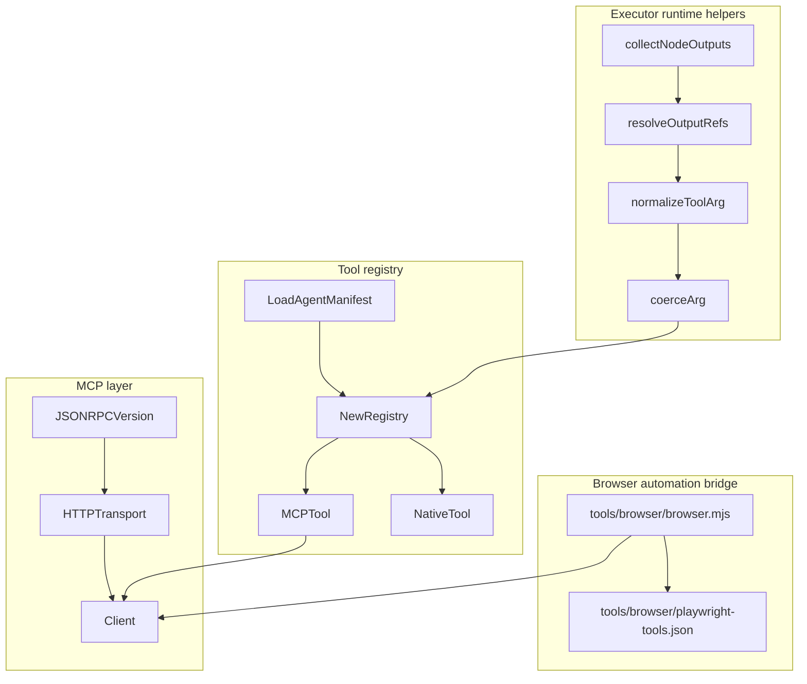
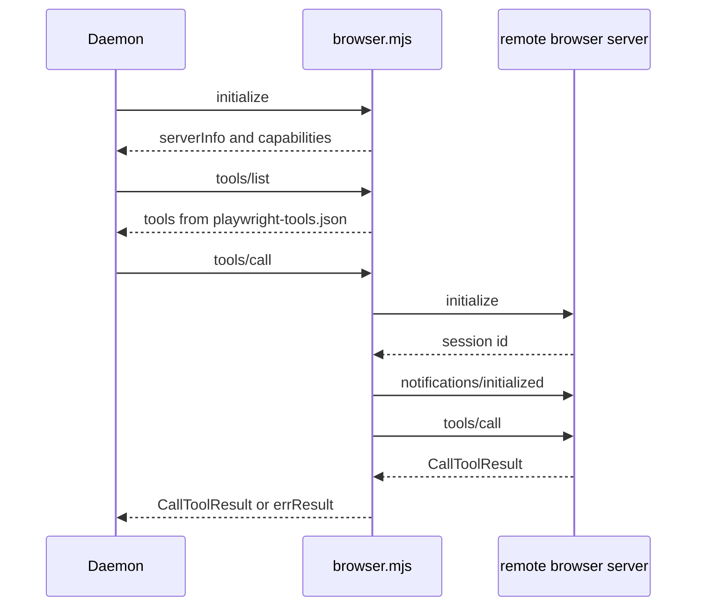
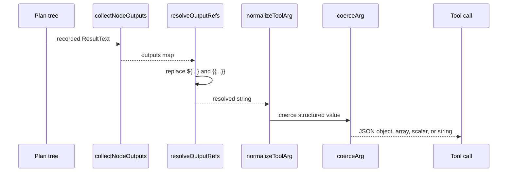
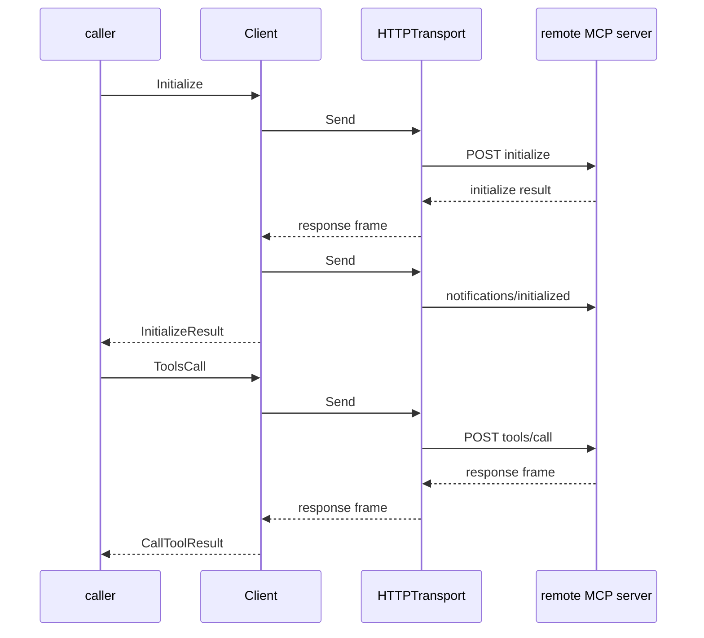
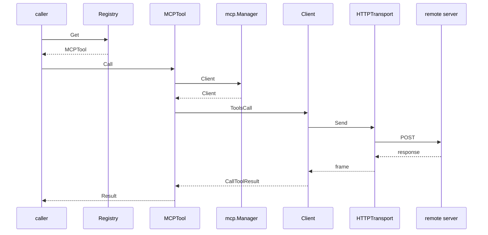

# Deployment, Browser Automation, and Auxiliary Tooling

## Overview

This section covers the support tooling that lets Centra AI agents talk to browser automation, resolve runtime references in tool arguments, and dispatch tools through a manifest-driven MCP registry. The code here sits below the product features: it is the execution and integration layer that keeps browser automation, JSON-RPC transport, and tool lookup deterministic.

The main runtime flow is: the browser proxy exposes a local stdio MCP surface and forwards browser tool calls to a remote Playwright server; the executor runtime resolves `${}` and `{{}}` references before tool invocation; and the tool registry turns version-pinned `matrix://tool/...` URIs into concrete MCP-backed or native tool objects with capability gating and manifest validation.

## Architecture Overview

## Browser Automation Bridge

### `tools/browser/browser.mjs`

*`tools/browser/browser.mjs`*

This file is the local stdio proxy for browser automation. It advertises a static tool list, accepts Centra AI-side JSON-RPC requests on stdin, and forwards browser tool calls to the remote Playwright MCP server over Streamable HTTP.

#### Runtime configuration

| Value | Type | Purpose |
| --- | --- | --- |
| `SERVER_NAME` | string | Reports the local server name as `browser`. |
| `SERVER_VERSION` | string | Reports the proxy version as `0.1.0`. |
| `PROTOCOL_VERSION` | string | Sends `2024-11-05` in remote `initialize` calls. |
| `REMOTE_URL` | string | Remote browser endpoint from `MATRIX_BROWSER_URL`. |
| `REMOTE_TOKEN` | string | Optional bearer token from `MATRIX_BROWSER_TOKEN`. |
| `TIMEOUT_MS` | number | Remote call timeout from `MATRIX_BROWSER_TIMEOUT_MS`, clamped between 2000 and 300000. |

#### What the proxy does

- Loads `./playwright-tools.json` at startup and exits if the registry cannot be read.
- Serves `initialize` locally with `serverInfo` and `capabilities.tools`.
- Serves `tools/list` from the static registry in memory.- rejecting unknown tool names with a structured `isError` result,
- rejecting missing `REMOTE_URL` with a structured `isError` result,
- lazily initializing the remote browser session on first use,
- forwarding `tools/call` to the remote server,
- retrying once after a detected session loss.

#### Remote browser session flow

- `remoteHeaders()` always sets `Content-Type: application/json` and `Accept: application/json, text/event-stream`.
- When `REMOTE_TOKEN` is set, `remoteHeaders()` adds `Authorization: Bearer <token>`.
- When `sessionId` exists, `remoteHeaders()` adds `Mcp-Session-Id`.
- `rpc()` handles POST requests, timeouts, SSE replies, JSON replies, and HTTP failure status codes.
- `ensureRemote()` performs the remote `initialize` and `notifications/initialized` handshake.
- `callRemoteTool()` re-handshakes once if the remote responds with session loss.

#### Helper functions

| Function | Role |
| --- | --- |
| `clampInt` | Parses and clamps an environment variable into a numeric range. |
| `errResult` | Wraps proxy-side failures into `CallToolResult`-shaped JSON with `isError: true`. |
| `remoteHeaders` | Builds outbound headers for the remote browser server. |
| `parseFrame` | Extracts a JSON-RPC message from JSON or SSE content. |
| `rpc` | Sends one remote JSON-RPC request or notification. |
| `safeText` | Reads response text and falls back to an empty string on read failure. |
| `hostOf` | Extracts a display host name from a URL. |
| `ensureRemote` | Initializes and caches the remote session. |
| `callRemoteTool` | Calls a remote Playwright tool and retries after session loss. |
| `send` | Writes a JSON-RPC response line to stdout. |
| `startStdioServer` | Runs the daemon-facing line-oriented JSON-RPC loop. |

#### Browser proxy flow

### `tools/browser/playwright-tools.json`

The proxy is designed to keep daemon boot local and deterministic: initialize and tools/list do not require the remote Playwright server to be reachable, while tools/call does.

*`tools/browser/playwright-tools.json`*

This file is the static registry of Playwright MCP tools advertised by the browser proxy. `browser.mjs` loads it verbatim and uses it as the exact `tools/list` response, so Centra AI sees the same tool set the pinned remote server is expected to expose.

#### File behavior

| Aspect | Details |
| --- | --- |
| Shape | JSON array of tool objects. |
| Required fields | `name`, `description`, `inputSchema`, `annotations`. |
| Purpose | Defines the local tool inventory for browser automation. |
| Usage | Loaded by `browser.mjs` at startup and mirrored into `TOOL_SET`. |

#### Tool inventory visible in the registry

The registry includes browser lifecycle, input, inspection, and debugging tools such as:

- `browser_close`
- `browser_resize`
- `browser_console_messages`
- `browser_handle_dialog`
- `browser_evaluate`
- `browser_file_upload`
- `browser_drop`
- `browser_fill_form`
- `browser_press_key`
- `browser_type`
- `browser_navigate`
- `browser_navigate_back`
- `browser_network_requests`
- `browser_network_request`
- `browser_run_code_unsafe`
- `browser_take_screenshot`
- `browser_snapshot`
- `browser_click`
- `browser_drag`
- `browser_hover`
- `browser_select_option`
- `browser_tabs`
- `browser_wait_for`

Each entry carries schema metadata and annotations such as `readOnlyHint`, `destructiveHint`, and `openWorldHint`, which the proxy forwards as the tool inventory contract.

## Runtime Argument Resolution

### `executor/runtime/argref.go`

*`executor/runtime/argref.go`*

This file resolves references to earlier plan-node outputs before a tool call is built. It supports both `${}` and `{{}}` forms, including dotted suffixes such as `.output`, `.outputs`, `.text`, and named field extraction.

#### Runtime values

| Value | Type | Purpose |
| --- | --- | --- |
| `outputRefPattern` | `*regexp.Regexp` | Matches upstream output references in tool arguments. |
| `wholeOutputSuffixes` | `map[string]bool` | Marks suffixes that mean “use the full node output”. |

#### Helper functions

| Function | Role |
| --- | --- |
| `collectNodeOutputs` | Walks an `ir.PlanTree` and builds a `nodeID -> ResultText` map. |
| `resolveOutputRefs` | Replaces reference tokens with upstream output or a named field. |
| `refField` | Reduces a suffix like `.outputs.project_id` to the requested field name. |
| `extractField` | Pulls a scalar or JSON-encoded value from a recorded node output. |
| `findKey` | Searches nested JSON values depth-first for the first matching key. |

#### Resolution rules

- Whole-output forms return the full recorded `ResultText`.
- Named-field forms search parsed JSON recursively.
- If a named field is absent, the resolver falls back to the whole output.
- Unresolved references stay as the original literal string so strict tool parsers can fail clearly instead of receiving prose.

#### Runtime reference flow

### `executor/runtime/coerce.go`

*`executor/runtime/coerce.go`*

This file converts string-shaped plan arguments into the runtime types expected by MCP tools. It handles booleans, integers, floats, JSON objects, JSON arrays, and fenced code blocks.

#### Helper functions

| Function | Role |
| --- | --- |
| `coerceArg` | Converts a string into a best-effort JSON-friendly Go value. |
| `normalizeToolArg` | Repairs wrapper nesting and fence-wrapped structured values for tool arguments. |
| `unwrapWrapper` | Removes a single-key wrapper whose key repeats the argument name. |
| `decodeEmbeddedJSON` | Finds the first embedded JSON object or array in a prose-wrapped string. |
| `containsCodeFence` | Detects Markdown code fences. |
| `jsonCandidates` | Returns trimmed and fence-stripped parse candidates. |
| `stripCodeFence` | Removes leading and trailing Markdown fences. |
| `isAllDigitsOptSign` | Detects signed integer strings. |
| `hasFloatShape` | Detects floating-point-shaped strings. |

#### Coercion behavior

- `"true"` and `"false"` become booleans.
- Digit strings become `int64`.
- Float-shaped strings become `float64`.
- JSON objects become `map[string]interface{}`.
- JSON arrays become `[]interface{}`.
- Invalid JSON falls through to the original string.
- Fence-wrapped structured output is parsed back into native objects when possible.
- A single-key wrapper like `{"sources": {}}` is unwrapped when the key matches the argument name.

#### Tool argument repair flow

1. `resolveOutputRefs` substitutes upstream values.
2. `normalizeToolArg` decides whether the value is a wrapper or fence-wrapped payload.
3. `coerceArg` parses scalars or JSON containers.
4. The tool receives the final native value.

This is the path that keeps structured tool inputs such as `sources`, `constructor_args`, and other JSON-shaped arguments from arriving as opaque strings.

## MCP Wire Protocol and Client Transport

### `executor/mcp/jsonrpc.go`

*`executor/mcp/jsonrpc.go`*

This file defines the JSON-RPC envelopes and the codec used by the MCP client and HTTP transport.

#### Protocol values and messages

| Name | Type | Role |
| --- | --- | --- |
| `JSONRPCVersion` | constant | Forces `"2.0"` on all outbound frames. |
| `Request` | struct | JSON-RPC request envelope. |
| `Notification` | struct | JSON-RPC notification envelope. |
| `Response` | struct | JSON-RPC response envelope. |
| `RPCError` | struct | JSON-RPC error object. |
| `MessageKind` | type | Classifies inbound frames. |
| `KindRequest` | constant | Inbound request from peer. |
| `KindResponse` | constant | Inbound response to a request. |
| `KindNotification` | constant | Inbound server notification. |
| `rawFrame` | struct | Scratch type used during classification. |

#### Struct properties

| Symbol | Property | Type |
| --- | --- | --- |
| `Request` | `JSONRPC` | `string` |
| `Request` | `ID` | `json.RawMessage` |
| `Request` | `Method` | `string` |
| `Request` | `Params` | `json.RawMessage` |
| `Notification` | `JSONRPC` | `string` |
| `Notification` | `Method` | `string` |
| `Notification` | `Params` | `json.RawMessage` |
| `Response` | `JSONRPC` | `string` |
| `Response` | `ID` | `json.RawMessage` |
| `Response` | `Result` | `json.RawMessage` |
| `Response` | `Error` | `*RPCError` |
| `RPCError` | `Code` | `int` |
| `RPCError` | `Message` | `string` |
| `RPCError` | `Data` | `json.RawMessage` |
| `rawFrame` | `JSONRPC` | `string` |
| `rawFrame` | `ID` | `json.RawMessage` |
| `rawFrame` | `Method` | `string` |
| `rawFrame` | `Params` | `json.RawMessage` |
| `rawFrame` | `Result` | `json.RawMessage` |
| `rawFrame` | `Error` | `*RPCError` |

#### Codec helpers

| Function | Role |
| --- | --- |
| `EncodeRequest` | Serializes a request and stamps `jsonrpc: "2.0"`. |
| `EncodeNotification` | Serializes a notification and stamps `jsonrpc: "2.0"`. |
| `EncodeResponse` | Serializes a response and enforces exactly one of result or error. |
| `Classify` | Parses an inbound frame and returns its message kind. |
| `NewIDInt` | Builds a numeric JSON-RPC id. |
| `NewIDString` | Builds a string JSON-RPC id. |
| `Error` | Formats `RPCError` as a Go error string. |

#### Error handling

- Invalid JSON yields a wrapped parse error.
- Wrong protocol version yields `ErrInvalidVersion`.
- Missing method yields `ErrMissingMethod`.
- Missing request id yields `ErrMissingID`.
- Response frames with both result and error, or neither, yield `ErrAmbiguousResponse`.
- Unknown frame shapes yield `ErrUnknownMessage`.

The codec is intentionally strict so the transport and client can fail fast on malformed server behavior.

### `executor/mcp/http.go`

*`executor/mcp/http.go`*

This file implements the streamable HTTP transport used by the MCP client. It accepts one outbound JSON-RPC frame per POST and buffers the matching inbound response for the next `Recv` call.

#### Runtime configuration

| Field | Type | Purpose |
| --- | --- | --- |
| `Endpoint` | `string` | Absolute MCP server URL. |
| `Headers` | `http.Header` | Headers added to every outbound request. |
| `Timeout` | `time.Duration` | Per-request timeout; zero means 30 seconds. |
| `Client` | `*http.Client` | Optional injected HTTP client for tests. |

#### Transport state

| Property | Type | Role |
| --- | --- | --- |
| `endpoint` | `string` | Target URL for `POST` requests. |
| `headers` | `http.Header` | Stored header set applied to each request. |
| `client` | `*http.Client` | Underlying HTTP client. |
| `inbox` | `chan []byte` | Buffered response frames waiting for `Recv`. |
| `errInbox` | `chan error` | Buffered transport errors waiting for `Recv`. |
| `done` | `chan struct{}` | Closed during shutdown to unblock receivers. |
| `mu` | `sync.Mutex` | Guards `closed`. |
| `closed` | `bool` | Marks the transport as shut down. |

#### Methods

| Method | Description |
| --- | --- |
| `NewHTTPTransport` | Builds a transport, copies headers, and sets default `Content-Type` and `Accept`. |
| `Send` | Posts one frame and buffers the response or transport error. |
| `Recv` | Waits for the next frame, transport error, cancelation, or close. |
| `Close` | Marks the transport closed and releases blocked receivers. |

#### Transport behavior

- `Send` always uses `POST`.
- `Send` rejects closed transports with `ErrClosed`.
- `Send` explicitly rejects `text/event-stream` responses so streaming server behavior is not silently lost.
- `Send` treats HTTP 202 as a notification acknowledgment with no response body.
- Non-200 statuses are surfaced as transport errors and also queued for `Recv`.
- `Recv` returns `ErrClosed` after shutdown.

### `executor/mcp/client.go`

*`executor/mcp/client.go`*

This file implements the JSON-RPC and MCP client that sits above a transport. One client instance drives one server connection and serializes outbound frames so concurrent tool calls do not collide.

#### Constructor inputs

| Type | Description |
| --- | --- |
| `Transport` | Required transport implementation used for send and receive. |
| `func(*Notification)` | Optional notification handler invoked by the read loop. |

#### `Client` properties

| Property | Type | Description |
| --- | --- | --- |
| `t` | `Transport` | Underlying transport. |
| `idCounter` | `atomic.Uint64` | Monotonic outbound request ids. |
| `mu` | `sync.Mutex` | Guards the `pending` request map. |
| `pending` | `map[uint64]chan *Response` | Maps request ids to waiting response channels. |
| `sendMu` | `sync.Mutex` | Serializes transport sends. |
| `closed` | `atomic.Bool` | Prevents new sends after shutdown. |
| `readDone` | `chan struct{}` | Closed when the read loop exits. |
| `readErrMu` | `sync.Mutex` | Guards `readErr`. |
| `readErr` | `error` | Captures the read loop exit error. |
| `notifyHandler` | `func(*Notification)` | Optional inbound notification callback. |
| `infoMu` | `sync.RWMutex` | Guards cached initialization info. |
| `info` | `*InitializeResult` | Cached `InitializeResult` after handshake. |

#### Methods

| Method | Description |
| --- | --- |
| `NewClient` | Wraps a transport, starts the read loop, and returns a client. |
| `Initialize` | Performs the MCP handshake and caches the server capabilities. |
| `Info` | Returns a copy of the cached initialization result. |
| `ToolsList` | Fetches all advertised tools and drains pagination. |
| `ToolsCall` | Calls a tool by name and returns the typed result. |
| `Ping` | Issues a JSON-RPC ping. |
| `Call` | Sends a synchronous JSON-RPC request and waits for the matching response. |
| `Notify` | Sends a one-way notification. |
| `Close` | Stops the read loop, closes the transport, and unblocks pending calls. |
| `ReadError` | Returns the read loop termination error. |

#### Client lifecycle and state

- `NewClient` starts `readLoop` immediately.
- `Initialize` is idempotent: the second call returns the cached result.
- `Initialize` sends `MethodInitialize`, then `MethodNotificationsInit`.
- `Call` allocates a monotonic request id, stores a pending channel, sends the frame, and waits for the matching response.
- `Call` removes pending state even when the context is canceled.
- `ToolsCall` requires a non-empty tool name.
- `ToolsCall` preserves in-band tool failure as `CallToolResult.IsError` instead of turning it into a Go error.
- `Close` closes the transport first, waits for the read loop to stop, then closes any remaining pending channels so callers unblock.

#### Client state flow

## Tool Manifests and Registry

### `executor/tool/manifest.go`

*`executor/tool/manifest.go`*

This file defines the on-disk agent manifest and the validation rules that pin tool servers, tool entries, side-effect classes, and native tool placeholders.

#### Manifest structures

| Symbol | Purpose |
| --- | --- |
| `AgentManifest` | Root JSON document for one agent. |
| `ServerEntry` | Declares one MCP server used by the agent. |
| `ToolEntry` | Declares one tool exposed by a server. |
| `NativeToolEntry` | Declares a future chain-facing native tool slot. |

#### Struct properties

| Symbol | Property | Type |
| --- | --- | --- |
| `AgentManifest` | `SchemaVersion` | `int` |
| `AgentManifest` | `Agent` | `string` |
| `AgentManifest` | `Description` | `string` |
| `AgentManifest` | `Servers` | `[]ServerEntry` |
| `AgentManifest` | `NativeTools` | `[]NativeToolEntry` |
| `AgentManifest` | `AllowedSideEffects` | `[]string` |
| `ServerEntry` | `Alias` | `string` |
| `ServerEntry` | `Transport` | `string` |
| `ServerEntry` | `PackageDigest` | `string` |
| `ServerEntry` | `Version` | `string` |
| `ServerEntry` | `Command` | `string` |
| `ServerEntry` | `Args` | `[]string` |
| `ServerEntry` | `Env` | `[]string` |
| `ServerEntry` | `Endpoint` | `string` |
| `ServerEntry` | `Headers` | `map[string]string` |
| `ServerEntry` | `Tools` | `[]ToolEntry` |
| `ToolEntry` | `Name` | `string` |
| `ToolEntry` | `Description` | `string` |
| `ToolEntry` | `SideEffectClass` | `string` |
| `ToolEntry` | `TimeoutMs` | `int` |
| `NativeToolEntry` | `Namespace` | `string` |
| `NativeToolEntry` | `Name` | `string` |
| `NativeToolEntry` | `Version` | `string` |
| `NativeToolEntry` | `Digest` | `string` |
| `NativeToolEntry` | `SideEffectClass` | `string` |

#### Methods

| Method | Description |
| --- | --- |
| `LoadAgentManifest` | Reads a manifest from disk and validates it. |
| `ParseAgentManifest` | Parses a manifest from raw JSON and validates it. |
| `Validate` | Enforces manifest invariants on `AgentManifest`, `ServerEntry`, `ToolEntry`, and `NativeToolEntry`. |
| `ResolveEnv` | Expands a single `$env:NAME` token. |
| `ResolveEnvList` | Expands a slice of env entries and returns the first unresolved token on failure. |

#### Validation rules

- `SchemaVersion` must be `1`.
- `Agent` must be set.
- `AllowedSideEffects` must only use classes from `ValidSideEffectClasses`.
- `ServerEntry.Alias` must use the allowed alias character set.
- `ServerEntry.Transport` must be `stdio` or `http`.
- `ServerEntry.Version` and `ServerEntry.PackageDigest` are required.
- `ServerEntry.PackageDigest` must look like `sha256:<64-hex>`.
- `ServerEntry.Tools` must not be empty and must not contain duplicate tool names.
- `ToolEntry.Name` and `ToolEntry.SideEffectClass` are required.
- `ToolEntry.TimeoutMs` must not be negative.
- `NativeToolEntry` requires namespace, name, version, and digest.
- `NativeToolEntry.Namespace` must be one of the closed namespace set:

`argus`, `orob`, `plv`, `pofq`, `registry`, `payments`, `attest`, `chain`.

- `ResolveEnvList` accepts both raw `$env:NAME` entries and `KEY=$env:NAME` entries.

### `executor/tool/tool.go`

*`executor/tool/tool.go`*

This file defines the uniform tool interface and the result shape that the registry and executor use.

#### Core types

| Symbol | Purpose |
| --- | --- |
| `Tool` | Common interface for MCP-backed and native tools. |
| `Result` | Typed outcome of a single tool call. |
| `Content` | One piece of a result payload. |
| `CapabilityGate` | Function that decides whether a side-effect class is allowed. |

#### `Result` properties

| Property | Type | Description |
| --- | --- | --- |
| `Content` | `[]Content` | Result payload blocks. |
| `IsError` | `bool` | In-band tool failure flag. |
| `CallID` | `string` | Registry-assigned call identifier. |
| `DurationMs` | `int64` | Wall-clock duration in milliseconds. |

#### `Content` properties

| Property | Type | Description |
| --- | --- | --- |
| `Type` | `string` | Content type such as `text`, `image`, or `resource`. |
| `Text` | `string` | Text payload. |
| `Data` | `string` | Base64 image payload. |
| `MimeType` | `string` | MIME type for image payloads. |
| `URI` | `string` | Embedded resource URI. |

#### Side-effect classes

`SideEffectRead`, `SideEffectWrite`, `SideEffectNetwork`, `SideEffectShell`, `SideEffectChain`

#### Helpers and sentinels

| Function or value | Role |
| --- | --- |
| `ExtractText` | Concatenates all text `Content` blocks with newlines. |
| `ValidSideEffectClasses` | Closed allowlist of recognized side-effect classes. |
| `AllowAllSideEffects` | Default gate that allows every valid class. |
| `AllowOnlySideEffects` | Builds a gate that allows only named classes. |
| `validateSideEffect` | Fails manifest validation for unknown side-effect classes. |
| `ErrUnknownTool` | Tool URI not found in the manifest-backed registry. |
| `ErrInvalidURI` | URI is not a valid `matrix://` tool URI. |
| `ErrUnpinnedTool` | Tool URI omits the version pin. |
| `ErrSideEffectDenied` | Capability gate rejected the tool class. |
| `ErrInvalidSideEffect` | Manifest declared an unknown side-effect class. |

#### Tool result behavior

- `ExtractText` is used for the common case where a tool returns plain text.
- `IsError` distinguishes in-band tool failure from transport or dispatch failure.
- `CallID` and `DurationMs` are registry-level metadata, not server-provided values.

### `executor/tool/registry.go`

*`executor/tool/registry.go`*

This file builds the manifest-backed registry and turns tool URIs into live tool implementations.

#### Registry dependencies and injected state

| Type | Description |
| --- | --- |
| `*AgentManifest` | Manifest used to build the registry tables. |
| `*mcp.Manager` | MCP server pool used by `MCPTool.Call`. |
| `CapabilityGate` | Optional side-effect gate. |
| `func() time.Time` | Clock injected for testability. |

#### `Registry` properties

| Property | Type | Description |
| --- | --- | --- |
| `manifest` | `*AgentManifest` | Backing manifest. |
| `gate` | `CapabilityGate` | Side-effect gate. |
| `mu` | `sync.RWMutex` | Guards registry maps. |
| `mcps` | `map[string]*MCPTool` | Canonical MCP tool URI map. |
| `natives` | `map[string]*NativeTool` | Canonical native tool URI map. |
| `mgr` | `*mcp.Manager` | Backing MCP manager. |
| `clock` | `func() time.Time` | Dispatch clock. |

#### Methods

| Method | Description |
| --- | --- |
| `NewRegistry` | Validates the manifest and builds the MCP and native tool tables. |
| `Get` | Resolves a tool URI to a `Tool`. |
| `List` | Returns all registered tool URIs sorted alphabetically. |
| `Manifest` | Returns the underlying agent manifest. |
| `teTimeout` | Converts manifest timeout values into durations. |
| `embeddedURI` | Extracts the URI from an embedded MCP resource. |
| `newCallID` | Generates a 16-byte random hex call id. |

#### `MCPTool` methods

| Method | Description |
| --- | --- |
| `URI` | Returns the canonical `matrix://` tool URI. |
| `Description` | Returns the registry description. |
| `SideEffectClass` | Returns the declared side-effect class. |
| `Server` | Returns the backing MCP server alias. |
| `Name` | Returns the server-local tool name. |
| `Call` | Invokes the tool through the MCP manager and client. |

#### `NativeTool` methods

| Method | Description |
| --- | --- |
| `URI` | Returns the canonical `matrix://` tool URI. |
| `Description` | Returns a placeholder description for the native chain tool. |
| `SideEffectClass` | Returns the declared side-effect class. |
| `Namespace` | Returns the namespace. |
| `Digest` | Returns the pinned contract or ABI digest. |
| `Call` | Always returns `ErrNativeToolNotImplemented` in v1. |

#### Registry behavior

- `NewRegistry` builds immutable lookup tables from the manifest.
- Tool URIs are version-pinned and resolved through `ParseToolURI`.
- `Get` rejects unknown URIs, unpinned URIs, and side-effect classes denied by the gate.
- `List` is alphabetically sorted using the in-package insertion sort.
- `MCPTool.Call` applies a per-tool timeout when the manifest specifies one.
- `MCPTool.Call` forwards `CallToolResult.IsError` through to the returned `Result`.
- `NativeTool.Call` is a v1 placeholder and returns a typed error.

#### Tool invocation flow

## Validation and Test Coverage

### `executor/mcp/client_test.go`

*`executor/mcp/client_test.go`*

The client tests exercise handshake, idempotent initialization, tool listing, tool calling, ping, close behavior, concurrent request routing, and notification handling.

#### Covered scenarios

- `TestClientInitializeHandshake`
- `TestClientInitializeIdempotent`
- `TestClientToolsList`
- `TestClientToolsCallText`
- `TestClientToolsCallIsErrorPropagates`
- `TestClientCallSurfacesRPCError`
- `TestClientPing`
- `TestClientPingFailureSurfacesRPCError`
- `TestClientCloseUnblocksPendingCall`
- `TestClientNotificationHandler`
- `TestClientConcurrentCallsSerialized`

### `executor/mcp/http_test.go`

*`executor/mcp/http_test.go`*

The transport tests verify HTTP request construction, custom headers, SSE rejection, non-200 error surfacing, notification handling, empty endpoint validation, and close semantics.

#### Covered scenarios

- `httpFakeServer`
- `TestHTTPInitializeAndCall`
- `TestHTTPCustomHeaders`
- `TestHTTPRejectsSSEResponse`
- `TestHTTPSurfacesNon200`
- `TestHTTPNotificationGets202`
- `TestHTTPRejectsEmptyEndpoint`
- `TestHTTPCloseReturnsErrClosed`

### `executor/runtime/argref_test.go`

*`executor/runtime/argref_test.go`*

The runtime reference tests verify reference substitution, Jinja-style aliases, named field extraction, fallback behavior, and unresolved literal preservation.

#### Covered scenarios

- `TestResolveOutputRefs_ToolArg`
- `TestResolveOutputRefs_JinjaOutputsField`
- `TestResolveOutputRefs_NamedFieldExtraction`
- `TestResolveOutputRefs_FieldAbsentFallsBackToWholeOutput`
- `TestResolveOutputRefs_JinjaBareAndOutput`
- `TestResolveOutputRefs_BareRef`
- `TestResolveOutputRefs_UnresolvedLeftLiteral`
- `TestResolveOutputRefs_NoRef`

### `executor/runtime/coerce_test.go`

*`executor/runtime/coerce_test.go`*

The coercion tests verify scalar parsing, structured JSON parsing, fenced JSON parsing, failure fallthrough, wrapper unwrapping, and the no-mangling rule for plain strings.

#### Covered scenarios

- `TestCoerceArg_Scalars`
- `TestCoerceArg_JSONObject`
- `TestCoerceArg_JSONArray`
- `TestCoerceArg_InvalidJSONFallsThrough`
- `TestCoerceArg_FencedJSONObject`
- `TestCoerceArg_FencedJSONArray`
- `TestCoerceArg_FencedNonJSONFallsThrough`
- `TestNormalizeToolArg_ProseFenceWrappedSources`
- `TestNormalizeToolArg_InlineWrapperUnwraps`
- `TestNormalizeToolArg_BareMapUntouched`
- `TestNormalizeToolArg_WrappedArrayUnwraps`
- `TestNormalizeToolArg_UnfencedEmbeddedJSONNotMangled`
- `TestNormalizeToolArg_ScalarsUnchanged`

### `executor/tool/manifest_test.go`

*`executor/tool/manifest_test.go`*

The manifest tests verify schema validation, agent presence, side-effect class validation, duplicate alias detection, digest validation, transport validation, and native namespace checks.

#### Covered scenarios

- `TestParseValidManifest`
- `TestManifestRejectsSchemaMismatch`
- `TestManifestRequiresAgent`
- `TestManifestRejectsBadSideEffect`
- `TestManifestRejectsDuplicateAlias`
- `TestManifestRejectsBadDigest`
- `TestManifestRejectsServerNoTools`
- `TestManifestRejectsHTTPMissingEndpoint`
- `TestManifestRejectsUnknownTransport`
- `TestNativeToolEntryValidation`
- `TestManifestAcceptsAllNativeNamespaces`

### `executor/tool/registry_test.go`

*`executor/tool/registry_test.go`*

The registry tests verify MCP tool lookup, side-effect gating, unknown tool handling, URI pinning, ordering, native placeholder behavior, manifest requirements, and per-tool timeout enforcement.

#### Covered scenarios

- `TestRegistryGetMCPTool`
- `TestRegistryGatesSideEffects`
- `TestRegistryUnknownTool`
- `TestRegistryUnpinnedURI`
- `TestRegistryListSorted`
- `TestRegistryNativeToolPlaceholder`
- `TestRegistryRequiresManifest`
- `TestRegistryMCPCallTimesOut`

### `executor/tool/tool_test.go`

*`executor/tool/tool_test.go`*

The tool-layer tests verify text extraction, side-effect validation, capability gating, URI parsing, digest validation, and environment token expansion.

#### Covered scenarios

- `TestExtractText`
- `TestSideEffectClassValidation`
- `TestCapabilityGates`
- `TestParseToolURIMCP`
- `TestParseToolURINative`
- `TestParseToolURIRejectsBare`
- `TestParseToolURIRejectsBadScheme`
- `TestParseToolURIRejectsBadAlias`
- `TestParseToolURIRejectsUnknownNativeNamespace`
- `TestParseToolURIRoundTrip`
- `TestValidDigest`
- `TestResolveEnv`
- `TestResolveEnvList`

### `executor/tool/default_manifest_test.go`

*`executor/tool/default_manifest_test.go`*

This test confirms that the default agent manifest loads and includes the expected browser-facing server aliases:

- `fs`
- `fetch`
- `git`

## Key Files Reference

| File | Responsibility |
| --- | --- |
| `tools/browser/browser.mjs` | Local stdio MCP proxy for browser automation, remote session setup, and error wrapping. |
| `tools/browser/playwright-tools.json` | Static Playwright tool inventory mirrored by the browser proxy. |
| `executor/runtime/argref.go` | Resolves upstream node output references in tool arguments. |
| `executor/runtime/argref_test.go` | Verifies reference substitution and field extraction behavior. |
| `executor/runtime/coerce.go` | Coerces string arguments into booleans, numbers, JSON objects, arrays, or plain strings. |
| `executor/runtime/coerce_test.go` | Verifies coercion, fence stripping, and wrapper unwrapping. |
| `executor/mcp/client.go` | JSON-RPC and MCP client with handshake, tool calls, ping, notifications, and response routing. |
| `executor/mcp/client_test.go` | Verifies client handshake, concurrency, error handling, and shutdown behavior. |
| `executor/mcp/http.go` | Streamable HTTP transport for JSON-RPC frames. |
| `executor/mcp/http_test.go` | Verifies HTTP transport headers, status handling, SSE rejection, and close semantics. |
| `executor/mcp/jsonrpc.go` | JSON-RPC envelopes, message classification, and codec helpers. |
| `executor/tool/tool.go` | Common tool interface, result types, side-effect classes, and capability gating. |
| `executor/tool/tool_test.go` | Verifies tool result helpers, URI parsing, digest validation, and env expansion. |
| `executor/tool/manifest.go` | Agent manifest schema, validation, and env-token resolution. |
| `executor/tool/manifest_test.go` | Verifies manifest parsing and validation rules. |
| `executor/tool/registry.go` | Builds the manifest-backed tool registry and dispatches MCP or native tools. |
| `executor/tool/registry_test.go` | Verifies registry lookup, gating, sorting, and timeout behavior. |
| `executor/tool/default_manifest_test.go` | Verifies the default agent manifest loads with browser-related aliases. |
