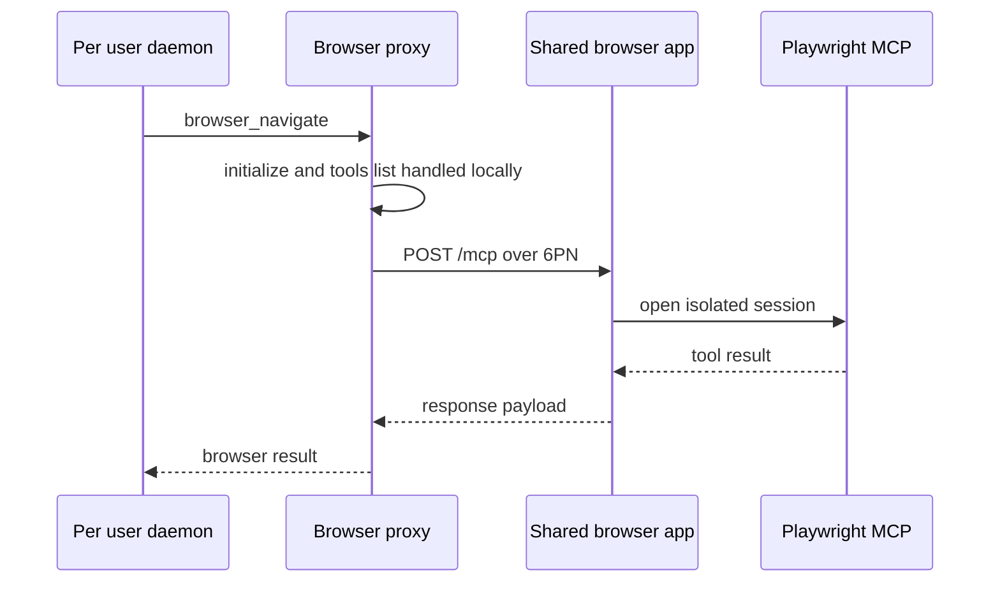
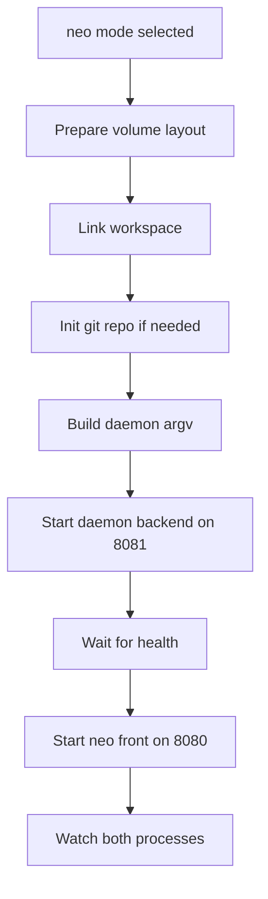
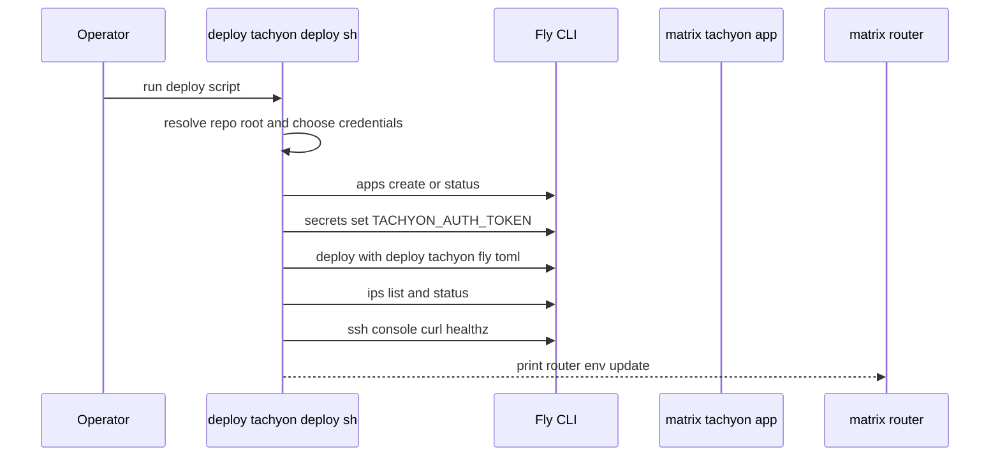

# Deployment Images, Service Scripts, and Environment Configuration

A recurring pattern appears across the deployment surfaces: private shared Fly apps for browser and Tachyon, a per-user daemon Machine rendered from a template, and box-installed services for the gateway and Deus control plane. The runbooks also make the separation between control plane and hosted execution explicit: Deus control-plane services can run on the box or Fly, while hosted execution is pushed to Paxeer Cloud.

## Deployment Surface Map

| Path | Concrete role |
| --- | --- |
| `.devcontainer/devcontainer.json` | Defines the local developer container with Go, Node, Python, Docker-in-Docker, forwarded ports, and editor customizations for the Matrix workspace. |
| `deploy/browser/README.md` | Describes the shared private browser app, its private 6PN reachability, optional bearer token wiring, and the daemon-side proxy relationship. |
| `deploy/browser/Dockerfile` | Builds the shared browser image around `@playwright/mcp`, installs Chromium, exposes the MCP port, and adds a health probe. |
| `deploy/daemon/README.md` | Documents the per-user daemon image, its Fly Machine provisioning model, and the local smoke-test flow. |
| `deploy/daemon/Dockerfile` | Builds the daemon image and the Neo front, bakes the skill corpus and MCP bridge tools, and sets the default container entrypoint. |
| `deploy/daemon/entrypoint.sh` | Prepares `/data`, links `/workspace`, assembles the daemon command, and supports the `neo` and `daemon` run modes. |
| `deploy/daemon/fly.toml.tmpl` | Template for per-user Fly Machines, including volume mount, service checks, and machine sizing. |
| `deploy/deus/README.md` | Box deploy runbook for the Deus control plane, including database setup, contract deploy, compose startup, and operational notes. |
| `deploy/deus/Dockerfile` | Builds the `deusd` control-plane image and ships migrations, config, and schema assets into the runtime image. |
| `deploy/deus/deus.env.example` | Environment template for the Deus control plane, including chain, storage, signing, and wallet settings. |
| `deploy/deus/docker-compose.yml` | Runs the Deus control plane with a dedicated MinIO sidecar on the `supabase_default` network. |
| `deploy/gateway/Dockerfile` | Builds the gateway image and packages the entrypoint used in container deployments. |
| `deploy/gateway/entrypoint.sh` | Converts environment variables into `matrix-gateway` flags and starts the service. |
| `deploy/router/Dockerfile` | Builds the router image that fronts provisioning and authenticated requests for the Fly Machine fleet. |
| `deploy/tachyon/README.md` | Documents the shared Tachyon engine, its private Fly deployment, bearer auth option, and fleet wiring. |
| `deploy/tachyon/Dockerfile` | Builds the Tachyon engine image with Foundry, contract corpus assets, warm solc, and the JSON-RPC endpoint. |
| `deploy/tachyon/deploy.sh` | Creates, deploys, and verifies the Tachyon Fly app while handling credential selection and submodule initialization. |
| `deus/docs/13-deployment.md` | Defines the Deus deployment model across Fly, the Paxeer box, and Paxeer Cloud, including rollout order and operational invariants. |
| `deus/configs/limits.dev.yaml` | Dev hosting budget and cap settings used by Deus tooling. |
| `deus/configs/ranking.yaml` | Discovery ranking weights used by Deus tooling. |
| `gateway/deploy/install.sh` | Idempotent root installer for the box gateway, including the system user, env file, migration, and service startup. |
| `gateway/deploy/matrix-gateway.service` | Systemd unit for the box gateway, including hardening and network dependencies. |
| `gateway/deploy/nginx-snippet.conf` | Nginx location snippet that fronts the gateway under `/gw/` with SSE-friendly proxy settings. |
| `marketplace/pnpm-workspace.yaml` | Workspace build policy for the marketplace package set, including which native packages are allowed and prebuilt. |
| `marketplace/tsconfig.json` | TypeScript build configuration for the marketplace workspace, including path aliases, included roots, and excluded component sets. |

## Browser Automation Packaging

*`deploy/browser/README.md`*

*`deploy/browser/Dockerfile`*

The browser surface is packaged as a single private Fly app that runs `@playwright/mcp` over Streamable HTTP. The daemon fleet reaches it through a proxy layer, which answers `initialize` and `tools/list` locally and forwards browser actions over Fly’s private 6PN network to `matrix-browser.internal:8931/mcp`.

The browser README makes three operational constraints explicit:

- the app is private only, with no public Fly IP
- the app is intentionally single-instance so MCP sessions stay instance-affine
- every browser session uses `--isolated`, so each daemon gets a throwaway browser context

The optional bearer token is wired through `MATRIX_BROWSER_TOKEN`; the daemon-side proxy can add `Authorization: Bearer <token>` when that secret is set. The proxy’s fleet URL is controlled by `MATRIX_BROWSER_URL`, with the default pointing at the private 6PN address.

`deploy/browser/Dockerfile` packages the browser service itself:

- base image: `node:22-bookworm-slim`
- runtime environment: `NODE_ENV=production` and `PLAYWRIGHT_BROWSERS_PATH=/ms-playwright`
- pinned package: `@playwright/mcp@0.0.75`
- Chromium installation: uses the Playwright CLI bundled inside the installed MCP package
- exposed port: `8931`
- health probe: sends a POST to `/mcp` with JSON and event-stream compatible headers

### Browser request flow

## Daemon Fleet Packaging

The browser app is meant to stay private. The README and Dockerfile both treat the host-header guard, the private network boundary, and the optional bearer token as part of the deployment surface rather than as local-only conveniences.

*`deploy/daemon/README.md`*

*`deploy/daemon/Dockerfile`*

*`deploy/daemon/entrypoint.sh`*

*`deploy/daemon/fly.toml.tmpl`*

The daemon directory packages the per-user Matrix runtime as a Fly Machine image and the template used by the router to provision those Machines. The README positions this directory as the deployment surface for `mcl-execute daemon`, and the template is rendered per user when the router creates a new Machine.

`deploy/daemon/Dockerfile` builds a two-stage image:

- builder base: `golang:1.22-bookworm`
- runtime base: `debian:bookworm-slim`
- build artifacts: `mcl-execute` and `neo`
- runtime tooling: Node, Python, `uv`, `mc`, `tini`, and the pre-cached MCP servers
- baked tool bridges: browser, tachyon, deus, media, chronos, exec, uwac, paxeer, websearch
- container identity: `/root/matrix` symlinked to `/opt/matrix`
- default entrypoint: `/opt/matrix/entrypoint.sh`
- default command: `neo`
- exposed port: `8080`
- health probe: `curl -fsS http://127.0.0.1:8080/healthz`

A notable part of the Dockerfile is the warm-up of the Fetch MCP dependency chain. The image pre-installs the fetch server and its article extraction dependencies so the first fetch does not hit the registries during runtime.

`deploy/daemon/entrypoint.sh` is the runtime bootstrap script. It uses these source-backed variables and structures:

| Variable or symbol | Role |
| --- | --- |
| `DATA_DIR` | Root of the mounted data volume, defaulting to `/data`. |
| `WORKSPACE_LINK` | The `/workspace` symlink target. |
| `MATRIX_HOME` | Installed Matrix tree under `/opt/matrix`. |
| `NEO_BACKEND_PORT` | Backend daemon port when Neo fronts the daemon, defaulting to `8081`. |
| `DAEMON_ARGV` | Array assembled by `build_daemon_argv`. |

The script’s runtime behavior is:

1. create the data-volume directory tree
2. export `MATRIX_MEDIA_DIR` and `MATRIX_MEDIA_BASE`
3. ensure `/workspace` points at `/data/workspace`
4. initialize `/data/workspace` as a git repository if needed
5. build the daemon command line with `build_daemon_argv`
6. in `neo` mode, start the daemon backend on `8081`, then start `neo serve` on `8080`
7. in `daemon` mode, start the standalone daemon on `8080`
8. exit if either co-located process exits in `neo` mode

The `neo` mode also sets these environment variables before launching the front process:

- `MATRIX_EXEC_STATE_DIR`
- `NEO_DAEMON_URL`
- `NEO_DAEMON_TOKEN`
- `NEO_ACTOR_DID`
- `NEO_SKILLS_ROOT`

`deploy/daemon/fly.toml.tmpl` mirrors the provisioning path used by the router. It declares:

- `app` and `primary_region` placeholders
- `kill_signal = "SIGINT"`
- `kill_timeout = "60s"`
- build target `deploy/daemon/Dockerfile`
- volume mount of `{{VOLUME_NAME}}` onto `/data`
- `MATRIX_DATA_DIR=/data`
- `MATRIX_HOME=/opt/matrix`
- service on internal port `8080`
- machine auto-stop set to suspend
- `http_checks` and `checks.boot` probing `/healthz`
- VM sizing at `shared-cpu-1x` and `1024` MB

### Daemon startup flow

## Deus Control Plane and Deployment Runbook

*`deploy/deus/README.md`*

*`deploy/deus/Dockerfile`*

*`deploy/deus/deus.env.example`*

*`deploy/deus/docker-compose.yml`*

*`deus/docs/13-deployment.md`*

*`deus/configs/limits.dev.yaml`*

*`deus/configs/ranking.yaml`*

The Deus deployment surface is split between the box runbook, the control-plane image, the compose bundle, and the broader deployment guide in `deus/docs/13-deployment.md`. The README describes the box deployment shape: a `deusd` service co-located with the Supabase stack, a dedicated MinIO sidecar, and chain 125 as the target network for the control-plane contracts.

`deploy/deus/Dockerfile` packages the control plane in a straightforward two-stage build:

- build base: `golang:1.24-bookworm`
- runtime base: `debian:bookworm-slim`
- built binaries: `deusd` and `deusctl`
- runtime assets: migrations, configs, and `pkg/manifest/schema.json`
- exposed port: `9095`
- entrypoint: `deusd`

`deploy/deus/docker-compose.yml` brings up two services on the external `supabase_default` network:

| Service | Concrete behavior |
| --- | --- |
| `deus-minio` | Runs `minio/minio:latest`, serves `/data`, publishes the console on port `9001`, and uses `mc ready local` for its healthcheck. |
| `deus-control` | Builds from `../../deus` using `../deploy/deus/Dockerfile`, depends on the MinIO service being healthy, and probes `http://localhost:9095/internal/healthz`. |

The README’s first-deploy sequence is operationally important:

1. create the `deus` database and enable the `vector` and `pgcrypto` extensions
2. install `/opt/deus/deus.env`
3. build and test the contracts on chain 125
4. broadcast the deploy script
5. build and start the compose stack
6. verify the control-plane health endpoint

The environment template in `deploy/deus/deus.env.example` groups its settings as follows:

| Group | Variables |
| --- | --- |
| Core | `DEUS_PORT`, `DEUS_POSTGRES_URI` |
| Chain | `PAXEER_RPC_URL`, `DEUS_CHAIN_ID`, `DEUS_SERVICE_REGISTRY_ADDR`, `DEUS_SETTLEMENT_ANCHOR_ADDR` |
| Object store | `MINIO_ROOT_USER`, `MINIO_ROOT_PASSWORD`, `DEUS_OBJSTORE_ENDPOINT`, `DEUS_OBJSTORE_ACCESS_KEY`, `DEUS_OBJSTORE_SECRET_KEY`, `DEUS_OBJSTORE_BUCKET`, `DEUS_OBJSTORE_USE_SSL` |
| Signing and settlement | `DEUS_GATEWAY_SIGNING_KEY`, `DEUS_SETTLER_PRIVATE_KEY` |
| Developer auth | `DEUS_DEVELOPER_AUTH_SECRET`, `DEUS_SIWE_DOMAIN` |
| Wallet | `MATRIX_WALLET_API_URL` |
| Optional or deferred | `DEUS_EMBED_ENDPOINT`, `DEUS_EMBED_MODEL`, `DEUS_APPWRITE_ENDPOINT`, `DEUS_APPWRITE_PROJECT_ID`, `DEUS_APPWRITE_API_KEY`, `DEUS_HOSTING_KILL_SWITCH` |

The template comments make two important constraints explicit:

- `DEUS_POSTGRES_URI` is expected to be a direct session connection over the Supabase network
- the MinIO root credentials double as Deus S3 credentials in the single-tenant box setup

`deus/docs/13-deployment.md` extends the box runbook into the full deployment model:

- control plane can live on Fly, the Paxeer box, or as a Paxeer Cloud container
- hosted service execution is on Paxeer Cloud, not on bespoke Fly runners
- hosted listings are created through Appwrite Server API calls by `internal/hosting`
- data tier is the box Postgres database plus a MinIO or S3 bucket
- on-chain deploy order starts with `ServiceRegistry`, then later `SettlementAnchor` and the channel and escrow contracts
- MCP proxy wiring for Deus is added by baking `tools/deus` into the daemon image and injecting `MATRIX_DEUS_URL`
- rollout order is staged: control plane, daemon bridge, console, settlement, hosted listings, streaming, confidential, then recurring scheduler support
- observability includes `/internal/healthz` and `/internal/metrics`
- backups rely on the ledger in Postgres, on-chain receipts, and rebuildable index data

`deus/configs/limits.dev.yaml` defines the development budget and cap values used by Deus tooling:

| Key | Value |
| --- | --- |
| `budget_pax_wei` | `1000000000000000000` |
| `max_always_warm` | `10` |
| `kill_switch` | `false` |
| `max_artifact_bytes` | `10485760` |
| `default_timeout_ms` | `30000` |
| `max_response_bytes` | `262144` |

`deus/configs/ranking.yaml` defines the discovery weights:

| Key | Weight |
| --- | --- |
| `semantic` | `0.40` |
| `quality` | `0.30` |
| `uptime` | `0.15` |
| `price` | `0.10` |
| `freshness` | `0.05` |

## Gateway Service Packaging

*`deploy/gateway/Dockerfile`*

*`deploy/gateway/entrypoint.sh`*

*`gateway/deploy/install.sh`*

*`gateway/deploy/matrix-gateway.service`*

*`gateway/deploy/nginx-snippet.conf`*

The gateway surface is a box-installed, systemd-managed service with a matching container packaging path. The installer, service unit, and nginx snippet are designed to keep the box and container behavior aligned.

`deploy/gateway/Dockerfile` builds a static gateway binary from the gateway module and packages it with a small runtime:

- builder base: `golang:1.22-bookworm`
- runtime base: `debian:bookworm-slim`
- runtime packages: `ca-certificates`, `curl`, `tini`
- installed binary: `matrix-gateway`
- entrypoint: `deploy/gateway/entrypoint.sh`
- exposed port: `9090`
- health probe: `http://127.0.0.1:9090/healthz`

`deploy/gateway/entrypoint.sh` maps environment variables to the same flags used by the systemd unit. The script uses these variables:

| Variable | Role |
| --- | --- |
| `ADDR` | Listen address, defaulting to `0.0.0.0:9090` in containers. |
| `FREE_TIER_ONLY` | Free-tier enforcement flag. |
| `LOG_FORMAT` | Log format, defaulting to `json`. |
| `DEFAULT_CAP_PAX` | Default spend cap. |
| `RATE_PER_SEC` | Rate limiter value. |
| `RATE_BURST` | Burst limiter value. |
| `POSTGRES_URI` | PostgreSQL URI forwarded to `matrix-gateway` from `MATRIX_GATEWAY_POSTGRES_URI`. |

The script starts `matrix-gateway` with `-free-tier-only`, `-log-format`, `-default-cap-pax`, `-rate-per-sec`, and `-rate-burst`, and it leaves room for custom commands when invoked with a non-default mode.

`gateway/deploy/install.sh` is the box-side idempotent installer. Its behavior is concrete and ordered:

1. create the `matrix` system group if needed
2. create the `matrix` system user if needed
3. install the binary under `/opt/matrix-gateway`
4. write `/etc/matrix/gateway.env`
5. install `gateway/deploy/matrix-gateway.service`
6. run the credit ledger migration if the migration file is present
7. enable and restart the service

- `MATRIX_GATEWAY_TOKEN`
- `MATRIX_GATEWAY_POSTGRES_URI`
- optional `FIREWORKS_API_KEY`
- optional `TOGETHER_API_KEY`

The systemd unit in `gateway/deploy/matrix-gateway.service` runs the service with the box defaults:

- `User=matrix`
- `Group=matrix`
- `WorkingDirectory=/opt/matrix-gateway`
- `EnvironmentFile=/etc/matrix/gateway.env`
- `ExecStart=/opt/matrix-gateway/matrix-gateway`
- bound to `127.0.0.1:9090`
- `Restart=always`
- `TimeoutStopSec=30`

The hardening options are explicit and broad: the unit disables new privileges, protects system paths, limits address families, and restricts namespace and SUID use.

`gateway/deploy/nginx-snippet.conf` adds the public path mapping:

- `/gw/` proxies to `http://127.0.0.1:9090/`
- `/gw/healthz` proxies to `http://127.0.0.1:9090/healthz`
- buffering is disabled for streaming responses
- keep-alive and chunked transfer settings are tuned for SSE-style traffic
- the snippet is a peer route, not a replacement for the existing public `/` location

## Tachyon Shared Engine

The gateway box service and the container entrypoint are intentionally aligned on the same listener, token, and rate-limit flags. The installer and the systemd unit are the box-side runtime contract, while the Dockerfile and entrypoint provide the container equivalent.

*`deploy/tachyon/README.md`*

*`deploy/tachyon/Dockerfile`*

*`deploy/tachyon/deploy.sh`*

Tachyon is deployed as a single shared private Fly app that runs `tachyond` over JSON-RPC at `/rpc`. The daemon fleet reaches it through a proxy that answers `initialize` and `tools/list` locally and forwards the actual engine calls to `matrix-tachyon.internal:8645/rpc`.

The README highlights the main operational decisions:

- one shared engine, not one engine per daemon
- seedless multi-tenant custody, with the embedded wallet running in keyfile-empty mode
- uploaded contract sources are compiled in an ephemeral workdir
- the app stays private and reachable only inside the organization network
- optional bearer auth can be enabled with `TACHYON_AUTH_TOKEN`
- the daemon fleet reads `MATRIX_TACHYON_URL`, which defaults to the private 6PN address

`deploy/tachyon/Dockerfile` packages the engine with Foundry and the contract corpus:

- builder base: `golang:1.22-bookworm`
- runtime base: `debian:bookworm-slim`
- runtime variables: `TACHYON_PROJECT_ROOT=/opt/tachyon`, `TACHYON_API_ADDR=0.0.0.0:8645`, `TACHYON_REGISTRY_PATH=/opt/tachyon/registry.json`, `TACHYON_ARTIFACTS_DIR=/opt/tachyon/artifacts`, `TACHYON_WALLET_MODE=embedded`
- Foundry installer pinned through `FOUNDRY_VERSION`
- baked corpus: contracts, `lib`, `foundry.toml`, `remappings.txt`, and chain presets
- warm compile step for solc `0.8.27`
- exposed port: `8645`
- health probe: `http://127.0.0.1:8645/healthz`
- entrypoint: `tachyond`

`deploy/tachyon/deploy.sh` is the operator-facing deployment wrapper. Its behavior is explicit:

1. resolve the repository root from the script location
2. choose the app name, org, region, and config file from environment or defaults
3. unset `FLY_API_TOKEN` unless `MATRIX_TACHYON_DEPLOY_TOKEN` is set
4. verify that `flyctl` is installed and that the operator is logged in
5. initialize `tachyon/lib` submodules if they are empty
6. create the private app if it does not exist
7. optionally set `TACHYON_AUTH_TOKEN` as a Fly secret
8. deploy from the repo root with `deploy/tachyon/fly.toml`
9. verify that the app has no public IP and that `/healthz` responds over SSH
10. print the fleet wiring command for `MATRIX_TACHYON_URL`

### Tachyon deployment flow

## Router Image

*`deploy/router/Dockerfile`*

The router image is the front door for daemon Machine provisioning and authenticated request routing. The Dockerfile builds a static Go binary from the router module and packages it with a minimal runtime.

Its source-backed behavior is:

- builder base: `golang:1.21-bookworm`
- runtime base: `debian:bookworm-slim`
- runtime packages: `ca-certificates`, `curl`, `tini`
- build-time version stamping via `main.version`
- exposed listeners: `8080` and `8088`
- health probe: `ROUTER_HEALTHCHECK_PORT`, defaulting to `8088`
- runtime entrypoint: `matrix-router` under `tini`

The image supports both the public routing listener and the internal administrative listener. Its role in this deployment surface is to verify Supabase JWTs, reverse-proxy authenticated traffic to per-user Fly Machines, and expose the provisioning API used by the daemon fleet.

## Local Development and Workspace Tooling

*`.devcontainer/devcontainer.json`*

*`marketplace/pnpm-workspace.yaml`*

*`marketplace/tsconfig.json`*

These files are not deploy targets themselves, but they keep the local workspace and the marketplace build behavior consistent with the deployment environment.

`.devcontainer/devcontainer.json` defines:

| Setting | Behavior |
| --- | --- |
| `name` | Identifies the container as `Matrix`. |
| `image` | Uses `mcr.microsoft.com/devcontainers/base:bookworm`. |
| `features` | Installs Go `1.22`, Node `22`, Python `3.12`, and Docker-in-Docker. |
| `postCreateCommand` | Runs `bash .devcontainer/setup.sh` after container creation. |
| `remoteUser` | Uses `root`. |
| `remoteEnv` | Extends `PATH` with Foundry and local binaries. |
| `forwardPorts` | Forwards the ports used by the marketplace, daemon, Tachyon, gateway, Deus, and Chronos services. |
| `portsAttributes` | Labels each forwarded port for editor and operator clarity. |
| `customizations.vscode.extensions` | Installs Go, ESLint, Prettier, Tailwind, Makefile, YAML, Docker, and TOML support. |
| `customizations.vscode.settings` | Tunes Go formatting and TypeScript formatting defaults. |

`marketplace/pnpm-workspace.yaml` governs native build policy in the marketplace workspace:

- `allowBuilds` includes `esbuild`, `sharp`, and `workerd`
- `onlyBuiltDependencies` lists the same three packages

`marketplace/tsconfig.json` defines the TypeScript workspace behavior:

- includes the application tree, server and client folders, and React Router generated types
- sets `baseUrl` to `.`
- targets `ES2022`
- uses `moduleResolution: bundler`
- enables `jsx: react-jsx`
- defines path aliases for the shared UI and smooth UI components
- keeps `noEmit: true`, `strict: true`, and `resolveJsonModule: true`
- excludes `node_modules`, `build`, `.wrangler`, and a set of `components/ui/smoothui` subtrees

These workspace files matter because they keep the local development image, the marketplace build pipeline, and the deployment runtime assumptions aligned around the same port layout, Node version, and TypeScript module resolution rules.