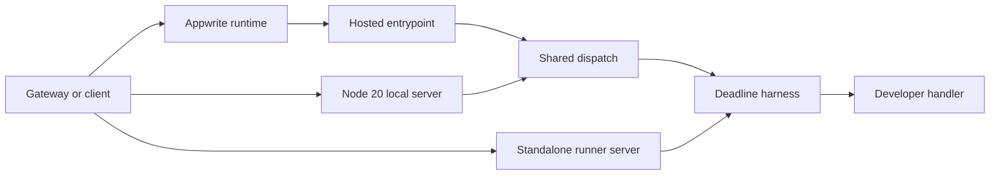

# Deus Runner Implementation and Hosted Execution Packaging

## Overview

This section covers the Node 20 Deus hosted-function runner, the packaging shape expected by hosted deployment, and the local execution surfaces used for development and validation. The hosted path is centered on `deploy/deus/runner/node20/src/main.js`, which Appwrite invokes directly, while the shared invoke logic lives in `deploy/deus/runner/node20/src/dispatch.js` and the developer handler lives in `deploy/deus/runner/node20/src/handler.js`.

The package is designed so the deployed artifact is a gzipped tarball of the project layout, Appwrite runs `npm install`, and the runtime enters through `src/main.js`. For local execution, the node20 package exposes `POST /invoke` through `deploy/deus/runner/node20/src/server.js`, and the broader runner surface also includes `deus/runner/src/server.js`, which drives the developer handler through `runHandle` directly.

## Packaging and Invoke Contract

### Deployment bundle and runtime entrypoints

| File | Concrete role |
| --- | --- |
| `deploy/deus/runner/node20/README.md` | Documents the hosted packaging shape, the expected `code.tar.gz` artifact, the Appwrite entrypoint, the shared invoke contract, runtime variables, and the local development commands. |
| `deploy/deus/runner/node20/package.json` | Declares the Node 20 ESM package, sets `src/main.js` as `main`, exposes `start` and `check`, and pins the runtime engine to `>=20`. |
| `deploy/deus/runner/node20/src/main.js` | Appwrite-facing entrypoint. It parses the invoke payload, logs the invocation when possible, calls `dispatch`, and maps the result to an HTTP JSON response. |
| `deploy/deus/runner/node20/src/server.js` | Node 20 local dev server for `POST /invoke`. It parses JSON from the request body and forwards the payload to `dispatch`. |
| `deploy/deus/runner/node20/src/dispatch.js` | Shared invoke path for hosted and local node20 execution. It runs the handler under a deadline, enforces the response-size cap, and optionally adds `runner_sig`. |
| `deploy/deus/runner/node20/src/harness.js` | Deadline helper used by `dispatch` to race the handler against a timeout and clear the timer afterward. |
| `deploy/deus/runner/node20/src/handler.js` | Developer handler implementation. It currently recognizes `echo` and throws for unknown operations. |
| `deus/runner/src/server.js` | Separate runner server that invokes `runHandle` directly, returning a different failure shape from the node20 `dispatch` path. |


### Invoke payload and response envelope

The invoke contract documented in `deploy/deus/runner/node20/README.md` and implemented across the runner entrypoints uses the following request fields:

| Field | Meaning |
| --- | --- |
| `invocation_id` | Invocation identifier propagated into the runtime context and logs. |
| `operation` | Handler operation name passed to `handle`. |
| `args` | Argument object passed to `handle`; the node20 dispatch path falls back to `{}` when missing. |
| `caller_did` | Caller DID forwarded into `ctx.callerDid`. |
| `deadline_ms` | Deadline forwarded into `ctx.deadlineMs`; the runtime defaults to `5000` when missing or invalid. |
| `receipt_digest` | Receipt digest used only when `RUNNER_SIGNING_KEY` is set and the node20 dispatch path adds `runner_sig`. |


The response envelope is:

| Field | Meaning |
| --- | --- |
| `outcome` | `ok` or `error`. |
| `result` | Result payload on success, or an error object on the node20 dispatch path. |
| `units` | Always set to `"1"` by the shared runner path. |
| `runner_sig` | Added only when `RUNNER_SIGNING_KEY` is present and a receipt digest was supplied. |


`deploy/deus/runner/node20/src/dispatch.js` enforces an additional response-size cap before returning a success payload. It serializes `out.result` with `JSON.stringify`, checks the UTF-8 byte length, and returns `{ outcome: 'error', result: { error: 'response exceeds max bytes' }, units: '1' }` when the payload exceeds `DEUS_MAX_RESPONSE_BYTES`.

### Runtime variables

| Variable | Effect |
| --- | --- |
| `DEUS_MAX_RESPONSE_BYTES` | Maximum serialized response size enforced in `deploy/deus/runner/node20/src/dispatch.js`; defaults to `262144`. |
| `RUNNER_SIGNING_KEY` | Optional signing key used to add `runner_sig` as an HMAC-SHA256 over `receipt_digest`. |
| `PORT` | Controls the local server port in `deploy/deus/runner/node20/src/server.js` and `deus/runner/src/server.js`. |
| `DEUS_HOSTING_DEV_EXEC_URL` | Used in local development to route `deusd` deploys to a local runner. |
| per-service `Env` entries | Threaded through the deploy request into the hosted runtime as part of `process.env`. |


## Runtime Behavior



### Hosted entrypoint: `deploy/deus/runner/node20/src/main.js`

This file exports the Appwrite default function with the execution context `{ req, res, log, error }`. It reads the invocation body through `parsePayload`, which accepts:

- `req.bodyJson` when it is already an object
- `req.bodyText`, `req.bodyRaw`, or `req.body` when the body is string-like
- an object body passed through directly

If parsing fails, the code calls `error` when that callback exists and returns a JSON error envelope with HTTP 400. When `payload.invocation_id` is present and `log` is a function, it emits a log line in the form `invoke ${payload.operation || ''} (${payload.invocation_id})`.

After parsing, `main.js` calls `dispatch(payload, process.env)`. The returned `outcome` controls the HTTP status:

- `ok` → HTTP 200
- `error` → HTTP 500

### Shared invoke path: `deploy/deus/runner/node20/src/dispatch.js`

- `callerDid` from `payload.caller_did`
- `invocationId` from `payload.invocation_id`
- `deadlineMs` from `payload.deadline_ms || 5000`
- `receiptDigest` from `payload.receipt_digest || ''`
- `logger` set to `console`
- `secrets` set to the provided environment object

```json
{ "outcome": "error", "result": { "error": "message" }, "units": "1" }
```

On success, it checks `DEUS_MAX_RESPONSE_BYTES` with `positiveInt`, applies the byte cap, and optionally signs the gateway receipt digest. The signature path strips a leading `0x` from the configured key, tries to interpret it as hex, falls back to UTF-8 if needed, and computes an HMAC-SHA256 digest over `receipt_digest`. The result is written as `runner_sig` with a `0x` prefix.

### Deadline enforcement: `deploy/deus/runner/node20/src/harness.js`

`runHandle` is the deadline wrapper used by the shared dispatch path. It:

- coerces `ctx.deadlineMs` to a positive number, otherwise falls back to `5000`
- calls `withDeadline(handle(operation, args, ctx), deadlineMs)`
- returns `{ outcome: 'ok', result, units: '1' }`

`withDeadline` races the handler promise against a timer and always clears the timer in `finally`, so the timeout cannot linger after completion.

### Developer operation handling: `deploy/deus/runner/node20/src/handler.js`

The developer handler is intentionally small:

- `echo` returns `{ echo: args?.message ?? '' }`
- any other operation throws `Error(\`unknown operation: ${operation}\`)`

This file is the only place in the recovered source that defines operation-specific business behavior for the hosted function.

### Node 20 local dev server: `deploy/deus/runner/node20/src/server.js`

This server exposes the same `POST /invoke` contract used by the hosted path. It:

- listens on `process.env.PORT || 3000`
- rejects any non-`POST` request or any path other than `/invoke` with HTTP 404 and `not found`
- reads the request body with `readBody`
- returns HTTP 400 with a JSON error envelope when JSON parsing fails
- forwards the parsed payload to `dispatch(payload, process.env)`
- always writes HTTP 200 with `Content-Type: application/json` for successful request handling

Because it delegates to `dispatch`, it honors the same response-size cap and optional `runner_sig` generation as the hosted entrypoint.

### Standalone runner server: `deus/runner/src/server.js`

This server uses a different execution path:

- listens on `process.env.PORT || 8080`
- rejects non-`POST` requests and non-`/invoke` paths with HTTP 404 and `not found`
- reads the request body with an async iterator over `req`
- returns HTTP 400 and `invalid json` when parsing fails
- calls `runHandle(handle, body.operation, body.args || {}, ctx)` directly
- returns HTTP 200 with the handler result on success
- returns HTTP 503 with a JSON body on failure

The context passed into `runHandle` contains `callerDid`, `invocationId`, `deadlineMs`, `logger: console`, and `secrets: {}`. This path does not use `dispatch`, so it does not apply the response-size cap or receipt co-signing logic from the node20 hosted runner.

## Local Development

```steps
1. Verify the Node 20 runner files | Run `npm run check` in the node20 package.
2. Start the local node20 invoke server | Run `PORT=18080 npm start`.
3. Send a test invocation | POST JSON to `localhost:18080/invoke` with `operation`, `args`, `caller_did`, `invocation_id`, and `deadline_ms`.
4. Route deploys to the local runner | Set `DEUS_HOSTING_DEV_EXEC_URL=http://127.0.0.1:18080` before running `deusd` in development.
```

```bash
curl -s localhost:18080/invoke -H 'content-type: application/json' \
  -d '{"operation":"echo","args":{"message":"hi"},"caller_did":"did:test","invocation_id":"1","deadline_ms":5000}'
```

deploy/deus/runner/node20/src/server.js and deus/runner/src/server.js do not fail the same way. The node20 server normalizes handler failures through dispatch and still answers with HTTP 200 and an error envelope, while the standalone server returns HTTP 503 and emits an error body with message. Clients that target both servers must handle different failure shapes.

- `start` → `node src/server.js`
- `check` → `node --check` over `src/main.js`, `src/server.js`, `src/dispatch.js`, `src/harness.js`, and `src/handler.js`
- `type: "module"`
- `main: "src/main.js"`
- `engines.node: ">=20"`

## Key Files Reference

| File | Responsibility |
| --- | --- |
| `deploy/deus/runner/node20/README.md` | Hosted packaging notes, invoke contract, deploy variables, and local development commands. |
| `deploy/deus/runner/node20/package.json` | Node 20 ESM package metadata, runtime entrypoint, and validation scripts. |
| `deploy/deus/runner/node20/src/main.js` | Appwrite entrypoint that parses the invoke body and returns the hosted response envelope. |
| `deploy/deus/runner/node20/src/dispatch.js` | Shared dispatch path with deadline handling, response-size enforcement, and optional receipt signing. |
| `deploy/deus/runner/node20/src/harness.js` | Deadline wrapper around handler execution. |
| `deploy/deus/runner/node20/src/handler.js` | Developer handler implementation with the `echo` operation. |
| `deploy/deus/runner/node20/src/server.js` | Node 20 local `/invoke` server that reuses `dispatch`. |
| `deus/runner/src/server.js` | Standalone runner server that calls `runHandle` directly and returns a different error shape. |
