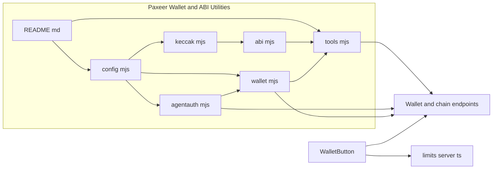
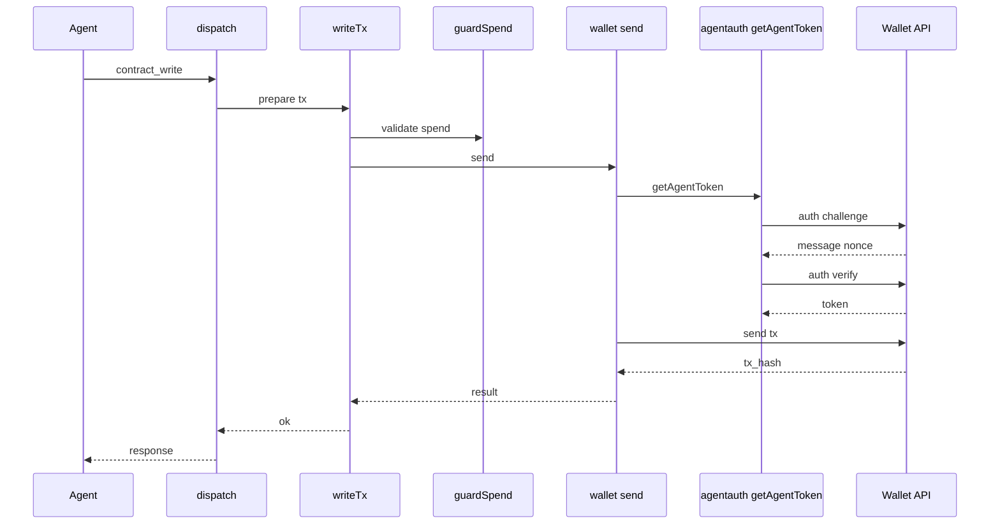
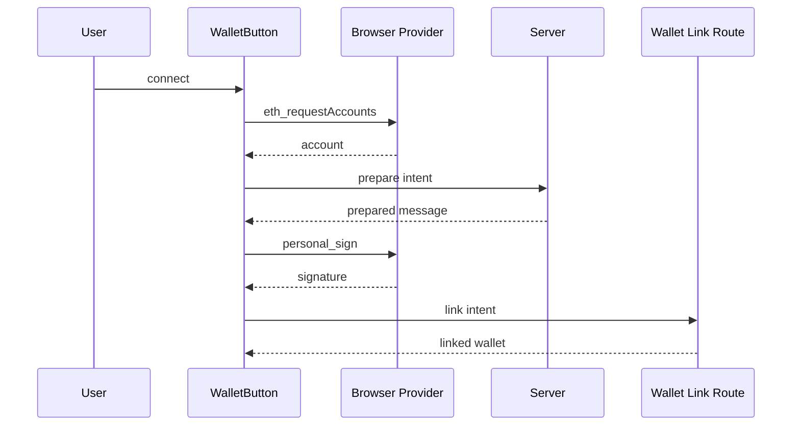

# Deployment, Browser Automation, and Auxiliary Tooling - Paxeer Wallet and ABI Utilities

## Overview

This section documents the Paxeer tooling surface that lets Centra AI agents read from the Paxeer network, build ABI payloads, sign through the network-side wallet, and connect from the browser when a user links a wallet in the marketplace UI. The bridge is intentionally split between a broad read plane and a tightly controlled write plane so that contract calls, transfers, streams, and scheduling all pass through the same custody policy.

The utility set is centered on `tools/paxeer/lib/tools.mjs`, `tools/paxeer/lib/wallet.mjs`, `tools/paxeer/lib/agentauth.mjs`, `tools/paxeer/lib/abi.mjs`, and `tools/paxeer/lib/keccak.mjs`, with configuration in `tools/paxeer/lib/config.mjs` and operator guidance in `tools/paxeer/README.md`. Browser-side wallet linking and request throttling are handled by `marketplace/app/components/wallet.tsx` and `marketplace/app/lib/limits.server.ts`.

## Source Files and Responsibilities

| File | Responsibility | Concrete behavior |
| --- | --- | --- |
| `tools/paxeer/README.md` | Operator guide for the Paxeer bridge | Defines the read versus write model, lists the tool surface, documents environment variables, explains the spend policy contract, and gives offline verification commands. |
| `tools/paxeer/lib/config.mjs` | Canonical runtime configuration | Exports chain metadata, read endpoints, wallet API settings, agent auth settings, token registry, precompile addresses, protocol contract addresses, and local timeout or spend limits. |
| `tools/paxeer/lib/keccak.mjs` | Ethereum Keccak-256 implementation | Implements Keccak-f[1600], selector derivation, checksum address conversion, byte and hex helpers, and a self-test against known vectors. |
| `tools/paxeer/lib/abi.mjs` | Minimal ABI codec | Encodes and decodes the exact Solidity types used by the bridge, including tuples and arrays, and re-exports `keccak256Bytes` for callers that build selectors or topics. |
| `tools/paxeer/lib/agentauth.mjs` | Agent-native wallet authentication | Derives a `did:matrix` identity from the executor seed, performs challenge and verify auth, caches the token, and sends authenticated requests to the wallet API agent routes. |
| `tools/paxeer/lib/wallet.mjs` | Embedded wallet REST client | Resolves or provisions the wallet, signs and sends transactions, signs messages, and routes calls through either the agent lane or the legacy token lane. |
| `tools/paxeer/lib/tools.mjs` | Tool registry and dispatch | Advertises the read and write tools, enforces read-only mode, applies spend limits, decodes common RPC results, and dispatches reads or wallet-backed writes. |
| `marketplace/app/components/wallet.tsx` | Browser wallet connect and disconnect UI | Connects an injected browser wallet, falls back to a deterministic dev wallet in allowed local cases, signs a server-prepared message, and submits link or unlink actions. |
| `marketplace/app/lib/limits.server.ts` | Browser-facing request throttling | Exposes rate limiter bindings, derives a client key from request headers, and fails open on limiter binding errors. |


## Paxeer Bridge Operator Model

### `tools/paxeer/README.md`

*tools/paxeer/README.md*

The Paxeer bridge is described as a single stdio MCP server that exposes the network to the planner. Reads are intentionally broad and unauthenticated, while writes always route through the embedded wallet so that key material, spend limits, and allow-lists stay network-side.

The README also states that the bridge backs the `paxeer-identity`, `paxeer-read`, `paxeer-pay`, `paxeer-trade`, `paxeer-stake`, and `paxeer-schedule` skills. Its documented tool groups are:

- Direct chain reads: RPC, `eth_call`, contract reads, balances, chain information, and ERC-20 lookups.
- Explorer reads: PaxScan address, transaction, token, search, and network stats lookups.
- Market reads: portfolio, trending, price, spot market data, and points.
- Precompile reads: oracle pricing, OROB resolution, clearing, proof-of-fill-quality scoring, streams, scheduler jobs, and staking delegation.
- Wallet and identity: wallet info and message signing.
- Writes: transfer, approve, streams, scheduler jobs, staking actions, and generic contract writes.

The README’s spend policy contract has two gates:

1. Network-side wallet policy enforcement on the custody API.
2. Local `PaxeerSpendPolicy` enforcement in the bridge, including the `PAXEER_MAX_SPEND_WEI` ceiling and any additional constraint-derived limit.

It also documents the offline verification commands for the crypto and codec helpers.

```bash
node tools/paxeer/lib/keccak.mjs
node tools/paxeer/lib/abi.mjs
```

## Configuration, Registry, and Limits

### `tools/paxeer/lib/config.mjs`

tools/paxeer/lib/tools.mjs hides write tools entirely when PAXEER_READS_ONLY=1, and it also rejects write tool names again inside dispatch as a second guard.

*tools/paxeer/lib/config.mjs*

This module centralizes all network-facing configuration for the Paxeer tooling stack. It is the source of the chain identity, endpoint defaults, wallet API base URLs, agent-auth defaults, token registry, precompile addresses, and protocol contract addresses used by the bridge.

#### Chain and endpoint defaults

| Export | Field | Value or default | Purpose |
| --- | --- | --- | --- |
| `CHAIN` | `id` | `Number(pick('PAXEER_CHAIN_ID') ?? 125)` | Paxeer chain identifier used by wallet serialization and chain info. |
| `CHAIN` | `cosmosId` | `pick('PAXEER_COSMOS_CHAIN_ID') ?? 'hyperpax_125_1'` | Cosmos-form chain identifier used by downstream tooling. |
| `CHAIN` | `name` | `Paxeer Network` | Human-readable chain name. |
| `CHAIN` | `coin` | `PAX` | Native coin symbol. |
| `CHAIN` | `cosmosAlias` | `hpx` | Alternate Cosmos alias. |
| `CHAIN` | `bech32Prefix` | `pax` | Bech32 prefix used for native addresses. |
| `CHAIN` | `decimals` | `18` | Native coin precision. |


| Export | Field | Value or default | Purpose |
| --- | --- | --- | --- |
| `ENDPOINTS` | `rpc` | `PAXEER_RPC_URL` or `GIDEON_RPC_URL`, default `https://public-mainnet.rpcpaxeer.online/evm` | Primary EVM JSON-RPC endpoint. |
| `ENDPOINTS` | `rpcAlt` | `PAXEER_RPC_ALT_URL`, default `https://public-rpc.paxeer.app/rpc` | Alternate documented RPC endpoint. |
| `ENDPOINTS` | `paxscan` | `PAXEER_PAXSCAN_URL`, default `https://api.paxscan.io` | Explorer base used for `/api/v2` calls. |
| `ENDPOINTS` | `portfolio` | `PAXEER_PORTFOLIO_URL`, default `https://us-east-1.user-stats.sidiora.exchange` | Portfolio and performance indexer. |
| `ENDPOINTS` | `spot` | `PAXEER_SPOT_URL`, default `https://us-east-1.spot-api.sidiora.exchange` | Spot market-data API. |
| `ENDPOINTS` | `price` | `PAXEER_PRICE_URL`, default `https://data-api.crossverse.app/api` | Price and OHLC API. |
| `ENDPOINTS` | `points` | `PAXEER_POINTS_URL`, default `https://sidiora-points-indexer-production.up.railway.app` | Points and rewards indexer. |


#### Wallet API and agent auth

| Export | Field | Value or default | Purpose |
| --- | --- | --- | --- |
| `WALLET_API` | `base` | `PAXEER_WALLET_API` or `PAXNET_WALLET_API`, default `https://connect.paxportwallet.com` | Network-side wallet REST API base. |
| `WALLET_API` | `supabaseUrl` | `PAXEER_SUPABASE_URL`, default `https://supabase.paxeer.app` | Supabase base used for password-grant token refresh. |
| `WALLET_API` | `supabaseAnonKey` | `PAXEER_SUPABASE_ANON_KEY` or `PAXEER_SUPABASE_PUBLISHABLE_KEY` | Required for password-grant refresh. |
| `WALLET_API` | `token` | `PAXEER_WALLET_TOKEN` | Preloaded legacy bearer token. |
| `WALLET_API` | `email` | `PAXEER_WALLET_EMAIL` | Password-grant username. |
| `WALLET_API` | `password` | `PAXEER_WALLET_PASSWORD` | Password-grant secret. |


| Export | Field | Value or default | Purpose |
| --- | --- | --- | --- |
| `AGENT_AUTH` | `keyfile` | `PAXEER_AGENT_KEYFILE` or `MATRIX_EXECUTOR_KEYFILE`, default `${MATRIX_DATA_DIR or /data}/.matrix/executor.key` | Ed25519 seed file for agent-native wallet auth. |
| `AGENT_AUTH` | `label` | `PAXEER_AGENT_LABEL` or `MATRIX_USER_ID` or `MATRIX_DID_LABEL` | DID label component. |
| `AGENT_AUTH` | `disabled` | `PAXEER_AGENT_AUTH_DISABLE === '1'` | Turns off agent-native auth. |


#### Token registry and resolution

`TOKENS` is a registry of native and ERC-20 assets used by the bridge. It includes `PAX`, `WPAX9`, `USDC`, `USDT`, `USDL`, `USID`, `SID`, `WETH`, `WBNB`, `WUNI`, `WSOL`, `WDOGE`, and `WBCH`, each with symbol, name, decimals, and address where applicable.

`resolveToken(ref)` accepts either a symbol or a raw `0x` address:

- Case-insensitive symbol lookup returns the registry entry.
- A known `0x` address returns the matching registry entry.
- An unknown `0x` address returns a synthetic token object with decimals set to `18`, a short derived symbol, and name `Unknown token`.
- Any other input returns `null`.

#### Precompiles and protocol contracts

`PRECOMPILES` maps the bridge’s onchain helper addresses:

- `orob`
- `clearing`
- `oracle`
- `pofq`
- `scheduler`
- `streams`
- `teeAttestor`
- `eip712`
- `staking`
- `bech32`
- `p256`

`CONTRACTS` groups protocol addresses by family. The most important runtime detail for this section is that the swap entry in `CONTRACTS.swap` is the wallet-wired execution path used for swap-oriented contract writes. The other groups cover the documented hyperpax, perps, Sidiora fun, and Sidiora AG contract sets that the bridge can target through generic writes.

#### Local limits

| Export | Field | Value or default | Purpose |
| --- | --- | --- | --- |
| `LIMITS` | `httpTimeoutMs` | `PAXEER_HTTP_TIMEOUT_MS` or `20000` | HTTP timeout for network calls. |
| `LIMITS` | `rpcTimeoutMs` | `PAXEER_RPC_TIMEOUT_MS` or `15000` | RPC timeout. |
| `LIMITS` | `maxResponseBytes` | `PAXEER_MAX_BYTES` or `1000000` | Upper bound on response body size. |
| `LIMITS` | `maxSpendWei` | `PAXEER_MAX_SPEND_WEI` or `'0'` | Local wei ceiling for write guarding. |


## Cryptography and ABI Utilities

### `tools/paxeer/lib/keccak.mjs`

*tools/paxeer/lib/keccak.mjs*

This file implements Ethereum Keccak-256, not NIST SHA3-256. The code explicitly uses the Keccak padding byte `0x01`, which is necessary for correct function selectors, event topics, and address checksums.

#### Public functions

| Function | Behavior |
| --- | --- |
| `keccak256Bytes` | Hashes raw bytes and returns a `Uint8Array(32)`. |
| `toHex` | Formats a byte array as `0x`-prefixed hex. |
| `hexToBytes` | Parses a hex string into bytes. |
| `keccak256Utf8` | Hashes UTF-8 input and returns `0x`-prefixed hex. |
| `keccak256Hex` | Hashes the bytes represented by a hex string. |
| `selector` | Returns the first 4 bytes of Keccak-256 for a canonical function signature. |
| `toChecksumAddress` | Produces an EIP-55 checksum address from a 20-byte hex address. |
| `_selftest` | Verifies digest vectors and selector vectors. |


#### Internal helpers and constants

- `MASK64` constrains every lane to 64 bits.
- `RC` contains the 24 Keccak round constants.
- `R` contains the rotation offsets.
- `rotl64` performs 64-bit lane rotation.
- `keccakF` executes the 24-round permutation.

#### Verification vectors

The built-in self-test covers:

- Empty string digest
- `abc` digest
- `transfer(address,uint256)` selector
- `balanceOf(address)` selector
- `approve(address,uint256)` selector

### `tools/paxeer/lib/abi.mjs`

*tools/paxeer/lib/abi.mjs*

This module is a minimal Ethereum ABI codec tuned to the exact types used by the Paxeer bridge. It supports `address`, `bool`, signed and unsigned integers, fixed-size byte arrays, dynamic bytes, strings, dynamic arrays, fixed arrays, and tuples.

#### Public functions

| Function | Behavior |
| --- | --- |
| `encode` | Encodes an array of ABI types and values into hex without a `0x` prefix. |
| `encodeCall` | Builds `0x` plus function selector plus encoded arguments from a canonical signature. |
| `decode` | Decodes ABI-encoded hex into a value array. |
| `_selftest` | Runs round-trip and selector tests. |
| `keccak256Bytes` | Re-exported for callers that build topics or IDs. |


#### Core helpers

- `strip0x` normalizes hex strings.
- `toBig` converts numbers, strings, and bigints into `BigInt`.
- `word` encodes a value into a 32-byte ABI word.
- `rightPad` pads hex to ABI word width.
- `splitTop` splits tuple types at top level only.
- `parseType` parses array, tuple, and element types.
- `isDynamic` and `staticWords` determine layout and head size.
- `encodeElem`, `encodeValue`, and `encodeTuple` build the encoded payload.
- `wordAt`, `decodeElem`, `decodeValue`, and `decodeTuple` reverse the process.

#### Supported round trips

The self-test covers:

- `transfer(address,uint256)` call encoding
- `uint256` decoding
- `address` decoding
- `address[]` round trip
- `bytes` round trip
- `(uint256,address,bool)` tuple round trip

## Wallet Authentication and Custody

### `tools/paxeer/lib/agentauth.mjs`

*tools/paxeer/lib/agentauth.mjs*

This module gives the Paxeer wallet API a proof-of-identity lane for the Centra executor. It derives a `did:matrix` identifier from the executor ed25519 seed, proves possession through a challenge and verify handshake, and caches the resulting token for subsequent requests.

#### Public functions

| Function | Behavior |
| --- | --- |
| `isAgentConfigured` | Returns false when agent auth is disabled or the identity cannot be loaded. |
| `agentDid` | Returns the derived `did:matrix` identifier. |
| `getAgentToken` | [REDACTED] |
| `agentCall` | Sends an authenticated request to the agent routes and retries once on a 401. |


#### Identity loading

`loadIdentity` reads `AGENT_AUTH.keyfile`, expects a 64-hex Ed25519 seed, wraps it in a PKCS8 DER structure, derives the public key, and constructs a DID using the configured label. The result is cached in `_identity`.

#### Authentication flow

1. `authenticate` calls the wallet auth challenge endpoint with the DID.
2. It signs the returned challenge message with `edSign`.
3. It posts the DID, public key, nonce, and signature to the verify endpoint.
4. It caches the returned token in `_token`.

`agentCall` always adds `Authorization: Bearer <token>`. If the request fails with a 401, it forces a token refresh once and retries.

### `tools/paxeer/lib/wallet.mjs`

*tools/paxeer/lib/wallet.mjs*

This module is the actual custody client. It can use the agent lane, a legacy bearer token, or password-grant refresh credentials. It always serializes transaction payloads into the wire shape the wallet API expects.

#### Types

##### `StreamOpenInput`

| Property | Type | Description |
| --- | --- | --- |
| `Payee` | `string` | Recipient of stream payments. |
| `RatePerSecondWei` | `string` | Per-second rate in wei-like units. |
| `CapWei` | `string` | Stream cap in wei-like units. |
| `StopTime` | `uint64` | Optional stop time, in Unix seconds. |
| `Token` | `string` | Token address, with an empty string meaning native PAX. |


##### `OpenStreamResult`

| Property | Type | Description |
| --- | --- | --- |
| `ChainStreamID` | `string` | Chain-side stream identifier. |
| `TxHash` | `string` | Transaction hash returned by the wallet. |


##### `PolicyDenied`

| Property | Type | Description |
| --- | --- | --- |
| `Message` | `string` | Human-readable policy denial message. |
| `CapWei` | `string` | Cap value returned by the wallet policy layer. |


##### `HTTPClient`

| Property | Type | Description |
| --- | --- | --- |
| `BaseURL` | `string` | Wallet API base URL. |
| `HTTP` | `*http.Client` | Optional custom HTTP client. |


##### `sendResponse`

| Property | Type | Description |
| --- | --- | --- |
| `TxHash` | `string` | Returned transaction hash. |
| `StreamID` | `string` | Returned stream identifier. |


##### `walletError`

| Property | Type | Description |
| --- | --- | --- |
| `Error` | `string` | Machine-readable wallet error code. |
| `Message` | `string` | Human-readable wallet error message. |
| `CapWei` | `string` | Cap value returned when policy denies a spend. |


##### `DevClient`

| Property | Type | Description |
| --- | --- | --- |
| `MaxPerCallWei` | `string` | Optional per-call cap used by the in-process stub. |
| `Sends` | `[]SendRecord` | Recorded transfer calls. |
| `StreamOpens` | `[]StreamOpenRecord` | Recorded stream opens. |
| `StreamRefunds` | `[]StreamRefundRecord` | Recorded stream refunds. |


##### `StreamOpenRecord`

| Property | Type | Description |
| --- | --- | --- |
| `Payee` | `string` | Recipient recorded by the dev stub. |
| `RatePerSecondWei` | `string` | Recorded rate. |
| `CapWei` | `string` | Recorded cap. |
| `ChainStreamID` | `string` | Synthetic stream identifier. |
| `TxHash` | `string` | Synthetic transaction hash. |


##### `StreamRefundRecord`

| Property | Type | Description |
| --- | --- | --- |
| `ChainStreamID` | `string` | Stream identifier being closed. |
| `RefundWei` | `string` | Cap returned in the stub. |
| `TxHash` | `string` | Synthetic close transaction hash. |


##### `SendRecord`

| Property | Type | Description |
| --- | --- | --- |
| `To` | `string` | Destination address. |
| `AmountWei` | `string` | Amount recorded by the dev stub. |


#### Public methods

| Method | Behavior |
| --- | --- |
| `isConfigured` | Returns true if the agent lane is available or legacy auth can be used. |
| `me` | Resolves the wallet and chain using the agent or legacy path. |
| `provision` | Creates the wallet on first use. |
| `ensureWallet` | Returns an existing wallet or provisions one and then reads it back. |
| `address` | Returns the wallet address. |
| `send` | Sends a transaction through the wallet API. |
| `sign` | Requests a signed transaction without broadcasting. |
| `signMessage` | Requests an EIP-191 signature over a message. |


#### Transport and retry behavior

- `getToken` prefers `PAXEER_WALLET_TOKEN`.
- When no token is preloaded, it can perform a password grant against the Supabase token endpoint using `PAXEER_WALLET_EMAIL`, `PAXEER_WALLET_PASSWORD`, and `PAXEER_SUPABASE_ANON_KEY`.
- `legacyCall` sends authenticated requests with `Authorization: Bearer <token>` and retries once on a 401 if refresh is possible.
- `serializeTx` stringifies `value`, `gas`, `maxFeePerGas`, `maxPriorityFeePerGas`, and keeps `chainId` defaulted to `CHAIN.id`.
- `send` routes to `/v1/agent/send` on the agent lane and `/v1/wallet/send` on the legacy lane.
- `sign` routes to `/v1/agent/sign` or `/v1/wallet/sign`.
- `signMessage` routes to `/v1/agent/sign-message` or `/v1/wallet/sign-message`.
- `me` and `provision` likewise use the matching agent or legacy endpoints.

`streamToken` converts an empty stream token into the zero address, which keeps native PAX stream opens on the same payload path as tokenized streams.

`DevClient` is the in-process stub for tests and development. It enforces the same per-call cap check in `AuthorizeSpend`, synthesizes transaction hashes, tracks stream caps, and records open and close events for inspection.

### `tools/paxeer/lib/tools.mjs`

*tools/paxeer/lib/tools.mjs*

This module is the advertised tool surface. It exports a filtered registry for read-only mode and a dispatcher that routes the tool name to the appropriate helper module.

#### Helper functions and guards

| Helper | Behavior |
| --- | --- |
| `unitsFor` | Resolves token decimals from the registry or defaults to `18`. |
| `addressFor` | Resolves a token symbol or raw address to an address string. |
| `resolveAddr` | Uses a provided address or falls back to the wallet address. |
| `guardSpend` | Enforces `LIMITS.maxSpendWei` as a local backstop. |
| `writeTx` | Checks wallet configuration, enforces spend guard, sends the tx, and adds the PaxScan explorer link. |
| `decodeHexInt` | Parses a hex quantity into `BigInt` when possible. |
| `decodeRpcResult` | Adds human-readable companions for common JSON-RPC shapes, including integer conversions and ISO timestamps. |
| `dispatch` | Executes the requested tool. |


#### Registry behavior

- `READS_ONLY` is enabled when `PAXEER_READS_ONLY=1`.
- `WRITE_TOOL_NAMES` contains every signing or spend-capable tool name.
- `tools` is either the full registry or the read-only filtered registry.
- `TOOL_NAMES` exposes the final advertised tool names.

#### Tool groups

| Group | Tool names |
| --- | --- |
| Direct node RPC | `rpc_call`, `eth_call`, `contract_read`, `encode_call`, `chain_info`, `get_balance`, `token_balance` |
| PaxScan | `paxscan_get`, `address_overview`, `address_transactions`, `tx`, `token_info`, `search`, `network_stats` |
| Markets | `portfolio`, `trending`, `price`, `market_get`, `points` |
| Precompiles | `oracle_price`, `orob_resolve`, `clearing_compute`, `pofq_score`, `stream_status`, `job_status`, `jobs_pending`, `delegation` |
| Wallet and identity | `wallet_info`, `sign_message` |
| Writes | `transfer`, `approve`, `stream_open`, `stream_settle`, `stream_close`, `stream_update_rate`, `schedule_job`, `cancel_job`, `reschedule_job`, `delegate`, `undelegate`, `redelegate`, `contract_write` |


#### Behavior by tool family

- `rpc_call` performs a raw JSON-RPC request and may attach a decoded companion object.
- `eth_call` performs a read-only call and returns the raw result.
- `contract_read` ABI-encodes the method, performs `eth_call`, and decodes outputs.
- `encode_call` is pure encoding and never touches the network.
- `chain_info` combines block number, chain ID, sync state, and the configured RPC URL.
- `get_balance` returns both raw wei and a PAX-formatted amount.
- `token_balance` resolves the token, reads balance, and formats it with token decimals.
- `token_info` enriches PaxScan metadata with formatted supply and holder values.
- `portfolio` combines PnL, rank, and performance.
- `price`, `market_get`, and `points` route to the market-data helpers.
- `oracle_price`, `orob_resolve`, `clearing_compute`, and `pofq_score` use the precompile helpers.
- `stream_status`, `job_status`, `jobs_pending`, and `delegation` read the chain-specific scheduling, stream, and staking views.
- `wallet_info` and `sign_message` are the wallet identity primitives.

#### Write semantics

- `transfer` uses native PAX when the token is omitted or `PAX`, otherwise it builds an ERC-20 transfer.
- `approve` supports `"max"` and expands it to the maximum 256-bit allowance.
- `stream_open` accepts human amounts or raw values and converts by token decimals.
- `stream_settle`, `stream_close`, and `stream_update_rate` route through the stream precompile helpers.
- `schedule_job` can attach a deposit and defaults the gas limit when omitted.
- `delegate`, `undelegate`, and `redelegate` convert human amounts into base units.
- `contract_write` accepts either raw calldata or a signature plus arguments and can target a contract or a precompile.

#### Write path flow





## Browser Wallet Linking and Request Throttles

### `marketplace/app/components/wallet.tsx`

*marketplace/app/components/wallet.tsx*

This component is the browser-side wallet connector. It reads the injected provider from `window.ethereum`, asks for accounts with `eth_requestAccounts`, requests a server-prepared message, signs that message with `personal_sign`, and then submits the signature back to the server. It also exposes a deterministic dev wallet path for local development when `allowDev` is enabled.

#### Props and state

| Property | Type | Behavior |
| --- | --- | --- |
| `wallet` | `string | null` | Connected wallet address displayed in the pill UI. |
| `allowDev` | `boolean` | Enables the deterministic local-dev fallback when no injected provider exists. |
| `size` | `"default" | "sm" | "lg"` | Button size passed to `SmoothButton`. |
| `className` | `string` | Additional classes for the button or connected pill. |


Internal state and derived values:

- `signing` tracks the in-flight signature step.
- `busy` is true when either `fetcher.state !== "idle"` or `signing` is true.
- `serverError` is read from `fetcher.data.error` and surfaced through `alert`.

#### Browser connect flow

1. If no provider exists and `allowDev` is true, the component submits a `dev-link` intent with `DEV_WALLET`.
2. If no provider exists and `allowDev` is false, it alerts that no EVM wallet is detected.
3. If a provider exists, it calls `eth_requestAccounts`.
4. It posts a `prepare` intent with the selected address.
5. It converts the prepared message into hex and signs it with `personal_sign`.
6. It submits a `link` intent with the message and signature.
7. On disconnect, it submits `unlink`.
8. While connected, it renders the short address and a disconnect button.

`DEV_WALLET` is fixed at `0xd3a7b9c2e4f60182a3b4c5d6e7f8091a2b3c4d5e`.

#### Browser flow



### `marketplace/app/lib/limits.server.ts`

*marketplace/app/lib/limits.server.ts*

This module supplies additive request throttling for the marketplace surface. It is designed to work with optional Cloudflare rate-limiter bindings and to fail open if the binding itself errors.

#### Types and functions

| Symbol | Type | Behavior |
| --- | --- | --- |
| `RateLimiterBinding` | interface | Provides `limit(options: { key: string }): Promise<{ success: boolean }>` for a binding-backed limiter. |
| `LimitsEnv` | interface | Holds optional bindings for login, wallet, and invoke limits. |
| `clientKey` | function | Derives a request key from `CF-Connecting-IP`, then the first `X-Forwarded-For` entry, then `unknown`. |
| `allowRequest` | function | Returns true when a request is allowed and fails open if the binding throws. |


`LimitsEnv` separates the three limiter lanes documented in the comments:

- `RL_LOGIN` for login and OAuth starts
- `RL_WALLET` for wallet link and nonce attempts
- `RL_INVOKE` for quote or invoke requests

## Verification Notes

The Paxeer utility modules include direct self-tests and runtime guards rather than public API endpoints. The source-backed verification surface is therefore limited to offline codec checks and the browser or wallet runtime paths described above.

## Key Files Reference

| File | Why it matters here |
| --- | --- |
| `tools/paxeer/README.md` | Defines the bridge model, environment, tool categories, spend policy, and verification commands. |
| `tools/paxeer/lib/config.mjs` | Supplies the chain, endpoints, wallet API, agent auth, token, precompile, contract, and limit defaults. |
| `tools/paxeer/lib/keccak.mjs` | Provides Ethereum Keccak-256 and checksum helpers needed for selectors and address formatting. |
| `tools/paxeer/lib/abi.mjs` | Encodes and decodes the calldata shapes used by the bridge. |
| `tools/paxeer/lib/agentauth.mjs` | Implements agent-native DID authentication for the embedded wallet lane. |
| `tools/paxeer/lib/wallet.mjs` | Executes wallet reads, provisioning, signing, and sending through the custody API. |
| `tools/paxeer/lib/tools.mjs` | Exposes the read and write tool registry and guards spend at dispatch time. |
| `marketplace/app/components/wallet.tsx` | Browser-side wallet linking and disconnect flow. |
| `marketplace/app/lib/limits.server.ts` | Optional request throttling for wallet and invoke-adjacent marketplace actions. |
