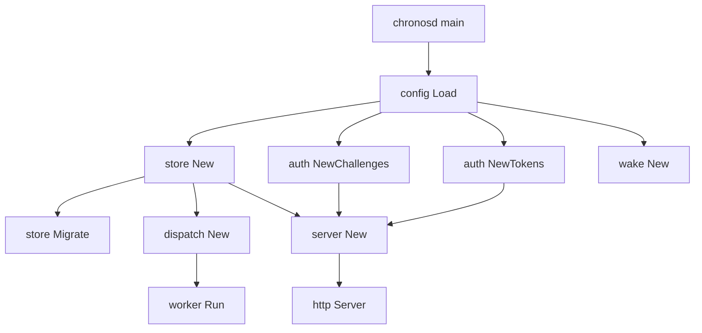

# Chronos Auth, Configuration, Storage, Server, Docs, and Deployment Shell

## Overview

Chronos is the fleet-wide wake and scheduling control plane for Matrix agents. The daemon takes durable alarm requests, stores them in Postgres, applies auth around agent identity, and later wakes the router so the agent can resume with the original context.

This section focuses on the Chronos surface that is unique to this runtime slice: the auth primitives, config overlay loader, Postgres-backed alarm store, HTTP server wiring, the documentation set that explains the service, and the shell assets that install and expose `chronosd`.

## Runtime wiring

`chronos/cmd/chronosd/main.go` boots the daemon in a fixed order: load config, connect to Postgres, run migrations, create the challenge and token primitives, start the dispatch worker, and then start the HTTP server. It also installs a signal-driven shutdown path so a process stop drains the server cleanly.

## Chronos daemon entry point

*`chronos/cmd/chronosd/main.go`*

`main` calls `run`, and `run` returns the process exit code. The entry point creates a logger, binds `SIGINT` and `SIGTERM` into a context, loads config, opens the store, migrates the database, starts the nonce garbage collector, starts the dispatch worker, and then starts the HTTP server.

### Startup and shutdown behavior

- `telemetry.NewLogger()` creates the process logger used by startup, storage, worker, and HTTP handler paths.
- `config.Load()` resolves the runtime configuration before any network or database side effects.
- `store.New(ctx, cfg.PostgresURI)` creates the Postgres pool and fails fast if the DSN is invalid or unreachable.
- `st.Migrate(ctx, migDir)` applies SQL migrations after resolving the migrations directory relative to `CHRONOS_ROOT` or the current working directory.
- `auth.NewChallenges(cfg.ChallengeTTL)` creates the in-memory nonce store.
- `auth.NewTokens(cfg.AgentAuthSecret, cfg.TokenTTL)` creates the stateless principal token signer.
- A background goroutine calls `challenges.Purge()` every 5 minutes.
- `wake.New(cfg.RouterWakeURL, cfg.WakeToken)` and `dispatch.New` prepare the wake delivery worker.
- `server.New(server.Deps{})` builds the HTTP surface.
- `http.Server` is configured with `ReadHeaderTimeout: 10 * time.Second`.
- Shutdown waits up to 15 seconds before forcing the process exit path to complete.

`moduleRoot()` resolves the migrations base directory by honoring `CHRONOS_ROOT` first, then the working directory, then `.`.

## Auth primitives

The daemon logs a warning when CHRONOS_TOKEN or CHRONOS_WAKE_TOKEN is empty. In that mode transport auth or router wake auth is intentionally disabled for local or skeleton boots, not for production use.

*`chronos/internal/auth/identity.go`*

*`chronos/internal/auth/token.go`*

*`chronos/internal/auth/auth_test.go`*

Chronos uses two auth layers:

1. A shared transport bearer that proves the caller is a legitimate Matrix daemon.
2. An agent-DID principal token that proves which owner is acting.

### Type fields

#### `DID`

| Property | Type | Description |
| --- | --- | --- |
| `Raw` | `string` | Original DID string after trimming |
| `Label` | `string` | DID label segment |
| `KeyFP` | `string` | Lowercased 16-hex fingerprint extracted from the DID |

#### `entry`

| Property | Type | Description |
| --- | --- | --- |
| `did` | `string` | DID bound to the nonce |
| `exp` | `time.Time` | Expiry timestamp for the nonce |

#### `Tokens`

| Property | Type | Description |
| --- | --- | --- |
| `key` | `[]byte` | HMAC key derived from the configured secret |
| `ttl` | `time.Duration` | Token lifetime |
| `now` | `func() time.Time` | Time source used for minting and expiry checks |

#### `Claims`

| Property | Type | Description |
| --- | --- | --- |
| `DID` | `string` | Verified agent DID |
| `Owner` | `string` | Owner user ID derived from the DID label |

### Public functions and methods

#### DID parsing and verification helpers

| Method | Description |
| --- | --- |
| `ParseDID` | Parses `did:matrix:<label>:<16-hex-fingerprint>` and returns a normalized `DID` |
| `IsUUID` | Checks whether a label is a canonical UUID |
| `OwnerFromDID` | Returns the lowercase UUID label when present, otherwise returns the raw label |
| `ChallengeMessage` | Builds the exact message string the agent must sign |
| `VerifySignature` | Verifies the ed25519 signature and checks that the public key fingerprint matches the DID |

#### Challenge store

| Method | Description |
| --- | --- |
| `NewChallenges` | Creates the in-memory nonce store with a TTL |
| `TTL` | Returns the configured nonce TTL |
| `Create` | Issues a nonce bound to a DID and returns the nonce plus the signed message |
| `Consume` | Atomically validates and deletes a nonce |
| `Purge` | Drops expired nonces from the store |

#### Principal token signer

| Method | Description |
| --- | --- |
| `NewTokens` | [REDACTED] |
| `Mint` | Creates a short-lived token carrying DID, owner, and expiry |
| `Verify` | Verifies token signature, expiry, and claim shape |

### Auth flow details

`ParseDID` accepts only the matrix DID shape used by Chronos. `VerifySignature` trims `0x` prefixes, checks that the public key is a 32-byte ed25519 key, and verifies the message built by `ChallengeMessage`.

`NewChallenges` stores nonces in memory with a TTL. `Create` generates 24 random bytes, encodes them with raw URL-safe base64, and stores them with the DID and expiration time. `Consume` is single-use and deletes the nonce atomically.

`NewTokens` derives the HMAC key from `sha256.Sum256` of the configured secret. `Mint` encodes `did|owner|expUnix` as the payload and returns the token together with its lifespan in seconds. `Verify` rejects malformed payloads, bad MACs, expired tokens, and empty claims.

### Auth tests

handleVerify in chronos/internal/server/server.go consumes the nonce before verifying the signature. That means a request with a valid nonce but a bad signature burns the nonce even though verification fails.

`chronos/internal/auth/auth_test.go` exercises the public auth surface with these checks:

- `TestParseDID` validates DID parsing, key fingerprint extraction, and owner extraction.
- `TestParseDIDRejectsGarbage` confirms malformed strings are rejected.
- `TestChallengeVerifyRoundTrip` validates the nonce creation, single-use consumption, and signature verification path.
- `TestVerifySignatureRejectsWrongKey` proves the fingerprint check rejects an unrelated public key.
- `TestTokenRoundTrip` verifies minting and token parsing.
- `TestTokenRejectsTamper` confirms token MAC validation fails for tampering.
- `TestTokenRejectsExpired` confirms expiry is enforced.

### Request and response types

#### `ChallengeRequest`

| Property | Type | Description |
| --- | --- | --- |
| `DID` | `string` | DID to challenge |

#### `ChallengeResponse`

| Property | Type | Description |
| --- | --- | --- |
| `DID` | `string` | Echoed DID |
| `Nonce` | `string` | One-time nonce |
| `Message` | `string` | Exact message the agent must sign |
| `ExpiresIn` | `int` | Challenge TTL in seconds |

#### `VerifyRequest`

| Property | Type | Description |
| --- | --- | --- |
| `DID` | `string` | DID to verify |
| `PublicKey` | `string` | Hex-encoded ed25519 public key |
| `Nonce` | `string` | Challenge nonce |
| `Signature` | `string` | Hex-encoded ed25519 signature |

#### `VerifyResponse`

| Property | Type | Description |
| --- | --- | --- |
| `Token` | `string` | Short-lived principal token |
| `OwnerUserID` | `string` | Owner user ID derived from the DID |
| `ExpiresIn` | `int` | Token TTL in seconds |

### Token and challenge semantics

- The DID format is `did:matrix:<label>:<fingerprint>`.
- The DID label is treated as the owner user ID when it is a UUID.
- Principal tokens are stateless and carry both the DID and owner.
- The token format is `base64url(payload).base64url(mac)`.
- `ChallengeMessage` must stay in lockstep with the proxy that signs it.

## Configuration loader

*`chronos/internal/config/config.go`*

*`chronos/internal/config/kvx.go`*

Chronos config is env-first with an optional `chronos.config.kvx` overlay. The loader resolves the file path from `CHRONOS_CONFIG`, defaults to `chronos.config.kvx`, and treats a missing file as a valid empty overlay.

### Config fields

#### `Config`

| Property | Type | Description |
| --- | --- | --- |
| `Port` | `int` | Box-local listen port |
| `PostgresURI` | `string` | Shared Matrix Postgres DSN |
| `MigrationsDir` | `string` | Forward-only SQL migration directory |
| `TransportToken` | `string` | Shared bearer token for transport auth |
| `AgentAuthSecret` | `string` | HMAC secret for principal tokens |
| `ChallengeTTL` | `time.Duration` | Nonce lifetime |
| `TokenTTL` | `time.Duration` | Principal token lifetime |
| `RouterWakeURL` | `string` | Router wake endpoint URL |
| `WakeToken` | `string` | Shared secret for wake delivery auth |
| `Tick` | `time.Duration` | Dispatch polling interval |
| `MaxFailures` | `int` | Default retry ceiling per alarm |
| `ClaimLease` | `time.Duration` | Claim lease duration before reclaim |
| `ClaimBatch` | `int` | Maximum alarms claimed per tick |
| `Dev` | `bool` | Dev mode toggle |

### Public loader functions

| Method | Description |
| --- | --- |
| `Load` | Resolves config from overlay, environment, and defaults |
| `pick` | Returns the first non-empty value from env, overlay, and default |
| `pickUint` | Parses the env value as `uint64` or falls back to the resolved value |

### Resolution rules

| Source | Precedence | Behavior |
| --- | --- | --- |
| `chronos.config.kvx` | Lowest | Provides the base overlay |
| Environment variables | Higher | Override overlay values |
| Hardcoded defaults | Fallback | Fill in remaining zero values |

### Environment mapping

| Variable | Field | Behavior |
| --- | --- | --- |
| `CHRONOS_PORT` | `Port` | Overrides the listen port |
| `CHRONOS_POSTGRES_URI` | `PostgresURI` | Required in every mode |
| `CHRONOS_MIGRATIONS_DIR` | `MigrationsDir` | Overrides the migration directory |
| `CHRONOS_TOKEN` | `TransportToken` | Transport bearer |
| `CHRONOS_AGENT_AUTH_SECRET` | `AgentAuthSecret` | Principal token secret |
| `CHRONOS_ROUTER_WAKE_URL` | `RouterWakeURL` | Router wake URL |
| `CHRONOS_WAKE_TOKEN` | `WakeToken` | Wake delivery secret |
| `CHRONOS_TICK_MS` | `Tick` | Dispatch poll interval in milliseconds |
| `CHRONOS_MAX_FAILURES` | `MaxFailures` | Retry ceiling |
| `CHRONOS_DEV` | `Dev` | Dev mode toggle |
| `CHRONOS_CONFIG` | file path | Overlay file location |

`ChallengeTTL`, `TokenTTL`, `ClaimLease`, and `ClaimBatch` are resolved from the KVX overlay, not from environment variables.

### Production and dev behavior

- `CHRONOS_POSTGRES_URI` is required in every mode.
- In production, `CHRONOS_TOKEN`, `CHRONOS_AGENT_AUTH_SECRET`, and `CHRONOS_WAKE_TOKEN` are required.
- In dev mode, missing secrets are allowed.
- When `AgentAuthSecret` is empty outside production, the loader assigns the dev secret string used by this daemon family.
- Non-positive durations and counts fall back to the hardcoded defaults.

### KVX parser

#### `kvxDoc`

| Property | Type | Description |
| --- | --- | --- |
| `sections` | `map[string]map[string]string` | Parsed section map |
| `order` | `[]string` | Section order as encountered |

#### Parser helpers

| Method | Description |
| --- | --- |
| `parseKVXFile` | Reads a KVX file and returns an empty doc when the file is missing |
| `newKVXDoc` | Allocates a blank KVX document |
| `parseKVX` | Parses the sectioned key-value stream |
| `stripComment` | Removes trailing comments outside quoted strings |
| `str` | Returns an interpolated string value |
| `uint64Or` | Parses a field as `uint64` or returns the fallback |

The parser is zero-dependency, scanner-based, and honors `${ENV_VAR}` interpolation.

### Related configuration surface

The same env-first overlay pattern is mirrored in deus/internal/config/config.go, layerx/internal/config/config.go, and neo/internal/config/config.go. Their companion tests are deus/internal/config/config_test.go, layerx/internal/config/config_test.go, and neo/internal/config/config_test.go.

The Chronos loader fits the same general daemon pattern used across the matrix-core services, but the Chronos-specific twist is the optional `chronos.config.kvx` overlay and the dedicated wake, claim, and auth knobs.

## Postgres store

*`chronos/internal/store/store.go`*

*`chronos/internal/store/alarms.go`*

Chronos stores alarms durably in Postgres. The store layer owns connection pooling, migration application, and all alarm CRUD plus claim and retry mutations.

### Store fields

#### `Store`

| Property | Type | Description |
| --- | --- | --- |
| `pool` | `*pgxpool.Pool` | Postgres connection pool |

### Store methods

| Method | Description |
| --- | --- |
| `New` | Opens and pings a Postgres pool |
| `Close` | Closes the pool |
| `Ping` | Verifies database connectivity |
| `Migrate` | Applies forward-only SQL files in lexical order |

### Alarm storage behavior

`Migrate` creates and uses the dedicated `chronos_schema_migrations` table so Chronos does not collide with other services that share the same database. It reads `.sql` files, sorts them lexically, applies each file inside a transaction, and records the applied version after the SQL succeeds.

`ErrNotFound` is returned when an alarm is unknown or not owned by the caller.

### Alarm operation methods

| Method | Description |
| --- | --- |
| `scanAlarm` | Maps a database row onto `types.Alarm` |
| `CreateAlarm` | Inserts a new alarm or returns the existing row when idempotency matches |
| `ListAlarms` | Returns the caller’s alarms, newest first |
| `GetAlarm` | Returns one alarm with owner scoping |
| `CancelAlarm` | Cancels an active alarm or returns the current row when the alarm is already terminal |
| `ClaimDue` | Claims due alarms with lease protection |
| `MarkFired` | Marks a once alarm as fired |
| `Reschedule` | Advances a cron alarm after a successful fire |
| `RecordRetry` | Increments failure count and schedules the next retry |
| `MarkFailed` | Marks a once alarm as failed when retries are exhausted |
| `RescheduleAfterFailure` | Advances a cron alarm after a permanent failure |

### Storage details

- `CreateAlarm` defaults an empty payload to `{}` before inserting.
- `CreateAlarm` deduplicates on `(owner_did, idempotency_key)` when the key is non-empty.
- `ListAlarms` clamps the page size to a safe default when the caller passes an invalid value.
- `ClaimDue` leases rows with `FOR UPDATE SKIP LOCKED` so concurrent workers do not double-claim them.
- `ClaimDue` respects a lease window by allowing rows to be reclaimed only after the lease has expired.
- `MarkFired`, `Reschedule`, `RecordRetry`, `MarkFailed`, and `RescheduleAfterFailure` all write through the same `exec` helper.
- `RecordRetry`, `MarkFailed`, and `RescheduleAfterFailure` truncate the stored error text before persisting it.

#### Alarm row shape

| Property | Type | Description |
| --- | --- | --- |
| `ID` | `string` | Alarm row ID |
| `OwnerDID` | `string` | Full verified agent DID |
| `UserID` | `string` | Owner user ID derived from the DID |
| `Label` | `string` | Alarm label |
| `Kind` | `string` | `once` or `cron` |
| `FireAt` | `*time.Time` | Absolute fire time for once alarms |
| `CronExpr` | `string` | Cron expression for recurring alarms |
| `Timezone` | `string` | Timezone used for cron evaluation |
| `NextFireAt` | `time.Time` | Next scheduled execution time |
| `ConversationID` | `string` | Conversation to resume |
| `WakeMessage` | `string` | Context delivered on wake |
| `Payload` | `json.RawMessage` | Opaque payload preserved verbatim |
| `Status` | `string` | Alarm lifecycle status |
| `IdempotencyKey` | `string` | Idempotency key |
| `MaxFailures` | `int` | Maximum retry count |
| `FailureCount` | `int` | Number of failed deliveries |
| `LastError` | `string` | Most recent error text |
| `ClaimedAt` | `*time.Time` | Claim timestamp |
| `CreatedAt` | `time.Time` | Creation timestamp |
| `UpdatedAt` | `time.Time` | Last update timestamp |
| `LastFiredAt` | `*time.Time` | Last successful fire timestamp |

### Storage constants and helpers

- `alarmColumns` is the canonical projection used by every alarm query.
- `scanAlarm` depends on the exact column order.
- `truncErr` caps persisted error text at 2000 characters.

## HTTP server

*`chronos/internal/server/server.go`*

*`chronos/pkg/types/types.go`*

The HTTP server exposes Chronos over JSON and wraps the mux in transport auth. Public paths are `GET /` and `GET /healthz`; the alarm and agent auth paths run behind the transport bearer, and the alarm paths also require `X-Chronos-Agent`.

### Server fields

#### `Server`

| Property | Type | Description |
| --- | --- | --- |
| `store` | `*store.Store` | Postgres store |
| `challenges` | `*auth.Challenges` | In-memory nonce store |
| `tokens` | `*auth.Tokens` | Principal token signer and verifier |
| `log` | `*slog.Logger` | Structured logger |
| `transportToken` | `string` | Shared transport bearer |
| `defaultMaxFail` | `int` | Default retry ceiling for alarms |

### Constructor dependencies

| Type | Description |
| --- | --- |
| `*store.Store` | Durable alarm persistence |
| `*auth.Challenges` | One-time challenge store |
| `*auth.Tokens` | [REDACTED] |
| `*slog.Logger` | Structured logging |
| `string` | Transport bearer token |
| `int` | Default retry ceiling |

### Server methods

| Method | Description |
| --- | --- |
| `New` | Builds a server with default logger and retry fallback |
| `Handler` | Returns the fully wired HTTP handler |

### HTTP surface behavior

`transportMiddleware` wraps the mux and compares the bearer token from `Authorization` against the configured transport token. When `transportToken` is empty, all paths are open. `GET /` and `GET /healthz` bypass transport auth.

`handleHealthz` pings the store with a 2 second timeout and returns a health envelope. A failed ping changes the HTTP status to 503.

`handleRoot` returns the daemon identity and the health path when the request path is exactly `/`. Any other path routed there returns 404.

`handleChallenge` validates the DID, creates a challenge nonce, and returns the signed message and expiry.

`handleVerify` validates the nonce, verifies the signature, derives the owner from the DID, mints the principal token, and returns the owner user ID and token expiry.

`principal` extracts `X-Chronos-Agent`, verifies it, and returns the claims used by every alarm endpoint.

`handleCreateAlarm` requires `wake_message`, builds a `types.Alarm`, fills `MaxFailures` from the default when needed, and resolves `Kind` as either `once` or `cron`. For `once`, it uses `schedule.NextOnce` and forces `Timezone` to `UTC`. For `cron`, it uses `schedule.NextCron` and defaults the timezone to `UTC` when the request leaves it empty.

`handleListAlarms` supports an optional `limit` query parameter and projects each row through `types.ViewOf`.

`handleGetAlarm` and `handleCancelAlarm` both use the owner-scoped alarm ID path and convert store errors into not found or internal responses.

### Response envelope and error codes

`types.OK`, `types.Fail`, and `types.NewError` create the uniform envelope used by the server. `types.Error` carries `Code`, `Message`, and `Retryable`.

The stable error codes are:

- `invalid_request`
- `unauthorized`
- `not_found`
- `conflict`
- `internal`

### Alarm types

#### `Envelope`

| Property | Type | Description |
| --- | --- | --- |
| `Ok` | `bool` | Success flag |
| `Data` | `any` | Success payload |
| `Error` | `*Error` | Structured error payload |

#### `Error`

| Property | Type | Description |
| --- | --- | --- |
| `Code` | `string` | Stable machine-readable error code |
| `Message` | `string` | Human-readable error message |
| `Retryable` | `bool` | Retry hint |

#### `Alarm`

| Property | Type | Description |
| --- | --- | --- |
| `ID` | `string` | Alarm ID |
| `OwnerDID` | `string` | Full verified owner DID |
| `UserID` | `string` | Owner user ID |
| `Label` | `string` | Alarm label |
| `Kind` | `string` | `once` or `cron` |
| `FireAt` | `*time.Time` | Once-alarm absolute fire time |
| `CronExpr` | `string` | Cron schedule expression |
| `Timezone` | `string` | Cron timezone |
| `NextFireAt` | `time.Time` | Next run time |
| `ConversationID` | `string` | Conversation to resume |
| `WakeMessage` | `string` | Wake payload text |
| `Payload` | `json.RawMessage` | Opaque payload |
| `Status` | `string` | Lifecycle status |
| `IdempotencyKey` | `string` | Idempotency key |
| `MaxFailures` | `int` | Retry ceiling |
| `FailureCount` | `int` | Retry counter |
| `LastError` | `string` | Last stored error |
| `ClaimedAt` | `*time.Time` | Lease claim time |
| `CreatedAt` | `time.Time` | Creation timestamp |
| `UpdatedAt` | `time.Time` | Last update timestamp |
| `LastFiredAt` | `*time.Time` | Last fire timestamp |

#### `View`

| Property | Type | Description |
| --- | --- | --- |
| `ID` | `string` | Alarm ID |
| `Label` | `string` | Alarm label |
| `Kind` | `string` | `once` or `cron` |
| `CronExpr` | `string` | Cron schedule expression |
| `Timezone` | `string` | Cron timezone |
| `NextFireAt` | `*time.Time` | Present only for active alarms |
| `ConversationID` | `string` | Conversation to resume |
| `WakeMessage` | `string` | Wake payload text |
| `Payload` | `json.RawMessage` | Opaque payload |
| `Status` | `string` | Lifecycle status |
| `IdempotencyKey` | `string` | Idempotency key |
| `MaxFailures` | `int` | Retry ceiling |
| `FailureCount` | `int` | Retry counter |
| `LastError` | `string` | Last stored error |
| `CreatedAt` | `time.Time` | Creation timestamp |
| `LastFiredAt` | `*time.Time` | Last fire timestamp |

#### `CreateAlarmRequest`

| Property | Type | Description |
| --- | --- | --- |
| `Label` | `string` | Alarm label |
| `Kind` | `string` | Alarm kind |
| `DelaySeconds` | `int64` | Relative delay for once alarms |
| `FireAt` | `string` | Absolute fire time for once alarms |
| `CronExpr` | `string` | Cron expression for recurring alarms |
| `Timezone` | `string` | Timezone for cron evaluation |
| `ConversationID` | `string` | Conversation to resume |
| `WakeMessage` | `string` | Required wake text |
| `Payload` | `json.RawMessage` | Opaque payload |
| `IdempotencyKey` | `string` | Idempotency key |
| `MaxFailures` | `int` | Retry ceiling |

#### `CreateAlarmResponse`

| Property | Type | Description |
| --- | --- | --- |
| `ID` | `string` | Alarm ID |
| `NextFireAt` | `time.Time` | Computed next fire time |
| `Status` | `string` | Alarm status |

### Type helpers

`ViewOf` projects a stored `Alarm` into its wire shape. It copies the high-entropy fields verbatim and only populates `NextFireAt` when the alarm is active.

### Route-level behavior summary

- `GET /healthz` checks database connectivity.
- `GET /` returns the daemon identity and health path.
- `POST /v1/agent/auth/challenge` returns the nonce and signed message for a DID.
- `POST /v1/agent/auth/verify` returns a short-lived principal token.
- `POST /v1/alarms` creates an alarm.
- `GET /v1/alarms` lists the caller’s alarms.
- `GET /v1/alarms` by ID returns one alarm owned by the caller.
- `DELETE /v1/alarms` by ID cancels one alarm owned by the caller.

### Request body handling

CancelAlarm leaves already-fired or already-cancelled rows untouched and then returns the current row. The delete path is idempotent, but the stored status is not rewritten when the alarm has already entered a terminal state.

`decode` limits request bodies to 256 KiB and returns a structured invalid request error for malformed JSON. The server writes every successful response through `writeJSON`, which sets `Content-Type: application/json`.

### Status and kind constants

Alarm kinds: `once`, `cron`

Alarm statuses: `active`, `fired`, `cancelled`, `failed`

Error codes: `invalid_request`, `unauthorized`, `not_found`, `conflict`, `internal`

## Documentation set

*`docs/chronos-docs/INDEX.md`*

*`docs/chronos-docs/api-reference.md`*

*`docs/chronos-docs/architecture.md`*

*`docs/chronos-docs/auth-system.md`*

*`docs/chronos-docs/config-system.md`*

*`docs/chronos-docs/tool-surface.md`*

*`docs/.web/src/content/chronos-docs/INDEX.md`*

*`docs/.web/src/content/chronos-docs/architecture.md`*

*`docs/.web/src/content/chronos-docs/config-system.md`*

*`docs/.web/src/content/chronos-docs/tool-surface.md`*

The docs tree provides the human-facing explanation of the same runtime described in code. The root Chronos index acts as the navigation hub, the API reference explains the HTTP surface and envelope, the architecture doc explains the five-layer shape and its relationship to Neo, Router, UWAC, and the rest of the fleet, the auth doc explains the transport and principal layers, the config doc explains the overlay rules, and the tool-surface doc explains the MCP-facing alarm tools and proxy flow.

The `docs/.web/src/content/chronos-docs` files mirror the published content for the web app. The mirrored `architecture.md`, `config-system.md`, and `tool-surface.md` files are the site-side copies of the same Chronos material.

### Docs site support files

*`docs/.web/components.json`*

*`docs/.web/pnpm-workspace.yaml`*

*`docs/.web/tsconfig.app.json`*

*`docs/.web/tsconfig.json`*

*`docs/.web/tsconfig.node.json`*

These files are support metadata for the docs site build:

- `docs/.web/components.json` sets the shadcn style, Tailwind integration, and alias map used by the app.
- `docs/.web/pnpm-workspace.yaml` declares `onlyBuiltDependencies` for the workspace.
- `docs/.web/tsconfig.app.json` sets the app compiler target, JSX mode, strictness, and path aliases.
- `docs/.web/tsconfig.json` wires the project references and base path.
- `docs/.web/tsconfig.node.json` configures the Node-side build target for the Vite config path.

## Deployment shell

*`deploy/chronos/install.sh`*

*`deploy/chronos/chronosd.service`*

*`deploy/chronos/nginx-snippet.conf`*

The deployment assets turn the daemon into a managed box service and optionally expose it through nginx.

### Installer behavior

`deploy/chronos/install.sh` is an idempotent root-only installer. It accepts `--binary`, `--postgres-uri`, `--token`, `--agent-secret`, `--wake-token`, and `--router-wake-url`. It then:

- creates the `matrix` group and system user when needed,
- installs the daemon binary into `/opt/matrix-chronos/chronosd`,
- copies migration SQL files into `/opt/matrix-chronos/migrations` when that source directory exists,
- writes `/etc/matrix/chronos.env`,
- installs the systemd service file,
- reloads systemd,
- enables and restarts `chronosd.service`.

The script emits a warning when the migrations source tree is missing, because the daemon applies migrations at boot. It also prints the environment keys that must be aligned on the router side and the daemon side.

### systemd unit behavior

`deploy/chronos/chronosd.service` runs the daemon as the `matrix` user and group, with `/opt/matrix-chronos` as the working directory. It loads `/etc/matrix/chronos.env`, sets `CHRONOS_ROOT=/opt/matrix-chronos`, starts after network and Postgres are available, restarts automatically, and applies a strict hardening profile. The service keeps `/opt/matrix-chronos` writable while restricting the rest of the filesystem.

### nginx snippet behavior

`deploy/chronos/nginx-snippet.conf` maps the public `/chronos/` route to the local `chronosd` listener on port 9096. It forwards the host and client IP headers, disables the extra `Connection` header, and keeps a separate `/chronos/healthz` location for the unauthenticated health check.

The snippet is optional and is meant for operators who want a public surface. The daemon still enforces its transport bearer on all non-public paths unless transport auth is intentionally disabled for local use.

## Logging and telemetry

`chronos/cmd/chronosd/main.go` creates the logger and passes it into the HTTP server as `Log`. That means startup, migration, dispatch, and request-path events share the same structured logging channel.

### Injection points

| Consumer | Logger use |
| --- | --- |
| `chronos/cmd/chronosd/main.go` | Logs config load, Postgres connect, migration, listen, and shutdown events |
| `chronos/internal/server/server.go` | Logs alarm create, list, cancel, and idempotency events |
| `chronos/internal/server/server.go` | Logs unexpected storage failures before returning internal errors |

The logger is created once at boot and reused across the runtime. No separate logging service is wired into the HTTP path.

## Key declarations reference

| Declaration | Location | Responsibility |
| --- | --- | --- |
| `main` | `chronos/cmd/chronosd/main.go` | Process entrypoint |
| `run` | `chronos/cmd/chronosd/main.go` | Full daemon bootstrap and shutdown flow |
| `moduleRoot` | `chronos/cmd/chronosd/main.go` | Resolves the migrations base directory |
| `DID` | `chronos/internal/auth/identity.go` | Parsed agent identity |
| `Challenges` | `chronos/internal/auth/identity.go` | In-memory challenge store |
| `Tokens` | [REDACTED] | Stateless principal token signer |
| `Claims` | `chronos/internal/auth/token.go` | Verified token claims |
| `Config` | `chronos/internal/config/config.go` | Chronos runtime configuration |
| `kvxDoc` | `chronos/internal/config/kvx.go` | Parsed overlay document |
| `Store` | `chronos/internal/store/store.go` | Postgres pool and migration runner |
| `Server` | `chronos/internal/server/server.go` | HTTP surface and auth wrapping |
| `Envelope` | `chronos/pkg/types/types.go` | Standard response wrapper |
| `Error` | `chronos/pkg/types/types.go` | Structured error payload |
| `Alarm` | `chronos/pkg/types/types.go` | Durable alarm row shape |
| `View` | `chronos/pkg/types/types.go` | API alarm projection |
| `CreateAlarmRequest` | `chronos/pkg/types/types.go` | Create alarm request body |
| `CreateAlarmResponse` | `chronos/pkg/types/types.go` | Create alarm response body |
| `ChallengeRequest` | `chronos/pkg/types/types.go` | Agent challenge request body |
| `ChallengeResponse` | `chronos/pkg/types/types.go` | Agent challenge response body |
| `VerifyRequest` | `chronos/pkg/types/types.go` | Agent verify request body |
| `VerifyResponse` | `chronos/pkg/types/types.go` | Agent verify response body |

This section intentionally stays on the Chronos runtime. The neighboring Neo, Gateway, Router, and UWAC services are only referenced where Chronos explicitly depends on their shared auth, wake, and config patterns.