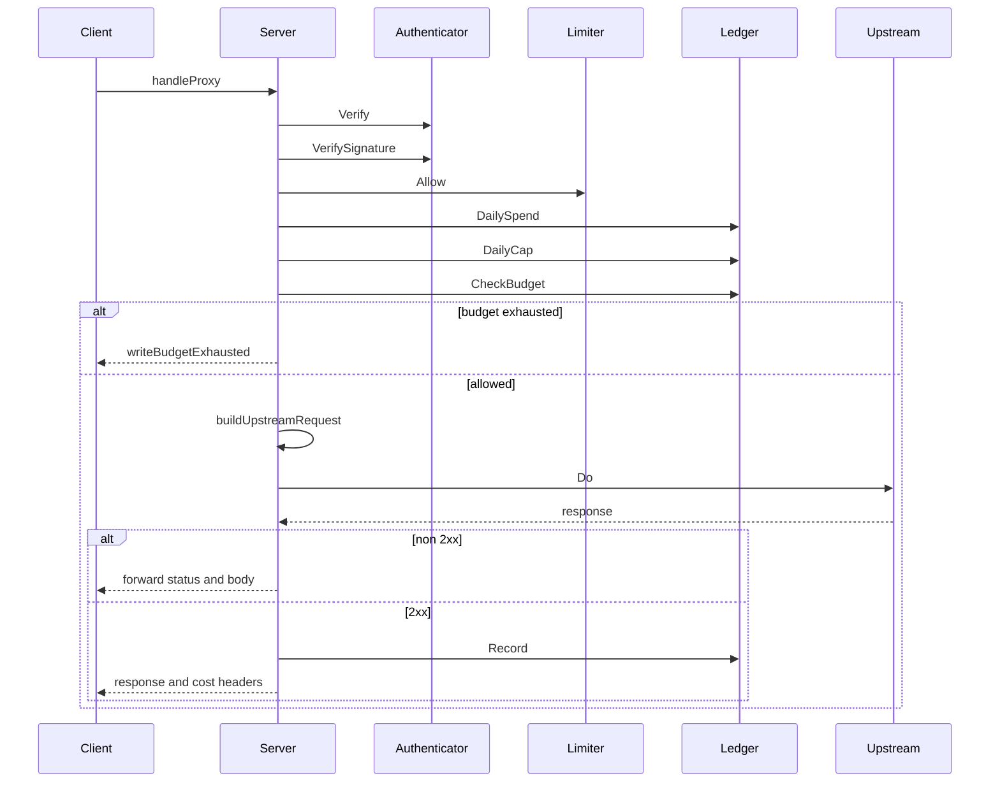

# Gateway Authentication, Ledger, Rate Limiting, Proxying, and Types

## Overview

The gateway is the service boundary that sits in front of the per-user daemon LLM calls. It authenticates each request, applies per-actor request-rate and daily-spend controls, decides whether the call is free-tier metered traffic or BYO traffic, forwards the request to Fireworks or Together, and writes the cost back into the ledger after a successful upstream response.

The implementation is split across a small Go entrypoint, four internal service packages, and one shared wire-types package. The repository README documents the operational contract: free-tier whitelist rules, PAX budget hard-stops, streaming usage handling, kill switches, and the in-memory ledger fallback used for local development.

## Source Files and Runtime Responsibilities

| File | Concrete behavior |
| --- | --- |
| `gateway/README.md` | Documents the gateway contract: every per-user daemon call is mediated, free-tier traffic is whitelisted by slot and model, daily PAX spending is capped, streaming usage is scanned from the SSE tail, kill switches can stop the service, and an empty Postgres URI selects the in-memory ledger for local development. |
| `gateway/cmd/matrix-gateway/main.go` | Parses runtime flags and environment, builds the authenticator, ledger backend, rate limiter, and proxy server, then runs the HTTP listener with graceful shutdown and signal handling. |
| `gateway/internal/auth/auth.go` | Validates the shared bearer token and `X-Matrix-Actor-DID` header, and exposes the future signature-verification hook. |
| `gateway/internal/auth/auth_test.go` | Confirms valid bearer authentication, rejection paths for token and actor failures, the empty-token policy, and the current no-op signature hook. |
| `gateway/internal/ledger/ledger.go` | Defines the credit-ledger entry shape, the daily-cap shape, the ledger interface, the in-memory implementation, and the budget-check helper. |
| `gateway/internal/ledger/ledger_test.go` | Verifies record-and-sum behavior, UTC day isolation, cap defaults and overrides, budget arithmetic, and empty-actor rejection. |
| `gateway/internal/proxy/proxy.go` | Mounts the HTTP surface, performs auth, rate limiting, budget checks, upstream forwarding, streaming usage extraction, post-response ledger writes, and response-header stamping. |
| `gateway/internal/ratelimit/ratelimit.go` | Implements the in-memory per-actor token bucket limiter used before the request body is read. |
| `gateway/internal/ratelimit/ratelimit_test.go` | Verifies disabled-by-default behavior, refill logic, per-key separation, concurrent access, and snapshot semantics. |
| `gateway/internal/types/types.go` | Centralizes shared header names, slot values, and the request/response wire structs used by the gateway. |

## Gateway Process Startup

### `gateway/cmd/matrix-gateway/main.go`

The entrypoint is `main`, which immediately delegates to `run(os.Args[1:])`. The runtime is assembled in a strict order: logger, Fireworks key check, authenticator, router decision engine, ledger backend, rate limiter, kill switch, proxy server, and finally `http.Server`.

The startup path is source-backed and deterministic:

1. `run` parses the CLI flags.
2. `newLogger` is created from `-log-format`.
3. If `-free-tier-only=true`, the process refuses to boot unless `FIREWORKS_API_KEY` is present.
4. `auth.New` receives `MATRIX_GATEWAY_TOKEN`.
5. `routing.New` receives `FreeTierOnly`.
6. The ledger backend is chosen from `-postgres-uri`.- Empty URI: `ledger.NewMemory(defaultCap)`.
- Non-empty URI: `sql.Open`, `PingContext`, then `ledger.NewPostgres`.
7. `ratelimit.New` receives `-rate-per-sec` and `-rate-burst`.
8. `MATRIX_GATEWAY_DISABLED=true` arms the kill switch.
9. `proxy.New` receives the authenticator, router, ledger, limiter, provider keys, logger, kill-switch callback, and pre-estimate cost.
10. `http.Server` is created with `ReadHeaderTimeout` and the proxy mux.
11. The process listens, waits for SIGINT or SIGTERM, then shuts down with the configured drain budget and closes the ledger.

### Runtime configuration

| Flag or env | Source-backed behavior |
| --- | --- |
| `-addr` | HTTP listen address, default `127.0.0.1:9090`. |
| `-postgres-uri` | Empty selects the in-memory ledger; non-empty opens Postgres and pings it before serving. |
| `-postgres-driver` | Driver name passed to `sql.Open`, default `postgres`. |
| `-free-tier-only` | Forces metered free-tier routing and requires `FIREWORKS_API_KEY`. |
| `-log-format` | `text` or `json`. |
| `-default-cap-pax` | Default daily PAX cap when no actor-specific row exists. |
| `-rate-per-sec` | Per-actor request rate used by the limiter. |
| `-rate-burst` | Per-actor burst size used by the limiter. |
| `-pre-estimate` | Projected PAX cost used for the pre-flight budget gate. |
| `-shutdown` | Graceful shutdown timeout. |
| `-read-header-timeout` | `http.Server.ReadHeaderTimeout`. |
| `MATRIX_GATEWAY_TOKEN` | [REDACTED] |
| `FIREWORKS_API_KEY` | [REDACTED] |
| `TOGETHER_API_KEY` | [REDACTED] |
| `MATRIX_GATEWAY_DISABLED` | Boolean kill switch that disables serving at boot. |

### Logging and telemetry

`newLogger` supports two output modes:

- `text`: emits `matrix-gateway`-prefixed lines in `key=value` form when fields are present.
- `json`: emits one JSON object per line with `event`, `ts`, and the supplied fields.

The proxy receives the logger through `proxy.Options.Logf`, so request lifecycle events are emitted from the service boundary rather than from `main` directly. The key event names are source-backed and include startup, shutdown, budget, upstream, stream, and ledger-error transitions.

| Event | When emitted |
| --- | --- |
| `ledger.memory` | In-memory ledger selected at boot. |
| `ledger.postgres` | Postgres ledger selected at boot. |
| `kill_switch.engaged_at_boot` | `MATRIX_GATEWAY_DISABLED=true` is parsed as true. |
| `gateway.listen` | Listener starts with resolved runtime settings. |
| `gateway.signal` | SIGINT or SIGTERM is received. |
| `gateway.shutdown.timeout` | Shutdown exceeds the drain window. |
| `ledger.close.error` | Closing the ledger returns an error. |
| `gateway.shutdown.done` | Shutdown path completes. |
| `gateway.budget.exhausted` | Pre-flight budget gate rejects a request. |
| `gateway.upstream.stream_err` | SSE stream read fails mid-response. |
| `gateway.usage.missing` | Upstream response had no usage block. |
| `gateway.cost.error` | Cost computation failed. |
| `gateway.ledger.record_err` | Post-response ledger write failed. |

## Authentication

### `gateway/internal/auth/auth.go`

The authentication package checks two request headers on every gateway call:

- `Authorization` via a shared bearer token.
- `X-Matrix-Actor-DID` via a permissive DID-shape check.

`New` refuses to construct an authenticator when the token is empty unless `AllowEmptyToken` is explicitly set. That makes the empty-token path local-dev only. `Verify` is the normal request gate, and `VerifySignature` is present as a stub so the signature boundary already exists in the proxy path.

#### Public methods

| Method | Description |
| --- | --- |
| `Verify` | Checks `Authorization` and `X-Matrix-Actor-DID`, then returns the actor DID or one of the exported auth errors. |
| `VerifySignature` | Currently returns nil unconditionally while preserving the future signature-verification hook. |

#### `Options`

| Property | Type | Description |
| --- | --- | --- |
| `Token` | `string` | Shared secret expected in the incoming `Authorization` header. |
| `AllowEmptyToken` | `bool` | Enables the empty-token local-dev path. |

#### `Authenticator`

| Property | Type | Description |
| --- | --- | --- |
| `token` | `string` | Expected bearer token, compared with constant-time equality. |
| `allowEmptyToken` | `bool` | Allows all requests only when the token is empty and this flag is set. |

#### Exported errors

| Value | Meaning |
| --- | --- |
| `ErrMissingActor` | `X-Matrix-Actor-DID` was empty. |
| `ErrUnauthorized` | The bearer token was missing or did not match. |
| `ErrMalformedActor` | The actor header failed the permissive `did:` shape check. |

#### Request validation behavior

- `Verify` trims the actor header and rejects empty or malformed values.
- `Verify` returns `ErrUnauthorized` when the `Authorization` header is not `Bearer`-prefixed or the supplied token does not match.
- `VerifySignature` is still called by the proxy, but it currently does not block any request.

### Validation coverage: `gateway/internal/auth/auth_test.go`

| Test | What it proves |
| --- | --- |
| `TestVerifyAcceptsValidBearer` | A valid bearer token and DID-shaped actor value are accepted. |
| `TestVerifyRejectsBadToken` | [REDACTED] |
| `TestVerifyRejectsMissingActor` | Missing `X-Matrix-Actor-DID` produces `ErrMissingActor`. |
| `TestVerifyRejectsMalformedActor` | Non-DID actor strings produce `ErrMalformedActor`. |
| `TestEmptyTokenWithoutAllowFails` | [REDACTED] |
| `TestEmptyTokenWithAllowAcceptsEverything` | [REDACTED] |
| `TestVerifySignatureStubReturnsNil` | The signature hook currently returns nil. |

## Ledger and Budget Enforcement

### `gateway/internal/ledger/ledger.go`

The ledger package is the billing core. It models a per-call `credit_ledger` entry, a per-actor `daily_budget_caps` record, and the helper that decides whether a projected call can proceed. The in-memory implementation is used both for tests and for the empty-URI local-dev path.

The gateway charges after a successful upstream response, not before. To avoid charging failed calls, the proxy performs a pre-flight check with `CheckBudget` using a conservative projected cost, then records the exact cost only after the response has been received.

#### Public methods

| Method | Description |
| --- | --- |
| `NewMemory` | Constructs an in-memory ledger and falls back to `DefaultDailyPaxCap` when the supplied default is empty. |
| `SetClock` | Injects a test clock for deterministic time-bucket behavior. |
| `Record` | Appends a `credit_ledger` entry and fills `RateTableVersion` and `OccurredAt` when needed. |
| `DailySpend` | Returns the actor’s UTC-day spend as a canonical decimal string. |
| `DailyCap` | Returns the actor’s cap or the default when no actor-specific cap exists. |
| `SetCap` | Updates an actor-specific cap in memory. |
| `Snapshot` | Returns a copy of the in-memory rows for tests. |
| `Close` | Releases resources; the in-memory implementation is a no-op. |

#### `Entry`

| Property | Type | Description |
| --- | --- | --- |
| `ActorDID` | `string` | Actor identity used as the spend key. |
| `IntentID` | `string` | Intent identifier carried through from the request. |
| `GoalID` | `string` | Goal identifier carried through from the request. |
| `Model` | `string` | Model ID priced for the request. |
| `Slot` | `string` | Slot associated with the call. |
| `KindRoute` | `string` | Sub-route used by the executor path. |
| `TokensInput` | `int` | Prompt token count. |
| `TokensOutput` | `int` | Completion token count. |
| `CostPax` | `string` | Canonical PAX cost string. |
| `RateTableVersion` | `int` | Rate card version used to price the call. |
| `OccurredAt` | `time.Time` | Timestamp used for daily aggregation. |

#### `DailyCap`

| Property | Type | Description |
| --- | --- | --- |
| `ActorDID` | `string` | Actor identity. |
| `DailyPaxMax` | `string` | Per-actor daily PAX limit. |
| `UpdatedAt` | `time.Time` | Time the cap record was updated. |

#### `Memory`

| Property | Type | Description |
| --- | --- | --- |
| `mu` | `sync.Mutex` | Serializes access to rows, caps, and the test clock. |
| `rows` | `[]Entry` | Recorded ledger entries. |
| `caps` | `map[string]string` | Actor-specific daily caps. |
| `defCap` | `string` | Default cap returned when no actor-specific cap exists. |
| `nowFunc` | `func() time.Time` | Optional test clock. |

#### Budget helpers and values

| Name | Kind | Meaning |
| --- | --- | --- |
| `DefaultDailyPaxCap` | value | Default daily cap used when no actor row exists. |
| `CheckBudget` | function | Compares `spent + projection` against `cap`, returning remaining budget and an exhaustion flag. |
| `ErrBudgetExhausted` | value | Typed budget error that callers can wrap and compare with `errors.Is`. |
| `startOfUTCDay` | helper | Normalizes timestamps to the start of the UTC day for spend aggregation. |

#### Budget logic

- `Record` rejects empty `ActorDID`.
- `Record` uses `rates.RateTableVersion` when the entry omits a version.
- `Record` stamps `OccurredAt` from the ledger clock when the field is zero.
- `DailySpend` only counts rows whose timestamps fall inside the UTC day containing the supplied time.
- `DailyCap` falls back to the default cap when the actor has no row.
- `CheckBudget` reports exhaustion when the projected total exceeds the cap and still returns the remaining amount computed from the cap and current spend.

### Validation coverage: `gateway/internal/ledger/ledger_test.go`

| Test | What it proves |
| --- | --- |
| `TestMemoryRecordAndDailySpend` | Two same-day records sum to the expected PAX value. |
| `TestMemoryDailySpendIsolatesActorAndDay` | Spend is separated by actor and by UTC day. |
| `TestMemoryDailyCapDefault` | Missing actor caps fall back to `DefaultDailyPaxCap`. |
| `TestMemoryDailyCapOverride` | `SetCap` overrides the per-actor cap. |
| `TestCheckBudget` | Remaining-balance math and exhaustion detection behave as expected. |
| `TestRecordRejectsEmptyActor` | Empty actors are rejected on insert. |

## Rate Limiting

### `gateway/internal/ratelimit/ratelimit.go`

The limiter is a per-actor token bucket that runs before the request body is read. It is in-memory, concurrency-safe, and intentionally simple because the gateway is a single-process service boundary.

`New` disables limiting when `ratePerSec` is zero, and `burst <= 0` defaults to the refill rate. `Allow` is a one-token wrapper over `AllowN`, and `Snapshot` exposes the current token count for tests or metrics-style inspection.

#### Public methods

| Method | Description |
| --- | --- |
| `New` | Constructs a limiter with the supplied refill rate and burst capacity. |
| `SetClock` | Injects a test clock for refill determinism. |
| `Allow` | Consumes one token for a key. |
| `AllowN` | Consumes an arbitrary token count for a key. |
| `Snapshot` | Returns the current token balance for a key. |
| `Reset` | Clears all buckets. |
| `String` | Returns a compact descriptor string. |

#### `Limiter`

| Property | Type | Description |
| --- | --- | --- |
| `mu` | `sync.Mutex` | Guards the bucket map and bucket mutations. |
| `rate` | `float64` | Refill rate in tokens per second. |
| `burst` | `float64` | Maximum token balance for any bucket. |
| `now` | `func() time.Time` | Optional test clock. |
| `buckets` | `map[string]*bucket` | Per-actor bucket storage. |

#### `bucket`

| Property | Type | Description |
| --- | --- | --- |
| `tokens` | [REDACTED] | Current token balance. |
| `lastFill` | `time.Time` | Last refill timestamp. |

#### Limiter behavior

- `AllowN` returns true immediately when `n <= 0`.
- `AllowN` returns true immediately when the limiter was built with `ratePerSec == 0`.
- New keys start at full burst capacity.
- Existing keys refill from `lastFill` based on elapsed wall-clock time.
- `Snapshot` returns the burst value for keys that have not been seen yet.

### Validation coverage: `gateway/internal/ratelimit/ratelimit_test.go`

| Test | What it proves |
| --- | --- |
| `TestAllowDisabledByDefault` | Zero-rate construction allows every request. |
| `TestAllowConsumesAndRefills` | Burst tokens are consumed and later refilled. |
| `TestAllowPerKeyIndependent` | Different keys do not share token state. |
| `TestAllowConcurrent` | Concurrent calls stay bounded by burst capacity. |
| `TestSnapshotMissingKeyEqualsBurst` | Missing keys snapshot to burst capacity. |

## Proxying and Upstream Forwarding

### `gateway/internal/proxy/proxy.go`

`Server` is the HTTP entry point for the gateway. `Mux()` mounts three paths:

- `/healthz`
- `/v1/chat/completions`
- `/v1/embeddings`

Only `POST` is allowed on the two proxy endpoints. The health endpoint is always present, but it also respects the kill switch.

#### Public methods

| Method | Description |
| --- | --- |
| `New` | Builds a `Server` and applies defaults for missing dependencies. |
| `Mux` | Returns the `http.ServeMux` with the gateway routes mounted. |

#### `ProviderKeys`

| Property | Type | Description |
| --- | --- | --- |
| `FireworksKey` | `string` | Gateway-owned Fireworks API key. |
| `TogetherKey` | `string` | Gateway-owned Together API key. |

#### `Options`

| Property | Type | Description |
| --- | --- | --- |
| `Auth` | `*auth.Authenticator` | Request authenticator. |
| `Router` | `*routing.Decider` | Routing decision engine. |
| `Ledger` | `ledger.Ledger` | Billing and cap storage. |
| `RateLimiter` | `*ratelimit.Limiter` | Per-actor request-rate limiter. |
| `Provider` | `ProviderKeys` | Gateway-owned upstream keys. |
| `HTTPClient` | `*http.Client` | Client used for upstream calls. |
| `Logf` | `func(event string, fields map[string]any)` | Audit logger. |
| `Disabled` | `func() bool` | Kill-switch callback. |
| `MaxBodyBytes` | `int64` | Request body cap. |
| `Now` | `func() time.Time` | Clock injection for tests. |
| `PreEstimatePax` | `string` | Pre-flight budget projection. |

#### `Server`

| Property | Type | Description |
| --- | --- | --- |
| `auth` | `*auth.Authenticator` | Authenticator used by every request. |
| `router` | `*routing.Decider` | Routing decision source. |
| `ledger` | `ledger.Ledger` | Ledger backend used for daily spend and writes. |
| `rl` | `*ratelimit.Limiter` | Per-actor token bucket. |
| `provider` | `ProviderKeys` | Upstream provider credentials. |
| `httpClient` | `*http.Client` | Upstream HTTP client. |
| `logf` | `func(event string, fields map[string]any)` | Logging hook. |
| `disabled` | `func() bool` | Kill-switch predicate. |
| `maxBodyBytes` | `int64` | Body read limit. |
| `now` | `func() time.Time` | Clock for cost stamping and ledger writes. |
| `preEstimate` | `string` | Projected cost used for budget gating. |

#### `ledgerCtx`

| Property | Type | Description |
| --- | --- | --- |
| `ctx` | `context.Context` | Request context passed through the upstream call. |
| `actor` | `string` | Actor DID. |
| `intentID` | `string` | Intent ID header value. |
| `goalID` | `string` | Goal ID header value. |
| `preSpent` | `string` | Spend snapshot captured before forwarding. |
| `preCap` | `string` | Cap snapshot captured before forwarding. |

### Request lifecycle

The proxy request path is source-backed and ordered:

1. `handleProxy` calls `auth.Verify`.
2. `handleProxy` calls `auth.VerifySignature`.
3. `handleProxy` calls `rl.Allow(actor)` before reading the body.
4. The request body is read under `maxBodyBytes` and decoded into `types.ChatCompletionRequest`.
5. The router decides the provider, slot, and BYO or metered mode.
6. If the request is free-tier metered traffic, the proxy reads `ledger.DailySpend` and `ledger.DailyCap` and evaluates `ledger.CheckBudget`.
7. If the projection exceeds the cap, the request is rejected with `429`.
8. Otherwise the request is sent upstream.
9. Non-2xx upstream responses are forwarded verbatim with no ledger debit.
10. Successful responses are priced with `rates.Cost`, recorded in the ledger, and forwarded to the client.

`buildUpstreamRequest` uses caller-provided BYO keys when present. Otherwise it injects the gateway-owned provider key for the selected provider. `copyHeaders` forwards non-hop-by-hop headers only and strips upstream `Authorization` so provider credentials never leak downstream.

### Streaming behavior

Streaming calls are handled differently from buffered calls:

- `scanUsageFromChunk` inspects SSE `data:` chunks and only accepts the final usage payload when `TotalTokens > 0`.
- `handleStreaming` flushes the upstream stream through to the client and then debits the ledger from the trailing usage frame.
- Cost headers are not stamped on streaming responses because headers are already flushed before the usage trailer arrives.

Buffered responses use `extractUsage` to decode the full body before writing the response back to the client.

### Error handling and response shaping

| Helper | Behavior |
| --- | --- |
| `writeAuthError` | Maps missing or malformed actor headers to `400 actor_invalid`, unauthorized tokens to `401 unauthorized`, and everything else to `401 auth_error`. |
| `writeJSONErr` | Writes a JSON body with `error` and `message`. |
| `writeBudgetExhausted` | Returns a `429` JSON body built from `types.BudgetExhaustedResponse` and sets the daily-spend and daily-remaining headers. |
| `copyHeaders` | Forwards non-hop-by-hop headers and drops `Authorization`, `Proxy-Authorization`, and other hop-by-hop fields. |

### Sequence diagram

### Validation coverage: `gateway/internal/proxy/proxy_test.go`

| Test | What it proves |
| --- | --- |
| `TestProxyForwardsAndDebits` | A free-tier request is forwarded, priced, and stamped with cost headers. |
| `TestProxyRejectsNonWhitelistedFreeTier` | Free-tier requests outside the whitelist are rejected. |
| `TestProxyBYOBypassesWhitelistAndLedger` | BYO requests bypass whitelist checks and do not stamp cost headers. |
| `TestProxyAuthRejectsBadToken` | [REDACTED] |
| `TestProxyBudgetExhaustedReturns429` | Pre-flight budget exhaustion returns `429` with the typed body. |
| `TestProxyForwardsUpstreamErrorVerbatimNoDebit` | Non-2xx upstream responses pass through unchanged and do not debit the ledger. |
| `TestProxyHealthz` | `/healthz` reports success when the kill switch is off. |
| `TestProxyKillSwitch503` | The kill switch returns `503` for both the proxy route and `/healthz`. |
| `TestProxyForwardsBodyVerbatim` | Response bytes are preserved unchanged on the success path. |
| `TestEnsureStreamUsage` | Streaming bodies gain `include_usage`, merge existing stream options, and fail open for non-JSON bodies. |
| `TestProxyStreamingForcesUsageAndDebits` | Streaming requests force usage emission, forward SSE chunks, and debit exactly once from the usage trailer. |
| `TestMaybeDebitSurvivesCanceledRequestCtx` | Post-response ledger writes survive a canceled request context. |

## Shared Wire Types

### `gateway/internal/types/types.go`

gateway/README.md says the kill switch returns 503 to everything except /healthz, but handleHealthz checks disabled() and itself returns 503 with {"status":"disabled"}. In the running code, /healthz is not exempt while the kill switch is active.

This package is the single source of truth for the gateway wire contract. The comments explicitly say every other internal package consumes these names so that a rename does not create silent mismatches.

#### Header and slot constants

| Constant | Value | Purpose |
| --- | --- | --- |
| `HeaderAuthorization` | `Authorization` | Shared bearer token on incoming requests and provider credentials on upstream requests. |
| `HeaderActorDID` | `X-Matrix-Actor-DID` | Actor identity used for ledger and rate-limit keys. |
| `HeaderIntentID` | `X-Matrix-Intent-ID` | Intent identifier used for telemetry and ledger correlation. |
| `HeaderGoalID` | `X-Matrix-Goal-ID` | Goal identifier used for roll-up correlation. |
| `HeaderSlot` | `X-Matrix-Slot` | Slot name used by the router. |
| `HeaderKindRoute` | `X-Matrix-Kind-Route` | Executor sub-route name. |
| `HeaderBYOAPIKey` | [REDACTED] | Marks a BYO request. |
| `HeaderUserAPIKey` | [REDACTED] | Carries the caller’s own provider key on BYO requests. |
| `HeaderCostPax` | `X-Matrix-Cost-Pax` | Response cost header. |
| `HeaderDailySpentPax` | `X-Matrix-Daily-Spent-Pax` | Response header carrying running daily spend. |
| `HeaderDailyRemainingPax` | `X-Matrix-Daily-Remaining-Pax` | Response header carrying remaining daily budget. |
| `HeaderRateTableVersion` | `X-Matrix-Rate-Table-Version` | Response header carrying the pricing table version. |
| `SlotCompiler` | `compiler` | Slot identifier for compiler traffic. |
| `SlotPlanner` | `planner` | Slot identifier for planner traffic. |
| `SlotExecutor` | `executor` | Slot identifier for executor traffic. |
| `SlotLiaison` | `liaison` | Passive narration slot; the comment says it does not drive work. |
| `SlotNeo` | `neo` | Neo’s dedicated slot; the comment says it is the first-class function-calling agent and is metered under its own identity. |

#### `BudgetExhaustedResponse`

| Property | Type | Description |
| --- | --- | --- |
| `Error` | `string` | Error code returned on budget exhaustion. |
| `SpentPax` | `string` | Current daily spend. |
| `LimitPax` | `string` | Daily cap that was exceeded. |

#### `ChatCompletionRequest`

| Property | Type | Description |
| --- | --- | --- |
| `Model` | `string` | Model identifier used for routing decisions. |
| `Stream` | `bool` | Streaming flag used to decide the SSE path. |

#### `UpstreamUsage`

| Property | Type | Description |
| --- | --- | --- |
| `PromptTokens` | `int` | Prompt token count from upstream. |
| `CompletionTokens` | `int` | Completion token count from upstream. |
| `TotalTokens` | `int` | Total token count from upstream. |

#### `UpstreamResponseEnvelope`

| Property | Type | Description |
| --- | --- | --- |
| `Usage` | `*UpstreamUsage` | Usage block extracted from upstream responses. |

## README Contract Notes

### `gateway/README.md`

The README acts as the service contract document for operators and contributors. It ties the runtime behavior to the session plan, names the free-tier whitelist slots and models, explains why the gateway exists, and describes the budget hard-stop and streaming accounting behavior.

The runtime documentation also covers kill switches and local-dev posture:

- `MATRIX_GATEWAY_DISABLED=true` stops the gateway.
- A zero actor cap returns `429` immediately.
- An empty Postgres URI selects the in-memory ledger.

It also records the response headers emitted on successful metered calls, including cost, daily spent, daily remaining, and rate-table version.

## Validation Coverage Summary

| File | What is covered |
| --- | --- |
| `gateway/internal/auth/auth_test.go` | Header validation, token rejection, actor validation, empty-token policy, signature stub. |
| `gateway/internal/ledger/ledger_test.go` | Record, day aggregation, cap defaults, cap overrides, budget arithmetic, empty actor rejection. |
| `gateway/internal/ratelimit/ratelimit_test.go` | Rate-limit enablement, refill, per-key isolation, concurrency, snapshot behavior. |

## Key Classes Reference

| Class or type | Location | Responsibility |
| --- | --- | --- |
| `Authenticator` | `gateway/internal/auth/auth.go` | Validates the shared bearer token and actor DID. |
| `Options` | `gateway/internal/auth/auth.go` | Holds authenticator construction options. |
| `Entry` | `gateway/internal/ledger/ledger.go` | Represents one billed ledger row. |
| `DailyCap` | `gateway/internal/ledger/ledger.go` | Represents one actor’s daily limit. |
| `Memory` | `gateway/internal/ledger/ledger.go` | In-memory ledger backend used for tests and local development. |
| `Limiter` | `gateway/internal/ratelimit/ratelimit.go` | In-memory per-actor token-bucket limiter. |
| `Server` | `gateway/internal/proxy/proxy.go` | HTTP proxy entry point and route mux. |
| `ProviderKeys` | `gateway/internal/proxy/proxy.go` | Gateway-owned upstream API keys. |
| `BudgetExhaustedResponse` | `gateway/internal/types/types.go` | JSON body returned on daily-budget exhaustion. |
| `ChatCompletionRequest` | `gateway/internal/types/types.go` | Minimal request shape used for routing decisions. |
| `UpstreamUsage` | `gateway/internal/types/types.go` | Usage trailer shape used for pricing. |
| `UpstreamResponseEnvelope` | `gateway/internal/types/types.go` | Minimal response envelope used to extract usage. |
