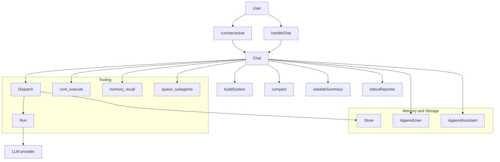
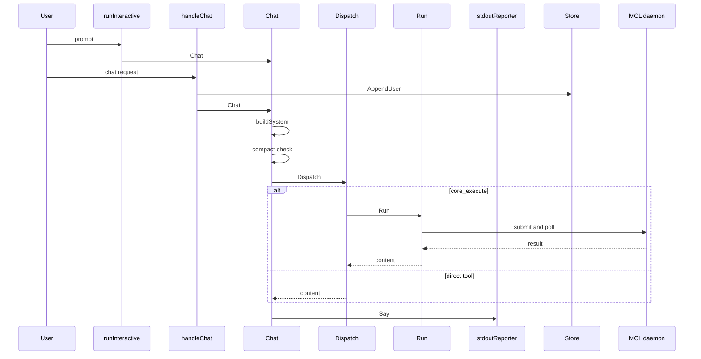

# Neo, Chronos, Gateway, Router, and UWAC Services - Neo agent loop, memory model, conversation storage, tools, and docs

## Overview

Neo is the conversational boundary for Centra AI. It takes a user message, rebuilds its system block on every turn, reads durable memory and prior turns, dispatches reversible tools directly, and routes anything that moves funds or needs a signature through `core_execute` and the MCL pipeline.

The service appears in two forms: the CLI entrypoint in `neo/cmd/neo/main.go` and the HTTP front in `neo/internal/server/server.go` and `neo/internal/server/engine.go`. Both shapes share the same agent loop, memory model, conversation store, and tool surface, so a thread can be resumed after restart without changing how the model reasons or how tool calls are executed.

## Runtime Boundary and Entry Points

### CLI and HTTP startup

*`neo/cmd/neo/main.go`*

The CLI entrypoint wires the interactive agent, the model clients, the MCP tool manager, the optional memory pager, and the delegate bridge. It supports a REPL and a one-shot prompt mode, and it can defer to the HTTP service when invoked with the `serve` subcommand.

| Path | Responsibility |
| --- | --- |
| `neo/cmd/neo/main.go` | CLI entrypoint, model wiring, tool wiring, approval prompt, REPL, one-shot prompt, and background write-back lifecycle. |
| `neo/internal/server/engine.go` | Process-wide runtime wiring for the HTTP service, including the tool manager, memory pager, conversation store, SSE broker, and `core_execute` delegation. |
| `neo/internal/server/server.go` | HTTP mux for chat, events, conversations, intent gate answers, media routes, upload routes, and proxy fallback. |
| `neo/internal/delegate/client.go` | Prose-intent bridge to the MCL async API with poll-based status checks and inline gate approval. |

#### CLI flags and runtime wiring

| Flag | Effect |
| --- | --- |
| `-config` | Loads a runtime `neo.kvx` file. |
| `-manifest` | Overrides the agent manifest path used by the tool manager. |
| `-cortex-root` | Overrides the cortex root directory. |
| `-actor` | Overrides the cortex actor name. |
| `-prompt` | Runs one turn and exits. |
| `-no-tools` | Skips MCP server spawning and runs chat-only. |

The CLI creates two LLM clients with `newClient`, injects `newApprover` into the delegate path, and starts background write-back consolidation only when memory is available. It also prints a banner that includes the model, memory mode, available tools, and any tool-manager warnings.

#### CLI reporter

*`neo/cmd/neo/main.go`*

`stdoutReporter` is stateless. It renders user-facing answers to stdout and progress notices to stderr so `-prompt` stays clean.

| Method | Description |
| --- | --- |
| `Say` | Writes the final answer to stdout. |
| `Status` | Writes ephemeral progress to stderr. |
| `Notice` | Writes a visible promise or state change to stderr. |
| `Think` | Writes the trimmed reasoning glimpse to stderr. |

## Agent Loop and Transcript State

### Agent runtime state

agent.Chat calls a.out.Think(think) when the model surfaces reasoning text, so the live terminal reporter includes a Think channel in addition to the three channels described in the docs prose.

*`neo/internal/agent/agent.go`*

The agent is the recursive loop that owns the live transcript, the compacted summary, the active goal, and the injected dependencies that make turns work.

#### Constructor dependencies

| Type | Description |
| --- | --- |
| `config.Config` | Runtime config for budgets, model names, and wiring values. |
| `*llm.Client` | Main tool-calling model. |
| `*llm.Client` | Cheap fallback model used for compaction. |
| `*tools.Manager` | Tool surface, including direct tools and synthetic tools. |
| `*memory.Pager` | Memory retrieval and pinned-block source. |
| `Reporter` | Output sink for answers, progress, and notices. |
| `Consolidator` | Background write-back hook for completed turns. |
| `ConvRecaller` | Optional recall lane for relevant past turns. |
| `ToolObserver` | Optional per-tool result observer. |

#### Agent fields

| Property | Type | Description |
| --- | --- | --- |
| `cfg` | `config.Config` | Runtime configuration. |
| `main` | `*llm.Client` | Primary model client. |
| `cheap` | `*llm.Client` | Compacting and fallback model client. |
| `tools` | `*tools.Manager` | MCP-backed tool surface. |
| `pager` | `*memory.Pager` | Durable memory pager. |
| `out` | `Reporter` | Output sink. |
| `consolidator` | `Consolidator` | Background write-back hook. |
| `recaller` | `ConvRecaller` | Conversational recall lane. |
| `observer` | `ToolObserver` | Live tool event observer. |
| `schemas` | `[]llm.Tool` | Tool schemas advertised to the model. |
| `schemaTokens` | `int` | Token estimate for tool schemas. |
| `schemaBytes` | `int` | Byte estimate for tool schemas. |
| `working` | `[]llm.Message` | Live transcript for the current turn. |
| `summary` | `string` | Compacted story-so-far. |
| `activeGoal` | `string` | Pinned task for the thread. |
| `persona` | `string` | Sub-agent role framing. |

#### Public lifecycle methods

| Method | Description |
| --- | --- |
| `Chat` | Runs one user turn through memory faulting, system block rebuild, model calls, tool dispatch, compaction checks, and termination. |
| `Reset` | Clears the live transcript, the summary, and the active goal. |
| `Seed` | Primes a fresh agent with resumed history and a goal, but only when the live transcript is still empty. |

`New` assembles the agent and chooses the tool surface: `tools.Schemas()` for the top-level agent or `tools.SubagentSchemas()` when `RestrictTools` is enabled.

### System prompt and grounding

*`neo/internal/agent/prompt.go`*

`buildSystem` re-derives the system block every turn so the prompt never drifts. It layers, in order, the static charter, the embedded ground truth, the pinned cortex block, the compacted summary, recalled earlier turns, retrieved memory, proven procedural patterns, and the budget stat appended by the caller.

*`neo/internal/agent/knowledge.md`*

The embedded grounding file states that Neo is the default Centra AI agent, that Paxeer is a real live chain, that canonical Paxeer endpoints should be used directly, and that anything that moves value must go through `core_execute`.

`systemPrompt` also changes shape when `persona` is set: the agent becomes a headless sub-agent, gets a restricted tool set, never asks the user questions, and reports its findings back to the orchestrator.

### Turn flow

1. `Chat` trims the user input and pins `activeGoal` on the first turn.
2. It appends the user message to `working`.
3. It page-faults durable memory, procedural patterns, and conversational recall.
4. It builds the system block and checks budget thresholds.
5. It compacts hard if the hard threshold or request-size ceiling is crossed.
6. It calls the model with the current transcript and tool schemas.
7. If the model returns tool calls, the agent dispatches them, appends tool results, and continues.
8. If the model returns a final answer, the agent speaks it, triggers background consolidation, and soft-compacts if needed.

`chatWithRetry` retries the model call up to three attempts with bounded backoff. `dispatchWithRetry` uses `MaxRetriesPerTool` from config for tool invocations and returns an in-band error message after exhaustion instead of crashing the turn.

### Compaction

*`neo/internal/agent/compaction.go`*

`compact` consolidates older working history into a fresh summary when the window gets too large. It supports two notices:

- `hard`: forced compaction at the hard threshold or byte ceiling.
- `soft`: cooperative compaction after a successful answer at a clean boundary.

`compactionSystemPrompt` asks for a structured summary with `GOAL`, `DECISIONS`, `ARTIFACTS`, `OPEN`, `LAST_RESULTS`, and `NEXT`. `renderTranscript` flattens the transcript into a summarizer-friendly plain-text form, and `safeTail` preserves the transcript from the last user message onward so no tool result is left without its preceding assistant call.

### Summary validation

*`neo/internal/agent/validate.go`*

The validator enforces the “preserve high-entropy tokens verbatim” rule. It extracts:

- hex addresses and hashes beginning with `0x`
- bare long hex strings
- UUIDs
- ULIDs
- absolute file paths
- long exact numbers

If the new summary drops any of those values, `validateSummary` appends them under `ARTIFACTS (preserved verbatim):`. The clean check only requires the `GOAL` and `NEXT` headers plus zero missing tokens.

### Agent loop diagram

### Turn sequence

### Source-backed checks

validateSummary only checks GOAL and NEXT as schema headers. It repairs missing high-entropy tokens, but it does not enforce the rest of the compaction template as required headers.

*`neo/internal/agent/agent_test.go`* verifies that the system prompt contains Paxeer grounding, `Seed` only primes once, `batchSignature` is order independent, `safeTail` starts at the last user message, `renderTranscript` preserves tool-call structure, budget math behaves, and tool-result truncation and request-byte estimation work.

*`neo/internal/agent/validate_test.go`* verifies that high-entropy token extraction finds addresses, hashes, paths, ULIDs, UUIDs, and long numbers, and that dropped values are restored into the repaired summary.

## Memory Model

### Procedural patterns

*`neo/internal/memory/pattern.go`*

`PatternSpec` is the structured procedural-memory shape. It carries a name, a trigger, preconditions, steps, gotchas, and success criteria. `Encode` stores it as canonical JSON with the `neo.pattern.v1:` prefix, and `DecodePatternSpec` reads the prefixed form back or falls back to a single freeform step for legacy flat statements.

#### PatternSpec fields

| Property | Type | Description |
| --- | --- | --- |
| `Name` | `string` | Pattern name. |
| `Trigger` | `string` | Situation that should activate the pattern. |
| `Preconditions` | `[]string` | Checks to perform before applying it. |
| `Steps` | `[]string` | Ordered actions to follow. |
| `Gotchas` | `[]string` | Known failure modes. |
| `SuccessCriteria` | `[]string` | Checks to verify after applying it. |

#### PatternSpec methods

| Method | Description |
| --- | --- |
| `Encode` | Serializes the structured pattern into the stored flat statement. |
| `DecodePatternSpec` | Reads the stored statement back into a structured pattern. |
| `dedupKey` | Computes the normalized identity used for reinforcement and deduplication. |
| `IsEmpty` | Reports whether the spec carries any usable content. |

#### Pattern fields

| Property | Type | Description |
| --- | --- | --- |
| `Spec` | `PatternSpec` | Structured procedural recipe. |
| `Confidence` | `float32` | Retrieval confidence. |
| `Coverage` | `int` | Number of supporting observations. |
| `URI` | `string` | Canonical memory URI. |

#### Pattern method

| Method | Description |
| --- | --- |
| `Render` | Produces the one-line pattern guidance injected into the prompt. |

`Render` includes the trigger, preconditions, steps, gotchas, success criteria, and coverage count when present.

### Memory pager behavior

The pager behavior exercised by `neo/internal/memory/store_test.go` shows the model-facing memory layer writing facts, outcomes, and patterns into cortex, retrieving them back into the prompt, and only injecting procedural patterns once they cross the coverage gate. It also keeps user-profile facts separate from generic facts and pins identity plus hard constraints into the system block.

### Related Cortex memory vocabulary

`cortex/cmd/two-model-smoke/tools.go` uses the same typed-memory discipline on the Cortex side. Its tool catalog includes `cortex_write`, `cortex_resolve`, `cortex_find`, `cortex_list`, `cortex_update`, `cortex_update_head`, `cortex_tombstone`, `cortex_add_edge`, and `cortex_list_edges`, and it wraps failures as structured JSON so the model can recover from errors instead of treating them as raw transport failures.

### Pattern and memory tests

*`neo/internal/memory/pattern_test.go`* verifies pattern encode and decode round-trips, legacy plain-statement fallback, dedup-key precedence, and rendered pattern summaries.

*`neo/internal/memory/store_test.go`* verifies retrieval, pattern reinforcement, the anti-overfit coverage gate, pinned-block contents, user-profile deduplication, and active-goal round-tripping.

## Conversation Storage

### Durable turn log

*`neo/internal/conversation/store.go`*

The conversation store persists each turn as one JSON file per `conversation_id`. It is a pure side-channel: it does not touch cortex, does not sign anything, and does not affect replay. The store is byte-compatible with the daemon conversation store, so pre-Neo threads and Neo threads appear together as one unified history.

#### Store fields

| Property | Type | Description |
| --- | --- | --- |
| `mu` | `sync.Mutex` | Guards store access. |
| `dir` | `string` | Root directory for persisted conversations. |

#### Turn fields

| Property | Type | Description |
| --- | --- | --- |
| `Role` | `string` | Message role, `user` or `assistant`. |
| `Text` | `string` | Turn text. |
| `IntentID` | `string` | Intent id for assistant turns. |
| `TS` | `time.Time` | Turn timestamp. |

#### Record fields

| Property | Type | Description |
| --- | --- | --- |
| `ConversationID` | `string` | Stable thread identifier. |
| `Title` | `string` | Optional thread title. |
| `Turns` | `[]Turn` | Full persisted turn log. |
| `Updated` | `time.Time` | Last update timestamp. |

#### Summary fields

| Property | Type | Description |
| --- | --- | --- |
| `ConversationID` | `string` | Stable thread identifier. |
| `Title` | `string` | Sidebar title. |
| `Preview` | `string` | Most recent turn preview. |
| `TurnCount` | `int` | Number of persisted turns. |
| `Updated` | `time.Time` | Last update timestamp. |

#### Store methods

| Method | Description |
| --- | --- |
| `Open` | Creates a store rooted at the provided directory. |
| `Enabled` | Reports whether persistence is active. |
| `pathLocked` | Computes the on-disk path for a conversation. |
| `loadLocked` | Reads a record under the caller’s lock. |
| `Append` | Appends one turn and persists atomically. |
| `AppendUser` | Appends a user turn. |
| `AppendAssistant` | Appends an assistant turn with intent metadata. |
| `Recent` | Returns the last `n` turns, oldest-first. |
| `Get` | Returns the full record for one conversation. |
| `List` | Returns a newest-first summary list of all conversations. |
| `title` | Derives the display title. |
| `preview` | Derives the sidebar preview. |
| `truncateLabel` | Trims labels to a fixed rune count. |
| `Dir` | Resolves the conversation directory from an override and cortex root. |

`Append` uses tmp plus rename, so a crash does not leave a partial JSON file behind. `Dir` prefers an explicit override, then derives a sibling `conversations` directory from the cortex root, and finally disables persistence when neither is available.

### Conversation storage tests

*`neo/internal/conversation/store_test.go`* verifies append, get, list, and recent retrieval; compatibility with daemon-written files; disabled-store no-op behavior; unbounded retention; and `Dir` precedence.

## LLM Transport

### Chat-completions client

*`neo/internal/llm/client.go`*

The client speaks the OpenAI chat-completions shape only. It reuses `matrix/mcl/llm` provider detection and model registry, rejects incompatible API shapes, and rewrites requests to the gateway path when `GatewayURL` is set.

#### LLM client fields

| Property | Type | Description |
| --- | --- | --- |
| `model` | `string` | Model id. |
| `provider` | `mcllm.Provider` | Detected provider. |
| `endpoint` | `string` | Direct provider endpoint. |
| `apiKey` | `string` | Direct provider API key. |
| `gatewayURL` | `string` | Optional gateway base URL. |
| `gatewayTokenEnv` | `string` | Environment variable name for the gateway bearer token. |
| `actorDID` | `string` | Actor DID for gateway metadata. |
| `intentID` | `string` | Intent id for gateway metadata. |
| `slotLabel` | `string` | Gateway slot label. |
| `temperature` | `float64` | Sampling temperature. |
| `maxTokens` | `int` | Maximum generation tokens. |
| `seed` | `int64` | Optional deterministic seed. |
| `httpClient` | `*http.Client` | HTTP transport client. |

#### LLM client methods

| Method | Description |
| --- | --- |
| `Model` | Returns the configured model id. |
| `Chat` | Sends one chat-completions request and returns the assistant turn. |
| `newHTTPRequest` | Builds the POST request with direct or gateway headers. |
| `defaultChatEndpoint` | Chooses the provider default endpoint. |
| `envKey` | Looks up the provider API key in the environment. |
| `truncate` | Trims long error text for reporting. |

#### Message fields

*`neo/internal/llm/message.go`*

| Property | Type | Description |
| --- | --- | --- |
| `Role` | `string` | Message role. |
| `Content` | `string` | Message text. |
| `ToolCalls` | `[]ToolCall` | Assistant tool requests. |
| `ToolCallID` | `string` | Tool-call correlation id. |
| `Name` | `string` | Tool function name. |
| `Reasoning` | `string` | Reasoning channel, not serialized. |

#### ToolCall fields

| Property | Type | Description |
| --- | --- | --- |
| `ID` | `string` | Tool-call id. |
| `Type` | `string` | Tool-call type, always `function`. |
| `Function` | `FunctionCall` | Tool function call. |

#### FunctionCall fields

| Property | Type | Description |
| --- | --- | --- |
| `Name` | `string` | Function name. |
| `Arguments` | `string` | JSON-encoded arguments. |

#### FunctionCall method

| Method | Description |
| --- | --- |
| `ParseArgs` | Decodes the JSON arguments into a map. |

#### Tool fields

| Property | Type | Description |
| --- | --- | --- |
| `Type` | `string` | Tool kind, always `function`. |
| `Function` | `FunctionDef` | Tool schema. |

#### FunctionDef fields

| Property | Type | Description |
| --- | --- | --- |
| `Name` | `string` | Function name. |
| `Description` | `string` | Function description. |
| `Parameters` | `map[string]interface{}` | JSON Schema parameters. |

#### ChatRequest fields

| Property | Type | Description |
| --- | --- | --- |
| `Messages` | `[]Message` | Transcript sent to the model. |
| `Tools` | `[]Tool` | Function schemas. |
| `ToolChoice` | `string` | Tool choice mode. |

#### ChatResult fields

| Property | Type | Description |
| --- | --- | --- |
| `Message` | `Message` | Assistant turn returned by the model. |
| `FinishReason` | `string` | Model finish reason. |
| `Usage` | `Usage` | Token accounting. |

#### ChatResult method

| Method | Description |
| --- | --- |
| `HasToolCalls` | Reports whether the assistant asked for tools. |

#### Usage fields

| Property | Type | Description |
| --- | --- | --- |
| `PromptTokens` | `int` | Prompt token count. |
| `CompletionTokens` | `int` | Completion token count. |
| `TotalTokens` | `int` | Total token count. |

The client handles three important transport behaviors:

- Gateway requests are rewritten to the gateway chat-completions path and carry the gateway bearer plus `X-Matrix-Actor-DID`, `X-Matrix-Intent-ID`, and `X-Matrix-Slot`.
- Provider responses can surface reasoning either in `reasoning_content` or in inline `<think>` or `<thinking>` blocks inside `content`; both are extracted into `Reasoning`.
- Kimi-style token-grammar tool calls embedded in `content` are converted back into structured `ToolCall` entries before the agent sees the turn.

`ErrRequestTooLarge` marks a body-size reject that the agent can recover from by compacting and retrying.

### LLM transport tests

*`neo/internal/llm/message_test.go`* verifies `ParseArgs`, function-tool defaults, constructor roles, tool-result shaping, `HasToolCalls`, wire round-tripping, inline thinking extraction, and token-grammar tool-call extraction.

*`neo/internal/llm/client.go`* is exercised by the higher-level agent tests that force request-size and reasoning-path behavior through the loop.

## Tool Surface and Delegation

### MCP-backed tools

*`neo/internal/tools/tools.go`*

The tool manager loads the agent manifest, starts the declared MCP servers, binds live schemas, and publishes the model-facing function surface. It keeps the direct reversible tools available, hides escalate-class tools behind `core_execute`, and adds `memory_recall` and `spawn_subagents` only when those capabilities are wired.

#### Tool manager fields

| Property | Type | Description |
| --- | --- | --- |
| `manifest` | `*tool.AgentManifest` | Loaded agent manifest. |
| `mcp` | `*mcp.Manager` | MCP server pool manager. |
| `registry` | `*tool.Registry` | Bound tool registry. |
| `classifier` | `*Classifier` | Natural versus escalate classifier. |
| `delegate` | `DelegateFunc` | `core_execute` bridge. |
| `recall` | `RecallFunc` | Durable-memory lookup bridge. |
| `swarm` | `SwarmFunc` | Sub-agent fan-out bridge. |
| `maxAgents` | `int` | Upper bound for one spawn request. |
| `byFunc` | `map[string]*boundTool` | Function-name lookup map. |
| `order` | `[]string` | Advertised natural tool names. |
| `escalated` | `[]string` | Hidden escalate tool names. |
| `warnings` | `[]string` | Non-fatal MCP startup warnings. |

#### Tool manager options

| Property | Type | Description |
| --- | --- | --- |
| `ManifestPath` | `string` | Manifest location. |
| `StderrSink` | `io.Writer` | Warning sink. |
| `SpawnTimeout` | `time.Duration` | Per-server startup timeout. |
| `Delegate` | `DelegateFunc` | Optional `core_execute` bridge. |
| `EscalatePatterns` | `[]string` | Override patterns for escalate classification. |

#### SubagentSpec fields

| Property | Type | Description |
| --- | --- | --- |
| `Name` | `string` | Display name for the sub-agent. |
| `Persona` | `string` | Role or expertise framing. |
| `Task` | `string` | Self-contained work item. |

#### Public manager methods

| Method | Description |
| --- | --- |
| `Spawn` | Loads the manifest, starts servers, and binds the tool surface. |
| `Schemas` | Returns the model-facing schemas for the top-level agent. |
| `SubagentSchemas` | Returns the restricted schemas for a sub-agent. |
| `Dispatch` | Executes one tool call by function name. |
| `SetDelegate` | Wires the `core_execute` bridge after construction. |
| `SetSwarm` | Wires the sub-agent runner after construction. |
| `SetRecall` | Wires the durable-memory lookup after construction. |
| `NaturalToolNames` | Returns the advertised direct tool names. |
| `EscalateToolNames` | Returns the hidden escalate tool names. |
| `Warnings` | Returns the non-fatal startup warnings. |
| `Close` | Stops every MCP server. |

`Dispatch` returns `(content, isError, err)` so the caller can distinguish transport failures from in-band tool errors. `core_execute`, `memory_recall`, and `spawn_subagents` are synthetic tools; they are not the same as the MCP-bound tools loaded from the manifest.

`dispatchCoreExecute` requires a non-empty intent, returns a clear unavailable message when the delegate is missing, and otherwise runs the secure path. `dispatchMemoryRecall` returns a rendered digest when memory is wired. `dispatchSpawnSubagents` requires at least two agents, rejects oversized fan-out requests, and drops any sub-agent entry that lacks a task.

`sanitizeFuncName` coerces `alias__name` into the OpenAI function-name charset and truncates it to 64 characters.

### Tool surface note from Cortex

### Tool surface tests

*`neo/internal/tools/tools_test.go`* verifies function-name sanitizing, alias-to-function naming, schema normalization, text summarization for non-text tool results, and the `core_execute` schema.

### Delegate bridge

*`neo/internal/delegate/client.go`*

The delegate client hands a prose intent to the daemon, polls status, answers gates inline, and returns the final answer or a clear error.

#### Delegate options

| Property | Type | Description |
| --- | --- | --- |
| `BaseURL` | `string` | Daemon base URL. |
| `Token` | `string` | Bearer token for the daemon. |
| `CallerDID` | `string` | `X-Caller-DID` value. |
| `CallerWallet` | `string` | `X-Caller-Wallet` value. |
| `Skill` | `string` | Optional pinned skill URI. |
| `Approver` | `Approver` | Inline gate approver. |
| `Notify` | `func(string)` | Status sink. |
| `Timeout` | `time.Duration` | HTTP timeout. |
| `PollInterval` | `time.Duration` | Poll cadence. |
| `MaxWait` | `time.Duration` | Upper bound for a blocked intent. |

#### Delegate client fields

| Property | Type | Description |
| --- | --- | --- |
| `base` | `string` | Normalized daemon base URL. |
| `http` | `*http.Client` | HTTP transport client. |
| `token` | `string` | Daemon bearer token. |
| `did` | `string` | Caller DID. |
| `wallet` | `string` | Caller wallet. |
| `skill` | `string` | Pinned skill URI. |
| `approve` | `Approver` | Gate approver callback. |
| `notify` | `func(string)` | Status sink. |
| `pollEvery` | `time.Duration` | Poll cadence. |
| `maxWait` | `time.Duration` | Maximum wait time. |

#### Delegate client methods

| Method | Description |
| --- | --- |
| `Run` | Submits the intent and blocks until completion, failure, cancellation, or timeout. |
| `submit` | Sends the initial async request. |

#### Gate and status DTOs

| Type | Fields | Purpose |
| --- | --- | --- |
| `pendingGateDTO` | `NodeID`, `Question`, `Options` | Gate list items returned by the daemon. |
| `statusResp` | `Status`, `Error`, `Result`, `Clarify` | Polled intent status. |
| `resultBody` | `Answer`, `Status` | Final answer payload. |

`Run` follows a fixed lifecycle: submit the prose intent, poll gates and status on a timer, answer each pending gate at most once, and stop with a clear error when the daemon reports failure, cancellation, clarification, or timeout. A nil `Approver` denies every gate.

### Delegate tests

*`neo/internal/delegate/client_test.go`* verifies the happy path, inline gate approval, failure propagation, clarification parsing, and truncation behavior.

## HTTP Front and SSE Event Stream

### HTTP service wiring

*`neo/internal/server/engine.go`*

The engine holds the shared runtime state for the HTTP service. It owns the model clients, tool manager, pager, background consolidator, conversation store, media directory, backend daemon settings, SSE broker, session registry, and active-run map.

#### Engine fields

| Property | Type | Description |
| --- | --- | --- |
| `cfg` | `config.Config` | Runtime config. |
| `main` | `*llm.Client` | Primary model client. |
| `cheap` | `*llm.Client` | Cheap fallback model client. |
| `tools` | `*tools.Manager` | Shared tool manager. |
| `pager` | `*memory.Pager` | Shared memory pager. |
| `consolidator` | `agent.Consolidator` | Background write-back hook. |
| `conv` | `*conversation.Store` | Durable conversation store. |
| `mediaDir` | `string` | Machine-volume media directory. |
| `backendURL` | `string` | Co-located daemon base URL. |
| `backendToken` | `string` | Optional daemon bearer token. |
| `broker` | `*broker` | SSE and event broker. |
| `sessions` | `*sessionRegistry` | Session registry. |
| `mu` | `sync.Mutex` | Guards active runs. |
| `runs` | `map[string]*run` | Active runs by id. |

#### Engine options

| Property | Type | Description |
| --- | --- | --- |
| `Config` | `config.Config` | Runtime config. |
| `Main` | `*llm.Client` | Primary model client. |
| `Cheap` | `*llm.Client` | Cheap fallback model client. |
| `Tools` | `*tools.Manager` | Shared tool manager. |
| `Pager` | `*memory.Pager` | Shared memory pager. |
| `Consolidator` | `agent.Consolidator` | Background write-back hook. |
| `ConversationDir` | `string` | Durable conversation store directory. |
| `MediaDir` | `string` | Media directory. |
| `BackendURL` | `string` | Daemon base URL. |
| `BackendToken` | `string` | Daemon bearer token. |

`NewEngine` wires `core_execute` through `tools.SetDelegate` and wires task-scoped sub-agent fan-out through `tools.SetSwarm`. `coreExecute` builds a delegate client for the current run, passes `CallerDID`, the backend token, and the per-run approver and notify callbacks, and then runs the intent through the secure path.

`approverFor` publishes `gate.invoked` and `gate.decided` events on the SSE broker and blocks until the user answers or the context is cancelled. `notifyFor` publishes `chat.assistant` updates. `surfaceTool` publishes `tool.step` for every tool event and adds `tool.search` or `tool.media` rich cards when a completed tool result parses as search data or media data.

#### Event flow

| Event | Emitted by | Payload focus |
| --- | --- | --- |
| `gate.invoked` | `approverFor` | Intent id, node id, question, options. |
| `gate.decided` | `approverFor` | Intent id, node id, approval result. |
| `chat.assistant` | `notifyFor` | Assistant text, conversation id, intent id. |
| `tool.step` | `surfaceTool` | Animated tool viewport state. |
| `tool.search` | `surfaceTool` | Search cards and answer text. |
| `tool.media` | `surfaceTool` | Media url, mime, prompt, kind. |

### HTTP server

*`neo/internal/server/server.go`*

The HTTP server owns the conversational routes and falls back to the backend daemon for everything else. It registers the Neo-owned routes before the proxy catch-all, so the local service handles chat, events, conversation history, intents, media, and upload routes first.

#### Server fields

| Property | Type | Description |
| --- | --- | --- |
| `engine` | `*Engine` | Shared runtime engine. |
| `backend` | `*url.URL` | Daemon backend URL. |
| `proxy` | `*httputil.ReverseProxy` | Reverse proxy for fallback routes. |

#### Server methods

| Method | Description |
| --- | --- |
| `Handler` | Builds the mux with the Neo-owned routes and proxy fallback. |

`handleChat` accepts a JSON body with `message` and optional `conversation_id`, persists the user turn before starting the session, and returns the conversation id plus the live intent metadata. `handleConversations` serves list and detail views from Neo’s own store when persistence is enabled, and proxies to the daemon when persistence is disabled. `handleEvents` and `handleReplay` stream SSE for live Neo runs and replay buffered events, while `handleAsyncPoll` supports reload-time polling of live runs. `handleIntents` intercepts only the gate-answer route for a live Neo run and proxies everything else.

`streamSSE` sets the SSE headers, replays buffered events, and then emits heartbeat comments every 15 seconds so clients do not reconnect during long tool or model gaps. `writeEvent` serializes one event as an SSE data frame.

### Server request shape

| Property | Type | Description |
| --- | --- | --- |
| `Message` | `string` | Chat input text. |
| `ConversationID` | `string` | Optional conversation id. |

### HTTP and SSE tests

The server runtime is exercised indirectly by the delegate, agent, and conversation tests that verify the underlying request and state shapes. The visible route logic in `neo/internal/server/server.go` is enough to trace how the service handles chat, events, replay, intent answers, and proxy fallback.

## Config Parser and Documentation Set

### KVX parser

*`neo/internal/config/kvx.go`*

The parser reads Centra AI-style `.kvx` files, strips comments outside quoted strings, supports sectioned keys, supports `${ENV_VAR}` interpolation, and treats later duplicate keys as winning. Missing files are not fatal.

#### kvxDoc fields

| Property | Type | Description |
| --- | --- | --- |
| `sections` | `map[string]map[string]string` | Parsed section map. |
| `order` | `[]string` | Section order. |

#### kvxDoc methods

| Method | Description |
| --- | --- |
| `parseKVXFile` | Loads and parses a `.kvx` file, returning an empty doc for a missing path. |
| `newKVXDoc` | Creates an empty document. |
| `parseKVX` | Parses a reader into a document. |
| `stripComment` | Removes trailing comments outside quoted strings. |
| `has` | Reports whether a section exists. |
| `str` | Returns an interpolated string value. |
| `strOr` | Returns a string value or fallback. |
| `list` | Parses a bracketed list or a bare single value. |
| `intOr` | Parses an integer or returns a fallback. |
| `splitList` | Splits a list string while respecting quotes. |
| `unquote` | Removes matching double quotes. |
| `interpolate` | Expands `${ENV_VAR}` from process environment. |

### KVX parser tests

*`neo/internal/config/kvx_test.go`* verifies section parsing, comment stripping, integer parsing, list parsing, single-value fallback, environment interpolation, unterminated section errors, and quoted-list splitting.

### Documentation files

#### Repo documentation set

| Path | What it covers |
| --- | --- |
| `docs/neo-docs/INDEX.md` | Neo’s docs entrypoint, the one-sentence contract, and the docs layout summary. |
| `docs/neo-docs/control-loop.md` | Recursive loop behavior, compaction, and transcript-as-state framing. |
| `docs/neo-docs/conversation-store.md` | Durable turn log, store semantics, and directory derivation. |
| `docs/neo-docs/core-execute.md` | The async MCL bridge, gate approval, and status polling. |
| `docs/neo-docs/config-system.md` | Config precedence, `.kvx` overlay behavior, and loop-budget knobs. |
| `docs/neo-docs/llm-client.md` | Chat-completions transport, gateway headers, and reasoning channels. |
| `docs/neo-docs/tool-surface.md` | Natural versus escalate tool split, synthetic tools, and function naming. |

#### Web docs mirror

| Path | What it covers |
| --- | --- |
| `docs/.web/src/content/neo-docs/INDEX.md` | Web docs mirror of the Neo index and repository layout. |
| `docs/.web/src/content/neo-docs/config-system.md` | Web copy of the config system reference. |
| `docs/.web/src/content/neo-docs/llm-client.md` | Web copy of the LLM client reference. |
| `docs/.web/src/content/neo-docs/tool-surface.md` | Web copy of the tool surface reference. |

The docs index frames Neo as the default conversational agent with recursive tool calling, cortex-backed memory, shared MCP tools, and `core_execute` delegation for money-moving or rigorous tasks. The mirrored web content carries the same topical coverage for the site build.

## Source-Backed Checks

| File | What it verifies |
| --- | --- |
| `neo/internal/agent/agent_test.go` | Grounding in the system prompt, one-time seeding, batch signature ordering, safe-tail behavior, transcript rendering, budget math, token estimation, truncation, and request-byte accounting. |
| `neo/internal/agent/validate_test.go` | High-entropy token extraction and summary repair. |
| `neo/internal/memory/pattern_test.go` | Pattern encode and decode, legacy fallback, dedup keys, and rendered guidance. |
| `neo/internal/memory/store_test.go` | Memory write, retrieval, pinned block contents, user-profile handling, pattern reinforcement, and active-goal persistence. |
| `neo/internal/conversation/store_test.go` | Append, get, list, recent, daemon compatibility, disabled-store no-op behavior, unbounded retention, and directory derivation. |
| `neo/internal/llm/message_test.go` | Argument parsing, constructor defaults, tool-call detection, wire conversion, inline reasoning extraction, and token-grammar extraction. |
| `neo/internal/delegate/client_test.go` | Async submit, gate approval, failure propagation, clarification parsing, and truncation. |
| `neo/internal/tools/tools_test.go` | Function-name sanitizing, schema normalization, non-text summarization, and `core_execute` schema shape. |
| `neo/internal/config/kvx_test.go` | KVX parsing, comments, interpolation, fallback behavior, and list parsing. |

## Key Classes Reference

| Class or Service | Location | Responsibility |
| --- | --- | --- |
| `Agent` | `neo/internal/agent/agent.go` | Recursive tool-calling loop with memory, compaction, and tool dispatch. |
| `Store` | `neo/internal/conversation/store.go` | Durable per-conversation turn storage on disk. |
| `PatternSpec` | `neo/internal/memory/pattern.go` | Structured procedural-memory schema. |
| `Pattern` | `neo/internal/memory/pattern.go` | Retrieved procedural guidance ready for prompt injection. |
| `Client` | `neo/internal/llm/client.go` | OpenAI-compatible chat-completions transport with gateway support. |
| `Message` | `neo/internal/llm/message.go` | Transcript and on-wire message shape. |
| `Manager` | `neo/internal/tools/tools.go` | MCP-backed tool surface and synthetic tool orchestration. |
| `Client` | `neo/internal/delegate/client.go` | Prose-intent bridge to the secure execution path. |
| `Engine` | `neo/internal/server/engine.go` | Shared runtime wiring for the HTTP service. |
| `Server` | `neo/internal/server/server.go` | HTTP front, SSE streaming, and proxy fallback. |
| `kvxDoc` | `neo/internal/config/kvx.go` | Parsed `.kvx` document and accessor helpers. |
| `stdoutReporter` | `neo/cmd/neo/main.go` | Terminal output adapter for CLI runs. |
