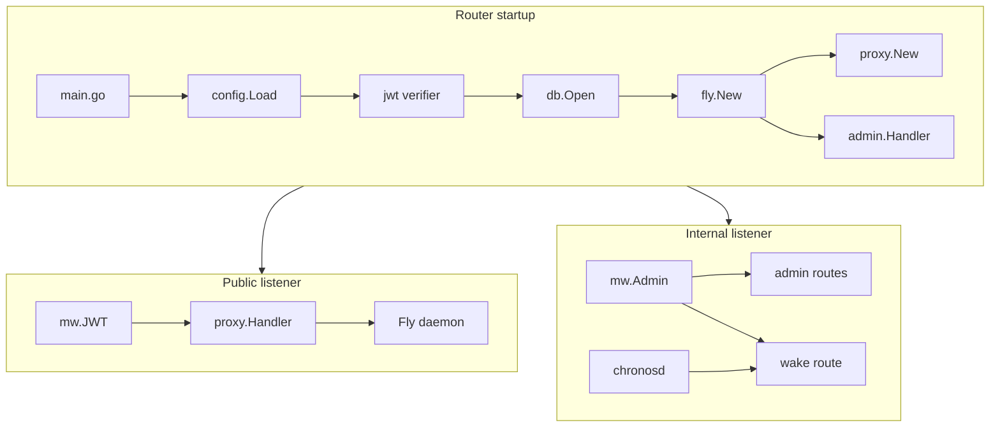
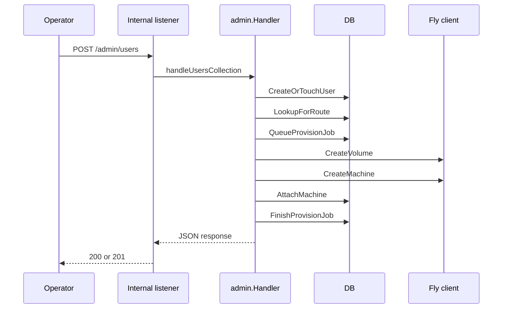
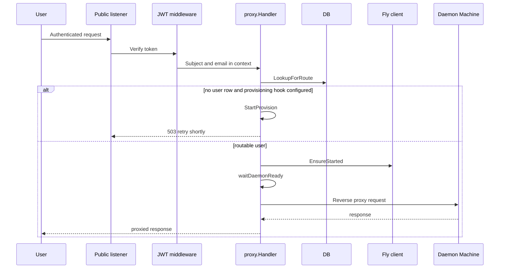
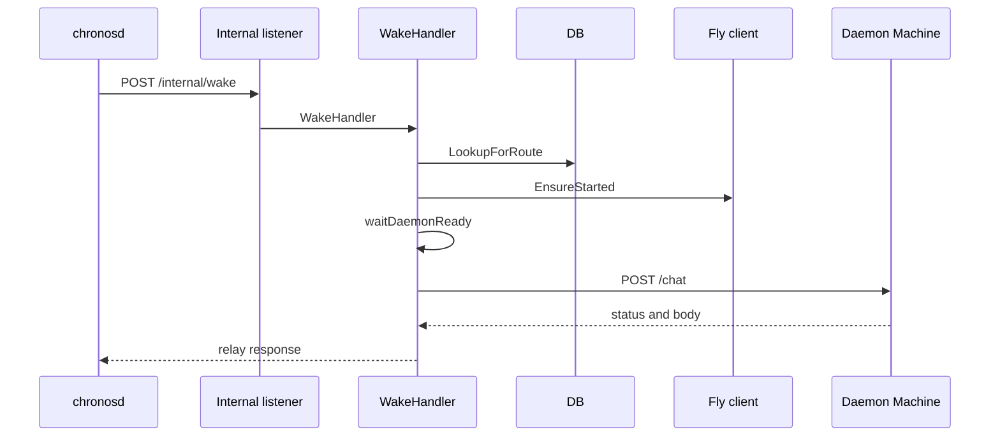

# Neo, Chronos, Gateway, Router, and UWAC Services - Router admin, configuration, database, proxy, and wake surfaces

## Overview

`matrix-router` is the front door for user Machines. It splits traffic across two listeners: a public JWT-protected reverse proxy for authenticated user requests, and a private internal listener for operator provisioning and Chronos wake delivery. The router owns the database pool, the Fly Machines client, the JWT verifier, and the request-time logic that decides when to return a status code, when to wake a Machine, and when to hand the request off to the daemon.

This page stays on the router side of the boundary. It covers configuration loading, database routing state, Fly provisioning and wake behavior, the admin surface, the public proxy surface, and the internal wake door used by Chronos. It also includes the source-backed regression tests that lock the proxy’s host resolution and readiness semantics.

## Source-Backed Surfaces

| Path | Responsibility |
| --- | --- |
| `router/cmd/matrix-router/main.go` | Boots the router, loads configuration, builds shared dependencies, mounts public and internal listeners, and handles graceful shutdown. |
| `router/internal/config/config.go` | Loads router configuration from environment variables, parses durations, and gates admin mounting. |
| `router/internal/db/db.go` | Wraps Postgres access for route lookups, user lifecycle state, and provision-job bookkeeping. |
| `router/internal/fly/fly.go` | Wraps the Fly Machines REST API for machine status, start, create, destroy, and volume provisioning. |
| `router/internal/admin/admin.go` | Implements operator provisioning and lifecycle handlers under `/admin/*`. |
| `router/internal/proxy/proxy.go` | Implements the JWT-protected reverse proxy, wake-then-route behavior, and upstream URL construction. |
| `router/internal/proxy/wake.go` | Implements `POST /internal/wake` for Chronos-delivered alarm turns and downstream chat forwarding. |
| `router/internal/proxy/proxy_test.go` | Verifies proxy host formatting, DNS fallback, and daemon-readiness probing. |

## Architecture Overview

## Router Startup and Listener Wiring

### `router/cmd/matrix-router/main.go`

ROUTER_ADMIN_TOKEN and ROUTER_WAKE_TOKEN control whether the internal admin and wake routes are mounted at all. When either token is empty, the corresponding surface is absent rather than exposed with a failing auth check.

*`router/cmd/matrix-router/main.go`*

The entrypoint loads the router’s environment, creates the shared runtime objects, and then binds the public and internal listeners. It logs the version string, the public and internal addresses, and the Fly app and region before serving traffic.

| Step | Behavior |
| --- | --- |
| `config.Load` | Reads environment variables and validates the required router settings. |
| JWT verifier | Builds `jwt.New(jwt.Options{LegacySecret: []byte(cfg.SupabaseLegacyJWTSecret), SupabaseURL: cfg.SupabaseURL})`. |
| JWKS priming | Calls `verifier.PrimeJWKS` with a 10 second timeout and logs a warning if priming fails. |
| Postgres pool | Opens `db.Open` with a 10 second timeout and exits if the pool cannot connect. |
| Fly client | Creates `fly.New(cfg.FlyAPIToken, cfg.FlyApp)` for the Machines API. |
| Proxy handler | Builds `proxy.New(pool, flycli, cfg.DaemonPort, cfg.WakeTimeout, cfg.ProbeInterval, logf)` and sets `ReadyTimeout` from `cfg.DaemonReadyTimeout`. |
| Admin handler | Creates `admin.Handler` with the DB, Fly client, default region, daemon image, volume size, provision timeout, and the Machine environment map. |
| Route mounting | Mounts public health and version handlers, the public JWT proxy, internal admin routes when enabled, and the internal wake route when enabled. |
| Shutdown | On `SIGINT` or `SIGTERM`, drains both servers with a 30 second timeout and closes the DB pool. |

`main.go` also defines `envOr`, which returns the environment value when present and falls back to a default when the variable is empty. The file uses that helper to pin the daemon-facing URLs that get injected into provisioned Machines, including the gateway, UWAC, and Chronos connection settings.

The public listener registers `/healthz` and `/v/version` directly on the mux, then sends all other paths through `mw.JWT(verifier, logf)(proxyH)`. The internal listener registers its own `/healthz`, wraps `/admin/*` with `mw.Admin(cfg.AdminToken, logf)` when admin is enabled, and wraps `/internal/wake` with `mw.Admin(cfg.WakeToken, logf)` when wake delivery is enabled.

## Configuration Surface

### `router/internal/config/config.go`

proxyH.Provision is only wired when DaemonImage is non-empty. That means first-request auto-provisioning on the public proxy is deliberately gated by ROUTER_DAEMON_IMAGE, while the admin surface can still be mounted independently.

*`router/internal/config/config.go`*

`Config` is the router’s environment-backed runtime bundle. It carries the listener addresses, auth tokens, Supabase settings, Fly credentials, database URL, S3 settings, daemon routing knobs, and the wake token that protects the Chronos door.

| Field | Type | Behavior |
| --- | --- | --- |
| `PublicAddr` | `string` | Public listener address from `ROUTER_ADDR`. Required. |
| `InternalAddr` | `string` | Private listener address from `ROUTER_INTERNAL_ADDR`. Required. |
| `AdminToken` | `string` | Bearer token for `/admin/*`. Empty disables admin mounting. |
| `SupabaseURL` | `string` | Supabase project URL used to fetch JWKS. Required. |
| `SupabaseLegacyJWTSecret` | `string` | Legacy HS256 secret used during the JWT migration overlap. |
| `FlyAPIToken` | `string` | Bearer token for the Fly Machines API. Required. |
| `FlyApp` | `string` | Fly app slug used for machine and volume operations. Required. |
| `FlyRegion` | `string` | Default region for new Machines. |
| `DatabaseURL` | `string` | Postgres DSN for the router pool. Required. |
| `S3Endpoint` | `string` | Echoed into provisioned Machine environment. |
| `S3Bucket` | `string` | Echoed into provisioned Machine environment. |
| `DaemonPort` | `string` | Per-Machine HTTP port, default `8080`. |
| `WakeTimeout` | `time.Duration` | Deadline for Fly wake calls, default `30s`. |
| `ProxyTimeout` | `time.Duration` | Loaded from `ROUTER_PROXY_TIMEOUT`, default `5m`. |
| `ProbeInterval` | `time.Duration` | Poll interval while waiting for a Machine to report started, default `250ms`. |
| `DaemonReadyTimeout` | `time.Duration` | Readiness deadline for the daemon HTTP server after wake, default `30s`. |
| `WakeToken` | `string` | Bearer token for `/internal/wake`. Empty disables the wake route. |

| Function | Behavior |
| --- | --- |
| `Load` | Reads `os.Getenv`, applies defaults, parses durations, and returns an aggregate error listing every missing required env var. |
| `getOrDefault` | Returns the environment value when non-empty, otherwise returns the provided default. |
| `parseDurationOr` | Parses a duration env var or falls back to the default duration when unset. |
| `AdminEnabled` | Returns `true` when `AdminToken` is non-empty. |
| `ErrAdminDisabled` | Sentinel error used when admin endpoints are hit without a configured admin token. |

`Load` fails fast on `ROUTER_ADDR`, `ROUTER_INTERNAL_ADDR`, `SUPABASE_URL`, `FLY_API_TOKEN`, `FLY_APP_NAME`, and `DATABASE_URL`. Duration parse failures are also surfaced with the offending environment variable name.

## Database Routing and Provisioning State

### `router/internal/db/db.go`

*`router/internal/db/db.go`*

`DB` is the router’s Postgres facade. It backs the public proxy lookup path, the admin provisioning path, and the bookkeeping rows that record each provisioning attempt.

#### `User`

| Property | Type | Meaning |
| --- | --- | --- |
| `ID` | `string` | Supabase user identifier. |
| `Email` | `string` | User email stored with the row. |
| `State` | `string` | Closed lifecycle state used by the router. |
| `FlyMachineID` | `string` | Attached Fly Machine identifier. |
| `FlyVolumeID` | `string` | Attached Fly volume identifier. |
| `FlyRegion` | `string` | Region where the Machine was provisioned. |
| `S3AccessKey` | `string` | Stored S3 access key for the user row. |
| `DailyBudget` | `int64` | Daily token budget copied from the public users table. |
| `CreatedAt` | `time.Time` | Creation timestamp. |
| `UpdatedAt` | `time.Time` | Last row update timestamp. |
| `LastSeenAt` | `*time.Time` | Last routing-time touch written by `LookupForRoute`. |

#### Public methods on `DB`

| Method | Description |
| --- | --- |
| `Open` | Parses the DSN, configures the pool, and pings Postgres before returning. |
| `Close` | Closes the pool when the router shuts down. |
| `Ping` | Pings the database through the shared pool. |
| `LookupForRoute` | Updates `last_seen_at` and returns the row needed for request routing. |
| `CreateOrTouchUser` | Inserts a new provisioning row or updates the existing user row. |
| `AttachMachine` | Binds a Fly Machine, Fly volume, and region to a user row and marks it active. |
| `SetUserState` | Updates the user’s lifecycle state. |
| `QueueProvisionJob` | Inserts a provision job row and returns its id. |
| `FinishProvisionJob` | Finalizes a provision job with state, error text, and optional Fly response JSON. |

#### State values

| Value | Meaning |
| --- | --- |
| `StateProvisioning` | User exists, but routing should return `503` until provisioning completes. |
| `StateActive` | User can be routed normally. |
| `StateSuspended` | User is blocked and returns `451`. |
| `StateDeleted` | User is gone and returns `410`. |
| `StateFailed` | Provisioning failed and the row was marked failed. |

`Open` configures `pgxpool` with `MaxConns = 10`, `MinConns = 1`, `HealthCheckPeriod = 30 * time.Second`, and `MaxConnLifetime = 30 * time.Minute`. It also does a 5 second ping during boot so database misconfiguration shows up before the first request.

`LookupForRoute` is the central routing read: it only returns rows in `active` or `provisioning`, bumps `last_seen_at`, and surfaces `ErrUserNotFound` when no row matches. That behavior is shared by the public proxy and the wake path, so both surfaces agree on whether a user is routable.

`CreateOrTouchUser`, `AttachMachine`, `SetUserState`, `QueueProvisionJob`, and `FinishProvisionJob` are the admin-side lifecycle primitives. Together they record the paper trail for a first request, attach the Fly resources, and leave a forensic record of each provisioning attempt in `provision_jobs`.

## Fly Machines Client

### `router/internal/fly/fly.go`

*`router/internal/fly/fly.go`*

`Client` wraps the Fly Machines REST API without a third-party SDK. The client uses the public `https://api.machines.dev` endpoint by default, attaches a bearer token on every request, and maps upstream auth and not-found responses into sentinel errors that the router can branch on cleanly.

#### `Client`

| Property | Type | Meaning |
| --- | --- | --- |
| `endpoint` | `string` | API base URL, defaulting to `DefaultEndpoint`. |
| `token` | `string` | Fly API bearer token. |
| `app` | `string` | Fly app slug. |
| `hc` | `*http.Client` | Shared HTTP client used by the API wrapper. |

#### Public methods on `Client`

| Method | Description |
| --- | --- |
| `New` | Builds a client for the configured Fly app and token. |
| `WithEndpoint` | Repoints the client at an alternate API base, mainly for tests. |
| `GetMachine` | Fetches a single Machine by id. |
| `StartMachine` | Wakes a suspended or stopped Machine. |
| `CreateMachine` | Creates a Machine with the supplied configuration. |
| `DestroyMachine` | Deletes a Machine, optionally forcing the deletion. |
| `CreateVolume` | Creates a Fly volume in the requested region. |
| `EnsureStarted` | Starts a Machine if needed and polls until its state reports `started`. |

#### Fly data shapes

##### `Machine`

| Property | Type | Meaning |
| --- | --- | --- |
| `ID` | `string` | Fly Machine id. |
| `Name` | `string` | Machine name. |
| `State` | `string` | Fly lifecycle state. |
| `Region` | `string` | Machine region. |
| `PrivateIP` | `string` | Canonical private IP, used before internal DNS fallback. |
| `InstanceID` | `string` | Fly instance identifier. |
| `CreatedAt` | `string` | Creation timestamp string. |
| `Config` | `map[string]any` | Opaque config payload kept for diagnostics. |

`Started` returns `true` when `State == "started"`.

##### `Volume`

| Property | Type | Meaning |
| --- | --- | --- |
| `ID` | `string` | Fly volume id. |
| `Name` | `string` | Volume name. |
| `State` | `string` | Volume lifecycle state. |
| `SizeGB` | `int` | Volume size in GiB. |
| `Region` | `string` | Volume region. |
| `CreatedAt` | `string` | Creation timestamp string. |

##### `CreateMachineRequest`

| Property | Type | Meaning |
| --- | --- | --- |
| `Name` | `string` | Machine name. |
| `Region` | `string` | Machine region. |
| `Config` | `CreateMachineConfig` | Immutable Machine config block. |

##### `CreateMachineConfig`

| Property | Type | Meaning |
| --- | --- | --- |
| `Image` | `string` | Image reference for the Machine. |
| `Env` | `map[string]string` | Environment injected into the Machine. |
| `Mounts` | `[]CreateMachineMount` | Attached volume mounts. |
| `Services` | `[]map[string]any` | Optional service definitions. |
| `Guest` | `*CreateMachineGuest` | VM sizing block. |
| `Restart` | `*CreateMachineRestart` | Restart policy block. |
| `AutoDestroy` | `bool` | Fly auto-destroy flag. |
| `Init` | `map[string]any` | Optional init configuration. |

##### `CreateMachineMount`

| Property | Type | Meaning |
| --- | --- | --- |
| `Volume` | `string` | Fly volume id to mount. |
| `Path` | `string` | Mount path inside the Machine. |

##### `CreateMachineGuest`

| Property | Type | Meaning |
| --- | --- | --- |
| `CPUs` | `int` | Number of CPUs. |
| `MemoryMB` | `int` | Memory in megabytes. |
| `CPUKind` | `string` | CPU kind, such as `shared`. |

##### `CreateMachineRestart`

| Property | Type | Meaning |
| --- | --- | --- |
| `Policy` | `string` | Fly restart policy. |

##### `CreateVolumeRequest`

| Property | Type | Meaning |
| --- | --- | --- |
| `Name` | `string` | Volume name. |
| `Region` | `string` | Volume region. |
| `SizeGB` | `int` | Volume size in GiB. |

`do` is the internal request helper that sets `Authorization: Bearer `, `Accept: application/json`, and `Content-Type: application/json` when a body is present. It also maps `401` and `403` to `ErrUnauthorized`, `404` to `ErrAppNotFound` or `ErrMachineNotFound` depending on the path shape, and any other `4xx` or `5xx` response to `ErrUpstream` with a truncated body snippet.

`EnsureStarted` is the key wake helper. It does one `GetMachine`, returns immediately when the machine is already started, otherwise calls `StartMachine` and polls with `probeInterval` until the state reports `started` or the context deadline expires.

## Admin Provisioning Surface

### `router/internal/admin/admin.go`

*`router/internal/admin/admin.go`*

The admin surface is the operator-facing control plane for provisioning and lifecycle changes. `main.go` mounts it under the internal listener only when `AdminToken` is set, and the whole branch is wrapped by `mw.Admin(cfg.AdminToken, logf)`.

#### `Handler`

| Property | Type | Meaning |
| --- | --- | --- |
| `DB` | `*db.DB` | Shared database facade used for user and job rows. |
| `Fly` | `*fly.Client` | Shared Fly Machines client. |
| `DefaultRegion` | `string` | Region used when the request does not override it. |
| `DaemonImage` | `string` | Machine image used during provisioning. |
| `VolumeSizeGB` | `int` | Requested Fly volume size. |
| `MachineEnv` | `map[string]string` | Baseline environment injected into every provisioned Machine. |
| `ProvisionTimeout` | `time.Duration` | Timeout budget for a provision call. |
| `Log` | `Logf` | Optional logger wired from `main.go`. |
| `inflight` | `sync.Map` | Deduplicates concurrent `StartProvision` calls by user id. |

#### Public methods on `Handler`

| Method | Description |
| --- | --- |
| `Mount` | Registers the admin routes on a mux under `/admin/`. |
| `EnsureMachine` | Ensures the user row exists and has a Fly Machine and volume attached. |
| `StartProvision` | Starts provisioning out of band and returns immediately. |

#### Admin request and response bodies

##### `CreateUserRequest`

| Property | Type | Meaning |
| --- | --- | --- |
| `SupabaseUserID` | `string` | Required user id for the admin create call. |
| `Email` | `string` | Optional email echoed into the row. |
| `Handle` | `string` | Optional handle echoed into the row. |

##### `CreateUserResponse`

| Property | Type | Meaning |
| --- | --- | --- |
| `UserID` | `string` | User id returned to the operator. |
| `State` | `string` | Resulting state after provisioning. |
| `FlyMachineID` | `string` | Attached Fly Machine id, when present. |
| `FlyVolumeID` | `string` | Attached Fly volume id, when present. |
| `Region` | `string` | Region where the Machine was provisioned. |
| `JobID` | `int64` | Provision job id, when one was queued. |

#### Admin route behavior

| Route family | Method behavior | Handler path in code | Notes |
| --- | --- | --- | --- |
| `/admin/users` | `POST` only | `handleUsersCollection` | Decodes `CreateUserRequest`, requires `supabase_user_id`, and returns JSON. |
| `/admin/users/{id}` | `GET` and `DELETE` | `handleUserItem` | `GET` looks up the user row; `DELETE` destroys the Machine and marks the row deleted. |
| `/admin/users/{id}/suspend` | `POST` only | `handleUserItem` | Sets the row state to `suspended`. |
| `/admin/users/{id}/restore` | `POST` only | `handleUserItem` | Sets the row state to `active`. |

`handleUsersCollection` reads at most 64 KiB from the request body, trims the incoming `SupabaseUserID`, and returns `201 Created` when `EnsureMachine` actually created the Machine. It returns JSON on success and text errors with the appropriate status on failure.

`EnsureMachine` is the core provisioning flow. It upserts the row into `provisioning`, looks the row up for routing, queues a `provision_jobs` record, creates the volume and Machine with the Fly client, attaches the Fly ids back to the row, finishes the job with the Fly payload, and returns the refreshed user row. If provisioning fails, it marks the job failed and sets the user state to `failed`.

`StartProvision` uses `inflight sync.Map` so a burst of first requests for the same user id only provisions once. The method returns immediately and does the work in a goroutine with the handler’s timeout budget.

`provisionMachine` requires `DaemonImage` and uses `VolumeSizeGB`, defaulting to `5` when the field is zero. It creates a volume name with `volumeSafeName`, creates a Machine name with `safeName`, injects `MATRIX_USER_ID` and `MATRIX_DATA_DIR`, merges in `MachineEnv`, mounts the volume at `/data`, and sets the restart policy to `on-failure`. If the Machine create call fails, the code leaves the volume behind for manual cleanup.

#### Provisioning flow

#### Supporting helpers

| Helper | Behavior |
| --- | --- |
| `safeName` | Lowercases and trims a string to a DNS-safe Machine name fragment. |
| `volumeSafeName` | Produces a stricter lowercase alphanumeric and underscore fragment for Fly volume names. |
| `writeJSON` | Writes `application/json; charset=utf-8` with the supplied status. |

## Public Proxy Surface

### `router/internal/proxy/proxy.go`

*`router/internal/proxy/proxy.go`*

The proxy is the request-time wake-and-forward path for authenticated public traffic. It reads the verified subject from request context, checks the user’s database state, wakes the target Machine when needed, waits for the daemon HTTP server to bind, and then reverse-proxies the request into the Machine.

#### `Provisioner`

| Method | Description |
| --- | --- |
| `StartProvision` | Starts provisioning for a user id and email. |

`Provisioner` is implemented by `*admin.Handler` and lets the proxy stay decoupled from the admin package while still supporting first-request auto-provisioning.

#### `Handler`

| Property | Type | Meaning |
| --- | --- | --- |
| `DB` | `*db.DB` | Route-time database lookup facade. |
| `Fly` | `*fly.Client` | Fly wake helper and machine status client. |
| `DaemonPort` | `string` | Port on the Machine that receives proxied HTTP traffic. |
| `WakeTimeout` | `time.Duration` | Deadline for the Fly wake call. |
| `ProbeInterval` | `time.Duration` | Poll cadence while waiting for `EnsureStarted`. |
| `ReadyTimeout` | `time.Duration` | Deadline for daemon HTTP readiness after wake. |
| `Logf` | `func(format string, args ...interface{})` | Request logger used for errors and readiness events. |
| `Provision` | `Provisioner` | Optional first-request provisioning hook. |
| `once` | `*httputil.ReverseProxy` | Reused reverse proxy instance. |

#### Public methods and helpers

| Method | Description |
| --- | --- |
| `New` | Builds a handler with the reverse proxy and transport pre-wired. |
| `ServeHTTP` | Enforces state checks, wakes the Machine, and forwards the request. |
| `WithSubject` | Stores a verified subject in request context. |
| `Subject` | Reads the verified subject from request context. |
| `WithEmail` | Stores a verified email claim in request context. |
| `Email` | Reads the verified email claim from request context. |

`WithSubject` and `WithEmail` are the context setters used by the JWT middleware upstream. `Subject` and `Email` are the matching readers used by the proxy to recover the authenticated user identity and verified email claim.

`New` creates a reverse proxy with `FlushInterval = -1`, so SSE chunks are flushed immediately instead of being buffered. The transport uses a dial timeout of 10 seconds, keepalive of 30 seconds, `MaxIdleConns = 128`, `MaxIdleConnsPerHost = 32`, and `IdleConnTimeout = 90 * time.Second`.

`ServeHTTP` enforces the routing state machine:

| Condition | Outcome |
| --- | --- |
| Missing subject in context | `500` with `internal: subject missing`. |
| No user row and `Provision` is set | Starts async provisioning and returns `503` with `user provisioning; retry shortly`. |
| No user row and `Provision` is nil | Returns `404` with a provisioning hint. |
| `provisioning` | Returns `503`. |
| `suspended` | Returns `451`. |
| `deleted` | Returns `410`. |
| Unexpected state | Returns `500`. |
| No attached Machine id | Returns `503`. |

If the user is routable, `ServeHTTP` calls `Fly.EnsureStarted` with a wake deadline and then calls `waitDaemonReady` before proxying the request. It strips the inbound `Authorization` header, sets `X-Matrix-User` to the verified subject, and rewrites `X-Forwarded-For` and `X-Forwarded-Proto` before handing the request to the reverse proxy.

`buildUpstreamURL` prefers `Machine.PrivateIP` when present and brackets IPv6 addresses so they parse correctly. When `PrivateIP` is empty, it falls back to the Fly internal DNS form. `healthzURL` uses the same host resolution rules for the daemon readiness probe.

`waitDaemonReady` probes the Machine’s `/healthz` endpoint until any HTTP response is observed or the readiness deadline expires. The code treats transport-level errors as “not ready yet”; any response status proves the HTTP server is listening. That means `401`, `404`, and even `503` are acceptable as readiness signals if the TCP connection succeeds.

#### Public request flow

## Chronos Wake Door

### `router/internal/proxy/wake.go`

*`router/internal/proxy/wake.go`*

The wake surface is the internal POST endpoint used by Chronos when a durable alarm fires. It reuses the same Machine wake and daemon-readiness logic as the public proxy, then forwards the wake turn to the daemon’s `/chat` endpoint.

#### `WakeRequest`

| Property | Type | Meaning |
| --- | --- | --- |
| `UserID` | `string` | Required user id for the target Machine. |
| `ConversationID` | `string` | Optional conversation id forwarded to the daemon. |
| `Message` | `string` | Required wake message delivered to the daemon. |
| `Payload` | `json.RawMessage` | Opaque payload accepted from Chronos. |
| `AlarmID` | `string` | Optional alarm id echoed into downstream headers. |
| `Origin` | `string` | Optional wake origin. |

#### `chatBody`

| Property | Type | Meaning |
| --- | --- | --- |
| `Message` | `string` | Wake message forwarded to the daemon. |
| `ConversationID` | `string` | Conversation id forwarded to the daemon. |

#### Public methods and helpers

| Method | Description |
| --- | --- |
| `WakeHandler` | Returns the HTTP handler for `POST /internal/wake`. |
| `deliverChat` | Posts the wake turn to the daemon’s `/chat` endpoint. |
| `originOr` | Returns the provided origin or the default `chronos`. |
| `chatURL` | Builds the daemon `/chat` URL using the same host resolution as the proxy. |

`WakeHandler` is method-checked and only accepts `POST`. It limits the body to 1 MiB, requires both `user_id` and `message`, looks up the user row, and applies the same state gating as the public proxy before waking the Machine.

`deliverChat` builds a small JSON body with `message` and `conversation_id`, then sends it to the daemon with `Content-Type: application/json`. It also sets `X-Matrix-User`, `X-Matrix-Wake-Origin`, and, when present, `X-Matrix-Wake-Alarm`. A non-2xx response from the daemon is returned to the caller with the body preserved for diagnostics.

`originOr` defaults the wake origin to `chronos` when the request omits it. `chatURL` reuses the proxy’s host-resolution logic so the wake path and the public proxy hit the same Machine address.

#### Chronos wake flow

## Proxy Regression Tests

### `router/internal/proxy/proxy_test.go`

WakeRequest.Payload is accepted and validated by the handler, but it is not forwarded into the downstream /chat JSON body. Only message and conversation_id are included in the daemon request.

*`router/internal/proxy/proxy_test.go`*

The test file locks the proxy’s most important transport and readiness rules in place. It does not define production behavior, but it proves the router will keep generating safe upstream URLs and will not wait for a specific success code before considering a daemon ready.

| Test | What it verifies |
| --- | --- |
| `TestSubjectRoundTrip` | `WithSubject` and `Subject` preserve the authenticated user id in context and default to empty when absent. |
| `TestBuildUpstreamURLIPv6Bracketed` | An IPv6 private IP is bracketed correctly, including query strings. |
| `TestBuildUpstreamURLIPv4` | An IPv4 private IP becomes `host:port` and preserves the request path. |
| `TestBuildUpstreamURLFallsBackToInternalDNS` | Missing `PrivateIP` falls back to the Fly internal DNS host form. |
| `TestBuildUpstreamURLNoQuery` | A request without a query string keeps `RawQuery` empty. |
| `TestWaitDaemonReadyReturnsWhenListening` | Any HTTP response, including `503`, is enough to mark the daemon ready. |
| `TestWaitDaemonReadyTimesOutWhenUnreachable` | The readiness probe keeps polling until the deadline when the port refuses connections. |
