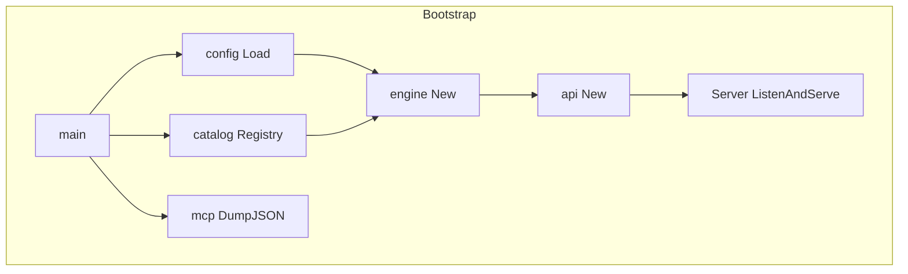
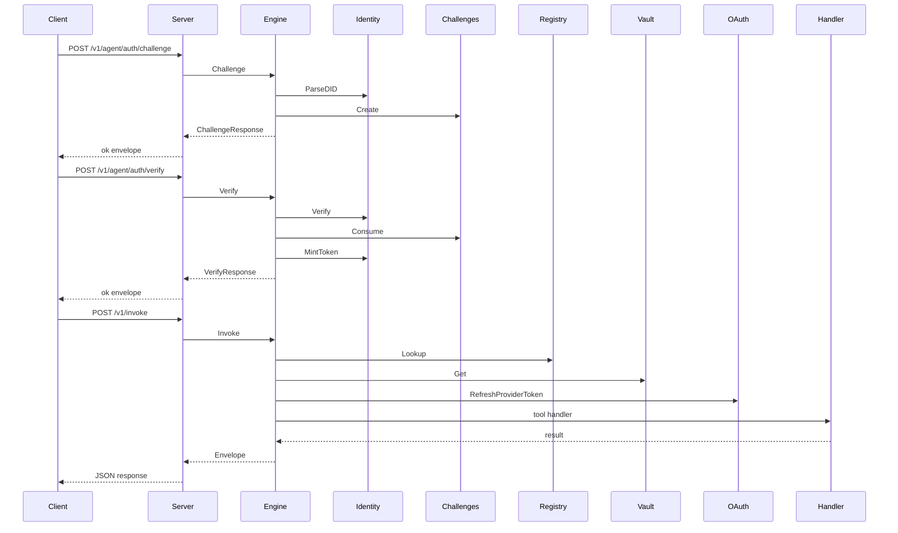
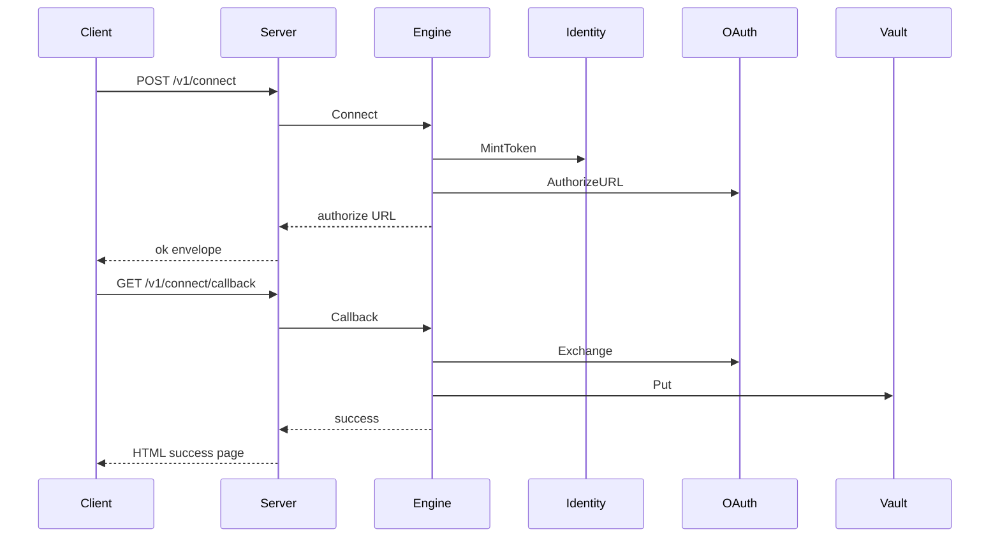

# UWAC Catalog, Identity, Engine, Connectors, and Public APIs

## Overview

`uwac` is the control plane for Centra AI daemons that need connector discovery, agent principal authentication, OAuth scope elevation, and tool invocation. The runtime entrypoint wires together the connector catalog, the configuration loader, the OAuth client, the token vault, the orchestration engine, the HTTP server, and the MCP tool advertisement generator.

The code in this section centers on a single contract: a connector is declared once, exposed through MCP, linked through a browser OAuth flow, and invoked through a signed agent principal token. The public HTTP surface is intentionally small and is split between transport authentication, agent DID verification, connector linking, tool execution, and a browser-facing OAuth callback.

## Runtime Wiring and Entry Point

### `uwac/cmd/uwacd/main.go`

`main` is the service bootstrapper and the `uwacd` daemon entrypoint.

| Step | Behavior |
| --- | --- |
| Parse flags | Reads `-dump-tools` and exits after printing MCP tool metadata when set. |
| Build logger | Creates a JSON `slog` logger; `-dump-tools` switches log output to stderr so stdout stays clean for JSON. |
| Build registry | Calls `catalog.Registry()` before any other runtime wiring. |
| Dump tools mode | Calls `mcp.DumpJSON(reg)`, writes the JSON plus a trailing newline to stdout, then exits. |
| Load config | Calls `config.Load()` for the runtime configuration. |
| Seed OAuth creds | Builds a `google` credential entry from `UWAC_GOOGLE_CLIENT_ID` and `UWAC_GOOGLE_CLIENT_SECRET`, with token exchange fixed to `https://oauth2.googleapis.com/token`. |
| Build OAuth client | Calls `oauth.New(cfg.SupabaseURL, cfg.SupabaseAnonKey, creds)`. |
| Build vault store | Uses `vault.NewMemory()`; when `cfg.DatabaseURI` is set, it logs a warning and still keeps the in-memory store. |
| Build engine | Calls `engine.New(cfg, store, reg, oc, logger)`. |
| Build HTTP server | Calls `api.New(eng, cfg.AuthToken, logger)`. |
| Serve | Starts `ListenAndServe(cfg.APIAddr)` in a goroutine. |
| Shutdown | Waits for SIGINT or SIGTERM, then shuts down with a 10 second timeout. |

## Configuration Loading

### `uwac/internal/config/config.go`

uwac/cmd/uwacd/main.go still wires vault.NewMemory() even when cfg.DatabaseURI is present. The code logs that the Postgres vault path is not wired yet, so UWAC_DATABASE_URI does not switch the active store in the observed runtime path.

`Config` is the resolved runtime configuration for `uwacd`.

| Property | Type | Description |
| --- | --- | --- |
| `APIAddr` | `string` | Listen address, default `:8646`. |
| `AuthToken` | `string` | Shared transport bearer token from `MATRIX_UWAC_TOKEN`. Empty disables transport auth. |
| `VaultKey` | `[]byte` | 32 byte AES-256-GCM key derived from the vault secret with SHA-256. |
| `SupabaseURL` | `string` | GoTrue base URL used by the OAuth flow. |
| `SupabaseAnonKey` | `string` | GoTrue anon key used by the OAuth flow. |
| `PublicBaseURL` | `string` | External base URL used to build the OAuth callback redirect. |
| `DatabaseURI` | `string` | Postgres DSN for the token vault. |
| `ChallengeTTL` | `time.Duration` | TTL for agent-auth nonces. |
| `Dev` | `bool` | Development mode gate for relaxed fail-closed checks. |

`Load` resolves configuration in this order:

1. Read `UWAC_CONFIG`, or fall back to `uwac.config.kvx`.
2. Parse the KVX overlay file if present.
3. Resolve each field with environment variables first, then KVX values, then defaults.
4. Derive `VaultKey` from `UWAC_VAULT_KEY` or `vault.key`.
5. Fall back to a development-only vault secret when `UWAC_ENV=development`.
6. Force `ChallengeTTL` back to `120s` if the resolved duration is zero or negative.

#### Environment and KVX resolution rules

| Field | Environment key | KVX key path | Default |
| --- | --- | --- | --- |
| `APIAddr` | `UWAC_ADDR` | `server.addr` | `:8646` |
| `AuthToken` | [REDACTED] | `server.auth_token` | empty |
| `SupabaseURL` | `UWAC_SUPABASE_URL` | `gotrue.url` | empty |
| `SupabaseAnonKey` | `UWAC_SUPABASE_ANON_KEY` | `gotrue.anon_key` | empty |
| `PublicBaseURL` | `UWAC_PUBLIC_BASE_URL` | `server.public_base_url` | empty |
| `DatabaseURI` | `UWAC_DATABASE_URI` | `vault.database_uri` | empty |
| `ConnectorsDir` | `UWAC_CONNECTORS_DIR` | `connectors.dir` | `connectors` |
| `ChallengeTTL` | `auth.challenge_ttl_seconds` | `auth.challenge_ttl_seconds` | `120s` |
| `VaultKey` | `UWAC_VAULT_KEY` | `vault.key` | development-only fallback secret |

`trimSlash` strips trailing slashes from `SupabaseURL` and `PublicBaseURL`.

### `uwac/internal/config/kvx.go`

`kvxDoc` is the parsed representation of the sectioned KVX overlay file.

| Property | Type | Description |
| --- | --- | --- |
| `sections` | `map[string]map[string]string` | Sectioned key/value storage. |
| `order` | `[]string` | Section order as parsed. |

#### Parser behavior

| Function | Behavior |
| --- | --- |
| `parseKVXFile` | Reads a KVX file from disk. A missing file is not an error and returns an empty document. |
| `newKVXDoc` | Creates an empty `kvxDoc`. |
| `parseKVX` | Scans a sectioned key/value document with a 1 MB scanner buffer. |
| `stripComment` | Removes trailing `#` comments outside quoted strings. |

The KVX format accepts:

- section headers like `[server]`
- double-quoted strings
- bare ints and bools
- bracketed string lists
- `${ENV_VAR}` interpolation

Duplicate keys are last-write-wins.

## Connector Catalog and Registry

### `uwac/internal/catalog/catalog.go`

`Registry` is the assembly point for the first-party connector catalog.

| Function | Behavior |
| --- | --- |
| `Registry` | Creates a new `connectors.Registry`, registers the current first-party connector set, and returns the registry or the first registration error. |

The catalog package is intentionally the only place that imports concrete connector implementations. That keeps the registry package free of import cycles and makes the MCP tool manifest come from one active registration path.

### `uwac/internal/connectors/connectors.go`

`Connector` groups a declarative connector spec with its executable tool handlers.

| Property | Type | Description |
| --- | --- | --- |
| `Spec` | `types.ConnectorSpec` | Declarative connector metadata. |
| `Handlers` | `map[string]Handler` | Tool-name to provider-call handler map. |

`Handler` is the execution contract for one tool call. It receives a context, a fresh provider access-token record, and the raw argument map, then returns a result or an error.

`bound` is the internal index entry used by the registry.

| Property | Type | Description |
| --- | --- | --- |
| `Connector` | `*Connector` | Owning connector. |
| `Tool` | `types.ToolSpec` | Tool metadata. |
| `Handler` | `Handler` | Executable provider call. |

`Registry` is the active connector index.

| Property | Type | Description |
| --- | --- | --- |
| `connectors` | `map[string]*Connector` | Connector lookup by connector id. |
| `byTool` | `map[string]bound` | Tool lookup by tool name. |

#### Registry methods

| Method | Description |
| --- | --- |
| `NewRegistry` | Builds an empty registry. |
| `Register` | Indexes a connector, rejecting duplicate connector ids, duplicate tool names, and tools without handlers. |
| `Lookup` | Resolves a tool name to its connector, tool spec, and handler. |
| `Tools` | Returns all advertised tools sorted by tool name. |
| `ToolNames` | Returns all advertised tool names sorted lexicographically. |
| `Specs` | Returns all connector specs sorted by connector id. |

`Register` fails early if the connector id is empty or if any tool is missing a handler. That makes connector manifest drift a boot-time error rather than a runtime surprise.

### `uwac/internal/connectors/errors.go`

`ArgError` marks caller-side argument problems.

| Property | Type | Description |
| --- | --- | --- |
| `Msg` | `string` | Human-readable argument error message. |

#### Error helpers

| Method | Description |
| --- | --- |
| `Error` | Returns the wrapped message. |
| `Bad` | Builds an `*ArgError` from a formatted message. |

`Engine.classify` maps `ArgError` to `types.CodeInvalidRequest`.

## Identity and Principal Tokens

### `uwac/internal/identity/identity.go`

`DID` is the parsed `did:matrix` principal identity.

| Property | Type | Description |
| --- | --- | --- |
| `Raw` | `string` | Original DID string. |
| `Label` | `string` | DID label segment. |
| `KeyFP` | `string` | Lowercase hex fingerprint prefix of the public key. |

`Challenges` is the in-memory single-use nonce store.

| Property | Type | Description |
| --- | --- | --- |
| `mu` | `sync.Mutex` | Guards the challenge map. |
| `ttl` | `time.Duration` | Nonce lifetime. |
| `m` | `map[string]entry` | Nonce to challenge entry map. |

`entry` stores one issued nonce.

| Property | Type | Description |
| --- | --- | --- |
| `did` | `string` | DID the nonce was issued for. |
| `exp` | `time.Time` | Expiry time. |

#### Identity functions

| Function | Behavior |
| --- | --- |
| `ParseDID` | Parses `did:matrix:<label>:<16-hex-fingerprint>` and normalizes the fingerprint to lowercase. |
| `IsUUID` | Checks whether a string is a canonical UUID. |
| `OwnerFromDID` | Returns the lowercase DID label when the label is a UUID. |
| `ChallengeMessage` | Builds the exact signed message `matrix-uwac-auth:<did>:<nonce>`. |
| `Verify` | Validates the public key fingerprint, decodes hex input, and verifies the ed25519 signature over the challenge message. |

#### Challenge store methods

| Method | Description |
| --- | --- |
| `NewChallenges` | Creates a nonce store with the provided TTL. |
| `Create` | Generates a nonce and returns the nonce plus the exact message to sign. |
| `Consume` | Performs single-use validation and deletes the nonce. |
| `Purge` | Removes expired nonces opportunistically. |

`Create` issues 24 random bytes, encodes them with raw URL base64, stores the nonce with its DID and expiry, and returns the matching challenge message. `Verify` checks the DID fingerprint before it checks the signature, so an unrelated public key cannot be paired with a known DID.

### `uwac/internal/identity/token.go`

Principal tokens are stateless HMAC tokens minted after successful DID verification.

#### Token functions

| Function | Behavior |
| --- | --- |
| `MintToken` | Signs `owner | expUnix` with HMAC-SHA256 and returns `base64url(payload).base64url(mac)`. |
| `VerifyToken` | [REDACTED] |
| `sign` | Computes the raw HMAC-SHA256 MAC. |
| `b64` | Encodes a string or byte slice with raw URL base64. |

The token lane is stateless, so it does not need a session store and can be verified across `uwacd` instances.

## Engine Orchestration

### `uwac/internal/engine/engine.go`

`Version` is the service version constant used by root and health responses.

The engine owns the runtime wiring for config, vault, registry, OAuth, challenge state, and logging.

| Property | Type | Description |
| --- | --- | --- |
| `cfg` | `*config.Config` | Resolved runtime configuration. |
| `vault` | `vault.Store` | Provider token storage. |
| `reg` | `*connectors.Registry` | Active connector registry. |
| `oauth` | `*oauth.Client` | GoTrue OAuth client. |
| `ch` | `*identity.Challenges` | In-memory DID nonce store. |
| `log` | `*slog.Logger` | Structured logger. |
| `mu` | `sync.Mutex` | Guards OAuth connect state. |
| `states` | `map[string]connectState` | In-memory connect verifier state. |

`connectState` is the transient OAuth connect record.

| Property | Type | Description |
| --- | --- | --- |
| `verifier` | `string` | PKCE verifier. |
| `owner` | `string` | Owner user id. |
| `connectorID` | `string` | Connector id being linked. |
| `provider` | `string` | Provider key. |
| `scopes` | `[]string` | Requested OAuth scopes. |
| `exp` | `time.Time` | Connect state expiry. |

#### Engine constructor dependencies

| Type | Description |
| --- | --- |
| `*config.Config` | Runtime configuration. |
| `vault.Store` | Provider token store. |
| `*connectors.Registry` | Connector registry used for discovery and invocation. |
| `*oauth.Client` | OAuth client used for authorize, exchange, and refresh. |
| `*slog.Logger` | Structured logger. |

#### Engine methods

| Method | Description |
| --- | --- |
| `New` | Wires the engine and creates the challenge store with `cfg.ChallengeTTL`. |
| `Registry` | Exposes the connector registry for MCP advertisement. |
| `Challenge` | Validates a DID, creates a nonce, and returns a challenge response. |
| `Verify` | Verifies the signed challenge, consumes the nonce, binds an owner user id, and mints a principal token. |
| `OwnerFromToken` | [REDACTED] |
| `Connect` | Starts the OAuth scope-elevation flow, stores the PKCE verifier and connect state, and returns an authorize URL. |
| `Callback` | Exchanges the OAuth code, requires a refresh token, writes the provider record to the vault, and logs the link event. |
| `Disconnect` | Deletes an owner/provider grant from the vault. |
| `Invoke` | Resolves the tool, enforces confirmation and scope gates, refreshes credentials when required, dispatches the handler, and wraps the result in an envelope. |

#### Engine state and error handling

| Area | Behavior |
| --- | --- |
| Challenge lifetime | `principalTTL` is `30m`, `tokenSkew` is `60s`, `connectStateTTL` is `10m`. |
| Challenge cleanup | `Challenge` launches `go e.ch.Purge()` after issuing a nonce. |
| Verify failure | Invalid signature, invalid nonce, or non-UUID owner label returns an error. |
| Connect failure | Unknown connector ids and expired connect states fail before exchange. |
| Callback failure | The callback fails if the provider does not return a refresh token. |
| Invoke confirmation | Tools with `confirm` or `external_money` consequence require `Confirmed=true`. |
| Invoke lookup | Unknown tools become `types.CodeInvalidRequest`. |
| Scope gate | Missing scopes become `types.CodeScopeMissing`. |
| Credential refresh | Missing or expiring tokens trigger `oauth.RefreshProviderToken`. |
| Error classification | `ArgError` becomes `invalid_request`; upstream HTTP errors map to provider or unauthorized codes; `429` and `5xx` are retryable. |

`ensureFresh` skips refresh for `static` or `none` providers and writes back refreshed access tokens on a best-effort basis. If the vault write-back fails, the engine only logs a warning.

### `uwac/internal/engine/engine_test.go`

The engine tests prove the request-gating and invocation rules.

| Test | Behavior proved |
| --- | --- |
| `TestInvokeUnknownTool` | Unknown tools return `types.CodeInvalidRequest`. |
| `TestInvokeNotConnected` | Missing provider grants return `types.CodeNotConnected`. |
| `TestInvokeScopeMissing` | Missing scopes return `types.CodeScopeMissing`. |
| `TestInvokeConfirmGate` | Consequence-gated tools fail until `Confirmed=true`. |
| `TestInvokeReadOK` | A permitted read tool returns the handler payload unchanged. |
| `TestChallengeVerifyBindsOwner` | A DID that cannot bind an owner fails verification. |

The test fixture builds a registry with `echo_read` and `echo_write`, seeds the memory vault when needed, and exercises the full invoke path with a static-refresh connector.

## Wire Contracts

### `uwac/pkg/types/types.go`

`Envelope` is the uniform response wrapper used by the HTTP API and the MCP-facing proxy layer.

| Property | Type | Description |
| --- | --- | --- |
| `Ok` | `bool` | Success flag. |
| `Data` | `any` | Success payload. |
| `Error` | `*Error` | Structured failure payload. |

`Error` is the machine-branchable failure shape.

| Property | Type | Description |
| --- | --- | --- |
| `Code` | `string` | Stable error code. |
| `Message` | `string` | Human-readable message. |
| `Retryable` | `bool` | Retry hint. |

#### Error helpers

| Function | Behavior |
| --- | --- |
| `OK` | Wraps a success payload. |
| `Fail` | Wraps a structured error. |
| `NewError` | Builds an `*Error`. |

#### Error codes

`CodeInvalidRequest`, `CodeUnauthorized`, `CodeNotConnected`, `CodeScopeMissing`, `CodeNeedsConfirm`, `CodeProvider`, `CodeInternal`

`Consequence` classifies tool side effects.

`ConseqNatural`, `ConseqConfirm`, `ConseqExternalMoney`

#### Connector and tool declarations

| Type | Properties |
| --- | --- |
| `ToolSpec` | `Name string`, `Description string`, `InputSchema map[string]any`, `SideEffectClass string`, `Consequence Consequence`, `Scopes []string` |
| `OAuthSpec` | `Provider string`, `Scopes []string`, `Refresh string`, `QueryParams map[string]string` |
| `EventSource` | `Key string`, `Kind string`, `Description string` |
| `ConnectorSpec` | `ID string`, `Provider string`, `Display string`, `OAuth OAuthSpec`, `Tools []ToolSpec`, `EventSources []EventSource` |

`Consequence` values are used by `Engine.Invoke` to decide whether a tool requires explicit confirmation.

#### Invoke and agent-auth request and response shapes

| Type | Properties |
| --- | --- |
| `InvokeRequest` | `Tool string`, `Args map[string]any`, `Confirmed bool` |
| `ChallengeRequest` | `DID string` |
| `ChallengeResponse` | `DID string`, `Nonce string`, `Message string`, `ExpiresIn int` |
| `VerifyRequest` | `DID string`, `PublicKey string`, `Nonce string`, `Signature string` |
| `VerifyResponse` | `Token string`, `OwnerUserID string`, `ExpiresIn int` |

The request and response structs are the wire shapes used by the public API handlers. `VerifyRequest` carries the ed25519 public key and signature as hex strings, and `ChallengeResponse.Message` is the exact string the client must sign.

## Public HTTP API

### `uwac/pkg/api/server.go`

`Server` is the HTTP wrapper around the engine.

| Property | Type | Description |
| --- | --- | --- |
| `eng` | `*engine.Engine` | Engine instance used by all route handlers. |
| `log` | `*slog.Logger` | Structured logger. |
| `mux` | `*http.ServeMux` | Route mux. |
| `server` | `*http.Server` | Running HTTP server. |
| `auth` | `string` | Shared transport bearer token. |

#### Server constructor dependencies

| Type | Description |
| --- | --- |
| `*engine.Engine` | Request handler backend. |
| `string` | Shared transport bearer token from `MATRIX_UWAC_TOKEN`. |
| `*slog.Logger` | Structured logger. |

#### Server methods

| Method | Description |
| --- | --- |
| `New` | Registers the HTTP routes and returns a server. |
| `ListenAndServe` | Starts the HTTP server with a 30 second header timeout. |
| `Shutdown` | Stops the HTTP server if it was started. |

#### Route helpers

| Method | Behavior |
| --- | --- |
| `authMiddleware` | Enforces the shared transport bearer on all non-public routes when `auth` is set. |
| `isPublicPath` | Treats `GET /`, `GET /healthz`, and `GET /v1/connect/callback` as public. |
| `principal` | Resolves the owner user id from `X-UWAC-Agent`. |
| `statusFor` | Maps `types.Error` codes to HTTP status codes. |
| `bearerToken` | [REDACTED] |
| `decode` | Decodes JSON bodies and allows empty bodies by treating `io.EOF` as non-fatal. |
| `writeJSON` | Writes a JSON response. |
| `writeHTML` | Writes the callback HTML success or failure page. |

#### Route behavior

| Route | Method | Transport auth | Principal auth | Request body | Response |
| --- | --- | --- | --- | --- | --- |
| `/` | `GET` | Public | None | None | JSON envelope with `service`, `version`, and `health`. |
| `/healthz` | `GET` | Public | None | None | JSON envelope with `status` and `version`. |
| `/v1/agent/auth/challenge` | `POST` | Shared bearer when configured | None | `ChallengeRequest` | JSON envelope wrapping `ChallengeResponse`. |
| `/v1/agent/auth/verify` | `POST` | Shared bearer when configured | None | `VerifyRequest` | JSON envelope wrapping `VerifyResponse`. |
| `/v1/invoke` | `POST` | Shared bearer when configured | `X-UWAC-Agent` | `InvokeRequest` | JSON `Envelope`. |
| `/v1/connect` | `POST` | Shared bearer when configured | `X-UWAC-Agent` | `{ "connector": string }` | JSON envelope with `authorize_url`. |
| `/v1/connect/callback` | `GET` | Public | State token in `state`, OAuth code in `code` | Query params | HTML success or failure page. |
| `/v1/disconnect` | `POST` | Shared bearer when configured | `X-UWAC-Agent` | `{ "provider": string }` | JSON envelope with status and provider. |

#### Auth and response behavior

| Area | Behavior |
| --- | --- |
| Transport bearer | `Authorization` must contain a `Bearer` token when `auth` is non-empty. |
| Principal token | [REDACTED] |
| Callback route | No transport bearer is required because the browser redirect cannot provide it. |
| Empty request bodies | `decode` accepts empty bodies and leaves semantic validation to the handler. |
| Error mapping | `CodeInvalidRequest` → 400, `CodeUnauthorized` → 401, `CodeNotConnected` and `CodeScopeMissing` → 403, `CodeNeedsConfirm` → 409, `CodeProvider` → 502, everything else → 500. |

#### Response payloads

| Route | Payload details |
| --- | --- |
| `/` | `service` is `uwacd`, `version` comes from `engine.Version`, `health` is `/healthz`. |
| `/healthz` | `status` is `ok`, `version` comes from `engine.Version`. |
| `/v1/agent/auth/challenge` | Returns the DID, nonce, signed message, and nonce expiry. |
| `/v1/agent/auth/verify` | Returns the principal token, owner user id, and token expiry. |
| `/v1/connect` | Returns the OAuth authorize URL in `authorize_url`. |
| `/v1/connect/callback` | Returns human-readable HTML. |
| `/v1/disconnect` | Returns `status` and `provider`. |

The callback route relies on the signed `state` token created in `Engine.Connect`. The route is public at the transport layer, but the state token and OAuth code are required for successful completion.

## MCP Tool Advertisement

### `uwac/pkg/mcp/mcp.go`

`Tool` is the MCP `tools/list` advertisement shape.

| Property | Type | Description |
| --- | --- | --- |
| `Name` | `string` | Tool name. |
| `Description` | `string` | Human-readable description. |
| `InputSchema` | `map[string]any` | JSON Schema payload. |

#### MCP functions

| Function | Behavior |
| --- | --- |
| `Tools` | Converts the registry’s tool specs into MCP tool entries sorted by tool name. |
| `DumpJSON` | Marshals the tool advertisement as indented JSON. |

When a connector tool omits `InputSchema`, `Tools` fills in a default object schema with `additionalProperties: true` and an empty `properties` map. That makes the MCP manifest stable even when a connector only supplies a description and no explicit schema.

## Logging and Telemetry

`uwacd` uses a structured `slog` logger throughout the bootstrap, HTTP server, and engine layers.

| Injection point | Behavior |
| --- | --- |
| `main` | Creates a JSON logger with info level. |
| `main` in `-dump-tools` mode | Redirects logger output to stderr so stdout can carry the tool JSON. |
| `engine.New` | Accepts an injected logger and falls back to `slog.Default()` when nil. |
| `api.New` | Accepts an injected logger and falls back to `slog.Default()` when nil. |

#### Logged events

| Location | Event |
| --- | --- |
| `main` | Registry failure, config load failure, dump-tools failure, server failure, shutdown failure, and the startup warning for an unused database URI. |
| `ListenAndServe` | `uwacd listening` with the configured address, plus a transport-auth disabled warning when `auth` is empty. |
| `Engine.Callback` | `connector linked` with owner, connector id, and scope count. |
| `Engine.Invoke` | `tool ok` on success and `tool failed` on handler errors. |
| `Engine.ensureFresh` | `vault write-back failed` when best-effort token refresh persistence fails. |
| `getCallback` | `connect callback failed` when the browser OAuth callback does not complete. |

The logging path is purely structured JSON text; there is no event bus or websocket layer in the provided UWAC code.

## Source-Backed Validation

### `uwac/internal/identity/identity_test.go`

| Test | Behavior proved |
| --- | --- |
| `TestParseDID` | Valid DID parsing and fingerprint normalization. |
| `TestOwnerFromDID` | UUID labels resolve to owner user ids; non-UUID labels do not. |
| `TestVerifyRoundTrip` | A challenge signed by the matching key verifies successfully. |
| `TestVerifyWrongKeyForDID` | A mismatched public key fingerprint fails verification. |
| `TestChallengeSingleUse` | Nonces are single-use. |
| `TestChallengeExpiry` | Expired nonces fail to consume. |
| `TestChallengeDIDMismatch` | Nonces are bound to the issuing DID. |

### `uwac/internal/engine/engine_test.go`

| Test | Behavior proved |
| --- | --- |
| `TestInvokeUnknownTool` | Unknown tools fail with invalid request. |
| `TestInvokeNotConnected` | Missing provider linkage fails with not connected. |
| `TestInvokeScopeMissing` | Missing scopes fail with scope missing. |
| `TestInvokeConfirmGate` | Confirm-gated tools fail without confirmation and pass with confirmation. |
| `TestInvokeReadOK` | Allowed read tools return the handler payload unchanged. |
| `TestChallengeVerifyBindsOwner` | DID owner binding is enforced. |

## Key Files Reference

| File | Responsibility |
| --- | --- |
| `uwac/cmd/uwacd/main.go` | Bootstraps the daemon, handles `-dump-tools`, wires config, OAuth, vault, engine, HTTP server, and graceful shutdown. |
| `uwac/internal/catalog/catalog.go` | Assembles the first-party connector registry. |
| `uwac/internal/config/config.go` | Resolves runtime configuration from KVX, environment, and defaults. |
| `uwac/internal/config/kvx.go` | Parses the KVX overlay format and applies environment interpolation. |
| `uwac/internal/identity/identity.go` | Parses DIDs, issues challenges, verifies signatures, and manages nonce state. |
| `uwac/internal/identity/identity_test.go` | Verifies DID parsing, owner resolution, signature validation, and challenge lifecycle behavior. |
| `uwac/internal/identity/token.go` | [REDACTED] |
| `uwac/internal/engine/engine.go` | Orchestrates challenge, verify, connect, callback, disconnect, and invoke flows. |
| `uwac/internal/engine/engine_test.go` | Proves invocation gating and identity binding behavior. |
| `uwac/internal/connectors/connectors.go` | Indexes connector specs, handlers, tools, and tool name lookups. |
| `uwac/internal/connectors/errors.go` | Marks caller-side argument errors for request classification. |
| `uwac/pkg/api/server.go` | Exposes the public HTTP surface and enforces transport and principal auth. |
| `uwac/pkg/types/types.go` | Defines the shared wire contracts used by the engine and HTTP layer. |
| `uwac/pkg/mcp/mcp.go` | Converts the registry into MCP tool advertisements and renders the generated JSON. |
