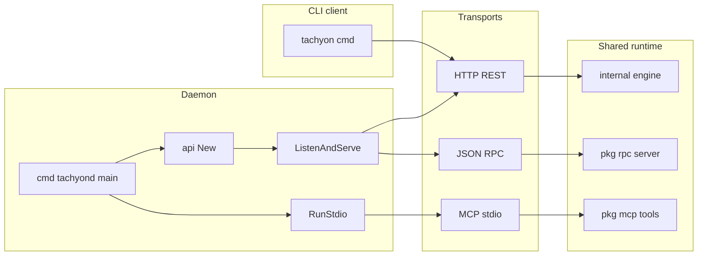
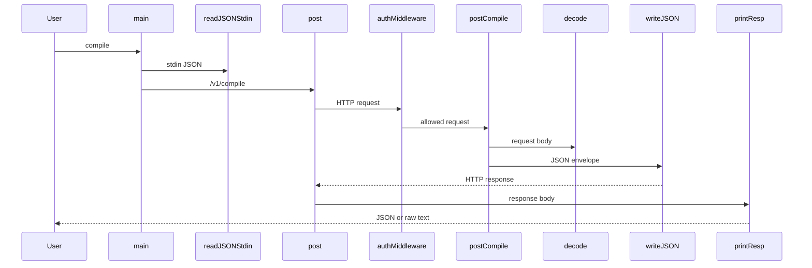
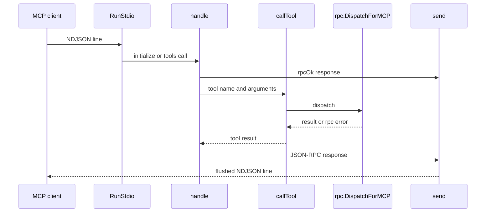

# Tachyon Runtime - CLI commands, API server, RPC server, and MCP surfaces

## Overview

Tachyon’s runtime is split into three user-facing transport surfaces: a thin CLI client, an HTTP daemon, and an MCP stdio server. `tachyon/README.md` frames those surfaces as the primary interfaces: API, MCP, and JSON-RPC are the intended integration points, while `cmd/tachyon` is only a client wrapper.

The daemon entrypoint in `tachyon/cmd/tachyond/main.go` can run either the HTTP server or the MCP server. The HTTP path exposes REST endpoints and JSON-RPC on one listener through `tachyon/pkg/api/server.go` and `tachyon/pkg/rpc/server.go`; the MCP path exposes newline-delimited JSON-RPC tools through `tachyon/pkg/mcp/server.go` and `tachyon/pkg/mcp/tools.go`.

## Runtime Entry Points

### `tachyon/README.md`

tachyon/cmd/tachyon/main.go never sets an Authorization header, while tachyon/pkg/api/server.go requires Bearer auth whenever auth_token is configured. The CLI therefore only works against unauthenticated listeners or a wrapper that adds the header externally.

The README describes the runtime contract at a high level:

- the daemon is the primary product surface
- the CLI is a thin client
- the main interfaces are API, MCP, and JSON-RPC
- deploy and call operations can be constrained by `capability_token` and policy profiles
- transport auth is controlled by `server.auth_token` or `TACHYON_AUTH_TOKEN`

It also provides the repository’s quick-start flow.

```steps
1. Install dependencies | Run `make deps` to fetch forge-std and optional test dependencies.
2. Build and run the daemon | Run `make build && make run` to boot the daemon on `:8645`.
3. Check daemon health | Run `curl localhost:8645/healthz`.
4. Use the CLI or MCP mode | Run `./bin/tachyon compile <<< '{"targets":["Create2"]}'`, `./bin/tachyond --mcp`, or `./bin/tachyond --selftest`.
```

### `tachyon/cmd/tachyon/main.go`

This is the thin HTTP client. It:

- reads `-addr` with fallback to `TACHYON_HTTP_ADDR`
- defaults to `health` when no subcommand is supplied
- supports `health`, `healthz`, `compile`, `test`, `simulate`, `deploy`, `call`, and `chains`
- sends POST bodies as JSON read from stdin
- pretty-prints JSON responses and falls back to raw text if the body is not JSON
- exits with `tachyon: ` on fatal errors

| Command | HTTP call |
| --- | --- |
| `health` | `GET /healthz` |
| `healthz` | `GET /healthz` |
| `compile` | `POST /v1/compile` |
| `test` | `POST /v1/test` |
| `simulate` | `POST /v1/simulate` |
| `deploy` | `POST /v1/deploy` |
| `call` | `POST /v1/call` |
| `chains` | `GET /v1/chains` |


Operational details visible in the code:

- `get` uses an `http.Client` with a `120 * time.Second` timeout
- `post` uses an `http.Client` with a `30 * time.Minute` timeout
- `post` always sets `Content-Type: application/json`
- empty or whitespace-only stdin becomes `map[string]any{}` in `readJSONStdin`

### `tachyon/cmd/tachyond/main.go`

This is the daemon entrypoint. It branches into three modes:

- normal HTTP server mode
- MCP stdio mode with `-mcp`
- tool registry self-test mode with `-selftest`

Behavior by mode:

| Flag | Behavior |
| --- | --- |
| `-mcp` | runs `mcp.RunStdio(eng)` and returns |
| `-selftest` | runs `mcp.Selftest()` and exits before loading config or engine |
| neither | loads config, builds the engine, and starts `api.New(eng, logger)` |


Runtime lifecycle:

- in MCP or self-test mode, logs go to `os.Stderr`
- otherwise logs go to `os.Stdout`
- the HTTP server starts in a goroutine through `srv.ListenAndServe(cfg.APIAddr)`
- the process waits for `SIGINT` or `SIGTERM`
- shutdown uses a `10 * time.Second` context timeout

## Architecture Overview



## HTTP API Server

### `tachyon/pkg/api/server.go`

`Server` is the HTTP façade for Tachyon’s REST and JSON-RPC traffic.

#### `Server` properties

| Property | Type | Description |
| --- | --- | --- |
| `eng` | `*engine.Engine` | Engine used to satisfy compile, test, simulate, deploy, call, chain, artifact, and registry requests |
| `log` | `*slog.Logger` | Structured logger used for startup, auth warnings, and shutdown-related logs |
| `mux` | `*http.ServeMux` | Route registry for REST and JSON-RPC handlers |
| `server` | `*http.Server` | Active HTTP server instance created by `ListenAndServe` |
| `forge` | `string` | Cached output from `probeForge(eng.Cfg.ForgePath)` |
| `auth` | `string` | Configured auth token copied from `eng.Cfg.AuthToken` |


#### Constructor dependencies

| Type | Description |
| --- | --- |
| `*engine.Engine` | Supplies runtime behavior and configuration values |
| `*slog.Logger` | Receives structured runtime logs |


#### Public methods

| Method | Description |
| --- | --- |
| `ListenAndServe` | Starts the HTTP server with auth middleware and a 30 second read-header timeout |
| `Shutdown` | Stops the server gracefully when it has been started |


#### Internal handlers and helpers

| Method | Description |
| --- | --- |
| `isPublicPath` | Treats `GET /healthz` and `GET /` as public when auth is enabled |
| `bearerToken` | [REDACTED] |
| `decode` | Decodes POST request bodies and writes a 400 JSON envelope on malformed JSON |
| `writeJSON` | Writes JSON responses with `Content-Type: application/json` |
| `probeForge` | Executes `forge --version` with a 5 second timeout and caches the trimmed output |
| `handleRoot` | Returns service metadata with `service`, `version`, `health`, and `rpc` |
| `handleHealthz` | Returns the cached engine health payload |
| `handleRPC` | Delegates to `rpc.ServeHTTP` |
| `postCompile` | Decodes `types.CompileRequest` and returns the compile envelope |
| `postTest` | Decodes `types.TestRequest` and maps unsuccessful envelopes to HTTP 422 |
| `postSimulate` | Decodes `types.SimulateRequest` and maps unsuccessful envelopes to HTTP 422 |
| `postDeploy` | Decodes `types.DeployRequest` and maps unsuccessful envelopes to HTTP 422 |
| `postCall` | Decodes `types.CallRequest` and maps unsuccessful envelopes to HTTP 422 |
| `getChains` | Returns the chain list |
| `postChains` | Decodes `types.ChainRegisterRequest` and returns the registration result |
| `postChainUse` | Decodes `types.ChainUseRequest` and returns the active-chain result |
| `getArtifact` | Reads `name` from the path and `project_id` from the query string |
| `getRegistry` | Reads `key` and `chain_id` from the query string |


#### Registered routes

| Method | Path | Behavior |
| --- | --- | --- |
| `GET` | `/healthz` | Public health endpoint |
| `GET` | `/` | Public service metadata endpoint |
| `POST` | `/rpc` | JSON-RPC 2.0 handler |
| `POST` | `/v1/compile` | Compile request |
| `POST` | `/v1/test` | Test request |
| `POST` | `/v1/simulate` | Simulate request |
| `POST` | `/v1/deploy` | Deploy request |
| `POST` | `/v1/call` | Call request |
| `GET` | `/v1/chains` | Chain list |
| `POST` | `/v1/chains` | Chain registration |
| `POST` | `/v1/chains/use` | Switch active chain |
| `GET` | `/v1/artifacts/{name}` | Artifact lookup by path value |
| `GET` | `/v1/registry/deployments` | Deployment registry lookup |


#### Authentication and lifecycle

`ListenAndServe` wraps `mux` in `authMiddleware`. When `auth` is empty, the server logs the warning string from source and accepts requests without token checks. When `auth` is set, every request except `GET /healthz` and `GET /` must carry a matching `Authorization: Bearer` token, compared with `subtle.ConstantTimeCompare`.

`handleRoot` returns a fixed service envelope containing:

- `service: "tachyond"`
- `version: engine.Version`
- `health: "/healthz"`
- `rpc: "/rpc"`

`handleHealthz` uses the cached Forge version string from `probeForge`. If the probe fails, the cached string is empty.

#### `tachyon/pkg/api/server_test.go`

GET /healthz and the JSON-RPC health method do not return the same Forge payload. handleHealthz passes the cached Forge version into s.eng.Health(s.forge), while tachyon_health in tachyon/pkg/rpc/server.go passes an empty string to eng.Health(""). The two surfaces therefore expose different health detail.

The tests lock the observed HTTP behavior in place.

| Test | What it verifies |
| --- | --- |
| `TestCompileAndTestHTTP` | `postCompile` accepts `{"targets":["Create2"]}` and returns an `ok` envelope with a `Create2` artifact; `postTest` accepts `{"match_path":"test/utils/Create2.t.sol"}` and returns a passed count |
| `TestAuthMiddleware` | `GET /healthz` stays public, unauthenticated `/v1/chains` is rejected, and `Authorization: Bearer s3cret` is accepted when `srv.auth` is set |


### HTTP request flow



## JSON-RPC Server

### `tachyon/pkg/rpc/server.go`

This module exposes the JSON-RPC path used by the HTTP server at `POST /rpc`.

#### `request` properties

| Property | Type | Description |
| --- | --- | --- |
| `JSONRPC` | `string` | JSON-RPC version string |
| `ID` | `any` | Request identifier |
| `Method` | `string` | RPC method name |
| `Params` | `json.RawMessage` | Raw request parameters |


#### `response` properties

| Property | Type | Description |
| --- | --- | --- |
| `JSONRPC` | `string` | JSON-RPC version string |
| `ID` | `any` | Response identifier |
| `Result` | `any` | Successful result payload |
| `Error` | `*rpcError` | RPC error payload |


#### `rpcError` properties

| Property | Type | Description |
| --- | --- | --- |
| `Code` | `int` | JSON-RPC error code |
| `Message` | `string` | Error message |


#### Public methods

| Method | Description |
| --- | --- |
| `ServeHTTP` | Reads a JSON-RPC request body, dispatches it, and writes a JSON-RPC response |
| `Dispatch` | Routes `tachyon_*` methods to the engine |
| `DecodeParams` | Test helper that unmarshals parameters or returns `io.EOF` for empty input |


#### Method routing

| Method | Engine call |
| --- | --- |
| `tachyon_compile` | `eng.Compile(ctx, p)` |
| `tachyon_test` | `eng.Test(ctx, p)` |
| `tachyon_simulate` | `eng.Simulate(ctx, p)` |
| `tachyon_deploy` | `eng.Deploy(ctx, p)` |
| `tachyon_call` | `eng.Call(ctx, p)` |
| `tachyon_chain_list` | `eng.ChainList()` |
| `tachyon_chain_register` | `eng.ChainRegister(p)` |
| `tachyon_chain_use` | `eng.ChainUse(p)` |
| `tachyon_artifact_get` | `eng.ArtifactGet(p)` |
| `tachyon_registry_lookup` | `eng.RegistryLookup(p)` |
| `tachyon_health` | `types.OK(eng.Health(""))` |


#### Error handling

- malformed JSON in `ServeHTTP` becomes a JSON-RPC response with `Code: -32700`
- invalid parameters in `Dispatch` become `Code: -32602`
- unknown methods become `Code: -32601`
- responses are always serialized as JSON with `Content-Type: application/json`

## MCP Surfaces

### `tachyon/pkg/mcp/tools.go`

tachyon_health returns types.OK(eng.Health("")), while the HTTP /healthz route injects the cached Forge version string. The two health surfaces are therefore not identical even though they both report engine health.

`Tool` describes one MCP tool. `Tools()` returns the canonical tool catalog, and `ToolNames` is the self-test allowlist.

#### `Tool` properties

| Property | Type | Description |
| --- | --- | --- |
| `Name` | `string` | MCP tool name |
| `Description` | `string` | Human-readable tool summary |
| `InputSchema` | `map[string]any` | JSON Schema-like input description |


#### Canonical tool list

| Tool | Description |
| --- | --- |
| `tachyon_compile` | Build Solidity contracts via forge |
| `tachyon_test` | Run Forge tests with structured JSON results |
| `tachyon_simulate` | Dry-run eth_call without broadcasting |
| `tachyon_deploy` | Intent-based deploy with idempotency key |
| `tachyon_call` | Contract call with `simulate_only` or broadcast |
| `tachyon_chain_list` | List configured chain RPC profiles |
| `tachyon_chain_register` | Register a custom chain profile |
| `tachyon_artifact_get` | Fetch cached ABI and bytecode by contract name |
| `tachyon_registry_lookup` | Resolve a prior deployment by idempotency key |


`Tools()` uses the same base input shape for most tools: an object schema with `additionalProperties: true`. `tachyon_chain_list` is the exception and uses an empty `properties` map.

### `tachyon/pkg/mcp/server.go`

This is the MCP stdio server. It reads newline-delimited JSON-RPC messages from stdin and writes newline-delimited JSON-RPC responses to stdout.

#### Public methods and functions

| Method | Description |
| --- | --- |
| `RunStdio` | Reads stdin line by line, dispatches MCP JSON-RPC messages, and writes stdout responses |
| `Selftest` | Verifies that the tool catalog matches `ToolNames` |
| `FormatToolError` | Serializes structured tool errors into MCP-friendly text |
| `handle` | Handles `initialize`, `tools/list`, `tools/call`, `notifications/initialized`, `ping`, and unknown methods |
| `callTool` | Dispatches tool calls, with a direct `eng.ChainList()` fast path for `tachyon_chain_list` |
| `send` | Writes a JSON response and flushes stdout |
| `rpcOk` | Builds a JSON-RPC success envelope |
| `rpcErr` | Builds a JSON-RPC error envelope |


#### MCP message handling

| Method | Behavior |
| --- | --- |
| `initialize` | Returns `protocolVersion: "2024-11-05"`, `serverInfo.name: "tachyon-tools"`, `serverInfo.version: engine.Version`, and empty tool capabilities |
| `tools/list` | Returns the catalog from `Tools()` |
| `tools/call` | Reads `name` and `arguments`, dispatches the tool, and returns text content |
| `notifications/initialized` | Ignored |
| `ping` | Ignored |
| Unknown method with `id == nil` | Ignored |
| Unknown method with `id != nil` | Returns a JSON-RPC error with `Code: -32601` |


#### Transport details

- `RunStdio` uses a scanner buffer sized to 1 MB
- blank lines are skipped
- malformed JSON becomes a parse error response with code `-32700`
- tool failures are returned as text content with `isError: true`
- `send` appends a newline and syncs stdout so NDJSON clients can read line by line

### MCP self-test validation

`tachyon/pkg/mcp/selftest_test.go` verifies the runtime registry:

| Test | What it verifies |
| --- | --- |
| `TestSelftest` | `Selftest()` succeeds |
| `TestToolNamesMatchTools` | `len(Tools()) == len(ToolNames)` |


`cmd/tachyond --selftest` uses the same `Selftest()` path before any config or engine initialization.

### MCP flow



## API Server Documentation Mirrors

### `docs/tachyon-docs/api-server.md`

### `docs/.web/src/content/tachyon-docs/api-server.md`

These two files mirror the same API server guidance for the docs site and the content source tree. Both point back to `tachyon/pkg/api/server.go` and describe the same active HTTP contract:

| File | What it documents |
| --- | --- |
| `docs/tachyon-docs/api-server.md` | Single listener design, structured JSON envelopes, Bearer auth, route table, request decode helper, Forge version probing, server lifecycle, and modification notes |
| `docs/.web/src/content/tachyon-docs/api-server.md` | The same content for the website build tree |


The documentation confirms the live route split:

- REST endpoints under `/v1/*`
- JSON-RPC at `/rpc`
- `GET /healthz` and `GET /` as the only public HTTP routes when auth is enabled

## Logging and Telemetry

`tachyon/cmd/tachyond/main.go` and `tachyon/pkg/api/server.go` both inject `*slog.Logger`.

- `cmd/tachyond/main.go` builds a JSON logger with `slog.NewJSONHandler`
- MCP and self-test modes write logs to stderr so stdout remains reserved for NDJSON-RPC
- normal daemon mode writes logs to stdout
- `api.New` logs the startup warning when `auth_token` is empty
- `api.New` logs the listening address before `ListenAndServe`
- startup and shutdown errors are logged in the daemon entrypoint

This logging path is the only explicit telemetry surface visible in the runtime code.

## Key Files Reference

| File | Responsibility |
| --- | --- |
| `tachyon/README.md` | Declares the runtime’s primary surfaces, quick-start commands, config precedence, wallet modes, and transport auth policy |
| `tachyon/cmd/tachyon/main.go` | Thin HTTP client for health, compile, test, simulate, deploy, call, and chains |
| `tachyon/cmd/tachyond/main.go` | Daemon entrypoint for HTTP mode, MCP mode, and tool self-test mode |
| `tachyon/pkg/api/server.go` | HTTP server with REST routes, JSON-RPC delegation, auth middleware, health reporting, and startup probe caching |
| `tachyon/pkg/api/server_test.go` | Validates compile/test handlers and auth middleware behavior |
| `tachyon/pkg/rpc/server.go` | JSON-RPC request and response handling for `tachyon_*` methods |
| `tachyon/pkg/mcp/server.go` | MCP stdio server, tool dispatch, NDJSON flushing, and tool self-test |
| `tachyon/pkg/mcp/tools.go` | MCP tool catalog and canonical tool name list |
| `tachyon/pkg/mcp/selftest_test.go` | Guards tool catalog size and self-test behavior |
| `docs/tachyon-docs/api-server.md` | Repository documentation for the API server contract |
| `docs/.web/src/content/tachyon-docs/api-server.md` | Website content mirror of the API server documentation |
