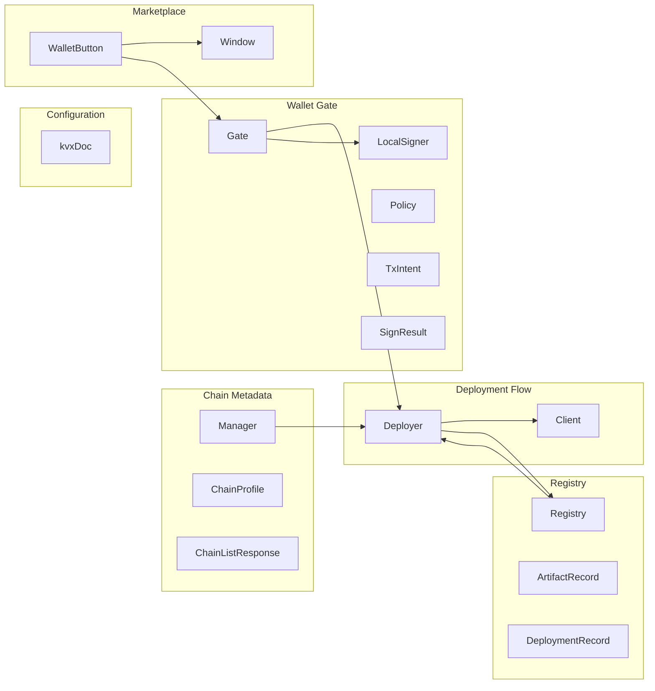
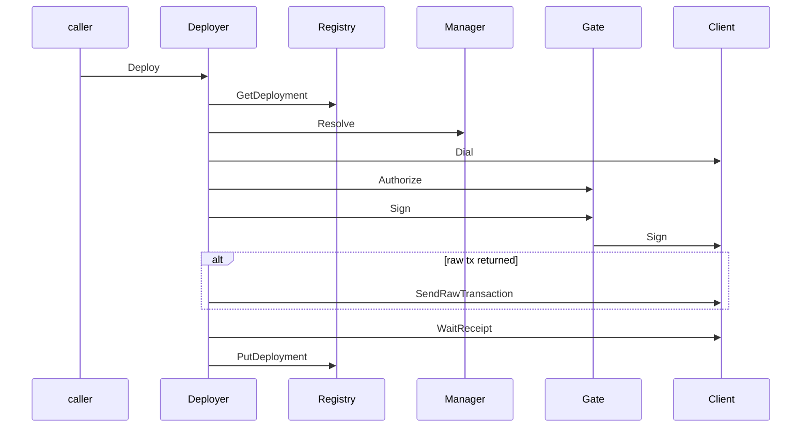
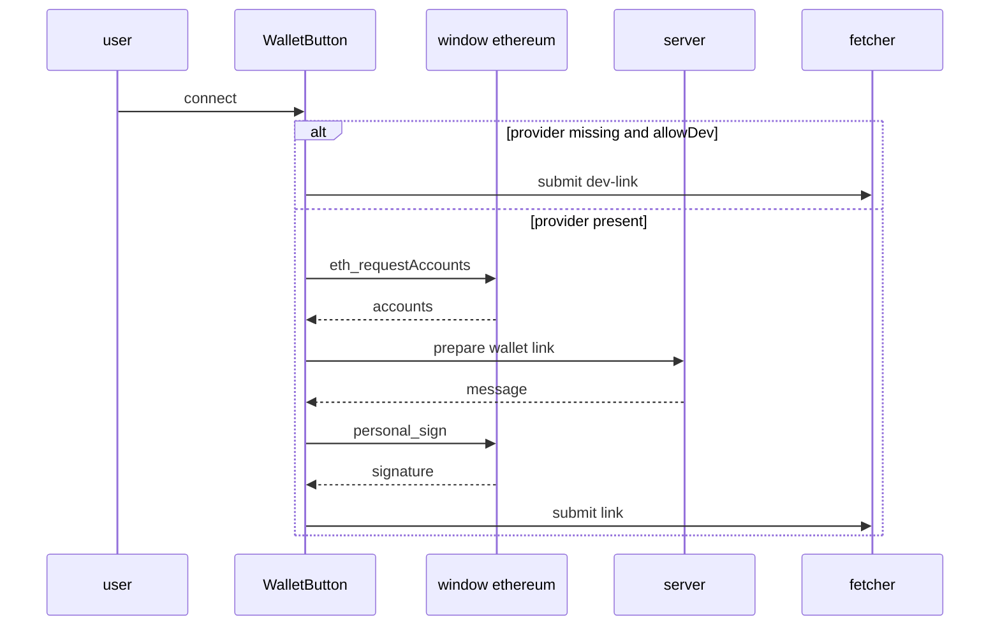

# Tachyon Runtime Support Layers

## Overview

This section covers the support code that lets Tachyon resolve chains, parse layered configuration, persist artifacts and deployments, gate signing, execute contract deployment intents, and talk to EVM RPC endpoints. The shared types in `tachyon/pkg/types/chain.go` define the shape of chain profiles and chain selection requests, while `tachyon/internal/chains/chains.go` turns those types into a runtime resolver for presets, runtime registrations, and inline RPC targets.

The rest of the runtime support stack is built around that resolver. `tachyon/internal/config/kvx.go` parses the sectioned `tachyon.config.kvx` format, `tachyon/internal/registry/registry.go` stores artifacts and deployments in a JSON file, `tachyon/internal/wallet/wallet.go` enforces capability policy before signing, `tachyon/internal/deployer/deployer.go` composes all of those layers into an idempotent deployment flow, and `tachyon/internal/evm/client.go` wraps the go-ethereum RPC primitives used by the deployer and signers. The marketplace wallet component at `marketplace/app/components/wallet.tsx` shows the browser-side connection flow that feeds wallet linking and signing.

## Runtime Relationship

## Chain Metadata

*`tachyon/pkg/types/chain.go`, `tachyon/internal/chains/chains.go`*

The chain metadata layer defines how the runtime names, lists, registers, and resolves chains. Preset chains are loaded from JSON, custom chains are kept in memory, and lookups can succeed by profile ID, numeric EVM chain ID, or inline RPC URL.

### Shared chain types

#### `ChainProfile`

*`tachyon/pkg/types/chain.go`*

| Property | Type | Description |
| --- | --- | --- |
| `ID` | `string` | Stable profile identifier. |
| `Name` | `string` | Human-readable chain name. |
| `RPCURL` | `string` | Direct RPC endpoint for the chain. |
| `RPCURLEnv` | `string` | Environment variable name used to fill `RPCURL`. |
| `ChainID` | `uint64` | Numeric EVM chain ID. |
| `Preset` | `string` | Preset name carried through from config or docs. |
| `Explorer` | `string` | Explorer URL or label. |
| `Features` | `[]string` | Advertised chain features. |
| `Active` | `bool` | Marks the chain as active in list responses. |

#### `ChainListResponse`

*`tachyon/pkg/types/chain.go`*

| Property | Type | Description |
| --- | --- | --- |
| `Chains` | `[]ChainProfile` | Listed chain profiles. |
| `ActiveChainID` | `string` | Selected active profile ID. |

#### `ChainRegisterRequest`

*`tachyon/pkg/types/chain.go`*

| Property | Type | Description |
| --- | --- | --- |
| `ID` | `string` | Custom profile ID. |
| `Name` | `string` | Custom chain name. |
| `RPCURL` | `string` | RPC endpoint for the custom chain. |
| `ChainID` | `uint64` | Numeric EVM chain ID. |
| `Preset` | `string` | Optional preset label. |
| `Explorer` | `string` | Optional explorer label or URL. |

#### `ChainUseRequest`

*`tachyon/pkg/types/chain.go`*

| Property | Type | Description |
| --- | --- | --- |
| `ChainID` | `string` | Chain selector used when choosing the active chain. |

### `Manager`

*`tachyon/internal/chains/chains.go`*

| Property | Type | Description |
| --- | --- | --- |
| `mu` | `sync.RWMutex` | Guards preset, custom, and root state. |
| `presets` | `[]types.ChainProfile` | Preset chain profiles loaded from disk. |
| `custom` | `map[string]types.ChainProfile` | Runtime-only chain registrations. |
| `presetsPath` | `string` | Path to the preset JSON file. |
| `projectRoot` | `string` | Root used for relative lookups. |

| Method | Description |
| --- | --- |
| `New` | Creates a manager and loads preset chain profiles from the JSON file at `presetsPath`. |
| `SetProjectRoot` | Stores the default project root for later relative lookups. |
| `ProjectRoot` | Returns the configured project root. |
| `List` | Returns all presets plus custom chains and marks the active chain in the output. |
| `Get` | Resolves a chain by profile ID, then by numeric EVM chain ID fallback. |
| `Register` | Adds or updates a custom chain and sets `Features` to `[]string{"debug_trace"}`. |
| `Resolve` | Picks the chain from `rpcURL`, explicit `chainID`, or the active chain ID. |
| `AvailableIDs` | Returns chain IDs that have either a concrete RPC URL or an RPC URL environment reference. |
| `DefaultPresetsPath` | Builds `chains/presets.json` relative to a project root. |

### `presetsFile`

*`tachyon/internal/chains/chains.go`*

| Property | Type | Description |
| --- | --- | --- |
| `Chains` | `[]types.ChainProfile` | JSON payload field used for preset loading. |

`presetsFile` is the on-disk JSON shape loaded by the manager. The runtime loads `chains/presets.json`, resolves any `RPCURLEnv` values into concrete `RPCURL` strings, and keeps custom registrations only in memory.

## Configuration Parser

Get treats a preset as usable only when the resolved profile has an RPC URL. If the preset points to an environment variable and the variable is empty, the profile is returned as unavailable.

*`tachyon/internal/config/kvx.go`, `tachyon/internal/config/kvx_test.go`*

The KVX parser reads the `tachyon.config.kvx` sectioned key/value format used by Tachyon runtime configuration. It keeps parsing deterministic, supports quoted strings, inline comments, lists, and `${ENV_VAR}` interpolation, and treats a missing file as a valid empty configuration.

### `kvxDoc`

*`tachyon/internal/config/kvx.go`*

| Property | Type | Description |
| --- | --- | --- |
| `sections` | `map[string]map[string]string` | Sectioned raw key/value storage. |
| `order` | `[]string` | Section order preserved from the file. |

### Parser functions

| Function | Description |
| --- | --- |
| `parseKVXFile` | Opens and parses a KVX file, returning an empty document and `ok=false` when the file does not exist. |
| `newKVXDoc` | Creates an empty document with initialized section storage. |
| `parseKVX` | Scans a KVX reader line by line and builds the document. |
| `stripComment` | Removes a trailing `#` comment that is outside quoted strings. |
| `sectionsWithPrefix` | Returns the suffixes for subsections under a prefix such as `chains.`. |
| `str` | Returns the interpolated string value for `section.key`. |
| `list` | Parses a bracketed list or a scalar-as-singleton value into a string slice. |
| `uint64Or` | Parses a `uint64` value or returns the provided fallback. |
| `splitList` | Splits a list on commas while respecting quoted elements. |
| `unquote` | Removes surrounding double quotes when present. |
| `interpolate` | Replaces `${ENV_VAR}` tokens with process environment values. |

The parser keeps later duplicate keys, preserves section ordering for table-style groups, and tolerates a bare scalar in place of a list. `parseKVXFile` also clamps scanner buffer size to 1 MiB before parsing.

### Test coverage

| Test | What it verifies |
| --- | --- |
| `TestParseKVX` | Parses quoted strings, inline comments, environment interpolation, list values, numeric fields, and section prefixes. |
| `TestParseKVXMissingFile` | A missing file returns an empty document without an error. |
| `TestLoadKVXPrecedence` | Environment values override the KVX file for `APIAddr`. |

## Registry

*`tachyon/internal/registry/registry.go`, `tachyon/internal/registry/registry_test.go`*

The registry persists compiled artifacts and deployment records to a single JSON file. It is the durable handoff point between compile and deploy, and it is also where active chain selection is stored for runtime reuse.

### `ArtifactRecord`

*`tachyon/internal/registry/registry.go`*

| Property | Type | Description |
| --- | --- | --- |
| `ProjectID` | `string` | Project scope for the artifact. |
| `Name` | `string` | Artifact name, usually the contract name. |
| `Path` | `string` | Source path associated with the artifact. |
| `ABI` | `json.RawMessage` | Raw ABI JSON. |
| `Bytecode` | `string` | Deployment bytecode. |
| `DeployedBytecode` | `string` | Deployed runtime bytecode. |
| `Compiler` | `json.RawMessage` | Raw compiler metadata. |
| `UpdatedAt` | `string` | Timestamp string used when the artifact was last updated. |

### `DeploymentRecord`

*`tachyon/internal/registry/registry.go`*

| Property | Type | Description |
| --- | --- | --- |
| `IdempotencyKey` | `string` | Idempotency key used to deduplicate deployments. |
| `ChainID` | `string` | Chain selector used in the registry key. |
| `Contract` | `string` | Contract name. |
| `Address` | `string` | Deployed address. |
| `TxHash` | `string` | Transaction hash, when available. |
| `Confirmed` | `bool` | Marks the deployment as confirmed. |
| `ProjectID` | `string` | Project scope for the deployment. |

### `fileStore`

*`tachyon/internal/registry/registry.go`*

| Property | Type | Description |
| --- | --- | --- |
| `Artifacts` | `map[string]ArtifactRecord` | Artifact index keyed by `projectID:name`. |
| `Deployments` | `map[string]DeploymentRecord` | Deployment index keyed by `idempotencyKey:chainID`. |
| `ActiveChain` | `string` | Persisted active chain ID. |

### `Registry`

*`tachyon/internal/registry/registry.go`*

| Property | Type | Description |
| --- | --- | --- |
| `path` | `string` | Registry file path. |
| `mu` | `sync.RWMutex` | Guards file-backed state. |
| `data` | `fileStore` | In-memory store mirrored to disk. |

| Method | Description |
| --- | --- |
| `Open` | Opens an existing registry file or creates a new one when the file is missing. |
| `PutArtifact` | Stores or replaces an artifact record and writes the full store back to disk. |
| `GetArtifact` | Fetches an artifact by project and name. |
| `ListArtifacts` | Returns all artifacts for a project. |
| `PutDeployment` | Stores a deployment record and persists it immediately. |
| `GetDeployment` | Looks up a deployment by idempotency key and chain ID. |
| `ActiveChainID` | Returns the selected active chain ID. |
| `SetActiveChain` | Stores the active chain ID and persists it immediately. |
| `ToTypesArtifact` | Converts an `ArtifactRecord` into `types.Artifact`, including optional compiler metadata. |

| Helper | Description |
| --- | --- |
| `artifactKey` | Builds `projectID:name`. |
| `deploymentKey` | Builds `idempotencyKey:chainID`. |
| `load` | Loads JSON from disk into memory. |
| `save` | Writes the entire store back to disk with indentation. |

`Open` initializes empty artifact and deployment maps, then loads the file or creates one when the path does not exist. Mutating operations lock, update memory, and immediately save the entire file, which keeps the registry human-readable and keeps the persisted keys flat.

`ToTypesArtifact` maps the persisted artifact shape back to the public type. When `Compiler` contains JSON, it is decoded into `types.CompilerSettings`; otherwise the compiler field stays empty.

### Test coverage

| Test | What it verifies |
| --- | --- |
| `TestRegistryRoundTrip` | Artifact and deployment records survive a write-read round trip. |

## Wallet Gate and Signers

*`tachyon/internal/wallet/wallet.go`, `tachyon/internal/wallet/wallet_test.go`*

The wallet layer turns a chain-agnostic transaction intent into a signed or broadcasted result. `Gate` is the policy gate in front of the signer, and `LocalSigner` is the self-hosted signer implementation shown in this section.

### `TxIntent`

*`tachyon/internal/wallet/wallet.go`*

| Property | Type | Description |
| --- | --- | --- |
| `To` | `string` | Destination address, or empty for contract creation. |
| `Data` | `[]byte` | Transaction payload. |
| `Value` | `*big.Int` | Wei value. |
| `Gas` | `uint64` | Gas hint; `0` allows estimation. |
| `AuthToken` | `string` | Forwarded embedded-wallet bearer token. |

### `SignResult`

*`tachyon/internal/wallet/wallet.go`*

| Property | Type | Description |
| --- | --- | --- |
| `RawTx` | `[]byte` | Locally signed raw transaction to broadcast. |
| `TxHash` | `string` | Hash returned when the signer already broadcast the transaction. |
| `From` | `common.Address` | Signer address. |

### `Policy`

*`tachyon/internal/wallet/wallet.go`*

| Property | Type | Description |
| --- | --- | --- |
| `Name` | `string` | Policy name. |
| `SpendCapWei` | `*big.Int` | Maximum spend allowed by the policy. |
| `AllowedContracts` | `[]common.Address` | Destination allow-list. |
| `AllowedChains` | `[]string` | Chain allow-list. |
| `ChainID` | `string` | Chain ID bound to the effective policy. |

### `Gate`

*`tachyon/internal/wallet/wallet.go`*

| Property | Type | Description |
| --- | --- | --- |
| `Signer` | `Signer` | Underlying signer implementation. |
| `Profiles` | `map[string]Policy` | Policy profiles keyed by capability token. |

| Method | Description |
| --- | --- |
| `Configured` | Reports whether a signer is available. |
| `Authorize` | Resolves a capability token to an effective policy and tightens the spend cap when requested. |
| `Sign` | Validates the intent against the policy and delegates to the signer. |

### `Signer`

*`tachyon/internal/wallet/wallet.go`*

| Method | Description |
| --- | --- |
| `Sign` | Produces a broadcastable result for the supplied `TxIntent`. |
| `Address` | Returns the signer's address when known. |

### `LocalSigner`

*`tachyon/internal/wallet/wallet.go`*

| Property | Type | Description |
| --- | --- | --- |
| `key` | `*ecdsa.PrivateKey` | Loaded signing key. |
| `addr` | `common.Address` | Derived address for the private key. |

| Method | Description |
| --- | --- |
| `NewLocalSigner` | Loads a self-hosted key from keystore or raw private key config. |
| `Address` | Returns the cached signer address. |
| `Sign` | Builds the transaction with the chain client, signs it locally, and returns the raw RLP transaction plus signer address. |

### Wallet helpers

| Function | Description |
| --- | --- |
| `validatePolicy` | Enforces spend cap, chain allow-list, and destination allow-list checks. |
| `NewGate` | Builds a policy gate and signer from configuration. |
| `buildProfiles` | Converts `config.PolicyProfile` entries into `Policy` values. |
| `ParseSpendCap` | Parses a decimal wei string into `*big.Int`. |

`Authorize` only allows a request to tighten a policy spend cap. When profiles exist, a missing or unknown capability token is denied. `Sign` wraps signer errors as wallet denials and keeps policy enforcement in front of the signer.

`NewGate` switches on wallet mode. In `self_hosted` mode it builds a local signer; in `embedded` mode it builds the embedded signer path used by the wallet subsystem; otherwise it returns a gate with profiles but no signer, which keeps read-only verbs usable.

`NewLocalSigner` supports the configured signer variants shown in the source: `keystore`, `raw`, `env`, and the default branch that behaves like the raw path. Keystore mode reads and decrypts a web3 secret-storage file; raw and env-backed modes require `wallet.self_hosted.private_key`. `Sign` requires a chain client, asks it for chain ID and transaction construction, then signs with `evm.SignTxKey`.

### Test coverage

| Test | What it verifies |
| --- | --- |
| `TestNewLocalSignerRaw` | A raw private key produces the expected address. |
| `TestNewLocalSignerErrors` | Missing keys, unknown signer kinds, and missing keystore paths fail. |
| `TestAuthorizeProfiles` | Profiles are enforced, unknown tokens are denied, and a requested cap can only tighten the profile cap. |
| `TestAuthorizeNoProfiles` | A gate without configured profiles accepts a token and requested cap. |
| `TestValidatePolicy` | Spend cap, chain allow-list, and contract allow-list checks behave as expected. |
| `TestGateNotConfigured` | A gate without a signer reports not configured and rejects signing. |
| `TestBuildProfiles` | Policy profiles are built from config and convert spend cap and allow-list values. |
| `TestNewEmbeddedSignerDID` | Embedded mode produces a deterministic DID prefix and key fingerprint shape. |
| `TestNewEmbeddedSignerErrors` | Seedless construction works for token-only mode and invalid seeds still fail. |
| `TestEmbeddedSignerSeedlessRequiresToken` | [REDACTED] |

## Deployer

*`tachyon/internal/deployer/deployer.go`*

The deployer composes the chain manager, registry, wallet gate, and EVM client into an idempotent deployment workflow. It validates the deployment request, checks for existing records, resolves the chain, signs or broadcasts the intent, waits for confirmation, and writes the final record back to the registry.

### `Deployer`

*`tachyon/internal/deployer/deployer.go`*

| Property | Type | Description |
| --- | --- | --- |
| `Chains` | `*chains.Manager` | Chain resolver used to find RPC targets. |
| `Reg` | `*registry.Registry` | Artifact and deployment store. |
| `Wallet` | `*wallet.Gate` | Policy gate and signer bridge. |
| `ProjectRoot` | `string` | Project root used when deriving a project ID. |

| Method | Description |
| --- | --- |
| `Deploy` | Runs the full deployment flow with idempotency and confirmation checks. |

### Helpers

| Function | Description |
| --- | --- |
| `packConstructor` | Decodes bytecode and appends packed constructor args when present. |
| `computeCreate2` | Computes the deterministic CREATE2 address from factory, salt, and init code hash. |

### Deployment flow

`Deploy` requires `IdempotencyKey`, `ChainID`, and `Contract`. It first checks `Reg.GetDeployment`; when an existing record is found, `confirmOnChain` checks that bytecode still exists at the address and returns the existing deployment with `Existing: true` when it does. If the wallet gate is unavailable, the flow stops with a wallet-not-configured error.

When no existing deployment can be reused, the deployer resolves the artifact, resolves the chain, dials an EVM client, and packs the constructor bytecode. Plain deployments use constructor bytecode directly. CREATE2 deployments compute the deterministic address up front, pre-check that the address is still empty, and then send a factory call with `salt ++ initCode` as calldata.

After authorization and signing, the deployer either broadcasts `RawTx` with `SendRawTransaction` or reuses the returned `TxHash`. It then waits for a receipt, chooses the final deployment address, and writes the deployment record with `recordAndReturn`.

The CREATE2 path is one of the most important runtime details in this file. The deployer computes the deterministic address with the factory address, a 32-byte salt, and the keccak256 hash of the init code, then uses that computed address as the deployment address after the factory call confirms.

## EVM Client

*`tachyon/internal/evm/client.go`*

The EVM client wraps go-ethereum RPC access for call execution, gas estimation, bytecode checks, trace calls, transaction broadcasting, receipt polling, nonce lookup, and local signing helpers. Every method creates a fresh RPC or ethclient connection and closes it with `defer`, so each call is self-contained.

### `Client`

*`tachyon/internal/evm/client.go`*

| Property | Type | Description |
| --- | --- | --- |
| `rpcURL` | `string` | RPC endpoint used for the client connection. |
| `chainID` | `*big.Int` | Chain ID used when one is supplied to `Dial`. |

| Method | Description |
| --- | --- |
| `Dial` | Creates a client configured for an RPC URL and optional chain ID. |
| `ethClient` | Opens a go-ethereum client for the configured RPC URL. |
| `CallMessage` | Performs `eth_call` using a constructed call message. |
| `EstimateGas` | Estimates gas for a call message. |
| `CodeAt` | Returns bytecode at an address. |
| `TraceCall` | Runs `debug_traceCall` when the RPC endpoint supports it. |
| `SendRawTransaction` | Unmarshals a raw signed transaction and broadcasts it. |
| `WaitReceipt` | Polls until a transaction receipt is available or the context is canceled. |
| `GetNonce` | Returns the pending nonce for an address. |

### Package helpers

| Function | Description |
| --- | --- |
| `SignTx` | Signs a transaction from a hex private key string. |
| `SignTxKey` | Signs a transaction from a parsed ECDSA private key and returns raw RLP bytes plus the sender address. |
| `addrPtr` | Converts a string address into a `*common.Address`, or `nil` when empty. |
| `hexData` | Converts hex input into raw bytes. |
| `EncodeRevertReason` | Formats revert data as a hex string. |

`CallMessage` accepts `from`, `to`, `data`, `value`, and `block`, builds an `ethereum.CallMsg`, and routes it to `client.CallContract`. `EstimateGas` uses the same call-message shape. `TraceCall` uses `rpc.DialContext` and issues `debug_traceCall` with `disableStorage` set to `true`.

`SendRawTransaction` is the broadcast path used by the deployer when a signer returns raw bytes. `WaitReceipt` polls every two seconds and returns once `TransactionReceipt` succeeds. `SignTxKey` uses the latest chain ID signer and returns the RLP-encoded transaction plus the derived sender address.

## Marketplace Wallet Button

*`marketplace/app/components/wallet.tsx`*

The marketplace wallet button is the browser-facing wallet connection control. It either links a real injected EVM wallet through a server-assisted sign flow or falls back to a deterministic dev wallet when `allowDev` is enabled and no provider is present.

### `Window`

*`marketplace/app/components/wallet.tsx`*

| Property | Type | Description |
| --- | --- | --- |
| `ethereum` | `{ request: (args: { method: string; params?: unknown[] }) => Promise<unknown>; }` | Injected EVM provider used for account requests and message signing. |

### `WalletButton` props

*`marketplace/app/components/wallet.tsx`*

| Property | Type | Description |
| --- | --- | --- |
| `wallet` | `string \ | null` | Connected wallet address or `null` when disconnected. |
| `allowDev` | `boolean` | Enables the deterministic local-dev fallback. |
| `size` | `"default" \ | "sm" \ | "lg"` | Button size. |
| `className` | `string` | Optional class name override. |

### Runtime behavior

- `busy` is derived from `fetcher.state !== "idle" || signing`.
- `serverError` is read from `fetcher.data` and surfaced with `alert`.
- `connect()` checks `window.ethereum` first.
- When no provider exists and `allowDev` is true, the component submits `intent: "dev-link"` with `DEV_WALLET` to `/api/wallet`.
- When a provider exists, it requests accounts with `eth_requestAccounts`, asks the server for a prepare message, signs it with `personal_sign`, and submits `intent: "link"` with the signed payload.
- `disconnect()` submits `intent: "unlink"` to `/api/wallet`.
- When `wallet` is truthy, the UI renders the short address and a disconnect button; otherwise it renders the connect button.

The component keeps the busy state in sync with both the network fetcher and the signing prompt. That means the connect and disconnect controls are disabled while either the browser wallet prompt or the server request is in flight.

## Documentation Mirrors

*`docs/tachyon-docs/chains.md`, `docs/.web/src/content/tachyon-docs/chains.md`*

The chains documentation mirrors the chain manager behavior for readers of the repo docs and the docs site. It describes preset loading from `chains/presets.json`, runtime custom registration, numeric chain ID fallback, and active-chain selection through the registry.

*`docs/tachyon-docs/registry.md`, `docs/.web/src/content/tachyon-docs/registry.md`*

The registry documentation mirrors the JSON-file-backed storage model. It explains the `projectID:name` and `idempotencyKey:chainID` key schemes, atomic write behavior, and the conversion from stored artifact JSON to public artifact types.

*`docs/tachyon-docs/wallet.md`, `docs/.web/src/content/tachyon-docs/wallet.md`*

The wallet documentation mirrors the policy-gated signing model. It covers the `Gate` wrapper, spend cap tightening, chain and contract allow-lists, self-hosted signing, embedded signing, and the forwarded wallet token used in multi-tenant mode.

*`docs/tachyon-docs/deployer.md`, `docs/.web/src/content/tachyon-docs/deployer.md`*

The deployer documentation mirrors the operational deployment rules. It describes idempotency by `idempotency_key + chain_id`, CREATE2 deterministic address calculation, wallet delegation, on-chain confirmation, and registry write-back after success.

## Test Chain Helper

*`tachyon/test/helpers/chains.js`*

This helper builds a test-time chain map for local and external chain identifiers. It combines hardcoded EVM and Solana references with formatting helpers that produce CAIP-2 strings, ERC-7930 strings, and address conversion helpers.

### Exports

| Export | Description |
| --- | --- |
| `ethereum` | Object map of EVM chain names to bigint chain references such as `Ethereum`, `optimism`, `binance`, `Polygon`, `Fantom`, `fraxtal`, `filecoin`, `Moonbeam`, `centrifuge`, `kava`, `mantle`, `base`, `immutable`, `arbitrum`, `celo`, `Avalanche`, `linea`, `blast`, `scroll`, and `aurora`. |
| `solana` | Object map with `Mainnet` mapped to the Solana base58 reference string. |
| `format` | Builds `namespace`, `reference`, `caip2`, `erc7930`, `toCaip10`, and `toErc7930` values from a namespace and reference. |
| `module.exports.CHAINS` | Formats and exports the merged EVM and Solana chain map. |
| `getLocalChain` | Reads the Hardhat network chain ID and returns a formatted local EVM chain descriptor. |

The helper is used only in test-time chain lookups and keeps the naming and format conversions consistent with the rest of the matrix chain tooling.

## Key Files Reference

| Class or Service | Location | Responsibility |
| --- | --- | --- |
| `Manager` | `tachyon/internal/chains/chains.go` | Loads presets, registers custom chains, and resolves chain references. |
| `ChainProfile` | `tachyon/pkg/types/chain.go` | Carries chain identity, RPC, and feature metadata. |
| `kvxDoc` | `tachyon/internal/config/kvx.go` | Parses sectioned KVX configuration with interpolation. |
| `Registry` | `tachyon/internal/registry/registry.go` | Persists artifacts, deployments, and active chain selection. |
| `Gate` | `tachyon/internal/wallet/wallet.go` | Enforces policy before delegating to a signer. |
| `LocalSigner` | `tachyon/internal/wallet/wallet.go` | Signs transactions with an operator-held key. |
| `Deployer` | `tachyon/internal/deployer/deployer.go` | Executes idempotent contract deployments. |
| `Client` | `tachyon/internal/evm/client.go` | Wraps RPC access, transaction broadcast, and receipt polling. |
| `WalletButton` | `marketplace/app/components/wallet.tsx` | Connects browser wallets and submits link or dev-link actions. |

## Key Test and Support Files Reference

| File | Responsibility |
| --- | --- |
| `tachyon/internal/config/kvx_test.go` | Verifies KVX parsing, missing-file handling, and configuration precedence. |
| `tachyon/internal/registry/registry_test.go` | Verifies registry artifact and deployment round trips. |
| `tachyon/internal/wallet/wallet_test.go` | Verifies signer loading, policy checks, and embedded-wallet construction behavior. |
| `tachyon/test/helpers/chains.js` | Supplies formatted chain data for tests. |
| `docs/tachyon-docs/chains.md` | Repo docs for chain metadata and resolution rules. |
| `docs/.web/src/content/tachyon-docs/chains.md` | Docs-site content for chain metadata and resolution rules. |
| `docs/tachyon-docs/registry.md` | Repo docs for registry storage and key schemes. |
| `docs/.web/src/content/tachyon-docs/registry.md` | Docs-site content for registry storage and key schemes. |
| `docs/tachyon-docs/wallet.md` | Repo docs for wallet gating and signer modes. |
| `docs/.web/src/content/tachyon-docs/wallet.md` | Docs-site content for wallet gating and signer modes. |
| `docs/tachyon-docs/deployer.md` | Repo docs for deployer idempotency and CREATE2 flow. |
| `docs/.web/src/content/tachyon-docs/deployer.md` | Docs-site content for deployer idempotency and CREATE2 flow. |
| `marketplace/app/components/wallet.tsx` | Browser wallet connector used by the marketplace UI. |
