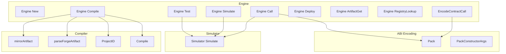

# Tachyon Runtime - Compiler, ABI Encoding, Execution Engine, and Simulation Flows

## Overview

This section covers the part of Tachyon that turns Solidity source, ABI metadata, and JSON arguments into executable contract interactions. The runtime lets callers compile contracts, normalize Foundry artifacts, encode calldata from ABI definitions, run dry simulations, and execute engine verbs through a single `Engine` surface.

The user-facing result is a build-and-execute toolchain with three core properties: compiled artifacts are normalized into a stable shape, ABI packing accepts JSON-decoded inputs and coerces them into the exact Go types expected by go-ethereum, and simulation always runs as a bounded dry-run that can return revert data and gas estimates without broadcasting.

## Scope Sources

### Runtime sources in scope

| Path | Responsibility |
| --- | --- |
| `tachyon/internal/abienc/abienc.go` | ABI packs method calls and constructor arguments, coerces JSON-decoded values into exact ABI Go types, and exposes `Pack` and `PackConstructorArgs`. |
| `tachyon/internal/abienc/abienc_test.go` | Verifies address, integer, bytes, array, tuple, raw JSON, constructor, and error-path packing behavior. |
| `tachyon/internal/compiler/compiler.go` | Wraps `forge build`, derives stable project IDs, normalizes Foundry artifacts, and optionally mirrors artifacts to a local directory. |
| `tachyon/internal/compiler/compiler_test.go` | Smoke-tests compilation against the repository root and target filtering. |
| `tachyon/internal/engine/engine.go` | Wires compiler, tester, simulator, deployer, wallet gate, chain manager, and registry into a single verb dispatcher. |
| `tachyon/internal/engine/engine_test.go` | Verifies `EncodeContractCall` selector handling and unknown-method failures. |
| `tachyon/internal/engine/engine_anvil_test.go` | Exercises a live deploy, broadcast call, and simulated readback against Anvil. |
| `tachyon/internal/engine/engine_sources_test.go` | Exercises uploaded-source compilation, deterministic project IDs, and artifact lookup by derived ID. |
| `tachyon/internal/engine/engine_sources_oz_test.go` | Exercises uploaded-source compilation and testing with linked `@openzeppelin/contracts/` and `layerx/contracts/lib/forge-std/src/Test.sol` corpora. |
| `tachyon/internal/simulate/simulate.go` | Runs `eth_call` dry runs with timeout, gas estimation, optional trace capture, and revert capture. |
| `tachyon/pkg/types/simulate.go` | Defines the request and response DTOs used by simulation. |

### Documentation sources in scope

| Path | Responsibility |
| --- | --- |
| `docs/tachyon-docs/abi-encoder.md` | Authoring doc for JSON-to-ABI coercion rules, integer handling, arrays, bytes, and error behavior. |
| `docs/tachyon-docs/compiler.md` | Authoring doc for Forge-backed compilation, artifact normalization, and compiler modification guidance. |
| `docs/tachyon-docs/engine.md` | Authoring doc for engine verb dispatch, source uploads, deterministic project IDs, and compile/test behavior. |
| `docs/tachyon-docs/simulate.md` | Authoring doc for dry-run semantics, timeout, revert capture, trace capture, and chain resolution. |
| `docs/.web/src/content/tachyon-docs/compiler.md` | Web content mirror of the compiler documentation. |
| `docs/.web/src/content/tachyon-docs/engine.md` | Web content mirror of the engine documentation. |
| `docs/.web/src/content/tachyon-docs/simulate.md` | Web content mirror of the simulation documentation. |

## Architecture Overview

## ABI Encoding

### `tachyon/internal/abienc/abienc.go`

This package is the calldata bridge between JSON-shaped arguments and the exact Go values expected by go-ethereum’s ABI packer. It accepts method calls and constructor arguments, coerces each value according to the ABI definition, and returns raw encoded bytes.

#### Public functions

| Function | Description |
| --- | --- |
| `Pack` | Parses the ABI JSON, looks up the named method, coerces the provided arguments, and returns selector-prefixed calldata. |
| `PackConstructorArgs` | Parses the ABI JSON, coerces constructor arguments, and returns constructor payload bytes without a selector. |

#### Encoding pipeline

| Helper | Role |
| --- | --- |
| `coerceArgs` | Normalizes the incoming argument list, checks argument count, and coerces each entry against the corresponding ABI input. |
| `toList` | Accepts `nil`, `[]interface{}`, `json.RawMessage`, or any JSON-array-serializable value and normalizes it into a list. |
| `coerce` | Dispatches by ABI type kind to the correct coercion branch. |
| `coerceInteger` | Converts numeric JSON values into exact integer Go types, including `*big.Int` for wide integers. |
| `toBigInt` | Parses decimal strings, `0x` hex strings, JSON numbers, or an existing `*big.Int`. |
| `hexToBytes` | Decodes hex strings into raw bytes. |
| `coerceFixedBytes` | Builds exact-length fixed byte arrays for `bytesN`, `bytes32`, and `hash`-shaped values. |
| `coerceArrayLike` | Builds Go slices or fixed arrays for ABI slice and array inputs. |
| `coerceTuple` | Builds tuple structs from either ordered arrays or objects keyed by Solidity field names. |

#### Type coercion rules

| ABI input kind | Accepted JSON shape | Go output shape |
| --- | --- | --- |
| `int` and `uint` | Decimal string, `0x` hex string, JSON number, or `*big.Int`-compatible value | `int8`, `int16`, `int32`, `int64`, `uint8`, `uint16`, `uint32`, `uint64`, or `*big.Int` depending on width |
| `bool` | Boolean | `bool` |
| `string` | String | `string` |
| `address` | Hex address string | `common.Address` |
| `bytes` | Hex string | `[]byte` |
| `bytesN` and `hash` | Hex string with exact length | Fixed byte array |
| `slice` and `array` | JSON array | Go slice or fixed array of coerced elements |
| `tuple` | JSON array or object keyed by Solidity field names | Tuple struct |

#### Error behavior

The encoder validates structure only enough to perform coercion. If coercion fails, the error is annotated with argument position and ABI type, for example `arg %d (%s): `. It also surfaces method lookup failures, argument-count mismatches, invalid addresses, invalid hex bytes, and unsupported ABI kinds.

### `tachyon/internal/abienc/abienc_test.go`

The tests exercise the exact coercion paths used by the encoder:

- `TestPackAddressUint256` checks address and wide integer packing.
- `TestPackHexUint` checks hex integer parsing.
- `TestPackBoolStringBytes` checks boolean, string, and dynamic bytes packing.
- `TestPackFixedBytes32` checks fixed-length byte array packing.
- `TestPackUint8` checks small integer coercion from a JSON number.
- `TestPackArrays` checks dynamic arrays of addresses and integers.
- `TestPackTupleByArray` checks tuple packing from an ordered JSON array.
- `TestPackTupleByObject` checks tuple packing from a JSON object keyed by Solidity field names.
- `TestPackArgCountMismatch` checks argument-count validation.
- `TestPackInvalidAddress` checks address validation.
- `TestPackUnknownMethod` checks ABI method lookup failure.
- `TestPackRawMessageArgs` checks `json.RawMessage` input normalization.
- `TestPackConstructorArgs` checks constructor argument packing.
- `TestPackConstructorNoArgs` checks the zero-argument constructor case.

## Compiler

### `tachyon/internal/compiler/compiler.go`

The tests decode encoded calldata back into ABI values for assertions, so they verify both the packing path and the resulting wire shape.

The compiler is a Forge-backed artifact pipeline. It shells out to `forge build`, normalizes the emitted per-contract JSON artifacts, derives a stable project identifier, and optionally mirrors normalized artifacts into a local directory.

#### Struct

| Property | Type | Description |
| --- | --- | --- |
| `ForgePath` | `string` | Path to the Forge executable used by the subprocess runner. |
| `ArtifactsDir` | `string` | Destination directory for mirrored normalized artifact JSON. |

#### Public functions and methods

| Method | Description |
| --- | --- |
| `ProjectID` | Derives a stable identifier from the project root by hashing the root path and returning the first 8 bytes as hex. |
| `Compile` | Runs `forge build`, normalizes artifacts from `out/`, records them in the registry, and returns the compile response. |

#### Artifact normalization flow

| Step | Behavior |
| --- | --- |
| Root resolution | `Compile` trims `req.ProjectRoot`, resolves it to an absolute path, and fails fast if the root is empty or invalid. |
| Project identity | If `req.ProjectID` is blank, `ProjectID` is derived from the resolved root. |
| Forge invocation | `Compile` runs `forge build --skip test` through the timeout wrapper with a 15-minute limit. |
| Failure mapping | Build failures become `CodeCompilerForgeFailed` unless the captured output mentions `solc`, in which case the error becomes `CodeCompilerSolcFailed`. |
| Artifact discovery | `collectArtifacts` walks `out/<ContractName>/` and loads every `.json` artifact except `.metadata.json`. |
| Target filtering | When `req.Targets` is provided, only matching artifact names are retained. |
| Registry indexing | Each normalized artifact is stored as a `registry.ArtifactRecord` when a registry is present. |
| Local mirroring | When `ArtifactsDir` is set, each artifact is written as formatted JSON under that directory. |

#### Normalized artifact shape

| Field | Source |
| --- | --- |
| `Name` | Artifact name derived from the JSON filename. |
| `Path` | Relative path built from the source file name, normalized under `contracts/` when needed. |
| `ABI` | Raw ABI JSON from the Forge artifact. |
| `Bytecode` | `bytecode.object` from the Forge artifact. |
| `DeployedBytecode` | `deployedBytecode.object` from the Forge artifact. |
| `Compiler` | Parsed compiler metadata when Forge emits a versioned metadata payload. |

#### Internal Forge artifact input

| Field | Type | Description |
| --- | --- | --- |
| `ABI` | `json.RawMessage` | Raw ABI payload from the Forge artifact JSON. |
| `Bytecode.Object` | `string` | Creation bytecode emitted by Forge. |
| `DeployedBytecode.Object` | `string` | Runtime bytecode emitted by Forge. |
| `Metadata` | `json.RawMessage` | Compiler metadata used to reconstruct compiler settings. |

#### Metadata extraction

- `Version`
- `Optimizer.Enabled`
- `Optimizer.Runs`

That reconstructed compiler block is attached to the normalized artifact so callers can inspect the compiler version and optimization settings that produced the artifact.

#### Error handling

If artifact collection fails, `Compile` returns an internal error. If artifact parsing fails for one file, the compiler skips that file and continues processing the rest of `out/`. This makes the compile path tolerant of partial artifact sets while still surfacing subprocess failures immediately.

### `tachyon/internal/compiler/compiler_test.go`

`TestCompileCreate2` runs a real compile against the repository root, opens a temporary registry, and checks that:

- compilation succeeds with a Forge path of `forge`
- the returned artifact list is non-empty
- the `Create2` artifact is present in the response

This test validates both the build path and the target filter behavior.

### Documentation mirrors for the compiler

| Path | What it documents |
| --- | --- |
| `docs/tachyon-docs/compiler.md` | Forge as the backend, artifact normalization, compilation flow, and modification guidance for the compiler. |
| `docs/.web/src/content/tachyon-docs/compiler.md` | Web-facing mirror of the same compiler guidance for the docs site. |

## Execution Engine

### `tachyon/internal/engine/engine.go`

`Engine` is the single runtime surface that wires Tachyon verbs together. It combines compiler, tester, simulator, deployer, wallet gate, chain manager, and registry access into a flat struct so each verb is a concrete method with a concrete request and response type.

#### Struct

| Property | Type | Description |
| --- | --- | --- |
| `Cfg` | `config.Config` | Engine configuration used for root paths, registry location, chains, and wallet wiring. |
| `Reg` | `*registry.Registry` | Registry used for artifact and deployment lookup and updates. |
| `Chains` | `*chains.Manager` | Chain resolver and chain list manager. |
| `Compiler` | `*compiler.Compiler` | Forge-backed compiler wrapper. |
| `Tester` | `*tester.Tester` | Forge test runner wrapper. |
| `Simulator` | `*simulate.Simulator` | Dry-run execution engine. |
| `Deployer` | `*deployer.Deployer` | Deployment orchestration surface. |
| `Wallet` | `*wallet.Gate` | Wallet authorization and signing gate. |

#### Constructor wiring

| Type | Description |
| --- | --- |
| `config.Config` | Supplies `ProjectRoot`, `RegistryPath`, `ArtifactsDir`, `ForgePath`, `Chains`, and wallet configuration. |
| `registry.Open` | Opens the registry file at an absolute path derived from the configured registry path. |
| `chains.New` | Creates the chain manager from the preset chain definitions. |
| `wallet.NewGate` | Builds the wallet gate from the configuration. |
| `compiler.Compiler` | Reuses the configured Forge path and artifacts directory. |
| `tester.Tester` | Reuses the configured Forge path for tests. |
| `simulate.Simulator` | Shares the chain manager with simulation flows. |
| `deployer.Deployer` | Shares the chain manager, registry, wallet gate, and project root with deployment flows. |

#### Public methods

| Method | Description |
| --- | --- |
| `Compile` | Compiles contracts, optionally materializing uploaded sources into an ephemeral workdir, derives a deterministic project ID, and returns a typed compile envelope. |
| `Test` | Runs Forge tests, optionally against uploaded sources in an ephemeral workdir, and returns partial results when the test runner fails after some tests have already executed. |
| `Simulate` | Runs a dry-run simulation through the simulator and returns a typed envelope, preserving revert data when available. |
| `Deploy` | Delegates deployment to the deployer and returns a typed envelope. |
| `Call` | Resolves calldata from ABI and arguments or accepts raw hex calldata, then either simulates or broadcasts the call. |
| `ChainList` | Returns the list of chain profiles with the active chain applied. |
| `ChainRegister` | Adds a custom chain profile. |
| `ChainUse` | Sets the active chain after verifying that the chain exists. |
| `ArtifactGet` | Loads a cached artifact by project ID and artifact name. |
| `RegistryLookup` | Looks up a deployment by idempotency key and chain ID. |
| `Health` | Returns the daemon health payload with version, Forge version, chain IDs, and project root. |

#### Helper function

| Function | Description |
| --- | --- |
| `EncodeContractCall` | Packs an ABI method and arguments into `0x` prefixed calldata for agent use. |

#### Compile flow

`Engine.Compile` has two paths:

- If `req.Sources` is non-empty, it materializes the uploaded source set into an ephemeral Foundry project, derives a deterministic `ProjectID` from the source set, and then compiles from that temporary root.
- If `req.Sources` is empty, it falls back to the configured project root or an explicit request root.

The uploaded-source path is the distinctive runtime behavior of this section. The docs describe it as writing uploaded files into a temp directory, linking the baked dependency tree, generating Foundry config when needed, hashing the source set into a deterministic project ID, and cleaning up afterward.

#### Test flow

`Engine.Test` mirrors the compile path for uploaded sources. It uses the same ephemeral workdir logic when `req.Sources` is present, then delegates to the tester. When the test runner fails after already producing pass or fail counts, the engine returns a failure envelope with partial data preserved.

#### Call flow

`Engine.Call` resolves calldata in two different ways:

- If `req.Method` is set, it resolves ABI JSON from either `req.ABI` or a registry artifact, then packs `req.Args` with `Pack`.
- If `req.Method` is empty, it decodes `req.Data` as hex calldata.

After calldata resolution:

- if `req.SimulateOnly` is true, the engine forwards the call to `Simulator.Simulate` and returns the simulation result and revert data
- otherwise it requires a configured wallet, resolves the chain, dials the EVM client, parses the wei value, authorizes the wallet gate, signs the transaction, and broadcasts raw transaction bytes when available

#### ABI resolution for calls

`resolveABI` prefers inline ABI JSON when `req.ABI` is non-empty and not `null`. Otherwise it requires `req.Contract`, derives a project ID from the current project root when one is not provided, and loads the artifact ABI from the registry. If the artifact is missing, it returns `CodeArtifactNotFound`.

#### Chain-related verbs

The chain verbs are present on the same engine surface, but they remain thin:

- `ChainList` exposes the active chain-aware list from the chain manager.
- `ChainRegister` inserts a new chain profile.
- `ChainUse` validates the requested chain before switching the active chain in the registry.

#### Health payload

`Health` returns:

- `Version` from the engine package
- the supplied Forge version string
- the current list of available chain IDs
- the configured project root

### `tachyon/internal/engine/engine_test.go`

`TestEncodeContractCall` verifies that `EncodeContractCall`:

- returns a calldata string with the canonical `transfer(address,uint256)` selector
- produces the expected calldata length for two 32-byte ABI words

`TestEncodeContractCallUnknownMethod` verifies that an unknown ABI method returns an error.

### `tachyon/internal/engine/engine_anvil_test.go`

This integration test exercises the live broadcast path against a local Anvil node:

1. Start Anvil on a reserved local port.
2. Build a Tachyon engine configured with a self-hosted raw wallet.
3. Inject a precompiled `Box` artifact into the registry.
4. Call `Deploy` and verify the returned contract address and transaction hash.
5. Call `Call` with `Method: "store"` to broadcast a state-changing transaction.
6. Call `Call` again with `SimulateOnly: true` and `Method: "retrieve"` until the stored value is observed.

The helper functions are:

- `freePort`, which reserves and returns an ephemeral local TCP port
- `waitForRPC`, which blocks until `eth_chainId` responds from the JSON-RPC endpoint

### `tachyon/internal/engine/engine_sources_test.go`

This test validates the uploaded-source compile path with a self-contained contract:

- it creates an engine rooted at a temporary directory
- it compiles a single uploaded source map containing `src/Counter.sol`
- it checks that the returned `ProjectID` matches `sourcesProjectID(sources)`
- it verifies that the `Counter` artifact is present and populated
- it confirms that `ArtifactGet` can resolve the artifact by the derived project ID

### `tachyon/internal/engine/engine_sources_oz_test.go`

This test validates the shared-box uploaded-source path with external imports:

- `ozTokenSource` imports `@openzeppelin/contracts/token/ERC20/ERC20.sol`
- `ozTokenTest` imports `layerx/contracts/lib/forge-std/src/Test.sol` and the uploaded token contract
- the engine compiles the uploaded source set
- the engine runs the uploaded test suite
- the test asserts that `test_Supply` passes and that there are no failures

This is the clearest runtime proof that uploaded-source workdirs can resolve the linked dependency corpus and the test remapping at the same time.

### Documentation mirrors for the engine

| Path | What it documents |
| --- | --- |
| `docs/tachyon-docs/engine.md` | Flat verb dispatch, source-upload workdir behavior, deterministic project IDs, conservative EVM defaults, and verb summaries. |
| `docs/.web/src/content/tachyon-docs/engine.md` | Web-facing mirror of the engine documentation. |

## Simulation

### `tachyon/internal/simulate/simulate.go`

The simulator performs `eth_call` dry runs without broadcasting. It is the execution engine for read-only simulation, and the engine uses it directly for `Simulate` and for the simulation-only branch of `Call`.

#### Struct

| Property | Type | Description |
| --- | --- | --- |
| `Chains` | `*chains.Manager` | Chain resolver used to map chain ID, RPC URL, and active chain into a concrete chain profile. |

#### Public method

| Method | Description |
| --- | --- |
| `Simulate` | Runs `eth_call`, estimates gas, optionally captures a debug trace, and returns a simulation response or a simulation failure error. |

#### Request and response shapes

##### `SimulateRequest`

| Property | Type | Notes |
| --- | --- | --- |
| `ChainID` | `string` | Optional chain identifier override. |
| `RPCURL` | `string` | Optional inline RPC URL override. |
| `From` | `string` | Sender address used for the call. |
| `To` | `string` | Required target address. |
| `Data` | `string` | Calldata or raw input payload. |
| `Value` | `string` | Wei value passed to the call. |
| `Block` | `string` | Optional block reference. |
| `Trace` | `bool` | Enables optional debug trace capture. |

##### `SimulateResponse`

| Property | Type | Notes |
| --- | --- | --- |
| `Result` | `string` | Hex-encoded call result. |
| `GasEstimate` | `uint64` | Estimated gas from a separate gas estimation call. |
| `Revert` | `string` | Captures the revert message when the call fails. |
| `Trace` | `any` | Raw trace JSON when tracing succeeds. |

#### Simulation flow

`Simulate` performs the following steps:

1. Require `To`; empty targets fail as invalid input.
2. Resolve the chain using `ChainID`, `RPCURL`, and the active chain fallback.
3. Dial the EVM client for the resolved chain.
4. Create a 30-second timeout context, using `context.Background()` when the incoming context is nil.
5. Run the dry `eth_call`.
6. Run gas estimation separately and keep the estimate even if the call reverts.
7. On success, hex-encode the result into `Result`.
8. When `Trace` is true, run the trace call and attach the raw trace JSON when tracing succeeds.
9. On revert, populate `Revert` and return `CodeSimulateFailed`.

#### Error handling

A simulation failure returns both the revert string and a typed error when the dry call itself fails. Trace failures are intentionally non-fatal; they do not replace the primary call result.

### `tachyon/pkg/types/simulate.go`

This file defines the data contract used by the simulator and the engine.

#### `SimulateRequest`

| Property | Type |
| --- | --- |
| `ChainID` | `string` |
| `RPCURL` | `string` |
| `From` | `string` |
| `To` | `string` |
| `Data` | `string` |
| `Value` | `string` |
| `Block` | `string` |
| `Trace` | `bool` |

#### `SimulateResponse`

| Property | Type |
| --- | --- |
| `Result` | `string` |
| `GasEstimate` | `uint64` |
| `Revert` | `string` |
| `Trace` | `any` |

### Simulation documentation

| Path | What it documents |
| --- | --- |
| `docs/tachyon-docs/simulate.md` | Dry-run semantics, no-wallet behavior, timeout bounds, revert capture, optional trace capture, and chain resolution. |
| `docs/.web/src/content/tachyon-docs/simulate.md` | Web-facing mirror of the simulation documentation. |

## Flow Summary

### Uploaded source compile

1. `Engine.Compile` receives `types.CompileRequest`.
2. When `Sources` is present, the engine materializes an ephemeral workdir and assigns a deterministic `ProjectID`.
3. `Compiler.Compile` runs `forge build --skip test`.
4. `collectArtifacts` walks `out/`, filters target names when requested, and parses each artifact.
5. `parseForgeArtifact` normalizes ABI, bytecode, deployed bytecode, and compiler metadata.
6. The compile response returns the project ID, normalized artifacts, and warnings.

### Dry simulation

1. `Engine.Simulate` receives `types.SimulateRequest`.
2. The engine forwards the request to `Simulator.Simulate`.
3. `Simulator.Simulate` resolves the chain, dials the EVM client, and runs the dry call.
4. Gas estimation is collected separately.
5. A successful call returns hex-encoded result bytes; a revert returns the revert message and `CodeSimulateFailed`.
6. Optional trace capture attaches raw JSON when tracing succeeds.

### ABI-encoded contract call

1. `Engine.Call` receives a target, optional method, and either ABI or raw calldata.
2. `resolveABI` selects inline ABI JSON or loads the ABI from a registry artifact.
3. `Pack` converts JSON arguments into exact ABI Go types and encodes calldata.
4. `SimulateOnly` routes the encoded call to `Simulator.Simulate`.
5. Broadcast mode requires a configured wallet, a resolved chain, and a signed transaction.

## Error Handling

The runtime uses typed errors for the main failure classes:

- invalid request input
- compiler subprocess failure
- compiler `solc` failure
- artifact not found
- chain resolution or RPC failure
- simulation failure
- wallet not configured
- call failure

The compiler also attaches trimmed `stdout` and `stderr` output to Forge failures, which makes subprocess failures easier to inspect without inspecting the raw process directly.