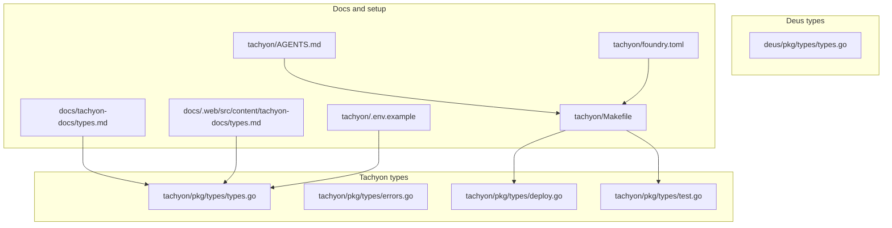

# Tachyon Runtime Shared Types, Errors, Deployment Types, and Module Setup

## Overview

This section defines the shared payloads and support files that keep the Tachyon runtime consistent across requests, tests, deployment inputs, and health/error handling. The package-level types are intentionally small: they standardize how success and failure are wrapped, how deployments are described, and how Forge-based test runs are reported.

The same contract is documented in two mirrored markdown files, while the repository-level environment example, agent guide, Makefile, and Foundry configuration describe how to build and exercise the runtime locally. `deus/pkg/types/types.go` adds the companion wire types used by Deus discovery and health responses.

## Surface Map



## Shared Tachyon Types

### `tachyon/pkg/types/types.go`

*`tachyon/pkg/types/types.go`*

This file defines the shared JSON wrapper used by the runtime and the small health payload that callers receive from the health check path. It also standardizes the error payload shape used by `NewError`, `OK`, and `Fail`.

#### `Envelope[T any]`

| Property | Type | Notes |
| --- | --- | --- |
| `Ok` | `bool` | Marks success or failure. |
| `Data` | `T` | Omitted from JSON when empty. |
| `Error` | `*Error` | Omitted from JSON on success. |


#### `Error`

| Property | Type | Notes |
| --- | --- | --- |
| `Code` | `string` | Machine-stable error code. |
| `Message` | `string` | Human-readable error message. |
| `Retry` | `bool` | Signals whether a caller may retry. |
| `Details` | `any` | Optional structured details; omitted when empty. |


#### `HealthData`

| Property | Type | Notes |
| --- | --- | --- |
| `Version` | `string` | Runtime version string. |
| `Forge` | `string` | Forge version or path; omitted when empty. |
| `Chains` | `[]string` | Chain identifiers reported by the runtime. |
| `Project` | `string` | Project root reported by the runtime. |


### `tachyon/pkg/types/errors.go`

*`tachyon/pkg/types/errors.go`*

This file defines the stable error-code vocabulary and the small helper constructors that package the shared `Envelope[T]` and `Error` values consistently.

#### Stable error codes

| Constant | Value |
| --- | --- |
| `CodeCompilerForgeFailed` | `COMPILER_FORGE_FAILED` |
| `CodeCompilerSolcFailed` | `COMPILER_SOLC_FAILED` |
| `CodeTestForgeFailed` | `TEST_FORGE_FAILED` |
| `CodeTestAssertionFailed` | `TEST_ASSERTION_FAILED` |
| `CodeChainNotFound` | `CHAIN_NOT_FOUND` |
| `CodeChainRPCFailed` | `CHAIN_RPC_FAILED` |
| `CodeSimulateFailed` | `SIMULATE_FAILED` |
| `CodeDeployFailed` | `DEPLOY_FAILED` |
| `CodeDeployIdempotent` | `DEPLOY_IDEMPOTENT_HIT` |
| `CodeCallFailed` | `CALL_FAILED` |
| `CodeArtifactNotFound` | `ARTIFACT_NOT_FOUND` |
| `CodeRegistryNotFound` | `REGISTRY_NOT_FOUND` |
| `CodeWalletDenied` | `WALLET_POLICY_DENIED` |
| `CodeWalletNotConfigured` | `WALLET_NOT_CONFIGURED` |
| `CodeInvalidRequest` | `INVALID_REQUEST` |
| `CodeInternal` | `INTERNAL_ERROR` |


#### Helpers and methods

| Method | Description |
| --- | --- |
| `NewError` | Builds a typed `Error` with `Code`, `Message`, `Retry`, and `Details`. |
| `OK` | Wraps success data in `Envelope[T]` with `Ok: true`. |
| `Fail` | Wraps an `*Error` in `Envelope[T]` with `Ok: false`. |
| `Error` | Returns an empty string for a nil receiver, otherwise formats `Code: Message`. |


### `tachyon/pkg/types/deploy.go`

NewError, OK, and Fail are the only helper constructors in this file, and they keep the error payload shape aligned with the shared envelope.

*`tachyon/pkg/types/deploy.go`*

This file models intent-based deployment input and the corresponding deployment result. It also carries the optional `Create2Config` block for deployments that need deterministic address derivation.

#### `Create2Config`

| Property | Type | Notes |
| --- | --- | --- |
| `Salt` | `string` | CREATE2 salt value. |
| `Deployer` | `string` | CREATE2 deployer address. |


#### `DeployRequest`

| Property | Type | Notes |
| --- | --- | --- |
| `Intent` | `string` | Optional intent label. |
| `IdempotencyKey` | `string` | Idempotency key for the request. |
| `ChainID` | `string` | Target chain identifier. |
| `ProjectID` | `string` | Optional project identifier. |
| `Contract` | `string` | Contract name or identifier. |
| `ConstructorArgs` | `json.RawMessage` | Raw JSON constructor arguments. |
| `Create2` | `*Create2Config` | Optional CREATE2 parameters. |
| `From` | `string` | Optional sender address. |
| `CapabilityToken` | `string` | Optional capability token. |
| `SpendCapWei` | `string` | Optional spend cap in wei. |
| `WalletToken` | `string` | Forwarded embedded-wallet bearer token. |


#### `DeployResponse`

| Property | Type | Notes |
| --- | --- | --- |
| `Address` | `string` | Deployed contract address. |
| `TxHash` | `string` | Optional transaction hash. |
| `IdempotencyKey` | `string` | Echoes the request key. |
| `ChainID` | `string` | Chain identifier used for deployment. |
| `Contract` | `string` | Contract identifier deployed. |
| `Existing` | `bool` | Marks an existing deployment hit. |


### `tachyon/pkg/types/test.go`

*`tachyon/pkg/types/test.go`*

This file carries the Forge test input and output shapes. The request can be self-contained by supplying sources, and the response groups per-file test cases into suites.

#### `TestRequest`

| Property | Type | Notes |
| --- | --- | --- |
| `ProjectRoot` | `string` | Optional project root override. |
| `Sources` | `map[string]string` | Workdir-relative path to source content. |
| `MatchPath` | `string` | Optional path filter. |
| `MatchContract` | `string` | Optional contract filter. |
| `Filter` | `string` | Optional Forge filter string. |
| `EVMVersion` | `string` | Optional EVM target pin; defaults to the conservative engine default when empty. |


#### `TestCaseResult`

| Property | Type | Notes |
| --- | --- | --- |
| `Name` | `string` | Test case name. |
| `Status` | `string` | Test outcome status. |
| `Reason` | `string` | Optional failure reason. |
| `Gas` | `uint64` | Optional gas usage. |
| `Duration` | `string` | Optional duration string. |


#### `TestSuiteResult`

| Property | Type | Notes |
| --- | --- | --- |
| `File` | `string` | `.t.sol` file path. |
| `Passed` | `int` | Passed test count. |
| `Failed` | `int` | Failed test count. |
| `Skipped` | `int` | Skipped test count. |
| `Cases` | `[]TestCaseResult` | Individual case outcomes. |


#### `TestResponse`

| Property | Type | Notes |
| --- | --- | --- |
| `Suites` | `[]TestSuiteResult` | Suite-level results. |
| `Passed` | `int` | Total passed count. |
| `Failed` | `int` | Total failed count. |


## Shared Deus Types

### `deus/pkg/types/types.go`

*`deus/pkg/types/types.go`*

This file defines the shared listing, health, and error envelope types used by Deus wire responses. The `ServiceSummary` shape is the compact listing form, while `HealthResponse` and the error wrappers provide the minimal runtime and failure payloads.

#### `ServiceStatus`

| Constant | Value |
| --- | --- |
| `StatusDraft` | `draft` |
| `StatusActive` | `active` |
| `StatusPaused` | `paused` |
| `StatusDelisted` | `delisted` |


#### `ServiceSummary`

| Property | Type | Notes |
| --- | --- | --- |
| `ID` | `string` | Service identifier. |
| `Slug` | `string` | URL-safe slug. |
| `Kind` | `string` | Service kind. |
| `Mode` | `string` | Service mode. |
| `DisplayName` | `string` | Human-readable name. |
| `Summary` | `string` | Short summary text. |
| `Status` | `ServiceStatus` | Listing lifecycle state. |
| `QualityScore` | `string` | Optional quality score; omitted when empty. |
| `ManifestHash` | `string` | Manifest hash used by discovery responses. |


#### `HealthResponse`

| Property | Type | Notes |
| --- | --- | --- |
| `OK` | `bool` | Overall health flag. |
| `Postgres` | `bool` | Database health flag. |
| `Chain` | `bool` | Chain connectivity flag. |
| `Version` | `string` | Service version string. |


#### `ErrorEnvelope`

| Property | Type | Notes |
| --- | --- | --- |
| `Error` | `ErrorBody` | Nested error payload. |


#### `ErrorBody`

| Property | Type | Notes |
| --- | --- | --- |
| `Code` | `string` | Stable error code. |
| `Message` | `string` | Human-readable message. |


## Documentation Mirrors

### `docs/tachyon-docs/types.md`

*`docs/tachyon-docs/types.md`*

This markdown file documents the shared `pkg/types` contract for Tachyon. It describes the generic `Envelope[T]`, the stable error codes, the helper constructors `OK`, `Fail`, and `NewError`, and the file-by-file split used by the package.

### `docs/.web/src/content/tachyon-docs/types.md`

*`docs/.web/src/content/tachyon-docs/types.md`*

This file mirrors the same Tachyon type documentation for the web content source tree. Its content matches the canonical markdown doc and carries the same contract description, error-code list, helper constructors, and modification guidance.

| Path | Role | What it documents |
| --- | --- | --- |
| `docs/tachyon-docs/types.md` | Canonical docs page | Shared envelope, error codes, helper constructors, and domain layout guidance. |
| `docs/.web/src/content/tachyon-docs/types.md` | Web content mirror | Same documentation content for the docs web app. |


## Module-Level Setup

### `tachyon/.env.example`

*`tachyon/.env.example`*

This file documents the environment-variable overrides for the Tachyon runtime configuration. It makes the precedence clear: environment variables override `tachyon.config.kvx`, and the file groups runtime, auth, and wallet-related overrides in one place.

| Key | Purpose | Notes |
| --- | --- | --- |
| `TACHYON_CONFIG` | Selects the kvx config file | Defaults to `tachyon.config.kvx`. |
| `TACHYON_API_ADDR` | API listen address | Defaults to `:8645`. |
| `TACHYON_PROJECT_ROOT` | Project root override | Empty by default. |
| `TACHYON_ARTIFACTS_DIR` | Artifacts directory override | Defaults to `artifacts`. |
| `TACHYON_REGISTRY_PATH` | Registry file override | Defaults to `registry.json`. |
| `TACHYON_FORGE_PATH` | Forge binary path override | Defaults to `forge`. |
| `TACHYON_SOLC_PATH` | solc path override | Empty by default. |
| `PAXEER_RPC_URL` | Embedded wallet RPC URL | Empty by default. |
| `TACHYON_AUTH_TOKEN` | [REDACTED] | When set, requests must send an Authorization bearer token. |
| `TACHYON_WALLET_MODE` | Wallet mode | `self_hosted` or `embedded`. |
| `TACHYON_WALLET_SIGNER` | Self-hosted signer selection | `raw`, `keystore`, or `env`. |
| `TACHYON_DEV_PRIVATE_KEY` | Development private key | Comment warns not to commit real keys. |
| `TACHYON_KEYSTORE_PATH` | Keystore path | Used for self-hosted keystore mode. |
| `TACHYON_KEYSTORE_PASSWORD` | Keystore password | Used for self-hosted keystore mode. |
| `MATRIX_EXECUTOR_KEY` | Embedded wallet lane key | No local keys in embedded mode. |
| `PAXEER_WALLET_API` | Wallet API endpoint | Used in embedded wallet mode. |


### `tachyon/AGENTS.md`

*`tachyon/AGENTS.md`*

This guide captures the expected local workflow for working on Tachyon from the agent side. It covers Foundry installation, build and check commands, the daemon startup command, Forge test preparation, and the MCP stdio behavior that clients need to respect.

```steps
1. Install Foundry | Run `curl -L https://foundry.paradigm.xyz | bash && foundryup`.
2. Add Foundry to PATH | Ensure `~/.foundry/bin` is on `PATH`.
3. Build the runtime | Run `make deps && make build`.
4. Run the local gate | Run `make ci`.
5. Start the daemon | Run `./bin/tachyond`.
6. Check health | Run `curl http://127.0.0.1:8645/healthz`.
7. Install optional Forge test dependencies | Run `make forge-test-deps`.
8. Run the Forge suite | Run `forge test`.
9. Run the end-to-end path | Run `make e2e-all`.
```

MCP stdio logs go to stderr, stdout is NDJSON-RPC only, and clients must not call readline after notifications/*.

The guide also states that the v1 engine exposes compile, test, simulate, deploy, call, chain, artifact, and registry verbs on REST, JSON-RPC, and MCP surfaces.

### `tachyon/Makefile`

*`tachyon/Makefile`*

This Makefile is the local task runner for the Tachyon repository. It defines the build, test, Forge, MCP self-test, and end-to-end smoke commands used by the repository workflows.

#### Core variables

| Variable | Value | Purpose |
| --- | --- | --- |
| `SHELL` | `/usr/bin/env bash` | Uses Bash for every recipe. |
| `.SHELLFLAGS` | `-eu -o pipefail -c` | Fails fast on unset variables and pipeline errors. |
| `.DEFAULT_GOAL` | `help` | Prints target help when `make` runs without a target. |
| `GO` | `go` | Go tool used by build and test targets. |
| `BIN_DIR` | repo-local `bin` directory | Build output directory. |
| `FORGE` | `forge` | Foundry command used by Forge targets. |


#### Targets

| Target | Description | Notes |
| --- | --- | --- |
| `help` | Shows available targets. | Uses `grep` and `awk` over the Makefile itself. |
| `deps` | Installs Foundry dependencies. | Depends on `forge-setup`. |
| `forge-setup` | Installs `forge-std` into `lib/`. | Only installs when `lib/forge-std` is missing. |
| `build` | Builds `tachyond` and `tachyon`. | Outputs binaries to `$(BIN_DIR)`. |
| `run` | Runs the daemon in the foreground. | Depends on `build`. |
| `test` | Runs Go unit tests. | Executes `go test ./...`. |
| `forge-build` | Compiles contracts with Forge. | Runs `forge build --skip test`. |
| `forge-test` | Runs Forge tests. | Depends on `forge-test-deps`. |
| `forge-test-deps` | Installs optional OpenZeppelin test helpers. | Installs `a16z/erc4626-tests` and `a16z/halmos-cheatcodes`. |
| `mcp-selftest` | Verifies the MCP tool list. | Runs `tachyond --selftest`. |
| `forge-smoke` | Runs the Create2 Forge smoke test. | Uses `forge test --match-path test/utils/Create2.t.sol`. |
| `e2e` | Runs REST, RPC, and MCP smoke checks. | Expects the daemon to already be running. |
| `e2e-all` | Starts the daemon, runs smoke checks, and stops the daemon. | Uses `/tmp/tachyond-e2e.pid` to track the background process. |
| `ci` | Local CI gate. | Depends on `build`, `test`, `mcp-selftest`, `forge-build`, and `forge-smoke`. |
| `clean` | Removes build artefacts. | Deletes `bin`, `out`, `cache`, and `artifacts`. |


### `tachyon/foundry.toml`

*`tachyon/foundry.toml`*

This Foundry configuration pins the contract source, test, and output layout and sets the compiler and formatter defaults used by the repository’s Forge commands.

#### `profile.default`

| Setting | Value | Notes |
| --- | --- | --- |
| `src` | `contracts` | Contract source root. |
| `test` | `test` | Forge test root. |
| `out` | `out` | Build output directory. |
| `libs` | `["lib"]` | Library directory list. |
| `solc_version` | `0.8.27` | Solidity compiler version. |
| `optimizer` | `true` | Enables optimizer. |
| `optimizer_runs` | `200` | Optimizer run count. |
| `evm_version` | `cancun` | Target EVM version. |


#### `fmt`

| Setting | Value | Notes |
| --- | --- | --- |
| `line_length` | `120` | Formatter line length. |
| `tab_width` | `4` | Formatter tab width. |
| `bracket_spacing` | `true` | Enables bracket spacing. |


## Key Classes Reference

| Type | Location | Responsibility |
| --- | --- | --- |
| `Envelope[T any]` | `tachyon/pkg/types/types.go` | Shared JSON wrapper for success and error payloads. |
| `Error` | `tachyon/pkg/types/types.go` | Machine-stable error payload with retry metadata. |
| `HealthData` | `tachyon/pkg/types/types.go` | Health response payload for runtime status reporting. |
| `Create2Config` | `tachyon/pkg/types/deploy.go` | Optional CREATE2 deployment parameters. |
| `DeployRequest` | `tachyon/pkg/types/deploy.go` | Intent-based deployment input. |
| `DeployResponse` | `tachyon/pkg/types/deploy.go` | Deployment result record. |
| `TestRequest` | `tachyon/pkg/types/test.go` | Forge test input payload. |
| `TestCaseResult` | `tachyon/pkg/types/test.go` | Single Forge test case outcome. |
| `TestSuiteResult` | `tachyon/pkg/types/test.go` | Per-file Forge test aggregation. |
| `TestResponse` | `tachyon/pkg/types/test.go` | Aggregated Forge test response. |
| `ServiceStatus` | `deus/pkg/types/types.go` | Listing lifecycle state used by Deus summaries. |
| `ServiceSummary` | `deus/pkg/types/types.go` | Compact discovery listing view. |
| `HealthResponse` | `deus/pkg/types/types.go` | Deus health payload. |
| `ErrorEnvelope` | `deus/pkg/types/types.go` | Minimal Deus error wrapper. |
| `ErrorBody` | `deus/pkg/types/types.go` | Minimal Deus error body. |
