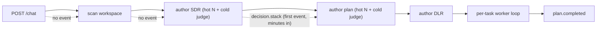
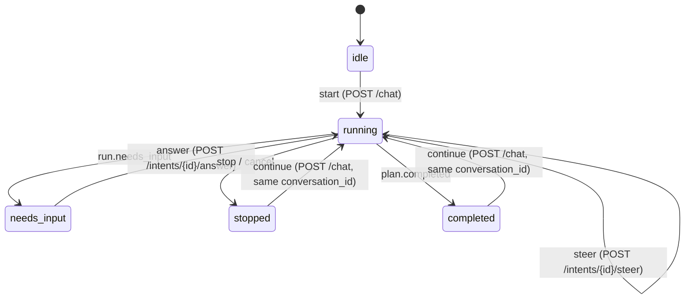

## North star

Cody's engine is strong; its **felt experience** is not. The bar is the smoothness of
Codex, Claude Code, and Cursor — a session where you always know it heard you, you can
see it thinking and working, you can talk to it naturally, and nothing is ever lost — but
rendered in the Matrix idiom (single Paxeer Blue accent, Inter + JetBrains Mono, separation
by background tone only, no borders/emojis/gradients/glow, result over protocol).

This feature is scoped to the three concrete gaps that broke that feel in a real testing
session. It does not re-open any done task in `spec/cody` or `spec/cody-client`; it
complements them. Cody stays signing-keyless and MCL-free, and its durable-plan
determinism is preserved because every new event is a pure publish/Observer side-channel.

## The three gaps (evidence)

1. **Dead-silent work.** `Submit` returns immediately and `drive` runs on a background
   goroutine ([`cody/internal/server/engine.go`](cody/internal/server/engine.go)). The
   FIRST published event is `plan.created` (~L531), but before it the engine runs
   `workspace.LoadOrScan`, `resolveStackDecision` (N divergent candidates hot + cold
   adjudication), `PlanFromModelDivergent`, and `resolveDesignDecision` — each several LLM
   calls, minutes long, emitting nothing. On the client, `beginLive` creates an
   `emptyRun(status:running)` but the Engineer/Architect viewport is blank: in
   [`cody-workspace.tsx`](apps/client/components/matrix/cody/cody-workspace.tsx) `RunView`
   renders the board only once tasks exist and the "Cody is working" fallback only shows
   for non-board tiers. Result: ~10 minutes of nothing, no acknowledgment the prompt landed.

2. **No communication flow.** The only user->Cody inputs are `steer` (running only) and
   `answer` (on a gate). The chat rail textarea is `disabled` unless `run.status ===
   'running'` (`ChatRail` `canSteer`), so an idle/stopped/completed run is a dead end —
   even though the engine's stop/finish copy literally says "say continue when you want me
   to pick it back up" ([`engine.go`](cody/internal/server/engine.go) `finish`/`say`).
   Cody also narrates nothing between milestones.

3. **Nothing persists.** `chat.assistant` and `message.complete` are excluded from the
   durable-trace whitelist ([`cody/internal/server/trace.go`](cody/internal/server/trace.go)
   `traceWorkspaceTypes`), so `buildRunFromTrace` rebuilds a run with `messages: []` — the
   conversation is gone on reopen. History is per-browser `localStorage`
   ([`recent-runs.ts`](apps/client/lib/cody/recent-runs.ts)); `handleConversations` only
   serves `/{id}/trace`, so there is no server-side, cross-device list of work.

## Pillar 1 — Always-live progress spine

**Engine (req 2).** Add two event types on the existing broker
([`sse.go`](cody/internal/server/sse.go), phase `cody`):

- `run.started` — emitted the instant `drive` begins: an immediate acknowledgment.
- `run.activity` — `{phase, label, detail, elapsed_ms}` emitted at every boundary in
  `drive` (`understanding` before `LoadOrScan`; `stack` around `resolveStackDecision`;
  `planning` around `PlanFromModelDivergent`; `design` around `resolveDesignDecision`;
  `previewing` around preview provision) and from the orchestrator `Observer`
  ([`orchestrator.go`](cody/internal/orchestrator/orchestrator.go): `working:<task>` at
  `task.started`, `verifying:<task>` around `adjudicate`). Copy is result-oriented and
  register-aware; no orchestrator/worker/sheet jargon reaches the user.

A bounded, cancel-safe **heartbeat** ticker (req 2.2) emits `run.activity` with the current
phase + elapsed every few seconds during the long generation/worker phases, stopping at the
next boundary or on `ctx` cancel. Emission is pure `broker.publish` — it never touches the
loop, the acceptance gate, or plan determinism.

**Client (req 1).** A new `ActivitySpine` reads `run.activity`: plain-language phase, a
liveness loader, elapsed time, and the latest Cody line. It renders in all tiers (register
copy) and is **never blank while `running`/`needs_input`** — replacing the blank `RunView`
states. The approve->blank bug is fixed by folding `run.answered`/`decision.resolved` into a
`continuing` activity that holds until the next milestone.

## Pillar 2 — Smooth two-way communication

One **context-aware composer** replaces the disabled-when-idle `ChatRail`, as a small state
machine over `run.status`:

Continue reuses the `conversation_id`; the engine resumes the durable plan (`LoadPlan` in
`drive`) at the correct next task — honestly a resume, not a restart. Cody's questions
(needs-input, SDR, DLR, stop-and-ask) surface **inline** in a persistent transcript as
first-class prompts answered in place, in addition to the existing decision cards.

## Pillar 3 — Total persistence

- **Transcript (req 4.1/4.2).** Widen `traceWorkspaceTypes` to persist `chat.assistant`,
  `run.started`, and milestone `run.activity` (heartbeats stay live-only to keep the trace
  bounded under the 2000-event retain cap). Add a new **`chat.user`** event for the
  initiating message, each steer, and each answer, so the durable transcript shows BOTH
  sides on reopen (`steer.folded`/`run.answered` already persist).
- **History (req 4.3).** Add `GET /conversations` in
  [`server.go`](cody/internal/server/server.go) returning the user's runs from the durable
  ledgers (`id`, `title`, `status`, `mode`, `project`, `updated_at`), newest first; add a
  durable `Title` to the `ledger` (first message, trimmed). The client History page reads
  it; `localStorage` becomes a fast-path cache, not the source of truth.
- Workspaces (files) and the project registry are already durable on the volume; unchanged.

## Event family + reducer additions

| Event | Emitted by | Persisted | Reducer effect (`useCody`) |
| --- | --- | --- | --- |
| `run.started` | `drive` (immediately) | yes | seed run + activity `accepted` |
| `run.activity` | `drive` + Observer + heartbeat | milestones only | set `run.activity` |
| `chat.user` | Submit / steer / answer | yes | append user turn to transcript |
| `chat.assistant` | `say` (now persisted) | yes | append Cody turn to transcript |

`CodyRun` gains `activity {phase,label,detail,since}` and an ordered `transcript` (user +
assistant + inline-question turns). `buildRunFromTrace` must equal the live fold across all
of the above (durable == live), keying nothing on wall-clock.

## House rules + Matrix identity

Everything obeys the client house rules already used across `/cody`: separation by
background-tone contrast only (never border strokes), no emojis/purple gradients/glow, a
single Paxeer Blue accent, Inter + JetBrains Mono, and result-over-protocol copy. Tiers
change disclosure and register ONLY — never the underlying run/transcript/activity data
(consistent with `spec/cody-client` req 4.5).

## Non-goals

- **No free-form conversational responder yet.** A genuine "ask Cody anything any time"
  agent loop (Cody replying to arbitrary questions unrelated to the plan) is deferred; the
  context-aware composer (start/steer/answer/continue) plus live narration deliver the
  smooth feel now. Documented as a follow-up.
- **No worker token-level streaming.** Workers run in-process and return a report; worker
  liveness is heartbeat-based for v1.
- **No re-opening** `spec/cody` / `spec/cody-client` done tasks; **no MCL/signing path**;
  no change to the acceptance gate, the constitution, or plan determinism.

## Verification (no fakes)

- **Property 1 (reducer).** `buildRunFromTrace` equals the live fold across
  `run.started`/`run.activity` + persisted `chat.assistant`/`chat.user`, including the
  approve->continuing state — real reducer.
- **Property 2 (spine).** The activity spine renders a non-blank live state for each phase
  and each tier and shows `continuing` immediately after an answer.
- **Property 3 (persistence).** A run's transcript + last activity survive a reopen against
  the REAL trace store; `GET /conversations` lists the run from the REAL ledgers.
- **Property 4 (composer).** The context-aware transitions are asserted against the real
  state and `continue` resumes the same durable plan via the real engine resume path.
- **Property 5 (engine).** `run.started` + `run.activity` + heartbeat are emitted on the
  REAL `drive()`/Observer/broker path.

No test substitutes a stub/mock/fake for a real code path or type.
