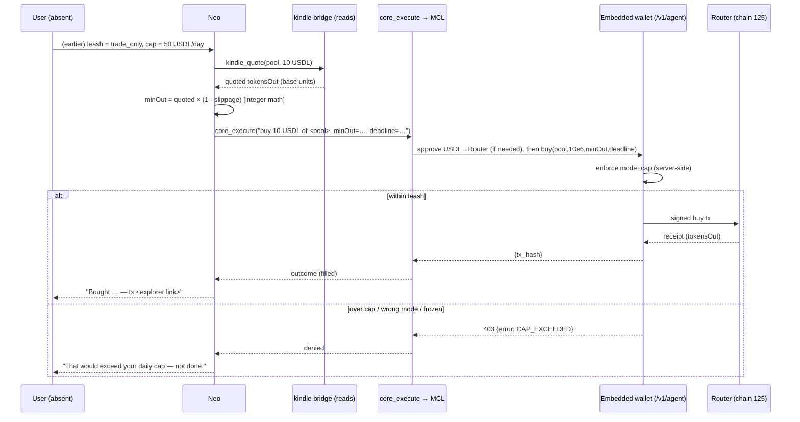

# Design — Neo × KindleLaunch Autonomy

## Overview

This feature gives **Neo** (Matrix's default conversational agent) five new capabilities
on **KindleLaunch** — the Sidiora launchpad on Paxeer Network (EVM chain id **125**):

1. **Launch** a token + market.
2. **Trade** (buy / sell / token-to-token swap).
3. **Watch** — recurring monitoring that triggers an action.
4. **Collect fees** for a pool the user owns.
5. **Create Opticals** — Uniswap-v4-hook-style pool plugins, in two tiers: attach/deploy a
   **preset**, or author + compile + deploy a **custom** one via Tachyon.

The design is overwhelmingly **additive wiring** over substrate that already exists. It introduces
exactly one new MCP bridge (`kindle`), one new skill (`kindle-launchpad`), a Watch procedure built
on the existing chronos daemon, and a documentation change to the approval model in
`neo.frozen.kvx`. It reuses, unchanged, the embedded-wallet write lane, `core_execute` delegation,
the Tachyon toolbox, and chronos.

The defining principle: **"autonomous" never means Neo holds a key.** It means Neo *delegates a
prose intent through MCL*, and the per-user **agent embedded wallet** signs and broadcasts
server-side under a **one-time user-granted leash**. The user is absent and signs nothing per action.

## Hard constraints (apply to every capability)

- **Key-isolation is sacred (frozen `backstop_1`).** Neo holds no signing key. Every value-moving
  KindleLaunch op crosses into MCL via `core_execute`; the embedded wallet — not Neo, not the
  bridge, not MCL — holds the EVM key and signs.
- **Leash, not per-action signing.** The user authorizes once via the embedded-wallet agent leash
  (`mode` ∈ {read_only, trade_only, full} + spend caps). Enforcement is **server-side** on the
  wallet (a `403 {error: CODE}` on the `/v1/agent/*` lane). Matrix never becomes the sole gate.
- **No floats for money.** All amount / price / slippage / fee math is integer base-unit math
  (`big` integers). USDL = 6 decimals; native PAX = 18; launched tokens = 18 unless they report
  otherwise. Never assume a uniform 18.
- **Canonical addresses only.** Bind the **2026-06-20 deployment manifest**
  (`protocol/addresses.go` ≡ `contracts/deployments/paxeer-addresses.json`). Do **not** reuse the
  `paxeer-net` `config.sidioraFun` block — that is a different/older Sidiora.fun deployment.
- **D11 replay byte-identity preserved.** Reads + the Watch loop are pure side-channels (no signing,
  no signed-path cortex writes, no plan/walk mutation). Value-moving ops ride MCL's normal signed
  envelope path and participate in replay like any other monetary action.
- **No fakes.** Verify against real ABIs, real `--selftest` drift, real Tachyon `solc`/`forge`, and
  real read-only simulation. A green test driven by a canned result is not done.
- **Consumer transparency.** Surface deliverables and outcomes in plain language; never show
  protocol jargon, revert selectors, or stack traces.
- **No git / no unsolicited prod deploys.** The user drives commits and prod redeploys.

## Canonical address book (Paxeer mainnet, chain id 125)

Source of truth: the 2026-06-20 manifest. Every value is env-overridable; these are defaults.

| Contract | Address | Role in this feature |
|---|---|---|
| `Router` (proxy) | `0xCC7298801112682e10ee14b8a520309caD80336d` | launch (`createMarket`) + trade (`buy`/`sell`/`swapTokenForToken`) |
| `Quoter` (proxy) | `0xB768e183b6EfDeDf8b2AA7af732039D1C3c452d0` | trade quotes → slippage minimums |
| `FeesRouter` (proxy) | `0x02Df12a44F2658080E76fbcF7D6B34Baa97843b6` | NFT-gated fee actions (`claimFees`/`executeBurn`/…/`setFeeStrategy`) |
| `FeeAccumulator` (proxy) | `0x50C69dF6637b3DCE6a7407C5A4b4F99E68514A76` | fee views (`getAccumulatedFees`, airdrop/LP balances) |
| `PoolRegistry` (proxy) | `0x7684382c89f79104574D8EF9b31eFf2eD2C2BA0b` | pool discovery / metadata |
| `SidioraNFT` (proxy) | `0xDF73b354ed9dcB473cc9D01541c46f507591e190` | pool-ownership NFT (gates fee collection) |
| `SidioraFactory` (proxy) | `0x8a1A09CEe72c1D39dF33B8284E38baeF8371f465` | factory-level market creation |
| `OpticalRegistry` (proxy) | `0x4CdA6e48632d51Ee4Fa735D81BF09F7543f644a1` | optical "verified" trust-signal (admin-gated) |
| `AntiSnipeOptical` | `0x5ed0084Aa348eC45673af22e01CaF2f3500b77b5` | deployed preset (attach at launch) |
| `MaxWalletOptical` | `0x0086B61fAd8fc50b2f81F92337518Ca8b4A7cc01` | deployed preset |
| `TaxOptical` | `0x285411005079AaBB12bb2516bF6578fbfB11Be90` | deployed preset |
| `CooldownOptical` | `0xe7d450534Bc401494075e753Bb142685CF868238` | deployed preset |
| `BuybackBurnOptical` | `0x14ebb4F1e32070085a138296970aB90a4B5E3940` | deployed preset |
| `USDL` (token) | `0x85FcD13735F4309833A503EE804ea32395851479` | quote token, **6 decimals** |
| `SID` (token) | `0x21f7b20a555199fa73A238B1a91FD0f549068fEe` | Sidiora token, 6 decimals |

> **Open item O1 — `LaunchpadOpticalFactory` is NOT in the manifest.** The self-service factory that
> deploys per-creator configured `LaunchpadOptical` instances has no address in the 2026-06-20
> deployment. The five presets above exist only as **deployed singletons** (attachable directly via
> the `optical` param). So the preset *attach* path works today; a preset *deploy-configured-instance*
> path (req.9 ac_3) is contingent on the factory being deployed — otherwise the custom-via-Tachyon
> path covers configured/bespoke opticals. Resolve before P3.

## End-to-end architecture

```
                    ┌─────────────────────────────────────────────────────────┐
USER (one-time      │  Embedded wallet leash (Paxport): mode + spend caps       │
 leash; absent      │  server-side custody + policy enforcement (403 on deny)   │
 thereafter)        └───────────────────────▲─────────────────────────────────┘
   │                                         │ /v1/agent/{auth,send,sign} (ed25519 DID)
   ▼                                         │
┌──────┐  reads (direct, no escalation)   ┌──┴───────────┐
│ NEO  │────────────────────────────────►│ kindle bridge │  reads: pools/market/quote/fees/optical
│      │                                  │  (READS_ONLY  │
│ loop │   value-moving intent (prose)    │   on Neo's    │
│      │──────────► core_execute ─────────┤   surface)    │
└──┬───┘                    │             └──────────────┘
   │                        ▼
   │              ┌───────────────────┐   kindle WRITE tools (launch/trade/fees/optical)
   │              │   MCL pipeline    │──► encode calldata → embedded wallet /v1/agent/send
   │              │  compile→plan→walk│        │
   │              │  signed envelopes │        ├─ Router.createMarket / buy / sell / swap
   │              └───────────────────┘        ├─ FeesRouter.claimFees / executeBurn / …
   │                                           ├─ LaunchpadOpticalFactory.* (if deployed)
   │  Watch: chronos alarm_set(cron/once)      └─ Tachyon compile→test→deploy (custom optical)
   └──► on wake: read state → evaluate trigger → (if met) core_execute the action
```

### Sequence — autonomous trade within a leash



### Sequence — create a custom Optical

```mermaid
sequenceDiagram
    participant U as User
    participant N as Neo
    participant T as Tachyon
    participant W as Embedded wallet
    participant Rt as Router
(
    U->>N: "make an optical that blocks buys over 2% of supply for 1h"
    N->>N: "author BaseOptical-derived .sol (override beforeSwap; getFlags=0b0001)"
    N->>T: tachyon_compile(sources)
    T-->>N: {project_id, abi, bytecode}
    N->>T: tachyon_test(sources)  // real forge
    T-->>N: pass/fail per case
    alt compile+tests green
        N->>T: tachyon_deploy(project_id, contract, chain 125, ctor=[poolRegistry, owner], idempotency_key)
        T->>W: sign+broadcast deploy (agent identity forwarded)
        W-->>T: {address}
        T-->>N: opticalAddr (functional, "unverified" until admin registers)
        opt attach at launch
            N->>Rt: createMarket(name,symbol,feeStrategy, opticalAddr)
        end
        N-->>U: "Deployed your optical at … (works now; shows unverified)."
    else fails
        N-->>U: "Couldn't build it safely — <plain reason>. Not deployed."
    end
```

## The `kindle` MCP bridge

A new stdio bridge at `tools/kindle/kindle.mjs` mirroring the `paxeer-net` wire protocol
(newline-delimited JSON-RPC: `initialize` / `tools/list` / `tools/call`, structured tool errors,
`--selftest` drift guard). It shares the **embedded-wallet write lane** (`tools/paxeer/lib/wallet.mjs`
+ `agentauth.mjs`) so there is exactly one signing path; it carries its own `lib/config.mjs` bound to
the canonical manifest, plus calldata encoders for the Router/FeesRouter/Factory ABIs.

### READS_ONLY split (Neo's surface vs MCL's surface)

Exactly like `paxeer-net`: when the bridge runs on Neo's conversational surface it advertises only
read tools (write tools withheld → structurally cannot move value). Inside MCL (the execution path)
the full read+write registry is available. This is how `core_execute` reaches the writes while Neo
itself cannot call them directly.

### Tool surface (proposed)

**Reads (Neo-callable, no escalation):**

| Tool | Maps to | Returns |
|---|---|---|
| `kindle_pools` | PoolRegistry / indexer discovery | recent/trending pools |
| `kindle_market` | token/market detail (BFF + on-chain reserves) | price, mcap, reserves, holders |
| `kindle_quote` | `Quoter` | expected out for a given in (base units + human) |
| `kindle_fees` | `FeeAccumulator.getAccumulatedFees` (+ airdrop/LP balances) | pending fees in USDL |
| `kindle_optical_info` | `OpticalRegistry.getOpticalMetadata` / `isRegistered` | optical name/risk/verified |
| `kindle_position` | ERC-20 balances + launch records | user holdings for a pool |

**Writes (escalate-class; reachable only via `core_execute` inside MCL):**

| Tool | Maps to | Notes |
|---|---|---|
| `kindle_launch` | `Router.createMarket` / `createMarketWithPermit` | USDL creation-fee approve/permit; feeStrategy enum; optical addr |
| `kindle_buy` | `Router.buy` / `buyWithPermit` | USDL approve; quote-bounded `minTokensOut`; deadline |
| `kindle_sell` | `Router.sell` / `sellWithPermit` | token approve; quote-bounded `minUsdlOut`; deadline |
| `kindle_swap` | `Router.swapTokenForToken` / permit | end-to-end `minAmountOut`; deadline |
| `kindle_collect_fees` | `FeesRouter.{claimFees,executeBurn,executeAirdrop,executeLpRewards}` | NFT-owner gated; strategy-matched |
| `kindle_set_fee_strategy` | `FeesRouter.setFeeStrategy` | NFT-owner gated |
| `kindle_create_optical_preset` | `LaunchpadOpticalFactory.createLaunchpadOptical` (if deployed) / attach singleton | see Open item O1 |
| `kindle_create_optical_custom` | orchestrates Tachyon compile→test→deploy | BaseOptical-derived; returns address |

> The exact final tool-name list must match `agents/default.json` 1:1 (req.3 ac_5 / req.16 ac_1).
> `--selftest` enforces the bijection at build/CI time so drift never reaches the fleet.

## Approval model — pre-authorized leash (and the `neo.frozen.kvx` change)

**Today (`neo.frozen.kvx`):** `[relation.delegation].approval_ux = "MCL approval gate fires
IN-CONVERSATION; user Approves/Denies the spend inline"`; `[execution.escalate]` says monetary
actions "require a wallet signature"; `[transparency].money_path` announces "I will need your
go-ahead." This is a **per-spend, user-present** gate.

**This feature evolves it to a pre-authorized leash** for KindleLaunch autonomy:

- The user grants a **leash once** on the embedded wallet: `mode` (read_only | trade_only | full) +
  **spend caps**. That *is* the explicit approval.
- Within the leash, Neo dispatches launch/trade/fee/optical ops through MCL **without** an
  in-conversation per-spend gate and **without** the user present or signing.
- **Server-side enforcement** on the wallet is the real backstop: a `403 {error: CODE}` (frozen /
  wrong-mode / over-cap) denies the op. Matrix surfaces it in plain language and does **not** retry.
- The in-conversation gate **remains** the model for one-off, *non*-pre-authorized monetary requests
  (a user asking for a single spend with no standing leash).
- **`backstop_1` is preserved**: Neo still holds no key; the wallet holds it.

Concretely, P4 updates `neo.frozen.kvx`:
- `[relation.delegation].approval_ux` → document leash-vs-inline split.
- `[execution.escalate]` → "requires the embedded-wallet leash to permit it (server-side); the user
  is not prompted per action when a leash is in force."
- `core_execute` schema description in `neo/internal/tools/tools.go` → reflect leash semantics
  (drop the absolute "The user is asked to approve any spend inline" when a leash is in force).

## Capability flows

### 1. Launch
`kindle_launch(name, symbol, feeStrategy, optical?)` → ensure USDL creation-fee allowance (approve or
`createMarketWithPermit`) → `Router.createMarket(name, symbol, feeStrategyEnum, optical|0x0)` →
parse `MarketCreated(token, pool, creator, nftId)` from the receipt → record `{pool, nftId}` as the
launch outcome (needed for later fee collection) → return token/pool/nftId + explorer link.
`feeStrategy`: `CLAIM=0, BURN=1, AIRDROP=2, LP_REWARDS=3` (reject unknown).

### 2. Trade
Quote via `Quoter` → compute `minOut = quoted × (10000 − slippageBps) / 10000` (integer) → ensure
the input token is approved to the Router (or permit) → `buy` / `sell` / `swapTokenForToken` with a
finite `deadline`. The embedded wallet enforces the leash; a `403` is a clean denial.

### 3. Collect fees
Read the pool's current strategy + `FeeAccumulator.getAccumulatedFees(pool)` → verify the wallet owns
`SidioraNFT(nftId)` (else decline, don't revert) → call the strategy-matched `FeesRouter` function;
`setFeeStrategy(nftId, s)` first only if the user intends to change strategy.

### 4. Watch (recurring autonomy)
`alarm_set(kind=cron|once, wake_message, payload={pool, trigger, action, leash_ref})`. On wake: Neo
reads current state via the kindle read tools, evaluates the trigger, and — if met — dispatches the
action via `core_execute`. If not met: recurring alarms stay; `once` alarms reschedule. The user can
`alarm_list` / `alarm_cancel`. **Task durability:** a watch-triggered task is decoupled from the
user's connection and survives daemon restart / Fly suspend (continue on a fresh agent). A `403`
leash denial stops the action and is surfaced — never a silent retry loop.

### 5. Create Optical
- **Preset (tier 1):** choose a deployed singleton (AntiSnipe/MaxWallet/Tax/Cooldown/BuybackBurn) and
  pass its address as `optical` at launch — no compile/deploy. If `LaunchpadOpticalFactory` is
  available (Open item O1), deploy a configured per-creator instance via one factory call.
- **Custom (tier 2):** author a `BaseOptical`-derived contract overriding only the needed hooks, with
  a `getFlags()` bitmap matching the overrides (bit0 `beforeSwap`, bit1 `afterSwap`, bit2
  `beforeFeeDistribution`, bit3 `afterFeeDistribution`); `tachyon_compile` → `tachyon_test` →
  `tachyon_deploy` (chain 125, ctor `[poolRegistry, owner]`, `idempotency_key`). The optical is
  **functional immediately**; `OpticalRegistry` registration is an admin-only "verified" signal the
  user cannot self-grant — never block on it.

## Optical hook & safety model (for the authoring template)

`IOptical` hooks (each optical implements a subset, advertised by `getFlags()`):
- `beforeSwap(pool, sender, isBuy, amountIn) → (proceed, amountDelta)` — gate/adjust a swap.
- `afterSwap(pool, sender, isBuy, amountIn, amountOut) → selector`.
- `beforeFeeDistribution(pool, feeAmount) → adjustedFee` — adjust the fee taken.
- `afterFeeDistribution(pool, feeAmount) → selector`.

`BaseOptical` provides no-op defaults + `immutable poolRegistry, owner`, `onlyPool` (caller must be a
registered pool), and `onlyOwner`. The custom-authoring template **must** keep `onlyPool` on any hook
that gates/moves value and keep the optical immutable. The generated `getFlags()` bitmap must equal
the set of overridden hooks, so the pool skips unused callbacks correctly.

## Data & wiring

- **Bridge config:** `tools/kindle/lib/config.mjs` — canonical addresses + RPC + token decimals,
  all env-overridable; explicitly NOT the `paxeer-net` `sidioraFun` block.
- **Signing:** reuse `tools/paxeer/lib/wallet.mjs` (`/v1/agent/send`) + `agentauth.mjs` (ed25519 DID
  challenge/verify). One signing path only.
- **Manifest:** `agents/default.json` gains a `kindle` server (`alias: "kindle"`, `command: "node"`,
  `args: ["/root/matrix/tools/kindle/kindle.mjs"]`, real `package_digest`, exact `tools[]`).
- **Image:** daemon `Dockerfile` `COPY tools/kindle`; router `MachineEnv` injects any kindle env
  (addresses/RPC) like existing tool env — no entrypoint change beyond environment.
- **Skill:** `skills/kindle-launchpad/{SKILL.mtx,SKILL.md}` declares the kindle tools + per-verb
  procedures (launch/trade/collect/optical); add the kindle tools to the default assistant skill so
  the freeform hero path reaches them. All `.mtx` string KV double-quoted.

## Testing strategy (no fakes)

- **P1:** `--selftest` bijection against the real `agents/default.json` kindle entry; unit tests for
  decimal-correct amount decode.
- **P2/P6:** assert calldata encodes against the **real** Router/FeesRouter ABIs; derive `minOut`
  from a **real** Quoter read; dry-run via `tachyon_simulate` / `eth_call`. **No broadcast** without
  explicit user approval + a funded leash.
- **P3/P6:** a `BaseOptical`-derived sample compiles with **real** `solc` and passes a **real** Forge
  suite through Tachyon; deploy gated on green.
- **P6:** D11 non-perturbation — recorded replayable-input sequence byte-identical with the kindle
  reads + watch loop enabled vs disabled.
- **P6 (gated):** on-box rehearsal of launch → buy → watch → collect → create-optical, only with
  Andrew's explicit YES and a funded test wallet/leash.

## Out of scope / deferred

- Deploying or modifying any KindleLaunch contract parameter, Timelock, or governance action.
- Admin registration of opticals on `OpticalRegistry` (admin-only; not a user capability).
- Resolving Open item O1 (deploying a `LaunchpadOpticalFactory`) — flagged for decision, not built
  here.
- Any client/UI surface for the leash control (the embedded-wallet agent-leash UI exists separately
  in the client; this feature consumes the leash, it does not build its UI).
