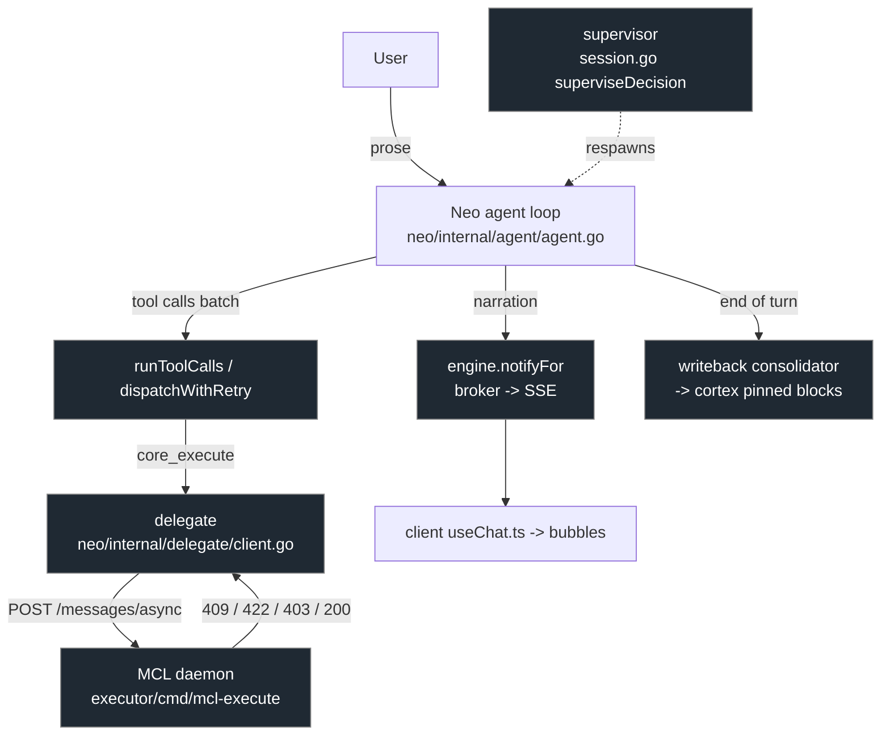

<!-- GENERATED by spec/specgen from spec/ kvx — DO NOT EDIT. Edit the .kvx source and regenerate. -->

See the full design below: the seam map (which finding lives where), the shared error taxonomy (transient | deterministic | conflict/idempotent-join | pending/clarify), the attach-to-existing flow that lets the existing approval gate appear, the narration coalescing + jargon-scrub model, the memory-consistency changes, the explicit non-goals (the signed MCL walk and the gate UI), and the preserved invariants.

# Design — Neo Execution Reliability (the conversational seam)

## Overview

This feature hardens the **conversational-orchestration seam** that wraps Neo's
agent loop around the MCL execution daemon. It is the layer where a user's
request becomes one or more `core_execute` delegations, where tool failures are
retried, where the supervisor respawns agents, where narration is emitted to
the chat stream, and where durable learnings are written back to cortex.

A deep audit (findings `NE-1`..`NE-15`, stored in cortex under
`matrix://knowledge/audit/neo-execution` and `…/neo-memory`) established a clear
result: **the rigorous MCL walk is solid; every fracture lives at the seam.**
The MCL pipeline already has a closed failure taxonomy mapped to plain language,
a deterministic final-answer turn on every terminal branch, a bounded replan
loop, and a fail-open critic. The conversational layer around it does not share
that discipline.

The motivating incident was a token launch ("SPARK") that looped: the first
`core_execute` submission succeeded and parked at the spend-approval gate, but
every re-submission hit a hard `HTTP 409 "intent already exists in async
registry"`. Neo treated the 409 as a transient error, reworded the intent, and
re-submitted — defeating its own no-progress guard, spamming an identical
"routing this through the secure execution path" bubble each time, and leaking
raw protocol jargon ("409 conflict", "async registry", raw intent IDs) into the
user-visible Thinking panel. The approval the user needed to advance the launch
never appeared, because the run never got past the conflict to reach the gate.

## Scope

**In scope** — four clusters from the audit:

- **Cluster A — Error taxonomy & retry policy** (`NE-1`, `NE-4`, `NE-5`,
  `NE-13`, `NE-15`): classify failures as transient / deterministic / pending;
  attach-to-existing on conflict instead of hard-failing; stop blind retries of
  deterministic failures at both the tool-dispatch ladder and the supervisor;
  detect semantic (not just byte-identical) retry loops; carry structured
  clarify back as an actionable slot-fill rather than reworded prose.
- **Cluster B — UX / transparency** (`NE-2`, `NE-12`, `NE-14`): translate every
  daemon/delegate error into a jargon-free tool result at the boundary; guard
  the reasoning channel so protocol internals never reach the Thinking panel;
  coalesce identical consecutive narration on both the server emit and the
  client reducer.
- **Cluster C — Concurrency / idempotency** (`NE-3`): dedup or serialize
  non-idempotent tool calls (especially `core_execute`) within a single
  assistant batch so a turn cannot self-collide.
- **Cluster D — Memory consistency** (`NE-7`, `NE-8`, `NE-9`, `NE-10`): compute
  the pinned block once per turn instead of once per loop step; gate the
  unsupervised write-back that pins facts/corrections to every turn; add
  deterministic near-duplicate suppression before the LLM relation classify;
  make learned-guidance application consistent turn-to-turn.

**Explicitly OUT of scope (do not touch):**

- The **rigorous MCL walk** — `compile → plan → walk → synthesize → critic →
  emitFinalTurn` in `executor/cmd/mcl-execute` and the `MCL/` compiler. Its
  failure taxonomy, replan loop, and final-turn composition are correct and
  stay byte-for-byte as they are on the signed path (D11 replay invariant).
- The **inline spend-approval UI**. `apps/client/components/matrix/neo/
  wallet-approval.tsx` (slide-to-sign + deny, wired to `gate.invoked` and the
  gate-answer endpoint) is already correct and well-built. The SPARK launch
  never showed it only because the run looped before reaching the gate; fixing
  the seam (Cluster A) makes the existing gate appear. No gate-UI rewrite.
- The **key-isolation backstop**. Neo holds no signing key; all value crosses
  into MCL. Nothing here changes that.

## The seam map (where each finding lives)



| Finding | Location | Defect |
|---|---|---|
| NE-1 | `agent.go` `dispatchWithRetry` | retries every tool error uniformly; no transient/deterministic split |
| NE-13 | daemon `CreateQueued`; `delegate` `submit()` | hard 409 on re-submit; no attach-to-existing |
| NE-3 | `agent.go` `runToolCalls` | concurrent batch assumes independence; `core_execute` self-collides |
| NE-4 | `agent.go` no-progress guard | keys on exact args; reworded retry evades it |
| NE-5 | `session.go` `superviseDecision` | respawns on any non-clean exit; no failure classification |
| NE-15 | `delegate` `classifyTerminal` | structured 422 clarify flattened to text; no slot-fill re-POST |
| NE-12 | `delegate` → `tools.go` → reasoning stream | raw daemon errors reach the model + Thinking panel |
| NE-2 / NE-14 | `engine.notifyFor`; client `useChat.ts` | identical narration not coalesced server or client |
| NE-7 | `agent.go` loop; `pager.Pinned` | pinned block recomputed every loop step (~4-5 cortex scans/step) |
| NE-8 | `writeback/consolidator.go` | unsupervised extraction pins facts/corrections to every turn |
| NE-9 | `consolidator.classifyRelation` | dedup fails open to "write as NEW" → bloat/contradictions |
| NE-10 | `pager.LearnedGuidance` | lossy top-8 → learned behavior applied inconsistently |

## The error taxonomy (Cluster A core)

A single shared classification, applied at both the delegate boundary and the
tool-dispatch ladder:

- **transient** — connection refused, timeout, 5xx, rate-limit. Safe to retry
  with backoff (current behavior, bounded).
- **deterministic** — 4xx that will recur identically on re-submit: validation
  reject, leash denial (403 with an error code), wrong-strategy / not-owner,
  unparseable intent. **Never retried.** Surfaced to the model as a clean,
  jargon-free, terminal tool result so the agent stops-and-asks or reports an
  honest partial instead of looping.
- **conflict (idempotent-join)** — the deterministic-ID 409 "already exists".
  Not a failure: it means the work is already in flight. The delegate resolves
  the existing intent's status and **attaches** (polls + services its gate)
  rather than failing.
- **pending / clarify** — a structured 422 needing slot values. Carried back as
  an actionable slot-fill (ask the user the typed questions, then re-POST the
  **same** intent id with `slot_values`), not reworded prose.

```mermaid
sequenceDiagram
  participant Neo as Neo loop
  participant Del as delegate
  participant D as MCL daemon
  Neo->>Del: core_execute(prose)
  Del->>D: POST /messages/async
  D-->>Del: 409 already exists (intent X)
  Note over Del: classify = conflict (NOT transient)
  Del->>D: GET /messages/async/X + /intents/X/gates
  D-->>Del: status=executing, pending spend gate
  Del-->>Neo: attach; surface gate.invoked
  Note over Neo: approval UI appears (existing wallet-approval.tsx)
```

## Narration & transparency (Cluster B)

- **Boundary translation**: the delegate maps every daemon error/status to a
  plain-language tool result drawn from a fixed phrase set (mirroring the
  daemon's own `failureMessage` taxonomy), never interpolating raw bodies, HTTP
  codes, intent IDs, or the strings in the jargon-deny set `{MCL, cortex,
  Merkle, replay, SSE, D11, broker, envelope, async registry, calldata, ABI,
  nonce, 4xx/5xx codes}`.
- **Reasoning-channel guard**: because the model can still name internals it
  inferred, the reasoning (`chat.delta` channel=`reasoning`) is scrubbed/guarded
  against the same deny set before it streams to the Thinking panel.
- **Narration coalescing**: identical consecutive assistant narration collapses
  to a single bubble (with a subtle repeat indicator if it recurs) — enforced at
  the server emit (`notifyFor`) AND defensively in the client reducer
  (`useChat.ts`), which currently dedups only by `intentId:seq`. The promise
  notify ("I'll ask before anything spends") is emitted only once a submission
  actually succeeds, not on every attempt.

## Memory consistency (Cluster D)

- **Per-turn pinned compute**: hoist `pager.Pinned(...)` out of the per-step
  loop; compute once per turn (or cache + invalidate on a cortex write). No
  behavioral change to the pinned content, only to how often it is recomputed.
- **Supervised pinning**: the write-back's `user_facts` and `corrections` (which
  are pinned to every future turn) require a confidence threshold + provenance,
  and become visible/editable to the user. Decay unused pinned corrections.
- **Deterministic dedup first**: run an embedding-cosine near-duplicate check
  before the LLM relation classify; treat classify failure as "skip write if
  highly similar" rather than "write as NEW".
- **Consistent guidance**: separate always-pinned learned corrections (capacity-
  managed by consolidation) from salience-ranked soft preferences, and
  consolidate overlapping guidance so the pinned top-N is not crowded by
  near-duplicates.

## Invariants preserved

- Neo holds no signing key; all value-moving work crosses into MCL unchanged.
- The signed MCL path and its journaled bytes are untouched (D11 replay
  byte-identity holds); all seam changes affect only non-signed transcript /
  tool-result / retry-control behavior.
- Honest partials over false success: a deterministic failure becomes an honest
  "couldn't do X because Y" turn, never a silent loop and never a fake success.
